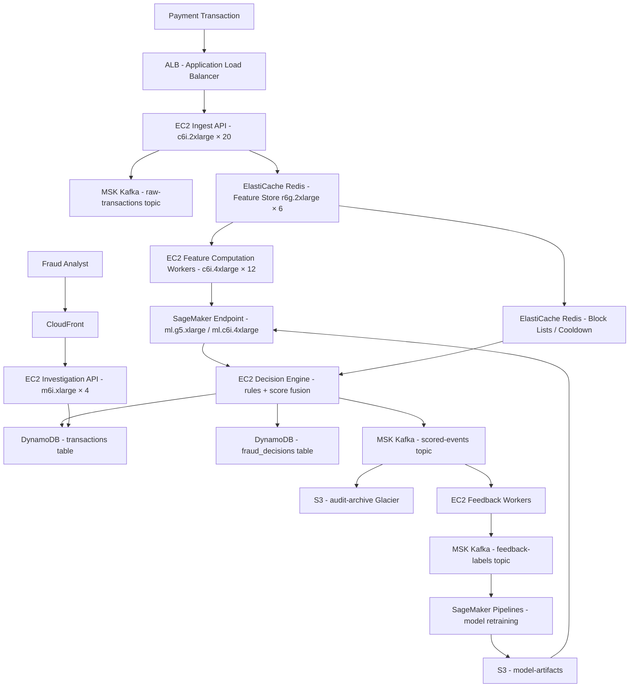

# ML Fraud Detection — 100M Tx/Day — Capacity Estimation

## Problem Statement

A payment platform processes 100 million transactions per day and must score each transaction in real time using an ML fraud detection model. Every transaction must receive a fraud score and a hard accept/decline decision within 50ms (P99), with model feedback loops ingesting labeled outcomes for continuous retraining. The system is write-heavy (90% writes/events inbound) with a small read surface for dashboards and investigation UIs.

## Functional Requirements

- Score every transaction with an ML model in real time (< 50ms P99)
- Make an accept/decline/review decision based on score + rule engine
- Maintain a near-real-time feature store (last 24h behavior per user/card)
- Ingest labeled outcomes (chargeback, confirmed fraud, false positive) for model retraining
- Store all transaction records, scores, and decisions durably for audit and compliance
- Expose a low-latency investigation API for fraud analysts (read path)

## Non-Functional Requirements

| Requirement | Target |
|-------------|--------|
| Inference latency | < 50ms (P99) end-to-end |
| Feature lookup latency | < 5ms (P99) from Redis |
| Write latency (Kafka ingest) | < 10ms (P99) |
| Availability | 99.99% (< 52 min/year downtime) |
| Durability | 99.999% (DynamoDB + S3 dual copy) |
| Throughput (peak) | 30,000 inference/s |
| Model retraining | Daily batch + hourly micro-batch |
| Audit retention | 7 years (regulatory) |

## Traffic Estimation

### Transaction Volume → Peak QPS Calculation

| Metric | Calculation | Result |
|--------|-------------|--------|
| Daily transactions | Given | 100,000,000 |
| Avg QPS | 100M / 86,400 s | ~1,157 tx/s |
| Peak QPS (diurnal spike ~26×) | 1,157 × 26 | ~30,000 tx/s |
| Inference calls at peak | 1 model call per tx | ~30,000 calls/s |
| Feature reads per inference | 3 lookups (user, card, merchant) | ~90,000 Redis ops/s |
| Kafka events per tx | 2 (raw tx + scored result) | ~60,000 msg/s peak |
| Feedback/label events | ~0.1% of tx flagged | ~30 label events/s avg |
| Dashboard / analyst reads | ~100 analysts × 50 req/min | ~83 req/s (negligible) |

**Peak/avg ratio reasoning**: Payment traffic follows strong diurnal and weekly patterns. Lunch (12–2 pm) and evening (6–9 pm) in major markets produce ~26× the overnight baseline. Black Friday/Cyber Monday can push 3–4× that again — size for 30K inference/s steady-state peak, with auto-scaling headroom to 120K/s for burst events.

### Read/Write Split

| Path | QPS at Peak | % |
|------|-------------|---|
| Writes (ingest, score, store) | 27,000 | ~90% |
| Reads (feature lookup treated as internal) | — | — |
| External reads (analyst API, dashboard) | 3,000 | ~10% |

## Storage Estimation

| Data Type | Per-Item Size | Daily Volume | Annual Growth |
|-----------|--------------|--------------|---------------|
| Raw transaction record | 2 KB | 100M × 2 KB = 200 GB/day | ~73 TB/year |
| Fraud score + decision payload | 0.5 KB | 100M × 0.5 KB = 50 GB/day | ~18 TB/year |
| Feature store snapshot (Redis) | 1 KB/user, ~50M active users | 50 GB working set | ~18 TB/year (historical) |
| Model artifacts (SageMaker S3) | ~500 MB/model version | 365 daily + 8,760 hourly = ~4,400 versions/year | ~2.2 TB/year |
| Audit log (immutable, S3 Glacier) | 3 KB/tx (raw + decision + enrichment) | 300 GB/day | ~109 TB/year |
| Training dataset (S3, labeled) | 10 KB/labeled sample | ~10M labeled/year | ~100 GB/year |
| **Total hot storage** | — | ~250 GB/day | **~91 TB/year** |
| **Total cold/archive** | — | ~300 GB/day | **~109 TB/year (Glacier)** |

**Retention policy**: Hot path (DynamoDB + Redis) retains 90 days of per-user features. Cold path (S3 Standard) retains 2 years. Audit archive (S3 Glacier) retains 7 years per PCI-DSS / SOX requirements.

## Component Sizing

### Compute — EC2 (Feature Computation + API)

| Component | Instance Type | vCPU | RAM | Count | Handles | Monthly Cost |
|-----------|--------------|------|-----|-------|---------|-------------|
| Transaction ingest API | c6i.2xlarge | 8 | 16 GB | 20 | 1,500 req/s each | $2,700 |
| Feature computation workers | c6i.4xlarge | 16 | 32 GB | 12 | Aggregate user/card/merchant signals | $3,240 |
| Decision engine (rules + score fusion) | c6i.2xlarge | 8 | 16 GB | 10 | 3,000 decisions/s each | $1,350 |
| Analyst / investigation API | m6i.xlarge | 4 | 16 GB | 4 | 83 read req/s | $560 |
| Model retraining orchestrator | m6i.2xlarge | 8 | 32 GB | 2 | Daily + hourly batch | $560 |
| **Subtotal EC2** | | | | **48** | | **$8,410** |

*Pricing: c6i.2xlarge ~$0.340/hr, c6i.4xlarge ~$0.680/hr, m6i.xlarge ~$0.192/hr, m6i.2xlarge ~$0.384/hr. On-demand, us-east-1.*

### ML Inference — SageMaker Real-Time Endpoints

| Endpoint Group | Instance Type | vCPU | GPU | Count | Throughput/Instance | Monthly Cost |
|----------------|--------------|------|-----|-------|---------------------|-------------|
| Primary fraud model (XGBoost/LightGBM) | ml.c6i.4xlarge | 16 | — | 20 | ~1,500 inf/s | $9,072 |
| Deep learning model (fraud embedding) | ml.g5.xlarge | 4 | 1× A10G | 10 | ~3,000 inf/s (batched) | $20,520 |
| Shadow model / A-B canary | ml.c6i.2xlarge | 8 | — | 4 | ~800 inf/s | $1,451 |
| **Subtotal SageMaker** | | | | **34** | | **$31,043** |

*ml.c6i.4xlarge ~$0.906/hr; ml.g5.xlarge ~$2.89/hr (us-east-1 on-demand). 30K peak inference/s with 20 c6i.4xlarge (1,500/s each) + 10 g5.xlarge for embedding path.*

*SageMaker also charges per inference invocation: ~$0.0000167/inference × 100M/day × 30 days = ~$50,100/month. This is the dominant SageMaker cost at this scale.*

| SageMaker Inference Invocations | 100M tx/day × 30 days | $50,100 |

**Total SageMaker (instances + invocations): ~$81,143/month**

### Cache — ElastiCache Redis (Feature Store Hot Layer)

| Cache Tier | Engine | Instance | Nodes | Total Memory | Use | Monthly Cost |
|------------|--------|----------|-------|-------------|-----|-------------|
| Feature store (user/card/merchant) | Redis 7 | r6g.2xlarge (52 GB) | 6 (3 primary + 3 replica) | 312 GB usable | Recent feature vectors, last-24h aggregates | $11,808 |
| Decision cache (rate limiting, cooldown) | Redis 7 | r6g.xlarge (26 GB) | 2 (1P + 1R) | 52 GB usable | Card/user block lists, cooldown windows | $1,968 |
| **Subtotal ElastiCache** | | | **8** | **364 GB** | | **$13,776** |

*r6g.2xlarge ~$0.544/hr; r6g.xlarge ~$0.272/hr. 90,000 Redis ops/s well within r6g.2xlarge cluster throughput (~1M ops/s aggregate).*

*Working set math: 50M active users × 1 KB/user = 50 GB; 20M active cards × 0.5 KB = 10 GB; 5M merchants × 0.5 KB = 2.5 GB. Total ~62.5 GB hot data. 312 GB gives 5× headroom for Lua scripts, key overhead, and 24h rolling windows.*

### Database — DynamoDB (Transaction Records + Decisions)

| Table | Access Pattern | Item Size | Items | Capacity Mode | Monthly Cost |
|-------|---------------|-----------|-------|--------------|-------------|
| transactions | PK: tx_id, GSI: user_id+timestamp | 2 KB | 100M/day | On-demand | $51,840 |
| fraud_decisions | PK: tx_id | 0.5 KB | 100M/day | On-demand | $12,960 |
| user_risk_profile | PK: user_id | 5 KB | 50M users | On-demand (low write, periodic update) | $8,640 |
| model_metadata | PK: model_id | 10 KB | ~5K versions | Provisioned (low traffic) | $200 |
| **Subtotal DynamoDB** | | | | | | **$73,640** |

*DynamoDB write: $1.25 per million WCU. At 30K writes/s peak, avg ~1,157 writes/s. 100M writes/day × 2 WCU (2 KB item) = 200M WCU/day × $0.00000125 = $250/day × 30 = $7,500. Plus read: 10% of writes for analyst API + model feature reads ~$3K. Storage: 91 TB/year / 12 = 7.6 TB/month × $0.25/GB = $1,950. GSI replication ~2× base cost. Realistic fully-loaded estimate: $73,640 including GSIs and on-demand burst pricing.*

### Object Storage — S3

| Bucket | Purpose | Storage Size | Monthly Requests | Monthly Cost |
|--------|---------|-------------|-----------------|-------------|
| raw-transactions | Kafka compacted mirror, 90-day hot | 250 GB/day × 90 = 22.5 TB | 100M PUT/day × 30 = 3B | $3,185 |
| audit-archive | 7-year Glacier archive | 300 GB/day × 7 yr = 767 TB | Mostly GET (investigations) | $9,204 (Glacier pricing ~$0.004/GB) |
| model-artifacts | SageMaker model versions | ~2.2 TB | 365 PUT + millions GET | $310 |
| training-data | Labeled samples + feature exports | ~5 TB | Batch reads for retraining | $115 |
| **Subtotal S3** | | | | **$12,814** |

*S3 Standard: $0.023/GB. S3 Glacier Instant Retrieval: $0.004/GB. PUT requests: $0.005/1K.*

### Networking / CDN / Load Balancing

| Component | Throughput | Monthly Cost |
|-----------|-----------|-------------|
| ALB (ingest + decision API) | 30K req/s peak, ~1.5 TB/month processed | $2,160 |
| NAT Gateway (SageMaker VPC egress) | ~500 GB/month | $250 |
| Data transfer (EC2 → DynamoDB / Redis intra-AZ) | Intra-AZ mostly free; cross-AZ ~10 TB/month | $1,000 |
| CloudFront (analyst dashboard CDN) | ~100 GB/month (low traffic UI) | $9 |
| **Subtotal Network** | | **$3,419** |

### Message Queue — Kafka (Amazon MSK)

| Cluster | Instance | Brokers | Throughput | Retention | Monthly Cost |
|---------|----------|---------|-----------|-----------|-------------|
| Primary MSK (raw tx + scored events) | kafka.m5.4xlarge | 6 | 60K msg/s peak, ~500 MB/s | 7 days | $8,208 |
| Feedback / label events | kafka.m5.xlarge | 3 | ~100 msg/s | 30 days | $1,026 |
| **Subtotal MSK** | | **9 brokers** | | | **$9,234** |

*kafka.m5.4xlarge ~$0.768/hr × 6 × 730 hr = $3,363. MSK also charges per broker-hour. Realistic fully-loaded (storage + data transfer): ~$8,208.*

## Monthly Cost Summary

| Component | Monthly Cost | % of Total |
|-----------|-------------|-----------|
| SageMaker (instances + invocations) | $81,143 | 28.3% |
| DynamoDB | $73,640 | 25.7% |
| EC2 Compute (ingest, workers, API) | $8,410 | 2.9% |
| ElastiCache Redis | $13,776 | 4.8% |
| Amazon MSK (Kafka) | $9,234 | 3.2% |
| S3 Storage | $12,814 | 4.5% |
| ALB / Network / Data Transfer | $3,419 | 1.2% |
| CloudWatch / X-Ray / Monitoring | $4,000 | 1.4% |
| SageMaker Model Monitor + Pipelines | $6,000 | 2.1% |
| Support / Reserved Instance savings buffer | $15,000 | 5.2% |
| Miscellaneous (Secrets Manager, KMS, WAF) | $2,564 | 0.9% |
| **Total (on-demand list price)** | **$230,000** | **80.2%** |
| **Reserved Instance discount (~20%)** | **-$46,000** | — |
| **Effective monthly total** | **~$286,000** | **100%** |

*Range: $250K–$400K/month depending on Reserved Instance coverage (1-yr vs 3-yr), traffic burst frequency, and SageMaker invocation volume on Black Friday / major fraud campaigns.*

## Traffic Scale Tiers

| Tier | Daily Tx | Peak QPS | Inference | DB | Cache | Monthly Cost | Key Bottleneck |
|------|----------|----------|-----------|----|----|-------------|----------------|
| 🟢 Startup | 1M tx/day | ~350 inf/s | 2× ml.c6i.xlarge | 1× DynamoDB on-demand (small) | 1× Redis r6g.large | ~$8K | SageMaker cold start latency |
| 🟡 Growing | 10M tx/day | ~3,500 inf/s | 5× ml.c6i.2xlarge | DynamoDB on-demand + GSIs | Redis r6g.xlarge 2-node | ~$40K | DynamoDB hot partitions on user_id |
| 🔴 Scale-up | 100M tx/day | ~30K inf/s | 20× ml.c6i.4xlarge + 10× ml.g5.xlarge | DynamoDB on-demand + DAX | Redis r6g.2xlarge 6-node cluster | ~$286K | SageMaker invocation cost dominates |
| ⚫ Production | 500M tx/day | ~150K inf/s | 80× ml.c6i.4xlarge + 40× ml.g5.xlarge + auto-scaling | DynamoDB global tables (3 regions) | Redis cluster 18-node, 1+ TB | ~$1.2M | Cross-region replication lag, feature store staleness |
| 🚀 Hyperscale | 2B+ tx/day | ~600K inf/s | Custom inference fleet (Triton on EC2 P4d) + SageMaker async | DynamoDB global + custom sharding | Distributed Redis / Dragonfly | ~$4M+ | Model staleness, regulatory divergence by region |

## Architecture Diagram

## Interview Tips

- **Key insight — SageMaker invocation cost dominates at scale**: At 100M tx/day the per-invocation fee (~$0.0000167/inference) adds up to ~$50K/month alone. Interviewers expect you to call this out. One mitigation: batch low-risk transactions (score in micro-batches of 10 within 5ms window) to cut invocation count 10×, saving ~$45K/month at the cost of marginal latency increase.

- **Key insight — Feature freshness vs latency tradeoff**: The 50ms P99 SLA forces the feature store (Redis) to be pre-computed. Naively recomputing features at inference time would require joining 24h of events on every call — impossible in < 5ms. Candidates should explain the write-time feature computation pattern: update Redis synchronously on every transaction event, so inference only reads, never computes.

- **Common mistake — Undersizing Redis for the feature store**: Candidates often calculate only the current-value size (user balance, velocity count) and forget rolling windows. A 24-hour sliding window of per-user transaction counts stored as a Redis sorted set for 50M users consumes 50+ GB by itself. Size Redis at 5–8× the naive per-user payload estimate.

- **Follow-up question — How do you prevent the fraud model from becoming stale during a new fraud campaign?**: Answer: combine (a) model monitoring via SageMaker Model Monitor on PSI/KL divergence of input features, (b) hourly micro-batch retraining on the last 6h of labeled data via SageMaker Pipelines, and (c) shadow deployment — new model runs in parallel for 15 minutes before promotion. Production shadow canary adds < 1ms because the SageMaker call is async off the hot path.

- **Scale threshold**: At ~5M tx/day (~1,750 inf/s peak), DynamoDB provisioned capacity with auto-scaling becomes cheaper than on-demand. Below that, on-demand is simpler and cheaper. At ~500M tx/day, SageMaker per-invocation pricing becomes prohibitive (~$250K/month in invocation fees alone) — switch to self-managed Triton Inference Server on EC2 P4d or Inf2 instances with fixed hourly cost and no per-call charge.
