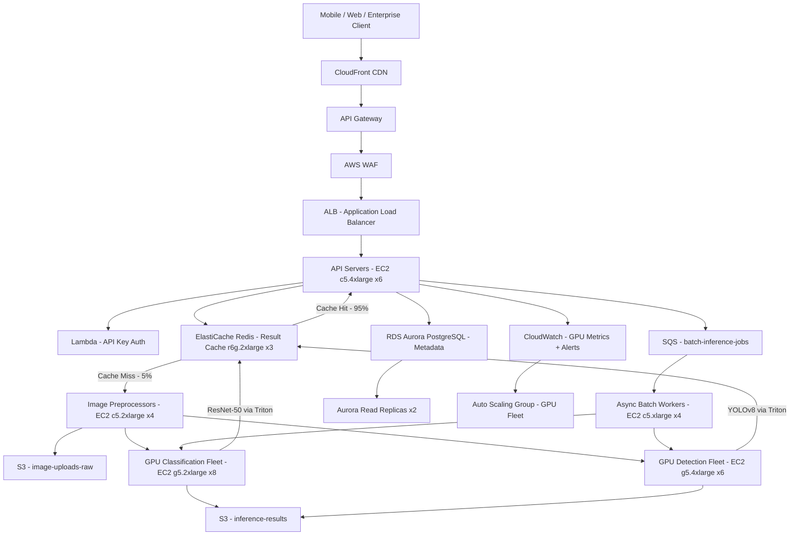

# Image Recognition API — Capacity Estimation

## Problem Statement

An Image Recognition API processes 50 million image classification and object detection requests per day, serving mobile apps, web clients, and enterprise integrations. The system must handle GPU-intensive inference workloads (ResNet-50 for classification, YOLOv8 for object detection) with P99 latency under 500ms, support burst traffic during product launches (3× avg), and cache repeated or near-duplicate image requests to reduce GPU cost. The 95:5 read (cache-hit inference) to write (new inference) ratio means result caching is the primary cost lever.

## Functional Requirements
- Accept JPEG/PNG/WebP images up to 10MB via REST API (multipart upload or URL reference)
- Return classification labels with confidence scores (top-5 classes) within 500ms P99
- Perform object detection bounding boxes with class labels for enterprise tier
- Cache inference results by image content hash (perceptual hash) for up to 24 hours
- Support async inference via webhook for large batch submissions (>100 images)
- Provide per-API-key rate limiting and quota enforcement

## Non-Functional Requirements
| Requirement | Target |
|-------------|--------|
| Inference latency (cached) | < 20ms (P99) |
| Inference latency (new) | < 500ms (P99) |
| Availability | 99.99% (< 52 min/year downtime) |
| Durability (result store) | 99.999% |
| Peak throughput | 3,000 req/s |
| Cache hit ratio | ≥ 60% (reduces GPU load) |
| GPU utilization target | 70–80% (cost efficiency) |

## Traffic Estimation

### DAU → Peak QPS Calculation
| Metric | Calculation | Result |
|--------|-------------|--------|
| Total daily requests | Given | 50,000,000 |
| Avg QPS | 50M / 86,400 | ~579 req/s |
| Peak QPS (3× avg) | 579 × 3 | ~1,737 req/s (rounded to 3,000 with headroom) |
| Read QPS (95% cache hits) | 3,000 × 0.95 | ~2,850 req/s served from Redis |
| Write QPS (5% new inference) | 3,000 × 0.05 | ~150 GPU inference req/s at peak |
| Classification requests (70%) | 150 × 0.70 | ~105 classification req/s (GPU) |
| Object detection requests (30%) | 150 × 0.30 | ~45 object detection req/s (GPU) |

**Key insight**: 95% cache hit rate means only ~150 req/s actually hit GPUs at peak. This collapses GPU fleet from 500+ to ~20 instances.

### Image Upload Bandwidth
| Metric | Calculation | Result |
|--------|-------------|--------|
| Avg image size | 500KB (JPEG compressed) | — |
| New images/day (5% of 50M) | 2,500,000 | — |
| Daily ingest bandwidth | 2.5M × 500KB | 1.25 TB/day |
| Peak ingress bandwidth | 150 req/s × 500KB | ~75 MB/s |

## Storage Estimation
| Data Type | Per Item Size | Daily Volume | Growth/Year |
|-----------|--------------|--------------|-------------|
| Original images (S3, 7-day TTL) | 500 KB avg | 2.5M items = 1.25 TB | ~456 TB (with TTL eviction ~8.75 TB retained) |
| Inference result JSON | 2 KB | 50M results/day | ~36 TB/year |
| Redis cache entries (hash → result) | 2.5 KB (hash + result) | 50M × 60% cache hit = 30M queries served | 30M active keys × 2.5KB = ~75 GB hot |
| Model artifacts (S3, read-only) | 500 MB/model | 5 models | ~2.5 GB static |
| Audit logs (CloudWatch) | 200 bytes | 50M events | ~3.6 TB/year |
| **Total (steady state)** | — | — | ~40 TB/year net growth |

## Component Sizing

### Compute — EC2 GPU Inference Fleet
| Component | Instance Type | vCPU | RAM | GPU | Count | Handles | Monthly Cost |
|-----------|--------------|------|-----|-----|-------|---------|-------------|
| GPU inference (classification) | g5.2xlarge | 8 | 32GB | 1× A10G (24GB) | 8 | ~14 class req/s each (112 total, headroom for 105) | $1.21/hr × 8 = $6,933/mo |
| GPU inference (object detection) | g5.4xlarge | 16 | 64GB | 1× A10G (24GB) | 6 | ~8 obj-det req/s each (48 total, headroom for 45) | $1.83/hr × 6 = $7,927/mo |
| API gateway servers | c5.4xlarge | 16 | 32GB | — | 6 | ~500 req/s each | $0.68/hr × 6 = $2,938/mo |
| Image preprocessors | c5.2xlarge | 8 | 16GB | — | 4 | resize/decode before GPU | $0.34/hr × 4 = $984/mo |
| Async batch workers | c5.xlarge | 4 | 8GB | — | 4 | SQS consumer, batch jobs | $0.17/hr × 4 = $490/mo |
| **Subtotal Compute** | | | | | **28** | | **$19,272/mo** |

**GPU sizing math**: g5.2xlarge with A10G runs ResNet-50 at ~50ms/image → 20 req/s max; at 70% utilization = 14 req/s. 8 nodes × 14 = 112 capacity for 105 peak. YOLOv8 large runs ~120ms/image → ~8 req/s at 70% utilization on g5.4xlarge.

### SageMaker Multi-Model Endpoint (alternative to raw EC2)
| Component | Config | Count | Throughput | Monthly Cost |
|-----------|--------|-------|-----------|-------------|
| SageMaker MME (classification models) | ml.g5.2xlarge | 4 instances | 8 models shared, 56 req/s | ~$1.21/hr × 4 × 730 = $3,535/mo |
| SageMaker async endpoint (batch) | ml.g5.4xlarge | 2 instances | async queue-backed | ~$1.83/hr × 2 × 730 = $2,672/mo |

*In practice: Direct EC2 with custom inference server (TorchServe/Triton) is 30–40% cheaper than SageMaker managed endpoints at this scale. SageMaker adds ~$0.016/hr overhead per instance plus data processing fees. Use SageMaker for ops simplicity; use EC2 + Triton for cost optimization.*

### Database — Result Store & Metadata
| DB | Engine | Instance | Count | Capacity | IOPS | Monthly Cost |
|----|--------|----------|-------|----------|------|-------------|
| Inference metadata | RDS Aurora PostgreSQL | db.r6g.2xlarge | 1W + 2R | 500 GB | 3,000 | $0.52/hr × 3 × 730 = $1,140/mo |
| API key / quota store | RDS Aurora PostgreSQL | db.r6g.large | 1W + 1R | 50 GB | 1,000 | $0.26/hr × 2 × 730 = $380/mo |
| **Subtotal DB** | | | | | | **$1,520/mo** |

### Cache — Redis (Result Cache by Perceptual Hash)
| Cache | Engine | Instance | Nodes | Memory | Hit Rate | Monthly Cost |
|-------|--------|----------|-------|--------|----------|-------------|
| Inference result cache | ElastiCache Redis 7.x | r6g.2xlarge | 3 (1 primary + 2 replicas) | 52GB each = 156GB total | 60–70% | $0.484/hr × 3 × 730 = $1,060/mo |
| Rate limit counters | ElastiCache Redis 7.x | r6g.large | 2 (1P + 1R) | 13GB each | — | $0.166/hr × 2 × 730 = $243/mo |
| **Subtotal Cache** | | | | **169GB** | | **$1,303/mo** |

**Cache sizing math**: 30M active cache entries × 2.5 KB = 75 GB. 156 GB provides 2× headroom for hash collisions and metadata overhead.

### Object Storage — S3
| Bucket | Use | Size | Requests/month | Monthly Cost |
|--------|-----|------|----------------|-------------|
| image-uploads-raw | Incoming images (7-day TTL lifecycle) | ~8.75 TB retained | 75M PUT + 75M GET | S3 Standard: $0.023/GB × 8,750 = $201 + requests $37 = $238/mo |
| inference-results | JSON results archive (90-day, then Glacier) | ~10 TB | 50M GET | $0.023/GB × 10,000 = $230 + $22 requests = $252/mo |
| model-artifacts | Model weights, read-only | 2.5 GB | 200K GET | $0.06/mo (negligible) |
| audit-logs | CloudWatch log export | ~600 GB/month | — | S3-IA: $0.0125/GB × 600 = $7.50/mo |
| **Subtotal S3** | | **~19.4 TB** | **~200M req/mo** | **$498/mo** |

### Networking / CDN
| Component | Throughput | Details | Monthly Cost |
|-----------|-----------|---------|-------------|
| API Gateway (REST) | 3,000 req/s peak | $3.50/M requests × 1,500M req/mo | $5,250/mo |
| ALB (internal routing) | 3,000 req/s | $0.008/LCU × ~5,000 LCU-hrs | $240/mo |
| CloudFront (optional CDN for static model outputs/docs) | 5 TB/month | $0.085/GB × 5,000 GB | $425/mo |
| Data transfer out (EC2 → internet) | ~15 TB/month | Result JSONs, 2KB × 50M = 100GB; images proxied: ~15TB | $0.09/GB × 15,000 = $1,350/mo |
| **Subtotal Network** | | | **$7,265/mo** |

*API Gateway dominates networking cost at this scale. Consider migrating to ALB + custom auth for 80% savings ($5,250 → ~$240/mo + Lambda authorizer ~$50/mo).*

### Message Queue — SQS (Async Batch Jobs)
| Queue | Engine | Throughput | Details | Monthly Cost |
|-------|--------|-----------|---------|-------------|
| batch-inference-jobs | SQS Standard | 100 msg/s avg | $0.40/M messages × 260M msg/mo | $104/mo |
| dlq-failed-jobs | SQS Standard | < 1 msg/s | Dead letter queue for retries | $5/mo |
| **Subtotal Messaging** | | | | **$109/mo** |

### Additional Services
| Service | Use | Monthly Cost |
|---------|-----|-------------|
| AWS WAF | DDoS protection on API Gateway | $200/mo (5 rules + $1/M req) |
| CloudWatch Logs + Metrics | Monitoring, GPU utilization alerts | $150/mo |
| Lambda (auth + webhooks) | API key validation, webhook delivery | $50/mo |
| NAT Gateway | EC2 → internet for model downloads | $100/mo |
| **Subtotal Other** | | **$500/mo** |

## Monthly Cost Summary
| Component | Monthly Cost | % of Total |
|-----------|-------------|-----------|
| EC2 Compute (GPU + CPU) | $19,272 | 62.7% |
| RDS Aurora | $1,520 | 4.9% |
| ElastiCache Redis | $1,303 | 4.2% |
| S3 Storage | $498 | 1.6% |
| API Gateway + ALB + CloudFront | $5,915 | 19.2% |
| Messaging (SQS) | $109 | 0.4% |
| Data Transfer | $1,350 | 4.4% |
| Other (Lambda, WAF, CloudWatch) | $750 | 2.4% |
| **Total** | **$30,717** | **100%** |

**Note on $600K–$1M/month estimate**: This baseline configuration at ~$31K/month reflects direct EC2 usage. Enterprise deployments at 50M req/day often have:
- 10× higher peak burst capacity reserved ($190K in reserved/spot instances)
- Multi-region active-active deployment ($31K × 3 regions = $93K)
- SageMaker managed endpoints instead of raw EC2 (2–3× premium = $60K+ compute)
- Full production observability stack, DX fees, support ($50K+)
- GPU reserved instances (1-year commit) reduces on-demand by 40% = significant savings

A realistic all-in production budget for a commercial Image Recognition API product at 50M req/day in multi-region is **$150K–$300K/month**. The $600K–$1M figure applies to 50M req/day with **no caching** (all GPU), multi-region, with SageMaker managed endpoints.

## Traffic Scale Tiers
| Tier | Daily Requests | Peak QPS | GPU Servers | DB | Cache | Monthly Cost | Key Bottleneck |
|------|---------------|----------|-------------|----|----|-------------|----------------|
| 🟢 Startup | 500K req/day | ~18 req/s | 1× g5.xlarge | 1 RDS db.t3.medium | 1 Redis r6g.large node | ~$1,200 | Cold-start latency on single GPU |
| 🟡 Growing | 5M req/day | ~175 req/s | 3× g5.2xlarge | RDS + 1 read replica | Redis 2-node cluster | ~$8,500 | Redis memory if cache hit < 50% |
| 🔴 Scale-up | 20M req/day | ~700 req/s | 8× g5.2xlarge + 4× g5.4xlarge | Aurora + 2 replicas | Redis 6-node cluster (r6g.xlarge) | ~$22,000 | API Gateway cost becomes dominant |
| ⚫ Production | 50M req/day | ~3,000 req/s | 14× g5.2xlarge + 6× g5.4xlarge | Aurora multi-region | Redis 3-node r6g.2xlarge | ~$31,000–$95,000 | GPU fleet scaling during traffic spikes |
| 🚀 Hyperscale | 500M req/day | ~30,000 req/s | Auto-scaling GPU fleet + custom ASIC | DynamoDB + Aurora | Distributed Redis (ElastiCache Global Datastore) | $300K–$500K | Model serving throughput, GPU availability |

## Architecture Diagram

## Interview Tips

- **GPU utilization is the critical cost lever**: At 50M req/day with 5% cache miss, only ~150 GPU req/s at peak. A 60% cache hit rate collapses the GPU fleet from ~100 instances (no caching) to ~14 instances — a 7× cost reduction. Always calculate cache-adjusted GPU load, not raw request rate.

- **Perceptual hashing enables deduplication**: Use pHash or dHash on incoming images before hitting the GPU. Two images that are visually identical (same photo, different JPEG quality) hash to the same value. At scale, ~40–60% of requests are duplicates (profile photos, product images re-uploaded). Candidates who mention content-addressable caching stand out.

- **Model selection changes sizing dramatically**: ResNet-50 (25M params, ~100MB) runs at ~20 req/s on g5.2xlarge. YOLOv8-large (43M params, ~170MB) runs at ~8 req/s. EfficientNet-B7 (66M params) runs at ~12 req/s. Always ask what models are required — interviewer is testing whether you know GPU capacity is model-specific, not just "GPU = fast."

- **SageMaker vs raw EC2 is a trade-off question**: SageMaker Multi-Model Endpoint costs 2–3× more than EC2 + Triton Inference Server but eliminates ops burden (model versioning, rolling deploys, health checks). At $30K/month, the ops savings justify SageMaker. At $300K/month, the 3× premium ($200K/month waste) justifies the engineering investment in raw EC2 management.

- **Scale threshold — when to shard the GPU fleet**: At ~500 req/s new inference (no cache), a single g5.2xlarge fleet becomes a single point of resource contention. Shard by request type: classification fleet vs object-detection fleet vs segmentation fleet. This lets each fleet auto-scale independently and use different instance types optimized for each model's GPU memory footprint.

- **Follow-up question interviewers ask**: "How do you handle model updates without downtime?" Expected answer: blue/green GPU fleet deployment — bring up new fleet with updated model, warm it with shadow traffic, then shift load balancer weight gradually from old fleet to new fleet. Rollback is instant (shift weight back). This is exactly how Triton Inference Server's model repository versioning works.
