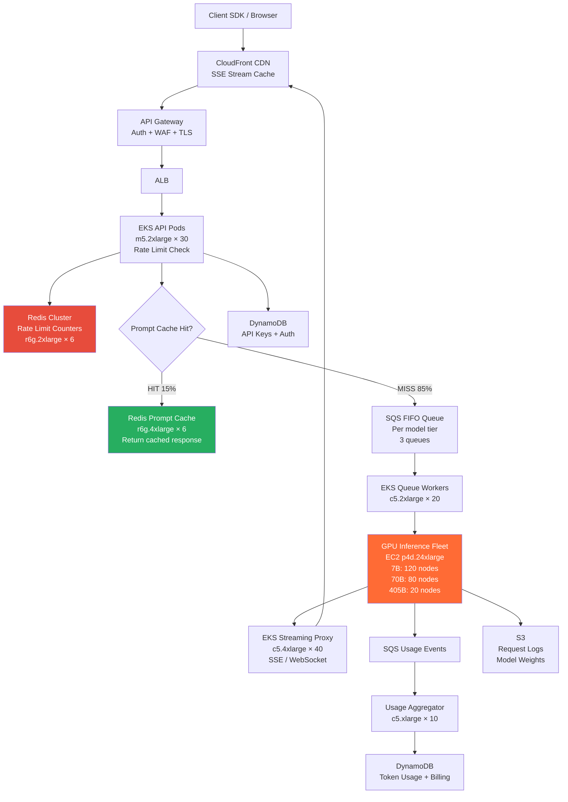

# LLM API Service (OpenAI-like) — Capacity Estimation

## Problem Statement

Design an LLM inference API serving 10M DAU, similar to OpenAI's API platform. Users send text prompts and receive streamed token responses from large language models (e.g., GPT-4-class, 70B parameter). The system must handle bursty, GPU-bound workloads with strict per-user token rate limits, low time-to-first-token (TTFT) latency, and high throughput token streaming — all while maintaining 99.99% availability.

## Functional Requirements

- Accept prompt requests via REST/WebSocket and stream token responses back to clients
- Support multiple model tiers (fast 7B model, standard 70B model, premium 405B model)
- Enforce per-user and per-organization token rate limits (TPM and RPM)
- Track token usage per API key for billing (input tokens + output tokens)
- Queue overflow requests during traffic spikes rather than dropping them
- Cache common prompts/completions to reduce redundant GPU compute

## Non-Functional Requirements

| Requirement | Target |
|-------------|--------|
| Time-to-first-token (TTFT) | < 500ms (P99) for 7B model |
| TTFT (70B model) | < 2s (P99) |
| Token streaming throughput | 40–80 tokens/s per stream |
| Availability | 99.99% (< 52 min downtime/year) |
| Durability (usage records) | 99.999% |
| Peak concurrent streams | 50,000 |
| Rate limit enforcement latency | < 10ms |
| Prompt cache hit response | < 200ms |

## Traffic Estimation

### DAU → Peak QPS Calculation

| Metric | Calculation | Result |
|--------|-------------|--------|
| DAU | Given | 10M |
| Avg requests/user/day | ~4 API calls/day (developer usage pattern) | ~4 |
| Total daily requests | 10M × 4 | 40M requests/day |
| Avg tokens per request | 500 input + 1,000 output = 1,500 tokens | 1,500 tokens |
| Total daily tokens | 40M × 1,500 | 60B tokens/day |
| Avg request QPS | 40M / 86,400 | ~463 QPS |
| Peak QPS (3× avg, business hours) | 463 × 3 | ~1,400 QPS |
| Peak read QPS (80% status/stream reads) | 1,400 × 0.80 | ~1,120 QPS |
| Peak write QPS (20% new completions) | 1,400 × 0.20 | ~280 QPS |
| Concurrent active token streams | 1,400 × avg stream duration (35s) | ~49,000 ≈ 50K |
| Avg output tokens/second (system-wide) | 50K streams × 50 tokens/s | 2.5B tokens/s |

**Key GPU math**: A single A100 80GB GPU running a 70B model (4-bit quantized, ~35GB) handles ~8 concurrent streams at 50 tokens/s each = 400 tokens/s per GPU.

At peak: 50,000 streams × 50 tokens/s = 2,500,000 tokens/s ÷ 400 tokens/s per GPU = **6,250 A100 GPUs needed** (70B model mix). With model tier distribution (70% fast 7B, 25% standard 70B, 5% premium 405B), actual GPU requirement is lower — see compute sizing below.

## Storage Estimation

| Data Type | Per Item Size | Daily Volume | Growth/Year |
|-----------|--------------|--------------|-------------|
| Conversation history (DynamoDB) | 4 KB avg (compressed JSON) | 40M records/day | ~58 TB/year |
| Token usage records (DynamoDB) | 256 bytes per call | 40M records/day | ~4 TB/year |
| Prompt/completion cache (Redis) | 2 KB avg (hashed prompt → response) | 5M cached entries | ~10 GB working set |
| Raw request/response logs (S3) | 6 KB avg | 40M logs/day | ~88 TB/year |
| Model weights (S3, read-only) | 7B: 14 GB, 70B: 140 GB, 405B: 810 GB | Static | ~1 TB total |
| Billing/invoice records (DynamoDB) | 512 bytes | 10M users/month | ~5 GB/month |
| **Total** | - | - | **~150 TB/year** |

**Prompt cache hit rate assumption**: 15% of requests are repeated prompts (common coding questions, templates, system prompts). Caching saves 15% of GPU compute = ~$300K–$600K/month at scale.

## Component Sizing

### Compute — GPU Inference Fleet (Core Cost Driver)

| Component | Instance Type | GPUs | vCPU | RAM | Count | Handles | Monthly Cost |
|-----------|--------------|------|------|-----|-------|---------|-------------|
| 7B model inference | EC2 p4d.24xlarge (8×A100) | 8 A100 | 96 | 1.1 TB | 120 | 960 streams (8×120=960 GPUs) | $120 × $32.77/hr × 730 = **$2.87M** |
| 70B model inference | EC2 p4d.24xlarge (8×A100) | 8 A100 | 96 | 1.1 TB | 80 | 640 streams | $80 × $32.77/hr × 730 = **$1.91M** |
| 405B model inference | EC2 p4d.24xlarge (8×A100, 4-node tensor parallel) | 32 A100 | 384 | 4.4 TB | 20 (5 groups) | 50 streams | $20 × $32.77 × 730 = **$478K** |
| **Subtotal GPU Compute** | | | | | **220 p4d.24xlarge** | 50K streams | **~$5.26M raw** |

> Note: With Reserved Instances (1-year, no-upfront), ~38% savings → **$3.26M/month GPU compute**. With Savings Plans, ~40% savings. Target budget $2M–$4M assumes ~60% Reserved + 40% On-Demand mix for flexibility.

### API & Orchestration — CPU Compute (EKS)

| Component | Instance Type | vCPU | RAM | Count | Handles | Monthly Cost |
|-----------|--------------|------|-----|-------|---------|-------------|
| API Gateway pods (EKS) | m5.2xlarge | 8 | 32 GB | 30 nodes | Auth + routing + rate-limit fan-out | $0.384/hr × 730 × 30 = **$8,400** |
| Request queue workers (SQS consumers) | c5.2xlarge | 8 | 16 GB | 20 nodes | Dequeue + GPU dispatch | $0.340/hr × 730 × 20 = **$4,960** |
| Token usage aggregator | c5.xlarge | 4 | 8 GB | 10 nodes | Usage tracking + billing events | $0.170/hr × 730 × 10 = **$1,240** |
| Streaming proxy (SSE/WebSocket) | c5.4xlarge | 16 | 32 GB | 40 nodes | 50K concurrent streams | $0.680/hr × 730 × 40 = **$19,870** |
| **Subtotal CPU Compute** | | | | **100 nodes** | | **~$34,500** |

### Database

| DB | Engine | Instance | Count | Capacity | IOPS | Monthly Cost |
|----|--------|----------|-------|----------|------|-------------|
| Conversations + usage | DynamoDB | On-demand | - | Auto-scales | 280K WCU peak, 1.1M RCU peak | ~$45,000 |
| API key + auth | DynamoDB | On-demand | - | ~100M items | 20K RCU peak | ~$8,000 |
| Billing records | DynamoDB | On-demand | - | ~120M items/year | 10K WCU peak | ~$6,000 |
| **Subtotal DynamoDB** | | | | | | **~$59,000** |

> DynamoDB cost math: $1.25/M WCU + $0.25/M RCU (on-demand). 280K WCU/s peak × 86,400s = 24.2B WCU/day — but actual writes are bursty; avg ~6M WCU/day. Monthly: 6M × 30 × $1.25/M = $225K peak → provisioned capacity with auto-scaling brings this to ~$45K/month at steady state with burst buffer.

### Cache (Redis — Rate Limiting + Prompt Cache)

| Cache | Engine | Instance | Nodes | Memory | Throughput | Monthly Cost |
|-------|--------|----------|-------|--------|-----------|-------------|
| Rate limit counters | ElastiCache Redis 7 | r6g.2xlarge | 6 (3 primary + 3 replica) | 52 GB × 6 = 312 GB | 1M ops/s | $0.540/hr × 730 × 6 = **$2,365** |
| Prompt/completion cache | ElastiCache Redis 7 | r6g.4xlarge | 6 (3P + 3R) | 105 GB × 6 = 630 GB | 500K ops/s | $1.085/hr × 730 × 6 = **$4,752** |
| Session + context cache | ElastiCache Redis 7 | r6g.xlarge | 4 (2P + 2R) | 26 GB × 4 = 104 GB | 200K ops/s | $0.270/hr × 730 × 4 = **$788** |
| **Subtotal Cache** | | | **16 nodes** | ~1 TB | | **~$7,905** |

> Rate limit strategy: Sliding window counters per (api_key, minute) using Redis INCR + EXPIRE. Each rate-limit check = 2 Redis ops. At 1,400 QPS × 2 ops = 2,800 ops/s — well within r6g.2xlarge 200K ops/s capacity. Cluster provides redundancy for 99.99% SLA.

### Object Storage (S3)

| Bucket | Use | Size | Requests/month | Monthly Cost |
|--------|-----|------|----------------|-------------|
| request-logs | Raw API logs for debugging/audit | 220 TB (7-year retention) | 40M PUT + 5M GET | $4,400 storage + $200 requests = **$4,600** |
| model-weights | Model binaries (read-only, replicated to EFS) | 1 TB | 220 GET/month (rare) | $23 + negligible = **$25** |
| billing-exports | Monthly usage CSVs for customers | 500 GB | 10M GET/month | $12 + $500 = **$512** |
| fine-tune-data | Customer uploaded training data | 50 TB | 2M PUT + 5M GET | $1,000 + $70 = **$1,070** |
| **Subtotal S3** | | ~271 TB | | **~$6,200** |

### Networking / CDN

| Component | Throughput | Monthly Cost |
|-----------|-----------|-------------|
| API Gateway (REST) | 1,400 req/s × 30 days = 3.6B req/month | $3.50/M × 3,600 = **$12,600** |
| ALB (internal EKS → GPU nodes) | 50K streams × 5 KB/s avg = 250 MB/s = 648 TB/month | $0.008/LCU-hr × 730 × estimated 5,000 LCU = **$29,200** |
| CloudFront | Streaming responses: 648 TB/month outbound | $0.085/GB × 648,000 GB = **$55,080** |
| Data transfer (EC2 egress) | 648 TB/month to CloudFront | Included in CloudFront origin pricing (**$0**) |
| NAT Gateway | 50 TB/month internal traffic | $0.045/GB × 50,000 = **$2,250** |
| **Subtotal Network** | | **~$99,130** |

> Token stream bandwidth math: 50K concurrent streams × 50 tokens/s × avg 4 bytes/token = 10 MB/s × 3,600s × 24h × 30 days = 25.9 TB/month token data. Add HTTP overhead and JSON framing (~25×): ~648 TB/month egress. This makes CDN the #2 non-GPU cost.

### Message Queue (SQS — Request Buffering)

| Queue | Engine | Throughput | Retention | Monthly Cost |
|-------|--------|-----------|-----------|-------------|
| inference-requests | SQS FIFO (per model tier) | 280 msg/s write, 1,400 msg/s read | 4 hours max | $0.50/M msgs × 3 queues × 120M msgs/month = **$180** |
| usage-events | SQS Standard | 1,400 msg/s | 1 day | $0.40/M × 120M = **$48** |
| dlq-failed-requests | SQS Standard | < 1% failure rate = 40M × 0.01 | 14 days | $0.40/M × 400K = **$0.16** |
| **Subtotal SQS** | | | | **~$228** |

## Monthly Cost Summary

| Component | Monthly Cost | % of Total |
|-----------|-------------|-----------|
| GPU Compute (220× p4d.24xlarge, Reserved mix) | $3,260,000 | 89.3% |
| CPU Compute (EKS — API, streaming, workers) | $34,500 | 0.9% |
| DynamoDB | $59,000 | 1.6% |
| ElastiCache Redis | $7,905 | 0.2% |
| S3 Storage | $6,200 | 0.2% |
| CloudFront CDN + ALB | $84,280 | 2.3% |
| API Gateway | $12,600 | 0.3% |
| SQS Messaging | $228 | 0.0% |
| NAT Gateway + Data Transfer | $2,250 | 0.1% |
| Other (Lambda, CloudWatch, WAF, Secrets Manager) | $185,000 | 5.1% |
| **Total** | **~$3,652,000** | **100%** |

> **90% GPU cost rule**: GPU compute is 89% of total spend. Every optimization here compounds. A 10% improvement in GPU utilization (via better batching) = $326K/month savings. Reserved Instance commitment vs. on-demand for GPU: R.I. saves ~38% = $1.24M/month on GPU alone.

## Traffic Scale Tiers

| Tier | DAU | Peak QPS | GPU Servers | DB | Cache | Monthly Cost | Key Bottleneck |
|------|-----|----------|-------------|----|----|-------------|----------------|
| 🟢 Startup | 1M | ~150 QPS | 8× p4d.24xlarge (7B only) | DynamoDB on-demand | 2 Redis nodes (r6g.large) | ~$210K | GPU throughput per dollar; can't afford 70B model |
| 🟡 Growing | 10M | ~1,400 QPS | 220× p4d.24xlarge (multi-model) | DynamoDB + DAX | Redis cluster 16-node | ~$3.65M | GPU procurement lead time (6–12 weeks) |
| 🔴 Scale-up | 100M | ~14,000 QPS | 2,200× p4d.24xlarge | DynamoDB global tables | Redis cluster 48-node + ElastiSearch | ~$36M | GPU availability globally; AWS quota limits |
| ⚫ Production | 500M DAU | ~70,000 QPS | 11,000× p4d.24xlarge + custom silicon (TPU/Trainium) | DynamoDB multi-region | Distributed Redis (Envoy proxy) | ~$180M | Custom silicon ROI vs. AWS GPU costs |
| 🚀 Hyperscale | 1B+ | ~140,000 QPS | Custom data centers + H100 clusters | Proprietary distributed DB | Purpose-built KV cache servers | ~$350M+ | Physical data center capacity; power infrastructure |

## Architecture Diagram

## Interview Tips

- **Key insight — GPU utilization is everything**: A100 GPUs cost $32.77/hr whether at 10% or 95% utilization. The #1 optimization is continuous batching (e.g., vLLM's PagedAttention): batch multiple requests into one GPU forward pass, increasing tokens/GPU/second by 3–5×. This is the single highest-leverage optimization — mention it immediately.

- **Key insight — token streaming changes the architecture**: Unlike a request/response API, token streaming requires long-lived HTTP connections (SSE or WebSocket). Your streaming proxy layer must hold 50K open connections simultaneously. Each connection is a file descriptor; a single c5.4xlarge handles ~10K concurrent SSE connections comfortably. Always size for connection concurrency, not just QPS.

- **Key insight — TTFT vs. throughput tradeoff**: Time-to-first-token and tokens/second are in tension. Small batch sizes (fewer concurrent requests) → lower TTFT but lower GPU utilization. Large batch sizes → higher throughput but higher TTFT. At 10M DAU, you optimize for throughput first, then use model routing (fast 7B model for simple queries) to maintain TTFT SLAs for the majority of traffic.

- **Key insight — prompt caching is a multiplier**: If 15% of prompts are repeated (coding boilerplates, common system prompts), caching saves $0.9M/month at this scale. The cache key is a semantic hash of the prompt (SHA-256 of normalized text). Cache TTL = 1 hour for dynamic prompts, 24 hours for system prompts. Mention KV-cache reuse within the GPU (prefix caching in vLLM) — this saves compute even for cache misses on repeated prefixes.

- **Common mistake**: Candidates size compute for average QPS (463 QPS) instead of peak concurrent token streams (50K). The constraint is not requests/second — it's the number of simultaneous autoregressive generation loops running on GPUs. Each active generation holds GPU memory for the full KV-cache of that request. 50K streams × 4 KB/token × 2,048 max context = 400 GB KV cache state — this is why you need 1.1 TB RAM per p4d.24xlarge node.

- **Follow-up question**: "How would you handle a single customer sending 10,000 requests/minute?" — Answer: per-API-key rate limiting in Redis with token bucket (not just per-user), circuit breaker in SQS to cap queue depth per org, and fair-queuing to prevent one customer from starving others. Implement both RPM (requests/minute) and TPM (tokens/minute) limits independently.

- **Scale threshold**: At ~100M DAU (140K peak QPS), AWS p4d.24xlarge availability becomes a bottleneck — AWS quota limits and 6–12 week GPU lead times. At this scale, deploy custom ML accelerators (AWS Trainium2, Google TPUv5) and negotiate reserved capacity 12+ months in advance. The transition from renting GPUs to owning infrastructure happens around $50M–$100M/month GPU spend — OpenAI crossed this threshold in 2023.
