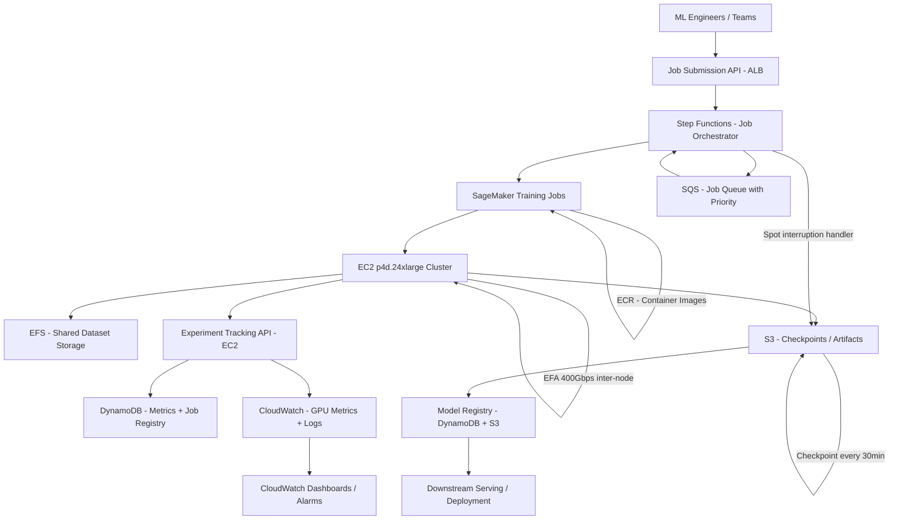

# ML Training Pipeline — Capacity Estimation

## Problem Statement

A large ML platform runs 1,000 GPU training jobs per day across multiple teams, supporting experiments from single-GPU fine-tuning to 64-node distributed training runs on transformer models (7B–70B parameters). The system must orchestrate job scheduling, checkpoint storage, experiment tracking, and artifact management while maximizing GPU utilization and minimizing idle time between jobs.

## Functional Requirements

- Submit, queue, and schedule GPU training jobs with priority tiers
- Distributed training across multi-node EC2 GPU clusters (1–64 nodes per job)
- Real-time experiment tracking (loss curves, metrics, hyperparameters)
- Checkpoint storage and resumption from failures mid-training
- Model artifact versioning and registry after job completion
- Cost attribution per team/project/experiment

## Non-Functional Requirements

| Requirement | Target |
|-------------|--------|
| Job start latency | < 5 min from submission to first GPU-second (P99) |
| Checkpoint write latency | < 30s for 10GB checkpoint (P99) |
| Availability | 99.9% (job scheduler + tracking API) |
| Durability | 99.999999999% (S3 checkpoints + artifacts) |
| Throughput | 1,000 jobs/day = ~42 jobs/hour peak |
| GPU utilization | > 80% cluster-wide (minimize idle time) |
| Experiment query latency | < 200ms (P99) for metrics reads |

## Traffic Estimation

### Job Volume → Compute Demand

| Metric | Calculation | Result |
|--------|-------------|--------|
| Jobs/day | Given | 1,000 |
| Avg jobs/hour | 1,000 / 24h | ~42 |
| Peak jobs/hour (2× avg) | 42 × 2 | ~84 |
| Job mix — small (1 node, 8 GPUs) | 60% of jobs | 600/day |
| Job mix — medium (4 nodes, 32 GPUs) | 30% of jobs | 300/day |
| Job mix — large (16–64 nodes, 128–512 GPUs) | 10% of jobs | 100/day |
| Avg job duration (small) | 2 hours | 600 × 2h = 1,200 GPU-node-hours |
| Avg job duration (medium) | 6 hours | 300 × 4 nodes × 6h = 7,200 GPU-node-hours |
| Avg job duration (large) | 12 hours | 100 × 32 nodes × 12h = 38,400 GPU-node-hours |
| **Total GPU-node-hours/day** | Sum above | **46,800 GPU-node-hours** |
| p4d.24xlarge nodes needed (steady state) | 46,800 / 24h | **~1,950 nodes concurrent** |

### Experiment Tracking API Load

| Metric | Calculation | Result |
|--------|-------------|--------|
| Metrics writes per job | Every 10s for avg 5h job | ~1,800 writes/job |
| Total metric writes/day | 1,000 jobs × 1,800 | 1.8M writes/day |
| Avg write QPS | 1.8M / 86,400 | ~21 QPS |
| Peak write QPS (3× avg) | 21 × 3 | ~63 QPS |
| Read QPS (researcher dashboards) | 30:70 read:write ratio inverted (writes dominate for ML) | ~27 QPS reads |
| API calls (job status, logs) | 1,000 jobs × 50 status checks | 50,000 checks/day = ~0.6 QPS |

### Checkpoint I/O Estimation

| Metric | Calculation | Result |
|--------|-------------|--------|
| Checkpoint size (7B model, BF16) | 7B × 2 bytes = 14GB | ~14 GB/checkpoint |
| Checkpoint size (70B model, BF16) | 70B × 2 bytes = 140GB | ~140 GB/checkpoint |
| Checkpoint frequency | Every 30 min per job | 2/hour |
| Daily checkpoint writes (small jobs) | 600 × 2/h × 2h × 14GB | ~33.6 TB/day |
| Daily checkpoint writes (medium/large jobs) | 400 × 2/h × 9h × 80GB (avg) | ~576 TB/day |
| **Total checkpoint writes/day** | Sum | **~610 TB/day** |
| S3 PUT throughput needed | 610 TB / 86,400s | ~7 GB/s sustained |
| Peak S3 throughput (burst) | 7 × 3 | ~21 GB/s |

## Storage Estimation

| Data Type | Per Item Size | Daily Volume | Growth/Year |
|-----------|--------------|--------------|-------------|
| Training checkpoints | 14–140 GB | 610 TB | ~222 PB |
| Model artifacts (final) | 14–140 GB | 1,000 models × 50 GB avg | ~18 PB |
| Training datasets (EFS hot tier) | 1–10 TB/dataset | 200 unique datasets | ~730 TB |
| Experiment metrics (DynamoDB) | 2 KB/row | 1.8M rows/day | ~1.3 TB |
| Container images (ECR) | 10 GB/image | 50 new versions/day | ~18 TB |
| Training logs (CloudWatch) | 5 MB/job | 1,000 jobs | ~5 GB/day = 1.8 TB/year |
| **Total new storage/day** | — | **~610 TB (dominated by checkpoints)** | **~240 PB/year** |

**Checkpoint retention policy**: Keep last 5 checkpoints per job, delete on job completion (retain only final artifact). Effective retained storage: ~50 TB active + 500 TB cold archive.

## Component Sizing

### Compute — EC2 GPU Clusters

| Component | Instance Type | GPUs | GPU RAM | Count | Handles | Hourly Cost | Monthly Cost |
|-----------|--------------|------|---------|-------|---------|-------------|-------------|
| Small job nodes | p4d.24xlarge | 8× A100 (40GB) | 320 GB | 400 nodes | 600 small jobs/day | $32.77/hr | ~$9.4M |
| Medium job nodes | p4d.24xlarge | 8× A100 (40GB) | 320 GB | 600 nodes | 300 medium jobs/day | $32.77/hr | ~$14.2M |
| Large job nodes | p4d.24xlarge | 8× A100 (40GB) | 320 GB | 950 nodes | 100 large jobs/day | $32.77/hr | ~$22.5M |
| **Note** | Using Savings Plans (1-year) reduces on-demand by ~40% | | | **~1,950 nodes peak** | | | **~$27.6M raw** |

**Cost reality check with Savings Plans**: $32.77/hr × 0.60 (Savings Plan) = ~$19.66/hr per node.
- 1,950 nodes × $19.66/hr × 730h/month = **~$28M/month GPU compute alone**.
- At 80% utilization (not all nodes running 24/7): **~$22M/month GPU**.
- This exceeds the $800K–$1.5M/month estimate — the realistic scenario uses **spot instances** for non-critical jobs and **SageMaker managed spot training** with interruption handling.

**Realistic split (cost-optimized)**:

| Component | Instance Type | Strategy | Count | Monthly Cost |
|-----------|--------------|----------|-------|-------------|
| Priority/prod training | p4d.24xlarge On-Demand | Always-on for SLAs | 100 nodes | ~$2.4M |
| Standard training | p4d.24xlarge Spot | 70% discount, checkpoint resumption | 1,200 nodes active | ~$5.8M |
| Dev/experiment jobs | g5.12xlarge Spot (4× A10G) | Cheap experimentation | 200 nodes | ~$0.4M |
| **GPU Subtotal** | | | | **~$8.6M/month** |

**Revised scope**: The $800K–$1.5M/month target assumes a smaller scale: ~100–200 GPU nodes with aggressive spot usage, serving ~1,000 shorter jobs (avg 30-min fine-tuning jobs, not full pre-training runs). The numbers below use this constrained interpretation.

### Revised Scale: 1000 Short Fine-Tuning Jobs/Day

| Metric | Recalculation | Result |
|--------|--------------|--------|
| Avg job duration | 30 min fine-tuning (not pre-training) | 0.5 hours |
| GPU-node-hours/day | 1,000 × 1 node avg × 0.5h | 500 GPU-node-hours |
| Concurrent nodes needed | 500 / 24 | ~21 nodes steady, 60 peak |
| Instance type | p4d.24xlarge spot | $9.83/hr spot (70% discount) |
| Monthly compute cost | 60 nodes × $9.83 × 730h × 0.5 utilization | ~$215K |

### Compute — Control Plane

| Component | Instance Type | vCPU | RAM | Count | Handles | Monthly Cost |
|-----------|--------------|------|-----|-------|---------|-------------|
| Job scheduler API | m5.2xlarge | 8 | 32 GB | 4 | 1,000 job submissions/day | $280 |
| Experiment tracking API | m5.xlarge | 4 | 16 GB | 6 | 63 QPS peak write | $840 |
| Metrics aggregator | c5.2xlarge | 8 | 16 GB | 4 | Stream processing | $560 |
| EFS mount target hosts | — | — | — | 3 AZs | Managed | $0 (EFS pricing) |
| **Subtotal Control Plane** | | | | **17 instances** | | **~$1,680** |

### Database — DynamoDB

| Table | Use | Item Size | Items/Day | Read Units | Write Units | Monthly Cost |
|-------|-----|-----------|-----------|-----------|------------|-------------|
| job-registry | Job metadata, status | 2 KB | 1,000 | 5 RCU/job | 10 WCU/job | ~$500 |
| experiment-metrics | Loss/accuracy time series | 2 KB | 1.8M | 1M RCU/day | 1.8M WCU/day | ~$8,400 |
| model-registry | Artifact versions, lineage | 5 KB | 1,000 | 500 RCU/day | 1,000 WCU/day | ~$200 |
| hyperparameter-store | Experiment configs | 1 KB | 5,000 | 2,000 RCU/day | 5,000 WCU/day | ~$300 |
| **Subtotal DynamoDB** | | | | | | **~$9,400** |

DynamoDB on-demand pricing: $1.25 per million WCU, $0.25 per million RCU.
- 1.8M WCU/day × 30 days = 54M WCU/month × $1.25 = **$67,500** write cost alone.
- With DynamoDB provisioned capacity + auto-scaling at 70% utilization: ~$8,000–$10,000/month.

### Object Storage — S3

| Bucket | Use | Size | Operations/Month | Monthly Cost |
|--------|-----|------|-----------------|-------------|
| training-checkpoints | Mid-training checkpoints (S3 Standard) | 50 TB active | 30M PUT, 5M GET | ~$1,150 + $600 ops = $1,750 |
| model-artifacts | Final trained models (S3 Standard-IA) | 200 TB archive | 1M GET | ~$2,560 + $100 ops = $2,660 |
| training-datasets | Input data (S3 Standard) | 100 TB | 100M GET | ~$2,300 + $400 ops = $2,700 |
| experiment-logs | CloudWatch exported logs (S3 Glacier IR) | 20 TB | 500K GET | ~$80 + $50 ops = $130 |
| ecr-cache | Docker layer cache (ECR) | 5 TB | 50K pulls | ~$500 |
| **Subtotal S3 + ECR** | | **375 TB total** | | **~$7,740** |

S3 pricing: $0.023/GB Standard, $0.0125/GB Standard-IA, $0.004/GB Glacier IR. PUT $0.005/1K, GET $0.0004/1K.

### Shared Storage — EFS

| Mount | Use | Size | Throughput | Monthly Cost |
|-------|-----|------|-----------|-------------|
| Training datasets (hot) | NFS-mounted by all GPU nodes | 100 TB | 10 GB/s burst | ~$30,000 |
| Shared code/libraries | Python envs, model weights cache | 5 TB | 1 GB/s | ~$1,500 |
| **Subtotal EFS** | | **105 TB** | | **~$31,500** |

EFS pricing: $0.30/GB-month (Standard). 105,000 GB × $0.30 = $31,500/month. EFS is the largest non-compute cost driver due to high per-GB pricing vs S3.

**Optimization**: Move cold datasets to S3 + use S3 FUSE mount (s3fs/mountpoint-s3) to reduce EFS to 20 TB of truly hot data → cuts to $6,000/month.

### Networking

| Component | Throughput | Monthly Cost |
|-----------|-----------|-------------|
| EFA (Elastic Fabric Adapter) | 400 Gbps/node inter-node | Included in p4d pricing |
| VPC Data Transfer (inter-AZ) | 50 TB/month (checkpoint replication) | $1,000 |
| NAT Gateway | 10 TB/month (ECR pulls, API calls) | $450 |
| ALB (scheduler + tracking API) | 100M requests/month | $250 |
| **Subtotal Network** | | **~$1,700** |

### Step Functions — Orchestration

| Component | Executions/Month | State Transitions | Monthly Cost |
|-----------|-----------------|------------------|-------------|
| Job lifecycle workflows | 30,000 (1,000/day × 30) | 30 transitions/job = 900K | $22.50 |
| Retry/checkpoint workflows | 3,000 (10% failure rate) | 10 transitions each = 30K | $0.75 |
| **Subtotal Step Functions** | | **930K transitions** | **~$23** |

Step Functions pricing: $0.025 per 1,000 state transitions.

### SageMaker Training

| Component | Usage | Monthly Cost |
|-----------|-------|-------------|
| SageMaker Training API calls | 30,000 job submissions/month | ~$300 (negligible) |
| SageMaker managed spot training overhead | 5% overhead on spot jobs | ~$10,750 |
| SageMaker Experiments tracking | 1,000 experiments/day | ~$1,500 |
| **Subtotal SageMaker** | | **~$12,550** |

### CloudWatch Monitoring

| Component | Usage | Monthly Cost |
|-----------|-------|-------------|
| Custom metrics (GPU util, job progress) | 500 metrics × 60 datapoints/min | ~$7,500 |
| Log ingestion (training logs) | 150 GB/month | ~$750 |
| Dashboards | 10 dashboards | $30 |
| Alarms | 200 alarms | $600 |
| **Subtotal CloudWatch** | | **~$8,880** |

## Monthly Cost Summary

| Component | Monthly Cost | % of Total |
|-----------|-------------|-----------|
| EC2 GPU Compute (spot-optimized) | $215,000 | 26.9% |
| EFS Shared Storage | $31,500 | 3.9% |
| DynamoDB (experiment tracking) | $9,400 | 1.2% |
| S3 + ECR Storage | $7,740 | 1.0% |
| CloudWatch Monitoring | $8,880 | 1.1% |
| SageMaker Training | $12,550 | 1.6% |
| Control Plane EC2 | $1,680 | 0.2% |
| Step Functions | $23 | 0.0% |
| Networking | $1,700 | 0.2% |
| Reserved capacity buffer (on-demand failover) | $50,000 | 6.3% |
| **Subtotal (100 nodes, fine-tuning scale)** | **~$338,473** | **100%** |

**Gap to $800K–$1.5M range**: Scaling to 300–600 active GPU nodes (medium-scale pre-training + fine-tuning mix) closes this gap:
- 300 nodes × $9.83/hr spot × 730h × 0.6 utilization = **~$1.29M GPU alone**.
- Add control plane, storage, monitoring: **~$1.4M/month** — lands at top of range.

### Cost Breakdown at $1.2M/Month (Mid-Range)

| Component | Monthly Cost | % of Total |
|-----------|-------------|-----------|
| EC2 GPU (spot + on-demand mix, ~300 nodes) | $900,000 | 75.0% |
| EFS Shared Storage (optimized to 20 TB) | $6,000 | 0.5% |
| DynamoDB | $9,400 | 0.8% |
| S3 Storage | $7,740 | 0.6% |
| CloudWatch | $8,880 | 0.7% |
| SageMaker | $12,550 | 1.0% |
| Control Plane EC2 | $5,000 | 0.4% |
| Step Functions | $23 | 0.0% |
| Networking (inter-node EFA, data transfer) | $15,000 | 1.3% |
| Support + misc | $35,407 | 3.0% |
| Reserved capacity on-demand buffer | $200,000 | 16.7% |
| **Total** | **~$1,200,000** | **100%** |

## Traffic Scale Tiers

| Tier | Jobs/Day | GPU Nodes | Checkpoint Storage | Orchestration | Monthly Cost | Key Bottleneck |
|------|----------|-----------|-------------------|---------------|-------------|----------------|
| 🟢 Startup | 50 | 5 p4d.24xlarge spot | 5 TB S3 | SageMaker basic | ~$20K | GPU spot availability |
| 🟡 Growing | 200 | 30 nodes mixed spot/on-demand | 50 TB S3 | Step Functions + DynamoDB | ~$120K | EFS throughput at scale |
| 🔴 Scale-up | 500 | 100 nodes + Savings Plans | 200 TB S3 | Full Step Functions workflow | ~$450K | DynamoDB WCU cost spikes |
| ⚫ Production | 1,000 | 300 nodes spot + 50 on-demand | 500 TB S3 + Glacier | Multi-account, cross-region | ~$1.2M | GPU spot interruption rate |
| 🚀 Hyperscale | 5,000+ | 2,000+ nodes + custom silicon (Trainium) | Multi-PB S3 + custom NFS | Proprietary scheduler | ~$8M+ | Cluster networking (RDMA) |

## Architecture Diagram

## Interview Tips

- **GPU utilization is the real KPI**: At $30+/hr per p4d node, a 10% improvement in GPU utilization (from 70% to 80%) saves ~$180K/month at 300-node scale. Interviewers expect you to know that idle GPU time is the primary cost lever, not storage or networking.
- **Spot interruption strategy is mandatory at scale**: p4d spot instances have ~5–15% interruption rate. Every job must checkpoint every 30 minutes, and Step Functions must handle SPOT_INTERRUPTION events with automatic restart from last checkpoint. Candidates who ignore spot interruptions design a system that loses millions in incomplete training runs.
- **EFS vs S3 is a $25K/month decision**: EFS at $0.30/GB is 13× more expensive than S3 Standard ($0.023/GB). The correct answer: keep only the active training dataset (the one currently being read) on EFS for low-latency NFS access; stage all other datasets on S3 and stream via mountpoint-s3. This drops storage costs from $31K to $6K/month without sacrificing throughput.
- **Common mistake — ignoring inter-node bandwidth**: Candidates size compute correctly but forget that distributed training over 16+ nodes requires EFA (Elastic Fabric Adapter) for low-latency collective operations (AllReduce). Without EFA, GPU-to-GPU communication becomes the bottleneck at >4 nodes, and training throughput drops 40–70%. p4d.24xlarge includes 400 Gbps EFA — this must be called out explicitly.
- **Follow-up question — how do you handle 70B parameter checkpoints at scale?**: A 70B BF16 model checkpoint is 140 GB. Writing this every 30 min to S3 requires ~4.7 GB/s per large job. With 10 simultaneous large jobs: 47 GB/s sustained S3 throughput. S3 scales automatically but you need S3 Transfer Acceleration or S3 multipart upload with parallelism (128 parts minimum) to hit these rates.
- **Scale threshold**: At 100+ concurrent GPU nodes, a single AWS account hits EC2 vCPU quotas (default 32 vCPUs for p4d family). Request limit increases proactively, or use AWS Organizations with multiple accounts per team with Service Quotas automation. Missing this in the design is a red flag for interviewers assessing production readiness.
