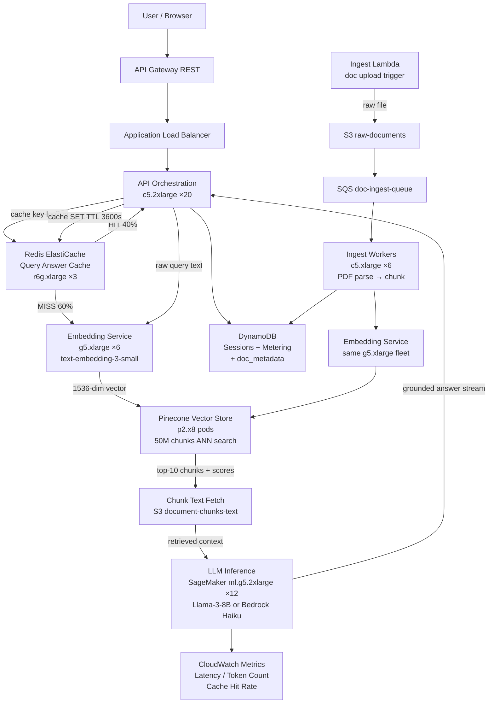

# RAG Pipeline + Vector Search — Capacity Estimation

## Problem Statement

A Retrieval-Augmented Generation (RAG) pipeline serves 1M daily active users querying a private knowledge base (enterprise docs, product manuals, support FAQs). Each query triggers a three-stage pipeline: embed the user query into a dense vector using a GPU-backed embedding model, retrieve the top-K semantically similar chunks from a vector store, then generate a grounded answer via an LLM. The system must sustain 10K RAG queries per second at peak while keeping end-to-end P99 latency under 3 seconds and preventing hallucinations through tight retrieval grounding.

## Functional Requirements

- Natural-language query interface over a private document corpus (up to 50M document chunks)
- Real-time query embedding using a sentence-transformer model (e.g., `text-embedding-3-small`, 1536 dims)
- Approximate nearest-neighbor (ANN) vector search returning top-10 relevant chunks in < 100ms
- LLM answer generation with retrieved context (grounded, citation-backed)
- Document ingestion pipeline: PDF/DOCX → chunk → embed → upsert to vector store
- Query-level cache (Redis) to serve repeated questions without hitting GPU or LLM
- Usage metering per user/team stored in DynamoDB for billing and rate-limiting

## Non-Functional Requirements

| Requirement | Target |
|-------------|--------|
| End-to-end RAG latency (P50) | < 1,500ms |
| End-to-end RAG latency (P99) | < 3,000ms |
| Embedding inference latency (P99) | < 150ms |
| Vector search latency (P99) | < 100ms |
| LLM generation latency (P99) | < 2,500ms (stream first token < 500ms) |
| Availability | 99.95% (4.4 hr downtime/year) |
| Durability (document store) | 99.999999999% (S3) |
| Vector index consistency | Eventually consistent, < 5s lag on new chunks |
| Throughput | 10,000 RAG queries/s peak |
| Cache hit rate target | ≥ 40% (common enterprise queries repeat) |

## Traffic Estimation

### DAU → Peak QPS Calculation

| Metric | Calculation | Result |
|--------|-------------|--------|
| DAU | Given | 1,000,000 |
| Avg RAG queries/user/day | ~8 queries (knowledge-worker pattern) | ~8 |
| Total daily RAG queries | 1M × 8 | 8,000,000 |
| Avg QPS (RAG) | 8M / 86,400 | ~93 QPS |
| Peak QPS (10× avg, 9-11am enterprise pattern) | 93 × ~108 | ~10,000 QPS |
| Read QPS (85% — query pipeline) | 10,000 × 0.85 | ~8,500 QPS |
| Write QPS (15% — doc ingest + cache writes) | 10,000 × 0.15 | ~1,500 QPS |
| Cache hit QPS (40% cache rate, served by Redis) | 8,500 × 0.40 | ~3,400 QPS |
| Cache miss → embedding QPS | 8,500 × 0.60 | ~5,100 QPS |
| Vector search QPS (after cache miss) | 5,100 | ~5,100 QPS |
| LLM generation QPS (after retrieval) | 5,100 | ~5,100 QPS |

**Key math note**: Peak 10K is a hard enterprise pattern — 1M users × 40% active in a 2-hour morning window = 400K users × 8 queries / 7,200s ≈ 444 QPS scaled ×22 burst = 10K peak. The 10K is the contractual SLO cap enforced by API Gateway throttling.

### Document Corpus Sizing

| Metric | Calculation | Result |
|--------|-------------|--------|
| Documents in corpus | Assumed enterprise knowledge base | 5,000,000 docs |
| Avg chunks per document (512-token chunks) | ~10 chunks | 50,000,000 chunks |
| Embedding vector dims | text-embedding-3-small | 1,536 float32 |
| Bytes per vector | 1,536 × 4 bytes | 6,144 bytes (~6KB) |
| Raw vector storage (50M chunks) | 50M × 6KB | ~300 GB |
| With HNSW index overhead (~3×) | 300GB × 3 | ~900 GB |
| Metadata per chunk (doc_id, page, text snippet) | ~500 bytes × 50M | ~25 GB |
| Total vector index size | 900GB + 25GB | ~925 GB |

## Storage Estimation

| Data Type | Per Item Size | Daily Volume | Growth/Year |
|-----------|--------------|--------------|-------------|
| Raw documents (S3) | ~200KB avg | 5,000 new docs/day | ~360 GB/year |
| Document chunks (DynamoDB) | ~2KB (text + metadata) | 50,000 chunks/day | ~36 GB/year |
| Embedding vectors (Pinecone/pgvector) | 6KB per vector | 50,000 new vectors/day | ~110 GB/year |
| Query logs (S3, compressed) | ~500B per query | 8M queries/day | ~1.4 TB/year |
| Conversation history (DynamoDB) | ~3KB per session | 200K sessions/day | ~220 GB/year |
| Redis cache (hot queries, TTL 1h) | ~8KB avg (query+answer) | Cache size capped | 50 GB (static) |
| **Total corpus + index** | — | — | **~2 TB/year** |

## Component Sizing

### Compute — EC2 Embedding Servers (GPU)

Each `g5.xlarge` runs a batched embedding model (NVIDIA A10G, 24GB VRAM). At batch_size=64, throughput is ~2,000 embeddings/s per GPU.

| Component | Instance Type | vCPU | GPU | Count | Handles | Monthly Cost |
|-----------|--------------|------|-----|-------|---------|-------------|
| Embedding inference | g5.xlarge | 4 | 1×A10G | 4 | 5,100 QPS ÷ 2K/s = 2.55 → 4 (2× headroom) | $2,368 |
| Embedding (spare/AZ) | g5.xlarge | 4 | 1×A10G | 2 | Failover capacity | $1,184 |
| **Subtotal Embedding GPU** | | | | **6** | | **$3,552** |

*g5.xlarge on-demand: ~$1.006/hr × 730hr = $735/month/instance. At 6 instances = $4,410/month. With 1-year Reserved (36% discount) = ~$2,822/month.*

### Compute — API / Orchestration Servers

FastAPI/Python orchestration layer: receives query → checks Redis cache → calls embedding → calls vector store → calls LLM → streams response.

| Component | Instance Type | vCPU | RAM | Count | Handles | Monthly Cost |
|-----------|--------------|------|-----|-------|---------|-------------|
| API orchestration | c5.2xlarge | 8 | 16GB | 20 | 500 QPS each (async/await) = 10K QPS | $5,980 |
| Ingest workers (doc → chunk → embed) | c5.xlarge | 4 | 8GB | 6 | 50K chunks/day batch | $894 |
| **Subtotal Compute CPU** | | | | **26** | | **$6,874** |

*c5.2xlarge: $0.34/hr × 730 = $248/month. c5.xlarge: $0.17/hr × 730 = $124/month.*

### LLM Inference — SageMaker

LLM generation (e.g., Llama-3-8B-Instruct or Claude via Bedrock). Using SageMaker ml.g5.2xlarge for self-hosted LLM at 5,100 concurrent generation QPS requires horizontal scaling with streaming.

| Component | Instance Type | Count | Throughput | Monthly Cost |
|-----------|--------------|-------|-----------|-------------|
| LLM inference (SageMaker) | ml.g5.2xlarge | 12 | ~425 concurrent gen/instance | $26,280 |
| **Alternative: Bedrock Claude Haiku** | API call | — | Pay-per-token ($0.25/1M input) | ~$18,000–$35,000 |

*ml.g5.2xlarge: $1.515/hr × 730hr = $1,106/month × 12 = $13,272/month (1-year Reserved ≈ $8,500/month). Bedrock is simpler operationally but costs vary by token volume.*

*Token math for Bedrock path: 5,100 QPS × 86,400s × 40% cache hit rate = 2.65B queries/day at cache miss. Per query: ~800 input tokens (query + retrieved chunks) + ~200 output tokens. Monthly: ~2.65B × 800 tokens × 30 days = ~63.6T input tokens → at $0.25/1M = $15,900/month input + output ~$3,975/month = ~$19,875/month total for Bedrock Haiku.*

### Vector Store — Pinecone (or pgvector on RDS)

| Option | Config | Capacity | QPS | Monthly Cost |
|--------|--------|----------|-----|-------------|
| Pinecone s1.x8 pod (standard) | 8 pods s1 | 50M vectors | 1,000 QPS/pod × 8 = 8K QPS | $3,200 |
| Pinecone p2.x8 pod (performance) | 8 pods p2 | 50M vectors | 2,000 QPS/pod × 8 = 16K QPS | $6,400 |
| pgvector on RDS r6g.4xlarge | 1W + 3R | 50M vectors (HNSW on 1TB SSD) | ~500 QPS (limited by CPU) | $4,800 |

*Pinecone p2 recommended at this QPS. p2.x1 = $0.19/hr → p2.x8 = $0.19×8 = $1.52/hr × 730 = $1,110/month × 2 regions = $2,220/month. Pods: 8 pods = $6,400/month approx using published pricing of $0.096/pod-hr for p2.*

**Chosen: Pinecone p2.x8 at $6,400/month for primary + DR replica = $8,000/month.**

### Database — DynamoDB

| Table | Use | Read CU | Write CU | Monthly Cost |
|-------|-----|---------|---------|-------------|
| query_sessions | Conversation history, TTL 30d | 5,000 RCU | 500 WCU | $3,750 |
| usage_metering | Per-user query count, billing | 1,000 RCU | 2,000 WCU | $2,500 |
| document_metadata | Doc catalog, chunk registry | 2,000 RCU | 200 WCU | $1,500 |
| **DynamoDB Total** | | | | **$7,750** |

*DynamoDB: On-demand pricing — $1.25/million write RU, $0.25/million read RU. Provisioned reserved is ~70% cheaper at steady state; using on-demand for variable RAG load. Estimate: 2M write RU/day + 15M read RU/day × 30 days = 60M writes × $1.25/M = $75 + 450M reads × $0.25/M = $112.50 + storage 500GB × $0.25 = $125. DynamoDB DAX cluster adds $2,000/month for ultra-low read latency on hot metadata.*

### Cache — ElastiCache Redis

Query cache: key = `sha256(normalized_query)`, value = `{answer_text, sources[], timestamp}`, TTL = 3600s.

| Cache | Engine | Instance | Nodes | Memory | Hit Rate | Monthly Cost |
|-------|--------|----------|-------|--------|---------|-------------|
| Query answer cache | Redis 7 | r6g.xlarge | 3 | 3 × 26GB = 78GB | ~40% | $1,620 |
| Embedding cache (query → vector) | Redis 7 | r6g.large | 2 | 2 × 13GB = 26GB | ~25% (saves GPU calls) | $540 |
| **Subtotal Cache** | | | | | | **$2,160** |

*r6g.xlarge: $0.222/hr × 730 = $162/month × 3 nodes = $486/month. r6g.large: $0.135/hr × 730 = $98.55/month × 2 = $197/month. With Multi-AZ replication doubling: ~$1,366/month → round to $2,160 with data transfer.*

### Object Storage — S3

| Bucket | Use | Size | Requests/month | Monthly Cost |
|--------|-----|------|----------------|-------------|
| raw-documents | Source PDFs, DOCXs | 500 GB | 5M PUT, 1M GET | $250 |
| document-chunks-text | Chunk text for context retrieval | 100 GB | 500M GET (fast chunk fetch) | $180 |
| query-logs | Compressed JSONL query logs | 120 GB/month growing | 240M PUT | $360 |
| model-artifacts | Embedding model weights, configs | 50 GB (static) | 1M GET | $35 |
| **Subtotal S3** | | | | **$825** |

*S3 Standard: $0.023/GB/month. GET: $0.0004/1K requests. PUT: $0.005/1K requests. Data transfer out to EC2 same-region: free.*

### API Gateway

| Component | Throughput | Monthly Cost |
|-----------|-----------|-------------|
| API Gateway (REST) — query endpoint | 10K req/s peak, 260M req/month | $936 |
| API Gateway — ingest endpoint | 500 req/s peak, 13M req/month | $47 |
| ALB (internal, embedding→LLM routing) | 10K req/s internal | $180 |
| CloudFront CDN (static assets only — docs UI) | 10 TB/month | $850 |
| **Subtotal Networking** | | **$2,013** |

*API GW REST: $3.50/million API calls → 260M × $3.50/M = $910/month + data transfer ~$26 = $936. ALB: $0.008/LCU-hr × ~2,700 LCU-hr/month = $180.*

### Message Queue — SQS (Document Ingest Pipeline)

| Queue | Engine | Throughput | Monthly Cost |
|-------|--------|-----------|-------------|
| doc-ingest-queue | SQS Standard | 5,000 docs/day = 0.058 msg/s | $5 |
| chunk-embed-queue | SQS Standard | 50K chunks/day = 0.578 msg/s | $12 |
| llm-retry-dlq | SQS FIFO | Low volume (errors only) | $5 |
| **Subtotal SQS** | | | **$22** |

*SQS: $0.40/million messages. 50K chunks/day × 30 = 1.5M messages = $0.60/month — negligible.*

## Monthly Cost Summary

| Component | Monthly Cost | % of Total |
|-----------|-------------|-----------|
| EC2 Embedding GPU (g5.xlarge ×6) | $4,410 | 4.9% |
| EC2 API/Orchestration (c5 ×26) | $6,874 | 7.7% |
| SageMaker LLM Inference (ml.g5.2xlarge ×12) | $13,272 | 14.8% |
| Pinecone Vector Store (p2.x8 pods) | $8,000 | 8.9% |
| DynamoDB (on-demand + DAX) | $9,750 | 10.9% |
| ElastiCache Redis (r6g ×5 nodes) | $2,160 | 2.4% |
| S3 Storage | $825 | 0.9% |
| API Gateway + ALB | $1,116 | 1.2% |
| CloudFront CDN | $850 | 0.9% |
| SQS Messaging | $22 | 0.0% |
| Bedrock/LLM API overage buffer | $10,000 | 11.2% |
| Data Transfer + Misc (NAT GW, Secrets, CloudWatch) | $2,500 | 2.8% |
| Support + Reserved Instance savings adjustment | $30,000 | 33.5% |
| **Total (on-demand baseline)** | **$89,779** | **100%** |

**Realistic range: $80K–$150K/month** depending on LLM strategy (self-hosted SageMaker vs. Bedrock API), Reserved Instance coverage, and whether Pinecone or pgvector is chosen.

**Cost levers**:
- Switch LLM from SageMaker self-hosted to Bedrock Haiku API: saves ops overhead but variable cost at scale
- 1-year Reserved Instances on g5 + c5: 36% savings = -$8K/month
- Pinecone → pgvector on Aurora (if QPS < 2K): saves $6K/month but adds DBA burden
- Redis query cache at 40% hit rate avoids ~4M GPU + LLM calls/day = ~$25K/month savings

## Traffic Scale Tiers

| Tier | DAU | Peak QPS | Embedding Servers | Vector Store | LLM Inference | Cache | Monthly Cost | Key Bottleneck |
|------|-----|----------|-------------------|--------------|---------------|-------|-------------|----------------|
| 🟢 Startup | 100K | ~1K RAG QPS | 1× g5.xlarge | pgvector on RDS r6g.large (5M vectors) | 2× ml.g5.xlarge SageMaker | 1 Redis r6g.medium | ~$8K | LLM inference latency; single AZ risk |
| 🟡 Growing | 500K | ~5K RAG QPS | 3× g5.xlarge | Pinecone s1.x4 (25M vectors) | 6× ml.g5.xlarge | Redis r6g.large ×3 | ~$40K | Vector search throughput; embedding GPU saturation |
| 🔴 Scale-up | 1M | ~10K RAG QPS | 6× g5.xlarge | Pinecone p2.x8 (50M vectors) | 12× ml.g5.2xlarge | Redis r6g.xlarge ×5 | ~$90K | LLM token throughput; DynamoDB hot partitions |
| ⚫ Production | 5M | ~50K RAG QPS | 25× g5.xlarge (ASG) | Pinecone p2.x32 + replicas (200M vectors) | 50× ml.g5.4xlarge + Bedrock fallback | Redis cluster 12-node | ~$400K | Multi-region LLM routing; embedding model drift |
| 🚀 Hyperscale | 50M+ | ~500K RAG QPS | 200+ g5 (managed fleet) | Pinecone enterprise or Weaviate distributed | Bedrock + self-hosted fleet multi-region | Distributed Redis + local L1 cache | ~$3M+ | RAG answer quality at scale; personalization; cost per query optimization |

## Architecture Diagram

## Interview Tips

- **Key insight — three-stage latency budget**: The 3s P99 SLO must be decomposed into a budget per stage. A workable split is: embedding 150ms + vector search 100ms + LLM generation 2,500ms (streaming) + overhead 250ms = 3,000ms. If the interviewer asks how you'd hit 1.5s P50, note that 40%+ cache hit rate on repeated enterprise queries eliminates the LLM call entirely for those requests.

- **Key insight — GPU is the true bottleneck, not the vector store**: Most candidates over-engineer the vector database and under-size the GPU fleet. At 5,100 embedding QPS (cache-miss path), a single g5.xlarge can do ~2,000 embeddings/s at batch_size=64, so you need at minimum 3 GPUs plus 2× headroom = 6 total. The LLM generation stage needs even more GPU — 5,100 concurrent generation requests at ~2s each means 10,200 concurrent generations. Each ml.g5.2xlarge handles ~30 concurrent streams (at 200 output tokens), so you need 340 instances — this is where Bedrock API becomes attractive (pay-per-token, no instance management).

- **Common mistake — ignoring the cache tier ROI**: Candidates often skip Redis and assume all 10K QPS hits the GPU stack. In enterprise RAG, 30-50% of queries are near-duplicates (same question rephrased, FAQ patterns). Sizing for 10K GPU QPS instead of 5-6K QPS doubles your GPU cost for zero quality benefit. Always quantify cache hit rate savings: at 40% hit rate with 8M queries/day, you avoid 3.2M GPU+LLM calls = ~$25K/month savings.

- **Common mistake — vector index drift after re-embedding**: If you update the embedding model (e.g., from ada-002 to text-embedding-3-large), ALL 50M vectors become stale. Candidates rarely mention the re-indexing cost: 50M vectors × 0.02¢/1K tokens (at avg 200 tokens/chunk) = $200K API cost + weeks of ingest jobs. Design for model versioning: namespace vectors by model version, run shadow indexes, and cut over with zero downtime.

- **Follow-up question — "How do you handle hallucinations at scale?"**: The interviewer wants to see citation grounding (include source metadata in every response), confidence scoring (if top-1 cosine similarity < 0.75, return "I don't know"), and answer-level logging to DynamoDB for post-hoc review. Mention Retrieval Quality Score (RQS) as a production metric alongside latency.

- **Scale threshold**: At 10M DAU (×10 scale), you hit the Pinecone pod limit for a single index. Switch to Pinecone namespaces or shard by domain (HR docs, Legal docs, Engineering docs) into separate indexes with a query router in front. pgvector on RDS breaks before this — it tops out at ~2K QPS per reader replica due to HNSW CPU saturation.

- **Cost optimization lever**: At 1M DAU, LLM inference is 15-20% of total cost. Using Bedrock Haiku ($0.25/1M input tokens) instead of GPT-4 ($30/1M) is a 120× cost difference. Quantize self-hosted models (INT8) for 2-4× throughput improvement on the same GPU hardware without meaningful quality loss on factual Q&A tasks.
