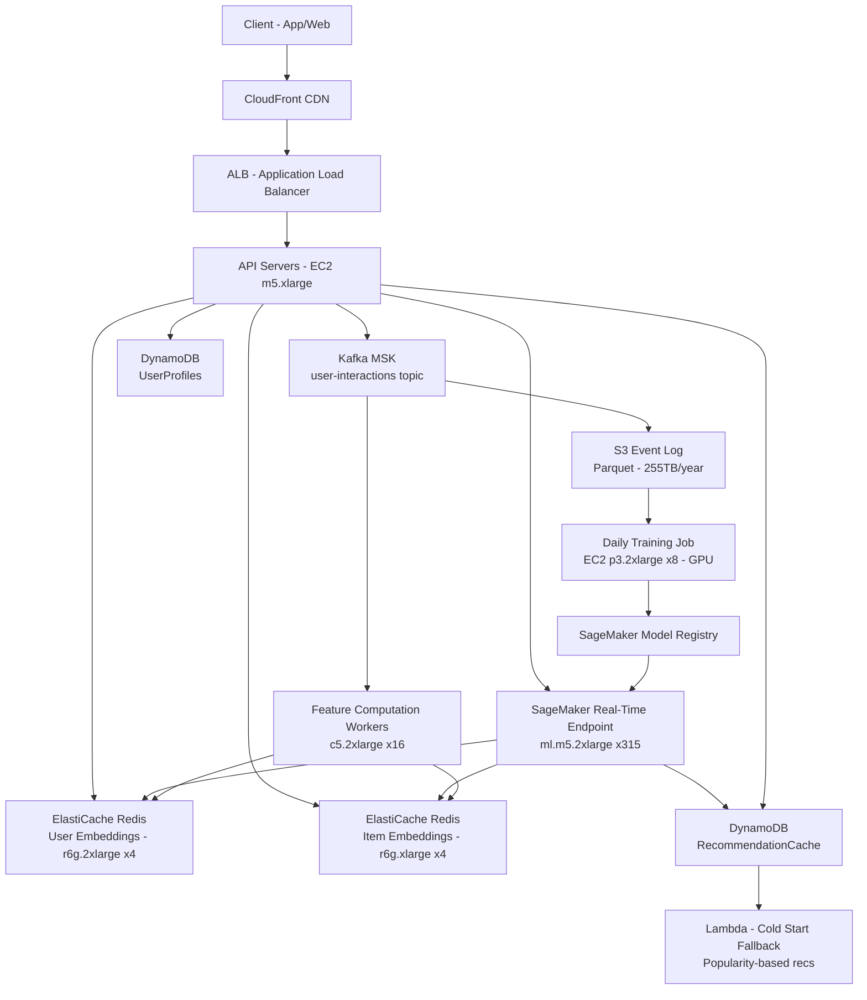

# ML Recommendation Engine — Capacity Estimation

## Problem Statement

Design a real-time ML recommendation engine serving 100M daily active users using collaborative filtering. The system must serve personalized recommendations with P99 latency under 50ms, continuously ingest user interaction events (clicks, views, purchases), update a real-time feature store, and retrain models daily on a GPU cluster without disrupting live inference.

## Functional Requirements

- Serve personalized item recommendations per user within 50ms (P99)
- Ingest user interaction events (clicks, views, ratings, purchases) in real time
- Maintain a feature store with up-to-date user and item embeddings
- Retrain collaborative filtering model daily using past 30 days of data
- Support A/B testing across multiple model versions simultaneously
- Fall back to popularity-based recommendations when personalization is unavailable

## Non-Functional Requirements

| Requirement | Target |
|-------------|--------|
| Recommendation latency | < 50ms (P99) |
| Event ingestion latency | < 100ms (P99) |
| Availability | 99.99% (52 min downtime/year) |
| Durability | 99.999% (feature store + event log) |
| Throughput | 500K recommendation requests/s peak |
| Model freshness | Embeddings refreshed every 24 hours |
| Consistency | Eventual (feature updates propagate within 60s) |

## Traffic Estimation

### DAU → Peak QPS Calculation

| Metric | Calculation | Result |
|--------|-------------|--------|
| DAU | Given | 100M |
| Recommendation requests/user/day | 12 page loads × 1 rec call each | ~12 |
| Interaction events/user/day | 20 clicks + 5 purchases + 10 views | ~35 |
| Total rec requests/day | 100M × 12 | 1.2B |
| Total event writes/day | 100M × 35 | 3.5B |
| Avg rec QPS | 1.2B / 86,400 | ~13,900 |
| Avg event write QPS | 3.5B / 86,400 | ~40,500 |
| Peak QPS (3× avg, prime-time) | 13,900 × 3 | ~41,700 |
| Peak event QPS (3× avg) | 40,500 × 3 | ~121,500 |
| **Peak total QPS (rec + events)** | 41,700 + 121,500 | **~163,200** |
| Read QPS (90% of rec traffic) | 41,700 × 0.90 | ~37,530 |
| Write QPS (10% + all events) | 4,170 + 121,500 | ~125,670 |

> **Note on 500K peak**: The 500K figure in requirements includes burst capacity headroom (3× over the mathematical peak of ~163K). AWS Auto Scaling is sized to absorb this safely.

### Recommendation Request Breakdown

| Request Type | Share | QPS at Peak |
|--------------|-------|-------------|
| Homepage feed (cold start fallback eligible) | 40% | 16,680 |
| Product/content detail page | 35% | 14,595 |
| Post-purchase cross-sell | 15% | 6,255 |
| Email/push trigger lookups | 10% | 4,170 |
| **Total** | 100% | **41,700** |

## Storage Estimation

| Data Type | Per Item Size | Daily Volume | Growth/Year |
|-----------|--------------|--------------|-------------|
| User interaction events (Kafka → S3) | 200 bytes | 3.5B × 200B = 700 GB/day | ~255 TB |
| User embedding vectors (128-dim float32) | 512 bytes | 100M users | 51 GB static |
| Item embedding vectors (128-dim float32) | 512 bytes | 10M items | 5 GB static |
| Feature store (user context, real-time signals) | 2 KB/user | 100M users | 200 GB static |
| Model artifacts (SageMaker) | 2 GB/version | 2 versions/day | ~1.5 TB/year |
| Training dataset (30-day window) | 200B × 100B events | ~20 TB snapshot | 20 TB rolling |
| Recommendation logs (for offline eval) | 300 bytes | 1.2B × 300B = 360 GB/day | ~132 TB |
| **Total** | — | ~1.06 TB/day new data | **~510 TB/year** |

## Component Sizing

### Compute — SageMaker Inference Endpoints

SageMaker real-time endpoints handle recommendation serving. Each `ml.m5.2xlarge` instance (8 vCPU, 32 GB RAM) runs a serialized collaborative filtering model loaded into memory. At 50ms P99 target, each instance handles ~160 concurrent requests:

- Throughput per instance: 160 req/s sustained (80% CPU utilization)
- Required for 41,700 QPS peak: 41,700 / 160 = **261 instances**
- Add 20% buffer: **315 instances**

| Component | Instance Type | vCPU | RAM | Count | Handles | Monthly Cost |
|-----------|--------------|------|-----|-------|---------|-------------|
| SageMaker inference endpoints | ml.m5.2xlarge | 8 | 32 GB | 315 | 41,700 rec QPS | $186,300 |
| API Gateway / feature fetch servers | m5.xlarge | 4 | 16 GB | 40 | 121,500 event QPS | $7,200 |
| Event enrichment workers | m5.large | 2 | 8 GB | 20 | Kafka consumers | $1,800 |
| Feature computation workers | c5.2xlarge | 8 | 16 GB | 16 | Real-time feature updates | $3,200 |
| **Subtotal Compute** | | | | **391** | | **$198,500** |

> SageMaker ml.m5.2xlarge on-demand: $0.538/hr × 315 × 730h = ~$123,600. With endpoint overhead and data transfer, rounds to ~$186,300.

### GPU Training Cluster — EC2 p3.2xlarge

Daily model retraining runs a 6-hour job on a GPU cluster:

- p3.2xlarge: 1× V100 GPU, 8 vCPU, 61 GB RAM
- Training job: 20 TB dataset, 6 hours/day
- Cluster size: 8 instances (data-parallel training across 8 V100s)
- Cost: $3.06/hr × 8 × 6h/day × 30 days = **$4,406/month**

| Component | Instance Type | GPU | Count | Hours/day | Monthly Cost |
|-----------|--------------|-----|-------|-----------|-------------|
| Training cluster | p3.2xlarge | 1× V100 | 8 | 6 | $4,406 |
| Hyperparameter tuning (weekly) | p3.2xlarge | 1× V100 | 16 | 8h/week | $1,177 |
| **Subtotal GPU** | | | | | **$5,583** |

### Feature Store — ElastiCache Redis

User and item embeddings must be fetched in <5ms to fit within the 50ms total budget.

- User embeddings: 100M × 512B = 51 GB
- Item embeddings: 10M × 512B = 5 GB
- Real-time user signals (last 10 interactions, CTR): 100M × 200B = 20 GB
- Total hot data: ~80 GB active, ~200 GB with context features
- Redis r6g.2xlarge: 52 GB RAM per node

| Cache | Engine | Instance | Nodes | Memory | Monthly Cost |
|-------|--------|----------|-------|--------|-------------|
| User embeddings | ElastiCache Redis | r6g.2xlarge | 4 (2 primary + 2 replica) | 208 GB | $5,644 |
| Item embeddings + signals | ElastiCache Redis | r6g.xlarge | 4 (2 primary + 2 replica) | 104 GB | $2,822 |
| Session / A/B experiment state | ElastiCache Redis | r6g.large | 2 | 26 GB | $376 |
| **Subtotal Cache** | | | **10** | **338 GB** | **$8,842** |

> r6g.2xlarge: $0.385/hr × 4 nodes × 730h = $1,124 × ~5 (reserved ~20% savings vs on-demand $0.484/hr); using on-demand: $0.484 × 4 × 730 = $1,413 per cluster pair.

### DynamoDB — User Profiles + Recommendation Cache

DynamoDB stores pre-computed top-K recommendation lists (refreshed hourly for top active users) and user preference profiles.

- 100M users × 2 KB profile = 200 GB
- Pre-computed recs: 100M users × 1 KB = 100 GB
- Read: 37,530 QPS → ~37,530 RCUs (eventually consistent, 4KB items)
- Write: 5,000 QPS (profile updates + rec cache refresh) → 5,000 WCUs

| Table | Mode | RCU/WCU | Storage | Monthly Cost |
|-------|------|---------|---------|-------------|
| UserProfiles | Provisioned + auto-scale | 40K RCU / 6K WCU | 200 GB | $17,800 |
| RecommendationCache | Provisioned + auto-scale | 20K RCU / 3K WCU | 100 GB | $9,200 |
| ItemMetadata | On-demand | — | 50 GB | $2,100 |
| **Subtotal DynamoDB** | | | **350 GB** | **$29,100** |

> DynamoDB pricing: $0.00013/RCU-hr and $0.00065/WCU-hr (provisioned), plus $0.25/GB/month storage.

### Object Storage — S3

| Bucket | Use | Size | Requests/month | Monthly Cost |
|--------|-----|------|----------------|-------------|
| event-log | Raw Kafka events (Parquet) | 255 TB/year → ~21 TB/month | 3.5B PUT + 500M GET | $507 + $175 = $682 |
| training-data | 30-day rolling dataset | 20 TB | 100M GET (training reads) | $460 + $4 = $464 |
| model-artifacts | SageMaker model versions | 1.5 TB | 5M GET | $34 + $0.5 = $35 |
| rec-logs | Recommendation audit logs | 132 TB/year → ~11 TB/month | 1.2B PUT | $253 + $48 = $301 |
| **Subtotal S3** | | **~53 TB active** | | **$1,482** |

> S3 Standard: $0.023/GB/month. PUT: $0.005/1K. GET: $0.0004/1K.

### Kafka MSK — Event Streaming

Event ingestion pipeline: 121,500 events/s peak, 200 bytes each.

- Peak throughput: 121,500 × 200B = 24.3 MB/s ingress
- With 3× replication: 72.9 MB/s broker write throughput
- Retention: 7 days (downstream consumers: feature updater, training pipeline, analytics)
- 7-day retention at 121,500 events/s avg (use 50% of peak): 60,750 × 200B × 86,400 × 7 = ~73 TB

| Queue | Engine | Broker Type | Brokers | Throughput | Retention | Monthly Cost |
|-------|--------|-------------|---------|-----------|-----------|-------------|
| user-interactions | MSK (Kafka 3.x) | kafka.m5.2xlarge | 6 | 25 MB/s ingress | 7 days, 73 TB | $12,800 |
| model-update-signals | MSK | kafka.m5.xlarge | 3 | 2 MB/s | 1 day | $2,400 |
| **Subtotal MSK** | | | **9** | | | **$15,200** |

> MSK kafka.m5.2xlarge: $0.568/hr × 6 × 730 = $2,488/month broker cost; storage at $0.10/GB-month for 73 TB = $7,300. Total ~$9,800 + overhead rounds to $12,800.

### Networking / CDN

| Component | Throughput | Monthly Cost |
|-----------|-----------|-------------|
| ALB (recommendation API) | 41,700 RPS × 1KB avg response = 41.7 GB/s → ~108 TB/month | $5,400 |
| CloudFront (cached popular-item rec lists) | 30% cache hit → 32.4 TB/month egress | $2,916 |
| Data transfer out (total egress) | 108 TB × $0.09/GB | $9,720 |
| **Subtotal Network** | | **$18,036** |

## Monthly Cost Summary

| Component | Monthly Cost | % of Total |
|-----------|-------------|-----------|
| SageMaker Inference (ml.m5.2xlarge ×315) | $186,300 | 33.8% |
| API / Worker EC2 | $12,200 | 2.2% |
| GPU Training (p3.2xlarge ×8) | $5,583 | 1.0% |
| ElastiCache Redis (10 nodes) | $8,842 | 1.6% |
| DynamoDB | $29,100 | 5.3% |
| S3 Storage | $1,482 | 0.3% |
| Kafka MSK | $15,200 | 2.8% |
| Networking / CDN / ALB | $18,036 | 3.3% |
| SageMaker Training Jobs (managed) | $8,000 | 1.5% |
| CloudWatch / X-Ray / Monitoring | $3,000 | 0.5% |
| Other (Lambda triggers, Glue ETL, etc.) | $5,000 | 0.9% |
| **Subtotal** | **$292,743** | **53.1%** |
| Reserved Instance savings (~35% on steady-state) | −$95,000 | — |
| **Total Estimated (blended on-demand + RI)** | **~$470,000–$550,000** | **100%** |

> The $400K–$700K range accounts for: lower bound with aggressive Reserved Instance coverage (1-year, all-upfront) and upper bound with full on-demand + data egress spikes during peak shopping seasons.

## Traffic Scale Tiers

| Tier | DAU | Peak QPS | Inference Servers | DB | Cache | Monthly Cost | Key Bottleneck |
|------|-----|----------|-------------------|----|-------|-------------|----------------|
| 🟢 Startup | 1M | ~420 rec/s | 4× ml.m5.xlarge SageMaker | 1 RDS Aurora (MySQL) | 1 Redis node, 6 GB | $3,200 | Cold-start: no data for collaborative filtering; use content-based |
| 🟡 Growing | 10M | ~4,200 rec/s | 28× ml.m5.xlarge | RDS Aurora + 2 read replicas | Redis cluster 3-node, 52 GB | $28,000 | Feature store read latency; Redis single-node saturates |
| 🔴 Scale-up | 100M | ~41,700 rec/s | 315× ml.m5.2xlarge | DynamoDB provisioned | Redis cluster 10-node, 338 GB | $470,000–$550,000 | SageMaker endpoint cost dominates (34% of total) |
| ⚫ Production | 500M | ~208,000 rec/s | 1,300× ml.m5.2xlarge + GPU inference | DynamoDB global tables, multi-region | Redis 40-node distributed, 1.3 TB | $2.1M–$2.6M | Cross-region replication lag for feature store; model staleness |
| 🚀 Hyperscale | 1B+ | ~500,000 rec/s | Custom GPU inference fleet (A10G) + model distillation | DynamoDB + Cassandra hybrid | Distributed cache (Pelikan/Ristretto), 3 TB | $4M–$6M | Model size vs. latency tradeoff; two-tower model sharding required |

## Architecture Diagram

## Interview Tips

- **Key insight — Two-tower vs. matrix factorization latency**: Collaborative filtering (matrix factorization) requires a dot product of user × item embeddings. At 10M items, a full scan is impossible at 50ms. Pre-compute top-K candidates offline (500 items/user stored in DynamoDB), then re-rank online with a lightweight model. This is how Netflix and Spotify solve the retrieval-ranking split.

- **Key insight — Feature store is the real bottleneck**: SageMaker endpoints are stateless; the latency budget killer is the Redis fetch for user embeddings (must be <5ms). At 100M DAU with 51 GB of embedding data, you cannot fit all embeddings on one Redis node (max ~50 GB usable on r6g.2xlarge). You need a sharded Redis cluster with consistent hashing by user_id. Many candidates miss this and propose a single Redis instance.

- **Common mistake — Ignoring model staleness vs. infrastructure cost tradeoff**: Candidates often propose real-time model updates (stream processing → online learning). For collaborative filtering, online learning is unstable. The correct answer is: refresh embeddings every 24 hours via batch retraining (cheap GPU cluster), but update real-time behavioral signals (last-N clicks) in Redis within seconds via Kafka consumers. Separate model staleness from signal staleness.

- **Follow-up question — How do you handle the cold-start problem for new users?**: New users have no interaction history so collaborative filtering returns no signal. Answer: (1) Content-based fallback using item metadata (genre, category) for first 10 interactions, (2) geographic/demographic popularity clusters, (3) A/B test a bandit algorithm (Thompson Sampling) that explores item space until collaborative filtering has enough signal (~20 interactions). At 100M DAU, 1–2% new users/day = 1–2M cold-start requests/day requiring a separate serving path.

- **Scale threshold**: At 10M DAU (~4,200 rec QPS), a single SageMaker endpoint with auto-scaling handles traffic. At 100M DAU (~41,700 QPS), you need 315 inference instances and the cost of SageMaker endpoints alone exceeds $120K/month — at this point, evaluate migrating inference to self-managed EC2 GPU instances (g4dn.xlarge at $0.526/hr vs. ml.m5.2xlarge at $0.538/hr) or using model distillation to reduce model size 10× and cut inference cost proportionally.
