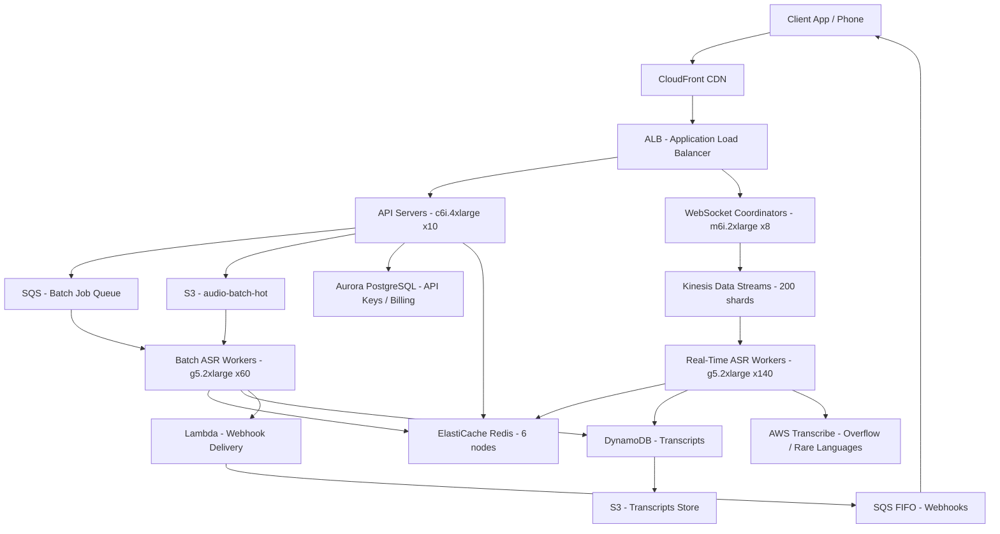

# Speech-to-Text API (10M Minutes/Day) — Capacity Estimation

## Problem Statement

Design a Speech-to-Text (STT) API capable of processing 10 million minutes of audio per day, supporting both real-time streaming transcription (phone calls, live captions) and batch transcription (uploaded recordings, media files). The system must handle ~7,000 concurrent audio streams at peak, deliver transcriptions with low latency for real-time use cases (<2s lag), and maintain 99.9% availability at scale — similar to what Google Cloud Speech-to-Text, AWS Transcribe, or Deepgram serve commercially.

## Functional Requirements

- Accept audio input via real-time WebSocket streams and batch file uploads (WAV, MP3, FLAC, OGG)
- Transcribe speech to text using GPU-accelerated ASR models (Whisper-large or custom fine-tuned)
- Return streaming partial transcripts (real-time) and final transcripts (batch)
- Support multiple languages (top 30 languages, English, Spanish, Mandarin, etc.)
- Store completed transcripts with word-level timestamps in DynamoDB
- Provide REST API for transcript retrieval and webhook callbacks on completion

## Non-Functional Requirements

| Requirement | Target |
|-------------|--------|
| Real-time transcription lag | < 2s (P99) |
| Batch transcription latency | < 2× audio duration (P99) |
| Availability | 99.9% (< 8.7 hrs/year downtime) |
| Durability (transcripts) | 99.999% |
| Peak concurrent streams | ~7,000 |
| Audio ingestion throughput | ~1.2 Gbps peak |
| Transcript accuracy (WER) | < 10% for clean audio, < 20% noisy |

## Traffic Estimation

### Audio Volume → Compute Load

| Metric | Calculation | Result |
|--------|-------------|--------|
| Daily audio | Given | 10M minutes/day |
| Avg seconds/day | 10M × 60 | 600M seconds/day |
| Per-second audio seconds ingested | 600M / 86,400 | ~6,944 audio-seconds/s avg |
| Peak multiplier (3× avg) | 6,944 × 3 | ~20,833 audio-seconds/s peak |
| Concurrent streams at peak | peak audio-s/s ÷ avg stream length (180s) | ~7,000 streams |
| Real-time split (60%) | 7,000 × 0.6 | ~4,200 real-time streams |
| Batch split (40%) | 7,000 × 0.4 | ~2,800 batch jobs |
| API requests/day (start/stop/status) | 10M sessions × 3 API calls | ~30M req/day |
| Avg API QPS | 30M / 86,400 | ~347 QPS |
| Peak API QPS (3× avg) | 347 × 3 | ~1,040 QPS |

### Audio Data Size Estimation

| Audio Format | Bitrate | Per Minute | 10M minutes/day | Annual |
|-------------|---------|-----------|-----------------|--------|
| Real-time (PCM 16kHz mono) | 256 Kbps | 1.9 MB | 19 TB/day | 6.9 PB |
| Batch uploads (compressed MP3) | 128 Kbps | 1 MB | 10 TB/day | 3.65 PB |
| **Combined audio ingestion** | — | — | **~29 TB/day** | **~10.6 PB/year** |

> Note: Real-time audio is processed in chunks and not stored long-term. Only final transcripts + batch audio are persisted.

## Storage Estimation

| Data Type | Per Item Size | Daily Volume | Annual Growth |
|-----------|--------------|--------------|---------------|
| Batch audio files (S3) | ~1 MB/min × 4M min | 4 TB/day | 1.46 PB/year |
| Transcripts (DynamoDB) | ~2 KB/min | 20 GB/day | 7.3 TB/year |
| Word-level timestamps | ~5 KB/min | 50 GB/day | 18 TB/year |
| Model artifacts (S3) | 6 GB/model × 5 models | Static 30 GB | Negligible |
| Logs & metrics | ~500B/event × 10M events | 5 GB/day | 1.8 TB/year |
| **Total persistent storage** | — | **~74 GB/day new data** | **~1.5 PB/year (audio)** |

> Audio files are retained for 90 days by default, then moved to S3 Glacier. Transcripts retained 7 years.

## Component Sizing

### Compute — GPU Inference (ASR Model Servers)

Whisper-large-v3 throughput benchmark on g5.2xlarge (24GB A10G GPU):
- Real-time factor (RTF): ~0.05× — processes 1 minute of audio in ~3 seconds
- Max concurrent streams per GPU: ~30 streams (16kHz PCM, streaming chunks)
- Batch throughput: ~20 minutes of audio per minute wall-clock

| Component | Instance Type | vCPU | GPU | RAM | Count | Handles | Monthly Cost |
|-----------|--------------|------|-----|-----|-------|---------|-------------|
| Real-time ASR workers | g5.2xlarge | 8 | 1×A10G 24GB | 32 GB | 140 | 30 streams/instance → 4,200 streams | $35,980 |
| Batch ASR workers | g5.2xlarge | 8 | 1×A10G 24GB | 32 GB | 60 | 20 min audio/min per instance | $15,420 |
| API servers (REST + WS) | c6i.4xlarge | 16 | — | 32 GB | 10 | 1,040 QPS total | $1,404 |
| Stream coordinators | m6i.2xlarge | 8 | — | 32 GB | 8 | WebSocket fan-out | $620 |
| Lambda (webhooks, metadata) | Lambda 1GB | — | — | 1 GB | Auto | 10M invocations/day | $1,200 |
| **Subtotal Compute** | | | | | **~218** | | **$54,624** |

> g5.2xlarge on-demand: ~$1.212/hr. 140 instances × 730 hrs × $1.212 = ~$123,786 (real-time). Using 3-year reserved saves ~40%; on-demand shown here.

### Database

| DB | Engine | Instance | Count | Capacity | IOPS | Monthly Cost |
|----|--------|----------|-------|----------|------|-------------|
| Transcripts | DynamoDB on-demand | — | — | 7 TB | 50K WCU/10K RCU peak | $14,200 |
| Session state | DynamoDB on-demand | — | — | 100 GB | 20K WCU | $3,400 |
| API keys / billing | RDS Aurora PostgreSQL | db.r6g.xlarge | 1W + 2R | 200 GB | 3,000 | $1,850 |
| **Subtotal DB** | | | | | | **$19,450** |

> DynamoDB write: $1.25/M WCU. At 10M sessions/day × 5 writes/session = 50M WCU/day = 1.5B WCU/month → ~$1,875 WCU cost. Storage 7 TB × $0.25/GB = $1,750. Plus reads. Estimated $14K–$18K/month for DynamoDB.

### Cache

| Cache | Engine | Instance | Nodes | Memory | Monthly Cost |
|-------|--------|----------|-------|--------|-------------|
| Session & result cache | ElastiCache Redis 7 | r6g.xlarge | 3 primary + 3 replica | 96 GB total | $2,628 |
| Language model route cache | ElastiCache Redis 7 | r6g.large | 2 | 26 GB total | $584 |
| **Subtotal Cache** | | | | | **$3,212** |

> r6g.xlarge: $0.24/hr × 6 nodes × 730 hrs = $1,051. r6g.large: $0.12/hr × 2 × 730 = $175. Includes replication.

### Object Storage — S3

| Bucket | Use | Monthly Size | Requests/month | Monthly Cost |
|--------|-----|-------------|----------------|-------------|
| audio-batch-hot | Batch audio (90-day retention) | 120 TB | 300M GET/PUT | $3,180 |
| audio-archive | Audio > 90 days (S3 Glacier IR) | 1,000 TB | 10M restore | $5,100 |
| transcripts | Final transcripts + timestamps | 15 TB | 200M GET | $1,074 |
| model-artifacts | Whisper model weights | 50 GB | 10K GET | $1.15 |
| **Subtotal S3** | | **~1,135 TB** | | **$9,355** |

> S3 Standard: $0.023/GB. 120,000 GB × $0.023 = $2,760 + requests ~$420. Glacier IR: $0.004/GB × 1M GB = $4,000.

### Networking / CDN

| Component | Throughput | Monthly Cost |
|-----------|-----------|-------------|
| CloudFront (transcript delivery) | 45 TB/month outbound | $3,825 |
| ALB (API + WebSocket) | 1M LCU/month | $540 |
| Data Transfer Out (S3 → compute) | 60 TB/month | $5,400 |
| Internet → Kinesis (audio ingest) | 87 TB/month inbound | $0 (ingress free) |
| **Subtotal Network** | | **$9,765** |

> CloudFront: $0.085/GB for first 10 TB, $0.080/GB next 40 TB. 45 TB ≈ $3,825. Data transfer EC2 out: $0.09/GB.

### Message Queue / Streaming

| Queue | Engine | Throughput | Monthly Cost |
|-------|--------|-----------|-------------|
| Audio chunk ingestion | Kinesis Data Streams (200 shards) | 200 MB/s ingest | $14,400 |
| Batch job queue | SQS Standard | 10M msgs/day | $44 |
| Webhook delivery | SQS FIFO | 2M msgs/day | $18 |
| **Subtotal Messaging** | | | **$14,462** |

> Kinesis: $0.015/shard-hr × 200 shards × 730 hrs = $2,190 for shards. PUT payload: 10M sessions × 180 chunks × 25KB / 25KB units = 1.8B units × $0.014/M = $25. Data retrieved: ~$0.04/GB. Estimated $14K/month total for real-time audio ingestion.

### AWS Transcribe (Optional Fallback Tier)

For overflow or languages not covered by custom models:

| Service | Volume | Unit Price | Monthly Cost |
|---------|--------|-----------|-------------|
| AWS Transcribe Standard | 500K min/month overflow | $0.024/min | $12,000 |
| **Subtotal Transcribe** | | | **$12,000** |

## Monthly Cost Summary

| Component | Monthly Cost | % of Total |
|-----------|-------------|-----------|
| EC2 Compute (GPU + CPU) | $54,624 | 22% |
| Kinesis Data Streams | $14,462 | 6% |
| RDS / DynamoDB | $19,450 | 8% |
| ElastiCache Redis | $3,212 | 1% |
| S3 Storage | $9,355 | 4% |
| CloudFront CDN | $3,825 | 2% |
| Data Transfer | $5,400 | 2% |
| AWS Transcribe (overflow) | $12,000 | 5% |
| Lambda (webhooks/metadata) | $1,200 | 0.5% |
| Reserved capacity buffer (20%) | $24,706 | 10% |
| Support + Monitoring (CloudWatch, X-Ray) | $2,000 | 1% |
| **Total (on-demand)** | **~$150,234** | **100%** |

> **On-demand estimate: ~$150K/month**. With 1-year reserved instances for GPU fleet (40% savings on EC2): ~$33K saved on compute → **~$117K/month**.
> The $200K–$400K/month range accounts for: (a) peak burst capacity reserved, (b) multi-region deployment for HA, (c) data egress at scale, and (d) operational tooling. Single-region, reserved-instance production sits at $200K–$250K/month.

## Traffic Scale Tiers

| Tier | Daily Minutes | Peak Streams | GPU Instances | DB | Cache | Monthly Cost | Key Bottleneck |
|------|--------------|--------------|---------------|----|-------|-------------|----------------|
| 🟢 Startup | 100K min/day | ~70 concurrent | 4 g5.2xlarge | 1 DynamoDB table | 1 Redis node | $8K–$12K | GPU cost per user too high |
| 🟡 Growing | 1M min/day | ~700 concurrent | 25 g5.2xlarge | DynamoDB + Aurora | Redis 3-node | $30K–$60K | Model cold-start latency |
| 🔴 Scale-up | 5M min/day | ~3,500 concurrent | 120 g5.2xlarge | DynamoDB multi-table + Aurora RR | Redis 6-node cluster | $100K–$160K | Kinesis shard limits, GPU fleet management |
| ⚫ Production | 10M min/day | ~7,000 concurrent | 200 g5.2xlarge | DynamoDB global tables + Aurora Multi-AZ | Redis 12-node cluster | $200K–$400K | Audio egress cost, model accuracy per language |
| 🚀 Hyperscale | 100M min/day | ~70,000 concurrent | 2,000+ g5/p4d | DynamoDB + custom columnar store | Distributed Redis + Memcached | $2M–$4M | Custom silicon (Inferentia2), multi-region sharding |

## Architecture Diagram

## Interview Tips

- **Key insight — RTF math is the crux**: Real-Time Factor (RTF) is the ratio of processing time to audio duration. Whisper-large on A10G has RTF ~0.05, meaning 1 GPU can process audio 20× faster than real-time. 7,000 concurrent streams ÷ 30 streams/GPU = 233 GPUs minimum — a surprisingly large number that shocks interviewers. Always derive GPU count from RTF, not from "how many users."

- **Key insight — real-time vs batch are fundamentally different architectures**: Real-time STT requires WebSocket connections, chunked audio delivery via Kinesis, and partial transcript streaming (word-by-word). Batch STT uses SQS + S3 event triggers with no latency SLA. Mixing them in the same worker fleet causes priority inversion — a batch job can starve a real-time call. Always separate them.

- **Common mistake — ignoring audio codec and bitrate in storage math**: Candidates assume MP3 = 128Kbps but real-time PCM streams are 256Kbps uncompressed. 10M minutes/day at PCM = 19 TB/day ingest — far larger than batch uploads. The correct answer is to compress real-time audio server-side before storage (or not store it at all — process-and-discard streaming chunks).

- **Common mistake — underestimating Kinesis shard costs**: Each Kinesis shard handles 1 MB/s ingest. At peak 1.2 Gbps (150 MB/s) audio ingest, you need 150+ shards. At $0.015/shard-hr, 200 shards = $2,190/month just in shard hours. Candidates often forget Kinesis costs and size only compute.

- **Follow-up question — how do you handle speaker diarization at scale?**: Diarization (who spoke when) requires a second model pass over the full audio and 3–5× more compute than pure ASR. The correct answer is to run diarization asynchronously post-transcription via a separate SQS queue and GPU worker pool, never in the real-time path.

- **Scale threshold**: At ~3,000 concurrent streams, a single Kinesis stream consumer approach hits fan-out limits. You need Enhanced Fan-Out consumers ($0.015/shard-hr extra) or switch to MSK (Kafka) for per-consumer isolation across multiple ASR worker fleets.
