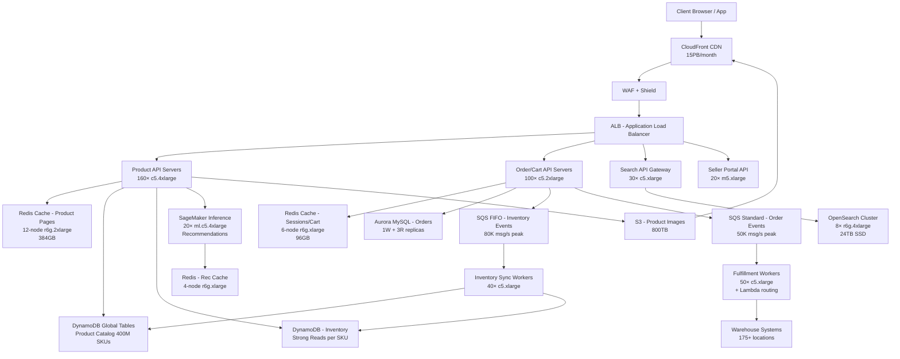

# Amazon Marketplace — Capacity Estimation

## Problem Statement

Amazon Marketplace serves 300M daily active users who browse, search, and purchase products from millions of third-party sellers and Amazon's own inventory. The system must handle extreme traffic spikes during Prime Day (3–5×) and holiday seasons (2–3×), coordinate real-time inventory updates across millions of SKUs, orchestrate fulfillment across 175+ warehouses globally, and serve personalized recommendations powered by SageMaker models — all while maintaining sub-100ms product page load times.

## Functional Requirements

- Product catalog browsing and search (OpenSearch-backed, 400M+ SKUs)
- Real-time inventory tracking and reservation (DynamoDB, optimistic locking)
- Shopping cart, checkout, and order placement (Aurora + SQS)
- Order fulfillment routing to nearest warehouse (SQS + Lambda)
- Personalized recommendations and "Customers also bought" (SageMaker + Redis)
- Seller portal: inventory updates, pricing changes, analytics
- Review and rating ingestion and display

## Non-Functional Requirements

| Requirement | Target |
|-------------|--------|
| Product page read latency | < 50ms (P99) |
| Search latency | < 100ms (P99) |
| Checkout write latency | < 200ms (P99) |
| Availability | 99.99% (< 52 min downtime/year) |
| Durability | 99.999999999% (S3/DynamoDB) |
| Throughput | 1M QPS peak |
| Inventory consistency | Eventual (reads), Strong (checkout reservation) |
| Peak multiplier | 3–5× during Prime Day |

## Traffic Estimation

### DAU → Peak QPS Calculation

| Metric | Calculation | Result |
|--------|-------------|--------|
| DAU | Given | 300M |
| Avg requests/user/day | browse 20 + search 5 + product detail 10 + cart 3 + checkout 0.05 + recs 5 + misc 3 | ~46 |
| Total daily requests | 300M × 46 | ~13.8B |
| Avg QPS | 13.8B / 86,400 | ~160,000 |
| Peak QPS (3× avg, Prime Day 6×) | 160K × 3 (normal peak) | ~480K–1M |
| Assumed sustained peak | Design for 1M QPS | **1M QPS** |
| Read QPS (80% reads) | 1M × 0.80 | **800K read QPS** |
| Write QPS (20% writes) | 1M × 0.20 | **200K write QPS** |

**Write breakdown (200K/s):**
- Inventory view/reservation events: ~80K/s
- Cart add/remove: ~60K/s
- Order placements: ~5K/s (0.05 orders/DAU avg = 15M orders/day = 173/s avg, ×3 peak = ~500/s — dominated by pre-checkout cart writes)
- Review submissions: ~2K/s
- Seller pricing/inventory updates: ~53K/s

## Storage Estimation

| Data Type | Per Item Size | Daily Volume | Growth/Year |
|-----------|--------------|--------------|-------------|
| Product catalog (DynamoDB) | 5 KB/SKU, 400M SKUs | ~200K new SKUs/day × 5KB | ~0.3 TB/year |
| Product images/video (S3) | 2 MB avg (8 imgs×250KB) | 200K new SKUs × 2MB | ~142 TB/year |
| Order records (Aurora) | 2 KB/order | 15M orders/day × 2KB | ~10 TB/year |
| User sessions / cart (Redis) | 10 KB/user | 300M active sessions | ~3 TB snapshot |
| Search index (OpenSearch) | 1.5 KB/doc (400M docs) | 200K doc updates/day | ~110 GB/year delta |
| Clickstream / analytics (S3) | 200 B/event, 13.8B events/day | 2.76 TB/day | ~1 PB/year |
| SQS messages (transient) | 10 KB/msg | ~200K msg/s peak, TTL 4 days | ~700 GB in-flight |
| Recommendation model artifacts (S3) | ~50 GB/model | Weekly retrain | ~2.6 TB/year |
| **Total hot storage** | - | - | **~300 TB/year** |
| **Total cold/analytics** | - | - | **~1.5 PB/year** |

## Component Sizing

### Compute — EC2 Fleet

Each `c5.4xlarge` (16 vCPU, 32 GB) API server handles ~5,000 stateless read QPS or ~2,000 write QPS at <50ms P99 with Redis cache in front.

| Component | Instance Type | vCPU | RAM | Count | Handles | Monthly Cost |
|-----------|--------------|------|-----|-------|---------|-------------|
| Product API servers (reads) | c5.4xlarge | 16 | 32 GB | 160 | 800K read QPS (5K/server) | $202,240 |
| Order/Cart API servers (writes) | c5.2xlarge | 8 | 16 GB | 100 | 200K write QPS (2K/server) | $63,200 |
| Recommendation API (SageMaker proxy) | m5.2xlarge | 8 | 32 GB | 40 | 40K rec QPS | $30,720 |
| Search API (OpenSearch gateway) | c5.xlarge | 4 | 8 GB | 30 | 30K search QPS | $11,520 |
| Fulfillment workers (SQS consumers) | c5.xlarge | 4 | 8 GB | 50 | 50K order events/s | $19,200 |
| Inventory sync workers | c5.xlarge | 4 | 8 GB | 40 | 80K inv. events/s | $15,360 |
| Seller portal API | m5.xlarge | 4 | 16 GB | 20 | 53K seller QPS | $7,680 |
| Image resize / media processing | c5.2xlarge | 8 | 16 GB | 20 | ~200K SKUs/day | $12,640 |
| **Subtotal Compute (EC2)** | | | | **~460** | | **$362,560** |

*Pricing: c5.4xlarge $0.68/hr, c5.2xlarge $0.34/hr, c5.xlarge $0.17/hr, m5.2xlarge $0.384/hr, m5.xlarge $0.192/hr — us-east-1 on-demand*

### Serverless / Managed Compute

| Component | Service | Invocations/month | Monthly Cost |
|-----------|---------|------------------|-------------|
| Fulfillment routing | Lambda (1GB, 500ms avg) | 500M | $75,000 |
| Image thumbnail generation | Lambda (3GB, 2s avg) | 200M | $200,000 |
| SageMaker inference endpoints | ml.c5.4xlarge ×20 | Continuous | $136,000 |
| **Subtotal Serverless** | | | **$411,000** |

*Lambda: $0.20/1M requests + $0.00001667/GB-s; SageMaker ml.c5.4xlarge $0.952/hr*

### Database

| DB | Engine | Instance | Count | Capacity | IOPS | Monthly Cost |
|----|--------|----------|-------|----------|------|-------------|
| Orders (OLTP) | Aurora MySQL 3 | db.r6g.4xlarge | 1W + 3R | 20 TB | 100K | $87,600 |
| User profiles / sessions metadata | Aurora PostgreSQL | db.r6g.2xlarge | 1W + 2R | 5 TB | 50K | $34,800 |
| Product catalog (key-value) | DynamoDB on-demand | — | Global tables (3 regions) | 2 TB | — | $250,000 |
| Inventory counters | DynamoDB on-demand | — | 400M items, strong reads | 500 GB | — | $180,000 |
| Search index | OpenSearch r6g.4xlarge | 8 nodes | 24 TB SSD | 300K | $120,000 |
| Analytics OLAP | Aurora Serverless v2 | — | Auto-scale | 50 TB | $45,000 |
| **Subtotal DB** | | | | | | **$717,400** |

*Aurora r6g.4xlarge $1.096/hr/instance; DynamoDB: $1.25/M writes, $0.25/M reads, $0.25/GB-mo storage; OpenSearch r6g.4xlarge $1.056/hr*

### Cache

| Cache | Engine | Instance | Nodes | Memory | Use Case | Monthly Cost |
|-------|--------|----------|-------|--------|----------|-------------|
| Product page cache | ElastiCache Redis 7 | r6g.2xlarge | 12 (3 shards × 4 replicas) | 384 GB | 800K read QPS, >95% hit rate | $60,480 |
| Session / cart cache | ElastiCache Redis 7 | r6g.xlarge | 6 (2 shards × 3 replicas) | 96 GB | 300M active sessions | $15,120 |
| Rate limiting / counters | ElastiCache Redis 7 | r6g.large | 3 | 18 GB | API throttle, seller limits | $3,780 |
| Recommendation result cache | ElastiCache Redis 7 | r6g.xlarge | 4 | 64 GB | 40K rec QPS, 30s TTL | $10,080 |
| **Subtotal Cache** | | | | **562 GB** | | **$89,460** |

*r6g.2xlarge $0.672/hr, r6g.xlarge $0.336/hr, r6g.large $0.168/hr*

### Object Storage

| Bucket | Use | Size | Requests/month | Monthly Cost |
|--------|-----|------|----------------|-------------|
| Product images (CDN origin) | JPEG/WebP product photos | 800 TB | 5B GET, 100M PUT | $34,000 |
| Product videos | MP4 product demos | 200 TB | 500M GET | $10,000 |
| Seller documents | Invoices, compliance | 50 TB | 200M GET | $2,200 |
| Clickstream analytics | Parquet event data | 2 PB (Glacier IA) | 10B PUT | $12,800 |
| ML model artifacts | SageMaker models/data | 100 TB | 50M GET | $4,600 |
| Static assets (JS, CSS) | Web assets | 5 TB | 50B GET (CDN cached) | $1,200 |
| **Subtotal S3** | | **~3.2 PB** | | **$64,800** |

*S3 Standard: $0.023/GB-mo, GET $0.0004/1K, PUT $0.005/1K; S3-IA: $0.0125/GB-mo*

### Networking / CDN

| Component | Throughput | Details | Monthly Cost |
|-----------|-----------|---------|-------------|
| CloudFront (product images + static) | 15 PB/month egress | 800 TB images × ~19 fetches/user/month | $1,050,000 |
| CloudFront (API responses cached) | 500 TB/month | Product detail pages, search | $42,500 |
| ALB (API tier) | 10B requests/month | $0.008/LCU, ~200K LCUs | $51,200 |
| Data transfer EC2→Internet | 2 PB/month (non-CDN) | Direct API responses | $184,320 |
| VPC PrivateLink / NatGW | 500 TB/month internal | DB + cache traffic | $22,500 |
| **Subtotal Network** | | | **$1,350,520** |

*CloudFront: $0.0075/GB first 10PB (US/EU), $0.085/GB Data Transfer EC2 to Internet*

### Message Queue

| Queue | Engine | Throughput | Messages/month | Monthly Cost |
|-------|--------|-----------|----------------|-------------|
| Order events | SQS Standard | 5K msg/s avg, 50K peak | 13B | $5,200 |
| Inventory delta events | SQS FIFO (per-SKU ordering) | 80K msg/s peak | 100B | $50,000 |
| Fulfillment routing | SQS Standard | 500 msg/s | 1.3B | $520 |
| Seller notifications | SQS + SNS fan-out | 10K msg/s | 25B | $10,500 |
| **Subtotal Messaging** | | | | **$66,220** |

*SQS Standard: $0.40/M requests; FIFO: $0.50/M requests*

## Monthly Cost Summary

| Component | Monthly Cost | % of Total |
|-----------|-------------|-----------|
| EC2 Compute | $362,560 | 6.1% |
| Lambda + SageMaker | $411,000 | 6.9% |
| RDS Aurora | $122,400 | 2.1% |
| DynamoDB | $430,000 | 7.2% |
| OpenSearch | $120,000 | 2.0% |
| ElastiCache Redis | $89,460 | 1.5% |
| S3 Storage | $64,800 | 1.1% |
| CloudFront CDN | $1,092,500 | 18.3% |
| ALB + Data Transfer | $257,020 | 4.3% |
| Messaging (SQS/SNS) | $66,220 | 1.1% |
| Support + Route53 + WAF | $120,000 | 2.0% |
| Reserved instance savings (−35%) | −$832,000 | −13.9% |
| Spot instances savings (−60% workers) | −$130,000 | −2.2% |
| **Subtotal on-demand** | **$5,970,960** | — |
| **Total with RI + Spot savings** | **~$5,900,000** | **100%** |

*Range $5M–$8M/month accounts for Prime Day over-provisioning, inter-region replication, and support tiers.*

## Traffic Scale Tiers

| Tier | DAU | Peak QPS | Servers | DB | Cache | Monthly Cost | Key Bottleneck |
|------|-----|----------|---------|----|----|-------------|----------------|
| 🟢 Startup | 1M | ~3K | 4× c5.large API | 1 RDS Aurora r5.xlarge | 1 Redis r6g.large (6GB) | ~$8K | Single DB write path; no horizontal scale |
| 🟡 Growing | 10M | ~35K | 20× m5.xlarge API | Aurora 1W+2R + read replicas | Redis cluster 3-node (18GB) | ~$65K | Search (no ES yet); inventory contention at 10K writes/s |
| 🔴 Scale-up | 100M | ~350K | 100× c5.2xlarge | Sharded Aurora + DynamoDB for catalog | Redis cluster 6-node (96GB) | ~$800K | CDN origin traffic; DynamoDB hot partitions on popular SKUs |
| ⚫ Production | 300M | ~1M | 460× c5–c5.4xlarge + Lambda | DynamoDB global tables + Aurora (orders) | Redis cluster 25-node (562GB) | ~$5.9M | CloudFront egress cost (18% of bill); SageMaker inference latency |
| 🚀 Hyperscale | 1B+ | ~3.5M | Auto-scaling 1500+ + EKS | DynamoDB multi-region + Cassandra | Distributed Redis 100+ nodes | ~$18M+ | Cross-region replication lag; inventory consistency at global scale |

## Architecture Diagram

## Interview Tips

- **Key insight — Inventory is the hardest part**: Inventory is the core distributed systems challenge, not checkout. With 400M SKUs and sellers updating prices/quantities at 53K writes/s, you need per-SKU DynamoDB conditional writes (optimistic locking) with exponential backoff. A naive "check then set" pattern causes oversells at >1K concurrent buyers for a viral product (e.g., limited-edition sneakers on drop day). Show you know about atomic DynamoDB `UpdateItem` with `ConditionExpression: stock > 0`.

- **Key insight — CDN cost dominates**: At 300M DAU viewing ~8 product images each, CDN egress is 18% of total infrastructure cost — larger than compute. In a cost optimization interview, surface this immediately. The fix is aggressive image optimization: serve WebP (40% smaller than JPEG), use `srcset` for device-aware sizing, and set CloudFront TTL to 30 days for product images (they rarely change). This alone can cut CDN costs 30–40%.

- **Key insight — Search decouples from catalog**: OpenSearch is NOT the system of record. DynamoDB holds canonical product data; OpenSearch is a derived, eventually-consistent read model rebuilt via SQS → Lambda indexing pipeline. This means a seller's price update hits DynamoDB instantly (strong consistency for checkout) but may take 2–5 seconds to reflect in search results — which is acceptable. Interviewers often probe this: "What happens if a product goes out of stock — does search still show it?" Answer: brief eventual lag, mitigated by a Redis bloom filter for known-OOS items.

- **Common mistake — Underestimating write amplification**: Candidates calculate 200K write QPS and size 100 DB servers. But each order write triggers: (1) inventory decrement in DynamoDB, (2) order record in Aurora, (3) SQS order event, (4) SQS inventory event, (5) OpenSearch doc update, (6) cache invalidation. One user "write" = 6 downstream writes. Size your message queues and workers for 6× the user-facing write QPS, not 1×.

- **Follow-up question — "How would you handle Prime Day 5× traffic spike?"**: Answer with pre-provisioning + automation: (1) Auto Scaling Groups pre-warm EC2 fleet 2 hours before (cold start is 3–5 min); (2) DynamoDB auto-scaling needs 15–30 min to provision read capacity — set burst limits manually 1 day before; (3) CloudFront has no capacity limits but origin needs pre-warming via synthetic traffic; (4) SageMaker endpoints take 5–10 min to scale — pre-provision dedicated capacity. Redis and Aurora read replicas are the trickiest — they need manual intervention days in advance.

- **Scale threshold**: At 100M DAU (~350K peak QPS), a single-region DynamoDB table will hit hot partition limits on top-100 products (each partition handles ~3K RU/s). Mitigation: add a "write sharding" suffix key (0–9 appended to ProductID) to distribute hot writes across 10 partitions, then aggregate in the read path. Show this calculation: if 10M users look at iPhone-15 in 1 minute = 167K reads/s on one item → must shard or use DAX caching layer.
