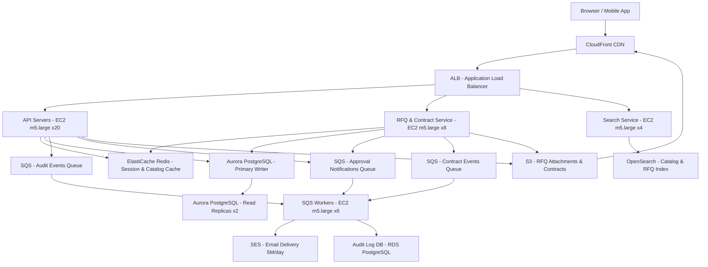

# B2B Marketplace — Capacity Estimation

## Problem Statement

A B2B procurement marketplace connects 5 million daily active users (buyers and suppliers) for RFQ (Request for Quotation) workflows, contract management, and catalog browsing. Unlike B2C, B2B users submit multi-line purchase orders, negotiate contracts over days, and trigger email-heavy approval workflows — resulting in high write amplification and document storage demands. The system must handle bursty procurement cycles tied to fiscal quarters and government tender deadlines.

## Functional Requirements

- Catalog browsing: search products/suppliers by category, region, certification
- RFQ creation and response: buyers post RFQs, suppliers submit quotes
- Contract lifecycle management: draft, negotiate, approve, execute contracts
- Order management: purchase orders, invoices, delivery confirmations
- Approval workflows: multi-level authorization chains with email notifications
- Reporting and analytics: spend analytics dashboards for procurement managers

## Non-Functional Requirements

| Requirement | Target |
|-------------|--------|
| Read latency | < 120ms (P99) |
| Write latency | < 300ms (P99) |
| Availability | 99.99% (52 min downtime/year) |
| Durability | 99.999% (contract documents must never be lost) |
| Throughput | 20K QPS peak |
| Search latency | < 200ms (P99) |
| Email delivery | < 2 min for approval notifications |

## Traffic Estimation

### DAU → Peak QPS Calculation

B2B users are concentrated in business hours (9 AM–6 PM local time). Peak multiplier is 4× avg (not 3×) because of the narrow active window.

| Metric | Calculation | Result |
|--------|-------------|--------|
| DAU | Given | 5,000,000 |
| Avg requests/user/day | browse 15 + search 8 + RFQ 2 + order 1 + approvals 4 + dashboard 3 | ~33 |
| Total daily requests | 5M × 33 | ~165M |
| Avg QPS (24h spread) | 165M / 86,400 | ~1,910 |
| Business-hours QPS (9h window) | 165M / 32,400 | ~5,093 |
| Peak QPS (4× business avg) | 5,093 × 4 | ~20,000 |
| Read QPS (65% reads) | 20,000 × 0.65 | ~13,000 |
| Write QPS (35% writes) | 20,000 × 0.35 | ~7,000 |

**Key insight**: B2B write ratio (35%) is much higher than B2C (~10%) because every catalog view triggers RFQ drafts, quote submissions, and audit log entries. Approval workflows create 3–8 write events per business transaction.

### Breakdown by Feature

| Feature | QPS (Peak) | Read/Write |
|---------|-----------|-----------|
| Catalog search (OpenSearch) | 4,000 | 100% read |
| Product detail pages | 3,000 | 100% read |
| RFQ list / quote inbox | 2,500 | 90% read |
| Dashboard/analytics | 1,500 | 100% read |
| RFQ create/update | 2,000 | 100% write |
| Quote submission | 1,500 | 100% write |
| Contract events | 1,000 | 100% write |
| Order/invoice writes | 1,500 | 100% write |
| SES email triggers | 1,000 | 100% write |
| **Total** | **18,500** | **~65/35** |

## Storage Estimation

| Data Type | Per Item Size | Daily Volume | Annual Growth |
|-----------|--------------|--------------|---------------|
| RFQ documents (JSON + attachments) | 50 KB avg | 200K RFQs/day | ~3.7 TB/year |
| Quote responses | 30 KB avg | 600K quotes/day | ~6.6 TB/year |
| Contracts (PDF + metadata) | 500 KB avg | 20K contracts/day | ~3.7 TB/year |
| Purchase orders + invoices | 20 KB avg | 400K docs/day | ~2.9 TB/year |
| Product catalog (images + specs) | 2 MB avg per SKU | 10K new SKUs/day | ~7.3 TB/year |
| Audit logs | 1 KB per event | 50M events/day | ~18 TB/year |
| Email archives (SES) | 10 KB avg | 5M emails/day | ~18 TB/year |
| **Total** | — | — | **~60 TB/year** |

**PostgreSQL (hot data, 2 years retention)**: ~15 TB  
**S3 (documents, contracts, cold logs)**: ~120 TB cumulative after 2 years  
**OpenSearch index (catalog + RFQ search)**: ~500 GB active index

## Component Sizing

### Compute — EC2

Assumptions: each m5.large (2 vCPU, 8 GB RAM) handles ~500 RPS for stateless API traffic. At 20K peak QPS, the request mix includes heavy DB calls (~50ms avg), so derate to ~300 RPS per server effective throughput.

| Component | Instance Type | vCPU | RAM | Count | Handles | Monthly Cost |
|-----------|--------------|------|-----|-------|---------|-------------|
| API servers (ALB target group) | m5.large | 2 | 8 GB | 20 | 300 RPS each → 6,000 RPS with headroom | $1,980 |
| RFQ/contract service | m5.large | 2 | 8 GB | 8 | Complex write workflows | $792 |
| Search service (OpenSearch proxy) | m5.large | 2 | 8 GB | 4 | Query fan-out to OpenSearch | $396 |
| SQS consumer workers (email, audit) | m5.large | 2 | 8 GB | 6 | 7,000 async events/s | $594 |
| Analytics/reporting service | m5.xlarge | 4 | 16 GB | 4 | Aggregation queries | $634 |
| **Subtotal Compute** | | | | **42 instances** | | **$4,396** |

*Pricing: m5.large $0.096/hr, m5.xlarge $0.192/hr, us-east-1 on-demand*

### Database — PostgreSQL RDS

B2B data has complex relational structures: buyers, suppliers, RFQs, line items, contracts, approvals. PostgreSQL is the right choice. Use Aurora PostgreSQL for automatic failover and storage auto-scaling.

| DB | Engine | Instance | Count | Storage | IOPS | Monthly Cost |
|----|--------|----------|-------|---------|------|-------------|
| Primary (RFQ, orders, contracts) | Aurora PostgreSQL | db.r6g.2xlarge (8 vCPU, 64 GB) | 1 writer | 6 TB auto-scale | 12,000 provisioned | $2,188 |
| Read replicas (analytics, reports) | Aurora PostgreSQL | db.r6g.xlarge (4 vCPU, 32 GB) | 2 readers | shared | — | $1,460 |
| Catalog DB (product, supplier data) | Aurora PostgreSQL | db.r6g.large (2 vCPU, 16 GB) | 1W + 1R | 2 TB | 6,000 | $730 |
| Audit log DB | RDS PostgreSQL | db.m6g.large (2 vCPU, 8 GB) | 1 | 5 TB gp3 | 3,000 | $290 |
| **Subtotal DB** | | | | | | **$4,668** |

*Aurora PostgreSQL r6g.2xlarge: ~$0.52/hr writer. r6g.xlarge: ~$0.26/hr per replica. Storage: $0.10/GB-month Aurora.*

### Cache — ElastiCache Redis

B2B cache patterns differ from B2C: session data is smaller but catalog/pricing data is large and complex. Hot paths: supplier catalog pages, user sessions, RFQ status, approval chain lookups.

| Cache | Engine | Instance | Nodes | Memory | Monthly Cost |
|-------|--------|----------|-------|--------|-------------|
| Session + hot catalog | ElastiCache Redis | r6g.large (2 vCPU, 13 GB) | 3 (1 primary + 2 replica) | 39 GB total | $612 |
| RFQ status + approval cache | ElastiCache Redis | r6g.large (2 vCPU, 13 GB) | 2 (primary + replica) | 26 GB | $408 |
| **Subtotal Cache** | | | | **65 GB** | **$1,020** |

*r6g.large: ~$0.136/hr per node, us-east-1*

### OpenSearch — Catalog + RFQ Search

Catalog search requires full-text + faceted filtering (category, supplier, price range, certification). OpenSearch handles 4,000 search QPS.

| Cluster | Instance | Count | Storage | Monthly Cost |
|---------|----------|-------|---------|-------------|
| Catalog search (products, suppliers) | r6g.large.search (2 vCPU, 16 GB) | 3 (1 primary + 2 data) | 500 GB SSD | $612 |
| **Subtotal OpenSearch** | | | | **$612** |

### Object Storage — S3

| Bucket | Use | Size | Requests/month | Monthly Cost |
|--------|-----|------|----------------|-------------|
| `rfq-attachments` | RFQ attachments (PDFs, specs) | 20 TB | 50M GET, 5M PUT | $1,005 |
| `contracts` | Executed contracts (compliance retention 7 years) | 10 TB | 5M GET, 500K PUT | $285 |
| `catalog-media` | Product images, data sheets | 15 TB | 200M GET, 2M PUT | $560 |
| `audit-logs` | Event audit trail (S3 + Glacier tiering) | 30 TB (5 TB hot / 25 TB Glacier) | 10M GET | $368 |
| **Subtotal S3** | | **75 TB** | | **$2,218** |

*S3 Standard: $0.023/GB-month. S3 Glacier: $0.004/GB-month. PUT/COPY $0.005/1K, GET $0.0004/1K.*

### Networking / CDN — CloudFront + ALB

B2B catalog images and data sheets benefit from CDN. API traffic is not cached (personalized, session-bound).

| Component | Throughput | Monthly Cost |
|-----------|-----------|-------------|
| CloudFront (catalog media, static assets) | 30 TB/month egress | $2,550 |
| ALB (API traffic, 20K peak QPS) | 500M requests/month | $310 |
| Data transfer (EC2 → internet, non-CDN) | 5 TB/month | $460 |
| **Subtotal Network** | | **$3,320** |

*CloudFront: $0.085/GB first 10 TB, $0.080/GB next 40 TB. ALB: $0.008/LCU-hr, ~$16/month + $0.008/GB.*

### Message Queue — SQS

SQS decouples write-heavy workflows: email notifications, audit logging, contract event bus, approval chain triggers.

| Queue | Purpose | Throughput | Monthly Cost |
|-------|---------|-----------|-------------|
| `approval-notifications` | Multi-level approval chains → SES | 2,000 msg/s peak | $140 |
| `audit-events` | All write events → audit DB | 4,000 msg/s peak | $280 |
| `contract-events` | Contract state machine transitions | 500 msg/s peak | $35 |
| `invoice-processing` | Invoice OCR + validation pipeline | 200 msg/s peak | $14 |
| **Subtotal SQS** | | | **$469** |

*SQS Standard: $0.40/million requests. 4,000 msg/s × 86,400s × 30 days = ~10.4B messages/month.*

### SES — Email (Transactional)

B2B approval workflows generate 5M emails/day (RFQ alerts, quote notifications, approval requests, contract execution confirmations).

| Service | Volume | Monthly Cost |
|---------|--------|-------------|
| SES (5M emails/day × 30 days = 150M emails/month) | 150M emails | $1,500 |
| **Subtotal SES** | | **$1,500** |

*SES: $0.10/1,000 emails after first 62,000 free.*

## Monthly Cost Summary

| Component | Monthly Cost | % of Total |
|-----------|-------------|-----------|
| EC2 Compute (42 instances) | $4,396 | 24% |
| Aurora PostgreSQL (RDS) | $4,668 | 26% |
| ElastiCache Redis | $1,020 | 6% |
| OpenSearch | $612 | 3% |
| S3 Storage | $2,218 | 12% |
| CloudFront CDN + ALB + Transfer | $3,320 | 18% |
| SQS Messaging | $469 | 3% |
| SES Email | $1,500 | 8% |
| **Total** | **$18,203** | **100%** |

**Range: $15K–$25K/month** accounts for Reserved Instance discounts (1-year RIs save ~30% on EC2 and RDS) at the low end, and includes monitoring (CloudWatch ~$300), WAF (~$200), and Secrets Manager (~$50) overhead at the high end.

## Traffic Scale Tiers

| Tier | DAU | Peak QPS | Servers | DB | Cache | Monthly Cost | Key Bottleneck |
|------|-----|----------|---------|----|----|-------------|----------------|
| 🟢 Startup | 500K | ~2,000 | 6× m5.large | 1 RDS db.r6g.large | 1 Redis r6g.medium | $3,500 | Single RDS writer; no read replicas |
| 🟡 Growing | 2M | ~8,000 | 16× m5.large | Aurora + 1 read replica | Redis r6g.large cluster (3-node) | $8,000 | OpenSearch index size; email volume |
| 🔴 Scale-up | 10M | ~40,000 | 60× m5.large + ASG | Aurora sharded (2 writers) + 4 replicas | Redis cluster 6-node r6g.xlarge | $45,000 | Contract storage IOPS; audit log DB throughput |
| ⚫ Production | 5M DAU | ~20,000 | 42× m5.large | Aurora r6g.2xlarge + 2 replicas | Redis 5-node r6g.large | $18,203 | SES rate limits; approval queue latency |
| 🚀 Hyperscale | 50M DAU | ~200,000 | 300× c5.2xlarge + ASG | Aurora Global + DynamoDB for catalog | Redis cluster 24-node + DAX | $180,000+ | Cross-region contract consistency; regulatory data residency |

## Architecture Diagram

## Interview Tips

- **B2B write amplification is the trap**: At 5M DAU with 35% writes (7K write QPS), every business transaction creates 5–10 downstream events (audit log, approval notification, contract state update, invoice record). Naively sizing for 7K writes misses 35–70K actual DB/queue writes. Always ask: "What is the fan-out ratio per user action?"

- **Fiscal quarter burst patterns**: B2B procurement peaks at end-of-quarter (companies burning budget) and government fiscal year-end. Design for 5–8× sustained QPS burst for 3–5 days, not just daily peak. Use SQS with dead-letter queues to absorb email/approval backlogs without dropping events.

- **Contract durability vs. latency tradeoff**: Contracts are legal documents requiring 7-year retention in some jurisdictions. Multi-AZ Aurora + S3 versioning + Glacier Deep Archive tiering solves durability, but naive full-text contract storage in PostgreSQL kills IOPS. Store contract metadata in Aurora, binary in S3, and index content in OpenSearch — this is the right three-tier answer.

- **RFQ search is not product search**: Catalog search (4K QPS) uses standard faceted OpenSearch queries. RFQ matching (finding suppliers for a buyer's RFQ) is a complex query involving pricing bands, certifications, delivery lead times, and past performance scores. This requires a separate OpenSearch index with a custom relevance model — don't lump both into one cluster sizing estimate.

- **Scale threshold**: At 10M DAU you need Aurora database sharding (by buyer region or industry vertical) because the single-writer Aurora instance hits ~15K writes/second ceiling at that point. The contract table alone grows 3 TB/year per shard and full-table scans for compliance reports become untenable.

- **Common mistake**: Candidates forget SES rate limits (14M emails/day default quota) and treat email as free/instant. At 5M DAU generating 5M emails/day, you are at 36% of default quota. Model the SES cost ($1,500/month here), request quota increases in advance, and add SQS buffering to avoid throttling during burst periods.
