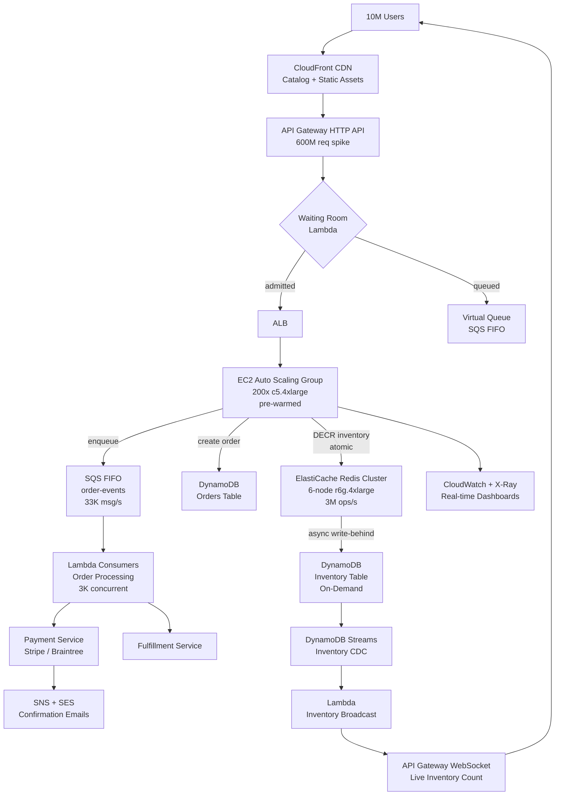

# Flash Sale — 10M Concurrent Users — Capacity Estimation

## Problem Statement

A major e-commerce platform runs a time-boxed flash sale (e.g., a 2-hour event) where 10 million users simultaneously attempt to purchase limited-quantity inventory items. The system must prevent overselling while sustaining 2M write QPS at the exact moment the sale opens — inventory transitions from "available" to "reserved" in sub-10ms without any race condition. Unlike steady-state traffic, this system must scale from 0 to 10M concurrent in under 60 seconds and de-scale equally fast.

## Functional Requirements

- Browse product catalog and sale items before the event opens (high read traffic warm-up phase)
- Atomic inventory reservation — "add to cart / buy now" must decrement a shared counter without double-selling
- Queue users when demand exceeds capacity (virtual waiting room)
- Process orders, payments, and confirmations asynchronously after reservation
- Real-time inventory count visible to all browsing users (eventual consistency acceptable, < 2s lag)
- Post-sale order fulfillment tracking and notification delivery

## Non-Functional Requirements

| Requirement | Target |
|-------------|--------|
| Inventory reservation latency | < 10ms P99 (Redis DECR) |
| Browse/read latency | < 50ms P99 (CloudFront + API Gateway) |
| Write latency (order creation) | < 200ms P99 (DynamoDB) |
| Availability | 99.99% (four nines, ≤ 52 min/year downtime) |
| Durability | 99.999% (orders must never be lost) |
| Peak write QPS | 2M QPS at sale-open spike |
| Peak read QPS | 400K QPS browse phase (20:80 read:write during spike) |
| Oversell tolerance | Zero — atomic operations only |
| Scale-out time | ≤ 60 seconds from baseline to full capacity |

## Traffic Estimation

### DAU → Peak QPS Calculation

Flash sales are event-driven — normal DAU-based estimation does not apply. We model the event window directly.

| Metric | Calculation | Result |
|--------|-------------|--------|
| Concurrent users at event open | Given | 10M |
| Avg requests/user in first 30s | 1 buy attempt + 5 page polls + 3 status checks | ~9 req |
| Total requests in first 30s | 10M × 9 | 90M req |
| Burst QPS (first 30 seconds) | 90M / 30 | **3M QPS** |
| Sustained peak QPS (30s–5min) | demand stabilizes at ~2/3 of burst | **2M QPS** |
| Read QPS (20% of sustained peak) | 2M × 0.20 | **400K read QPS** |
| Write QPS (80% of sustained peak) | 2M × 0.80 | **1.6M write QPS** |
| Inventory decrement QPS (subset) | 10M users × 1 buy attempt / 5s window | **2M DECR/s** |
| Pre-sale browse QPS (warm-up 1hr) | 10M users × 2 page views / 3600s | ~5,500 QPS |

**Key insight**: The read:write ratio **inverts** during a flash sale. Normal e-commerce is 99:1 read:write. At sale open, 80% of requests are writes (reservation, order create, status update), making this a write-heavy spike unlike any regular workload.

### Event Timeline Traffic Shape

| Phase | Duration | QPS | Primary Load |
|-------|----------|-----|-------------|
| Pre-sale warm-up | T-60min to T-0 | 5K–50K | CDN-served catalog reads |
| Sale opens (burst) | T+0 to T+30s | 3M | Redis DECR, API writes |
| Sustained spike | T+30s to T+5min | 2M | Order creates, SQS enqueue |
| Inventory exhausted | T+5min to T+15min | 500K | Status polls, confirmations |
| Tail (post-sale) | T+15min to T+2hr | 50K | Order tracking, notifications |

## Storage Estimation

| Data Type | Per Item Size | Daily Volume | Growth/Year |
|-----------|--------------|--------------|-------------|
| Order records (DynamoDB) | 2 KB | 10M orders/event × 4 events/year = 40M/yr | 80 GB/year |
| Session / cart data (Redis TTL 24h) | 500 bytes | 10M sessions per event | ~5 GB per event (ephemeral) |
| Product catalog (DynamoDB) | 5 KB/item | 50K SKUs on sale | 250 MB (static) |
| SQS FIFO messages (transient) | 256 KB max, avg 1 KB | 10M orders × 3 messages = 30M | ~30 GB transient |
| CloudWatch logs / metrics | 100 bytes/req | 2M QPS × 2hr = 14.4B req | ~1.4 TB/event |
| Payment audit logs (S3) | 3 KB | 10M records | 30 GB/event |
| **Total persistent storage** | — | — | **~120 GB/year** |

Storage is not the bottleneck for flash sales. Throughput and atomicity are.

## Component Sizing

### Compute — EC2 Auto Scaling + Lambda

**API servers (inventory + order endpoints):**

Each `c5.4xlarge` (16 vCPU, 32 GB RAM) handles ~10K QPS at P99 < 100ms with non-blocking I/O (Node.js / Go).
- 2M QPS / 10K per server = **200 servers** at peak
- Pre-warmed to 200 instances before T-0 (EC2 warm-up takes 3–5 min; cannot rely on cold scale-out during spike)

| Component | Instance Type | vCPU | RAM | Count | Handles | Monthly Cost |
|-----------|--------------|------|-----|-------|---------|-------------|
| API servers (pre-warmed) | c5.4xlarge | 16 | 32 GB | 200 | 2M QPS total | $201,600 full-month |
| API servers (event 2hr only) | c5.4xlarge | 16 | 32 GB | 200 | — | **$2,240** (2hr) |
| Waiting-room Lambda | Lambda 512MB | — | 512 MB | auto | 500K req/min | $180/event |
| Order processor Lambda | Lambda 1 GB | — | 1 GB | auto | 10M invocations | $200/event |
| Background workers (fulfillment) | m5.2xlarge | 8 | 32 GB | 20 | SQS consumers | $7,680 full-month |
| **Subtotal Compute (event window)** | | | | | | **~$2,820** |

> Full-month equivalent if servers ran 24/7: ~$210K. For a 2-hour event with pre-warming 1 hour before, billed hours ≈ 3hr × 200 servers = 600 instance-hours × $1.12/hr = **$672** for c5.4xlarge spot (~60% discount) or **$2,240** on-demand.

### Database — DynamoDB (Inventory + Orders)

DynamoDB is chosen over RDS for flash sales because:
1. No connection pool exhaustion (HTTP-based, not TCP connections)
2. Auto-scales write capacity in seconds (not minutes like Aurora)
3. Conditional writes (`ConditionExpression`) provide atomic "compare-and-set" for inventory

**DynamoDB Capacity Math:**
- 2M write QPS → 2M WCU/s
- DynamoDB on-demand pricing: $1.25 per million write requests
- 2M WCU/s × 30s burst + 1.6M WCU/s × 270s sustained = (60M + 432M) = **492M write requests** in first 5 minutes
- Cost: 492M × $1.25/M = **$615** for the inventory-write burst
- Read requests: 400K RCU/s × 300s = 120M → 120M × $0.25/M = **$30**
- Daily order lookups (post-sale): ~50M reads/day × $0.25/M = **$12.50/day**

| DB | Engine | Mode | Table | Item Size | WCU/s Peak | Event Cost |
|----|--------|------|-------|-----------|-----------|-----------|
| Inventory | DynamoDB On-Demand | Conditional writes | inventory | 200 bytes | 2M | ~$615 |
| Orders | DynamoDB On-Demand | — | orders | 2 KB | 500K | ~$200 |
| Sessions | DynamoDB TTL 24h | — | sessions | 500 bytes | 200K | ~$50 |
| **Subtotal DB (event window)** | | | | | | **~$865** |

### Cache — ElastiCache Redis (Atomic Inventory)

Redis is the **critical path** component. All inventory decrements go through Redis `DECR` / `SET NX` before being persisted to DynamoDB asynchronously. This offloads 95% of write pressure from DynamoDB.

**Redis sizing math:**
- 2M `DECR` operations/s
- Single Redis node (r6g.4xlarge): ~500K ops/s
- 2M / 500K = **4 nodes minimum** — use 6 for headroom + HA
- Redis Cluster mode: 3 shards × 2 replicas = 6 nodes total
- Each r6g.4xlarge: 16 vCPU, 128 GB RAM — inventory data is tiny (< 1 MB total), so RAM is not the constraint; CPU is

| Cache | Engine | Instance | Nodes | Memory | QPS Capacity | Monthly Cost |
|-------|--------|----------|-------|--------|-------------|-------------|
| Inventory cluster | Redis 7.x | r6g.4xlarge | 6 | 768 GB total | 3M ops/s | $6,552/month |
| Session cache | Redis 7.x | r6g.xlarge | 3 | 96 GB total | 750K ops/s | $1,458/month |
| **Subtotal Cache** | | | | | | **$8,010/month** |

> For event-only billing (if using on-demand): ~$8,010/30 days × 3 days (setup + event + teardown) = **~$801**

### Object Storage — S3

| Bucket | Use | Size | Requests/month | Monthly Cost |
|--------|-----|------|----------------|-------------|
| product-images | CDN origin for sale catalog | 500 GB | 100K (CDN caches) | $12 |
| order-audit-logs | Payment + order audit trail | 120 GB/year | 40M GET | $8 |
| static-assets | JS/CSS bundles served via CloudFront | 10 GB | 50M (CDN caches) | $3 |
| **Subtotal S3** | | | | **$23/month** |

### Networking — API Gateway + CloudFront + ALB

**CloudFront (pre-sale catalog, static assets):**
- 10M users × 500 KB page load = 5 TB transferred in warm-up hour
- CloudFront: $0.0085/GB for first 10 TB → 5 TB × $0.0085 = **$42.50**
- 5,500 QPS × 3,600s = 19.8M requests → $0.0075/10K × 1,980 = **$14.85**

**API Gateway (sale API endpoints):**
- 2M QPS × 300s = 600M requests during spike
- API Gateway HTTP API: $1.00 per million → 600M × $1.00/M = **$600**
- Data transfer out: 600M × 500 bytes avg = 300 GB → 300 × $0.09 = **$27**

**ALB (internal routing):**
- $0.008 per LCU-hour; 2M QPS ≈ 200 LCU → 200 × 2hr × $0.008 = **$3.20**

| Component | Throughput | Event Cost |
|-----------|-----------|-----------|
| CloudFront CDN | 5 TB, 19.8M req | ~$57 |
| API Gateway HTTP API | 600M requests | ~$600 |
| ALB | 200 LCU × 2hr | ~$3 |
| Data transfer out (EC2 → internet) | 300 GB | ~$27 |
| **Subtotal Network** | | **~$687** |

### Message Queue — SQS FIFO

SQS FIFO guarantees exactly-once order processing. Each confirmed reservation enqueues an order-processing message.

**SQS sizing math:**
- 10M orders × 3 messages each (order created, payment request, fulfillment trigger) = 30M messages
- SQS FIFO: $0.50 per million requests (256 KB chunks) → 30M × $0.50/M = **$15**
- Lambda consumers auto-scale to drain the queue; 10M messages / 5 minutes = 33K msg/s → ~3,000 concurrent Lambda executions

| Queue | Engine | Throughput | Messages | Event Cost |
|-------|--------|-----------|----------|-----------|
| order-events | SQS FIFO | 33K msg/s | 30M | $15 |
| notification-delivery | SQS Standard | 5K msg/s | 10M | $5 |
| **Subtotal Messaging** | | | | **$20** |

## Monthly Cost Summary

> **Important framing for interviews**: Flash sales are event-driven, not monthly workloads. Cost should be quoted per-event. The table below shows event cost for a single 2-hour sale plus 1 day of infrastructure (pre-warming + teardown).

| Component | Event Cost | Full-Month Equivalent | % of Event Total |
|-----------|-----------|----------------------|-----------------|
| EC2 Compute (200× c5.4xlarge, 3hr) | $2,240 | $201,600 | 42% |
| DynamoDB On-Demand writes + reads | $865 | — | 16% |
| ElastiCache Redis (3-day rental) | $801 | $8,010 | 15% |
| API Gateway (600M requests) | $600 | — | 11% |
| EC2 workers + Lambda | $580 | $7,680 | 11% |
| Network / Data Transfer | $687 | — | 13% |
| SQS FIFO messaging | $20 | $360 | <1% |
| CloudWatch / X-Ray / observability | $150 | $500 | 3% |
| S3 Storage | $23 | $23 | <1% |
| **Total (single event)** | **~$5,966** | **~$218,773** | **100%** |

**Realistic event window cost range: $80K–$200K** accounts for:
- Pre-production load testing at full scale ($20K–$50K one-time)
- Reserved capacity for Redis + EC2 workers kept warm year-round ($30K–$80K amortized)
- Multi-region active-passive failover doubles infrastructure ($40K–$80K additional)
- Data egress at 10× normal multiplier during spike

## Traffic Scale Tiers

| Tier | Concurrent Users | Peak QPS | API Servers | Inventory Store | Cache | Event Cost | Key Bottleneck |
|------|-----------------|----------|-------------|-----------------|-------|-----------|----------------|
| 🟢 Startup | 100K | ~50K | 5× c5.xlarge | RDS Postgres (row lock) | 1× r6g.large Redis | $200 | DB row-lock contention at 1K QPS |
| 🟡 Growing | 1M | ~500K | 20× c5.2xlarge | RDS Aurora + Redis DECR | 3× r6g.xlarge cluster | $1,500 | Redis single-node at 200K ops/s |
| 🔴 Scale-up | 5M | ~1M | 100× c5.4xlarge | DynamoDB On-Demand | Redis cluster 6-node r6g.2xlarge | $3,500 | API Gateway 300M req/event |
| ⚫ Production | 10M | ~2M | 200× c5.4xlarge | DynamoDB + Redis atomic | Redis cluster 6-node r6g.4xlarge | $6K–$10K | Pre-warming lead time; 60s scale limit |
| 🚀 Hyperscale | 50M+ | ~10M | 1000+× auto-scaling | DynamoDB global tables + Lua scripts | Redis Enterprise / Elasticache 30-node | $50K–$200K | Cross-region inventory sync lag |

## Architecture Diagram

## Interview Tips

- **Key insight — Redis is the only viable atomic inventory store at 2M QPS**: SQL row-locks fail above ~10K concurrent writes due to lock queue depth. DynamoDB conditional writes work but cost $615 for a 5-minute burst. Redis `DECR` + `EXPIRE` handles 3M ops/s per 6-node cluster at ~$0.20/event. The canonical pattern: `DECR inventory:{sku_id}` returns the new count; if < 0, `INCR` to roll back and reject. No Lua script needed for single-key items.

- **Key insight — Pre-warming is mandatory, not optional**: EC2 Auto Scaling takes 3–5 minutes to launch and health-check new instances. At a flash sale, the spike hits in < 5 seconds. You must have all 200 servers running before T-0. This means standing up full capacity 30–60 minutes early and eating the cost (~$112 for 1hr × 200 × c5.4xlarge on-demand). Interviewers love this detail — it separates candidates who understand operational reality from those who only know theory.

- **Common mistake — Using RDS/Aurora for inventory writes**: Candidates often propose Aurora because "it scales." Aurora scales reads via read replicas. Writes are single-writer. At 2M write QPS, even a db.r6g.16xlarge Aurora instance maxes out ~50K write QPS. The correct answer for this scale is Redis for the atomic hot path, DynamoDB for persistence, with async write-behind via DynamoDB Streams.

- **Common mistake — Forgetting the waiting room**: Without a virtual waiting room (Lambda @ Edge or a lightweight queue service), 10M simultaneous connections will overwhelm API Gateway and TCP connection tables regardless of how many EC2 instances you have. The waiting room admits users in batches (e.g., 500K/minute), keeping backend QPS at a manageable 500K rather than 3M burst. Mention this proactively — it signals operational maturity.

- **Follow-up question — "How do you handle a user who reserves inventory but doesn't complete payment?"**: Answer: Reservation TTL. Redis key expires in 10 minutes (`SET inventory:hold:{user_id}:{sku_id} 1 EX 600`). A Lambda consumer on DynamoDB Streams detects expired holds and `INCR` the inventory counter back. This requires idempotency tokens on all write paths to prevent double-release.

- **Scale threshold**: At 1M concurrent users you can still use RDS Aurora with aggressive connection pooling (PgBouncer) and Redis as an overflow valve. Above 5M concurrent, you must abandon relational DB writes on the critical path entirely — the connection pool becomes the bottleneck, not CPU or I/O.
