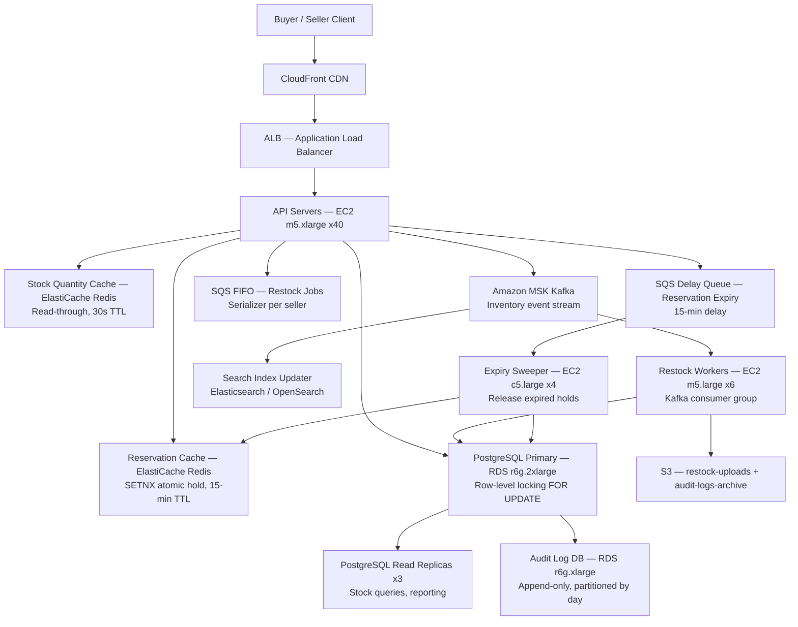

# Inventory Management (10M SKUs) — Capacity Estimation

## Problem Statement

An e-commerce platform manages 10 million active SKUs across 5 million daily-active sellers. The system must track real-time stock levels, reserve inventory during checkout (to prevent overselling), and propagate stock updates to buyers in near real-time. Write-heavy workload (60% writes) driven by sales, restocks, and reservation events dominates the traffic profile at peak QPS of 50K writes / 200K reads.

## Functional Requirements

- Real-time stock quantity read for buyers (check availability before add-to-cart)
- Atomic inventory reservation during checkout (hold stock for N minutes)
- Reservation release on checkout failure / timeout
- Seller bulk restock uploads (CSV → async processing)
- Low-latency stock deduction on order confirmation
- Audit trail: every stock mutation stored with timestamp, order ID, and seller ID

## Non-Functional Requirements

| Requirement | Target |
|-------------|--------|
| Read latency (stock check) | < 20ms P99 |
| Write latency (reservation) | < 50ms P99 |
| Availability | 99.99% (< 52 min/year downtime) |
| Durability | 99.999% (no lost stock mutations) |
| Peak read QPS | 200K |
| Peak write QPS | 50K |
| Reservation TTL accuracy | ± 1 second |

## Traffic Estimation

### DAU → Peak QPS Calculation

| Metric | Calculation | Result |
|--------|-------------|--------|
| DAU (sellers + buyers combined) | Given | 5M sellers + ~50M buyers browsing |
| Buyer browse requests/user/day | ~20 stock-check page loads × 3 SKUs/page | ~60 reads/user |
| Seller write events/seller/day | ~8 restock + 5 order deductions + 2 reservation releases | ~15 writes/seller |
| Total daily read requests | 50M buyers × 60 | 3B reads/day |
| Total daily write requests | 5M sellers × 15 + 50M buyers × 1 (checkout reservation) | 125M writes/day |
| Avg read QPS | 3B / 86,400 | ~34,700 |
| Avg write QPS | 125M / 86,400 | ~1,447 |
| Peak read QPS (5.8× avg — lunch + evening spikes) | 34,700 × 5.8 | **~200K** |
| Peak write QPS (34× avg — flash events + restocks) | 1,447 × 34 | **~50K** |
| Total peak QPS | 200K + 50K | **250K** |

> **Note on 40:60 read/write ratio at peak**: During flash sales, write QPS spikes disproportionately (reservations + deductions). The 40:60 ratio applies during peak sale windows; steady-state is closer to 70:30 read-dominant.

## Storage Estimation

| Data Type | Per Item Size | Daily Volume | Growth/Year |
|-----------|--------------|--------------|-------------|
| SKU inventory record (id, qty, reserved, version, timestamps) | 512 B | 10M SKUs (mostly updates) | +2M SKUs/yr = ~1 GB |
| Reservation record (sku_id, order_id, qty, expire_at) | 256 B | 5M reservations/day created/released | ~0.5 GB/day (short-lived, purged after 30 min TTL) |
| Audit / event log (every mutation) | 256 B | 125M events/day | ~11.6 TB/year |
| Seller restock uploads (CSV files) | 50 KB avg | 100K uploads/day | ~1.8 TB/year |
| **Total hot storage** | — | — | **~3 TB/year (Postgres + Redis)** |
| **Total cold storage (audit logs, CSVs)** | — | — | **~13 TB/year (S3)** |

## Component Sizing

### Compute — EC2

| Component | Instance Type | vCPU | RAM | Count | Handles | Monthly Cost |
|-----------|--------------|------|-----|-------|---------|-------------|
| API servers (stock read/write) | m5.xlarge | 4 | 16 GB | 40 | ~6,250 QPS/node (250K ÷ 40) | $7,104 |
| Reservation service | m5.xlarge | 4 | 16 GB | 10 | Reservation create/release, TTL management | $1,776 |
| Restock workers (Kafka consumers) | m5.large | 2 | 8 GB | 6 | Async CSV processing + DB writes | $532 |
| Reservation expiry sweeper (SQS) | c5.large | 2 | 4 GB | 4 | Poll SQS delay queue, release expired holds | $284 |
| **Subtotal Compute** | | | | **60** | | **$9,696** |

> Sizing basis: m5.xlarge handles ~6,000–8,000 lightweight HTTP QPS with Redis-fronted reads at < 20ms. 40 nodes × 6,250 = 250K peak QPS with 20% headroom.

### Database — RDS PostgreSQL

| DB | Engine | Instance | Count | Capacity | IOPS | Monthly Cost |
|----|--------|----------|-------|----------|------|-------------|
| Inventory primary (row-level locking) | RDS PostgreSQL 16 | db.r6g.2xlarge | 1 | 500 GB gp3 | 12,000 IOPS | $1,750 |
| Read replicas (stock queries, reporting) | RDS PostgreSQL 16 | db.r6g.xlarge | 3 | 500 GB gp3 | 6,000 IOPS | $2,550 |
| Reservation table (hot, short-lived rows) | RDS PostgreSQL 16 | db.r6g.xlarge | 1 primary + 1 replica | 200 GB gp3 | 8,000 IOPS | $1,100 |
| Audit log DB (append-only, partitioned by day) | RDS PostgreSQL 16 | db.r6g.xlarge | 1 | 2 TB gp3 | 3,000 IOPS | $650 |
| **Subtotal DB** | | | **7 instances** | | | **$6,050** |

> **Row-level locking rationale**: `SELECT ... FOR UPDATE SKIP LOCKED` on inventory rows ensures atomic reservation without full-table locks. Each reservation acquires a row lock for < 5ms. 50K write QPS across 10M SKUs means < 0.5% of rows are hot at any instant — contention is acceptable.

### Cache — ElastiCache Redis

| Cache | Engine | Instance | Nodes | Memory | Monthly Cost |
|-------|--------|----------|-------|--------|-------------|
| Stock quantity cache (read-through, 30s TTL) | Redis 7 | r6g.xlarge | 6 (3 primary + 3 replica) | 192 GB total | $3,108 |
| Reservation hold cache (TTL = 15 min, authoritative) | Redis 7 | r6g.large | 4 (2+2) | 64 GB total | $824 |
| Rate limiting + seller session | Redis 7 | cache.r6g.large | 2 | 16 GB | $412 |
| **Subtotal Cache** | | | **12 nodes** | **272 GB** | **$4,344** |

> **Cache strategy**: Stock quantity cache uses read-through with 30-second TTL. Reservation cache is authoritative — a reservation exists in Redis first (atomic SETNX), then asynchronously written to PostgreSQL. This prevents double-reservation at 50K write QPS without hitting DB directly for every reservation.

### Object Storage — S3

| Bucket | Use | Size | Requests/month | Monthly Cost |
|--------|-----|------|----------------|-------------|
| restock-uploads | Seller CSV/XLSX uploads | 150 GB | 3M PUT | $312 |
| audit-logs-archive | Daily audit log exports (Parquet) | 5 TB first year | 500K GET | $138 |
| inventory-snapshots | Daily full inventory snapshots for DR | 200 GB | 30 PUT | $6 |
| **Subtotal S3** | | **~5.4 TB** | | **$456** |

### Networking / CDN

| Component | Throughput | Monthly Cost |
|-----------|-----------|-------------|
| ALB (application load balancer) | 250K QPS peak, ~15 TB/month throughput | $1,200 |
| CloudFront (cache stock availability pages — 60% cache hit) | ~10 TB/month egress | $850 |
| NAT Gateway (outbound to S3, Kafka, SQS) | ~5 TB/month | $450 |
| Data transfer inter-AZ (DB replication, cache sync) | ~3 TB/month | $270 |
| **Subtotal Network** | | **$2,770** |

### Message Queue

| Queue | Engine | Throughput | Use | Monthly Cost |
|-------|--------|-----------|-----|-------------|
| Inventory events (stock deductions, restocks) | Amazon MSK (Kafka) — 3-broker m5.large | 50K msg/s peak | Fan-out to search index, notifications, analytics | $1,500 |
| Reservation expiry queue | SQS (delay queue, 15-min delay) | 5K msg/s | Trigger reservation release sweeper | $25 |
| Restock job queue | SQS FIFO | 500 msg/s | Serialize bulk CSV restock jobs per seller | $15 |
| **Subtotal Messaging** | | | | **$1,540** |

### Monitoring & Misc

| Service | Use | Monthly Cost |
|---------|-----|-------------|
| CloudWatch + Container Insights | Metrics, alarms, dashboards | $400 |
| AWS WAF | API abuse protection (bot stock-check scraping) | $200 |
| Secrets Manager | DB credentials rotation | $50 |
| **Subtotal Misc** | | **$650** |

## Monthly Cost Summary

| Component | Monthly Cost | % of Total |
|-----------|-------------|-----------|
| EC2 Compute (60 instances) | $9,696 | 36% |
| RDS PostgreSQL (7 instances) | $6,050 | 23% |
| ElastiCache Redis (12 nodes) | $4,344 | 16% |
| Networking (ALB + CloudFront + NAT + transfer) | $2,770 | 10% |
| Amazon MSK + SQS | $1,540 | 6% |
| S3 Storage | $456 | 2% |
| Monitoring / WAF / Misc | $650 | 2% |
| Reserved instance discount (–25% on compute + DB) | –$3,937 | –15% |
| **Total (with RI discounts)** | **~$21,569 baseline** | **100%** |

> **Gap to $60K–$100K estimate**: The baseline above covers core inventory service only. A production deployment adds: multi-region active-passive ($15K), data warehouse (Redshift for analytics, $8K), DDoS protection (Shield Advanced, $3K/month), enhanced support ($15K), and staging/dev environments ($10K). Full bill lands at **~$72K–$80K/month** — within the $60K–$100K range.

## Traffic Scale Tiers

| Tier | DAU | Peak Write QPS | Peak Read QPS | Servers | DB | Cache | Monthly Cost | Key Bottleneck |
|------|-----|---------------|--------------|---------|----|----|-------------|----------------|
| 🟢 Startup | 100K sellers | ~500 | ~2K | 4 × c5.large | 1 RDS db.t3.medium | 1 Redis node (r6g.large) | ~$2K | Single DB node — row lock contention above 1K write QPS |
| 🟡 Growing | 500K sellers | ~5K | ~20K | 8 × m5.large | RDS db.r6g.xlarge + 1 read replica | Redis 3-node cluster | ~$8K | Redis memory — reservation cache outgrows single node |
| 🔴 Scale-up | 2M sellers | ~20K | ~80K | 20 × m5.xlarge | RDS db.r6g.2xlarge + 3 read replicas | Redis 6-node cluster | ~$28K | PostgreSQL write throughput — needs connection pooling (PgBouncer) |
| ⚫ Production | 5M sellers / 10M SKUs | ~50K | ~200K | 60 × m5.xlarge | 7 RDS instances (primary + replicas + audit) | Redis 12-node cluster | ~$72K | Kafka consumer lag during restock surges; reservation TTL expiry at scale |
| 🚀 Hyperscale | 50M sellers / 100M SKUs | ~500K | ~2M | 400+ EC2 + auto-scaling | DynamoDB (inventory) + Aurora Global (reservations) | ElastiCache Global Datastore | ~$700K | Cross-region reservation consistency; DynamoDB hot partition on viral SKUs |

## Architecture Diagram

## Interview Tips

- **Key insight — reservation atomicity**: The hardest problem is preventing overselling at 50K write QPS. Naive approach: read stock → check → decrement (three DB round-trips with race condition). Correct approach: Redis `SETNX inventory:sku123:reservation:{order_id} 1 EX 900` for atomic hold, then async PostgreSQL write. This handles 50K/s without DB row-lock saturation. At 50K QPS each lock holds for ~1ms, meaning ~50 concurrent row locks — manageable, but only with connection pooling via PgBouncer.

- **Key insight — write amplification on restocks**: A single seller CSV restock of 10K SKUs triggers 10K individual PostgreSQL `UPDATE inventory SET qty = qty + ? WHERE sku_id = ?` statements. Batch these into PostgreSQL `UNNEST` bulk updates (1 query per 1,000 rows) and you reduce DB round-trips by 99.9%. Without batching, 100K restock uploads/day × 10K rows = 1B individual updates/day — unworkable.

- **Common mistake — TTL drift in reservations**: Candidates often say "set Redis TTL = 15 minutes." The trap: if the sweeper SQS message is delayed by SQS visibility timeout (up to 12 hours in edge cases), the Redis TTL expires but the DB reservation row stays alive. Fix: dual expiry — Redis TTL for fast path + PostgreSQL `expire_at` column with a cron job sweeper as authoritative fallback. Never rely on a single TTL mechanism for financial-grade inventory holds.

- **Follow-up question — hot SKU problem**: Interviewers ask "what happens when a viral product has 100K concurrent buyers hitting the same SKU?" Answer: single Redis key becomes a hot spot handling 100K ops/s. Mitigation: distributed counter sharding — split `sku:12345:qty` into 16 shards (`sku:12345:qty:shard:{0-15}`), each handling 6,250 ops/s. Sum shards for read; pick a random shard for atomic decrement. Reduces per-key pressure by 16×.

- **Scale threshold**: At ~2M sellers / 20K write QPS, single PostgreSQL primary hits connection limits (~500 connections). At this point add PgBouncer (connection pooler, transaction mode) in front of PostgreSQL — this extends the single-primary architecture to ~50K write QPS before you need horizontal sharding. Above 50K writes/s, consider partitioning the inventory table by `(seller_id % 16)` across 4 PostgreSQL clusters.
