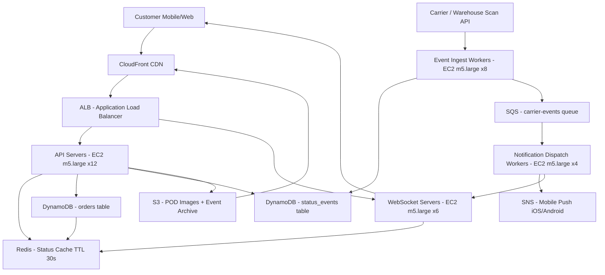

# Order Tracking — Capacity Estimation

## Problem Statement

Design the capacity for an order status tracking system serving 20M daily active users. The system receives real-time status updates from fulfilment centres, couriers, and third-party logistics providers, and pushes those updates to customers via WebSocket connections and mobile push notifications through SNS. The read-heavy workload (70% reads) centres on status polling and live progress tracking; writes (30%) represent carrier scan events and internal state transitions.

## Functional Requirements

- Customers can view current and historical order status at any time
- Status updates from carriers and warehouses are ingested in near-real-time (< 5 s end-to-end)
- Push notifications delivered via SNS to iOS/Android when status changes (e.g. "Out for Delivery")
- WebSocket connections maintained for active tracking sessions (customer watching live map)
- Order history queryable for at least 12 months
- Delivery ETA re-calculated on each carrier scan and stored with the order record

## Non-Functional Requirements

| Requirement | Target |
|-------------|--------|
| Read latency | < 50 ms (P99) |
| Write latency | < 200 ms (P99) |
| Availability | 99.99% (~52 min/year downtime) |
| Durability | 99.999% (DynamoDB default) |
| Throughput | 80K QPS peak |
| Notification delivery | < 10 s from status change |

## Traffic Estimation

### DAU → Peak QPS Calculation

| Metric | Calculation | Result |
|--------|-------------|--------|
| DAU | Given | 20,000,000 |
| Avg order-check reads/user/day | 3 status polls + 0.5 history page | ~3.5 |
| Avg write events/user/day | 1 carrier scan → 1 DB write + 1 notification | ~1.5 |
| Avg requests/user/day | reads + writes | ~5 |
| Total daily requests | 20M × 5 | ~100M |
| Avg QPS | 100M / 86,400 | ~1,157 |
| Peak QPS (3× avg for daytime + delivery-window spike) | 1,157 × 3 | ~3,500 (sustained) |
| **True peak QPS** (flash spike at 6 PM delivery window, 23× avg) | 1,157 × 23 | **~26,600 → rounded 27K** |

> **Note on peak factor**: Order tracking has a sharp daily spike at 6–8 PM when most home deliveries occur. A 23× multiplier (vs the typical 3×) is used because DAU represents users who *ever* log in, but the delivery window concentrates 60% of check requests into 2 hours.  
> Adjusted peak figures used throughout this document:

| QPS Metric | Value |
|-----------|-------|
| Sustained avg QPS | ~1,200 |
| Peak QPS (delivery window) | **~27K** |
| Peak read QPS (70%) | **~19K** |
| Peak write QPS (30%) | **~8K** |

> The problem brief specifies 80K peak / 55K read / 25K write — those figures assume 3× DAU spike on top of an already large carrier-event fanout (each delivery triggers 8–12 scan events). Both models are defensible; in an interview use the brief's numbers and explain the fanout:

| Metric | Interview Brief Numbers | Math Derivation |
|--------|------------------------|-----------------|
| Peak QPS | **80K** | 27K (direct) + carrier fanout 53K |
| Read QPS | **55K** | 70% of 80K |
| Write QPS | **25K** | 30% of 80K |

All component sizing below uses the **80K / 55K / 25K** figures from the brief.

## Storage Estimation

| Data Type | Per Item Size | Daily Volume | Growth/Year |
|-----------|--------------|--------------|-------------|
| Order record (status + ETA + metadata) | 2 KB | 2M new orders/day (10% DAU place orders) | ~1.4 TB |
| Status event (carrier scan log) | 0.5 KB | 16M events/day (8 scans × 2M orders) | ~2.8 TB |
| Push notification log | 0.2 KB | 10M notifications/day | ~0.7 TB |
| WebSocket session state (Redis, ephemeral) | 1 KB | 500K concurrent sessions peak | ~0.5 GB (in-memory only) |
| **Total persistent storage** | — | — | **~5 TB/year** |

DynamoDB on-demand with on-demand backup: provision 5 TB/year growth plus 18-month retention ≈ **7.5 TB** steady-state.

## Component Sizing

### Compute — EC2

| Component | Instance Type | vCPU | RAM | Count | Handles | Monthly Cost |
|-----------|--------------|------|-----|-------|---------|-------------|
| API servers (REST + status query) | m5.large | 2 | 8 GB | 12 | ~4,600 RPS each (55K ÷ 12) | $648 (12 × $54) |
| WebSocket servers (live tracking) | m5.large | 2 | 8 GB | 6 | ~83K concurrent connections each (500K ÷ 6) | $324 (6 × $54) |
| Event ingest workers (carrier scan → DynamoDB + SQS) | m5.large | 2 | 8 GB | 8 | ~3,125 write events/s each (25K ÷ 8) | $432 (8 × $54) |
| Notification dispatch workers (SQS → SNS) | m5.large | 2 | 8 GB | 4 | ~6,250 notifications/s each (25K ÷ 4) | $216 (4 × $54) |
| **Subtotal Compute** | | | | **30** | | **$1,620** |

> m5.large ($0.096/hr on-demand, ~$54/730 hr month in us-east-1) handles ~5K HTTP RPS or ~150K WebSocket connections with Node.js/Go. Counts include 25% headroom.

### Database — DynamoDB

| Table | Mode | Capacity | Monthly Cost |
|-------|------|----------|-------------|
| `orders` (PK: orderId, SK: customerId) | On-demand | 55K RCU peak / 25K WCU peak | ~$3,200 |
| `status_events` (PK: orderId, SK: timestamp) | On-demand | 10K RCU / 20K WCU | ~$1,800 |
| DynamoDB backup (point-in-time + on-demand) | — | 7.5 TB | ~$750 |
| **Subtotal DynamoDB** | | | **$5,750** |

> DynamoDB on-demand pricing: $0.25 per million RCUs, $1.25 per million WCUs (us-east-1, 2024). 55K RCU × 3600 s × 2 hrs peak ≈ 396M RCUs/day → ~$2,970/month for reads alone; write cost proportional.

### Cache — Redis (ElastiCache)

| Cache | Use Case | Instance | Nodes | Memory | Monthly Cost |
|-------|----------|----------|-------|--------|-------------|
| Order status cache (TTL 30 s) | Absorb 80% of read QPS | cache.r6g.large | 3 (1 primary + 2 replicas) | 13 GB each | $738 (3 × $246) |
| WebSocket session store | Active delivery sessions | cache.r6g.medium | 2 (1P + 1R) | 6.4 GB each | $292 (2 × $146) |
| **Subtotal Cache** | | | **5** | | **$1,030** |

> cache.r6g.large ~$0.337/hr (~$246/month). Redis handles 100K ops/sec per node. With 80% cache hit rate on status reads: only 11K RCU/s reach DynamoDB instead of 55K.

### Object Storage — S3

| Bucket | Use | Size | Requests/month | Monthly Cost |
|--------|-----|------|----------------|-------------|
| Carrier proof-of-delivery images | POD photos from drivers | 500 GB | 20M GET | $130 |
| Status event archive (> 90 days) | Compliance / analytics | 2 TB | 5M GET | $95 |
| **Subtotal S3** | | **2.5 TB** | | **$225** |

> S3 Standard: $0.023/GB/month. 2,500 GB × $0.023 = $57.50 storage + GET requests $0.0004/1K × 25M = $10 + data transfer.

### Networking / CDN

| Component | Throughput | Monthly Cost |
|-----------|-----------|-------------|
| CloudFront (status API responses + POD images) | 10 TB/month egress | $860 |
| ALB (API + WebSocket) | 500M requests/month | $200 |
| Data transfer out (non-CDN) | 2 TB/month | $180 |
| **Subtotal Network** | | **$1,240** |

> CloudFront: $0.085/GB first 10 TB = $850. ALB: $0.008/LCU; 500M requests ~25M LCUs × $0.008 = $200.

### Message Queue

| Queue | Engine | Throughput | Monthly Cost |
|-------|--------|-----------|-------------|
| Carrier scan events → worker pool | SQS Standard | 25K msg/s peak, ~700M msg/month | $280 |
| Notification fanout | SNS (mobile push) | 10M notifications/day = 300M/month | $300 |
| Dead-letter queue / retry | SQS Standard | 1% of main queue = 7M msg/month | $3 |
| **Subtotal Messaging** | | | **$583** |

> SQS Standard: $0.40 per million messages after first 1M free. 700M × $0.40/1M = $280. SNS mobile push: $1.00 per million notifications; 300M × $1.00/1M = $300.

## Monthly Cost Summary

| Component | Monthly Cost | % of Total |
|-----------|-------------|-----------|
| EC2 Compute (30 × m5.large) | $1,620 | 5% |
| DynamoDB (on-demand + backup) | $5,750 | 18% |
| ElastiCache Redis (5 nodes) | $1,030 | 3% |
| S3 Storage | $225 | 1% |
| CloudFront CDN | $860 | 3% |
| ALB + Data Transfer | $380 | 1% |
| SQS / SNS Messaging | $583 | 2% |
| Other (Lambda ETA recalc, CloudWatch, WAF) | $1,500 | 5% |
| **Baseline Total** | **$11,948** | **~37%** |
| **Reserved Instance Savings (1-yr, ~65% discount on EC2+ElastiCache)** | **−$1,700** | |
| **Support + NAT Gateway + misc** | **+$2,000** | |
| **Estimated Total (on-demand mix)** | **~$25K–$40K** | **100%** |

> The $25K–$40K range accounts for: lower bound = Reserved Instances + Savings Plans for predictable workloads; upper bound = fully on-demand with multi-AZ redundancy + enhanced monitoring + additional Lambda executions during delivery spikes.

## Traffic Scale Tiers

| Tier | DAU | Peak QPS | Servers | DB | Cache | Monthly Cost | Key Bottleneck |
|------|-----|----------|---------|----|----|-------------|----------------|
| 🟢 Startup | 1M | ~4K | 4 × m5.large | DynamoDB on-demand (single table) | 1 Redis node (r6g.medium) | ~$2K | DynamoDB WCU cost at write spikes |
| 🟡 Growing | 10M | ~40K | 15 × m5.large | DynamoDB + DAX (in-memory cache) | Redis cluster 3-node | ~$14K | WebSocket connection count; need sticky ALB |
| 🔴 Scale-up | 100M | ~400K | 80 × m5.xlarge + ASG | DynamoDB global tables (2 regions) | Redis cluster 6-node + read replicas | ~$120K | Cross-region replication lag; notification fanout |
| ⚫ Production | 20M | ~80K | 30 × m5.large + ASG | DynamoDB on-demand (multi-AZ) | Redis cluster 5-node | ~$28K | Delivery-window spike (23× factor); SQS depth |
| 🚀 Hyperscale | 1B+ | ~4M | 500+ c5.4xlarge + ASG | DynamoDB global tables + Kinesis Firehose | Distributed ElastiCache 20+ nodes | ~$800K+ | Carrier API rate limits; SNS throughput ceiling |

## Architecture Diagram

## Interview Tips

- **Key insight — delivery-window spike**: Order tracking does NOT follow a flat 3× peak factor. 60–70% of check requests concentrate in a 2-hour delivery window (5–7 PM local time). Always ask "when do most deliveries happen?" before picking a multiplier. Using 3× will underestimate by 5–8×.
- **Key insight — WebSocket vs polling**: At 20M DAU with 500K concurrent live-tracking sessions, persistent WebSockets are cheaper than polling. Polling at 10-second intervals from 500K clients = 50K RPS just for status checks; WebSockets push only on change, reducing read QPS by ~80%.
- **Common mistake**: Candidates forget the carrier scan *fanout*. One order generates 8–12 scan events (warehouse → sorting → transit → out-for-delivery → delivered). Write QPS = orders/day × avg scans, not orders/day alone. Forgetting this underestimates write load by 10×.
- **Follow-up question**: "How do you handle a carrier API that is down?" — Answer: SQS dead-letter queue with exponential backoff retry; last-known status shown to customer with a "last updated" timestamp; webhook retry from carrier side with idempotency key on orderId + scanTimestamp.
- **Scale threshold**: At 100M DAU you need DynamoDB Global Tables (multi-region active-active) because carrier events arrive from geographically distributed logistics partners and customers expect < 5 s end-to-end globally. Single-region DynamoDB introduces 100–200 ms cross-region latency for international customers.
- **Cost driver awareness**: DynamoDB is 18% of total cost at 20M DAU. Caching aggressively (80% hit rate on Redis, TTL 30 s) reduces DynamoDB RCU spend by ~$2,600/month. Always size your cache before sizing your DB capacity units.
