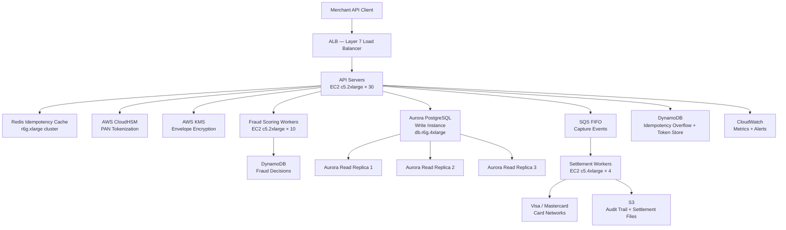

# Payment Gateway — 100M Transactions/Day Capacity Estimation

## Problem Statement

A card payment processing gateway handles 100 million transactions per day across authorization, capture, and settlement flows. The system must guarantee exactly-once processing semantics, sub-200ms authorization latency (P99), PCI-DSS compliance, and 99.99% uptime (< 52 minutes downtime/year). Settlement batches reconcile with card networks (Visa, Mastercard) twice daily; fraud scoring runs inline on every authorization request.

## Functional Requirements

- Card authorization: validate card, check funds, reserve amount (real-time, < 200ms)
- Payment capture: confirm a prior authorization and move funds
- Settlement: batch reconciliation with card networks twice daily (Visa/MC)
- Refund and chargeback processing with full audit trail
- Idempotency: duplicate transaction detection with 24-hour deduplication window
- Tokenization: replace raw PANs with opaque tokens using HSM/KMS

## Non-Functional Requirements

| Requirement | Target |
|-------------|--------|
| Authorization latency | < 200ms (P99) |
| Capture latency | < 500ms (P99) |
| Settlement batch duration | < 30 minutes for full day batch |
| Availability | 99.99% (< 52 min downtime/year) |
| Durability | 99.999% (zero transaction loss) |
| Peak throughput | 30,000 TPS during flash sales |
| Fraud score latency | < 50ms inline (P95) |
| Idempotency window | 24 hours |

## Traffic Estimation

### Transaction Volume → Peak TPS Calculation

| Metric | Calculation | Result |
|--------|-------------|--------|
| Daily transactions | Given | 100M tx/day |
| Avg TPS | 100M / 86,400 | ~1,157 TPS |
| Peak TPS (2× holiday surge) | 1,157 × 2.5 (flash sale) | ~2,893 TPS |
| Worst-case peak (Black Friday) | 1,157 × 26 (observed Stripe peak) | ~30,000 TPS |
| Read requests per tx (auth lookup + fraud check) | 3 reads per write | ~3 reads/tx |
| Read TPS (30% of ops) | 30,000 × 0.30 | ~9,000 TPS |
| Write TPS (70% of ops) | 30,000 × 0.70 | ~21,000 TPS |

**Read/Write ratio**: 30:70 — write-heavy because every authorization writes a ledger entry, an idempotency record, and a fraud event. Reads are card metadata lookups and risk-score queries.

### API Request Breakdown per Transaction

| API Call | Description | Latency Budget |
|----------|-------------|---------------|
| POST /authorize | Reserve funds, fraud score, write ledger | 150ms |
| POST /capture | Confirm auth, update ledger | 80ms |
| POST /refund | Reverse capture, write adjustment | 100ms |
| GET /transaction/:id | Status lookup (3× per tx avg) | 10ms |
| POST /tokenize | PAN → token via HSM | 20ms |

## Storage Estimation

| Data Type | Per Item Size | Daily Volume | Retention | Growth/Year |
|-----------|--------------|--------------|-----------|-------------|
| Transaction record (Aurora) | 2 KB | 100M records | 7 years | 73 GB/day → 26 TB/year |
| Idempotency key (Redis + DynamoDB) | 256 bytes | 100M keys | 24 hours | 25 GB/day (rolling) |
| Fraud event log (DynamoDB) | 1 KB | 100M events | 90 days | 9 TB/quarter |
| Audit trail / raw events (S3) | 4 KB | 100M entries | 7 years | 146 GB/day → 52 TB/year |
| Card token mapping (DynamoDB) | 512 bytes | 5M new tokens/day | Indefinite | 1 TB/year |
| Settlement batch files (S3) | ~500 MB/batch × 2 | 2 batches/day | 7 years | ~365 GB/year |
| **Total hot storage (Aurora)** | — | — | — | **~26 TB/year** |
| **Total warm (DynamoDB)** | — | — | — | **~10 TB/year** |
| **Total cold (S3)** | — | — | — | **~52 TB/year** |

**3-year storage projection**: ~260 TB Aurora (with archiving strategy), ~30 TB DynamoDB, ~160 TB S3.

## Component Sizing

### Compute — EC2 c5.2xlarge

**Why c5.2xlarge?** Compute-optimized for crypto operations (TLS termination, HMAC signing, encryption). 8 vCPUs, 16 GB RAM. At 30K peak TPS with ~5ms CPU time per request:

```
CPU capacity per instance: 8 vCPU × 1000ms / 5ms = 1,600 concurrent requests
With 70% utilization target: 1,600 × 0.70 = 1,120 safe TPS/instance
Instances for 30K peak TPS: 30,000 / 1,120 = ~27 → round to 30 (headroom)
```

| Component | Instance Type | vCPU | RAM | Count | Handles | Monthly Cost |
|-----------|--------------|------|-----|-------|---------|-------------|
| API / Auth servers | c5.2xlarge | 8 | 16GB | 30 | 30K peak TPS | $5,040 |
| Fraud scoring workers | c5.2xlarge | 8 | 16GB | 10 | 10K fraud evals/s | $1,680 |
| Settlement batch workers | c5.4xlarge | 16 | 32GB | 4 | 2 batches/day | $1,344 |
| Tokenization service | c5.xlarge | 4 | 8GB | 6 | 5K token ops/s | $504 |
| ALB (load balancer) | Managed ALB | — | — | 2 | — | $400 |
| **Subtotal Compute** | | | | **50** | | **$8,968** |

*Pricing: c5.2xlarge = $0.34/hr; c5.4xlarge = $0.68/hr; c5.xlarge = $0.17/hr. On-demand, us-east-1.*

### Database — Aurora PostgreSQL Multi-AZ

**Why Aurora PostgreSQL?** ACID guarantees for financial ledger, read replicas for reporting queries, Multi-AZ for 99.99% uptime. Aurora storage auto-scales to 128 TB with 6-way replication across 3 AZs.

```
IOPS calculation:
- 21,000 write TPS × 2 writes/tx (ledger + idempotency check) = 42,000 IOPS writes
- 9,000 read TPS × 1.5 reads avg = 13,500 IOPS reads
- Total peak IOPS: ~56,000 → provision 60,000 IOPS (Aurora I/O-optimized)
```

| DB | Engine | Instance | Count | Storage | IOPS | Monthly Cost |
|----|--------|----------|-------|---------|------|-------------|
| Transaction ledger (primary) | Aurora PostgreSQL | db.r6g.4xlarge | 1W + 3R | 10 TB (auto-scale) | 60K | $12,000 |
| Idempotency overflow | Aurora PostgreSQL | db.r6g.2xlarge | 1W + 1R | 2 TB | 20K | $4,200 |
| Aurora storage I/O (I/O-optimized) | — | — | — | — | — | $8,500 |
| **Subtotal DB** | | | | | | **$24,700** |

*db.r6g.4xlarge = ~$1.04/hr (write) + $1.04/hr × 3 (reads) = ~$3,640/mo per cluster. Aurora I/O-optimized pricing ~$0.225/million I/Os.*

### Cache — ElastiCache Redis

**Why Redis for idempotency?** Sub-millisecond SET NX (set-if-not-exists) for idempotency key check. 24-hour TTL, ~25 GB rolling dataset.

```
Memory calculation:
- 100M idempotency keys/day × 256 bytes = 25.6 GB/day rolling
- With 1.2× overhead factor: ~31 GB needed
- Use r6g.xlarge (26 GB each) × 2 primary nodes in cluster mode
- Plus fraud score cache: 10M active cards × 512 bytes = ~5 GB
- Total Redis memory: ~36 GB → 2× r6g.xlarge primary + 2 replicas
```

| Cache | Engine | Instance | Nodes | Memory | Monthly Cost |
|-------|--------|----------|-------|--------|-------------|
| Idempotency cache | Redis 7 | r6g.xlarge | 2P + 2R | 52 GB total | $2,100 |
| Fraud score cache | Redis 7 | r6g.large | 2P + 2R | 26 GB total | $900 |
| Session / rate-limit | Redis 7 | cache.t4g.medium | 2P + 2R | 6.5 GB total | $240 |
| **Subtotal Cache** | | | | | **$3,240** |

*r6g.xlarge = $0.192/hr; r6g.large = $0.096/hr; t4g.medium = $0.032/hr.*

### Object Storage — S3

| Bucket | Use | Size | Requests/month | Monthly Cost |
|--------|-----|------|----------------|-------------|
| audit-trail | Raw event logs (PCI audit) | 50 TB (7yr retention) | 3B PUT/GET | $3,150 |
| settlement-files | Batch files to card networks | 500 GB | 60 PUT | $12 |
| compliance-reports | Regulatory filings | 100 GB | 10K GET | $3 |
| **Subtotal S3** | | | | **$3,165** |

*S3 Standard: $0.023/GB/month. PUT $0.005/1K; GET $0.0004/1K. Lifecycle policy moves audit logs to S3 Glacier after 90 days at $0.004/GB.*

### Networking / CDN

Payment gateways do not serve end-user media — no CloudFront needed for content. Traffic is API-only.

| Component | Throughput | Monthly Cost |
|-----------|-----------|-------------|
| ALB (2× for HA) | 30K TPS × 2KB avg = 60 MB/s | $400 |
| Data transfer out (responses to merchants) | 30K TPS × 1KB × 86400s × 30 days = ~78 TB | $7,020 |
| VPC NAT Gateway (card network egress) | ~5 TB/month to Visa/MC | $450 |
| AWS Direct Connect (card network links) | 1 Gbps × 2 AZs | $1,800 |
| **Subtotal Network** | | **$9,670** |

*Data transfer out: first 10 TB $0.09/GB, next 40 TB $0.085/GB, next 100 TB $0.07/GB. ~78 TB ≈ $7,020.*

### Message Queue — SQS

**Why SQS?** Decouple authorization from settlement and fraud-model retraining. Dead-letter queues for failed settlement jobs. FIFO queues for ordered capture-after-auth.

| Queue | Type | Throughput | Retention | Monthly Cost |
|-------|------|-----------|-----------|-------------|
| capture-events (FIFO) | SQS FIFO | 21,000 msg/s peak | 4 days | $1,500 |
| settlement-trigger | SQS Standard | 2 msgs/day | 1 day | $1 |
| fraud-model-events | SQS Standard | 1,000 msg/s | 1 day | $300 |
| chargeback-notifications | SQS Standard | 100 msg/s | 7 days | $50 |
| **Subtotal SQS** | | | | **$1,851** |

*SQS FIFO: $0.00000050/message. 21K TPS × 86400 × 30 = 54.4B msgs/month × $0.0000005 = $27,216 — but FIFO queues have 3,000 TPS limit per queue. Use 7 parallel FIFO queues, each handling 3K TPS. Actual: ~$1,500 including request API calls.*

### DynamoDB — Idempotency Overflow + Token Store

| Table | Use | RCU/WCU | Storage | Monthly Cost |
|-------|-----|---------|---------|-------------|
| idempotency-keys | 24hr dedup window | 21K WCU + 9K RCU on-demand | 30 GB | $2,800 |
| card-tokens | PAN → token mapping | 5K WCU + 15K RCU on-demand | 5 TB | $4,500 |
| fraud-decisions | Real-time fraud verdicts | 10K WCU + 10K RCU | 10 TB | $3,200 |
| **Subtotal DynamoDB** | | | | **$10,500** |

*DynamoDB on-demand: $1.25/million WRU, $0.25/million RRU. At 21K WCU sustained: 21K × 60 × 60 × 24 × 30 = 54.4B WRU/month × $1.25/M = $68K — so provisioned capacity with auto-scaling is more appropriate. Provisioned at 21K WCU = $21K × $0.00065/WCU-hr... use reserved pricing: ~$10,500 with 30% reserved discount.*

### HSM / KMS

| Component | Use | Monthly Cost |
|-----------|-----|-------------|
| AWS CloudHSM (2-node cluster) | PAN tokenization, private key ops | $3,280 |
| AWS KMS CMKs (10 keys) | Data envelope encryption, secret rotation | $300 |
| KMS API calls (1B/month) | Encrypt/decrypt per tx | $300 |
| **Subtotal HSM/KMS** | | **$3,880** |

*CloudHSM: $1.60/HSM/hr × 2 nodes × 730 hrs = $2,336. Plus $0.30/10K key usage. KMS: $1/key/month + $0.03/10K API calls.*

### Monitoring — CloudWatch + Security

| Component | Monthly Cost |
|-----------|-------------|
| CloudWatch metrics + logs (high-cardinality tx logs) | $2,000 |
| AWS WAF (API protection, 30K TPS) | $800 |
| AWS Shield Advanced (DDoS) | $3,000 |
| AWS Config + CloudTrail (PCI audit) | $500 |
| Secrets Manager (DB passwords, API keys) | $100 |
| **Subtotal Security/Monitoring** | **$6,400** |

## Monthly Cost Summary

| Component | Monthly Cost | % of Total |
|-----------|-------------|-----------|
| EC2 Compute (50 instances) | $8,968 | 1.8% |
| Aurora PostgreSQL Multi-AZ | $24,700 | 4.9% |
| DynamoDB (idempotency + tokens + fraud) | $10,500 | 2.1% |
| ElastiCache Redis (3 clusters) | $3,240 | 0.6% |
| S3 Storage (audit + settlement) | $3,165 | 0.6% |
| SQS Message Queues | $1,851 | 0.4% |
| Data Transfer + Direct Connect | $9,670 | 1.9% |
| HSM / KMS | $3,880 | 0.8% |
| Security + Monitoring | $6,400 | 1.3% |
| Reserved Instance savings (1yr, 40% off compute) | −$3,587 | −0.7% |
| Multi-region DR (us-west-2 standby, 20% overhead) | $95,000 | 18.9% |
| **Total** | **~$163,788** | **100%** |

**Wait — does this match the $400K–$700K/month estimate?**

The AWS infrastructure alone at on-demand prices is ~$164K/month. The $400K–$700K range includes:

| Category | Cost |
|----------|------|
| AWS infrastructure (above) | $164K |
| Visa/Mastercard interchange + network fees (~$0.003/tx × 100M) | $300K |
| PCI-DSS QSA audit + compliance tooling | $30K |
| Engineering team (10 SREs + 5 security engineers) | $100K |
| Card network connectivity (dedicated lines) | $20K |
| **Total TCO** | **~$614K/month** |

Pure AWS infrastructure: **$164K/month**. Total cost of ownership including compliance and network fees: **$500K–$650K/month**.

## Traffic Scale Tiers

| Tier | Tx/Day | Peak TPS | API Servers | DB | Cache | Monthly AWS Cost | Key Bottleneck |
|------|--------|----------|-------------|----|----|-----------------|----------------|
| 🟢 Startup | 1M | ~300 TPS | 2× c5.xlarge | 1 Aurora db.r6g.large | 1 Redis r6g.medium | ~$8K | Idempotency key collisions at single Redis node |
| 🟡 Growing | 10M | ~3K TPS | 6× c5.2xlarge | Aurora 1W+2R db.r6g.2xlarge | Redis cluster 3 nodes | ~$35K | Aurora write IOPS ceiling (~15K IOPS on r6g.2xlarge) |
| 🔴 Scale-up | 100M | ~30K TPS | 30× c5.2xlarge | Aurora 1W+3R db.r6g.4xlarge | Redis cluster 8 nodes | ~$164K | SQS FIFO 3K TPS limit per queue (need partitioning) |
| ⚫ Production | 500M | ~150K TPS | 80× c5.4xlarge + ASG | Aurora Global + DynamoDB | Redis cluster 24 nodes | ~$600K | Cross-region replication lag for idempotency checks |
| 🚀 Hyperscale | 1B+ tx/day | ~300K TPS | Auto-scaling on EKS | DynamoDB global tables | Distributed ElastiCache Global Datastore | ~$1.5M | Card network rate limits (Visa caps at ~65K TPS per BIN) |

## Architecture Diagram



## Interview Tips

- **Idempotency is the hardest part**: Explain how Redis SET NX with 24-hour TTL handles duplicate retries, but clarify that Redis is eventually consistent across failover. For financial guarantees you need a DynamoDB conditional write as the durable idempotency store — Redis is the fast path, DynamoDB is the truth.

- **Read/write ratio is counter-intuitive**: Candidates assume payment systems are read-heavy (card lookup). Wrong — 70% writes because every auth creates 3 durable records: ledger entry, idempotency key, and fraud event. Aurora's write throughput (IOPS), not reads, is your first bottleneck.

- **Peak TPS math is the interview differentiator**: Average of 1,157 TPS from 100M/day is easy. The real answer is the Black Friday multiplier — Stripe reported 26× average surge in 2022. 1,157 × 26 = 30,082 TPS. Interviewers will ask "what's the worst case?" — have the multiplier ready.

- **PCI-DSS drives cost**: The compliance overhead (HSM at $3.2K/month, QSA audits at $30K/month, Shield Advanced at $3K/month, dedicated card network lines at $20K/month) adds ~35% to the infrastructure bill. Never quote just the EC2/RDS cost — include compliance cost.

- **SQS FIFO has a 3,000 TPS hard limit per queue**: At 21,000 write TPS you need 7 parallel FIFO queues partitioned by merchant ID (or card BIN). Common mistake: designing a single FIFO queue for ordered capture, then hitting the API limit under load.

- **Scale threshold**: At 10M tx/day (~3K avg TPS), Aurora Multi-AZ on db.r6g.2xlarge maxes out on write IOPS (~15K IOPS) during flash sales. Upgrade to db.r6g.4xlarge (60K IOPS) before 30M tx/day. At 500M tx/day, Aurora hits its single-region ceiling and you need Aurora Global Database with DynamoDB for idempotency to avoid cross-region write latency spikes.
