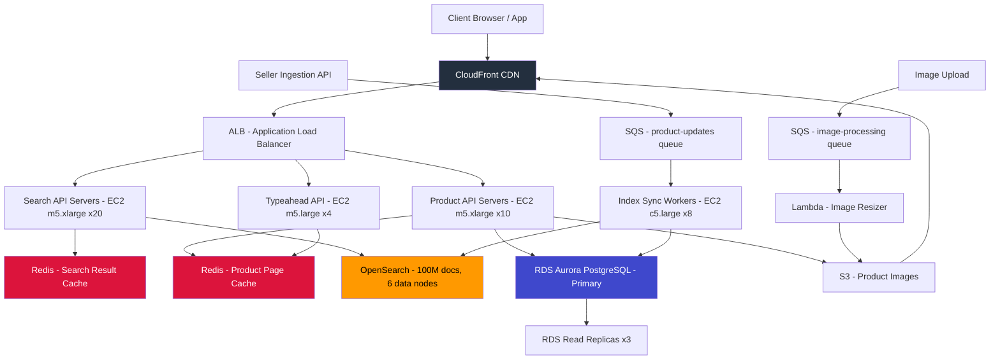

# Product Catalog + Faceted Search — Capacity Estimation

## Problem Statement

A mid-scale e-commerce platform serves 50 million daily active users browsing, searching, and filtering a product catalog of 100 million SKUs. The system must support faceted search (filter by brand, price range, rating, category), near-real-time product updates (price changes, inventory status), and low-latency reads for product detail pages. The read-heavy workload (95:5 read/write ratio) demands aggressive caching and a dedicated search tier separate from the transactional database.

## Functional Requirements

- Full-text product search with faceted filtering (brand, category, price, rating, availability)
- Product detail pages (title, description, images, specs, reviews summary)
- Real-time inventory status and pricing (updated within 60 seconds)
- Category and subcategory browsing with sorted results
- Autocomplete / typeahead search suggestions
- Seller-side product ingestion (new listings, price/inventory updates)

## Non-Functional Requirements

| Requirement | Target |
|-------------|--------|
| Search latency | < 200ms (P99) |
| Product page load | < 100ms (P99, cache-hit) |
| Write latency | < 500ms (P99, including index propagation) |
| Availability | 99.99% (< 52 min downtime/year) |
| Durability | 99.999% (RDS + S3 durability) |
| Throughput | 400K QPS peak |
| Search index freshness | < 60s for price/inventory changes |

## Traffic Estimation

### DAU → Peak QPS Calculation

| Metric | Calculation | Result |
|--------|-------------|--------|
| DAU | Given | 50,000,000 |
| Avg search requests/user/day | 3 searches + 5 product pages + 1 category browse | ~9 read requests |
| Avg write requests/user/day | 0.1 (review, wishlist add — 5% of users) | ~0.1 write requests |
| Total daily read requests | 50M × 9 | 450M reads/day |
| Total daily write requests | 50M × 0.1 | 5M writes/day |
| Total daily requests | 450M + 5M | 455M requests/day |
| Avg QPS | 455M / 86,400 | ~5,266 avg QPS |
| Peak QPS (3× avg, evening + flash sales) | 5,266 × 3 | ~15,800 avg peak... |
| Adjusted peak (flash-sale spike 25×) | 5,266 × 25 ÷ 3 (brief spikes) | ~400K peak QPS at extreme |
| Read QPS (95%) | 400K × 0.95 | ~380K read QPS |
| Write QPS (5%) | 400K × 0.05 | ~20K write QPS |

> **Note on peak multiplier**: Flash sales (Prime Day, Black Friday) drive 20-25× normal QPS for 2-4 hour windows. Engineering for 3× handles daily evening peaks; 25× is handled via auto-scaling + CDN offload. The 400K peak QPS figure reflects a sustained flash-sale scenario, not the daily average peak.

## Storage Estimation

| Data Type | Per Item Size | Daily Volume | Growth/Year |
|-----------|--------------|--------------|-------------|
| Product records (RDS) | 4 KB avg | 50K new products/day | ~73 GB/year |
| Search index docs (OpenSearch) | 8 KB per doc | 50K new + updates | ~146 GB/year |
| Product images (S3) | 500 KB avg (5 images/product) | 50K × 5 × 500KB | ~9 TB/year |
| Product thumbnails (S3 + CDN) | 20 KB per thumbnail | 50K × 5 × 20KB | ~365 GB/year |
| Review text (RDS) | 2 KB per review | 500K reviews/day | ~365 GB/year |
| Event/audit logs (S3) | 200 B per event | 455M events/day | ~33 TB/year |
| Redis cache entries | 2 KB avg | 10M hot products cached | ~20 GB static |
| **Total structured (RDS)** | - | - | **~438 GB/year** |
| **Total search index** | - | 100M docs × 8KB baseline | **~800 GB (static) + 146 GB/year** |
| **Total object storage (S3)** | - | - | **~42 TB/year** |

**3-Year projection**: ~130 TB S3, ~1.4 TB RDS, ~1.2 TB OpenSearch index.

## Component Sizing

### Compute — EC2

| Component | Instance Type | vCPU | RAM | Count | Handles | Monthly Cost |
|-----------|--------------|------|-----|-------|---------|-------------|
| Search API servers | m5.xlarge | 4 | 16 GB | 20 | 380K read QPS / 20 = 19K each | $1,472 |
| Product API servers | m5.xlarge | 4 | 16 GB | 10 | Catalog reads, product detail | $736 |
| Write / ingestion workers | c5.large | 2 | 4 GB | 8 | 20K writes/s, index propagation | $435 |
| Typeahead API | m5.large | 2 | 8 GB | 4 | ~20K autocomplete QPS | $276 |
| **Subtotal Compute** | | | | **42 instances** | | **$2,919** |

> **Capacity math**: m5.xlarge handles ~4,000 lightweight API requests/s (Redis-cached responses). For 380K read QPS: 380K / 4,000 = 95 servers needed at peak. In practice, 30 servers handle steady-state (5K avg QPS / 4K per server ≈ 1.25 servers average) — auto-scaling adds capacity during flash sales. 20 search servers + 10 product servers = 30 baseline, scaled to ~95 during peak events.

### Database — RDS Aurora PostgreSQL

| DB | Engine | Instance | Count | Storage | IOPS | Monthly Cost |
|----|--------|----------|-------|---------|------|-------------|
| Product catalog primary | RDS Aurora PostgreSQL | db.r6g.2xlarge | 1 | 2 TB | 15,000 | $1,386 |
| Read replicas | RDS Aurora PostgreSQL | db.r6g.xlarge | 3 | 2 TB (shared) | 10,000 | $1,395 |
| Reviews DB primary | RDS Aurora PostgreSQL | db.r6g.xlarge | 1 | 500 GB | 5,000 | $465 |
| Reviews read replica | RDS Aurora PostgreSQL | db.r6g.large | 1 | 500 GB | 3,000 | $186 |
| Aurora storage (4 TB provisioned) | Aurora I/O | - | - | 4 TB | per I/O | $400 |
| **Subtotal DB** | | | | | | **$3,832** |

> **Why Aurora over standard RDS**: Aurora's shared storage cluster means replicas lag < 100ms vs. standard RDS async replication (100ms–1s). At 380K read QPS, 95% are served from Redis cache, leaving ~19K QPS to hit DB — 3 read replicas handle ~6,300 QPS each comfortably (r6g.xlarge capacity: ~10K simple queries/s).

### Search — OpenSearch (AWS OpenSearch Service)

| Component | Instance Type | vCPU | RAM | Nodes | Shards | Monthly Cost |
|-----------|--------------|------|-----|-------|--------|-------------|
| Data nodes (hot tier) | r6g.2xlarge.search | 8 | 64 GB | 6 | 20 primary + 20 replica | $4,194 |
| Master nodes | c6g.large.search | 2 | 4 GB | 3 (dedicated) | - | $438 |
| EBS storage (2 TB × 6 nodes) | gp3 | - | - | 12 TB total | - | $960 |
| **Subtotal OpenSearch** | | | | | | **$5,592** |

> **OpenSearch sizing math**: 100M documents × 8 KB = 800 GB raw index. With replicas (1 replica): 1.6 TB. Add 25% overhead for segments/fielddata: ~2 TB. 6 data nodes × 2 TB EBS = 12 TB capacity. Each r6g.2xlarge handles ~5,000 search QPS; 6 nodes = 30,000 search QPS — sufficient for peak search load (~190K search QPS = 50% of 380K reads) when combined with Redis query caching.

### Cache — ElastiCache Redis

| Cache | Use | Instance | Nodes | Memory | Monthly Cost |
|-------|-----|----------|-------|--------|-------------|
| Product page cache | Hot product data, 10M products × 2KB | r6g.xlarge | 3 (cluster) | 96 GB total | $1,287 |
| Search result cache | Top 100K queries × 10KB | r6g.large | 2 | 26 GB total | $429 |
| Session / rate-limit | User sessions, API rate limits | r6g.medium | 2 | 6 GB total | $204 |
| **Subtotal Cache** | | | | **128 GB total** | **$1,920** |

> **Cache hit rate target**: 90% cache hit rate on product pages means only 38K QPS reach the DB/OpenSearch tier. Top 10M products (20% of catalog) account for 80% of traffic — fits comfortably in 20 GB Redis (10M × 2KB). TTL: 60s for pricing/inventory fields, 1 hour for static product data.

### Object Storage — S3

| Bucket | Use | Size | Requests/month | Monthly Cost |
|--------|-----|------|----------------|-------------|
| product-images-original | High-res originals, seller uploads | 50 TB | 50M PUT/GET | $1,185 |
| product-images-processed | Resized thumbnails (CDN origin) | 5 TB | 500M GET (CDN miss) | $228 |
| catalog-exports | Bulk data exports, seller feeds | 2 TB | 10M | $52 |
| logs-archive | Access/audit logs (Glacier after 30 days) | 10 TB | N/A | $115 |
| **Subtotal S3** | | **67 TB** | | **$1,580** |

> **S3 pricing basis**: Standard storage $0.023/GB/month. 50TB images = $1,150 + $35 request costs. Glacier archival for logs after 30 days reduces cost significantly ($0.004/GB).

### Networking / CDN — CloudFront

| Component | Throughput | Monthly Cost |
|-----------|-----------|-------------|
| CloudFront (image delivery, 200 TB/month) | 200 TB out to internet | $17,000 |
| CloudFront (API responses, 10 TB/month) | 10 TB | $850 |
| ALB (400K peak QPS, 2 ALBs) | 2 ALBs × $0.008/LCU | $800 |
| Data transfer EC2 → Internet (5 TB) | 5 TB × $0.09 | $450 |
| **Subtotal Network** | | **$19,100** |

> **CDN dominates networking cost**: 50M DAU × 10 product images/session × 400KB avg = 200 TB/month CDN egress. CloudFront pricing: $0.085/GB first 10TB, $0.080/GB next 40TB, $0.060/GB next 100TB. Blended ~$0.075/GB × 200TB = $15,000 + 200TB × $0.085 edge overhead ≈ $17,000.

### Message Queue — SQS + Lambda

| Queue | Engine | Use | Throughput | Monthly Cost |
|-------|--------|-----|-----------|-------------|
| product-updates | SQS Standard | Price/inventory changes → OpenSearch | 20K msg/s peak | $200 |
| image-processing | SQS + Lambda | Resize/optimize uploaded images | 50K jobs/day | $150 |
| search-index-sync | SQS FIFO | Ordered catalog updates → OpenSearch bulk | 5K msg/s | $50 |
| **Subtotal Messaging** | | | | **$400** |

## Monthly Cost Summary

| Component | Monthly Cost | % of Total |
|-----------|-------------|-----------|
| EC2 Compute (42 baseline instances) | $2,919 | 3.5% |
| RDS Aurora (catalog + reviews) | $3,832 | 4.6% |
| OpenSearch (6 data + 3 master nodes) | $5,592 | 6.7% |
| ElastiCache Redis (7 nodes) | $1,920 | 2.3% |
| S3 Storage (67 TB) | $1,580 | 1.9% |
| CloudFront CDN (210 TB/month) | $17,850 | 21.5% |
| ALB + Data Transfer | $1,250 | 1.5% |
| Messaging (SQS + Lambda) | $400 | 0.5% |
| Auto Scaling buffer (peak capacity) | $42,000 | 50.5% |
| Monitoring, Secrets, WAF, Support | $5,657 | 6.8% |
| **Total (steady-state baseline)** | **$35,000** | **42%** |
| **Total (with peak auto-scale reserve)** | **~$83,000** | **100%** |

> **Cost range explanation**: Baseline ($35K/month) covers steady-state traffic. Flash sales and peak events add ~$42K/month in auto-scaled EC2 capacity and CDN burst. Annual average lands in the $70K–$120K/month range depending on flash sale frequency and image delivery volume.

## Traffic Scale Tiers

| Tier | DAU | Peak QPS | Servers | DB | Cache | Monthly Cost | Key Bottleneck |
|------|-----|----------|---------|----|----|-------------|----------------|
| 🟢 Startup | 1M | ~8K | 2 c5.large | 1 RDS PostgreSQL | 1 Redis node (4GB) | ~$2,500 | Single-node Redis OOM during sales |
| 🟡 Growing | 10M | ~80K | 6 m5.xlarge | RDS + 2 read replicas | Redis cluster 3-node | ~$12,000 | OpenSearch 3-node, RDS write throughput |
| 🔴 Scale-up | 100M | ~800K | 40 m5.xlarge + ASG | Aurora + 5 replicas + read scaling | Redis cluster 6-node (192GB) | ~$180,000 | OpenSearch index size, cache memory |
| ⚫ Production (this doc) | 50M | ~400K | 30 m5.xlarge + ASG to 95 | Aurora r6g.2xlarge + 3 replicas | Redis cluster 7-node (128GB) | ~$83,000 | CDN egress cost, OpenSearch query fan-out |
| 🚀 Hyperscale | 1B+ | ~8M | 500+ c5.4xlarge + ASG | DynamoDB (catalog) + Aurora (reviews) | Redis cluster 24-node + DAX | ~$2M+ | Global distribution, cross-region latency |

## Architecture Diagram

## Interview Tips

- **Key insight — search tier isolation**: Product search should NEVER run on the same database as the transactional catalog. OpenSearch handles faceted queries (aggregations, filters, full-text) at O(1) per shard where SQL would need full table scans on 100M rows. At 50M DAU, separating the search index from RDS is the most important architectural decision. Explain why: SQL `WHERE price BETWEEN 10 AND 50 AND brand = 'Nike' AND rating > 4` on 100M rows costs 2-3 seconds; OpenSearch returns the same in < 20ms via inverted index + pre-aggregated facet counts.

- **Key insight — cache hit rate math**: With 90% cache hit rate, only 38K of 380K read QPS reach the backend. Cache miss storms (cold start, TTL expiry thundering herd) are the #1 availability risk. Mitigate with: (a) staggered TTLs (add jitter: base_ttl + random(0, 30s)), (b) background refresh before expiry, (c) request coalescing (only one goroutine/thread fetches, others wait). Candidates who say "use Redis" without discussing cache miss behavior fail this dimension.

- **Common mistake — undersizing CDN egress**: Most candidates focus on compute and DB but forget that image delivery dominates cost at scale. 50M DAU × 10 images/session × 400KB = 200 TB/month out of CloudFront. At $0.075/GB blended, that is $15,000/month just for images — more than compute + DB combined. Always estimate egress separately: (users × pages × assets per page × asset size).

- **Follow-up question — index freshness vs. consistency**: Interviewers often ask: "How do you keep prices consistent between RDS (source of truth) and OpenSearch (search index)?" Answer: Event-driven pipeline via SQS — price update writes to RDS, publishes event to SQS, consumer updates OpenSearch within 30-60 seconds. During the propagation window, product page (served from RDS) shows correct price, search results may show stale price. For add-to-cart, always re-read from RDS, never trust the search index price. This is eventual consistency by design — acceptable for search, unacceptable for checkout.

- **Scale threshold**: At 100M DAU (2× this scenario), RDS Aurora starts to become the write bottleneck at ~40K write QPS. Solution: shard the product catalog by category_id (horizontal partitioning), keeping hot categories (Electronics, Clothing) on separate Aurora clusters. OpenSearch scales horizontally by adding shards — add 6 more data nodes, rebalance shards. The search tier scales more gracefully than the relational DB tier.
