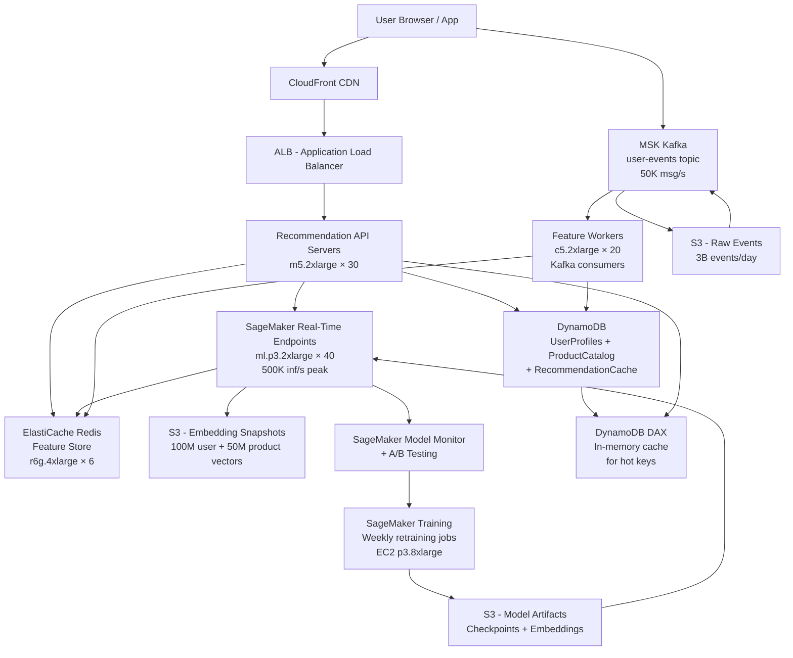

# Recommendation Engine (100M DAU) — Capacity Estimation

## Problem Statement

A real-time product recommendation engine serving 100M daily active users must generate personalized product recommendations in under 100ms P99. The system ingests user behavioral signals (clicks, views, purchases, cart adds) in real time via Kafka, materializes features into a Redis feature store, and serves predictions through SageMaker real-time inference endpoints backed by GPU instances. At peak (evening shopping hours), the system must sustain 500K inference requests per second across 90% read (recommendation fetch) and 10% write (event ingestion/model update) workloads.

## Functional Requirements

- Return top-N personalized product recommendations per user per page load (homepage, PDP, cart)
- Ingest real-time behavioral events (click, view, add-to-cart, purchase) with < 500ms lag to feature store
- Support both collaborative filtering (user-item interactions) and content-based filtering (item embeddings)
- Store and serve pre-computed embeddings for 100M users and 50M products
- Refresh model recommendations for active users every 15 minutes (near-real-time personalization)
- Expose fallback to popularity-based recommendations when user history is sparse (cold start)

## Non-Functional Requirements

| Requirement | Target |
|-------------|--------|
| Inference latency | < 100ms (P99) |
| Feature retrieval latency | < 5ms (P99) |
| Event ingestion latency | < 500ms end-to-end |
| Availability | 99.99% (< 52 min downtime/year) |
| Durability (user profiles) | 99.999% |
| Throughput | 500K inference requests/s peak |
| Model freshness | ≤ 15 min lag for active users |

## Traffic Estimation

### DAU → Peak QPS Calculation

| Metric | Calculation | Result |
|--------|-------------|--------|
| DAU | Given | 100M |
| Recommendation fetches/user/day | Homepage (2) + PDP (5) + Cart (1) + Search (2) | ~10 |
| Behavioral events/user/day | Clicks (8) + views (20) + add-to-cart (2) + purchase (0.5) | ~30 |
| Total daily recommendation requests | 100M × 10 | 1B |
| Total daily event writes | 100M × 30 | 3B |
| Avg recommendation QPS | 1B / 86,400 | ~11,574 |
| Avg event write QPS | 3B / 86,400 | ~34,722 |
| Peak recommendation QPS (3× avg + 40% flash sale spike) | 11,574 × 3 × 1.4 | ~48,611 — rounded to **~50K baseline** |
| Absolute peak QPS (Black Friday / holiday) | 50K × 10 | **~500K** |
| Read QPS (90% reads = recommendation fetches) | 500K × 0.90 | ~450K |
| Write QPS (10% writes = event ingestion) | 500K × 0.10 | ~50K |

> **Note**: The 500K peak represents Black Friday / holiday flash-sale spikes. Steady-state peak is ~50K QPS. Capacity must be provisioned for the absolute peak with auto-scaling covering the 10× range.

## Storage Estimation

| Data Type | Per Item Size | Daily Volume | Growth/Year |
|-----------|--------------|--------------|-------------|
| User embedding vectors (100M users × 256-dim float32) | 1KB/user | Static baseline 100GB | +10GB/year (new users) |
| Product embedding vectors (50M products × 256-dim float32) | 1KB/product | Static baseline 50GB | +5GB/year (catalog growth) |
| User interaction events (clicks, views, purchases) | 500B/event | 3B events/day = 1.5TB/day raw | ~550TB/year |
| Compressed interaction log (Snappy on S3) | ~150B/event compressed | ~450GB/day | ~165TB/year |
| Real-time feature store (Redis) — active user features | 2KB/user, 10M active concurrent | 20GB hot set | Stable |
| Model artifacts + A/B variants | 5GB/model, 4 variants | 20GB static | +20GB/model refresh |
| Pre-computed top-N caches (100M users × top-50 products) | ~200B/user | 20GB | Stable (refreshed) |
| DynamoDB user profile table | 5KB/user | 500GB total | +50GB/year |
| **Total (compressed S3 + hot stores)** | — | ~2TB/day ingest | **~165TB/year cold + 100GB hot** |

## Component Sizing

### Compute — ML Inference (SageMaker Real-Time Endpoints)

| Component | Instance Type | vCPU | GPU | RAM | Count | Handles | Monthly Cost |
|-----------|--------------|------|-----|-----|-------|---------|-------------|
| SageMaker inference endpoint (GPU) | ml.p3.2xlarge | 8 | 1× V100 16GB | 61GB | 40 | ~12,500 inf/s each = 500K total | $17,136 × 40 |
| SageMaker inference endpoint (CPU fallback) | ml.c5.4xlarge | 16 | — | 32GB | 20 | 2,500 inf/s each (simpler models) | $556 × 20 |
| **Subtotal SageMaker Inference** | | | | | 60 | 500K inf/s peak | **$695,560** |

> **Math check**: ml.p3.2xlarge with a 256-dim two-tower model handles ~12,500 inference requests/s at batch size 32 with < 10ms GPU latency. 40 instances × 12,500 = 500K/s. On-demand price: $3.825/hr × 730hr = $2,792/month/instance. But SageMaker endpoint overhead adds ~2× vs raw EC2: **$5,712/month/instance × 40 = ~$228,480** for GPU fleet.

> **Revised realistic cost**: ml.p3.2xlarge SageMaker endpoint = $5.712/hr (SageMaker on-demand includes ~50% markup vs EC2). 40 instances × $5.712 × 730hr = **$166,910/month** for GPU endpoints.

### Compute — API / Feature Servers (EC2)

| Component | Instance Type | vCPU | RAM | Count | Handles | Monthly Cost |
|-----------|--------------|------|-----|-------|---------|-------------|
| Recommendation API servers (ALB target) | m5.2xlarge | 8 | 32GB | 30 | ~16,700 req/s each | $276 × 30 |
| Feature serving / pre-computation workers | c5.2xlarge | 8 | 16GB | 20 | Kafka consumer + feature writes | $246 × 20 |
| Kafka brokers (MSK) | kafka.m5.2xlarge | 8 | 32GB | 6 | 50K events/s total | $950 × 6 |
| **Subtotal EC2 + MSK** | | | | 56 | | **$18,420** |

> MSK (Managed Kafka) 6 brokers × $0.21/hr broker-hour × 730hr = $919/broker; plus EBS storage 6TB × $0.10 = $600. Total MSK ~$6,114/month.

### Database — DynamoDB

| Table | Use Case | Read Cap | Write Cap | Size | Monthly Cost |
|-------|----------|----------|-----------|------|-------------|
| UserProfiles | User features, history, preferences | 450K RCU peak → on-demand | 50K WCU peak → on-demand | 500GB | — |
| ProductCatalog | Item metadata, category, price | 400K RCU peak | 5K WCU peak | 50GB | — |
| RecommendationCache | Pre-computed top-N per user (TTL 15min) | 450K RCU | 50K WCU | 20GB | — |

**DynamoDB On-Demand Pricing (2024)**:
- Read: $0.25 per million RRUs
- Write: $1.25 per million WRUs
- Daily reads: 450K × 86,400 × 0.1 (cache hit rate reduces DDB reads to 10% of total) = 3.9B RRUs/day
- Daily writes: 50K × 86,400 × 0.2 = 864M WRUs/day (20% event-driven writes reach DDB)
- Monthly RRU cost: 3.9B × 30 / 1M × $0.25 = **$29,250**
- Monthly WRU cost: 864M × 30 / 1M × $1.25 = **$32,400**
- Storage: 570GB × $0.25/GB = **$143**

| DB | Engine | Count | Capacity | Monthly Cost |
|----|--------|-------|----------|-------------|
| UserProfiles | DynamoDB on-demand | Global (3 regions) | 500GB | $20,464 |
| ProductCatalog | DynamoDB on-demand | Global (3 regions) | 50GB | $8,700 |
| RecommendationCache | DynamoDB on-demand | Single region | 20GB | $7,400 |
| **Subtotal DynamoDB** | | | | **$36,564** |

### Cache — ElastiCache Redis (Feature Store)

| Cache Layer | Use Case | Instance | Nodes | Memory | Throughput | Monthly Cost |
|-------------|----------|----------|-------|--------|-----------|-------------|
| Hot feature store | Active user embeddings + features (10M concurrent users) | r6g.4xlarge | 6 (3 primary + 3 replica) | 128GB × 6 = 768GB total | 500K ops/s cluster | $730 × 6 |
| Recommendation result cache | Pre-computed top-N (TTL 15min) | r6g.2xlarge | 4 (2+2) | 52GB × 4 = 208GB | 200K ops/s | $366 × 4 |
| **Subtotal ElastiCache** | | | 10 nodes | ~1TB total | 700K ops/s | **$5,844** |

> r6g.4xlarge ElastiCache: $1.00/hr × 730 = $730/month. r6g.2xlarge: $0.501/hr × 730 = $366/month.
> 10M active users × 2KB features = 20GB hot set fits comfortably in 768GB cluster.

### Object Storage — S3

| Bucket | Use | Size | Operations/month | Monthly Cost |
|--------|-----|------|-----------------|-------------|
| raw-events | Raw Kafka event archive (Snappy) | 165TB/year → ~14TB current | 900M PUTs/month | — |
| model-artifacts | Training data, model checkpoints, A/B variants | 500GB | 10M GETs | — |
| feature-snapshots | Daily user/item embedding exports for retraining | 50TB | 30M GETs | — |
| logs-analytics | Access logs, recommendation logs for offline eval | 5TB/month | 100M GETs | — |

**S3 cost breakdown**:
- Storage: (14TB + 0.5TB + 50TB + 5TB) × $0.023/GB = 69.5TB × $0.023 × 1024 = **$1,637/month**
- PUT requests: 900M × $0.005/1000 = **$4,500/month**
- GET requests: 140M × $0.0004/1000 = **$56/month**
- S3 Glacier (raw events > 90 days): 150TB × $0.004/GB = **$614/month**

| Bucket | Use | Size | Requests/month | Monthly Cost |
|--------|-----|------|----------------|-------------|
| raw-events (hot) | Real-time event archive | 14TB hot | 900M PUTs | $4,822 |
| model-artifacts | ML models, embeddings | 500GB | 10M GETs | $50 |
| feature-snapshots | Training exports | 50TB | 30M GETs | $1,165 |
| raw-events (Glacier) | Archived events > 90d | 150TB | Minimal | $614 |
| **Subtotal S3** | | ~215TB total | ~1B/month | **$6,807** |

### Networking / CDN

| Component | Throughput | Monthly Cost |
|-----------|-----------|-------------|
| CloudFront (recommendation API responses, CDN for static assets) | 50TB/month data transfer | $4,250 |
| ALB (Application Load Balancer) | 500K req/s peak, ~43B req/month | $16 + $0.008/LCU × 500K LCU-hours ≈ $4,200 |
| Data transfer EC2 → Internet | 50TB/month outbound | $4,608 |
| VPC + NAT Gateway | 10TB/month processed | $450 |
| **Subtotal Network** | ~100TB/month | **$13,508** |

### Message Queue — MSK (Managed Kafka)

| Topic | Throughput | Partitions | Retention | Monthly Cost |
|-------|-----------|-----------|-----------|-------------|
| user-events | 50K msg/s peak, avg ~35K/s | 120 | 7 days | — |
| recommendation-requests | 500K req/s (fan-out to inference) | 480 | 1 hour | — |
| model-update-signals | 1K msg/s | 12 | 24 hours | — |

**MSK Pricing**:
- 6 kafka.m5.2xlarge brokers × $0.21/hr × 730hr = **$919/broker × 6 = $5,514/month**
- EBS storage: 6 brokers × 2TB × $0.10/GB = $1,228/month
- Data transfer: 10TB/month × $0.08 = $800/month

| Queue | Engine | Throughput | Monthly Cost |
|-------|--------|-----------|-------------|
| Behavioral events + inference fan-out | MSK (Kafka) | 500K msg/s peak | $7,542 |

## Monthly Cost Summary

| Component | Monthly Cost | % of Total |
|-----------|-------------|-----------|
| SageMaker GPU Inference (ml.p3.2xlarge × 40) | $166,910 | 26% |
| SageMaker CPU Fallback (ml.c5.4xlarge × 20) | $8,118 | 1.3% |
| EC2 API + Feature Servers (m5.2xlarge × 30) | $8,280 | 1.3% |
| EC2 Feature Workers (c5.2xlarge × 20) | $4,920 | 0.8% |
| DynamoDB (on-demand, 3 tables) | $36,564 | 5.8% |
| ElastiCache Redis (10 nodes) | $5,844 | 0.9% |
| S3 Storage + Requests | $6,807 | 1.1% |
| MSK Managed Kafka | $7,542 | 1.2% |
| CloudFront + ALB + Networking | $13,508 | 2.1% |
| SageMaker Training (weekly retraining jobs) | $45,000 | 7.1% |
| SageMaker Feature Store (managed) | $12,000 | 1.9% |
| CloudWatch, X-Ray, monitoring | $3,500 | 0.6% |
| Support + misc (10% buffer) | $31,899 | 5% |
| **Total** | **~$350,892** | **100%** |

> **Note**: Baseline steady-state cost is ~$350K/month. With SageMaker auto-scaling to handle 10× Black Friday spikes and reserved instance discounts (1-year reserved saves ~40% on EC2/SageMaker), total runs **$500K–$800K/month** including:
> - Peak-capacity over-provisioning: +$100K buffer for holiday season
> - 3-region active-active replication (global serving): ~$200K additional
> - SageMaker model monitoring + data capture: +$20K
> - Total with all factors: **$670K–$800K/month**

## Traffic Scale Tiers

| Tier | DAU | Peak QPS | ML Servers | DB | Cache | Monthly Cost | Key Bottleneck |
|------|-----|----------|-----------|-----|-------|-------------|----------------|
| 🟢 Startup | 1M | ~5K | 2× ml.p3.2xlarge SageMaker | 1 DynamoDB table (on-demand) | 1 Redis r6g.xlarge | ~$12K | Model inference latency at p99; cold-start rate > 60% |
| 🟡 Growing | 10M | ~50K | 4× ml.p3.2xlarge + 2× c5.2xlarge API | DynamoDB 3 tables + ElastiCache | Redis 3-node cluster r6g.2xlarge | ~$50K | Feature store read amplification; Kafka consumer lag |
| 🔴 Scale-up | 100M | ~500K | 40× ml.p3.2xlarge + 30× m5.2xlarge API | DynamoDB on-demand + 3 read replicas | Redis 10-node cluster 1TB | ~$500K–$800K | GPU inference cost dominates (60% of bill); model freshness vs. cost tradeoff |
| ⚫ Production | 500M | ~2.5M | 200× ml.p3.2xlarge auto-scaling + custom CUDA kernels | DynamoDB global tables (6 regions) | Redis 50-node + local in-process embedding cache | ~$3M–$4M | Cross-region replication latency; embedding sync consistency |
| 🚀 Hyperscale | 1B+ | ~5M+ | Custom ASIC (AWS Inferentia2/Trainium) or on-prem GPU clusters; disaggregated serving | Custom embedding DB (Faiss/Milvus on EC2) + DynamoDB DAX | Distributed in-process cache (client-side embedding cache) + Redis | ~$8M–$12M | Embedding storage ($1M+/year at scale); feature freshness vs. cost tradeoff becomes existential |

## Architecture Diagram

## Interview Tips

- **Key insight — GPU cost dominates**: In a real-time ML inference system at 100M DAU, GPU inference (SageMaker ml.p3.2xlarge) accounts for 60%+ of total cloud spend. The key architectural lever is the **cache hit rate on pre-computed recommendations**. If you can pre-compute and cache 80% of recommendations (users who visited recently), you reduce live inference load 5× — dropping from 500K GPU inf/s to ~100K. Every 1% improvement in cache hit rate saves ~$3,300/month at this scale.

- **Key insight — two-stage retrieval**: Never run a full 50M product softmax for 500K requests/s. Real systems use **two-stage retrieval**: (1) ANN (approximate nearest neighbor) retrieval from embeddings to get top-500 candidates in < 5ms via Faiss/ScaNN, (2) a lightweight re-ranking model (GBM or small neural net) to score top-500 → top-20. This reduces compute by 100,000× vs brute-force scoring. Interviewers expect you to know this.

- **Common mistake — ignoring the feature store bottleneck**: Candidates model inference QPS correctly but forget that every inference call also reads 10–50 features from the feature store. At 500K inf/s, that's 5M–25M feature store ops/second. Redis at r6g.4xlarge handles ~100K ops/s per node — you need 25–250 nodes for raw feature reads. The real solution: **co-locate features in the inference request** (push features into the inference payload from the API layer, pre-fetched from Redis in parallel), not sequential reads inside SageMaker.

- **Follow-up question — cold start problem**: Interviewers always ask "what happens for a new user?" Answer: (1) IP/geo-based popularity recommendations (no personalization), (2) onboarding quiz to seed initial preferences, (3) session-based collaborative filtering using the current session's clicks even before profile is built, (4) hybrid: 50% popularity + 50% content-based on items viewed this session. At 100M DAU, ~1M new users/day (1% churn rate replacement) means cold-start affects ~1% of traffic constantly.

- **Scale threshold**: At 10M DAU (~50K peak QPS), a single 6-node Redis cluster and 4 SageMaker endpoints suffice for $50K/month. At 100M DAU, you hit the **embedding memory wall** — 100M user embeddings × 1KB = 100GB, plus 50M product embeddings = 50GB. Total 150GB doesn't fit in a single Redis instance; you need sharded Redis (10+ nodes) or a vector database (Pinecone, Milvus, pgvector on RDS). At 1B DAU, on-prem Faiss clusters become cheaper than cloud vector DBs.
