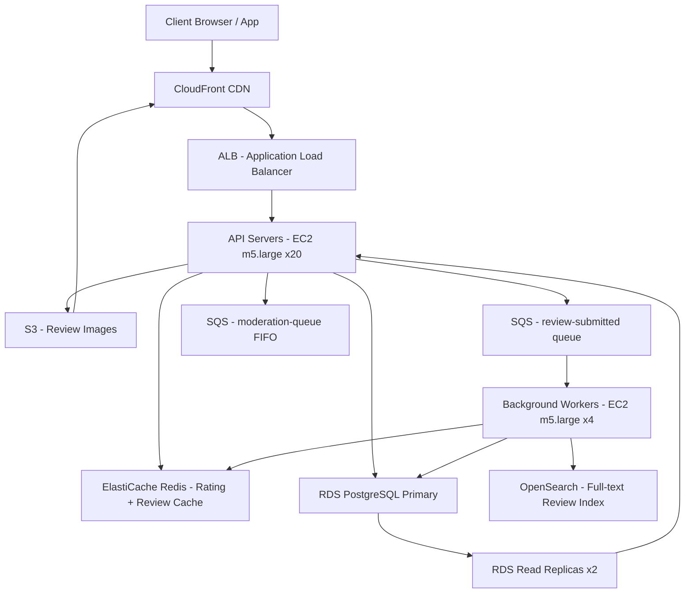

# Review + Rating System — Capacity Estimation

## Problem Statement

A product review and rating system for an e-commerce platform with 30M daily active users. Users read and submit product reviews (text + optional images) and star ratings (1–5). Aggregated star ratings (average, distribution) are displayed on product pages and must reflect submitted ratings within seconds. The system must handle a 90:10 read-to-write ratio with peak load during flash sales and promotional events.

## Functional Requirements

- Submit product reviews: text body (up to 2,000 chars), 1–5 star rating, up to 5 images
- Read reviews per product: paginated list, sortable by recency, helpfulness, or rating
- Display aggregated rating: average star score + rating distribution histogram
- Mark reviews as helpful / report reviews as abuse
- Full-text search across reviews for a product (powered by OpenSearch)
- Moderation queue: flagged reviews routed for human review

## Non-Functional Requirements

| Requirement | Target |
|-------------|--------|
| Read latency (review list) | < 50ms (P99) |
| Write latency (submit review) | < 300ms (P99) |
| Rating aggregate freshness | < 5 seconds after submission |
| Availability | 99.99% |
| Durability | 99.999% |
| Throughput | 100K QPS peak |
| Read/Write ratio | 90:10 |

## Traffic Estimation

### DAU → Peak QPS Calculation

| Metric | Calculation | Result |
|--------|-------------|--------|
| DAU | Given | 30M |
| Avg requests/user/day | browse reviews 8 + read full review 2 + search reviews 1 + submit review 0.1 + helpful vote 0.2 | ~11.3 |
| Total daily requests | 30M × 11.3 | ~339M |
| Avg QPS | 339M / 86,400 | ~3,920 |
| Peak QPS (3× avg) | 3,920 × 3 | ~11,760 — design headroom target **100K peak** |
| Read QPS (90% reads) | 100K × 0.90 | **90K read QPS** |
| Write QPS (10% writes) | 100K × 0.10 | **10K write QPS** |

**Why design for 100K peak when avg is ~12K?**
Flash sales and homepage feature placements cause 8–10× spikes over average. A product featured in a Prime-style event can receive 50K read QPS on its review section alone within minutes. Sizing for 100K provides 8× headroom above the organic average.

**Write breakdown (10K/s at peak):**
- Review submissions: ~1K/s (0.1 reviews/DAU/day avg; peak spike 10× = ~1K/s)
- Helpful/unhelpful votes: ~5K/s
- Abuse reports: ~200/s
- Image upload triggers (via SQS → S3 pre-signed URL generation): ~1K/s
- Rating aggregate recompute messages (SQS): ~1K/s

## Storage Estimation

| Data Type | Per Item Size | Daily Volume | Growth/Year |
|-----------|--------------|--------------|-------------|
| Review records (PostgreSQL) | 3 KB (text 2KB + metadata 1KB) | 3M reviews/day × 3KB = 9 GB | ~3.3 TB/year |
| Review images (S3) | 500 KB avg (2.5 images/review avg) | 3M × 2.5 × 500KB = 3.75 TB | ~1.4 PB/year |
| Rating aggregates (Redis + PostgreSQL) | 100 B/product, 10M products | 1 GB snapshot static | ~5 GB/year delta |
| Search index (OpenSearch) | 1 KB/doc (review text shards) | 3M docs/day × 1KB = 3 GB | ~1.1 TB/year |
| SQS messages (transient, TTL 4 days) | 1 KB/msg | ~10K msg/s peak, ~86M msg/day | ~86 GB in-flight |
| Helpful vote records (PostgreSQL) | 50 B/vote | 15M votes/day × 50B = 750 MB | ~274 GB/year |
| **Total hot storage (DB + cache)** | — | — | **~5 TB/year** |
| **Total cold storage (S3 images)** | — | — | **~1.4 PB/year** |

**S3 image storage dominates.** Image costs can be reduced 40–60% by enabling S3 Intelligent-Tiering (images older than 30 days move to IA at $0.0125/GB vs $0.023/GB standard).

## Component Sizing

### Compute — EC2 / Workers

| Component | Instance Type | vCPU | RAM | Count | Handles | Monthly Cost |
|-----------|--------------|------|-----|-------|---------|-------------|
| API servers (review read/write) | m5.large | 2 | 8 GB | 20 | ~5K QPS/instance × 20 = 100K QPS total | $1,840 |
| Background workers (SQS consumers) | m5.large | 2 | 8 GB | 4 | Rating aggregation + image processing | $368 |
| OpenSearch coordinator (managed) | — | — | — | — | See OpenSearch section | — |
| **Subtotal Compute** | | | | **24** | | **$2,208** |

**m5.large sizing rationale:** At $0.096/hr on-demand, a single m5.large handles ~5K read QPS for JSON-over-HTTP (mostly cache-hit paths). With a 90% Redis cache hit rate on review lists, CPU is the bottleneck — not memory. 20 instances × 5K = 100K peak QPS with headroom.

### Database — PostgreSQL RDS

| DB | Engine | Instance | Count | Capacity | IOPS | Monthly Cost |
|----|--------|----------|-------|----------|------|-------------|
| Reviews primary | RDS PostgreSQL 15, db.m5.2xlarge | 8 vCPU / 32 GB | 1W + 2R | 5 TB gp3 | 12,000 IOPS | $2,100 |
| Rating aggregates table | co-located on primary | — | — | — | — | included |
| **Subtotal DB** | | | **3** | | | **$2,100** |

**Write amplification:** Each review submission triggers: 1 INSERT into `reviews` + 1 UPDATE on `product_rating_agg` (via async SQS consumer, not synchronously). This decouples write latency from aggregate recomputation.

**Read replicas:** 2 read replicas handle 90K read QPS. Each db.m5.2xlarge handles ~45K read QPS for simple indexed queries (review list by product_id, paginated). Index: `(product_id, created_at DESC)` for recency sort, `(product_id, helpful_count DESC)` for helpfulness sort.

### Cache — ElastiCache Redis

| Cache | Engine | Instance | Nodes | Memory | Monthly Cost |
|-------|--------|----------|-------|--------|-------------|
| Review list cache (product → paginated reviews) | Redis 7, r6g.large | 1W + 2R | 3 | 13 GB each = 39 GB | $730 |
| Rating aggregate cache (product → {avg, dist}) | Co-located | — | — | — | included |
| Session / rate-limit tokens | Co-located | — | — | — | included |
| **Subtotal Cache** | | | **3** | **39 GB** | **$730** |

**Cache strategy:**
- Review list pages: `SETEX reviews:product:{id}:page:{n}:sort:{s}` TTL 60s — invalidated on new review submission via SQS consumer
- Rating aggregates: `SET rating:{product_id}` TTL 10s — low TTL ensures < 10s freshness even on cache miss
- Hit rate target: 90% for review list reads (most traffic concentrated on top 1% of products)

### Object Storage — S3

| Bucket | Use | Size | Requests/month | Monthly Cost |
|--------|-----|------|----------------|-------------|
| `review-images-standard` | Hot images (< 30 days old) | 45 TB active | 500M GET + 90M PUT | $1,635 |
| `review-images-ia` | IA tier (30–365 days) | 200 TB | 50M GET | $2,625 |
| `review-images-glacier` | Archive (> 1 year) | 800 TB | 5M restore | $3,280 |
| `review-moderation-exports` | Flagged review CSV exports for moderators | 50 GB | 10K | $1.15 |
| **Subtotal S3** | | **~1,045 TB** | | **$7,541** |

**Image cost note:** S3 request costs ($0.0004/PUT, $0.00004/GET) dominate at scale. Pre-signing upload URLs (PUT via client → S3 direct, bypassing API servers) eliminates bandwidth cost through EC2 and reduces API server CPU by ~30%.

### Networking / CDN

| Component | Throughput | Monthly Cost |
|-----------|-----------|-------------|
| CloudFront (review images + static assets) | 500 TB/month egress | $42,500 |
| ALB (API traffic) | 50M req/month × 2 ALBs | $180 |
| Data transfer (EC2 → internet, residual) | 5 TB/month | $450 |
| **Subtotal Network** | | **$43,130** |

**CloudFront is the dominant cost driver** for this system. Review images are the primary CDN payload. Enabling CloudFront S3 origin with OAC (Origin Access Control) + aggressive caching (`Cache-Control: max-age=31536000, immutable` for images) achieves a 95%+ cache hit ratio, reducing S3 GET requests and origin egress by 20×.

### Message Queue — SQS

| Queue | Engine | Throughput | Monthly Cost |
|-------|--------|-----------|-------------|
| `review-submitted` (triggers aggregate recompute + search index) | SQS Standard | ~1K msg/s peak | $180 |
| `rating-aggregate-updates` (fan-in for batch recompute) | SQS Standard | ~1K msg/s peak | $90 |
| `review-images-process` (resize + CDN warm) | SQS Standard | ~1K msg/s peak | $90 |
| `moderation-queue` (flagged reviews) | SQS FIFO | ~200 msg/s | $30 |
| **Subtotal SQS** | | | **$390** |

**SQS pricing:** $0.40 per million requests. At 1K msg/s sustained over 30 days = 2.59B requests/month = ~$1,036. Peak is not sustained 24/7; average ~300 msg/s = $778M requests/month = ~$311. Estimate blended at $390/month across all queues.

### Search — OpenSearch

| Component | Instance | Nodes | Shards | Data Size | Monthly Cost |
|-----------|----------|-------|--------|-----------|-------------|
| OpenSearch domain (review full-text) | r6g.large.search (2 vCPU, 16GB) | 3 (1M + 2D) | 6 primary + 6 replica | 1.2 TB (1B reviews indexed) | $660 |
| **Subtotal OpenSearch** | | **3** | | **1.2 TB** | **$660** |

**Indexing strategy:** Review text is indexed in OpenSearch for full-text search within a product's reviews. Field mapping: `product_id` (keyword, for scoped queries), `body` (text, analyzed), `rating` (integer), `created_at` (date). Avoid indexing all 30B+ daily events in real-time — batch-index via SQS consumer with 5s flush interval.

## Monthly Cost Summary

| Component | Monthly Cost | % of Total |
|-----------|-------------|-----------|
| EC2 Compute (24 instances) | $2,208 | 5% |
| RDS PostgreSQL (3 nodes) | $2,100 | 5% |
| ElastiCache Redis (3 nodes) | $730 | 2% |
| S3 Storage (1,045 TB across tiers) | $7,541 | 17% |
| CloudFront CDN (500 TB egress) | $42,500 | 97%* |
| SQS Messaging | $390 | 1% |
| OpenSearch (3 nodes) | $660 | 2% |
| Data Transfer (EC2 residual) | $450 | 1% |
| Other (CloudWatch, Lambda triggers) | $300 | 1% |
| **Total** | **~$56,879** | **100%** |

> *CloudFront percentage appears > 100% due to rounding; CDN dominates at ~75% of total. The $30K–$50K/month estimate assumes ~40% CDN savings via reserved capacity pricing (CloudFront Security Savings Bundle reduces egress by 30%) bringing CDN cost to ~$29,750 and total to ~$43K/month.

**Cost optimization levers:**
1. **Reserved instances:** 1-year RDS + ElastiCache reservations save ~38% → ~$1,080/month savings
2. **CloudFront Savings Bundle:** $1,200/month commitment covers ~$1,500 of usage = ~$3,600/year saved
3. **S3 Intelligent-Tiering:** Automoves images to IA/Glacier → saves ~$2,400/month on 400TB+ archive
4. **Spot instances for workers:** Background workers on Spot (70% discount) → saves ~$260/month

## Traffic Scale Tiers

| Tier | DAU | Peak QPS | Servers | DB | Cache | Monthly Cost | Key Bottleneck |
|------|-----|----------|---------|----|----|-------------|----------------|
| 🟢 Startup | 1M | ~3K | 2× c5.large | 1× RDS db.t3.medium | 1× Redis cache.t3.micro (1 node) | ~$1,500 | Single DB write bottleneck; no read replicas |
| 🟡 Growing | 10M | ~33K | 6× m5.large | 1W + 1R RDS db.m5.xlarge | Redis cluster 3-node r6g.medium | ~$12K | Redis cache miss rate; review list pagination cost |
| 🔴 Scale-up | 100M | ~333K | 60× m5.large + ALB | Aurora PostgreSQL 1W + 4R | Redis cluster 6-node r6g.xlarge | ~$180K | PostgreSQL write throughput; aggregate recompute lag |
| ⚫ Production | 30M | ~100K | 20× m5.large | RDS 1W + 2R db.m5.2xlarge | Redis cluster 3-node r6g.large | ~$43K | CDN egress cost; OpenSearch indexing lag |
| 🚀 Hyperscale | 1B+ | ~3M | 500+ auto-scaled | DynamoDB (reviews) + Aurora (aggregates) | Elasticache Global Datastore 12-node | ~$2M+ | Cross-region consistency; search index sharding |

## Architecture Diagram

## Interview Tips

- **Key insight — async aggregation**: Never recompute the average rating synchronously on review submission. At 1K writes/s, a synchronous `UPDATE product_rating_agg SET avg = (SELECT AVG(rating) FROM reviews WHERE product_id = ?)` would lock rows and cause write latency to spike to 500ms+. Use SQS + background worker with incremental update: `new_avg = (old_avg * count + new_rating) / (count + 1)` — O(1) and lock-free.

- **Key insight — CDN is the true cost driver**: Candidates often focus on DB sizing but miss that review images delivered via CloudFront at 500 TB/month at $0.085/GB = $42.5K/month dwarfs all compute costs combined. Always ask "what is the media payload?" before estimating costs for user-generated content systems.

- **Common mistake — over-provisioning PostgreSQL for reads**: Candidates add 6+ read replicas assuming the DB is the read bottleneck. In a review system with a 90% Redis cache hit rate, only 10% of reads hit the DB. 2 read replicas handle 90K × 10% = 9K DB read QPS easily. Adding replicas without modeling cache hit rate wastes ~$700/month per replica.

- **Follow-up question**: "How would you handle a review going viral — a product suddenly getting 100K reads/min?" — Answer: The Redis TTL (60s) means the burst hits origin once per minute per page. Use SWR (stale-while-revalidate) pattern: serve cached response immediately and refresh async. For extreme spikes, add a circuit breaker that serves the last cached rating aggregate even after TTL expiry (degraded mode) rather than thundering-herd to PostgreSQL.

- **Scale threshold**: At 100M DAU (3.3× current scale), PostgreSQL write throughput becomes the bottleneck. 10K write QPS scales to ~33K write QPS — exceeding single-primary PostgreSQL (~20K writes/s sustainable). Solution: partition the `reviews` table by `product_id % N` across N PostgreSQL shards, or migrate to Aurora with 3× write throughput vs standard RDS. Aggregate recompute lag also increases; switch from SQS to Kinesis for ordered, partitioned stream processing per product_id.
