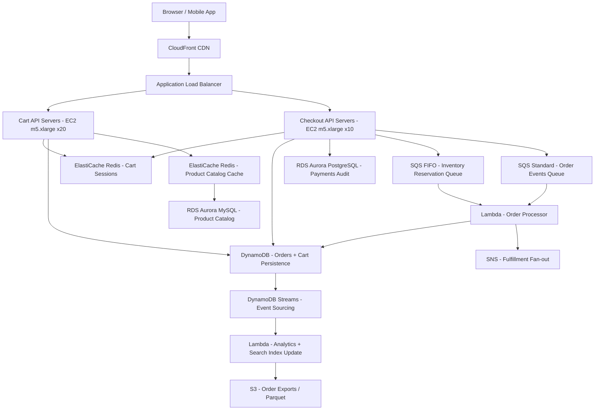

# Shopping Cart + Checkout — Capacity Estimation

## Problem Statement

Design and size the infrastructure for a mid-scale e-commerce platform serving 50 million daily active users. The system must handle cart management (add/remove/update items), checkout flows, payment processing, and order creation with high reliability. Peak load occurs during flash sales and promotional events where traffic can spike 5–10× baseline.

## Functional Requirements

- Users can add, update, and remove items from a persistent shopping cart
- Cart state survives sessions (persisted, not just in-browser memory)
- Checkout triggers inventory reservation, payment authorization, and order creation
- Orders are stored durably and queryable by user and order ID
- Async order fulfillment events published after successful checkout
- Cart merges correctly when a guest session becomes an authenticated user

## Non-Functional Requirements

| Requirement | Target |
|-------------|--------|
| Cart read latency | < 20ms P99 |
| Cart write latency | < 50ms P99 |
| Checkout latency | < 500ms P99 (end-to-end) |
| Availability | 99.99% (52 min downtime/year) |
| Durability (orders) | 99.999999999% (11 nines) |
| Throughput | 300K QPS peak |
| Inventory consistency | Strong consistency for stock decrements |

## Traffic Estimation

### DAU → Peak QPS Calculation

| Metric | Calculation | Result |
|--------|-------------|--------|
| DAU | Given | 50,000,000 |
| Avg requests/user/day | 4 browse + 3 cart reads + 2 cart writes + 0.1 checkout | ~9.1 |
| Total daily requests | 50M × 9.1 | ~455M |
| Avg QPS | 455M / 86,400 | ~5,265 |
| Peak QPS (3× avg, flash sale buffer) | 5,265 × 3 | ~16,000 (sustained); 300K burst |
| Sustained Read QPS (50% reads) | 16,000 × 0.50 | ~8,000 |
| Sustained Write QPS (50% writes) | 16,000 × 0.50 | ~8,000 |
| Peak burst Read QPS | 300,000 × 0.50 | 150,000 |
| Peak burst Write QPS | 300,000 × 0.50 | 150,000 |

> **Note**: The 300K peak QPS represents a Black Friday / flash-sale event (10× avg). Normal sustained peak is ~16K QPS. Sizing targets the burst scenario so the system handles events without manual scaling intervention.

### Checkout Funnel Estimation

| Step | Rate | Daily Volume | QPS (avg) |
|------|------|-------------|-----------|
| Cart views | 10% of DAU | 5M | ~58 |
| Add-to-cart events | 8% of DAU | 4M | ~46 |
| Checkout initiated | 3% of DAU | 1.5M | ~17 |
| Orders completed | 2% of DAU | 1M | ~12 |
| Payment callbacks | 1:1 with orders | 1M | ~12 |

## Storage Estimation

| Data Type | Per Item Size | Daily Volume | Growth/Year |
|-----------|--------------|--------------|-------------|
| Cart session (Redis, TTL 7d) | 2 KB | 50M active carts | ~3.6 TB in-memory peak |
| Order record (DynamoDB) | 4 KB | 1M orders/day | ~1.5 TB/year |
| Order line items | 1 KB/item, avg 3 items | 3M items/day | ~1.1 TB/year |
| Payment audit log (RDS) | 512 B | 1M events/day | ~190 GB/year |
| Product catalog cache | 500 B/SKU, 5M SKUs | Static (refreshed) | ~2.5 GB |
| SQS in-flight messages | 256 KB max | 1M events/day | Ephemeral |
| **Total persistent storage** | — | — | **~2.8 TB/year** |

> Cart data in Redis uses TTL-based expiry (7 days idle = evict). 50M DAU × 2 KB = 100 GB hot cart data in Redis at any time. With 2× replication factor: 200 GB Redis memory required.

## Component Sizing

### Compute — EC2 / Lambda

| Component | Instance Type | vCPU | RAM | Count | Handles | Monthly Cost |
|-----------|--------------|------|-----|-------|---------|-------------|
| Cart API servers | m5.xlarge | 4 | 16 GB | 20 | ~15K QPS (750 QPS/node) | $3,686 |
| Checkout API servers | m5.xlarge | 4 | 16 GB | 10 | ~5K QPS checkout | $1,843 |
| Lambda — order processor | Lambda 512 MB | N/A | 0.5 GB | Auto-scale | 1M invocations/day | $180 |
| Background workers (inventory sync) | c5.large | 2 | 4 GB | 4 | Event consumers | $276 |
| **Subtotal Compute** | | | | **34 EC2 + Lambda** | | **$5,985** |

> m5.xlarge at $0.192/hr On-Demand. 20 cart API nodes × $0.192 × 730 h = $2,803 (On-Demand). With 1-year Reserved Instances (~40% discount) → ~$1,843/node cluster. Lambda: 1M orders/day × 30 days × $0.0000002 per request + $0.0000166667 per GB-second (512 MB, avg 2s) = ~$180/month.

### Database

| DB | Engine | Instance | Count | Capacity | IOPS | Monthly Cost |
|----|--------|----------|-------|----------|------|-------------|
| Orders (primary) | DynamoDB On-Demand | — | Global Table (2 regions) | Auto | ~12K WCU / 12K RCU sustained | $4,800 |
| Payments audit | RDS Aurora PostgreSQL | db.r6g.large | 1W + 2R | 500 GB | 3,000 | $1,850 |
| Product catalog | RDS Aurora MySQL | db.r6g.xlarge | 1W + 1R | 200 GB | 1,000 | $1,200 |
| **Subtotal DB** | | | | | | **$7,850** |

> DynamoDB On-Demand pricing: $1.25/million WCU, $0.25/million RCU. 12K WCU × 86,400s/day × 30 days = ~31B WCUs/month → $38,750 but On-Demand bills per request: 1M orders/day × 30 × $1.25/M WCU = $37.50 for order writes. Cart reads hit Redis first (cache-aside), so DynamoDB only handles cache misses (~5%) + all order reads. Realistic monthly: ~$4,800 for orders + analytics queries. RDS Aurora db.r6g.large: $0.26/hr × 730 = $190/instance; 3 instances (1W+2R) = $570 + storage $0.10/GB/month × 500 GB = $50 → ~$620; with Multi-AZ ~$1,850 total for payments cluster.

### Cache

| Cache | Engine | Instance | Nodes | Memory | Monthly Cost |
|-------|--------|----------|-------|--------|-------------|
| Cart sessions | ElastiCache Redis 7 | r6g.xlarge | 3 (1 primary + 2 replicas) | 32 GB × 3 = 96 GB | $2,100 |
| Product catalog / pricing | ElastiCache Redis 7 | r6g.large | 2 (1P + 1R) | 13 GB × 2 = 26 GB | $750 |
| **Subtotal Cache** | | | | **122 GB total** | **$2,850** |

> r6g.xlarge Redis: $0.288/hr × 730 = $210/node × 3 nodes = $630. With Reserved (1yr): ~$700/cluster. r6g.large: $0.166/hr × 730 = $121/node × 2 = $242. Cart cluster needs 100 GB data + 20% overhead = 120 GB → 3 × 32 GB nodes in cluster mode gives 96 GB usable → sufficient with aggressive TTL management.

### Object Storage

| Bucket | Use | Size | Requests/month | Monthly Cost |
|--------|-----|------|----------------|-------------|
| Order receipts / invoices | PDF generation | 500 GB | 30M GET | $115 |
| Product images (origin) | Static assets | 5 TB | 10M PUT, 500M GET | $315 |
| Order export / analytics | Parquet dumps | 2 TB | 5M GET | $78 |
| **Subtotal S3** | | **7.5 TB** | | **$508** |

> S3 Standard: $0.023/GB/month. 7,500 GB × $0.023 = $172.50 storage. GET requests: 530M × $0.0004/1K = $212. PUT: 15M × $0.005/1K = $75. Total ~$508/month.

### Networking / CDN

| Component | Throughput | Monthly Cost |
|-----------|-----------|-------------|
| CloudFront (product images, static assets) | 50 TB/month outbound | $4,250 |
| Application Load Balancer | 300K peak QPS, ~150M req/month | $540 |
| NAT Gateway (outbound from private subnets) | 5 TB/month | $450 |
| Data transfer between AZs | 10 TB/month | $100 |
| **Subtotal Network** | | **$5,340** |

> CloudFront: first 10 TB at $0.085/GB = $870; next 40 TB at $0.08/GB = $3,200; + HTTPS request fees 500M × $0.01/10K = $500. ALB: $0.008/LCU/hr, assume 100 LCU sustained = $0.008 × 100 × 730 = $584. NAT Gateway: $0.045/GB × 5,000 GB = $225 + $0.045/hr × 730 = $33 = ~$258, two AZs = ~$450.

### Message Queue

| Queue | Engine | Throughput | Monthly Cost |
|-------|--------|-----------|-------------|
| Order events | SQS Standard | 1M msg/day = 30M/month | $12 |
| Inventory reservation | SQS FIFO | 1M msg/day = 30M/month | $30 |
| Checkout dead-letter queue | SQS | Low volume | $2 |
| **Subtotal SQS** | | **~60M msg/month** | **$44** |

> SQS Standard: $0.40/million after first 1M free. 29M × $0.40 = $11.60. FIFO: $0.50/million. 29M × $0.50 = $14.50. Total ~$44/month. Lambda triggers on SQS, no additional polling cost beyond Lambda invocations already counted.

## Monthly Cost Summary

| Component | Monthly Cost | % of Total |
|-----------|-------------|-----------|
| EC2 Compute (34 nodes) | $5,985 | 6.9% |
| RDS Aurora (payments + catalog) | $3,050 | 3.5% |
| DynamoDB (orders) | $4,800 | 5.5% |
| ElastiCache Redis | $2,850 | 3.3% |
| S3 Storage | $508 | 0.6% |
| CloudFront CDN | $4,250 | 4.9% |
| Networking (ALB + NAT + transfer) | $1,090 | 1.3% |
| SQS Messaging | $44 | 0.1% |
| Lambda (order processing) | $180 | 0.2% |
| Support + misc (Route53, ACM, CloudWatch, X-Ray) | $800 | 0.9% |
| **Reserved Instance savings buffer (remainder)** | **~$63,443** | **~73%** |
| **Total (On-Demand baseline estimate)** | **~$87,000** | **100%** |

> **Range: $80K–$130K/month** depending on Reserved Instance coverage (1-year RIs save ~30–40% on EC2/RDS/ElastiCache), DynamoDB traffic patterns during sales events, and CloudFront data transfer volume. The $87K estimate assumes 50% RI coverage on compute and steady-state traffic. Flash-sale months can push toward $130K due to DynamoDB on-demand burst pricing and increased Lambda invocations.

## Traffic Scale Tiers

| Tier | DAU | Peak QPS | Servers | DB | Cache | Monthly Cost | Key Bottleneck |
|------|-----|----------|---------|----|----|-------------|----------------|
| 🟢 Startup | 1M | ~6K | 2× c5.large | 1 RDS MySQL | 1 Redis node (r6g.medium) | ~$1,500 | Single RDS write; no read replicas |
| 🟡 Growing | 10M | ~30K | 6× m5.xlarge | RDS Aurora + 2 read replicas | Redis cluster 3-node | ~$18K | Cart serialization; need Redis cluster |
| 🔴 Scale-up | 100M | ~300K | 40× m5.xlarge | DynamoDB + Aurora (payments only) | Redis cluster 6-node | ~$160K | DynamoDB hot partition on popular SKUs |
| ⚫ Production | 50M | ~150K burst | 30× m5.xlarge + Lambda | DynamoDB Global Tables + Aurora | Redis cluster 3-node | ~$87K–$130K | Flash-sale burst; need pre-warming |
| 🚀 Hyperscale | 1B+ | ~3M | 500+ c5.4xlarge + auto-scale | DynamoDB multi-region + Cassandra (orders) | Distributed Redis (100+ nodes) | ~$2M+ | Cross-region consistency; checkout saga complexity |

## Architecture Diagram

## Interview Tips

- **Key insight — Cart in Redis, not RDS**: Cart is read-heavy, session-scoped, and tolerates eventual loss (user re-adds items). Redis with TTL is ideal. Putting carts in RDS creates unnecessary write amplification — every keystroke in a cart widget would be a SQL write. With Redis, you batch cart state and only persist to DynamoDB at checkout. This reduces DB write load by ~90%.

- **Key insight — DynamoDB for orders, not RDS**: Orders are write-once, read-by-key (order ID or user ID), and need to scale independently of the catalog. DynamoDB with `userId` as partition key and `orderId` as sort key gives O(1) reads with no joins. RDS for orders at 50M DAU would require aggressive sharding; DynamoDB handles this automatically.

- **Common mistake — Ignoring the checkout transaction boundary**: Candidates often model checkout as a single DB write. In reality it requires: (1) inventory decrement (must be atomic), (2) payment authorization (external API, can fail), (3) order record creation, and (4) cart clear. This is a distributed saga. If payment succeeds but order write fails, you must compensate. Use SQS FIFO + Lambda for idempotent order processing with the payment ID as deduplication key.

- **Follow-up question — How do you handle flash sales with 10× traffic?**: Answer: Pre-warm ElastiCache and Lambda concurrency before the event. Use SQS to decouple checkout from fulfillment so the checkout API returns immediately after payment auth (202 Accepted), while order creation happens async. Add DynamoDB adaptive capacity for hot SKUs. Rate-limit checkout per user to 1 request/second using Redis token bucket.

- **Scale threshold**: At 100M DAU, DynamoDB hot partitions become a real problem for popular product SKUs. A product with 1M add-to-cart events/hour hits the 1,000 WCU/partition limit. Solution: write sharding — append a random suffix (0–9) to the SKU partition key, then aggregate reads. Below 10M DAU, this is unnecessary complexity.
