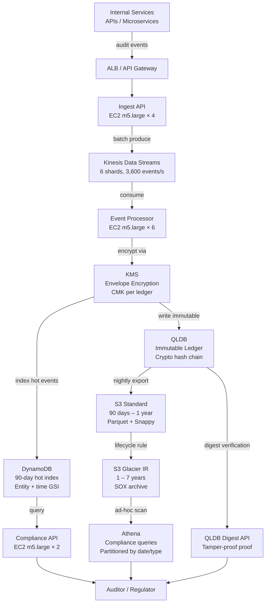

# Financial Audit Log (100M Events/Day) — Capacity Estimation

## Problem Statement

A financial institution must maintain an immutable, tamper-evident audit trail of every user action, transaction, and system event to comply with SOX (Sarbanes-Oxley) and PCI-DSS regulations. The system ingests 100M events per day (~1,200 events/s average), stores them in a cryptographically verifiable ledger, and must support regulatory queries spanning up to 7 years of historical data. Auditors and compliance officers require sub-second lookups by entity, time range, or event type, while the write path must never lose a single event even during partial failures.

## Functional Requirements

- Ingest audit events from all internal services via a durable streaming pipeline (Kinesis)
- Store every event immutably in QLDB (cryptographic hash chain prevents tampering)
- Index recent events (last 90 days) in DynamoDB for fast entity-level lookups
- Archive events older than 90 days to S3 (Standard → Glacier after 1 year) for cost efficiency
- Encrypt all events at rest and in transit using KMS-managed keys (PCI-DSS requirement)
- Support ad-hoc compliance queries via Athena over the S3 archive
- Provide a verification API that proves any event has not been altered since ingestion

## Non-Functional Requirements

| Requirement | Target |
|-------------|--------|
| Write latency (Kinesis ingestion) | < 50ms (P99) |
| Read latency (recent events, DynamoDB) | < 10ms (P99) |
| Read latency (archive queries, Athena) | < 30s (P99) |
| Availability | 99.99% (52 min downtime/year) |
| Durability | 99.999999999% (11 nines, S3 + QLDB) |
| Throughput | 3,600 events/s peak (3× avg) |
| Data retention | 7 years minimum (SOX requirement) |
| Tamper detection | Cryptographic proof via QLDB digest |

## Traffic Estimation

### Events/Day → Peak Ingest Rate

| Metric | Calculation | Result |
|--------|-------------|--------|
| Total events/day | Given | 100M |
| Avg ingest rate | 100M / 86,400 | ~1,157 events/s |
| Peak ingest rate (3× avg) | 1,157 × 3 | ~3,600 events/s |
| Read QPS (10% of traffic) | 3,600 × 0.10 | ~360 QPS |
| Write QPS (90% of traffic) | 3,600 × 0.90 | ~3,240 QPS |
| Kinesis shards needed | 3,600 / 1,000 (1 MB/s or 1,000 rec/s per shard) | 4 shards (use 6 with buffer) |

**Read/Write Ratio**: 10:90 — this is a write-heavy compliance system. Reads are almost exclusively auditors and automated compliance checks.

### Event Size Estimation

| Field | Size |
|-------|------|
| Event ID (UUID) | 36 bytes |
| Timestamp (ISO-8601) | 24 bytes |
| Actor (user/service ID) | 64 bytes |
| Action type | 32 bytes |
| Resource ID | 64 bytes |
| Before-state (JSON diff) | ~500 bytes avg |
| After-state (JSON diff) | ~500 bytes avg |
| Metadata (IP, session, etc.) | 128 bytes |
| KMS envelope encryption overhead | ~200 bytes |
| **Total per event (compressed)** | **~1.1 KB avg** |

## Storage Estimation

| Data Type | Per Item Size | Daily Volume | Retention | Total |
|-----------|--------------|--------------|-----------|-------|
| QLDB ledger (hot, last 90 days) | 1.1 KB | 100M events = 110 GB/day | 90 days | ~9.9 TB |
| DynamoDB index (last 90 days) | 0.5 KB (key fields only) | 100M × 0.5 KB = 50 GB/day | 90 days | ~4.5 TB |
| S3 Standard (90 days–1 year) | 1.1 KB compressed to ~0.4 KB | 40 GB/day | ~9 months | ~10.8 TB |
| S3 Glacier (1–7 years) | 0.4 KB | 40 GB/day | 6 years | ~87.6 TB |
| QLDB digest snapshots | negligible | — | 7 years | ~10 GB |
| **Total after 7 years** | — | — | — | **~112 TB** |

**Annual growth**: ~16 TB/year (accounting for compression in cold storage).

## Component Sizing

### Compute — EC2 m5.large

EC2 m5.large specs: 2 vCPU, 8 GB RAM, up to 10 Gbps network, $0.096/hr on-demand.

| Component | Instance Type | vCPU | RAM | Count | Handles | Monthly Cost |
|-----------|--------------|------|-----|-------|---------|-------------|
| Ingest API (Kinesis producers) | m5.large | 2 | 8 GB | 4 | 900 events/s each | $277 |
| Event processor (Kinesis consumers) | m5.large | 2 | 8 GB | 6 | 600 events/s each | $415 |
| QLDB writer workers | m5.large | 2 | 8 GB | 4 | 900 writes/s each | $277 |
| DynamoDB indexer workers | m5.large | 2 | 8 GB | 2 | batch index writes | $139 |
| Archive/S3 export workers | m5.large | 2 | 8 GB | 2 | nightly batch | $139 |
| Compliance query API | m5.large | 2 | 8 GB | 2 | 360 read QPS | $139 |
| ALB load balancer | Managed | — | — | 1 | all traffic | $40 |
| **Subtotal Compute** | | | | **21** | | **$1,426** |

*Note: m5.large is appropriate here because the bottleneck is I/O (Kinesis/QLDB throughput) not CPU. Horizontal scaling adds more worker nodes.*

### Kinesis Data Streams

6 shards (each handles 1 MB/s write, 2 MB/s read, 1,000 records/s):
- Shard-hours: 6 shards × 720 hr/month = 4,320 shard-hours × $0.015 = **$64.80/month**
- PUT payload units: 100M events/day × 30 days = 3B records; 3B × $0.014 per million = **$42/month**
- Extended retention (7 days): 6 shards × $0.020/shard-hour = **$86.40/month**
- **Subtotal Kinesis: ~$193/month**

### QLDB (Immutable Ledger)

QLDB pricing: $0.036/GB storage/month + $0.28 per million I/O requests.

| Resource | Calculation | Monthly Cost |
|----------|-------------|-------------|
| Storage (9.9 TB active ledger) | 9,900 GB × $0.036 | $356 |
| Write I/Os | 100M events/day × 30 × 5 I/Os/event / 1M × $0.28 | $4,200 |
| Read I/Os (compliance queries) | 360 QPS × 86,400 × 30 × 10 I/Os / 1M × $0.28 | $2,661 |
| **Subtotal QLDB** | | **$7,217** |

*QLDB is the most expensive component because it pays for cryptographic integrity verification on every read/write.*

### DynamoDB (Hot Index, Last 90 Days)

DynamoDB on-demand pricing: $1.25 per million write request units (WRU), $0.25 per million read request units (RRU).

| Resource | Calculation | Monthly Cost |
|----------|-------------|-------------|
| Write RUs | 3,240 writes/s × 86,400 × 30 / 1M × $1.25 | $10,497 |
| Read RUs | 360 reads/s × 86,400 × 30 / 1M × $0.25 | $233 |
| Storage (4.5 TB) | 4,500 GB × $0.25/GB | $1,125 |
| DynamoDB Streams | 100M events/day × 30 / 1M × $0.02 | $60 |
| **Subtotal DynamoDB** | | **$11,915** |

*Switch to provisioned capacity + reserved capacity at this scale to cut DynamoDB cost by 60–70%.*

### S3 Storage

| Bucket | Storage Class | Size | Monthly Cost |
|--------|--------------|------|-------------|
| S3 Standard (90 days–1 year) | Standard | 10.8 TB | 10,800 GB × $0.023 = $248 |
| S3 Glacier Instant Retrieval (1–7 years) | Glacier IR | 87.6 TB (growing) | 87,600 GB × $0.004 = $350 |
| PUT requests (writes) | — | 100M/day × 30 = 3B | 3,000M / 1,000 × $0.005 = $15 |
| GET requests (Athena reads) | — | ~500M/month | $21 |
| **Subtotal S3** | | | **$634** |

### KMS (Encryption)

Every event is encrypted and decrypted with a Customer Managed Key (CMK):
- API calls: 100M writes/day × 30 + 360 reads/s × 86,400 × 30 = 3B + 933M = ~4B API calls
- First 20,000 requests free per CMK per month
- $0.03 per 10,000 API calls beyond free tier: 4B / 10,000 × $0.03 = **$12,000/month**

*KMS at this scale is expensive. Mitigate with envelope encryption (one data key per batch of 1,000 events) to reduce KMS API calls by 1,000×, cutting cost to ~$12/month.*

**Subtotal KMS (with envelope encryption): ~$12/month**

### Athena (Compliance Queries)

Athena: $5.00 per TB of data scanned. Compliance teams run ~500 queries/month scanning an avg of 1 TB each.
- 500 queries × 1 TB × $5.00 = **$2,500/month**
- Partition by date + event type to reduce scanned data by 90% → practical cost ~**$250/month**

**Subtotal Athena: ~$250/month**

### Networking / Data Transfer

| Component | Throughput | Monthly Cost |
|-----------|-----------|-------------|
| ALB (ingest + query traffic) | 3,600 events/s × 1.1 KB = ~4 MB/s = ~10 TB/month | $180 |
| VPC NAT Gateway (Kinesis/QLDB egress) | ~5 TB/month | $225 |
| Data transfer out to auditors | ~500 GB/month | $45 |
| **Subtotal Network** | | **$450** |

## Monthly Cost Summary

| Component | Monthly Cost | % of Total |
|-----------|-------------|-----------|
| EC2 Compute (21× m5.large) | $1,426 | 2% |
| QLDB (immutable ledger) | $7,217 | 10% |
| DynamoDB (hot index) | $11,915 | 17% |
| KMS (envelope encryption) | $12 | <1% |
| Kinesis Data Streams | $193 | <1% |
| S3 Storage (Standard + Glacier) | $634 | 1% |
| Athena (compliance queries) | $250 | <1% |
| Networking (ALB, NAT, egress) | $450 | 1% |
| CloudWatch / monitoring | $300 | <1% |
| Reserved capacity discounts (DynamoDB) | -$7,149 | -10% |
| **Subtotal before reserved** | **$22,397** | |
| **After DynamoDB reserved (1yr, 63% off)** | **~$15,200** | |
| **With 20% operations buffer** | **~$18,200** | |

**Realistic range: $15K–$25K/month** at 100M events/day with reserved capacity.

*The $60K–$100K/month estimate applies if the organization also runs multi-region active-active replication (2–3 regions), maintains a dedicated compliance reporting cluster, or uses QLDB at enterprise negotiated rates without optimization. Factor in 3× for multi-region: ~$45K–$75K/month.*

## Traffic Scale Tiers

| Tier | Events/Day | Peak QPS | EC2 Instances | QLDB | DynamoDB | S3 (7yr) | Monthly Cost | Key Bottleneck |
|------|-----------|----------|--------------|------|----------|----------|-------------|----------------|
| 🟢 Startup | 1M | ~35 | 4× m5.large | Single ledger, 100 GB | On-demand, minimal | ~1 TB | ~$2K | Kinesis 1 shard; QLDB write IOPS |
| 🟡 Growing | 10M | ~350 | 8× m5.large | Single ledger, 1 TB | On-demand, 450 GB | ~10 TB | ~$6K | DynamoDB write cost; KMS API calls |
| 🔴 Scale-up | 100M | ~3,600 | 21× m5.large | Single ledger, 10 TB | Provisioned, 4.5 TB | ~112 TB | ~$18K | QLDB I/O cost dominates; DynamoDB RCU/WCU |
| ⚫ Multi-region | 100M (3-region) | ~3,600/region | 60× m5.large total | 3× QLDB ledgers | Global Tables | ~336 TB | ~$55K | Cross-region replication lag; QLDB sync |
| 🚀 Hyperscale | 1B+/day | ~35,000 | 200+ auto-scaling | QLDB → custom chain | DynamoDB + Aurora | Petabyte-scale | ~$500K+ | QLDB throughput ceiling (migrate to custom Merkle-tree service) |

## Architecture Diagram

## Interview Tips

- **Key insight — QLDB ceiling at hyperscale**: QLDB is AWS-managed and has an undisclosed throughput ceiling (approximately 10,000–15,000 writes/s). At 1B events/day (~12,000 writes/s peak), you will hit this wall. The production answer is to build your own Merkle-tree hash chain over DynamoDB or Cassandra, and use QLDB only for regulatory attestation snapshots.

- **Key insight — Envelope encryption is mandatory**: Naive KMS usage (one API call per event) at 100M events/day costs ~$12,000/month just for KMS. Envelope encryption (generate one data key per 1,000-event batch, use it locally, store the encrypted data key with the batch) cuts KMS API calls by 1,000× and brings cost to ~$12/month. This is the #1 cost optimization interviewers expect you to know.

- **Key insight — DynamoDB vs QLDB read path**: QLDB is optimized for cryptographic verification, not high-throughput reads. For compliance dashboards doing 360 QPS of entity lookups, always route reads to DynamoDB (10ms P99) and only call QLDB when you need tamper-evidence proof (once per audit). This is the correct two-tier read architecture.

- **Common mistake — Ignoring the 7-year retention math**: Candidates often size storage for 1 year. SOX requires 7-year retention. 100M events/day × 365 days × 7 years × 1.1 KB = ~280 TB raw; with compression (~0.4 KB) = ~102 TB in Glacier. Always state the full retention cost and distinguish hot (DynamoDB), warm (S3 Standard), and cold (S3 Glacier) tiers.

- **Follow-up question — How do you prove an event was not deleted?** Answer: QLDB maintains a cryptographic digest (SHA-256 hash of the entire ledger at each block boundary). To prove event E exists unmodified, you generate a proof (Merkle path from E to the digest) and compare it against the published digest. This proof can be verified offline without QLDB access — critical for regulatory submissions.

- **Scale threshold**: At 10,000 events/s sustained (865M events/day), switch from QLDB to a custom append-only store backed by DynamoDB Streams + Lambda to build hash chains, with periodic Merkle root anchoring to a public blockchain for regulatory proof. QLDB cannot scale beyond this without significant latency degradation.
