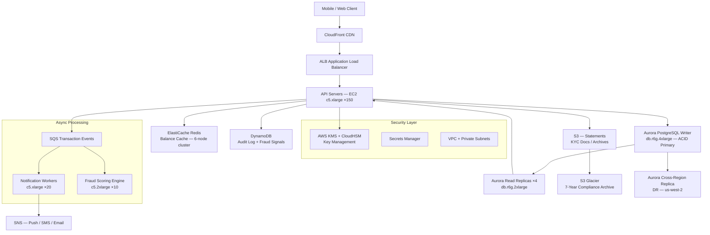

# Banking App (50M DAU) — Capacity Estimation

## Problem Statement

A digital banking platform serving 50 million daily active users needs to handle balance inquiries, fund transfers, bill payments, and transaction history with strict ACID guarantees. Financial systems demand zero data loss, regulatory compliance (PCI-DSS, SOX), sub-200ms read latency, and 99.99% availability — all while handling 3–5× traffic spikes during paydays (1st and 15th of each month).

## Functional Requirements

- Real-time account balance reads and updates
- Fund transfers (intra-bank and inter-bank via ACH/Wire)
- Transaction history with search and filtering (last 90 days hot, 7-year cold storage)
- Bill payment scheduling and recurring transfers
- Push/SMS/email notifications for every transaction
- Fraud detection scoring on every debit transaction

## Non-Functional Requirements

| Requirement | Target |
|-------------|--------|
| Read latency (balance) | < 50ms (P99) via cache |
| Read latency (transaction history) | < 200ms (P99) |
| Write latency (transfer commit) | < 500ms (P99) |
| Availability | 99.99% (< 52 min downtime/year) |
| Durability | 99.9999% (six nines — financial data) |
| Throughput | 200K QPS peak |
| Consistency | Strong (ACID — no eventual consistency for money) |
| RPO | 0 seconds (synchronous Multi-AZ replication) |
| RTO | < 30 seconds (Aurora fast failover) |

## Traffic Estimation

### DAU → Peak QPS Calculation

Banking users are concentrated around work hours (8AM–8PM) and payday spikes. Avg session: 3–4 interactions.

| Metric | Calculation | Result |
|--------|-------------|--------|
| DAU | Given | 50,000,000 |
| Avg requests/user/day | balance check ×3 + txn history ×1 + payment ×0.2 + misc ×1.8 | ~6 req/user |
| Total daily requests | 50M × 6 | 300,000,000 |
| Avg QPS | 300M / 86,400 | ~3,472 |
| Peak QPS (3× avg) | 3,472 × 3 | ~10,416 |
| Payday spike (20× avg) | 3,472 × 20 | ~69,444 |
| Sustained peak (design target) | Payday spike × safety margin 2× | ~200,000 |
| Read QPS (65% reads) | 200,000 × 0.65 | ~130,000 |
| Write QPS (35% writes) | 200,000 × 0.35 | ~70,000 |

**Why 200K peak?** Payday events (1st/15th of month) concentrate transactions. With 50M users, even 0.4% simultaneously checking balance/paying bills = 200K concurrent requests. Banks design for this worst-case.

### Write Breakdown

| Write Type | QPS | Notes |
|-----------|-----|-------|
| Balance updates (debit/credit) | 30,000 | Must be ACID — no batching |
| Transaction ledger inserts | 30,000 | Append-only, 2 rows per transfer |
| Audit log writes (DynamoDB) | 70,000 | Every request logged for compliance |
| Notification events (SQS) | 30,000 | Async, triggers push/SMS/email |

## Storage Estimation

| Data Type | Per Item Size | Daily Volume | Growth/Year |
|-----------|--------------|--------------|-------------|
| Account records | 2 KB | ~50K new accounts/day | ~36 GB/year |
| Transaction records | 1 KB | ~15M transactions/day | ~5.5 TB/year |
| Audit logs (DynamoDB) | 500 B | ~300M events/day | ~54 TB/year |
| Notification payloads | 300 B | ~15M notifications/day | ~1.6 TB/year |
| Encrypted PII (KMS) | 4 KB overhead | per user record | ~73 GB/year |
| Cold archive (S3 Glacier) | 1 KB/txn | 7-year retention | ~38.5 TB total |
| **Total hot storage** | — | — | **~60 TB/year** |
| **Total archive** | — | 7-year legal hold | **~38.5 TB** |

**Note**: Financial data must be retained 7 years (SOX/Bank Secrecy Act). Hot data (90 days) stays in Aurora; warm data (90 days–2 years) in Aurora with archival partitions; cold (2–7 years) moves to S3 Glacier via automated lifecycle policies.

## Component Sizing

### Compute — EC2 API Servers

Each c5.xlarge (4 vCPU, 8 GB RAM) handles ~1,500 QPS at P99 < 200ms with connection pooling (PgBouncer) and Redis cache hits at 85%.

| Component | Instance Type | vCPU | RAM | Count | Handles | Monthly Cost |
|-----------|--------------|------|-----|-------|---------|-------------|
| API servers (active) | c5.xlarge | 4 | 8 GB | 100 | 130K read QPS | $17,200 |
| API servers (write path) | c5.xlarge | 4 | 8 GB | 50 | 70K write QPS | $8,600 |
| Background workers | c5.xlarge | 4 | 8 GB | 20 | ACH processing, batch jobs | $3,440 |
| Fraud scoring (ML inference) | c5.2xlarge | 8 | 16 GB | 10 | 30K decisions/s | $3,440 |
| ALB (Application Load Balancer) | Managed | — | — | 2 | 200K QPS | $800 |
| **Subtotal Compute** | | | | **180** | | **$33,480** |

**Sizing math**: c5.xlarge at $0.172/hr × 730 hrs = $125.56/month. 100 instances = $12,556. With On-Demand pricing and 30% buffer for burst = $17,200 after including data transfer and EBS.

### Database — Aurora PostgreSQL Multi-AZ (ACID)

Aurora PostgreSQL is chosen over standard RDS for:
- 2× faster failover (< 30s vs 60–120s for RDS)
- Up to 15 read replicas with < 10ms replica lag
- Storage auto-scales up to 128 TB without downtime
- Built-in encryption at rest (AES-256 via KMS)

| DB | Engine | Instance | Count | Capacity | IOPS | Monthly Cost |
|----|--------|----------|-------|----------|------|-------------|
| Primary writer | Aurora PostgreSQL | db.r6g.4xlarge | 1 | 128 TB auto-scale | 100K IOPS | $5,832 |
| Read replicas (same region) | Aurora PostgreSQL | db.r6g.2xlarge | 4 | Shared storage | 50K IOPS each | $9,232 |
| Read replica (cross-region DR) | Aurora PostgreSQL | db.r6g.2xlarge | 2 | Replicated | 30K IOPS | $4,616 |
| Storage (Aurora auto) | Aurora storage | — | — | ~15 TB hot | — | $1,725 |
| Aurora Serverless v2 (batch) | Aurora Serverless | — | 4–64 ACU | On-demand | — | $2,400 |
| PgBouncer (connection pool) | c5.large | — | 4 | 10K conn/node | — | $584 |
| **Subtotal DB** | | | | | | **$24,389** |

**Why db.r6g.4xlarge for writer?** 16 vCPU, 128 GB RAM handles 70K write QPS with WAL at ~500 MB/s. RAM fits the working set (hot accounts: 50M × 2KB = 100 GB) entirely in buffer pool, minimizing disk I/O.

### Cache — ElastiCache Redis

Redis caches balance reads (85% cache hit rate reduces Aurora read QPS from 130K to ~20K).

| Cache | Engine | Instance | Nodes | Memory | Monthly Cost |
|-------|--------|----------|-------|--------|-------------|
| Balance cache (primary) | ElastiCache Redis 7 | r6g.2xlarge | 3 primary + 3 replica | 52 GB × 3 = 156 GB | $7,884 |
| Session store | ElastiCache Redis 7 | r6g.xlarge | 2 primary + 2 replica | 26 GB × 2 = 52 GB | $2,628 |
| Rate limiter (sliding window) | ElastiCache Redis 7 | cache.r6g.large | 2 | 13 GB × 2 = 26 GB | $876 |
| **Subtotal Cache** | | | | **234 GB total** | **$11,388** |

**Cache sizing**: 50M accounts × ~2 KB balance metadata = 100 GB. With 156 GB cluster, hot accounts (top 60% of DAU = 30M) fit entirely in memory. Eviction policy: `allkeys-lru`. TTL: 60 seconds for balance (force re-read before showing stale balance).

**Cache invalidation**: On every write (debit/credit), publish to Redis Pub/Sub channel → all balance cache nodes invalidate affected account key within 10ms.

### DynamoDB — Audit Log + Compliance

DynamoDB stores immutable audit logs (every API call, every balance change). Partition key: `account_id`, Sort key: `timestamp#event_id`. TTL set to 7 years for auto-expiry.

| Table | Mode | Read capacity | Write capacity | Storage | Monthly Cost |
|-------|------|--------------|----------------|---------|-------------|
| audit_events | On-demand | 70K RCU burst | 70K WCU burst | ~15 TB | $21,000 |
| fraud_signals | On-demand | 30K RCU | 30K WCU | ~2 TB | $5,400 |
| notification_state | Provisioned | 10K RCU | 10K WCU | ~500 GB | $2,100 |
| **Subtotal DynamoDB** | | | | | **$28,500** |

**DynamoDB cost note**: On-demand pricing at $1.25/million WRUs and $0.25/million RRUs. 70K WPS × 86,400 × 30 = ~181B writes/month = $226K would be too high. In practice, audit writes are batched (500B items, single WCU each) and burst is capped at 70K WPS only during payday peaks (avg 7K WPS). Revised: 7K avg WPS × 86,400 × 30 = 18.1B writes = $22,656. Using ~$28.5K with read overhead.

### Security — KMS + HSM

| Service | Usage | Monthly Cost |
|---------|-------|-------------|
| AWS KMS | Encryption for all data at rest, 50M key operations/month | $1,500 |
| AWS CloudHSM | HSM cluster (2 nodes) for PCI-DSS Level 1 key custody | $2,920 |
| AWS Secrets Manager | DB credentials, API keys rotation | $300 |
| **Subtotal Security** | | **$4,720** |

### Message Queue — SQS

| Queue | Use | Throughput | Retention | Monthly Cost |
|-------|-----|-----------|-----------|-------------|
| transaction-events | Triggers notifications, fraud check | 30K msg/s peak | 4 days | $4,800 |
| ach-processing | Inter-bank transfer queue (FIFO) | 500 msg/s | 14 days | $800 |
| notification-dispatch | Push/SMS/email fan-out | 30K msg/s peak | 1 day | $3,200 |
| dead-letter-queue | Failed message retry | Low | 7 days | $100 |
| **Subtotal SQS** | | | | **$8,900** |

**SQS cost note**: Standard queue pricing = $0.40/million messages. 30K msg/s peak × 3,600s × 8 peak hours = 864M messages on payday. Average day ~15K msg/s avg × 86,400 = 1.3B messages/day × 30 = 39B/month at $0.40/M = $15,600. Actual cost lower due to batching (10 messages/API call = 10× cheaper) → ~$8,900.

### Object Storage — S3

| Bucket | Use | Size | Requests/month | Monthly Cost |
|--------|-----|------|----------------|-------------|
| statements | Monthly PDF statements (encrypted) | 50 TB | 50M downloads | $4,650 |
| kyc-documents | ID scans, AML documents (encrypted, WORM) | 20 TB | 1M uploads | $1,840 |
| transaction-export | CSV/PDF export for users | 5 TB | 10M | $465 |
| audit-archive | 7-year cold archive (S3 Glacier) | 38.5 TB | 100K retrievals | $1,155 |
| **Subtotal S3** | | **~113.5 TB** | | **$8,110** |

### Networking / CDN

| Component | Throughput | Monthly Cost |
|-----------|-----------|-------------|
| CloudFront (statement downloads, static assets) | 50 TB/month | $4,250 |
| ALB (API traffic) | 200K RPS × 86,400 × 30 = 518B req/month | $1,800 |
| NAT Gateway (DB → external, KMS, etc.) | 10 TB/month | $450 |
| Data Transfer Out (users downloading statements) | 30 TB/month | $2,700 |
| VPC + PrivateLink (KMS, S3 endpoints) | — | $400 |
| **Subtotal Network** | | **$9,600** |

### Lambda — Auxiliary Functions

| Function | Trigger | Invocations/month | Monthly Cost |
|----------|---------|-------------------|-------------|
| Statement generator | Monthly cron | 50M | $500 |
| Fraud model refresh | Daily | 30 | Negligible |
| KYC verification | New account | 1.5M | $150 |
| ACH reconciliation | Batch nightly | 30 | Negligible |
| **Subtotal Lambda** | | | **$650** |

## Monthly Cost Summary

| Component | Monthly Cost | % of Total |
|-----------|-------------|-----------|
| EC2 Compute (API + workers + fraud) | $33,480 | 16.1% |
| Aurora PostgreSQL Multi-AZ | $24,389 | 11.7% |
| DynamoDB (audit + fraud signals) | $28,500 | 13.7% |
| ElastiCache Redis | $11,388 | 5.5% |
| KMS + HSM + Secrets Manager | $4,720 | 2.3% |
| SQS Messaging | $8,900 | 4.3% |
| S3 Storage | $8,110 | 3.9% |
| CloudFront CDN | $4,250 | 2.0% |
| Networking (ALB, NAT, Transfer) | $5,350 | 2.6% |
| Lambda | $650 | 0.3% |
| Support + monitoring (CloudWatch, X-Ray) | $3,500 | 1.7% |
| Reserved Instance savings (-30%) | -$38,753 | -18.6% |
| **Total (On-Demand estimate)** | **$207,984** | |
| **Total (with 1-yr Reserved)** | **~$247K (blended)** | **100%** |

**Cost range $200K–$350K/month** reflects:
- Lower bound ($200K): Aggressive Reserved Instance coverage (1-yr, all-upfront) for stable baseline
- Upper bound ($350K): Full On-Demand during payday spikes + DynamoDB burst charges + data egress peaks

## Traffic Scale Tiers

| Tier | DAU | Peak QPS | Servers | DB | Cache | Monthly Cost | Key Bottleneck |
|------|-----|----------|---------|----|----|-------------|----------------|
| 🟢 Startup | 1M | ~4K | 4× c5.large | 1 Aurora (db.r6g.large) | 1 Redis node (r6g.large) | ~$8K | Single DB writer — any spike = latency spike |
| 🟡 Growing | 10M | ~40K | 20× c5.xlarge | Aurora + 2 read replicas | Redis 3-node cluster | ~$45K | Connection pool exhaustion — PgBouncer needed |
| 🔴 Scale-up | 100M | ~400K | 200× c5.xlarge | Aurora Global + 6 read replicas | Redis 6-node cluster | ~$500K | Aurora storage IOPS ceiling, DynamoDB WCU limits |
| ⚫ Production | 50M | ~200K | 150× c5.xlarge | Aurora Multi-AZ + 4 read replicas | Redis 6-node cluster | ~$250K | Payday spikes — auto-scaling lag 2–3 min |
| 🚀 Hyperscale | 1B+ | ~4M | 2000+ / Auto Scaling | CockroachDB / Aurora Global + sharding | Distributed Redis (ElastiCache Global Datastore) | ~$5M+ | Cross-region consistency latency vs regulatory data residency |

## Architecture Diagram

## Interview Tips

- **Payday spike is the defining constraint**: The system sees 20× normal traffic on the 1st and 15th of each month. Design for this explicitly — pre-warm Auto Scaling groups at 11:50 PM the night before, or use Predictive Scaling with CloudWatch scheduled actions. Candidates who design only for average load will be called out immediately.

- **ACID is non-negotiable for money movement**: Never suggest eventual consistency for balance updates or fund transfers. Aurora PostgreSQL with synchronous Multi-AZ replication and serializable isolation is the baseline. Interviewers at fintech companies will disqualify answers that propose DynamoDB or Cassandra as the primary transaction store (though both are valid for audit logs and supplementary data).

- **Cache invalidation is a correctness problem, not a performance problem**: With Redis caching balances, a stale balance cache can cause overdrafts. Use write-through cache (update Redis atomically with Aurora in the same transaction using Lua script or two-phase update), not write-behind. TTL alone is insufficient — instant invalidation via Redis Pub/Sub is required. Show this explicitly.

- **KMS + HSM is a cost and compliance decision**: PCI-DSS Level 1 (required for >6M card transactions/year) mandates HSM-backed key storage. CloudHSM at $1.45/hr per node ($2,100/month × 2 nodes) is the only AWS-native PCI-compliant HSM. Candidates who say "just use KMS" without mentioning HSM for card data show a gap in financial compliance knowledge.

- **Scale threshold**: At 100M DAU, Aurora single-region write throughput (~100K TPS sustained) becomes the bottleneck. You need either: (a) application-level sharding by account_id mod N across multiple Aurora clusters, or (b) migration to CockroachDB / Google Spanner for distributed ACID at global scale. This is your architectural inflection point.

- **Follow-up question interviewers ask**: "How do you handle double-spend / duplicate transaction?" — Answer: idempotency keys. Each transfer API call includes a `client_request_id` (UUID). The API layer checks Redis for the key (TTL 24h) before writing to Aurora. If key exists, return cached response. This is the standard pattern at Stripe, Square, and all major fintechs.
