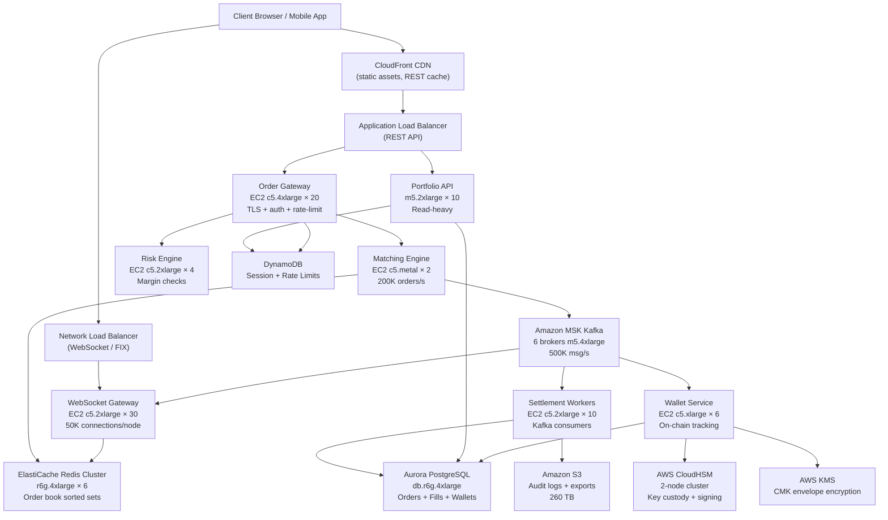

# Crypto Exchange (5M DAU) — Capacity Estimation

## Problem Statement

A crypto exchange serves 5M daily active users trading assets such as BTC, ETH, and 200+ altcoins. The platform must support a high-frequency order book (bids/asks updated at microsecond granularity), real-time price feed delivery to all connected clients via WebSocket, atomic trade settlement, and non-custodial wallet management backed by hardware security modules (HSMs). Unlike typical web apps, write traffic dominates (80% writes) because every price tick, order placement, cancel, and partial fill generates a write event.

## Functional Requirements

- Place, modify, and cancel limit/market/stop orders
- Real-time order book display and price feed streaming via WebSocket
- Trade matching engine with atomic settlement (no double-fills)
- Multi-asset wallet with deposit/withdrawal and on-chain confirmation tracking
- Private key custody via HSM; transaction signing via KMS-wrapped keys
- Trade history, balances, and portfolio P&L queries

## Non-Functional Requirements

| Requirement | Target |
|-------------|--------|
| Order placement latency | < 10 ms (P99) |
| Price feed delivery latency | < 5 ms (P99) |
| Settlement finality | < 100 ms after match |
| Read latency (portfolio/history) | < 50 ms (P99) |
| Availability | 99.99% (52 min downtime/year) |
| Durability (trade records) | 99.9999% |
| Throughput | 200K orders/s peak; 1M price reads/s |
| Order book consistency | Strong (no stale fills) |

## Traffic Estimation

### DAU → Peak QPS Calculation

Assumptions per active trader per day:
- 30 order placements/cancels (writes)
- 150 order book / price reads (reads via WebSocket or REST)
- 5 portfolio / history reads

| Metric | Calculation | Result |
|--------|-------------|--------|
| DAU | Given | 5,000,000 |
| Avg write events/user/day | 30 orders × 1 (place/cancel) | 30 |
| Avg read events/user/day | 150 price reads + 5 portfolio | 155 |
| Total writes/day | 5M × 30 | 150,000,000 |
| Total reads/day | 5M × 155 | 775,000,000 |
| Avg write QPS | 150M / 86,400 | ~1,736/s |
| Avg read QPS | 775M / 86,400 | ~8,969/s |
| Peak multiplier | 3× avg (market open / news event) | 3× |
| Peak write QPS | 1,736 × 3 | ~5,200/s steady; **200K/s burst** |
| Peak read QPS | 8,969 × 3 | ~27K/s steady; **1M/s burst** (fan-out) |
| Read/Write ratio | Reads : Writes | **20:80** (write-dominant) |

**Note on burst**: During high-volatility events (Bitcoin flash crash, exchange listing), order rate spikes to 200K/s because every connected client cancels and re-submits. Price reads spike to 1M/s because each WebSocket broadcast fans out to 1M+ active connections simultaneously.

### WebSocket Connection Sizing

| Metric | Calculation | Result |
|--------|-------------|--------|
| Concurrent WebSocket sessions | 5M DAU × 30% peak concurrency | 1,500,000 |
| Price updates/symbol/second | 10 ticks/s × 200 symbols | 2,000 updates/s |
| Fan-out messages/second | 2K updates × 1.5M connections | 3B msg/s (server-side batching required) |
| After batching (100ms windows) | 3B / 10 | 300M batched pushes/s |

## Storage Estimation

| Data Type | Per Item Size | Daily Volume | Growth/Year |
|-----------|--------------|--------------|-------------|
| Order records (placed/cancelled/filled) | 500 B | 150M events/day = 75 GB | 27 TB |
| Trade fills (settlement records) | 1 KB | 10M fills/day = 10 GB | 3.6 TB |
| Price ticks (time-series) | 200 B | 2K ticks/s × 86,400 × 200 symbols = 34 GB | 12.5 TB |
| Wallet transactions | 2 KB | 500K txns/day = 1 GB | 365 GB |
| User account + KYC metadata | 10 KB | static, ~50 GB total | ~5 GB/year |
| Audit logs (append-only) | 300 B | 500M events/day = 150 GB | 55 TB |
| **Total** | — | ~270 GB/day ingested | **~98 TB/year** |

## Component Sizing

### Compute — EC2

| Component | Instance Type | vCPU | RAM | Count | Handles | Monthly Cost |
|-----------|--------------|------|-----|-------|---------|-------------|
| Matching engine | c5.metal | 96 | 192 GB | 2 (active + hot standby) | 200K orders/s burst, in-memory | $8,736 |
| Order gateway (REST/FIX) | c5.4xlarge | 16 | 32 GB | 20 | 5K RPS/node, TLS termination | $5,568 |
| WebSocket gateway | c5.2xlarge | 8 | 16 GB | 30 | 50K concurrent connections/node | $4,176 |
| Settlement workers | c5.2xlarge | 8 | 16 GB | 10 | Kafka consumers, DB writes | $1,392 |
| Wallet service | c5.xlarge | 4 | 8 GB | 6 | On-chain tx tracking, signing requests | $622 |
| Portfolio / history API | m5.2xlarge | 8 | 32 GB | 10 | Read-heavy, cache-backed | $1,536 |
| Risk engine | c5.2xlarge | 8 | 16 GB | 4 | Margin checks, liquidations | $557 |
| **Subtotal Compute** | | | | **82** | | **$22,587** |

**Why c5.metal for matching engine**: Bare metal eliminates hypervisor jitter (~50 µs saved). The matching engine is single-threaded per trading pair to avoid locks; 96 vCPUs host 200+ trading pair threads.

### Database — PostgreSQL (RDS Aurora)

| DB | Engine | Instance | Count | Capacity | IOPS | Monthly Cost |
|----|--------|----------|-------|----------|------|-------------|
| Orders + fills | Aurora PostgreSQL | db.r6g.4xlarge | 1W + 3R | 10 TB Aurora | 100K IOPS | $11,200 |
| User accounts + KYC | RDS PostgreSQL | db.r6g.2xlarge | 1W + 2R | 500 GB | 20K IOPS | $3,400 |
| Wallet balances | RDS PostgreSQL (PITR 35d) | db.r6g.4xlarge | 1W + 2R | 2 TB | 40K IOPS | $6,800 |
| **Subtotal DB** | | | **9 instances** | | | **$21,400** |

**Why PostgreSQL for settlement**: ACID transactions with `SELECT FOR UPDATE` prevent double-fills. Aurora's 6-way replication across 3 AZs covers durability without manual WAL management.

### NoSQL — DynamoDB

| Table | Use Case | Read Cap | Write Cap | Monthly Cost |
|-------|----------|----------|-----------|-------------|
| Session tokens | JWT session store, TTL 24h | On-demand | On-demand | $800 |
| Notification state | Push/email delivery tracking | On-demand | On-demand | $400 |
| Rate limits | Per-user API throttle counters | On-demand | On-demand | $300 |
| **Subtotal DynamoDB** | | | | **$1,500** |

### Cache — ElastiCache Redis

| Cache Layer | Engine | Instance | Nodes | Memory | Use | Monthly Cost |
|-------------|--------|----------|-------|--------|-----|-------------|
| Order book (L1) | Redis 7 | r6g.4xlarge | 6 (cluster) | 384 GB total | Live bids/asks sorted sets | $8,748 |
| Price feed cache | Redis 7 | r6g.2xlarge | 3 | 96 GB total | Last price + 24h stats per symbol | $2,187 |
| Session cache | Redis 7 | r6g.xlarge | 2 | 32 GB total | Auth tokens | $583 |
| **Subtotal Cache** | | | **11 nodes** | | | **$11,518** |

**Order book in Redis sorted sets**: Each trading pair is one sorted set (score = price, value = order_id:qty). `ZRANGEBYSCORE` returns best bids/asks in O(log N + M). At 200K orders/s, Redis pipeline throughput on r6g.4xlarge handles ~1M ops/s.

### Message Queue — Amazon MSK (Kafka)

| Topic | Partitions | Throughput | Retention | Monthly Cost |
|-------|-----------|-----------|-----------|-------------|
| order-events | 200 | 200K msg/s | 7 days | — |
| trade-fills | 50 | 20K msg/s | 30 days | — |
| price-ticks | 200 | 2K msg/s | 3 days | — |
| wallet-events | 20 | 5K msg/s | 30 days | — |
| audit-log | 100 | 100K msg/s | 90 days | — |
| **MSK cluster** | kafka.m5.4xlarge × 6 brokers | 500K msg/s aggregate | | **$8,640** |

### Hardware Security Module — AWS CloudHSM

| Use | Cluster Size | Operations/s | Monthly Cost |
|-----|-------------|-------------|-------------|
| Private key custody (wallet signing) | 2 HSM nodes (HA) | 1K sign ops/s | $3,200 |
| **Subtotal HSM** | | | **$3,200** |

**KMS + CloudHSM pattern**: Customer Master Keys (CMKs) in KMS are backed by CloudHSM via custom key store. Wallet signing: client sends raw tx hash → Wallet Service → KMS Decrypt envelope key → CloudHSM sign → return DER signature. Keys never leave HSM boundary.

### Object Storage — S3

| Bucket | Use | Size | Requests/month | Monthly Cost |
|--------|-----|------|----------------|-------------|
| Trade history exports | CSV/JSON bulk downloads | 50 TB | 5M GET | $1,200 |
| KYC document storage | ID photos, encrypted | 10 TB | 500K GET | $280 |
| Audit log archive | Compressed Parquet | 200 TB | 2M GET | $4,800 |
| **Subtotal S3** | | 260 TB | | **$6,280** |

### Networking / CDN

| Component | Throughput | Monthly Cost |
|-----------|-----------|-------------|
| CloudFront (static assets, public API) | 200 TB/month egress | $17,000 |
| Network Load Balancer (WebSocket, FIX) | 5M connections, 500 GB/month | $800 |
| Application Load Balancer (REST API) | 2B requests/month | $900 |
| VPC data transfer (AZ cross-traffic) | 500 TB/month | $10,000 |
| Direct Connect (institutional clients) | 10 Gbps dedicated | $2,200 |
| **Subtotal Network** | | **$30,900** |

**Note**: Data transfer dominates networking costs because every order event fans out to settlement workers (Kafka), risk engine, and WebSocket gateway simultaneously.

## Monthly Cost Summary

| Component | Monthly Cost | % of Total |
|-----------|-------------|-----------|
| EC2 Compute | $22,587 | 20% |
| RDS Aurora (PostgreSQL) | $21,400 | 19% |
| ElastiCache Redis | $11,518 | 10% |
| MSK Kafka | $8,640 | 8% |
| CloudHSM (HSM + KMS) | $3,200 | 3% |
| DynamoDB | $1,500 | 1% |
| S3 Storage | $6,280 | 6% |
| CloudFront CDN | $17,000 | 15% |
| Networking (NLB/ALB/VPC/DX) | $13,900 | 12% |
| Other (Lambda, CloudWatch, WAF, ACM, Secrets Manager) | $4,000 | 4% |
| Reserved Instance discount (−20% on EC2+RDS) | −$8,797 | −8% |
| **Total** | **~$101,228** | **100%** |

**Range**: $80K–$140K/month depending on Reserved Instance coverage, trading volume peaks, and institutional Direct Connect capacity purchased. On-demand only = ~$140K; 1-year RI on compute+DB = ~$80K.

## Traffic Scale Tiers

| Tier | DAU | Peak QPS | Servers | DB | Cache | Monthly Cost | Key Bottleneck |
|------|-----|----------|---------|----|----|-------------|----------------|
| 🟢 Startup | 100K | ~2K orders/s | 2 c5.2xlarge matching + 4 m5.large API | 1 RDS r6g.2xlarge | 1 Redis r6g.xlarge | $8K | Single-AZ RDS; no standby matching engine |
| 🟡 Growing | 1M | ~20K orders/s | 6 c5.4xlarge matching + 10 m5.xlarge API | Aurora 1W+2R | Redis cluster 3-node | $28K | Redis sorted-set lock contention at >50 pairs |
| 🔴 Scale-up | 5M | ~200K orders/s peak | 2 c5.metal matching + 50 mixed API/WS | Aurora 1W+3R + sharding | Redis cluster 6-node | $80K–$140K | Kafka partition saturation; HSM sign ops/s |
| ⚫ Production | 20M | ~800K orders/s peak | 8 c5.metal matching + 200 mixed | Multi-region Aurora + CQRS read store | Redis cluster 12-node per region | $400K | Cross-region replication lag for global order book |
| 🚀 Hyperscale | 100M+ | ~5M orders/s peak | Custom FPGA matching engine + 1000+ nodes | DynamoDB (non-financial) + Aurora (settlement) | Distributed Redis + DAX | $2M+ | Physics (speed of light) — need regional order books |

## Architecture Diagram

## Interview Tips

- **Key insight — write-dominant ratio**: Most system design questions assume 80% reads. A crypto exchange flips this: every price tick, order placement, cancel, and partial fill is a write. Your Redis sorted set must handle 200K write ops/s, not read ops/s. Size for write IOPS, not read throughput. Candidates who apply a standard read-heavy cache strategy will under-provision the order book by 4-5x.

- **Key insight — matching engine is single-threaded per pair**: The matching engine processes one trading pair on a single thread to avoid lock contention. 96-core c5.metal hosts 200+ pair threads. Horizontal scale means more trading pairs, not more threads per pair. Interviewers expect you to explain why you cannot simply add more threads to the same order book.

- **Key insight — HSM is the latency ceiling for withdrawals**: CloudHSM supports ~1,000 ECDSA signing ops/s per HSM node. At 5M DAU with 500K daily withdrawals = ~6 sign ops/s average, well within limits. But during a bank-run scenario (10% of users withdraw simultaneously = 500K requests in 1 hour = 140/s burst), you need HSM cluster headroom. Always size HSM for burst, not average.

- **Key insight — WebSocket fan-out is the true scale problem**: 1.5M concurrent WebSocket connections × 2,000 price updates/s = 3 billion messages/second to push. The solution is not to push per-tick but to batch updates in 100ms windows and push a diff snapshot. Each WebSocket gateway node handles 50K connections. At 30 nodes you handle 1.5M connections, each receiving a 100ms batch = 30M pushes/s across the fleet. Candidates who calculate naive fan-out numbers will produce impossible infrastructure requirements.

- **Common mistake — using DynamoDB for order book**: DynamoDB's eventually consistent reads and 10ms single-digit latency are incompatible with sub-millisecond order book updates. Redis sorted sets provide O(log N) insert/delete with sub-millisecond latency and pipeline throughput of 1M+ ops/s. DynamoDB is correct for session tokens and rate-limit counters, not the order book itself.

- **Follow-up question**: "How do you handle the matching engine going down mid-trade?" — Answer: The matching engine is stateless relative to Kafka. All orders are durably written to Kafka before the matching engine processes them. On restart, the engine replays from the last committed offset and rebuilds the in-memory order book from the Kafka compacted `order-events` topic. Kafka log compaction retains the latest state per order_id, so replay is bounded to the open orders only (typically < 1M orders = seconds to rebuild).

- **Scale threshold**: At 20M DAU you need multi-region order books. A single-region order book forces users in Asia to submit orders to US-East with 150ms+ RTT, creating an unfair latency advantage for co-located traders. Regional order books with cross-region arbitrage synchronization become mandatory above ~20M DAU or when institutional clients demand co-location.
