# Digital Wallet (100M DAU) — Capacity Estimation

## Problem Statement

A digital wallet platform (think PayPal, Venmo, Cash App, or GPay) serves 100M daily active users who can send money peer-to-peer, check balances, and cash out to bank accounts. Every transaction is financial — ACID guarantees, idempotency, and audit trails are non-negotiable. The system must handle 300K peak QPS with sub-100ms P99 latency on balance reads, while preventing double-spend, duplicate charges, and fraud.

## Functional Requirements

- **P2P Send**: Transfer funds from one wallet to another atomically (debit sender, credit recipient)
- **Balance Check**: Real-time balance reads for any account
- **Cashout**: Withdraw wallet balance to linked bank account via ACH/wire
- **Transaction History**: Paginated ledger of all debits/credits per user
- **Idempotency**: Duplicate API calls (network retries) must not double-charge
- **KMS Encryption**: All PII and financial data encrypted at rest with customer-managed keys

## Non-Functional Requirements

| Requirement | Target |
|-------------|--------|
| Balance read latency | < 20ms (P99) |
| P2P send latency | < 150ms (P99) |
| Cashout initiation latency | < 200ms (P99) |
| Availability | 99.99% (52 min/year downtime) |
| Durability | 99.9999% (zero transaction loss) |
| Peak QPS | 300K QPS |
| P2P sends throughput | 150K sends/s at peak |
| Idempotency window | 24 hours (prevent duplicate sends) |

## Traffic Estimation

### DAU → Peak QPS Calculation

| Metric | Calculation | Result |
|--------|-------------|--------|
| DAU | Given | 100M |
| Balance checks / user / day | ~5 opens per day | 500M requests/day |
| P2P sends / user / day | ~0.3 sends (30M active senders) | 30M sends/day |
| Transaction history views | ~1.5 views/user/day | 150M requests/day |
| Cashout requests / user / day | ~0.05 (5M/day) | 5M requests/day |
| Notification reads | ~2/user/day | 200M requests/day |
| Total daily requests | 500M + 30M + 150M + 5M + 200M | ~885M requests/day |
| Avg QPS | 885M / 86,400 | ~10,240 QPS |
| Peak QPS (3× avg) | 10,240 × 3 | ~30,720 QPS sustained; design for **300K burst** |
| Read QPS (50% reads) | 300K × 0.50 | ~150K read QPS |
| Write QPS (50% writes) | 300K × 0.50 | ~150K write QPS (includes P2P sends) |

> **Note on 300K peak**: The 300K figure accounts for payday / holiday spikes (5–10× normal). Black Friday 2023 Cash App saw 8× normal volume. We design for this headroom rather than the steady-state 30K QPS.

### Read vs. Write Breakdown

| Operation | Type | Peak QPS | Notes |
|-----------|------|----------|-------|
| Balance read | Read (Redis) | 120,000 | Cache-first, ~95% hit rate |
| Balance read (miss) | Read (Aurora) | 6,000 | 5% cache miss |
| P2P send | Write (Aurora + Redis) | 150,000 | ACID transaction + cache invalidate |
| Cashout initiation | Write (SQS + Aurora) | 3,000 | Async ACH processing |
| Tx history page | Read (Aurora replica) | 18,000 | Paginated reads |
| Idempotency check | Read (Redis) | 150,000 | Every write checks idempotency key |

## Storage Estimation

| Data Type | Per Item Size | Daily Volume | Annual Growth |
|-----------|--------------|--------------|---------------|
| Transaction record (Aurora) | 500 B | 35M records/day | ~6.4 TB/year |
| Idempotency keys (Redis TTL 24h) | 128 B | 150M keys/day (rolling) | ~19 GB live set |
| Balance snapshots (Aurora) | 256 B | 100M accounts (static) | ~26 GB base |
| Audit log (S3 Parquet) | 1 KB | 35M events/day | ~12.8 TB/year |
| KMS encrypted metadata | 64 B overhead/record | 35M records/day | ~0.8 TB/year |
| User PII (encrypted, Aurora) | 2 KB | 100M users (static) | ~200 GB base |
| **Total Aurora** | - | ~35M rows/day | ~7 TB/year |
| **Total S3 (audit + backups)** | - | - | ~15 TB/year |
| **Total Redis live** | - | - | ~20 GB rolling |

## Component Sizing

### Compute — EC2 / Lambda

| Component | Instance Type | vCPU | RAM | Count | Handles | Monthly Cost |
|-----------|--------------|------|-----|-------|---------|-------------|
| API servers (balance, history) | c5.xlarge | 4 | 8 GB | 60 | 150K read QPS total | $7,560 |
| Payment servers (P2P, cashout) | c5.2xlarge | 8 | 16 GB | 40 | 150K write QPS total | $10,080 |
| Fraud scoring workers | c5.xlarge | 4 | 8 GB | 10 | 150K events/s (sync) | $1,260 |
| ACH / cashout Lambda | Lambda 1GB | - | 1 GB | Auto | 3K req/s | ~$200 |
| KMS sidecar / encryption proxy | c5.large | 2 | 4 GB | 10 | Per-AZ, low CPU | $630 |
| **Subtotal Compute** | | | | **~120 EC2** | | **$19,730** |

> **Sizing math**: Each c5.xlarge handles ~2,500 QPS at 4ms average transaction time (4 vCPU × 1000ms/4ms = 1,000 concurrent; ~2,500 with connection pooling). 60 instances × 2,500 = 150K read QPS. Payment servers do more work per request (2 Aurora writes + Redis invalidate) so we size at 40 × c5.2xlarge handling ~3,750 write QPS each.

### Database — Aurora PostgreSQL (ACID Balance)

| DB | Engine | Instance | Count | Capacity | IOPS | Monthly Cost |
|----|--------|----------|-------|----------|------|-------------|
| Balance ledger (writer) | Aurora PostgreSQL | db.r6g.4xlarge | 1 | 128 GB RAM | 100K IOPS | $8,100 |
| Balance ledger (readers) | Aurora PostgreSQL | db.r6g.2xlarge | 3 | 64 GB RAM each | 40K IOPS each | $7,200 |
| Transaction history (writer) | Aurora PostgreSQL | db.r6g.2xlarge | 1 | 64 GB RAM | 80K IOPS | $2,400 |
| Transaction history (readers) | Aurora PostgreSQL | db.r6g.xlarge | 2 | 32 GB RAM each | 30K IOPS each | $2,000 |
| Aurora storage (7 TB × $0.10/GB) | - | - | - | 7,000 GB | - | $700 |
| Aurora I/O (35M writes/day × 365 × $0.20/M) | - | - | - | - | - | $2,555 |
| **Subtotal DB** | | | | | | **$22,955** |

> **Why Aurora over RDS?**: Aurora separates storage from compute — 6-way replication across 3 AZs with 100K IOPS ceiling. A P2P send requires: `BEGIN; SELECT balance FOR UPDATE; UPDATE balance -X; INSERT transaction; UPDATE balance +X; COMMIT` — 5 statements in one ACID transaction. Aurora handles this at ~6,000 TPS per writer with pgBouncer connection pooling.

> **Sharding strategy**: At 100M users, shard Aurora by `user_id % 4` across 4 writer clusters. Each cluster owns 25M users. This keeps the balance table hot set within 128 GB RAM (25M × ~5 KB per account row = 125 GB).

### Cache — ElastiCache Redis (Balance Cache + Idempotency)

| Cache | Engine | Instance | Nodes | Memory | Use | Monthly Cost |
|-------|--------|----------|-------|--------|-----|-------------|
| Balance cache | Redis 7 | r6g.2xlarge | 6 (3 primary + 3 replica) | 52 GB each = 156 GB total | Live balances for 100M accounts | $9,792 |
| Idempotency store | Redis 7 | r6g.xlarge | 4 (2 primary + 2 replica) | 26 GB each = 52 GB total | 24h idempotency keys (150M × 128B = ~19 GB) | $3,264 |
| Session / rate limit | Redis 7 | r6g.large | 2 | 13 GB each | Rate limiting, session tokens | $816 |
| **Subtotal Cache** | | | | | | **$13,872** |

> **Balance cache math**: 100M accounts × ~200 bytes (balance + account metadata) = 20 GB. With 6-node cluster (3 shards), each shard holds ~7 GB of balance data. Cache TTL = 0 (write-through invalidation on every P2P send). 95% hit rate means 285K of 300K peak QPS served from Redis at <1ms.

> **Idempotency key format**: `idem:{sender_id}:{idempotency_key}` → SET with NX flag + 24h TTL. On duplicate, return the original transaction ID. This Redis check happens before Aurora write, preventing double-spend at 150K/s.

### Object Storage — S3

| Bucket | Use | Size | Requests/month | Monthly Cost |
|--------|-----|------|----------------|-------------|
| audit-logs | Parquet audit events (compliance) | 1.1 TB/month | 35M PUT | $133 |
| transaction-backups | Aurora automated snapshots | 500 GB/month | Managed | $50 |
| static-assets | App icons, legal docs | 50 GB (static) | 200M GET | $9 |
| **Subtotal S3** | | | | **$192** |

> S3 costs are minimal for a wallet — the heavy lifting is Aurora + Redis. Audit logs use S3 Intelligent-Tiering with 90-day lifecycle to Glacier for 7-year compliance retention.

### Networking / CDN

| Component | Throughput | Monthly Cost |
|-----------|-----------|-------------|
| ALB (Application Load Balancer) | 300K req/s peak, ~10 ALBs | $1,800 |
| CloudFront (static assets only) | 5 TB/month outbound | $425 |
| NAT Gateway (Aurora/Redis egress) | 2 TB/month | $180 |
| Data transfer (EC2 → internet) | 10 TB/month | $900 |
| VPC peering (multi-AZ traffic) | Internal | $0 |
| **Subtotal Network** | | **$3,305** |

### Message Queue — SQS

| Queue | Engine | Throughput | Use | Monthly Cost |
|-------|--------|-----------|-----|-------------|
| cashout-requests | SQS FIFO | 3K msg/s | ACH initiation, exactly-once delivery | $270 |
| fraud-events | SQS Standard | 150K msg/s | Async fraud scoring fan-out | $1,350 |
| notification-dispatch | SQS Standard | 35K msg/s | Push/email/SMS after transaction | $315 |
| **Subtotal SQS** | | | | **$1,935** |

> **SQS FIFO for cashout**: FIFO queues guarantee exactly-once processing and ordering per `MessageGroupId` (user_id). A user can't initiate two concurrent cashouts. At 3K cashouts/s × $0.10/M messages = $270/month.

### KMS — Key Management

| Key Type | Keys | Requests/month | Monthly Cost |
|----------|------|---------------|-------------|
| Customer-managed CMK (per-shard) | 4 CMKs | 35M encrypt/decrypt/day × 30 = 1.05B | $10,500 |
| Data key caching (LocalCryptoMaterialsCache) | - | Reduces API calls by ~90% | -$9,450 |
| **Subtotal KMS (with caching)** | | | **$1,050** |

> **KMS cost optimization**: Without data key caching, encrypting every transaction at 150K writes/s would cost $10,500/month. AWS Encryption SDK's LocalCryptoMaterialsCache reuses data keys for 5 minutes / 1000 uses, reducing KMS API calls by ~90% to ~$1,050/month.

## Monthly Cost Summary

| Component | Monthly Cost | % of Total |
|-----------|-------------|-----------|
| EC2 Compute (120 instances) | $19,730 | 13% |
| Aurora PostgreSQL (writers + readers) | $22,955 | 15% |
| ElastiCache Redis (balance + idempotency) | $13,872 | 9% |
| S3 Storage (audit + backups) | $192 | <1% |
| CloudFront / ALB / Network | $3,305 | 2% |
| SQS Messaging | $1,935 | 1% |
| KMS Encryption (with caching) | $1,050 | <1% |
| Lambda (cashout workers) | $200 | <1% |
| Support / CloudWatch / X-Ray | $5,000 | 3% |
| Reserved Instance savings (40% discount on EC2+RDS) | -$17,062 | -11% |
| **Subtotal on-demand** | **~$68,239** | |
| **With 1-year Reserved (40% off compute+DB)** | **~$51,177** | |
| **Multi-region DR (2nd region at 30% of primary)** | **+$15,353** | |
| **Estimated Total (RI + DR)** | **~$66,530** | **100%** |

> **Why $150K–$260K range?** The $66K figure is a minimal reserved-instance build. Actual production costs climb due to: multi-region active-active ($66K × 2 = $132K), PCI DSS compliance tooling (WAF, Security Hub, GuardDuty ~$20K/month), data engineering pipelines for fraud ML ($15K/month), and engineering ops overhead. The upper bound reflects a full PCI-compliant multi-region deployment.

## Traffic Scale Tiers

| Tier | DAU | Peak QPS | Servers | DB | Cache | Monthly Cost | Key Bottleneck |
|------|-----|----------|---------|----|----|-------------|----------------|
| 🟢 Startup | 1M | ~3K | 4 c5.large | 1 Aurora writer + 1 reader | 1 Redis node (r6g.large) | ~$3,500 | Single Aurora writer; no read replica headroom |
| 🟡 Growing | 10M | ~30K | 12 c5.xlarge | Aurora writer + 2 readers | Redis 3-node cluster | ~$18,000 | Aurora write IOPS ceiling at ~20K TPS; add read replicas |
| 🔴 Scale-up | 100M | ~300K | 120 c5.xlarge/2xlarge | 4 Aurora shards (4W + 12R) | Redis 10-node cluster (balance + idempotency) | ~$66K–$150K | Cross-shard P2P transactions; idempotency store memory |
| ⚫ Production | 100M (PCI+DR) | ~300K | 240 (multi-region) | 8 Aurora shards multi-region | Redis 20-node multi-region | ~$150K–$260K | KMS API limits; cross-region latency for global P2P |
| 🚀 Hyperscale | 1B+ | ~3M | Auto Scaling + Fargate | DynamoDB (balance) + Aurora (ledger) | ElastiCache Global Datastore | ~$2M+ | DynamoDB hot partitions on high-value accounts; global consistency lag |

## Architecture Diagram

```mermaid
graph TD
    A[Mobile / Web Client] --> B[CloudFront CDN]
    B --> C[ALB — Application Load Balancer]
    C --> D[API Servers — EC2 c5.xlarge x60]
    C --> E[Payment Servers — EC2 c5.2xlarge x40]

    D --> F[Redis — Balance Cache r6g.2xlarge x6]
    E --> F

    E --> G[Idempotency Check — Redis r6g.xlarge x4]
    E --> H[KMS — Customer-Managed CMK]

    E --> I[Aurora PostgreSQL Writer — Balance Ledger]
    D --> J[Aurora PostgreSQL Readers x3]
    I --> J

    E --> K[SQS FIFO — cashout-requests]
    E --> L[SQS Standard — fraud-events]
    E --> M[SQS Standard — notification-dispatch]

    K --> N[Lambda — ACH Cashout Worker]
    L --> O[Fraud Scoring Workers — EC2 c5.xlarge x10]
    M --> P[Notification Service — Push/SMS/Email]

    I --> Q[S3 — Audit Logs Parquet]
    I --> R[Aurora Replica — TX History Reader x2]
    D --> R

    H --> I
    H --> F
```

## Interview Tips

- **Key insight — ACID is non-negotiable for balance updates**: Unlike social media, you cannot use eventual consistency for wallet balances. A P2P send MUST use a serializable or repeatable-read transaction: `SELECT ... FOR UPDATE` on sender row, debit, credit recipient, commit — all in one ACID unit. Candidates who suggest eventual consistency for balance writes fail immediately at fintech interviews.

- **Key insight — Idempotency is the hardest problem**: Mobile clients retry on network timeout. Without idempotency keys, a user who taps "Send $50" and gets a 504 could be charged twice. The correct pattern: client generates UUID per send attempt → server does `SET idem:{uuid} NX EX 86400` in Redis → if key exists, return original TX ID; if not, proceed with Aurora write. This Redis check must happen before ANY Aurora write.

- **Key insight — KMS data key caching**: Every encrypted write at 150K/s without caching = 150K KMS API calls/s = $1.3M/month. AWS KMS default limit is 10K requests/s per account. Use the AWS Encryption SDK with LocalCryptoMaterialsCache (max_age=300s, max_messages_encrypted=1000) to cache data keys locally. This reduces KMS calls by ~90% and costs ~$1,050/month instead.

- **Common mistake — forgetting cross-shard P2P transactions**: When you shard Aurora by user_id, sender and recipient may live on different shards. A P2P send then requires a distributed transaction. The industry solution: use a **saga pattern** with compensating transactions, or route all writes through a single shard for the sender (debit shard A, then async credit shard B). If you suggest XA transactions across shards, explain the latency cost (~200ms extra).

- **Follow-up question — "How do you handle the thundering herd on payday?"**: The 1st of every month, millions of users simultaneously check balances and send money. Redis absorbs 95% of balance reads. For the write spike, use SQS as a buffer — accept P2P sends into SQS immediately (return "pending" to user), then process Aurora writes at a controlled rate (max 20K TPS per Aurora cluster). Show the trade-off: reduced latency UX vs. real-time settlement.

- **Scale threshold**: At 1B DAU, Aurora per-cluster IOPS limits (~100K IOPS, ~30K TPS) become the binding constraint. You must either move balances to DynamoDB (eventual consistency, use Conditional Expressions for optimistic locking) or shard to 40+ Aurora clusters with a global routing layer. DynamoDB's `ConditionExpression: "balance >= :amount"` provides optimistic balance checks without SELECT FOR UPDATE.
