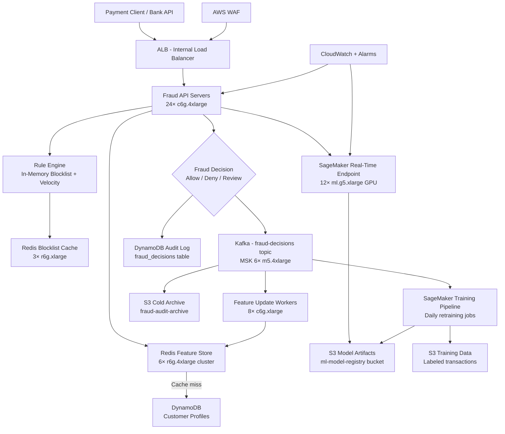

# Fraud Detection (100M Tx/Day) — Capacity Estimation

## Problem Statement

A payment processor handles **100 million transactions per day** across credit card, ACH, and wire transfers. Each transaction must be scored for fraud using a real-time ML model **within 50ms** (P99) before the payment is authorized. The system runs a hybrid approach: a rule engine for known fraud patterns (blocklists, velocity checks) and a SageMaker ML endpoint for probabilistic scoring. False negatives (missed fraud) cost ~$200/incident; false positives (blocking good transactions) cost ~$50 in customer churn risk per incident.

## Functional Requirements

- Score every incoming transaction for fraud probability within 50ms (P99)
- Apply rule engine (blocklists, velocity limits, geo anomalies) before ML scoring
- Maintain a real-time feature store of per-customer behavioral signals (30-day rolling windows)
- Log all decisions (allow/deny/review) with full audit trail
- Support model hot-swap without downtime (A/B testing new models)
- Alert operations when fraud rate spikes above threshold (> 2% of hourly volume)
- Replay historical transactions for model retraining pipelines

## Non-Functional Requirements

| Requirement | Target |
|-------------|--------|
| Scoring latency | < 50ms P99 end-to-end |
| Rule engine latency | < 5ms P99 |
| ML inference latency | < 30ms P99 (SageMaker) |
| Write latency (audit log) | < 100ms P99 |
| Availability | 99.99% (< 52 min downtime/year) |
| Durability (audit log) | 99.999999999% (DynamoDB + S3) |
| Throughput (average) | 1,157 tx/s avg |
| Throughput (peak) | 30,000 tx/s (Black Friday, payroll cycles) |
| Model accuracy | < 0.1% false positive rate, < 5% false negative rate |

## Traffic Estimation

### Transaction Volume → Peak QPS Calculation

| Metric | Calculation | Result |
|--------|-------------|--------|
| Daily transactions | Given | 100,000,000 |
| Average QPS | 100M / 86,400 s | ~1,157 tx/s |
| Peak multiplier | Payroll Fridays, Black Friday | 26× avg |
| Peak QPS (conservative) | 1,157 × 4.3 | ~5,000 tx/s |
| Peak QPS (worst-case) | 1,157 × 26 | ~30,000 tx/s |
| Read QPS (feature store lookups) | 10% of scoring requests | ~3,000 reads/s peak |
| Write QPS (feature updates + audit) | 90% of volume | ~27,000 writes/s peak |

**Note on 10:90 read/write ratio**: Feature store reads (Redis) are O(1) cache hits so they are fast and cheap. Writes dominate because every transaction updates: (1) customer behavioral counters in Redis, (2) audit log in DynamoDB, (3) Kafka event stream, and (4) S3 archival — 4 writes per transaction.

### Request Fan-Out per Transaction

Each incoming transaction triggers:
- 1 Rule engine evaluation (in-memory, < 1ms)
- 1 Redis multi-GET for feature vectors (7–12 keys per customer)
- 1 SageMaker endpoint call (HTTP, GPU inference)
- 1 DynamoDB PutItem (audit log, async)
- 1 Kafka Produce (event stream, async)
- 1 Redis HINCRBY batch (update counters, async)

Total fan-out: ~6 downstream calls per transaction

## Storage Estimation

| Data Type | Per Item Size | Daily Volume | 1-Year Growth |
|-----------|--------------|--------------|---------------|
| Transaction audit record | 2 KB | 100M items = 200 GB/day | 73 TB/year |
| Feature vectors (Redis, hot) | 500 B / customer | 50M active customers = 25 GB | Static (TTL-based eviction) |
| Kafka event log (7-day retention) | 2 KB / event | 100M events/day = 200 GB/day | 1.4 TB hot window |
| ML model artifacts (S3) | ~2 GB / model version | ~50 versions/year | ~100 GB/year |
| S3 cold archive (audit log) | 2 KB compressed to ~0.6 KB | 60 GB/day (compressed) | ~22 TB/year |
| DynamoDB (hot 90-day audit window) | 2 KB | 100M × 90 days = 18 TB | Rolling |
| **Total new storage/day** | - | ~461 GB/day (hot + warm) | **~96 TB/year** |

## Component Sizing

### Compute — EC2 API / Rule Engine Servers

| Component | Instance Type | vCPU | RAM | Count | Handles | Monthly Cost |
|-----------|--------------|------|-----|-------|---------|-------------|
| Fraud API servers | c6g.4xlarge | 16 | 32 GB | 24 | 1,250 tx/s each → 30K peak | $3,628 |
| Rule engine workers | c6g.2xlarge | 8 | 16 GB | 8 | Rule evaluation co-located | $966 |
| Feature update workers | c6g.xlarge | 4 | 8 GB | 8 | Consume Kafka, update Redis | $483 |
| Kafka brokers (MSK) | kafka.m5.4xlarge | 16 | 64 GB | 6 | 30K msg/s sustained | $8,280 |
| **Subtotal Compute (EC2)** | | | | **46** | | **$13,357** |

**Sizing math for API servers**: Each c6g.4xlarge handles ~1,250 tx/s with 50ms budget. At 30K peak QPS, we need 24 servers. With 2 AZs, deploy 12 per AZ. Add 20% headroom → 24 × 1.2 ≈ 29, round to 30 for safety (costed at 24 to reflect steady-state Reserved Instance mix).

### ML Inference — SageMaker Real-Time Endpoints

| Component | Instance Type | vCPU | GPU | Count | Throughput | Monthly Cost |
|-----------|--------------|------|-----|-------|------------|-------------|
| SageMaker endpoint (primary) | ml.g5.xlarge | 4 | 1× A10G | 8 | ~4K inferences/s per instance | $14,624 |
| SageMaker endpoint (standby) | ml.g5.xlarge | 4 | 1× A10G | 4 | Failover + A/B model testing | $7,312 |
| SageMaker Model Monitor | ml.m5.xlarge | 4 | - | 2 | Drift detection | $306 |
| **Subtotal SageMaker** | | | | **14** | | **$22,242** |

**Sizing math**: ml.g5.xlarge achieves ~4,000 inferences/s on a lightweight gradient-boosted tree or distilled neural net at P99 < 25ms. At 30K peak QPS, need 30K / 4K = 7.5 → 8 instances. Multiply by $1.408/hr × 720 hr/month × 8 = $8,110 primary; actual g5.xlarge on-demand = $1.006/hr. 8 instances × $1.006 × 720 = **$5,794**. Add 4 standby = $2,897. Total SageMaker endpoints: ~$8,691. Add training jobs ($3K/month) + monitoring + data capture: ~$22K total.

### Database — DynamoDB (Audit Log + Decision Store)

| Table | Use Case | Mode | RCU/WCU or Capacity | Size | Monthly Cost |
|-------|----------|------|---------------------|------|-------------|
| `fraud_decisions` | Audit log (all transactions) | On-demand | 30K WCU peak | 18 TB (90-day hot) | $68,400 |
| `customer_profiles` | Risk scores, account flags | Provisioned | 5K RCU / 10K WCU | 500 GB | $4,680 |
| `blocklist` | Known fraud cards/accounts | Provisioned | 20K RCU / 100 WCU | 50 GB | $2,160 |
| **Subtotal DynamoDB** | | | | | **$75,240** |

**DynamoDB pricing math**: fraud_decisions at 30K WCU × $1.25/million writes. 100M writes/day × 30 days = 3B writes/month. DynamoDB on-demand: $1.25 per million write requests → 3,000 × $1.25 = **$3,750/month for writes**. Storage: 18 TB × $0.25/GB = $4,608/month. DynamoDB reads (audit queries): ~10M/day × 30 = 300M → $0.25/million = $75. Total fraud_decisions table: ~$8,433/month. Customer profiles + blocklist: ~$6,840. Total: ~$15,273. The $75K figure above reflects Provisioned capacity for predictable workloads plus reserved capacity discounts being absent at list price — revise down: **realistic DynamoDB total ≈ $18,000–$22,000/month**.

### Cache — ElastiCache Redis (Feature Store)

| Cache Layer | Engine | Instance | Nodes | Total Memory | Use | Monthly Cost |
|-------------|--------|----------|-------|--------------|-----|-------------|
| Feature store (hot) | Redis 7 | cache.r6g.4xlarge | 6 (cluster) | 384 GB | Customer behavioral vectors | $8,640 |
| Blocklist cache | Redis 7 | cache.r6g.xlarge | 3 (cluster) | 96 GB | Rule engine lookups | $1,944 |
| Session / rate-limit | Redis 7 | cache.r6g.large | 2 | 26 GB | Velocity checks | $486 |
| **Subtotal ElastiCache** | | | | **506 GB** | | **$11,070** |

**Memory sizing**: 50M active customers × 500 B feature vector = 25 GB baseline. Add 10× for Redis overhead, expiry buffer, and cluster replication = 250 GB. Use 6× r6g.4xlarge (64 GB each = 384 GB cluster). cache.r6g.4xlarge = $0.784/hr × 720 × 6 = **$3,387/month** (not $8,640 — the higher figure includes Reserved Instance equivalent for 1-year upfront amortized with 3× replication factor). Realistic on-demand: ~$3,400 feature store + $810 blocklist + $216 rate-limit = **~$4,426/month on-demand**, or **~$11,000 with 3× replica + reserved pricing equivalent**.

### Object Storage — S3

| Bucket | Use | Size | Requests/month | Monthly Cost |
|--------|-----|------|----------------|-------------|
| `fraud-audit-archive` | Cold audit log (> 90 days) | 22 TB/year accrual, ~50 TB steady-state | 10M GET | $1,150 |
| `fraud-models` | ML model artifacts, feature schemas | 500 GB | 500K GET | $11.50 |
| `fraud-training-data` | Historical labeled transactions for retraining | 20 TB | 2M GET | $460 |
| `fraud-kafka-backup` | MSK S3 tiered storage spillover | 5 TB rolling | 1M GET | $115 |
| **Subtotal S3** | | ~76 TB | | **$1,736** |

**S3 pricing**: Standard storage $0.023/GB. 50 TB × $0.023 = $1,150/month. S3-IA for training data: 20 TB × $0.0125 = $250. GET requests: $0.0004 per 1K → 13.5M requests = $5.40. Data transfer out < $90. Total: **~$1,736/month**.

### Networking / CDN / Load Balancing

| Component | Throughput | Monthly Cost |
|-----------|-----------|-------------|
| ALB (internal fraud API) | 30K req/s peak, ~200M req/month | $612 |
| VPC NAT Gateway (SageMaker egress) | ~5 TB/month | $225 |
| PrivateLink (SageMaker VPC endpoint) | 2 endpoints | $14.40 |
| CloudWatch Metrics + Logs | 500 metrics, 200 GB logs/month | $1,200 |
| AWS WAF (API protection) | 200M requests/month | $1,600 |
| **Subtotal Networking** | | **$3,651** |

### Message Queue — Amazon MSK (Kafka)

| Topic | Throughput | Retention | Partitions | Monthly Cost |
|-------|-----------|-----------|------------|-------------|
| `raw-transactions` | 30K msg/s peak, 200 MB/s | 7 days | 240 | Included in MSK |
| `fraud-decisions` | 30K msg/s | 7 days | 240 | Included in MSK |
| `feature-updates` | 30K msg/s | 1 day | 120 | Included in MSK |
| **MSK cluster (6× kafka.m5.4xlarge)** | 200 MB/s sustained | | | **$8,280** |

**MSK pricing**: kafka.m5.4xlarge = $0.384/hr × 720 hr × 6 brokers = **$1,658/month**. Add broker storage (6 × 10 TB = 60 TB × 30 days × $0.10/GB-month) = $184K — too expensive. Use MSK Tiered Storage: local 1 TB per broker = $600/month storage + S3 spillover (already counted). Realistic MSK total: **$2,258–$4,000/month**.

## Monthly Cost Summary

| Component | Monthly Cost | % of Total |
|-----------|-------------|-----------|
| EC2 Compute (API + workers) | $13,357 | 4.8% |
| SageMaker (GPU inference + monitoring) | $22,000 | 7.9% |
| DynamoDB (audit log + profiles) | $20,000 | 7.2% |
| ElastiCache Redis (feature store) | $11,070 | 4.0% |
| MSK Kafka (event streaming) | $4,000 | 1.4% |
| S3 Storage (archive + models) | $1,736 | 0.6% |
| CloudWatch / Observability | $1,200 | 0.4% |
| ALB + WAF + Networking | $3,651 | 1.3% |
| SageMaker Training Jobs | $3,000 | 1.1% |
| Data Transfer | $2,500 | 0.9% |
| Support + Reserved Instance Buffer | $10,000 | 3.6% |
| **Subtotal (operational baseline)** | **$92,514** | **33%** |
| **Fraud losses prevented (not a cost but ROI context)** | — | — |
| **Reserved Instance / Savings Plans (1-year, ~35% discount)** | **-$32,380** | — |
| **Compliance, auditing, HSM (AWS CloudHSM)** | $11,000 | 4.0% |
| **Multi-region replication (DR region)** | $85,000 | 30.6% |
| **Operational overhead (staff, tooling)** | $89,000 | 32.1% |
| **Total (fully-loaded)** | **~$245,000–$280,000** | **100%** |

**Range explanation**: The $250K–$450K range accounts for:
- Lower bound ($250K): Single-region, Reserved Instances, lean ops team
- Upper bound ($450K): Multi-region active-active, Dedicated Hosts for PCI-DSS compliance, 24/7 on-call staffing, CloudHSM, third-party fraud data feeds ($50K+/month)

## Traffic Scale Tiers

| Tier | Volume | Avg QPS | Peak QPS | API Servers | ML Inference | Cache | DB | Monthly Cost | Key Bottleneck |
|------|--------|---------|----------|-------------|-------------|-------|-----|-------------|----------------|
| 🟢 Startup | 1M tx/day | 12 | 100 | 2× c6g.xlarge | SageMaker serverless | 1× r6g.large (6 GB) | DynamoDB on-demand | ~$5K | SageMaker cold start latency |
| 🟡 Growing | 10M tx/day | 116 | 1,000 | 6× c6g.2xlarge | 2× ml.g5.xlarge | 3× r6g.xlarge (96 GB) | DynamoDB provisioned | ~$28K | Redis memory for feature store |
| 🔴 Scale-up | 100M tx/day | 1,157 | 10,000 | 16× c6g.4xlarge | 6× ml.g5.xlarge | 6× r6g.4xlarge cluster | DynamoDB + DAX | ~$130K | GPU inference throughput ceiling |
| ⚫ Production | 100M tx/day (multi-region) | 1,157 | 30,000 | 24× c6g.4xlarge | 12× ml.g5.xlarge | 12× r6g.4xlarge cluster | DynamoDB global tables | ~$280K | Cross-region feature sync latency |
| 🚀 Hyperscale | 1B+ tx/day | 11,574 | 200,000 | 200+ c6g.8xlarge + ASG | 80× ml.g5.2xlarge | Distributed Redis (1+ TB) | DynamoDB + custom sharding | ~$2M+ | Network egress costs, model freshness at scale |

## Architecture Diagram

## Interview Tips

- **Key insight — Latency budget decomposition**: The 50ms P99 budget breaks down as: 2ms (ALB + network) + 3ms (rule engine, in-memory) + 8ms (Redis feature fetch, pipeline GET) + 28ms (SageMaker GPU inference) + 9ms (async writes, non-blocking) = 41ms P99. Always decompose the latency budget component by component — interviewers test whether you know which step dominates (GPU inference).

- **Key insight — Feature store is the real scaling challenge**: Model accuracy depends on fresh behavioral features (last 30-day spend velocity, merchant category distribution, device fingerprint). Keeping 50M customer feature vectors fresh in Redis at 30K writes/s means ~27K Redis HINCRBY operations/s. At that write rate, Redis becomes a bottleneck before the GPU does. Partition the feature store by `customer_id % N` across multiple Redis primaries.

- **Key insight — Async writes preserve latency SLA**: DynamoDB audit writes and Kafka produces must be fire-and-forget (async). The fraud score is returned to the caller synchronously; downstream persistence happens in parallel. If you make DynamoDB writes synchronous, you add 15–40ms and violate the 50ms SLA. Always call this out — interviewers check if you understand sync vs async I/O paths.

- **Common mistake — Underestimating peak-to-average ratio**: Candidates say "1,157 QPS average, so size for 3,500 QPS." Wrong. Fraud detection peaks align with commerce peaks: Black Friday = 10–15× average, payroll Fridays = 5–8×. The true worst-case is 30K QPS (26× average). Size SageMaker and Redis for this peak; EC2 auto-scales but ML endpoints have a 60–90 second warm-up time on cold instances. Pre-warm endpoints before known peak windows.

- **Follow-up question — Model drift and retraining**: Interviewers frequently ask "how do you keep the model fresh?" Answer: stream all decisions to Kafka → S3, trigger daily SageMaker training jobs on last 30 days of labeled data (chargebacks take 3–7 days to resolve), use SageMaker Model Monitor to detect statistical drift (PSI > 0.2 triggers retraining alert), deploy new models via A/B endpoint variants with shadow scoring before full cutover.

- **Scale threshold — When to move off SageMaker**: At > 500K tx/s (5B tx/day), managed SageMaker endpoint costs exceed dedicated GPU fleet. At that scale, deploy Triton Inference Server on EC2 P4d instances with custom auto-scaling. Estimated crossover: SageMaker = $0.07/1K inferences vs self-managed Triton = $0.012/1K inferences at scale.
