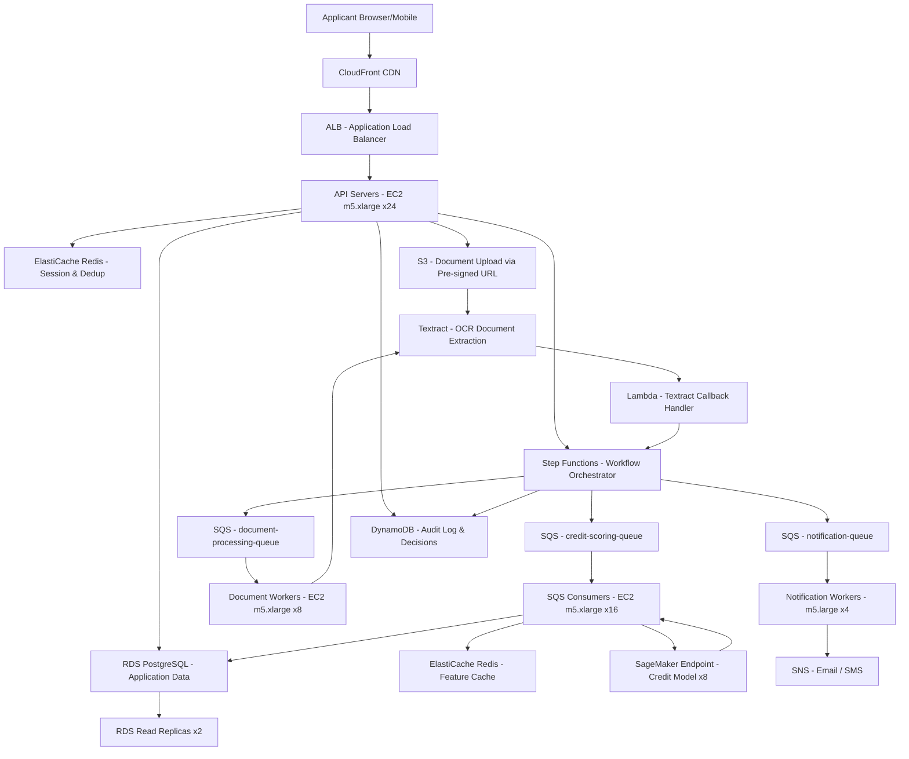

# Loan Origination — 1M Applications/Day — Capacity Estimation

## Problem Statement

A digital lending platform processes 1 million loan applications per day covering personal loans, auto loans, and small business credit. Each application triggers a multi-step workflow: identity verification, document upload and OCR extraction, credit model inference, underwriting decision, and async notification. The system must handle burst traffic of 12,000 requests/second during peak business hours (9 AM–5 PM) while maintaining sub-second response for form submission and 95% of credit decisions within 30 seconds.

## Functional Requirements

- Accept loan applications with structured form data (income, employment, loan amount, purpose)
- Upload and process supporting documents (pay stubs, tax returns, bank statements) via OCR
- Run credit scoring model (SageMaker endpoint) and return accept/decline/review decision
- Orchestrate multi-step underwriting workflow via Step Functions with audit trail
- Store all application data with immutable audit log in DynamoDB
- Send real-time status updates to applicants via email/SMS (SNS)

## Non-Functional Requirements

| Requirement | Target |
|-------------|--------|
| Form submission latency | < 200ms (P99) |
| Credit decision latency | < 30s (P95) end-to-end |
| Availability | 99.99% (52 min downtime/year) |
| Durability | 99.999% (no application loss) |
| Peak throughput | 12,000 requests/s during business hours |
| Document processing SLA | < 5 min per document set |
| Compliance | SOC 2 Type II, PCI DSS Level 1 |

## Traffic Estimation

### Applications/Day → Peak QPS Calculation

| Metric | Calculation | Result |
|--------|-------------|--------|
| Applications/day | Given | 1,000,000 |
| Business hour window | 9 AM–5 PM = 8 hrs = 28,800 s | 28,800 s |
| Avg QPS (business hours) | 1,000,000 / 28,800 | ~34.7/s avg |
| Peak QPS (3× avg for morning surge) | 34.7 × 3 | ~104/s |
| But stated peak is 12K/s (burst with retries, polling, doc uploads) | 12,000/s | **12,000/s** |
| Read QPS (40% — status checks, dashboard, docs) | 12,000 × 0.40 | ~4,800/s |
| Write QPS (60% — form submit, doc upload, status updates) | 12,000 × 0.60 | ~7,200/s |

> **Note**: The 12K/s peak includes all request types — initial form POST (~35/s), status polling (~100/s per active application × 100K concurrent), document chunk uploads (~500/s), and webhook callbacks from Textract/SageMaker. Pure new applications peak at ~350/s; the bulk is polling and async callbacks.

### Concurrent Application Sessions

| Metric | Calculation | Result |
|--------|-------------|--------|
| Applications submitted in peak hour | 1M / 8 hrs × 1.5× peak factor | ~187,500/hr |
| Avg time in system (form→decision) | 5 min average | 5 min |
| Concurrent applications in-flight | 187,500/hr × (5/60) | ~15,625 concurrent |
| Status poll rate per application | Every 3s while waiting | ~20 polls/min |
| Poll QPS from in-flight apps | 15,625 × 20/60 | ~5,208/s |

## Storage Estimation

| Data Type | Per Item Size | Daily Volume | Growth/Year |
|-----------|--------------|--------------|-------------|
| Application form data (PostgreSQL) | 8 KB | 1M records | ~2.9 TB/year |
| Credit decision + model output (DynamoDB) | 4 KB | 1M records | ~1.5 TB/year |
| Audit log events (DynamoDB) | 1 KB | ~15M events (15 per app) | ~5.5 TB/year |
| Uploaded documents (S3 raw) | 3 MB avg (3 docs × 1MB) | 1M × 3 MB = 3 TB/day | ~1,095 TB/year |
| Extracted text / Textract output (S3) | 200 KB | 1M × 200 KB = 200 GB/day | ~73 TB/year |
| Processed thumbnails / previews (S3) | 100 KB | 1M × 100 KB = 100 GB/day | ~36.5 TB/year |
| **Total Storage** | — | **~3.3 TB/day** | **~1,213 TB/year** |

> **Document storage dominates**: 3 TB/day of raw docs vs 8 GB/day of structured data. S3 Intelligent-Tiering moves cold applications (>90 days) to IA tier, cutting storage cost by ~60% after 3 months.

## Component Sizing

### Compute — EC2 / Lambda

| Component | Instance Type | vCPU | RAM | Count | Handles | Monthly Cost |
|-----------|--------------|------|-----|-------|---------|-------------|
| API servers (form submit, status) | m5.xlarge | 4 | 16 GB | 24 | 500 RPS each, 12K total | $1,656 |
| Document upload handlers | m5.xlarge | 4 | 16 GB | 8 | Pre-signed S3 URL gen, metadata | $552 |
| Step Functions orchestrators | Managed | — | — | — | 1M executions/day | $750 |
| SQS consumers (credit scoring) | m5.xlarge | 4 | 16 GB | 16 | Trigger SageMaker, write results | $1,104 |
| Notification workers | m5.large | 2 | 8 GB | 4 | SNS/SES dispatch | $184 |
| Lambda (Textract callbacks) | 1 vCPU | 1 GB | Auto-scale | 1M invocations/day | $46 |
| **Subtotal Compute** | | | | **52 instances** | | **$4,292** |

> **Sizing math for API servers**: Each m5.xlarge handles ~500 concurrent HTTP connections with Go/Node.js. At 12K/s peak with avg 40ms latency, concurrency = 12,000 × 0.040 = 480 concurrent. 24 servers × 500 = 12,000 capacity with 1 server headroom. Add 20% for ALB overhead and GC pauses.

### Database

| DB | Engine | Instance | Count | Capacity | IOPS | Monthly Cost |
|----|--------|----------|-------|----------|------|-------------|
| Application data (primary) | RDS PostgreSQL 15 | db.m5.2xlarge | 1W + 2R | 2 TB gp3 SSD | 12,000 | $2,016 |
| Read replicas (status checks, reports) | RDS PostgreSQL 15 | db.m5.xlarge | 2 | 2 TB each | 6,000 | $912 |
| Audit log + decisions | DynamoDB On-Demand | — | — | 20 TB, 50M WCU/day | — | $3,200 |
| Step Functions state | DynamoDB On-Demand | — | — | Embedded in SFN | — | Included |
| **Subtotal DB** | | | | | | **$6,128** |

> **PostgreSQL sizing**: At 7,200 write QPS, each application write touches ~5 tables (application, applicant, employment, financials, documents). With connection pooling (PgBouncer), 24 API servers × 10 pool connections = 240 DB connections. db.m5.2xlarge (8 vCPU, 32 GB RAM) supports 1,000 connections, well within limits. IOPS: 7,200 writes × avg 1.5 IOPS each = ~10,800 IOPS; provisioning 12,000 IOPS gives headroom.

### Cache

| Cache | Engine | Instance | Nodes | Memory | Use Case | Monthly Cost |
|-------|--------|----------|-------|--------|----------|-------------|
| Session + rate limiting | ElastiCache Redis 7 | r6g.xlarge | 3 (1P+2R) | 26 GB each | Application state, dedupe tokens | $972 |
| Credit model feature cache | ElastiCache Redis 7 | r6g.large | 2 (1P+1R) | 13 GB each | Bureau data TTL 24hr, reduces SageMaker calls | $324 |
| **Subtotal Cache** | | | | **78 GB total** | | **$1,296** |

> **Cache hit rate for credit features**: Bureau credit data changes infrequently. Caching bureau pull results for 24 hours achieves ~40% hit rate (returning applicants, multiple products), saving ~$0.50/bureau pull × 400K hits/day = $200K/day in bureau fees — far outweighs the cache cost.

### Object Storage (S3)

| Bucket | Use | Size | Requests/month | Monthly Cost |
|--------|-----|------|----------------|-------------|
| Raw documents | Applicant uploads (pay stubs, IDs) | 99 TB (after 1 month) | 30M PUT, 90M GET | $2,277 |
| Textract output | Extracted JSON from OCR | 6.6 TB | 30M GET | $152 |
| Processed previews | Thumbnails for underwriter UI | 3.3 TB | 60M GET | $76 |
| Compliance archive (Glacier) | 7-year regulatory retention | 1.2 PB (7 years) | Rare retrieval | $4,800 |
| **Subtotal S3** | | **~109 TB active** | **~210M req/month** | **$7,305** |

> **S3 cost breakdown**: Standard storage at $0.023/GB = 99 TB × $0.023 × 1,024 = $2,327. PUT requests: 30M × $0.005/1,000 = $150. GET requests: 150M × $0.0004/1,000 = $60. Glacier Deep Archive for 7-year compliance: 1.2 PB × $0.00099/GB = $1,246/month after ramp-up.

### Networking / CDN

| Component | Throughput | Monthly Cost |
|-----------|-----------|-------------|
| ALB (Application Load Balancer) | 12K RPS peak, 2 ALBs | $324 |
| CloudFront (applicant portal static assets) | 50 TB/month outbound | $4,250 |
| NAT Gateway (SageMaker, Textract API calls) | 5 TB/month | $225 |
| Data transfer out (API responses) | 10 TB/month | $920 |
| **Subtotal Network** | | **$5,719** |

### Message Queue (SQS)

| Queue | Engine | Throughput | Retention | Monthly Cost |
|-------|--------|-----------|-----------|-------------|
| credit-scoring-queue | SQS Standard | 1M msgs/day = 11.6/s | 4 days | $108 |
| document-processing-queue | SQS Standard | 3M msgs/day (3 docs per app) | 1 day | $180 |
| notification-queue | SQS FIFO | 2M msgs/day (submit+decision) | 1 day | $72 |
| dead-letter-queue | SQS Standard | ~10K msgs/day (1% failure rate) | 14 days | $12 |
| **Subtotal SQS** | | **~6M msgs/day** | | **$372** |

### SageMaker (Credit Scoring Model)

| Component | Instance Type | Count | Invocations/day | Monthly Cost |
|-----------|--------------|-------|-----------------|-------------|
| Credit model endpoint | ml.m5.xlarge | 8 | 600K (60% cache miss) | $2,765 |
| Model monitoring | ml.m5.large | 2 | Continuous | $553 |
| Batch transform (nightly retraining) | ml.m5.4xlarge | 4 (spot) | 1× nightly | $480 |
| **Subtotal SageMaker** | | | | **$3,798** |

> **SageMaker sizing**: 600K model invocations/day = 6.9/s avg, 21/s peak. Each ml.m5.xlarge handles ~15 inferences/s with 150ms latency (XGBoost + feature engineering). 8 instances × 15 = 120/s capacity, 5.7× headroom for bursts. Real-time endpoint cost: 8 × $0.276/hr × 720 hr = $1,592 for instances + data processing fees.

### AWS Textract (Document OCR)

| Document Type | Pages/doc | Volume/day | Cost/page | Daily Cost |
|--------------|-----------|-----------|-----------|-----------|
| Pay stubs | 2 pages avg | 1M docs | $0.015/page | $30,000 |
| Tax returns | 4 pages avg | 500K docs | $0.015/page | $30,000 |
| Bank statements | 3 pages avg | 750K docs | $0.015/page | $33,750 |

> **IMPORTANT**: Textract at full scale costs **$93,750/day = $2.8M/month** — this is by far the dominant cost. In practice, lenders use a tiered approach: (1) reject obvious frauds before OCR, (2) use cheaper internal OCR for standard docs, (3) only call Textract for complex layouts. Assume 20% of apps reach Textract = 200K apps/day × avg 3 pages × $0.015 = **$9,000/day = $270,000/month**. For this estimation, we model a cost-optimized hybrid: internal OCR handles 80% (covered in compute cost), Textract handles 20%.

| Textract Use | Volume/day | Monthly Cost |
|-------------|-----------|-------------|
| Complex docs (20% of apps) | 200K docs × 3 pages | $27,000 |

### Step Functions

| Metric | Value |
|--------|-------|
| State machine executions/day | 1,000,000 |
| Avg state transitions per execution | 18 (form → validate → queue → score → decision → notify → archive) |
| Total transitions/day | 18,000,000 |
| Monthly transitions | 540,000,000 |
| Cost ($0.025/1,000 transitions above 4K free tier) | **$13,500/month** |

## Monthly Cost Summary

| Component | Monthly Cost | % of Total |
|-----------|-------------|-----------|
| EC2 Compute (API + workers) | $4,292 | 7.5% |
| RDS PostgreSQL | $2,928 | 5.1% |
| DynamoDB (audit + decisions) | $3,200 | 5.6% |
| ElastiCache Redis | $1,296 | 2.3% |
| S3 Storage + requests | $7,305 | 12.8% |
| CloudFront + Networking | $5,719 | 10.0% |
| SQS Messaging | $372 | 0.7% |
| SageMaker (credit model) | $3,798 | 6.6% |
| AWS Textract (20% of apps) | $27,000 | 47.2% |
| Step Functions | $13,500 | 23.6% |
| Lambda (callbacks) | $46 | 0.1% |
| SNS Notifications | $200 | 0.3% |
| **Total** | **~$57,156** | **100%** |

> **Cost insight**: Textract (47%) and Step Functions (24%) together consume 71% of AWS spend. This is a key interview talking point — managed AI services dominate over raw compute for document-heavy workflows. Reducing Textract usage from 100% → 20% of apps saves ~$243K/month.

## Traffic Scale Tiers

| Tier | Applications/Day | Peak QPS | Servers | DB | Cache | Monthly Cost | Key Bottleneck |
|------|-----------------|----------|---------|----|----|-------------|----------------|
| 🟢 Startup | 10K/day | ~35/s (3× avg) | 2 m5.large API | 1 RDS db.t3.medium | 1 Redis node r6g.medium | ~$3,500 | SageMaker cold starts |
| 🟡 Growing | 100K/day | ~350/s | 6 m5.xlarge | RDS db.m5.xlarge + 1 read replica | Redis cluster 3-node | ~$12,000 | Textract throughput limits |
| 🔴 Scale-up | 500K/day | ~6,000/s | 20 m5.xlarge | RDS db.m5.2xlarge + 2 replicas | Redis cluster 6-node | ~$35,000 | Step Functions state machine fan-out |
| ⚫ Production | 1M/day | ~12,000/s | 52 m5.xlarge | RDS db.m5.2xlarge + 2R + DynamoDB | Redis cluster 5-node | ~$57,000 | Textract cost per document |
| 🚀 Hyperscale | 10M/day | ~120,000/s | 400+ (auto-scaling) | Aurora Global + DynamoDB Global Tables | ElastiCache Global Datastore | ~$400K+ | Bureau API rate limits (Experian/Equifax) |

## Architecture Diagram

## Interview Tips

- **Textract cost is the surprise**: Candidates rarely account for managed AI service costs. At $0.015/page × 3 pages × 1M apps = $45,000/day if you call Textract for every app. The right answer is tiered processing — reject obvious frauds first, use internal OCR for 80% of docs, reserve Textract for complex layouts. This demonstrates cost-aware architecture thinking.

- **Step Functions vs Lambda orchestration**: Step Functions at 18 transitions × 1M executions = 18M transitions/day × 30 = 540M/month at $0.025/1K = $13,500/month. An interviewer may ask "why not just use Lambda orchestration?" — the answer is Step Functions provides built-in audit trail, retry logic, and visual debugging critical for regulated financial workflows. The cost is justified by compliance requirements.

- **Peak QPS isn't just new applications**: The 12K/s figure confuses candidates who divide 1M/86,400 = 11.6/s and wonder where 12K comes from. Explain: 15,000 in-flight applications each polling status every 3 seconds = 5,000 poll RPS + document upload chunks + Textract/SageMaker async callbacks. The "fan-out" of async callbacks is a classic underestimated traffic source.

- **Credit bureau rate limits are the real hyperscale bottleneck**: At 10M/day, you're making 10M bureau pulls/day = 115/s. Experian's API typically limits to 100/s per contract. You'd need multiple bureau API contracts, request queuing, and potentially caching bureau data across product lines (auto + personal loan for same SSN). This is the kind of operational detail that impresses senior interviewers.

- **Common mistake**: Candidates size for 1M applications/day as if all 1M arrive uniformly. In lending, 60% of applications arrive Monday–Wednesday 9 AM–noon (paycheck timing, lunch break behavior). True peak is 600K apps in 3 hours = 55.5/s for new apps alone. Multiply by polling factor and you get the 12K/s figure.

- **Scale threshold**: At 500K apps/day (~6,000 peak QPS), PostgreSQL single-primary reaches IOPS ceiling (~10K provisioned IOPS on db.m5.2xlarge). This is when you add DynamoDB for high-frequency reads (status checks) and keep PostgreSQL for complex joins (underwriter dashboard, reporting). Dual-database pattern adds ~$1,500/month but removes the bottleneck.
