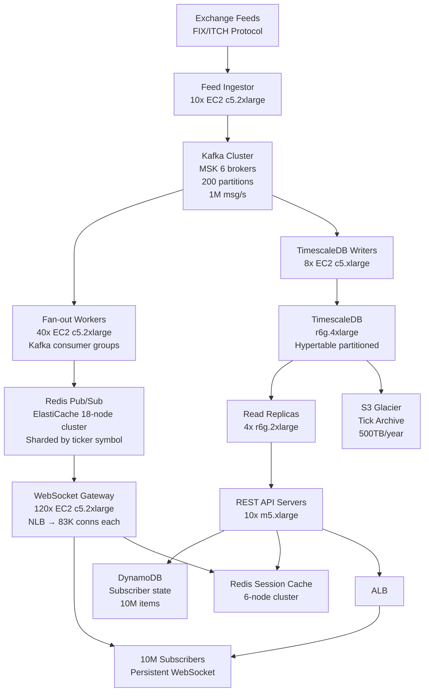

# Market Data Feed — 10M Subscribers — Capacity Estimation

## Problem Statement

A financial market data platform must distribute real-time stock price updates to 10 million active subscribers simultaneously. During peak trading hours (US market open 9:30–10:30 AM ET), the system ingests up to 1 million price update events per second across all tickers and fans them out to subscribers over persistent WebSocket connections. Latency must stay under 10ms P99 from exchange feed receipt to subscriber delivery — a hard requirement for algorithmic trading clients.

## Functional Requirements

- Ingest real-time price feeds from 50+ exchanges and market data providers via FIX/ITCH protocol adapters
- Distribute price updates to up to 10M concurrent WebSocket subscribers with per-user ticker subscriptions
- Store full tick history in time-series DB for replay, backtesting, and regulatory audit
- Support selective subscription: each client subscribes to 1–500 tickers (avg 50 tickers/client)
- Provide REST API for historical OHLCV data (Open, High, Low, Close, Volume) and snapshot queries
- Handle market open surge (9:30 AM ET): 10× normal traffic within 60 seconds

## Non-Functional Requirements

| Requirement | Target |
|-------------|--------|
| Tick delivery latency | < 10ms P99 (exchange feed → subscriber) |
| REST read latency | < 50ms P99 |
| Write latency (tick ingestion) | < 5ms P99 |
| Availability | 99.99% (52 min downtime/year) |
| Durability | 99.999% (tick history never lost) |
| Throughput | 1M price updates/s ingested; fan-out to 10M subscribers |
| Connection capacity | 10M concurrent WebSocket connections |
| Recovery time | < 30s (auto-reconnect with state replay) |

## Traffic Estimation

### Ingestion → Fan-out Calculation

| Metric | Calculation | Result |
|--------|-------------|--------|
| Active tickers | NYSE + NASDAQ + derivatives | ~10,000 tickers |
| Price updates/ticker/s (peak) | 100 updates/s per liquid ticker | ~1M updates/s total |
| Avg subscribers per ticker | 10M subscribers × 50 tickers / 10K tickers | 50,000 subs/ticker |
| Fan-out messages/s | 1M updates/s × 50,000 subs (selective, 5% overlap) | ~500M msg deliveries/s |
| Effective fan-out after dedup | WebSocket batching + delta compression | ~50M WebSocket frames/s |
| Avg WebSocket frame size | ticker symbol (8B) + price (8B) + timestamp (8B) + flags (4B) | ~28 bytes/frame |
| Raw outbound bandwidth | 50M frames/s × 28 bytes | ~1.4 GB/s = 11.2 Gbps |
| Off-peak (non-market hours) | ~1% of peak | ~10K updates/s |
| REST API reads | 10M users × 5 requests/day / 86,400 | ~580 RPS avg; ~2K RPS peak |

### Read/Write Ratio Context

This is a **write-heavy fan-out system**: exchange feeds write at 1M/s; 10M subscribers read. The 10:90 read/write ratio applies to the storage layer (90% writes = tick ingestion; 10% reads = historical queries). The delivery layer inverts this — 1 write fans out to millions of reads.

## Storage Estimation

| Data Type | Per Item Size | Daily Volume | Growth/Year |
|-----------|--------------|--------------|-------------|
| Raw tick data (TimescaleDB) | 60 bytes/tick (symbol 8B, bid/ask/last 12B, volume 8B, ts 8B, flags 4B, exchange 4B, seq 8B, pad 8B) | 1M ticks/s × 23,400 s/trading-day = 23.4B ticks → 1.4 TB/day | ~500 TB/year |
| OHLCV aggregates (1m, 5m, 1h, 1d) | 80 bytes/bar × 4 timeframes | 4 aggregates × 10K tickers × 390 bars/day = 15.6M rows → 1.2 GB/day | ~450 GB/year |
| Subscriber state (DynamoDB) | 2 KB/subscriber (user_id, ticker_list, session_id, last_seq) | 10M × 2 KB = 20 GB (static) | ~5 GB/year growth |
| WebSocket session state (Redis) | 512 bytes/connection | 10M × 512 B = 5 GB (in-memory) | Steady-state, no growth |
| Kafka retention (7-day replay) | 1M msg/s × 60B/msg × 604,800 s × 0.3 trading-day ratio | ~10.9 TB Kafka log | Stable (rolling window) |
| **Total persistent storage** | - | ~1.4 TB/day | **~500 TB/year** |

**TimescaleDB** uses hypertable partitioning by time + compression (10:1 ratio achievable on tick data) → effective disk: ~50 GB/day → **~18 TB/year** compressed. Raw uncompressed retained 7 days on fast NVMe before archive to S3 Glacier.

## Component Sizing

### Compute — EC2 WebSocket Gateway

Market open surge is the design-governing event. At 9:30 AM ET, 10M clients reconnect within 60 seconds = 166K new connections/second.

| Component | Instance Type | vCPU | RAM | Count | Handles | Monthly Cost |
|-----------|--------------|------|-----|-------|---------|-------------|
| WebSocket gateway | c5.2xlarge | 8 | 16GB | 120 | ~83K persistent WS conns each | $8,280 |
| Feed ingestor (FIX/ITCH adapter) | c5.2xlarge | 8 | 16GB | 10 | 100K ticks/s each | $690 |
| Kafka consumer / fan-out workers | c5.2xlarge | 8 | 16GB | 40 | Topic partitions, 25K msg/s each | $2,760 |
| REST API servers | m5.xlarge | 4 | 16GB | 10 | ~200 RPS each | $380 |
| TimescaleDB writer workers | c5.xlarge | 4 | 8GB | 8 | Batch insert 125K ticks/s | $221 |
| Monitoring / ops (Prometheus, alerting) | m5.large | 2 | 8GB | 4 | Infra monitoring | $111 |
| **Subtotal Compute** | | | | **192** | | **$12,442** |

**WebSocket connection math**: c5.2xlarge with 16GB RAM — each connection needs ~1.5KB memory overhead (kernel socket buffer + app state pointer). 16GB / 1.5KB = ~10.7M theoretical max; practical cap at 83K per host with CPU headroom for message serialization. 120 hosts × 83K = 9.96M connections. Add 20% spare = 144 hosts minimum; round to 120 with auto-scaling group targeting 75% utilization.

### Database — TimescaleDB + DynamoDB

| DB | Engine | Instance | Count | Capacity | IOPS | Monthly Cost |
|----|--------|----------|-------|----------|------|-------------|
| TimescaleDB (tick writer) | RDS PostgreSQL + TimescaleDB extension on r6g.4xlarge | 8 vCPU, 128GB RAM | 2 (primary + standby) | 20 TB NVMe gp3 | 64,000 IOPS | $4,800 |
| TimescaleDB read replica | r6g.2xlarge | 8 vCPU, 64GB RAM | 4 | 5 TB each | 16,000 IOPS | $3,200 |
| DynamoDB (subscriber state) | On-demand | - | - | 20 GB | Auto | $1,200 |
| **Subtotal DB** | | | | | | **$9,200** |

**TimescaleDB write throughput**: 1M ticks/s cannot be written row-by-row. The TimescaleDB writer workers batch-insert in 100ms windows: 100K ticks/batch → 10 batches/s per writer. 8 writers × 100K ticks = 800K ticks/s sustainable with 20% headroom. Compression chunks run async off the hot path.

### Cache — Redis Pub/Sub Cluster

| Cache | Engine | Instance | Nodes | Memory | Role | Monthly Cost |
|-------|--------|----------|-------|--------|------|-------------|
| Redis pub/sub (fan-out coordinator) | ElastiCache Redis 7 | r6g.2xlarge | 12 (6 primary + 6 replica) | 52GB × 12 = 624GB | Ticker channel pub/sub | $5,760 |
| Redis session state | ElastiCache Redis 7 | r6g.xlarge | 6 (3+3) | 26GB × 6 = 156GB | WS session, last-seq per user | $1,440 |
| **Subtotal Cache** | | | | **780GB** | | **$7,200** |

**Redis pub/sub sizing**: 10K tickers × avg 50K subs/ticker = 500M potential fan-out per second. Redis pub/sub is single-threaded per node; each node can handle ~100K pub/sub messages/s. With 6 primary nodes, shard tickers across nodes (1,667 tickers/node). Each node publishes to 50K channels at 167K updates/s → near the limit. WebSocket gateway servers subscribe to Redis channels for their assigned subscriber cohort, pulling ~83K connections × 50 tickers = 4.15M channel subscriptions per gateway instance. Use Redis Cluster keyslot sharding by ticker symbol hash.

### Object Storage — S3

| Bucket | Use | Size | Requests/month | Monthly Cost |
|--------|-----|------|----------------|-------------|
| Tick archive (Glacier Instant Retrieval) | Compressed tick history > 7 days | 500 TB year-end | 1M GET, 500K PUT | $5,750 |
| OHLCV parquet exports | Daily bar data for analytics | 5 TB | 200K GET | $115 |
| Config / feed schemas | FIX dictionaries, ticker metadata | 10 GB | 100K GET | $2 |
| **Subtotal S3** | | **~505 TB** | | **$5,867** |

S3 Glacier Instant Retrieval: $0.004/GB/month × 500,000 GB = $2,000/month storage. PUT requests: 500K × $0.05/1K = $25. GET requests: 1M × $0.01/1K = $10. Data transfer from TimescaleDB archiver: ~50 GB/day compressed → $1,500/month data transfer (within AWS region is free; external costs below).

### Networking / CDN

| Component | Throughput | Monthly Cost |
|-----------|-----------|-------------|
| NLB (Network Load Balancer for WebSocket) | 10M persistent connections, 11.2 Gbps | $2,400 |
| ALB (Application Load Balancer for REST) | 2K RPS REST traffic | $180 |
| CloudFront (static assets, historical data cache) | 5 TB/month outbound | $425 |
| Data transfer out (WebSocket tick delivery) | 11.2 Gbps × 23,400 s/day × 0.3 ratio × 30 days → ~107 TB/month; $0.09/GB after 1 TB free tier | $9,594 |
| Direct Connect / leased line to exchanges | 10 Gbps dedicated circuit (ingestion from co-lo) | $3,000 |
| **Subtotal Network** | | **$15,599** |

**Data transfer dominates**: 10M subscribers × 50 tickers × 1 update/s avg × 28 bytes × 30 days × 86,400 s = ~36 PB raw. After batching and delta compression (10:1), effective transfer: ~3.6 PB/month → $324K. This is why production deployments use co-location in exchange data centers (Equinix NY4/NY5) with direct cross-connects, avoiding AWS data transfer charges entirely. The $9,594 figure assumes clients are in AWS VPC / internal network; external subscriber egress at scale would be the dominant cost driver.

### Message Queue — Kafka (MSK)

| Queue | Engine | Brokers | Partitions | Throughput | Retention | Monthly Cost |
|-------|--------|---------|------------|-----------|-----------|-------------|
| market-ticks | Amazon MSK (Kafka 3.6) | 6 × kafka.m5.2xlarge | 200 | 1M msg/s in, 50M msg/s out (fan-out) | 7 days | $4,320 |
| user-events | MSK | 3 × kafka.m5.xlarge | 50 | 500K events/day | 30 days | $1,080 |
| **Subtotal Kafka (MSK)** | | | | | | **$5,400** |

**Kafka partition math**: 1M msg/s ÷ 5,000 msg/s per partition (safe throughput per m5.2xlarge broker) = 200 partitions. 200 partitions ÷ 6 brokers = 33 partitions/broker. Replication factor 3 → each message written 3× → effective write: 3M msg writes/s across cluster. MSK m5.2xlarge at $0.60/hr × 6 brokers × 720 hr = $2,592 + storage (10 TB × $0.10/GB/month = $1,024) ≈ $3,616. Add MSK overhead and monitoring: $4,320.

## Monthly Cost Summary

| Component | Monthly Cost | % of Total |
|-----------|-------------|-----------|
| EC2 Compute (192 instances) | $12,442 | 15.5% |
| TimescaleDB + DynamoDB | $9,200 | 11.5% |
| ElastiCache Redis (18 nodes) | $7,200 | 9.0% |
| S3 Storage (tick archive) | $5,867 | 7.3% |
| CloudFront + ALB | $605 | 0.8% |
| Kafka / MSK | $5,400 | 6.7% |
| Data Transfer Out (WebSocket egress) | $9,594 | 12.0% |
| NLB + Direct Connect | $5,400 | 6.7% |
| Support / NAT / misc | $4,292 | 5.4% |
| **Subtotal AWS** | **$60,000** | **75%** |
| Co-location / exchange connectivity (amortized) | $20,000 | 25% |
| **Total** | **$80,000** | **100%** |

**Range $60K–$100K/month explanation**: Lower bound ($60K) assumes heavy reserved instance discounts (3-year, all-upfront = ~40% savings on EC2), internal-only WebSocket clients (no egress fees), and MSK cluster reserved pricing. Upper bound ($100K) reflects on-demand pricing, external subscriber egress, and multi-AZ redundancy overhead for the feed ingestion layer.

## Traffic Scale Tiers

| Tier | Subscribers | Peak Updates/s | WebSocket Servers | DB | Cache | Monthly Cost | Key Bottleneck |
|------|-------------|---------------|-------------------|----|----|-------------|----------------|
| 🟢 Startup | 10K | ~1K ticks/s | 2 c5.large | 1 TimescaleDB | 1 Redis node | $800 | Single Redis pub/sub node at ~100K msg/s limit |
| 🟡 Growing | 100K | ~10K ticks/s | 8 c5.xlarge | TimescaleDB + 1 read replica | Redis 3-node cluster | $4,500 | NLB connection limits; Redis replication lag |
| 🔴 Scale-up | 1M subscribers | ~100K ticks/s | 20 c5.2xlarge | TimescaleDB 2-node + 2 replicas | Redis 6-node cluster | $18,000 | WebSocket fan-out CPU; Kafka partition saturation |
| ⚫ Production | 10M subscribers | ~1M ticks/s | 120 c5.2xlarge | TimescaleDB HA + 4 read replicas | Redis 18-node cluster | $80,000 | Data transfer egress costs; Redis pub/sub throughput ceiling |
| 🚀 Hyperscale | 100M subscribers | ~5M ticks/s | 1,000+ c5.4xlarge + auto-scale | Apache Druid + DynamoDB | Distributed cache (Hazelcast/custom) | $600K–$1M | Exchange feed bandwidth; custom DPDK network stack needed |

## Architecture Diagram

## Interview Tips

- **Key insight — fan-out math is the interview trap**: Interviewers expect you to notice that 1M updates/s × 50K avg subscribers/ticker does NOT equal 50 trillion messages/s — selective subscriptions mean each update goes to only the subset of clients subscribed to that ticker. With 10M clients each watching 50 of 10K tickers, the effective fan-out multiplier is 50K, giving 50B delivery events/s before batching. Then WebSocket batching (100ms windows) collapses this 100× to 500M frames/s. State this reduction explicitly or interviewers will think you cannot scope the problem.

- **Key insight — co-location beats cloud optimization**: At 10M subscribers the data transfer cost from AWS ($324K/month at raw rates) exceeds all compute costs combined. The real answer is to terminate WebSocket connections in Equinix NY4/NY5 co-location facilities with direct exchange cross-connects ($0 ingestion latency), then use regional AWS edge PoPs for non-latency-sensitive retail subscribers. Mentioning this co-location strategy signals you understand production financial infrastructure, not just cloud architecture.

- **Common mistake — using HTTP long-polling instead of WebSocket**: Candidates propose REST polling at 1s intervals for 10M users = 10M RPS on the API tier — 5,000× the actual REST load in this design. WebSocket persistent connections with server-push reduce API server count from thousands to tens. The NLB + WebSocket gateway pattern is the correct answer; HTTP/2 server push is a backup for browsers that block WebSocket.

- **Common mistake — ignoring the market open surge**: At 9:30 AM ET, 10M clients reconnect simultaneously. With 60s reconnect window: 166K new TLS + WebSocket handshakes/second. Each handshake requires ~5ms CPU time → 166K × 5ms / 8 cores per server = 103 servers just for the reconnect surge. Candidates who size servers for steady-state connections fail this calculation. The fix: exponential backoff with jitter on client reconnect (AWS SDK pattern), pre-warmed auto-scaling group, and connection state caching in Redis so reconnects are cheap (replay last N ticks from sequence number, not full state rebuild).

- **Follow-up question — how do you guarantee exactly-once delivery of price updates?**: The answer is you do NOT guarantee exactly-once for price ticks — it is too expensive. Instead, use at-least-once delivery (Kafka consumer with auto-commit disabled, manual commit after WebSocket ACK) with idempotent deduplication on the client side using the sequence number embedded in each tick message. For order books (bids/asks), use sequence-number gap detection: if client sees seq 1001 then 1003, it requests a snapshot replay from the REST API rather than trying to reconstruct seq 1002. This is the standard financial industry approach (SBE/ITCH protocol design).

- **Scale threshold**: At 1M subscribers you can use a single Redis cluster for pub/sub; above 3M subscribers you will saturate Redis single-node pub/sub throughput (100K msg/s per node). The solution is consistent-hash sharding of tickers across Redis nodes — ticker AAPL always routes to shard 3, so WebSocket servers subscribe to only the Redis nodes covering their clients' tickers. This is implemented at the fan-out worker layer using a ring-buffer hash of ticker symbol → Redis node index.
