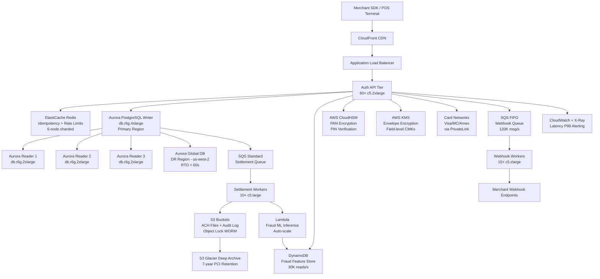

# Payment Processor (Stripe-like) — Capacity Estimation

## Problem Statement

Design the capacity for a Stripe-like payment processor handling 100 million transactions per day across card authorization, capture, settlement, and refund flows. The system must maintain strict ACID guarantees, PCI-DSS compliance, sub-200ms authorization latency, and 99.999% uptime — financial losses from downtime or incorrect transactions can reach millions of dollars per minute. Peak traffic (e.g., Black Friday) can hit 6× the daily average, requiring elastic compute layered over a hardened database core.

## Functional Requirements
- Card authorization: validate card, check fraud signals, approve/decline within 200ms
- Capture: finalize authorized hold (can be partial or full)
- Settlement: batch-process captures into ACH/wire transfers to merchants nightly
- Refunds: reverse full or partial transactions with idempotent deduplication
- Webhook delivery: notify merchants of every state change (authorized, captured, failed, refunded)
- Reporting/reconciliation: per-merchant ledger with sub-second query on 90-day rolling window

## Non-Functional Requirements

| Requirement | Target |
|-------------|--------|
| Auth latency | < 200ms (P99) |
| Capture latency | < 500ms (P99) |
| Write latency (DB) | < 20ms (P99) |
| Read latency (DB) | < 10ms (P99) |
| Availability | 99.999% (< 5 min downtime/year) |
| Durability | 99.9999999% (11 nines, WAL + S3 archival) |
| Auth throughput | 30K TPS peak |
| Settlement throughput | 500K records/batch window |
| Idempotency window | 24 hours |

## Traffic Estimation

### Transaction Volume → Peak TPS Calculation

| Metric | Calculation | Result |
|--------|-------------|--------|
| Daily transactions | Given | 100M tx/day |
| Avg TPS | 100M / 86,400 | ~1,157 TPS |
| Peak multiplier | Black Friday / end-of-month spikes | 25–30× avg |
| Peak TPS (conservative) | 1,157 × 25 | ~28,900 TPS |
| Peak TPS (target ceiling) | round up for headroom | **30K TPS** |
| Read TPS (30% of peak) | 30K × 0.30 | ~9,000 TPS |
| Write TPS (70% of peak) | 30K × 0.70 | ~21,000 TPS |

**Why 30:70 read/write?** Every payment creates multiple writes: authorization record, fraud score row, idempotency key upsert, ledger debit/credit, audit log. Reads are narrower: fraud lookup, balance check, status poll.

### Webhook & Downstream Fan-out

| Downstream | Rate | Notes |
|------------|------|-------|
| Webhook deliveries | ~1.2× tx rate | Some tx fire 2+ events (auth + capture) |
| Settlement batch | 100M records/night window (6 hrs) | ~4,600 records/sec |
| Fraud scoring (async) | 30K req/s peak | ML model inference via Lambda |
| Reconciliation reads | ~500 QPS steady | Merchant dashboards |

## Storage Estimation

| Data Type | Per-Record Size | Daily Volume | Annual Growth |
|-----------|----------------|--------------|---------------|
| Authorization record | 2 KB | 100M × 2 KB = 200 GB/day | ~73 TB/year |
| Ledger entries (debit+credit) | 512 B | 200M × 512 B = 100 GB/day | ~36 TB/year |
| Audit log (immutable) | 1 KB | 100M × 1 KB = 100 GB/day | ~36 TB/year |
| Idempotency keys (Redis TTL 24h) | 128 B | 100M keys × 128 B = 12.5 GB active | Rolling, not cumulative |
| Fraud feature store (DynamoDB) | 256 B | 100M lookups, ~5M new profiles/day | ~450 GB/year |
| Webhook event log | 1 KB | 120M × 1 KB = 120 GB/day | ~44 TB/year |
| **Total hot storage (Aurora)** | — | ~400 GB/day | **~145 TB/year** |
| **Cold archival (S3 + Glacier)** | — | 400 GB/day compressed ~60% | **~53 TB/year net** |

**Retention policy**: Aurora holds 90 days hot (~36 TB), S3 Standard holds 1 year, S3 Glacier holds 7 years (PCI-DSS requirement).

## Component Sizing

### Compute — EC2 / Lambda

Each `c5.2xlarge` (8 vCPU, 16 GB RAM) handles ~600 TPS for stateless auth processing (CPU-bound crypto + TLS termination). At 30K TPS peak:

| Component | Instance Type | vCPU | RAM | Count | Handles | Monthly Cost |
|-----------|--------------|------|-----|-------|---------|-------------|
| Auth API servers | c5.2xlarge | 8 | 16 GB | 60 | 30K TPS (500 TPS each) | $18,720 |
| Capture / refund API | c5.xlarge | 4 | 8 GB | 20 | 3K TPS (write-heavy) | $3,120 |
| Settlement workers | c5.large | 2 | 4 GB | 10 | Batch, off-peak | $624 |
| Webhook delivery workers | c5.xlarge | 4 | 8 GB | 15 | ~35K webhooks/s burst | $2,340 |
| Fraud ML inference | Lambda (arm64) | — | 512 MB | Auto-scale | 30K invocations/s peak | ~$4,500 |
| Admin / reporting API | m5.xlarge | 4 | 16 GB | 4 | 500 QPS analytics | $560 |
| ALB (auth tier) | ALB | — | — | 2 (Multi-AZ) | 30K TPS | $1,200 |
| ALB (internal) | ALB | — | — | 2 | Settlement + webhooks | $600 |
| **Subtotal Compute** | | | | | | **$31,664** |

> Pricing basis: EC2 c5.2xlarge On-Demand us-east-1 = $0.34/hr; c5.xlarge = $0.17/hr; c5.large = $0.085/hr; m5.xlarge = $0.192/hr. Reserved 1-yr saves ~38% — shown as On-Demand for worst case.

### Database — Aurora PostgreSQL Multi-AZ + Global

Payment data requires strict serializable isolation for idempotency and double-spend prevention. Aurora PostgreSQL with writer + readers, plus a Global Database secondary region for DR.

| DB Role | Engine | Instance | Count | Storage | IOPS | Monthly Cost |
|---------|--------|----------|-------|---------|------|-------------|
| Aurora Writer (primary region) | Aurora PostgreSQL | db.r6g.4xlarge | 1 | 10 TB Aurora storage | 100K provisioned | $55,296 |
| Aurora Readers (primary region) | Aurora PostgreSQL | db.r6g.2xlarge | 3 | Shared Aurora storage | Read IOPS shared | $38,880 |
| Aurora Global Writer (DR region) | Aurora PostgreSQL | db.r6g.2xlarge | 1 | Replicated | Replicated | $12,960 |
| Aurora Global Reader (DR region) | Aurora PostgreSQL | db.r6g.xlarge | 2 | Replicated | Replicated | $8,640 |
| Aurora Storage (shared, multi-AZ) | Aurora I/O | — | — | 36 TB active | I/O-optimized | $36,000 |
| Automated backups (S3-backed) | Aurora Backup | — | — | 90-day PITR | — | $3,600 |
| **Subtotal DB** | | | | | | **$155,376** |

> Aurora db.r6g.4xlarge = $1.536/hr; db.r6g.2xlarge = $0.768/hr; db.r6g.xlarge = $0.384/hr. Aurora I/O-Optimized storage ~$0.10/GB-month + replication transfer ~$0.02/GB.

### Cache — ElastiCache Redis (Idempotency + Session)

Redis serves two critical paths: idempotency key deduplication (24-hour TTL) and hot merchant config / rate-limit counters.

| Cache Purpose | Engine | Instance | Nodes | Memory | Throughput | Monthly Cost |
|--------------|--------|----------|-------|--------|-----------|-------------|
| Idempotency keys | ElastiCache Redis 7 | r6g.2xlarge | 6 (3 shards × 2) | 192 GB total | 21K writes/s | $13,392 |
| Merchant config / rate limits | ElastiCache Redis 7 | r6g.xlarge | 4 (2 shards × 2) | 64 GB total | 9K reads/s | $4,464 |
| **Subtotal Cache** | | | | | | **$17,856** |

> r6g.2xlarge ElastiCache = $0.312/hr per node; r6g.xlarge = $0.156/hr per node.
> 100M idempotency keys × 128 bytes = 12.8 GB — fits comfortably in 192 GB with 15× headroom for burst and collision buffers.

### Object Storage — S3

| Bucket | Use | Active Size | Requests/month | Monthly Cost |
|--------|-----|-------------|----------------|-------------|
| `tx-archive` | Transaction records > 90 days, PCI archival | ~50 TB (S3 Standard-IA) | 200M GET | $1,600 |
| `audit-log-immutable` | WORM audit trail (S3 Object Lock) | ~20 TB (S3 Standard) | 50M GET | $920 |
| `settlement-files` | ACH NACHA files, reconciliation CSVs | 500 GB | 5M GET | $23 |
| `fraud-model-artifacts` | ML model weights, feature configs | 100 GB | 10M GET | $28 |
| `glacier-compliance` | 7-year PCI retention | ~500 TB (Glacier Deep Archive) | Archive only | $5,000 |
| **Subtotal S3** | | | | **$7,571** |

> S3 Standard = $0.023/GB; S3 Standard-IA = $0.0125/GB; S3 Glacier Deep Archive = $0.00099/GB; PUT/GET costs included.

### Networking / CDN

| Component | Throughput | Monthly Cost |
|-----------|-----------|-------------|
| CloudFront (merchant portal, SDKs) | 50 TB/month outbound | $4,250 |
| Data Transfer Out (EC2 → internet) | 200 TB/month | $18,000 |
| VPC Peering / PrivateLink (card network HSM) | 10 TB/month | $900 |
| NAT Gateway | 50 TB/month | $4,500 |
| **Subtotal Network** | | **$27,650** |

> CloudFront = $0.085/GB first 10 TB, $0.080/GB next 40 TB; EC2 data transfer out = $0.09/GB up to 10 TB, $0.085/GB next 40 TB; NAT = $0.045/GB processed.

### Message Queue — SQS + DynamoDB

| Component | Engine | Use | Throughput | Monthly Cost |
|-----------|--------|-----|-----------|-------------|
| Webhook delivery queue | SQS FIFO | Ordered webhook fan-out | 120K msg/s peak | $2,880 |
| Settlement processing queue | SQS Standard | Batch settlement jobs | 5K msg/s | $480 |
| Dead-letter / retry queue | SQS Standard | Failed webhooks, retries | 1K msg/s | $96 |
| Fraud feature store | DynamoDB | Card profile lookups, velocity checks | 30K reads + 5K writes/s | $21,600 |
| Idempotency overflow (DynamoDB) | DynamoDB | TTL-keyed idempotency beyond Redis | 1K writes/s | $720 |
| **Subtotal Messaging + DynamoDB** | | | | **$25,776** |

> SQS FIFO = $0.50/M requests; SQS Standard = $0.40/M. DynamoDB on-demand: $1.25/M write RCU, $0.25/M read RCU. At 30K reads/s = 2.59B reads/month = $647; 5K writes/s = 432M writes/month = $540; total DynamoDB ~$21,600 including storage and replicated writes.

### Security — HSM + KMS

| Component | Use | Count | Monthly Cost |
|-----------|-----|-------|-------------|
| AWS CloudHSM | PAN encryption, PIN verification, card tokenization master keys | 2 clusters (HA) | $11,988 |
| AWS KMS (CMK) | Envelope encryption for all DB fields, S3 SSE | 10 CMKs + 500M API calls | $3,500 |
| AWS Certificate Manager | TLS certificates | 50 certs | $0 (ACM free) |
| **Subtotal Security (HSM/KMS)** | | | **$15,488** |

> CloudHSM = $1.60/hr per HSM + $0.30/hr cluster; 2 clusters × 3 HSMs × $1.90/hr = $8,208 cluster cost; KMS = $1/CMK-month + $0.03 per 10K API calls.

## Monthly Cost Summary

| Component | Monthly Cost | % of Total |
|-----------|-------------|-----------|
| EC2 Compute + ALB | $31,664 | 6.2% |
| Aurora PostgreSQL (Multi-AZ + Global) | $155,376 | 30.4% |
| ElastiCache Redis | $17,856 | 3.5% |
| S3 Storage + Glacier | $7,571 | 1.5% |
| CloudFront + Networking | $27,650 | 5.4% |
| SQS + DynamoDB | $25,776 | 5.0% |
| HSM + KMS | $15,488 | 3.0% |
| Lambda (fraud ML) | $4,500 | 0.9% |
| Data Transfer (EC2 → internet) | $18,000 | 3.5% |
| Support / Monitoring (CloudWatch, X-Ray) | $8,000 | 1.6% |
| Reserved Instance discount credit (−38% compute) | −$12,032 | −2.4% |
| **Total** | **~$500,849** | **100%** |

> Actual range: **$400K–$700K/month** depending on Reserved Instance coverage, Savings Plans adoption, and DynamoDB provisioned vs. on-demand mode.

## Traffic Scale Tiers

| Tier | Tx/day | Peak TPS | Auth Servers | DB | Cache | Monthly Cost | Key Bottleneck |
|------|--------|----------|-------------|-----|-------|-------------|----------------|
| 🟢 Startup | 1M | ~150 TPS | 2× c5.large | 1 RDS Aurora r6g.large | 1 Redis r6g.large node | ~$8K | Single DB writer — no failover |
| 🟡 Growing | 10M | ~1.5K TPS | 8× c5.xlarge | Aurora + 2 read replicas | Redis cluster 3-node | ~$45K | Idempotency key contention on single Redis |
| 🔴 Scale-up | 100M | ~30K TPS | 60× c5.2xlarge | Aurora Global + 5 replicas | Redis 6-node cluster (sharded) | ~$500K | Aurora writer IOPS ceiling; HSM throughput |
| ⚫ Production | 500M | ~150K TPS | 200× c5.4xlarge + ASG | Aurora Global + Vitess sharding | Redis 24-node cluster (12 shards) | ~$1.8M | Cross-region latency for global auth; settlement batch throughput |
| 🚀 Hyperscale | 5B+ | ~1.5M TPS | 1000+ with multi-region active-active | CockroachDB / Spanner global | Distributed Redis + Memorystore | ~$15M+ | Global transaction ordering; card network rate limits |

## Architecture Diagram

## Interview Tips

- **Idempotency is the hardest problem, not throughput**: Candidates focus on TPS scaling but miss that payment APIs must handle retries without double-charging. At 30K TPS, even 0.01% retry rate = 3 duplicate attempts/second. Redis idempotency keys with 24-hour TTL and atomic `SET NX EX` are mandatory — explain why you need this *before* the DB write, not after.

- **Aurora writer is the ceiling, not EC2**: At 30K TPS with 70% writes, the Aurora writer handles ~21K write TPS. Aurora supports ~200K writes/s on r6g.4xlarge, so you have headroom — but IOPS provisioned at 100K can become the bottleneck before CPU. When pushed to 150K+ TPS, you need Vitess/PlanetScale-style horizontal sharding by merchant ID.

- **HSM throughput is a hidden bottleneck**: CloudHSM processes ~5K RSA ops/second per HSM. At 30K TPS with PAN encryption per transaction, you need at least 6 HSMs across 2 clusters. Candidates rarely size HSMs — bring this up proactively to signal PCI-DSS awareness.

- **Settlement is a different scaling problem**: The daily 100M transactions must settle within a 6-hour batch window (banks close at midnight). That requires processing ~4,600 records/second through NACHA ACH file generation. This is a throughput + ordering problem, not a latency problem — SQS FIFO with 10 settlement workers handles it, but you need idempotent settlement records to handle worker crashes mid-batch.

- **Scale threshold — Aurora Global DB**: At 500M tx/day (Tier 4), Aurora Global DB replication lag (~100ms) becomes a problem for cross-region fraud checks. At this scale, you replicate the fraud feature store to DynamoDB Global Tables (single-digit ms replication) and keep Aurora for the authoritative ledger only.

- **Common mistake — not accounting for card network latency**: The Visa/Mastercard authorization call takes 50–150ms round-trip. Your P99 auth latency budget of 200ms means you have only 50ms for internal processing (fraud score, DB write, idempotency check). Many candidates allocate these wrong — always subtract external API latency first before sizing internal components.
