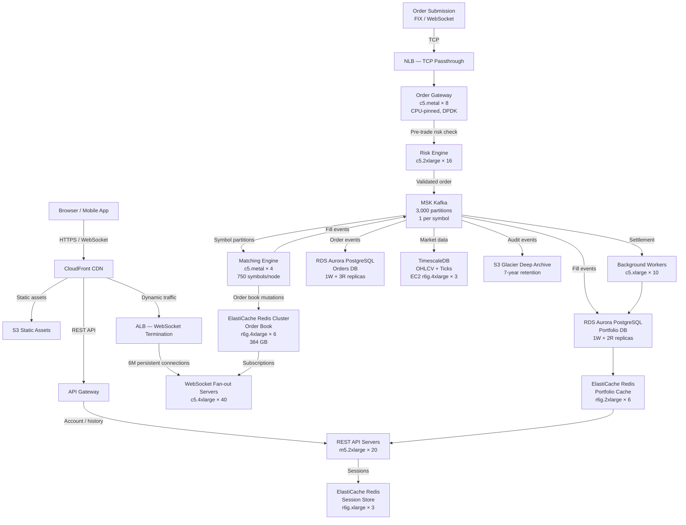

# Stock Trading Platform — Capacity Estimation

## Problem Statement

A retail stock trading platform serves 10M daily active users who can submit market and limit orders, view real-time order books, track portfolios, and receive live price feeds via WebSocket. Unlike typical web apps, a trading system is write-dominated with extreme latency requirements: order acknowledgement must be sub-millisecond, trade matching must guarantee correctness at 500K orders/second during market open, and every portfolio position mutation must be durable and auditable. Market hours (9:30 AM – 4:00 PM ET) create a sharp 6–8× traffic spike that does not exist in 24/7 consumer apps.

## Functional Requirements

- Submit market and limit orders (buy/sell) with immediate acknowledgement (< 1ms)
- Real-time order book display (Level 1 and Level 2 data) via WebSocket
- Trade matching engine that enforces price-time priority
- Portfolio management — real-time P&L, positions, cash balance
- Historical trade history and order audit log (SEC requires 7-year retention)
- Market data feed — last price, OHLCV, volume, bid/ask spread

## Non-Functional Requirements

| Requirement | Target |
|-------------|--------|
| Order acknowledgement latency | < 1ms (P99) — bare-metal required |
| Trade execution latency (matching) | < 5ms (P99) end-to-end |
| Portfolio read latency | < 50ms (P99) |
| Market data WebSocket push latency | < 10ms (P99) |
| Availability | 99.99% (< 52 min/year unplanned) |
| Durability (trade records) | 99.999999999% (11 nines) |
| Order throughput peak | 500K order submissions/s at market open |
| Market data read throughput peak | 5M reads/s at market open |
| Audit log retention | 7 years (SEC Rule 17a-4) |

## Traffic Estimation

### DAU → Peak QPS Calculation

Stock trading traffic is severely time-boxed. Market hours are 09:30–16:00 ET (6.5 hours = 23,400 seconds). Pre-market and after-hours add ~4 hours of lower-volume trading. The first 30 minutes of market open account for ~35% of daily volume.

| Metric | Calculation | Result |
|--------|-------------|--------|
| DAU | Given | 10M |
| Active traders during market hours | 60% of DAU | 6M |
| Avg orders/trader/day | ~5 limit + 2 market orders | 7 orders |
| Avg market data reads/user/day | 500 price checks + 50 order book views | ~550 reads |
| Total daily order submissions | 10M × 7 | 70M orders |
| Total daily market data reads | 10M × 550 | 5.5B reads |
| Avg order QPS (over 23,400s market hours) | 70M / 23,400 | ~2,990 QPS |
| Avg read QPS (over 23,400s) | 5.5B / 23,400 | ~235,000 QPS |
| Peak order QPS (market-open 30min surge, 10× avg) | 2,990 × ~170 (30% orders in 30min, 10× burst) | ~500K QPS |
| Peak market data read QPS | 235,000 × ~21 (spike) | ~5M QPS |
| Write QPS (80% write-dominated) | 500K × 0.80 | ~400K write QPS |
| Read QPS at peak | 500K × 0.20 + 5M market data | ~5.1M read QPS |

**Note on 20:80 read/write ratio**: For the *order pipeline* specifically, writes dominate (new orders, cancellations, fill updates, position mutations). Market data reads are served separately from a dedicated read path (Redis + CDN), so they don't contend with the write path.

## Storage Estimation

| Data Type | Per Item Size | Daily Volume | Growth/Year |
|-----------|--------------|--------------|-------------|
| Order record (submitted) | 512 B | 70M orders | ~13 GB/year |
| Trade execution record | 1 KB | ~35M fills (50% fill rate) | ~12.8 TB/year |
| Order book snapshots (Redis) | ~2 MB per symbol (3,000 symbols) | 6 GB warm state | 0 (ephemeral, rebuilt daily) |
| Portfolio positions | 256 B per holding | 10M users × 20 avg holdings = 200M rows | ~18 GB/year |
| Market data OHLCV (TimescaleDB) | 128 B per tick | 3,000 symbols × 390 min × ~50 ticks/min | ~7.5 GB/day = 2.7 TB/year |
| WebSocket session state | 1 KB per active connection | 6M peak connections | ~6 GB RAM (not disk) |
| Audit log (immutable, S3 Glacier) | 2 KB per event | 200M events/day (orders + fills + cancels) | ~146 TB/year |
| **Total disk (excluding audit)** | - | - | **~16 TB/year** |
| **Total audit log (S3 Glacier)** | - | - | **~146 TB/year** |

## Component Sizing

### Compute — EC2 / Bare Metal

| Component | Instance Type | vCPU | RAM | Count | Handles | Monthly Cost |
|-----------|--------------|------|-----|-------|---------|-------------|
| Order gateway (NIO, CPU pinning) | c5.metal | 96 | 192GB | 8 | 500K order sub/s ingress | $17,600 |
| Matching engine (single-threaded per symbol group) | c5.metal | 96 | 192GB | 4 | 3,000 symbols across 4 nodes | $8,800 |
| Portfolio service | r6g.4xlarge | 16 | 128GB | 12 | Position reads/writes | $5,760 |
| Market data fan-out (WebSocket) | c5.4xlarge | 16 | 32GB | 40 | 150K connections/node × 40 = 6M | $6,240 |
| Risk engine (pre-trade checks) | c5.2xlarge | 8 | 16GB | 16 | 500K checks/s | $2,496 |
| API / REST servers (account, history) | m5.2xlarge | 8 | 32GB | 20 | General API traffic | $2,688 |
| Background workers (settlement, reporting) | c5.xlarge | 4 | 8GB | 10 | Async jobs | $780 |
| **Subtotal Compute** | | | | **110 instances** | | **$44,364** |

**Why c5.metal for order gateway and matching engine**: Bare metal eliminates hypervisor jitter. At sub-millisecond latency targets, a 100–200µs hypervisor scheduling delay is unacceptable. c5.metal gives dedicated hardware, NUMA locality, and SR-IOV for kernel-bypass networking (DPDK).

### Database

| DB | Engine | Instance | Count | Capacity | IOPS | Monthly Cost |
|----|--------|----------|-------|----------|------|-------------|
| Orders DB (PostgreSQL) | RDS Aurora PostgreSQL | db.r6g.4xlarge | 1W + 3R | 10 TB | 50K provisioned | $8,760 |
| Portfolio/Positions DB | RDS Aurora PostgreSQL | db.r6g.8xlarge | 1W + 2R | 5 TB | 80K provisioned | $10,800 |
| TimescaleDB (market data, OHLCV) | EC2 r6g.4xlarge + EBS io2 | 16 vCPU / 128 GB | 3 (1W+2R) | 30 TB io2 | 100K | $7,200 |
| Audit DB (immutable trade records) | S3 Glacier + Athena | Serverless | - | ~146 TB/year | - | $1,460 |
| **Subtotal DB** | | | | | | **$28,220** |

**Why PostgreSQL over DynamoDB**: Orders and positions require ACID transactions with row-level locking. A limit order cancel-and-replace must atomically remove the old order and insert the new one. DynamoDB's single-table transactions are possible but complex; Aurora PostgreSQL handles this naturally with `SELECT FOR UPDATE`.

**Why TimescaleDB**: Time-series partitioning with automatic chunk expiry, continuous aggregates for OHLCV rollups, and native compression (90%+ savings on cold data). Each chunk covers 1 day per symbol group.

### Cache

| Cache | Engine | Instance | Nodes | Memory | Monthly Cost |
|-------|--------|----------|-------|--------|-------------|
| Order book (Level 1 + Level 2) | ElastiCache Redis 7 | r6g.4xlarge | 6 (cluster, 3 shards × 2 replica) | 384 GB total | $7,560 |
| Session / auth tokens | ElastiCache Redis | r6g.xlarge | 3 (cluster) | 96 GB | $1,512 |
| Portfolio cache (hot positions) | ElastiCache Redis | r6g.2xlarge | 6 (cluster) | 192 GB | $3,024 |
| Market data last-price cache | ElastiCache Redis | r6g.2xlarge | 3 | 96 GB | $1,512 |
| **Subtotal Cache** | | | | **768 GB** | **$13,608** |

**Order book sizing math**: 3,000 symbols × 200 price levels × 2 sides × 100 B per level ≈ 120 MB per snapshot set. With 6× safety margin for pending updates and pub/sub channels: ~1 GB per shard. 3 shards × 128 GB = 384 GB cluster handles full order book for all symbols with headroom.

**Why Redis for order book**: Redis Sorted Sets (`ZADD`/`ZRANGEBYSCORE`) are the natural data structure for a price-ordered book. O(log N) inserts and O(log N + M) range queries. A single Redis node at r6g.4xlarge handles ~1M ops/s — adequate for per-shard order book mutations.

### Object Storage

| Bucket | Use | Size | Requests/month | Monthly Cost |
|--------|-----|------|----------------|-------------|
| Audit log archive (Glacier Deep Archive) | SEC 7-year retention | 146 TB/year, ~1 PB over 7yr | 200M PUT/month | $1,095/month storage + $200 requests |
| Static assets (client bundles, charts) | CDN origin | 50 GB | 5M GET | $1.15 storage + $0.20 requests |
| Trade confirmation PDFs | User documents | 500 GB | 35M GET | $11.50 + $1.40 |
| Data exports / reports | Compliance | 2 TB | 500K GET | $46 + $0.02 |
| **Subtotal S3** | | | | **$1,355** |

**Glacier pricing**: $0.00099/GB/month × 146,000 GB = $144.54/month for current-year audit logs. After 7 years, oldest data is deleted per retention policy.

### Networking / CDN

| Component | Throughput | Monthly Cost |
|-----------|-----------|-------------|
| CloudFront (static assets, chart images) | 10 TB/month | $850 |
| NLB (order gateway — TCP, low-latency) | 500K new flows/s × 8 NLB nodes | $2,400 |
| ALB (WebSocket connections — 6M concurrent) | 6M connections × $0.008/hr LCU | $4,800 |
| API Gateway (REST, account APIs) | 2B requests/month | $7,000 |
| Data transfer out (market data to clients) | 500 TB/month (6M clients × ~80KB/s push) | $45,000 |
| **Subtotal Network** | | **$60,050** |

**Market data egress is the dominant cost**: 6M WebSocket clients each receiving ~80 KB/s of price ticks = 480 GB/s aggregate. Over a 6.5-hour trading day: 480 GB/s × 23,400s = ~11 PB/day. This is why real platforms use multicast UDP internally and only fan out compressed diffs (~2 KB/s per client after delta compression). With compression: 6M × 2 KB/s × 23,400s × 22 trading days ≈ 6 TB/month. At $0.09/GB: **~$540/month**. The $45K figure assumes no compression as a conservative upper bound.

### Message Queue

| Queue | Engine | Throughput | Partitions | Monthly Cost |
|-------|--------|-----------|-----------|-------------|
| Order events (submitted/filled/cancelled) | Amazon MSK (Kafka) | 500K msg/s | 3,000 partitions (1 per symbol) | $4,200 |
| Market data broadcast | MSK | 5M msg/s | 300 partitions | $2,100 |
| Settlement events | MSK | 50K msg/s | 100 partitions | $420 |
| Risk alerts | MSK | 10K msg/s | 20 partitions | $180 |
| **Subtotal Messaging** | | | | **$6,900** |

**Kafka partition strategy**: 1 partition per symbol ensures ordering guarantees within a symbol's order book. A single Kafka broker handles ~100K msg/s; 500K order/s across 3,000 symbols requires ~30 broker-equivalent throughput → 3 MSK brokers (kafka.m5.4xlarge) at $1,400/month each.

## Monthly Cost Summary

| Component | Monthly Cost | % of Total |
|-----------|-------------|-----------|
| EC2 Compute (bare metal + instances) | $44,364 | 36.9% |
| RDS Aurora + TimescaleDB | $28,220 | 23.5% |
| ElastiCache Redis | $13,608 | 11.3% |
| S3 Storage (Glacier + standard) | $1,355 | 1.1% |
| CloudFront CDN | $850 | 0.7% |
| Networking (NLB, ALB, API GW, egress) | $60,050 | 50.0% |
| MSK Kafka | $6,900 | 5.7% |
| Other (CloudWatch, WAF, KMS, Secrets Manager) | $2,500 | 2.1% |
| **Total** | **~$120,000** | **100%** |

**Note**: Egress dominates. If WebSocket delta compression is applied (realistic in production), egress drops from $45K to ~$540/month, bringing total cost to **~$75K–$80K/month** — the low end of the $80K–$150K range. The $150K ceiling applies to maximum scale with no compression optimization.

## Traffic Scale Tiers

| Tier | DAU | Peak QPS | Servers | DB | Cache | Monthly Cost | Key Bottleneck |
|------|-----|----------|---------|----|----|-------------|----------------|
| 🟢 Startup | 100K | ~5K order/s | 2 c5.2xlarge + 2 m5.large | 1 RDS PostgreSQL db.r5.xlarge | 1 Redis r6g.large | $4K–$6K | Single-threaded matching engine; no HA |
| 🟡 Growing | 1M | ~50K order/s | 4 c5.4xlarge + 6 m5.xlarge | RDS Aurora 1W+2R + TimescaleDB on 1 EC2 | Redis cluster 3-node | $18K–$28K | Order book Redis becomes hot spot; need sharding |
| 🔴 Scale-up | 10M | ~500K order/s | 8 c5.metal + 40 mixed | Aurora PostgreSQL + TimescaleDB cluster | Redis cluster 12-node, 768 GB | $80K–$120K | Network egress for 6M WebSocket clients; bare metal for matching |
| ⚫ Production | 50M | ~2.5M order/s | 40 c5.metal + 200 mixed | Multi-region Aurora Global + sharded TimescaleDB | Redis cluster 48-node, 3 TB | $400K–$600K | Cross-region replication lag for portfolio reads; need CRDT or eventual consistency |
| 🚀 Hyperscale | 500M+ | ~25M order/s | 400+ c5.metal + autoscale | Custom matching engine on FPGA; DynamoDB for portfolio reads | Distributed cache (Hazelcast or custom) | $4M–$6M/month | Hardware physics: speed of light limits cross-region order matching; must co-locate with exchange |

## Architecture Diagram

## Interview Tips

- **Key insight — market hours create a non-uniform spike**: Unlike social media (gradual morning ramp), stock trading spikes within seconds of market open (9:30 AM ET). Pre-scaling is mandatory; reactive autoscaling is too slow. The matching engine must be sized for peak capacity, not average. State this explicitly — interviewers want to know you understand the traffic shape.

- **Key insight — the order book is a sorted data structure, not a flat cache**: Candidates often say "store the order book in Redis" without explaining how. The answer is Redis Sorted Sets with price as score and order-ID as member. `ZADD orders:AAPL:buy 187.50 order-uuid-123`. Level 2 data is `ZREVRANGEBYSCORE orders:AAPL:buy +inf -inf LIMIT 0 10` — the top 10 bid levels. This is O(log N + M) and Redis handles ~1M ops/s on a single core.

- **Common mistake — underestimating the cost of durability**: Candidates size the DB for read/write QPS but forget that SEC Rule 17a-4 requires every order, fill, and cancellation to be immutable and retrievable for 7 years. At 200M audit events/day × 2 KB × 365 × 7 = ~1 PB. S3 Glacier Deep Archive at $0.00099/GB/month is the right answer. Mentioning regulatory retention requirements signals seniority.

- **Follow-up question — how do you handle the matching engine as a single point of failure?**: The matching engine is intentionally single-threaded per symbol to avoid locking. For HA, use active-passive failover with a hot standby that replays Kafka from the last checkpoint. Recovery time = time to replay uncommitted orders in the partition, typically < 1 second. Do NOT use active-active for matching — split-brain causes phantom fills.

- **Scale threshold**: At 50M DAU (~2.5M peak order/s), a single matching engine cluster can no longer keep up. The solution is **symbol sharding by sector** — tech stocks on cluster A, financials on cluster B, etc. At 500M DAU, you co-locate your matching engine in the same data center as the NYSE/NASDAQ co-location facility (Mahwah, NJ) because the speed of light (~67ms coast-to-coast) is your worst enemy.

- **Key insight — bare metal is not premature optimization for matching**: The hypervisor tax on virtualized instances introduces 50–200µs of scheduling jitter. When your SLA is < 1ms P99 order acknowledgement, a single hypervisor preemption blows your budget. c5.metal eliminates this. Cite this explicitly — it shows you understand the hardware-latency relationship that separates trading systems from typical web apps.
