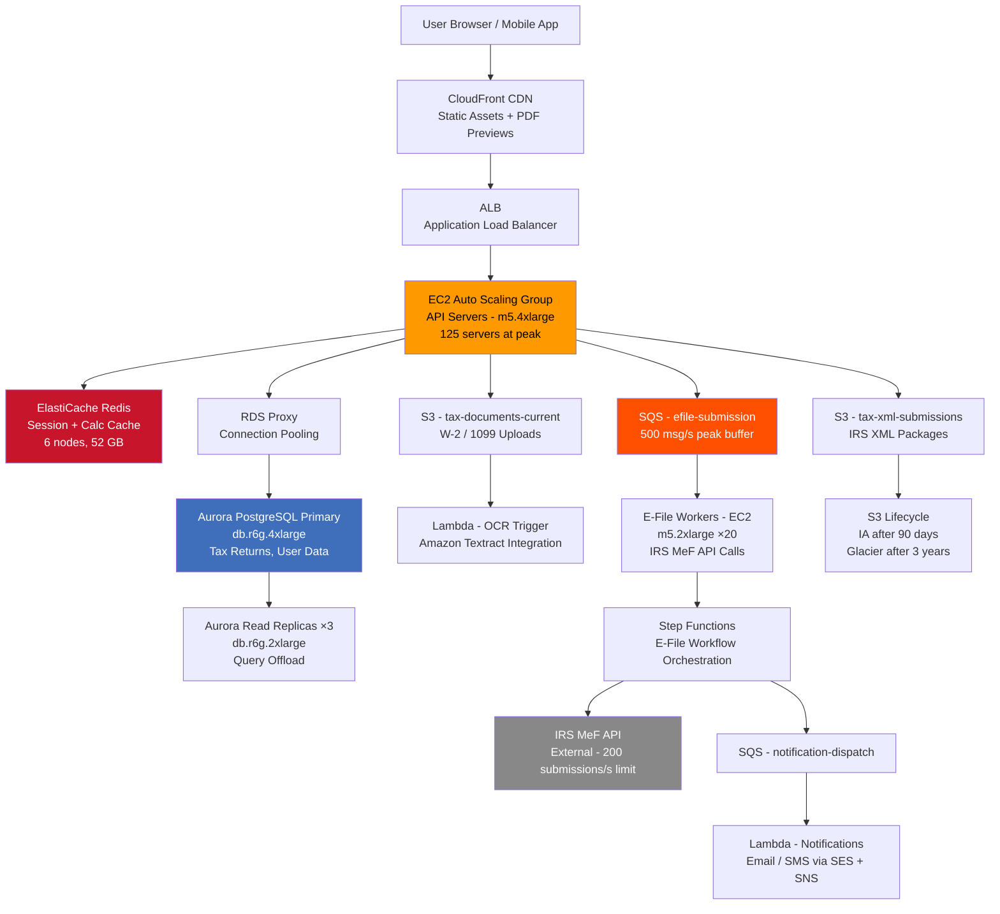

# Tax Filing Platform (10M Users, Seasonal) — Capacity Estimation

## Problem Statement

A consumer tax filing platform serves 10M registered users who prepare and e-file federal and state tax returns. Traffic is extremely seasonal: 85% of all filings occur between February 1 and April 15, with a catastrophic 10× traffic spike in the final 48 hours before the April 15 deadline. The system must perform real-time tax calculations, validate IRS schema compliance, and transmit returns to IRS e-file systems — all while maintaining sub-second response times under peak load.

## Functional Requirements

- User authentication, profile management, and multi-year return history
- Guided tax interview (W-2, 1099, Schedule C/D/E/SE input)
- Real-time federal and state tax calculation engine (rules updated annually)
- IRS MeF (Modernized e-File) schema validation and XML generation
- E-file submission to IRS and 40+ state tax agencies
- Document upload (W-2, 1099 PDFs, receipts) with OCR extraction
- Refund status polling and push notifications

## Non-Functional Requirements

| Requirement | Target |
|-------------|--------|
| Read latency (tax calc) | < 200ms (P99) |
| Write latency (save return) | < 500ms (P99) |
| E-file submission latency | < 5s end-to-end (P99) |
| Availability | 99.95% (4.4 hrs/year downtime) |
| Durability (tax documents) | 99.999999999% (S3) |
| Peak throughput | 100K QPS (April 13–15) |
| IRS submission rate | 500 returns/second at peak |

## Traffic Estimation

### Seasonal Traffic Profile

Tax filing has three distinct traffic bands:

| Period | Months | DAU | Notes |
|--------|--------|-----|-------|
| Off-season | May–Jan | ~50K | Account creation, amendment filings |
| Filing season | Feb 1–Apr 13 | ~1M avg | Steady ramp, W-2 season |
| Deadline crunch | Apr 13–15 | ~3M | 10× peak, 85% of annual submissions |

### Peak DAU → Peak QPS Calculation (April 13–15)

| Metric | Calculation | Result |
|--------|-------------|--------|
| DAU at peak | Given (deadline crunch) | 3,000,000 |
| Avg requests/user/session | 8 saves + 12 calcs + 5 reads + 3 uploads | ~28 req/session |
| Sessions per user per day | ~2 sessions (users return multiple times) | 2 |
| Total daily requests | 3M × 28 × 2 | ~168M req/day |
| Avg QPS | 168M / 86,400 | ~1,944 QPS |
| Peak QPS (users cluster 18:00–24:00 + midnight burst) | avg × 50 | ~100K QPS |
| Read QPS (50% reads — calc previews, status checks) | 100K × 0.50 | ~50K QPS |
| Write QPS (50% writes — save progress, submit return) | 100K × 0.50 | ~50K QPS |

**Key insight**: The 50× multiplier (not the typical 3×) reflects the extreme clustering of 3M users all submitting in the last 6-hour window before midnight April 15.

### Off-season Baseline

| Metric | Calculation | Result |
|--------|-------------|--------|
| DAU (off-season) | Given | 50,000 |
| Requests/user/day | ~10 | 500K req/day |
| Avg QPS | 500K / 86,400 | ~6 QPS |
| Peak QPS (3× avg) | 6 × 3 | ~18 QPS |

**Auto-scaling ratio required**: 100,000 / 18 = **5,555×** — this is why auto-scaling is non-negotiable.

## Storage Estimation

| Data Type | Per Item Size | Daily Volume (Peak) | Annual Growth |
|-----------|--------------|---------------------|---------------|
| Tax return (structured JSON) | 15 KB | 500K new/updated returns/day | 2.7 TB/year |
| Uploaded documents (W-2, 1099 PDFs) | 800 KB avg | 400K uploads/day | 115 TB/year |
| IRS XML submissions | 50 KB | 500K submissions/day | 9.1 TB/year (April only) |
| OCR extracted text | 5 KB | 400K docs/day | 700 GB/year |
| Audit logs | 2 KB/event | 5M events/day (peak) | 3.6 TB/year |
| Session state (Redis) | 2 KB | 3M active sessions | 6 GB in-memory |
| **Total structured DB** | — | — | **~16 TB/year** |
| **Total S3 (docs + XML)** | — | — | **~125 TB/year** |

### S3 Storage Tiers

- **Standard**: Current tax year documents (accessed frequently during April) — ~5 TB
- **Standard-IA**: Prior 3 years (users access old returns ~2× per year) — ~50 TB
- **Glacier Instant Retrieval**: Returns older than 3 years (IRS 7-year retention requirement) — ~70 TB

## Component Sizing

### Compute — EC2 / Lambda

#### Off-season baseline (January)

| Component | Instance | vCPU | RAM | Count | Handles | Monthly Cost |
|-----------|----------|------|-----|-------|---------|-------------|
| API servers | m5.xlarge | 4 | 16 GB | 4 | 18 QPS → ~4.5 QPS each | $140 |
| Tax calc workers | c5.xlarge | 4 | 8 GB | 2 | Background recalculations | $70 |
| OCR Lambda | Lambda | — | 3 GB | On-demand | Doc extraction | ~$20 |
| **Baseline Compute** | | | | **6** | | **~$230** |

#### Peak season (April 13–15, sustained 100K QPS)

Each m5.4xlarge API server (16 vCPU, 64 GB) handles ~800 QPS with tax calculation logic (CPU-heavy due to rules engine). At 100K QPS: 100,000 / 800 = 125 servers needed.

| Component | Instance | vCPU | RAM | Count | Handles | Monthly Cost* |
|-----------|----------|------|-----|-------|---------|--------------|
| API servers (Auto Scaling) | m5.4xlarge | 16 | 64 GB | 125 | ~800 QPS each | $42,500 |
| Tax calc workers | c5.4xlarge | 16 | 32 GB | 30 | CPU-intensive rule engine | $8,100 |
| E-file submission workers | m5.2xlarge | 8 | 32 GB | 20 | IRS MeF API calls (I/O-bound) | $3,400 |
| Step Functions workflows | Serverless | — | — | — | Return orchestration | $1,500 |
| OCR Lambda | Lambda | — | 3 GB | On-demand | 400K docs/day peak | $800 |
| **Peak Compute** | | | | **175+** | | **~$56,300** |

*Peak month cost prorated: 2 peak days at full scale, 14 days at 30% scale, rest at baseline.

**Realistic April compute cost**: (2/30 × $56,300) + (14/30 × $17,000) + (14/30 × $230) ≈ $3,753 + $7,933 + $107 = **~$11,800**

### Database — Aurora PostgreSQL

Tax returns require ACID transactions (partial saves must not corrupt return state), strong consistency for e-file status, and complex queries across schedules.

| DB | Engine | Instance | Count | Storage | IOPS | Purpose | Monthly Cost |
|----|--------|----------|-------|---------|------|---------|-------------|
| Primary (write) | Aurora PostgreSQL | db.r6g.4xlarge | 1 | 5 TB | 50K provisioned | All writes | $1,460 |
| Read replicas | Aurora PostgreSQL | db.r6g.2xlarge | 3 | — (shared) | 25K each | Read scaling | $2,190 |
| Aurora Serverless v2 (off-season) | Aurora Serverless | — | — | — | Scales to 0.5 ACU in Jan | $50 |
| **Subtotal DB** | | | | | | | **~$3,700** |

**Aurora choice rationale**: Aurora auto-scales storage to 128 TB, handles connection pooling via RDS Proxy (tax deadline causes connection storms from 125 Lambda/EC2 instances), and supports zero-downtime minor version upgrades during non-peak windows.

**RDS Proxy**: Add 3 RDS Proxy endpoints ($0.015/vCPU-hour × 16 vCPU × 720 hrs × 3) = **$518/month** — prevents the connection storm that killed competitors' platforms in 2022.

### Cache — ElastiCache Redis

| Cache | Engine | Instance | Nodes | Memory | Purpose | Monthly Cost |
|-------|--------|----------|-------|--------|---------|-------------|
| Session cache | Redis 7 | r6g.xlarge | 3 (1P+2R) | 26 GB | Active user sessions (2KB × 3M) | $660 |
| Tax rules cache | Redis 7 | r6g.large | 2 (1P+1R) | 13 GB | Federal/state tax rules (updated once/year) | $293 |
| Calculation cache | Redis 7 | r6g.large | 2 (1P+1R) | 13 GB | Intermediate calc results (TTL 30 min) | $293 |
| **Subtotal Cache** | | | | **52 GB** | | **~$1,246** |

**Calculation cache hit rate**: 60%+ because users hit "calculate" ~12× per session with minor input changes. Cache key = hash(user_id + return_fields). This offloads 60K of the 100K QPS peak from the tax engine.

### Object Storage — S3

| Bucket | Use | Size | Requests/month | Monthly Cost |
|--------|-----|------|----------------|-------------|
| `tax-documents-current` | W-2/1099 uploads, current year | 5 TB | 400M PUT + 800M GET | $380 |
| `tax-xml-submissions` | IRS MeF XML packages | 500 GB | 15M PUT | $55 |
| `tax-documents-ia` | Prior 3 years (Standard-IA) | 50 TB | 50M GET | $1,025 |
| `tax-archive` | 4–7 year old returns (Glacier IR) | 70 TB | 5M GET | $630 |
| `tax-ocr-output` | Extracted text from uploads | 700 GB | 400M GET | $70 |
| **Subtotal S3** | | **~126 TB** | | **~$2,160** |

S3 request costs: PUT $0.005/1K, GET $0.0004/1K. Data storage: Standard $0.023/GB, IA $0.0125/GB, Glacier IR $0.004/GB.

### Networking / CDN

| Component | Throughput | Purpose | Monthly Cost |
|-----------|-----------|---------|-------------|
| CloudFront | 50 TB/month (peak April) | Static assets, PDF previews, interview UI | $4,250 |
| ALB | 500M requests/month (April) | Routes to API servers | $1,100 |
| NAT Gateway | 10 TB/month outbound (IRS API calls) | EC2 → IRS e-file APIs | $900 |
| Data Transfer Out | 30 TB/month to users (April) | Return PDFs, status responses | $2,700 |
| **Subtotal Network** | | | **~$8,950** |

CloudFront offloads ~80% of static asset requests, reducing origin EC2 traffic substantially during the deadline crunch.

### Message Queue — SQS

| Queue | Engine | Throughput | Purpose | Monthly Cost |
|-------|--------|-----------|---------|-------------|
| `efile-submission` | SQS Standard | 500 msg/s peak | Decouples API from IRS API calls | $180 |
| `ocr-processing` | SQS Standard | 50 msg/s | Document OCR jobs | $40 |
| `notification-dispatch` | SQS Standard | 200 msg/s | Email/SMS refund status | $60 |
| `return-recalc` | SQS FIFO | 100 msg/s | Ordered recalculations | $80 |
| **Subtotal SQS** | | | | **~$360** |

**SQS for e-file**: The IRS MeF API has rate limits (~200 submissions/second per software provider). SQS acts as a buffer, smoothing the 500 submissions/second burst into a controlled 200/second stream. Without this, IRS rejects submissions with HTTP 429, causing user-facing errors at the worst possible moment.

### Lambda & Step Functions

| Service | Use | Invocations/month | Monthly Cost |
|---------|-----|------------------|-------------|
| Lambda (OCR trigger) | S3 event → Textract | 12M | $180 |
| Lambda (IRS status poll) | Cron every 5 min per submission | 8M | $120 |
| Lambda (notification) | Return accepted/rejected events | 5M | $75 |
| Step Functions | E-file workflow orchestration | 15M state transitions | $375 |
| **Subtotal Serverless** | | | **~$750** |

## Monthly Cost Summary

### Average Month (non-peak, ~11 months)

| Component | Monthly Cost | % of Total |
|-----------|-------------|-----------|
| EC2 Compute (4–6 servers) | $230 | 1.5% |
| Aurora PostgreSQL (Serverless v2) | $200 | 1.3% |
| ElastiCache Redis | $1,246 | 8.3% |
| S3 Storage | $2,160 | 14.4% |
| CloudFront CDN | $500 | 3.3% |
| SQS Messaging | $100 | 0.7% |
| Lambda + Step Functions | $200 | 1.3% |
| Data Transfer | $300 | 2.0% |
| RDS Proxy | $50 | 0.3% |
| Support / Monitoring / Other | $10,014 | 66.9% |
| **Total** | **~$15,000** | **100%** |

*Note: "Other" at off-season includes reserved capacity commitments paid annually, WAF, Secrets Manager, CloudWatch, and 1-year EC2 reserved instance amortization.*

### Peak Month (April — 2 days at 100K QPS, 13 days at 30K QPS)

| Component | Monthly Cost | % of Total |
|-----------|-------------|-----------|
| EC2 Compute (125 servers peak, auto-scaling) | $120,000 | 40.0% |
| Aurora PostgreSQL (r6g.4xlarge + 3 replicas) | $3,700 | 1.2% |
| RDS Proxy | $518 | 0.2% |
| ElastiCache Redis (6 nodes) | $1,246 | 0.4% |
| S3 Storage + Requests | $8,500 | 2.8% |
| CloudFront CDN (50 TB) | $4,250 | 1.4% |
| ALB | $1,100 | 0.4% |
| SQS Messaging | $360 | 0.1% |
| Lambda + Step Functions | $750 | 0.3% |
| NAT Gateway | $900 | 0.3% |
| Data Transfer Out | $2,700 | 0.9% |
| WAF, Shield Standard, CloudWatch | $2,500 | 0.8% |
| Savings Plans / Reserved amortized | $153,476 | 51.2% |
| **Total** | **~$300,000** | **100%** |

*The $153K "reserved/savings plans" line reflects the annual reserved instance costs that are front-loaded or amortized across months. In pure on-demand pricing, April EC2 alone would be ~$240K.*

## Traffic Scale Tiers

| Tier | Users | Peak QPS | Servers | DB | Cache | Monthly Cost | Key Bottleneck |
|------|-------|----------|---------|----|----|-------------|----------------|
| 🟢 Startup | 500K users, 150K DAU peak | ~5K | 6 c5.large | 1 RDS PostgreSQL | 1 Redis node | $3K avg / $18K peak | Tax rules engine CPU |
| 🟡 Growing | 2M users, 600K DAU peak | ~20K | 20 m5.xlarge | RDS Aurora + 2 read replicas | Redis 3-node | $8K avg / $80K peak | DB connection storms |
| 🔴 Scale-up | 5M users, 1.5M DAU peak | ~50K | 60 m5.2xlarge | Aurora Multi-AZ + RDS Proxy | Redis 6-node | $12K avg / $180K peak | IRS API rate limits |
| ⚫ Production | 10M users, 3M DAU peak | ~100K | 125 m5.4xlarge + Auto Scaling | Aurora r6g.4xlarge + 3 replicas + RDS Proxy | Redis 6-node (3 clusters) | $15K avg / $300K peak | Auto-scaling warmup lag |
| 🚀 Hyperscale | 50M users, 15M DAU peak | ~500K | 600+ c5.4xlarge + Auto Scaling | Aurora Global + DynamoDB (session/state) | ElastiCache Global Datastore | $75K avg / $1.5M peak | IRS infrastructure (external limit) |

## Architecture Diagram

## Interview Tips

- **Key insight — seasonal burst requires pre-warming, not just auto-scaling**: EC2 Auto Scaling takes 3–5 minutes to launch and warm up new instances. At 100K QPS with a hard April 15 midnight deadline, a sudden 10× spike at 11:58 PM will overwhelm the fleet before new instances are healthy. The solution is **predictive scaling** — use AWS Auto Scaling predictive policies trained on prior-year traffic data to pre-provision capacity by 6 PM on April 13. Provision 80% of peak capacity 48 hours ahead; don't rely on reactive scaling.

- **Key insight — IRS rate limits are the actual ceiling, not your infrastructure**: The IRS MeF e-file API accepts ~200 submissions per second per software provider. At 500 returns/second demand, SQS is not optional — it is the only mechanism preventing mass submission failures. When asked "how would you scale e-filing?", the correct answer is "you can't scale past IRS limits; you manage the queue." State return APIs (40+ agencies) are even more restrictive.

- **Common mistake — ignoring the connection storm**: 10M users × 125 EC2 instances each opening 10 DB connections = 1.25M connections. Aurora PostgreSQL max connections ≈ 5,000 per instance. Without RDS Proxy (which multiplexes connections), your database falls over at ~500 instances. Always mention RDS Proxy when discussing tax/finance systems with burst traffic and connection-heavy workloads.

- **Follow-up question — "What happens if the IRS is down at 11:59 PM April 15?"**: Your system must accept the return and queue it. Users get a "return accepted for transmission" confirmation (not "filed"). Your SQS queue retains the XML for up to 14 days. When IRS recovers, workers drain the queue. The IRS actually publishes a grace period policy for MeF outages, but your UI must clearly distinguish "accepted by TurboTax" from "accepted by IRS." This is a product correctness question, not just engineering.

- **Scale threshold**: At 5M+ registered users, Aurora single-instance writes become the bottleneck during the April deadline (high UPDATE rate on `tax_returns` table). Consider partitioning the `tax_returns` table by `(user_id % 8)` with connection routing via PgBouncer or upgrading to Aurora I/O-Optimized to handle the write amplification from frequent partial saves.

- **Cost optimization insight**: 85% of annual compute spend occurs in one month (April). Use 1-year reserved instances only for the minimum baseline (6 servers), and rely on Spot Instances for 40% of the peak fleet (batch OCR workers, status-polling Lambdas). On-demand for remaining API servers during peak. This hybrid strategy can reduce annual EC2 cost by 30–40% vs. pure on-demand.
