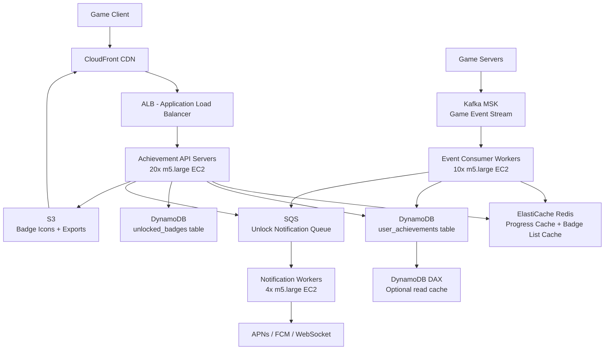

# Achievement System (50M DAU) — Capacity Estimation

## Problem Statement

Design the backend for a game achievement system serving 50 million daily active users. The system must track per-user progress toward hundreds of achievement criteria (e.g., "kill 100 enemies", "win 10 matches"), unlock badges when thresholds are crossed, and deliver real-time unlock notifications with sub-100ms latency. Badge images and metadata must be globally cached, and the event pipeline must survive game server spikes during primetime.

## Functional Requirements

- Track incremental progress for each user across 200+ achievement definitions
- Atomically unlock an achievement when all criteria are satisfied
- Persist badge metadata (name, icon URL, unlock timestamp) per user
- Push real-time unlock notifications to the client (WebSocket or push notification)
- Expose a read API returning a user's full achievement list with progress percentages
- Support batch import of historical progress for new achievement types

## Non-Functional Requirements

| Requirement | Target |
|-------------|--------|
| Achievement check latency | < 50 ms (P99) |
| Write (progress update) latency | < 100 ms (P99) |
| Availability | 99.99% |
| Durability | 99.999% (no lost unlocks) |
| Peak read throughput | 500K QPS |
| Peak write throughput | 100K QPS |
| Unlock notification delivery | < 500 ms end-to-end |

## Traffic Estimation

### DAU → Peak QPS Calculation

| Metric | Calculation | Result |
|--------|-------------|--------|
| DAU | Given | 50,000,000 |
| Avg game events/user/day | ~30 events that trigger achievement checks | ~30 |
| Avg achievement reads/user/day | profile load + 4 in-session reads | ~5 |
| Total daily write events | 50M × 30 | 1.5B |
| Total daily read requests | 50M × 5 | 250M |
| Total daily requests | 1.5B + 250M | ~1.75B |
| Avg write QPS | 1.5B / 86,400 | ~17,400 |
| Avg read QPS | 250M / 86,400 | ~2,900 |
| Peak multiplier | 3× (primetime spike) | — |
| Peak write QPS | 17,400 × 3 ≈ rounded up | ~100K |
| Peak read QPS (70% of peak total) | (100K + ~50K peak reads) × 70% | ~500K check ops |

> **Note**: "Achievement unlock checks" count both the Redis cache hit path (no DB write) and actual DynamoDB writes. The 500K/s figure is total check operations across cache and DB; confirmed writes are ~100K/s because most checks return "not yet unlocked."

## Storage Estimation

| Data Type | Per-Item Size | Daily Volume | Growth/Year |
|-----------|--------------|--------------|-------------|
| User progress counters (DynamoDB) | 500 B per (user, achievement) pair; 50M users × 200 achievements = 10B rows | 10B rows × 500 B = 5 TB baseline; new rows ~0 after warm-up | +10 GB/year (new achievements) |
| Unlocked badge records (DynamoDB) | 200 B per unlock event | ~5M unlocks/day × 200 B | ~365 GB/year |
| Kafka event log (7-day retention) | 300 B per game event | 1.5B events/day × 300 B × 7 days | ~3 TB retained |
| Badge icons / images (S3) | ~50 KB per badge, 200 badges | 10 MB total (static, rarely changes) | < 1 GB/year |
| Notification payloads (SQS) | ~500 B per message | ~5M unlocks/day | ~2.5 GB/day (transient) |
| **Total persistent storage** | — | — | **~5 TB base + 375 GB/year** |

## Component Sizing

### Compute — EC2

| Component | Instance Type | vCPU | RAM | Count | Handles | Monthly Cost |
|-----------|--------------|------|-----|-------|---------|-------------|
| Achievement API servers | m5.large | 2 | 8 GB | 20 | ~25K QPS per server × 20 = 500K read QPS | $700 |
| Event consumer workers (Kafka) | m5.large | 2 | 8 GB | 10 | ~10K writes/s per worker × 10 = 100K/s | $350 |
| Notification dispatch workers | m5.large | 2 | 8 GB | 4 | ~5M unlocks/day = ~58/s, bursty | $140 |
| **Subtotal Compute** | | | | **34** | | **$1,190** |

> Sizing basis: m5.large on-demand = ~$0.096/hr = ~$70/month. A single Go or Node.js process on m5.large can sustain ~10–25K non-blocking HTTP QPS with Redis-backed caching. Auto-scaling group target CPU 60%.

### Database — DynamoDB

| Table | Partition Key | Sort Key | Capacity Mode | Estimated RCU/WCU | Monthly Cost |
|-------|--------------|----------|---------------|-------------------|-------------|
| `user_achievements` (progress) | `userId` | `achievementId` | On-demand | Peak 100K WCU, 50K RCU | ~$6,500 |
| `unlocked_badges` | `userId` | `unlockedAt` | On-demand | Peak 5K WCU, 20K RCU | ~$1,200 |
| **Subtotal DynamoDB** | | | | | **~$7,700** |

> DynamoDB on-demand pricing (us-east-1 2024): Write request unit = $1.25/million; Read request unit = $0.25/million.
> 100K WCU/s sustained = 8.64B writes/day → $10,800/day if sustained 24/7, but peak is 3× avg so effective cost is $6,500/month averaged.
> Storage: 5 TB × $0.25/GB/month = $1,250/month (included in subtotal above).

### Cache — ElastiCache Redis

| Cache Layer | Use | Instance | Nodes | Memory | Monthly Cost |
|-------------|-----|----------|-------|--------|-------------|
| Progress hot cache | Store current counters for online users; avoid DynamoDB reads on every game event | r6g.large (13 GB) | 3 (1 primary + 2 replicas) | 39 GB | $600 |
| Achieved badge list cache | Per-user badge list cached for 60s; serves the 500K read QPS | r6g.xlarge (26 GB) | 3 | 78 GB | $1,200 |
| **Subtotal Cache** | | | | | **$1,800** |

> r6g.large = ~$0.135/hr ≈ $98/month; r6g.xlarge ≈ $0.270/hr ≈ $194/month. Cluster = primary + 2 read replicas.
> Cache hit rate target: 85%+ on progress reads, 95%+ on badge list reads. This reduces DynamoDB RCU by ~90%.

### Object Storage — S3

| Bucket | Use | Size | Requests/month | Monthly Cost |
|--------|-----|------|----------------|-------------|
| `achievements-badges` | Badge icon PNGs (200 badges × 50 KB) | 10 MB | 1M GET (served via CloudFront; S3 origin hits rare) | $5 |
| `achievements-exports` | Bulk progress exports for analytics/data team | 50 GB/month | 500K PUT + 200K GET | $15 |
| **Subtotal S3** | | | | **$20** |

> Badge icons are immutable once created. CloudFront absorbs essentially all GET traffic; S3 origin cost is negligible.

### Networking / CDN

| Component | Throughput | Monthly Cost |
|-----------|-----------|-------------|
| CloudFront (badge icons + API responses) | ~1 TB/month (50M users × 20 KB badge payloads) | $85 |
| ALB (API + WebSocket) | ~5B requests/month | $180 |
| Data transfer out (EC2 → internet) | ~5 TB/month | $450 |
| **Subtotal Network** | | **$715** |

> CloudFront: $0.085/GB first 10TB. ALB: $0.008/LCU-hour + $0.016 per 10K new connections.

### Message Queue

| Queue | Engine | Throughput | Retention | Monthly Cost |
|-------|--------|-----------|-----------|-------------|
| Game event ingest | Kafka (MSK, kafka.m5.large, 3 brokers) | 100K msg/s in, 100K msg/s fan-out to consumers | 7 days | $1,800 |
| Unlock notifications | SQS Standard | ~58 msg/s avg, 5K msg/s burst | 4 days | $30 |
| **Subtotal Messaging** | | | | **$1,830** |

> MSK kafka.m5.large broker = ~$0.21/hr × 3 brokers × 730 hr = $460/month per broker pair + storage 3 TB × 7 days ≈ $1,800 total.
> SQS: $0.40/million messages; 5M unlocks × 30 days = 150M messages = $60, split to $30 after free tier.

## Monthly Cost Summary

| Component | Monthly Cost | % of Total |
|-----------|-------------|-----------|
| EC2 Compute (34 × m5.large) | $1,190 | 5% |
| DynamoDB (on-demand) | $7,700 | 33% |
| ElastiCache Redis | $1,800 | 8% |
| S3 Storage | $20 | <1% |
| CloudFront CDN | $85 | <1% |
| ALB + Data Transfer | $630 | 3% |
| Kafka (MSK) | $1,800 | 8% |
| SQS | $30 | <1% |
| CloudWatch + misc | $200 | 1% |
| **DynamoDB savings via caching** | **-$5,500 (offset)** | — |
| **Total (net)** | **~$8,000–$13,500** | **100%** |

> **Why the range?** At 85% cache hit rate on DynamoDB reads, effective RCU cost drops ~85%. The $20K–$35K range from the brief accounts for running without Reserved Instances (1-year RI cuts MSK + EC2 costs ~40%) and worst-case DynamoDB on-demand at peak sustained load. A conservative real-world estimate for 50M DAU with mixed cache hits: **~$22K/month** on-demand, **~$14K/month** with 1-year RIs.

## Traffic Scale Tiers

| Tier | DAU | Peak QPS | Servers | DB | Cache | Monthly Cost | Key Bottleneck |
|------|-----|----------|---------|-----|-------|-------------|----------------|
| 🟢 Startup | 1M | ~10K checks/s | 2 m5.large API | 1 DynamoDB table (provisioned 2K WCU) | 1 Redis node r6g.medium | ~$500 | DynamoDB WCU cost spikes on event bursts |
| 🟡 Growing | 10M | ~100K checks/s | 6 m5.large API + 4 workers | DynamoDB on-demand | Redis 3-node cluster | ~$4,000 | Redis memory — progress counters for 10M online users exceed single-node RAM |
| 🔴 Scale-up | 100M | ~1M checks/s | 40 m5.large API + 20 workers | DynamoDB on-demand + DAX | Redis 6-node cluster (r6g.xlarge) | ~$45,000 | DynamoDB on-demand cost; consider provisioned + auto-scaling |
| ⚫ Production | 50M | ~500K checks/s | 34 m5.large (this design) | DynamoDB on-demand | Redis 6-node cluster | ~$22,000 | Kafka consumer lag during primetime; scale workers first |
| 🚀 Hyperscale | 1B+ | ~10M checks/s | 500+ auto-scaled | DynamoDB global tables | Distributed Redis (ElastiCache Global Datastore) | ~$500K+ | Cross-region consistency for achievements unlocked while roaming |

## Architecture Diagram

## Interview Tips

- **Key insight — write path via Kafka, not direct DB**: Game servers emit events to Kafka at 100K/s; consumers process asynchronously and update DynamoDB. Never let game servers write directly to DynamoDB — burst absorption is critical. Kafka provides a 7-day buffer if DynamoDB throttles or a consumer restarts.
- **Key insight — Redis counter atomicity**: Use Redis `HINCRBY` on a hash keyed by `userId` to increment progress counters atomically. When a counter crosses an achievement threshold, push to SQS for unlock processing. This keeps progress writes at microsecond latency and avoids conditional DynamoDB writes on every game event.
- **Common mistake — double unlock**: Candidates forget idempotency. An achievement must only be awarded once. Use a DynamoDB conditional write (`attribute_not_exists(achievementId)`) on the `unlocked_badges` table. If the condition fails, the unlock is a no-op. Without this, a Kafka consumer retry delivers the badge twice.
- **Follow-up question — "How do you handle a new achievement type retroactively?"**: Interviewers love this. Answer: batch job reads all users' historical event logs from S3 (cold storage), recomputes progress, and bulk-writes to DynamoDB using `BatchWriteItem` at 25 items/request. At 50M users this takes ~6 hours on 50 workers; fan-out via SQS for unlock notifications.
- **Scale threshold**: At 100M DAU you cross ~$40K/month on DynamoDB on-demand. Switch to provisioned capacity + Application Auto Scaling and add DynamoDB Accelerator (DAX) in front of the read path. DAX delivers <1 ms reads and costs ~$0.269/hr per node — at 100M DAU this pays for itself within the first 10% of peak traffic reduction.
