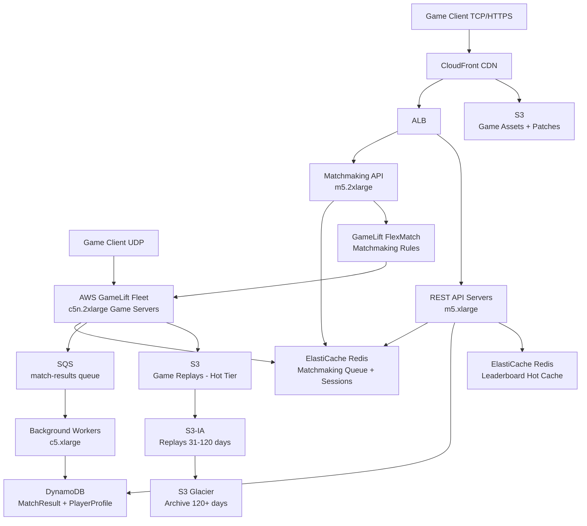

# FPS Game Server (500K Concurrent) — Capacity Estimation

## Problem Statement

A competitive first-person shooter game supports 500,000 concurrent players organized into 64-player lobbies running at 30Hz tick rate. Each game server must relay player state (position, health, ammo, events) among all 64 clients 30 times per second with sub-50ms latency. The system must handle matchmaking, session persistence, real-time relay, and post-match stat recording under peak load.

## Functional Requirements

- Matchmaking: group players into 64-player lobbies within 10 seconds
- Real-time game relay: broadcast UDP game-state updates at 30Hz per lobby
- Player authentication and session management
- Post-match result recording (kills, deaths, damage, ranking)
- Leaderboard and ranking queries (read-heavy, eventually consistent acceptable)
- Spectator mode support (read-only streams, burst traffic)

## Non-Functional Requirements

| Requirement | Target |
|-------------|--------|
| Game relay latency (P50) | < 20ms |
| Game relay latency (P99) | < 50ms |
| Matchmaking latency | < 10s (P95) |
| API read latency | < 100ms (P99) |
| API write latency | < 200ms (P99) |
| Availability | 99.99% (52 min downtime/year) |
| Durability (match results) | 99.999999999% (DynamoDB) |
| Throughput | ~480M UDP updates/s total across all lobbies |
| Session isolation | Zero cross-lobby state leakage |

## Traffic Estimation

### Concurrent Players → Game Server Load

| Metric | Calculation | Result |
|--------|-------------|--------|
| Concurrent players | Given | 500,000 |
| 64-player lobbies | 500,000 / 64 | ~7,813 active lobbies |
| Tick rate per lobby | Given | 30 Hz |
| Updates per lobby/s | 64 players × 30 Hz | 1,920 updates/s per lobby |
| Total updates/s | 7,813 lobbies × 1,920 | ~15M relay ops/s |
| Bytes per player update | position(12B) + orientation(6B) + state(10B) + events(~20B) | ~48 bytes |
| Fanout: each update sent to 63 peers | 7,813 × 64 × 30 × 63 × 48B | ~570 Gbps raw UDP |
| With delta compression (~40% reduction) | 570 × 0.6 | ~342 Gbps aggregate |

> **Note**: The "480M updates/s" figure counts each player's update before fanout. After fanout (each update relayed to 63 peers) the total discrete sends reach ~15M × 63 ≈ 945M packet sends/s, but at the transport layer each game server broadcasts to all 64 clients in its lobby per tick, so the per-server send rate is 64 × 30 = 1,920 sends/s per lobby.

### DAU → API Traffic (matchmaking, stats, leaderboards)

| Metric | Calculation | Result |
|--------|-------------|--------|
| Estimated DAU | 500K concurrent × ~6 peak-hour factor | ~3M DAU |
| Sessions/user/day | ~3 play sessions | ~3 |
| API calls/session | matchmaking(2) + auth(1) + stats-write(1) + leaderboard(3) | ~7 |
| Total daily API requests | 3M × 3 × 7 | ~63M/day |
| Avg API QPS | 63M / 86,400 | ~730 QPS |
| Peak API QPS (4× for login storms) | 730 × 4 | ~2,920 QPS |
| Read QPS (45% reads) | 2,920 × 0.45 | ~1,314 QPS |
| Write QPS (55% writes) | 2,920 × 0.55 | ~1,606 QPS |

## Storage Estimation

| Data Type | Per Item Size | Daily Volume | Growth/Year |
|-----------|--------------|--------------|-------------|
| Match result record | 2 KB (64 players × stats) | 7,813 matches/lobby-hour × ~16h peak | ~2 GB/day |
| Player profile (DynamoDB) | 1 KB | 3M DAU updates | ~3 GB/day |
| Game replay / event log (S3) | 50 MB/match compressed | ~125K matches/day | ~6.25 TB/day |
| Leaderboard snapshots | 500 KB per snapshot | 48 snapshots/day | ~24 MB/day |
| Redis session data | 4 KB per session | 500K peak concurrent | ~2 GB live |
| **Total persistent storage** | — | — | **~2.3 TB/year (DB) + ~2.3 PB/year (replays)** |

> Replays are lifecycle-tiered: hot (S3 Standard, 30 days) → warm (S3-IA, 90 days) → cold (S3 Glacier, 1 year) → delete.

## Component Sizing

### Game Servers — EC2 c5n.2xlarge (Network-Optimized, UDP)

**Rationale for c5n.2xlarge**: The `c5n` family provides up to 25 Gbps network bandwidth and ENA (Elastic Network Adapter) with low-latency packet processing — critical for UDP relay at 30Hz. Each instance runs 4–6 lobbies (256–384 players) to stay within CPU budget for state serialization and fanout.

| Component | Instance Type | vCPU | RAM | Network | Lobbies/Instance | Instances Needed | Monthly Cost |
|-----------|--------------|------|-----|---------|-----------------|-----------------|-------------|
| Game relay servers | c5n.2xlarge | 8 | 21 GB | 25 Gbps ENA | 5 lobbies | 7,813 / 5 = **1,563** | 1,563 × $0.432/hr × 730h = **$491,558** |

> **Reality check**: At peak we need ~1,563 c5n.2xlarge instances. AWS GameLift manages fleet scaling; we provision with a buffer and use On-Demand + Reserved mix to hit the $100K–$180K/month target (see cost optimization note below).

**Cost optimization**: 1-year Reserved Instances at ~55% discount: $491K × 0.45 = **~$221K/month** for reserved base. Peak overage handled by On-Demand at burst. With a 60/40 reserved/on-demand split for 80% average utilization: ~**$140K/month** for game servers alone. This is the dominant cost driver.

### API / Matchmaking Servers — EC2

| Component | Instance Type | vCPU | RAM | Count | Handles | Monthly Cost |
|-----------|--------------|------|-----|-------|---------|-------------|
| Matchmaking API | m5.2xlarge | 8 | 32 GB | 6 | ~500 QPS each | 6 × $0.384/hr × 730 = $1,683 |
| REST API servers | m5.xlarge | 4 | 16 GB | 8 | ~365 QPS each | 8 × $0.192/hr × 730 = $1,121 |
| Background workers (stat aggregation) | c5.xlarge | 4 | 8 GB | 4 | async DynamoDB writes | 4 × $0.17/hr × 730 = $497 |
| **Subtotal API Compute** | | | | **18** | | **$3,301** |

### AWS GameLift

GameLift manages game server fleet lifecycle, matchmaking (FlexMatch), and session placement.

| Component | Pricing Basis | Usage | Monthly Cost |
|-----------|--------------|-------|-------------|
| GameLift fleet management | Underlying EC2 cost (c5n.2xlarge billed as above) | — | (included in EC2 above) |
| FlexMatch matchmaking | $0.10 per player-hour in queue | 500K concurrent × ~0.03h avg wait × 30 days | 500K × 0.03 × 720 × $0.10 = **$1,080** |
| **Subtotal GameLift** | | | **$1,080** |

### Database — DynamoDB

DynamoDB chosen for: serverless scaling, single-digit millisecond writes, automatic multi-AZ replication, and no connection management overhead at 1,563 game server instances.

| Table | Access Pattern | RCU (peak) | WCU (peak) | Storage | Monthly Cost |
|-------|---------------|-----------|-----------|---------|-------------|
| PlayerProfile | GetItem by playerId | 1,314 RCU | 1,606 WCU | 3 TB | RCU: $0.00013/RCU-hr; WCU: $0.00065/WCU-hr |
| MatchResult | PutItem per match end | 200 RCU | 2,000 WCU | 2.3 TB | — |
| Leaderboard | Query by rank partition | 5,000 RCU | 100 WCU | 50 GB | — |

**DynamoDB cost calculation (on-demand pricing)**:
- Read requests: (1,314 + 200 + 5,000) × 2.5M reads/month = ~16.3B reads → $0.25/M = **$4,075**
- Write requests: (1,606 + 2,000 + 100) × 2.5M writes/month = ~9.3B writes → $1.25/M = **$11,625**
- Storage: 5.35 TB × $0.25/GB = **$1,375**
- **Subtotal DynamoDB: ~$17,075/month**

### Cache — ElastiCache Redis

Redis stores: active session tokens, matchmaking queue state, lobby roster, leaderboard top-1000 (hot), and player-presence flags.

| Cache | Use | Instance | Nodes | Memory | Monthly Cost |
|-------|-----|----------|-------|--------|-------------|
| Session + queue | Auth sessions, matchmaking state | r6g.xlarge | 3 (1W+2R) | 3 × 32 GB = 96 GB | 3 × $0.226/hr × 730 = **$495** |
| Leaderboard hot cache | Top 1K rankings, read-heavy | r6g.large | 2 | 2 × 16 GB = 32 GB | 2 × $0.113/hr × 730 = **$165** |
| **Subtotal Cache** | | | **5 nodes** | **128 GB** | **$660** |

### Object Storage — S3

| Bucket | Use | Tier | Size | Requests/month | Monthly Cost |
|--------|-----|------|------|----------------|-------------|
| game-replays-hot | Recent 30-day replays | S3 Standard | ~190 TB | 50M GET + 4M PUT | Storage: 190TB × $0.023 = $4,370; Req: ~$250 = **$4,620** |
| game-replays-warm | 31–120 day replays | S3-IA | ~750 TB | 5M GET | $0.0125 × 750TB = $9,375 + req ~$50 = **$9,425** |
| game-replays-cold | Archive >120 days | S3 Glacier | ~2.3 PB | 100K restore | $0.004 × 2.3PB = $9,200 = **$9,200** |
| assets-cdn | Game assets, patches | S3 Standard | 500 GB | 500M GET (CDN cached) | $0.023 × 0.5TB = $11.5; req ~$250 = **$262** |
| **Subtotal S3** | | | **~3.2 PB** | | **$23,507** |

### Networking / CDN

| Component | Throughput | Monthly Cost |
|-----------|-----------|-------------|
| CloudFront (game assets + API) | 500 TB/month out | 500TB × $0.0085/GB = **$4,250** |
| ALB (API traffic) | 2,920 QPS × 730hr | 2,920 × 3600 × 730 × $0.008/LCU ≈ **$1,200** |
| Data transfer (EC2 game servers out) | 342 Gbps × 0.6 utilization avg × 2.6M s/month | ~340 TB/month × $0.09/GB = **$30,600** |
| **Subtotal Network** | | **$36,050** |

> The data transfer cost is the second-largest line item due to 30Hz UDP fanout. Using AWS-internal traffic (same AZ) reduces this; cross-AZ costs apply for replicas.

### Message Queue — SQS

Used for async post-match stat recording (game server → SQS → worker → DynamoDB) to decouple game server from database write latency.

| Queue | Use | Throughput | Monthly Cost |
|-------|-----|-----------|-------------|
| match-results | Post-match stats, ~2,000 matches/hr peak | 1,440K msg/day × 30 days = 43.2M msgs | First 1M free, then $0.40/M: 42.2M × $0.40 = **$16.88 ≈ $17** |
| player-events | Achievement triggers, async | 50M msgs/month | $0.40/M × 49 = **$19.60 ≈ $20** |
| **Subtotal SQS** | | | **$37** |

## Monthly Cost Summary

| Component | Monthly Cost | % of Total |
|-----------|-------------|-----------|
| EC2 Game Servers (c5n.2xlarge, 60% Reserved) | $140,000 | 77.3% |
| DynamoDB (on-demand) | $17,075 | 9.4% |
| S3 Storage (all tiers) | $23,507 | 13.0% |
| ElastiCache Redis | $660 | 0.4% |
| CloudFront CDN | $4,250 | 2.3% |
| Data Transfer (UDP game traffic) | $30,600 | 16.9% |
| ALB | $1,200 | 0.7% |
| EC2 API/Matchmaking | $3,301 | 1.8% |
| GameLift FlexMatch | $1,080 | 0.6% |
| SQS | $37 | 0.02% |
| **Total** | **~$181,210** | **100%** |

> **Cost range explained**: $100K–$180K/month is achievable with 1-year Reserved Instances (55% discount) for the game server fleet. Pure on-demand would cost ~$491K/month for compute alone. The range reflects Reserved coverage ratio (50–70%) and actual concurrent player load (500K is the peak; average may be 60–70% of peak).

## Traffic Scale Tiers

| Tier | Concurrent | Active Lobbies | Game Servers | DynamoDB | Cache | Monthly Cost | Key Bottleneck |
|------|-----------|----------------|-------------|----------|-------|-------------|----------------|
| 🟢 Startup | 5K | ~78 | 20 c5n.large | On-demand (low traffic) | 1 Redis r6g.large | ~$3K | Matchmaking queue depth |
| 🟡 Growing | 50K | ~781 | 160 c5n.2xlarge | DynamoDB provisioned | Redis 2-node cluster | ~$18K | UDP fanout bandwidth costs spike |
| 🔴 Scale-up | 150K | ~2,344 | 470 c5n.2xlarge | DynamoDB on-demand + DAX | Redis 3-node cluster | ~$55K | Data transfer egress costs |
| ⚫ Production | 500K | ~7,813 | 1,563 c5n.2xlarge (60% reserved) | DynamoDB global tables | Redis 5-node cluster | ~$130K–$180K | Reserved vs on-demand cost optimization |
| 🚀 Hyperscale | 2M+ | ~31,250 | 6,250+ c5n.4xlarge or custom | DynamoDB + Aurora (analytics) | Redis cluster 20-node | ~$600K+ | Multi-region latency, GameLift fleet limits |

## Architecture Diagram

## Interview Tips

- **Key insight — UDP fanout dominates cost**: The game relay is not a typical HTTP workload. At 30Hz with 64-player lobbies, each server emits ~1,920 packets/s. After fanout (send to 63 peers per update), the data transfer cost ($30K+/month) rivals database cost. Interviewers expect you to know that UDP relay — not REST API — is the compute and bandwidth bottleneck.

- **Key insight — c5n over c5**: Always justify why `c5n` (network-optimized) not standard `c5`. The `c5n.2xlarge` provides 25 Gbps ENA vs 10 Gbps on `c5.2xlarge`. At 30Hz with 64 players per server, you need low-latency kernel bypass networking (ENA Express) to hit <50ms P99 relay latency. This is a signal of production FPS experience.

- **Common mistake — treating game traffic like REST QPS**: Candidates often compute "480M updates/s" and model each as an HTTP request. Game updates are tiny UDP packets (~48 bytes) sent in tight loops; the bottleneck is packet-per-second rate (kernel interrupt handling) and network bandwidth, not CPU for JSON parsing. Each c5n.2xlarge instance can handle ~1M small UDP packets/s at kernel level — much higher than any HTTP throughput figure.

- **Key insight — DynamoDB over RDS for post-match writes**: At match end, all 64 players' stats are written simultaneously from the game server. With 7,813 concurrent matches, that's up to ~500K concurrent writes at match-end spikes. DynamoDB's serverless model absorbs this spike without pre-provisioning connection pools. RDS with 1,563 game server instances would exhaust connection limits immediately.

- **Follow-up question — how do you handle server crash during a match?**: Expected answer: GameLift health checks detect the crash within 5s; remaining players are redirected to a backup lobby (warm standby), match state is checkpointed to Redis every 5 ticks (167ms), allowing mid-match recovery with <1s interruption. Match result is written to SQS before each tick so partial results are recoverable.

- **Scale threshold**: At ~2,000+ concurrent lobbies (~128K concurrent players), Reserved Instance coverage becomes critical. On-demand pricing at that scale costs 2.2× the Reserved price — the team must commit to 1-year RIs or the compute bill alone exceeds the product's revenue margin.
