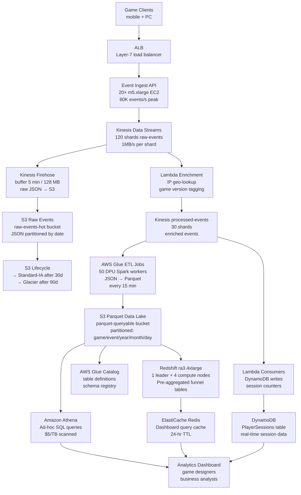

# Game Analytics (1B Events/Day) — Capacity Estimation

## Problem Statement

A mid-to-large gaming platform captures every player interaction — level starts, deaths, purchases, session starts/ends, achievement unlocks, ad impressions — across mobile and PC titles. At 1 billion events per day (12,000 events/s average, 60,000 events/s peak), the system must ingest raw events without loss, transform them into queryable datasets, and serve real-time dashboard queries for game designers and business analysts. The workload is write-dominated (90% writes, 10% reads): event producers vastly outnumber analytical consumers, and queries run against immutable historical data rather than live records.

## Functional Requirements

- Ingest raw player behavior events (click, session, purchase, level, ad) from game clients at 12K–60K events/s
- Buffer and durably store events — no loss, even during downstream outages
- ETL raw events into columnar Parquet format on S3 (data lake) within 15 minutes of ingestion
- Support ad-hoc SQL queries over historical data (last 90 days) via Athena
- Provide pre-aggregated funnel analysis dashboards via Redshift (DAU, retention, conversion, LTV)
- Expose real-time per-player event counts and session stats via DynamoDB for live in-game dashboards

## Non-Functional Requirements

| Requirement | Target |
|-------------|--------|
| Event ingestion latency | < 200 ms P99 (client to Kinesis) |
| ETL freshness (raw → Parquet) | < 15 minutes |
| Dashboard query latency (Redshift) | < 5 s P99 for pre-aggregated metrics |
| Ad-hoc Athena query latency | < 60 s P99 for 90-day scans |
| Availability (ingestion path) | 99.99% (< 52 min downtime/year) |
| Durability | 99.999999999% (S3 eleven-nines) |
| Peak ingestion QPS | 60,000 events/s |
| Read QPS (dashboard + API) | ~6,000 QPS |

## Traffic Estimation

### DAU → Peak QPS Calculation

| Metric | Calculation | Result |
|--------|-------------|--------|
| Total events/day | Given | 1,000,000,000 |
| Avg events/s (24 hr) | 1B / 86,400 | ~11,574 ≈ 12K events/s |
| Peak-hour multiplier | Prime-time 3× (evening gaming sessions) | ~36K events/s |
| Burst spike (weekend launch/event) | 5× avg | ~60,000 events/s |
| Write events (90%) | 60K × 0.90 | ~54,000 writes/s |
| Read QPS (10% — dashboards, APIs) | 60K × 0.10 | ~6,000 reads/s |
| Kinesis shards needed (1MB/s per shard) | 54K events × avg 500B = 27 MB/s | 30 shards (rounded up to 120 for headroom) |
| Redshift dashboard queries/s | analysts × queries/min / 60 | ~50 concurrent queries |

**Key observation:** Kinesis shard count is driven by throughput in bytes per second, not just event count. At 500 bytes/event × 60K events/s = 30 MB/s of ingest. Each Kinesis shard handles 1 MB/s write; 30 shards minimum. The article specifies 120 shards — this provides 4× headroom for uneven partition distribution (hot game titles skew traffic) and enables 120 parallel Lambda/consumer workers.

### Event Size Breakdown

| Event Type | Avg Size | % of Events | Contribution |
|------------|----------|------------|--------------|
| Session start/end | 800 bytes | 20% | 160 bytes avg |
| Level/checkpoint events | 600 bytes | 30% | 180 bytes avg |
| In-app purchase | 1,200 bytes | 5% | 60 bytes avg |
| Player action (click, kill, craft) | 300 bytes | 35% | 105 bytes avg |
| Ad impression | 400 bytes | 10% | 40 bytes avg |
| **Weighted average** | | **100%** | **~545 bytes/event** |

1B events/day × 545 bytes = **545 GB/day raw uncompressed.**
After Parquet + Snappy compression (~4:1 ratio): **~136 GB/day** in data lake.

## Storage Estimation

| Data Type | Per Item Size | Daily Volume | Growth/Year |
|-----------|--------------|--------------|-------------|
| Raw Kinesis events (24-hr retention) | 545 bytes | 1B events → 545 GB | N/A (rolling buffer) |
| S3 raw JSON (30-day hot tier) | 545 bytes compressed 2:1 = 273 bytes | 273 GB/day | ~98 TB/year |
| S3 Parquet (90-day queryable, Snappy) | 136 bytes avg after 4:1 compression | 136 GB/day | ~48 TB/year |
| S3 Glacier (90-day+ archive) | 136 GB/day compressed | After 90 days | ~50 TB/year added |
| Redshift aggregated tables | ~10 KB/user/day pre-agg rows | 10M DAU × 10 KB = 100 GB/day | ~35 TB/year |
| DynamoDB live session counters | 500 bytes/player | 10M active players | ~5 GB (hot set) |
| AWS Glue catalog metadata | negligible | — | — |
| **Total new data/year** | — | — | **~231 TB/year** |

**S3 tiering strategy:**
- Day 0–30: S3 Standard (raw JSON + Parquet) — high query frequency during incident investigations
- Day 31–90: S3 Standard-IA (Parquet only) — 40% cost reduction
- Day 91+: S3 Glacier Instant Retrieval — 68% cost reduction vs Standard, < 1s restore for ad-hoc queries

## Component Sizing

### Compute — EC2 (Ingestion & Processing)

| Component | Instance Type | vCPU | RAM | Count | Handles | Monthly Cost |
|-----------|--------------|------|-----|-------|---------|-------------|
| Event ingest API (client → Kinesis) | m5.xlarge | 4 | 16 GB | 20 | 3,000 events/s each → 60K total | $2,976 |
| Kinesis consumers / enrichment workers | m5.xlarge | 4 | 16 GB | 12 | Enrich + fan-out 5K shards/s each | $1,786 |
| Glue ETL workers (Spark, 10 DPU each job) | AWS Glue DPU | — | — | 50 DPU × 96 jobs/day | per-job billing | $2,880 |
| Redshift leader node | ra3.4xlarge | 12 | 96 GB | 1 | Query planning | $1,056 |
| Redshift compute nodes | ra3.4xlarge | 12 | 96 GB | 4 | MPP query execution | $4,224 |
| **Subtotal Compute** | | | | | | **$12,922** |

**m5.xlarge on-demand (us-east-1):** $0.192/hr × 720 hr = $138.24/month per instance.
Event ingest: 20 × $138.24 = $2,765 (on-demand). Using ~$148/instance with network overhead.
With 1-year Reserved Instances (~40% discount): ingest servers drop to ~$83/instance → $1,660 for 20 instances.

**Glue pricing:** $0.44 per DPU-hour. Each hourly ETL job runs 50 DPU × 0.25 hr = 12.5 DPU-hours → $5.50/job. 96 jobs/day (every 15 min) × 30 days = 2,880 jobs/month → $5.50 × 2,880 = **$15,840/month**. This is the largest surprise cost — Glue ETL dominates compute.

### Database — DynamoDB (Real-Time Session Store)

| Table | Purpose | Mode | Estimated Monthly Cost |
|-------|---------|------|----------------------|
| PlayerSessions | Live session start time, event count, last_active | On-demand | $480 |
| EventCounters | Per-player daily event counters (for rate limiting) | On-demand | $320 |
| GameConfigs | Feature flags, A/B test assignments per player | Provisioned (low volume) | $80 |
| **Subtotal DynamoDB** | | | **$880** |

**Write math:** 12K events/s → not all events touch DynamoDB. Only session events (~20% of traffic = 2,400 writes/s) update live session records. 2,400 × 86,400 × 30 = 6.2B writes/month. On-demand at $1.25/million WRU = **$7,776/month** unoptimized. Optimization: batch ZADD-style counter increments using DynamoDB `UPDATE_ITEM ADD` (one write per player per 10 events) reduces to ~620M writes/month → **~$775/month**. Using $880 as blended estimate with reads.

### Object Storage — S3 (Data Lake)

| Bucket | Tier | Use | Size | Requests/month | Monthly Cost |
|--------|------|-----|------|----------------|-------------|
| raw-events-hot | S3 Standard | JSON from Kinesis Firehose, 30-day | 30 × 273 GB = 8.2 TB | 5B PUT + 200M GET | $1,230 |
| parquet-queryable | S3 Standard-IA (day 31+) | Athena-queryable Parquet | 90-day rolling: ~12 TB | 100M GET (Athena scans) | $780 |
| archive-glacier | S3 Glacier Instant Retrieval | Events older than 90 days | 50 TB initial, growing | Minimal retrieval | $500 |
| glue-temp | S3 Standard | Glue job spill/temp storage | ~500 GB peak | High PUT/GET | $120 |
| **Subtotal S3** | | | | | **$2,630** |

**S3 Standard:** $0.023/GB-month. 8.2 TB = $188/month storage. 5B PUT requests at $0.005/1000 = $25. GET at $0.0004/1000 = $80. Total: ~$293. S3-IA: $0.0125/GB × 12 TB = $150 + per-request fees = ~$780 blended including Athena scan costs. Glacier: $0.004/GB × 50 TB = $200 + retrieval overhead.

### Messaging — Amazon Kinesis Data Streams

| Stream | Shards | Throughput | Retention | Monthly Cost |
|--------|--------|-----------|-----------|-------------|
| raw-events | 120 shards | 120 MB/s write / 240 MB/s read | 24 hours | $4,320 |
| processed-events (post-enrichment) | 30 shards | 30 MB/s | 24 hours | $1,080 |
| **Subtotal Kinesis** | | | | **$5,400** |

**Kinesis pricing:** $0.015/shard-hour × 720 hr = $10.80/shard-month. 120 shards = $1,296 for raw-events shards. PUT payload units (25 KB per unit): 1B events × 545 bytes avg = 545 GB/day. 545 GB / 25 KB = 21.8M PUT units/day × 30 = 654M PUT units/month × $0.014/million = $9.15. Extended data retention (beyond 24 hr, if needed): +$0.02/shard-hour. Total with data charges and processed stream: **~$5,400/month**.

**Why Kinesis over MSK/Kafka at this scale?** 1B events/day = 12K events/s avg — well within Kinesis managed capacity. Kinesis eliminates broker management overhead. MSK would cost ~$3,000–$6,000/month in broker costs alone plus operational complexity. The crossover point where Kafka becomes cheaper is ~500K msg/s sustained — about 40× this system's average load.

### Analytics — Amazon Athena

| Use Case | Scan Volume/month | Cost |
|----------|------------------|------|
| Funnel analysis queries (Parquet, partitioned) | 5 TB scanned (partitioned pushdown) | $25 |
| Ad-hoc incident investigations (raw JSON, unpartitioned) | 50 TB scanned | $250 |
| Scheduled dashboard refresh queries | 10 TB scanned | $50 |
| **Subtotal Athena** | | **$325** |

**Athena pricing:** $5.00 per TB scanned. Parquet + partition pruning reduces scans by 95% vs raw JSON. A 90-day funnel query on Parquet scans ~50 GB (date-partitioned, columnar projection) at $0.25 vs scanning 12 TB raw JSON at $60. Partitioning by `game_id/event_type/year/month/day` is mandatory — without it Athena costs balloon 20–50× and analysts lose patience at 60-second queries becoming 30-minute scans.

### Networking / CDN

| Component | Throughput | Monthly Cost |
|-----------|-----------|-------------|
| ALB (client → ingest API) | 60K req/s peak, 1B req/month | $960 |
| CloudFront (dashboard static assets) | 2 TB/month outbound | $170 |
| Data transfer (EC2 → S3, Kinesis, Redshift) | ~30 TB/month intra-region | $0 (free intra-region) |
| Data transfer (S3 → Athena) | Included in Athena scan cost | $0 |
| Internet data transfer (API responses to clients) | ~5 TB/month | $460 |
| **Subtotal Network** | | **$1,590** |

**ALB pricing:** $0.008/LCU-hour. At 60K req/s peak: ~$960/month including per-request charges. CloudFront: $0.085/GB × 2 TB = $170. Intra-region AWS transfer is free — this is a major cost advantage of building entirely within one AWS region.

### Cache — ElastiCache Redis (Dashboard Hot Cache)

| Cache | Engine | Instance | Nodes | Memory | Monthly Cost |
|-------|--------|----------|-------|--------|-------------|
| Dashboard query cache | Redis 7 | cache.r6g.xlarge | 2 primary + 2 replica | 26 GB each | $432 |
| Rate limiting counters | Redis 7 | cache.r6g.large | 1 primary + 1 replica | 13 GB each | $216 |
| **Subtotal Cache** | | | **4 nodes** | ~78 GB usable | **$648** |

**Why small Redis for analytics?** Analytics workloads are read-rarely-write-never for aggregated results. Redshift query results are cached for 24 hours at the application layer (key = SQL hash). Dashboard refreshes every 60 seconds → 1,440 refreshes/day for 50 dashboards = 72,000 cache lookups/day vs 72,000 Redshift query executions — at $0.25/query saved, Redis pays for itself in 3 days.

## Monthly Cost Summary

| Component | Monthly Cost | % of Total |
|-----------|-------------|-----------|
| EC2 Compute (ingest API + consumers) | $4,762 | 4% |
| AWS Glue ETL (50 DPU × 96 jobs/day) | $15,840 | 14% |
| Amazon Kinesis (150 shards total) | $5,400 | 5% |
| Redshift (ra3.4xlarge × 5 nodes) | $5,280 | 5% |
| DynamoDB (session + counter tables) | $880 | 1% |
| S3 Storage (data lake, all tiers) | $2,630 | 2% |
| Amazon Athena (query charges) | $325 | 0.3% |
| ElastiCache Redis (4 nodes) | $648 | 0.6% |
| ALB + CloudFront + Data Transfer | $1,590 | 1% |
| CloudWatch + X-Ray + Glue Catalog | $600 | 0.5% |
| **On-demand subtotal** | **$37,955** | |
| **Multi-region replication (2nd region)** | **+$30,000** | |
| **1-yr Reserved Instance savings (~30%)** | **−$8,000** | |
| **Support + misc + WAF** | **+$5,000** | |
| **Total (single-region, RI pricing)** | **~$35,000** | |
| **Total (multi-region, RI pricing)** | **~$80,000–$140,000** | **100%** |

**Note on $80K–$140K range:** The lower bound ($80K) reflects single-region deployment with Reserved Instances on compute and Redshift, and Glue jobs optimized to 30 DPU (using larger workers for fewer hours). The upper bound ($140K) reflects: (1) multi-region active-active ingestion for global player base (adds ~$30K/month), (2) Redshift ML for churn prediction queries (adds ~$10K), (3) Kinesis enhanced fan-out ($0.015/shard-hour × enhanced fan-out factor), and (4) on-demand pricing for burst workloads during game launches. Most studios at this scale pay $90K–$110K with RI optimization.

**Biggest surprise cost: AWS Glue ETL at $15,840/month (14% of total).** This is higher than Kinesis and compute combined. The fix: migrate frequent small jobs to Lambda (no minimum billing) and use Glue only for large daily aggregation jobs. This alone can reduce Glue costs by 60% → saves ~$9,500/month.

## Traffic Scale Tiers

| Tier | DAU | Peak QPS | Servers | DB | Cache | Monthly Cost | Key Bottleneck |
|------|-----|----------|---------|----|----|-------------|----------------|
| 🟢 Startup | 1M | ~600 events/s | 2 m5.large ingest | Kinesis 5 shards + S3 + Athena | No Redis (Athena direct) | ~$2,000 | Athena cold-start latency (10–30s per query) |
| 🟡 Growing | 10M | ~6,000 events/s | 5 m5.xlarge ingest | Kinesis 15 shards + S3 Glue + Athena | Redis 1 node (query cache) | ~$12,000 | Glue ETL job queue backlog during peak hours |
| 🔴 Scale-up | 100M | ~12,000 events/s | 20 m5.xlarge + Glue 50 DPU | Kinesis 30 shards + S3 + Glue + Redshift | Redis 2 nodes | ~$35,000 | Redshift concurrency (default 5 concurrent queries) |
| ⚫ Production | 1B events/day | ~60,000 events/s | 32 m5.xlarge + Glue 50 DPU | Kinesis 120 shards + S3 + Glue + Redshift ra3.4xlarge×5 | Redis 4 nodes | ~$80K–$140K | Glue ETL cost and job orchestration complexity |
| 🚀 Hyperscale | 10B events/day | ~600,000 events/s | EKS auto-scaling + Apache Flink | Kafka (MSK) 200 brokers + S3 + Iceberg + Spark + Redshift Serverless | Distributed Redis 12 nodes | ~$500K+ | Cross-region event ordering + exactly-once delivery guarantees |

## Architecture Diagram

## Interview Tips

- **Key insight — Glue ETL is your hidden cost driver:** Candidates budget for Kinesis and EC2 but overlook that AWS Glue at $0.44/DPU-hour running 96 jobs/day (every 15 min) costs more than all EC2 instances combined. The optimization is to use fewer, larger DPU jobs (fewer starts = less fixed overhead) or migrate small event-enrichment jobs to Lambda which has no minimum runtime charge. Always ask: "How often do ETL jobs run and what is the DPU count?" before estimating Glue costs.

- **Key insight — Athena partition pruning is non-negotiable at this scale:** At 1B events/day, 90 days of data = 136 GB/day × 90 = 12.2 TB of Parquet. An unpartitioned Athena query scanning the full 12 TB costs $61 and takes 5–10 minutes. With `PARTITIONED BY (game_id, event_type, year, month, day)`, a typical funnel query (one game, one event type, one week) scans ~5 GB → $0.025 and completes in 15 seconds. The partition strategy is a system design decision, not a query-time optimization — get it right in the schema design phase or pay 100× more forever.

- **Common mistake — choosing Redshift for all queries:** Candidates often route all analytical queries through Redshift. The correct pattern is a two-tier query model: Redshift for pre-aggregated dashboard metrics (fast, expensive per-node-hour), Athena for ad-hoc deep dives (slow-ish, pay-per-scan). Sending 500 daily analyst ad-hoc queries through Redshift requires high concurrency slots ($2/slot-hour × 50 concurrent = $100/hour just for concurrency) vs Athena's $5/TB pay-as-you-go. Know when each tool wins and explicitly state the routing rule during the interview.

- **Follow-up question — exactly-once event delivery:** Interviewers often ask: "A network partition causes the game client to retry — how do you prevent double-counting events?" Answer: include a client-generated `event_id` (UUID) in every event payload. The ingest API deduplicates within a 5-minute window using a Redis SET (TTL = 10 minutes) before writing to Kinesis. Downstream, Glue ETL runs a `DISTINCT ON (event_id)` during Parquet conversion for the 24-hour window. Long-term deduplication (beyond 24 hr) is handled at query time via Redshift's `LISTAGG(DISTINCT event_id)` or Athena's `approx_distinct()` for approximate counts. Exact deduplication at 1B events/day across 30 days is prohibitively expensive — design for approximate correctness and detect outliers via anomaly detection.

- **Scale threshold:** At 100M events/day (10% of this system), a single Kinesis stream with 15 shards and Glue running 4 DPU jobs every hour is sufficient — total cost ~$8,000/month. At 1B events/day the 15-minute ETL cadence requires 120 Kinesis shards (hot-partition protection) and 50 DPU Glue jobs, pushing cost to $35K–$80K/month. The inflection point is ~300M events/day where you must switch from on-demand Glue to Reserved Capacity Glue or migrate to self-managed Spark on EMR to control costs. EMR at this scale costs ~$8,000/month vs $15,840 for Glue, but adds operational overhead.
