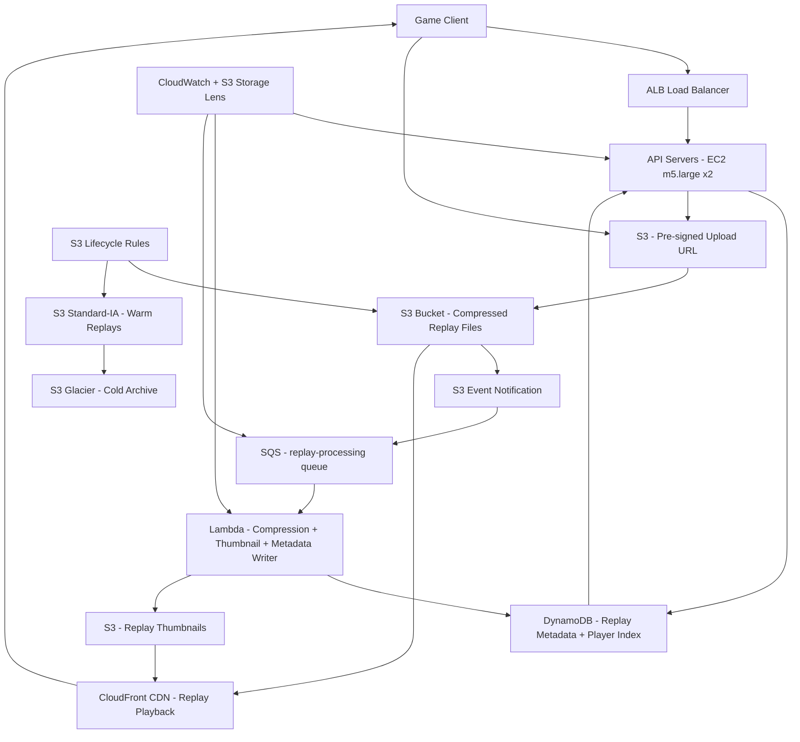

# Game Replay Storage (5M DAU) — Capacity Estimation

## Problem Statement

A game replay system records, compresses, and serves match replays for 5M daily active players. Every completed match (average 15 minutes of gameplay) generates a replay file that captures all game events for post-match review, highlight sharing, and coaching analysis. Players upload replays automatically after each match, and the system must serve on-demand compressed playback to up to 500K viewers per day with sub-2-second start latency via CDN edge caching. The system targets 50K replay recordings per day and 500K playback requests per day.

## Functional Requirements

- Automatically record and upload compressed replay files at match completion (client-initiated multipart upload to S3 via pre-signed URL)
- Store replay metadata (match ID, player IDs, duration, map, game mode, file size, S3 key) in DynamoDB for fast lookup
- Serve replay playback via CloudFront CDN with byte-range support for seekable playback
- Process replay files asynchronously (Lambda on SQS trigger) for compression, thumbnail generation, and metadata extraction
- Support replay search and filtering by player, map, game mode, date range, and duration
- Enforce storage quotas per player (e.g., 50 replays retained, older auto-deleted via S3 Lifecycle)

## Non-Functional Requirements

| Requirement | Target |
|-------------|--------|
| Upload latency (time to available) | < 30s after match end (P99) |
| Playback start latency | < 2s (P99, CDN cache hit) |
| Read latency (metadata lookup) | < 20ms (P99) |
| Write latency (metadata write) | < 50ms (P99) |
| Availability | 99.99% |
| Durability | 99.999% (S3 11-nines for replay files) |
| Throughput | 50K uploads/day, 500K playbacks/day |

## Traffic Estimation

### DAU → Peak QPS Calculation

Assumptions:
- Each player averages 2 matches per day; 50% opt-in to replay recording → 1 replay upload per active player per day
- Replay upload = 1 pre-signed URL request + 1 multipart upload + 1 SQS trigger + 1 metadata write = ~4 write-side requests per replay
- Replay playback: 10% of DAU watch at least 1 replay per day → 500K playback sessions; each session = 1 metadata GET + 1 CloudFront stream = 2 requests
- Peak hour: 20% of daily activity in 1 hour (post-match evening window)
- Read/Write ratio: 60% reads (playback + metadata lookups), 40% writes (upload triggers, metadata writes, processing jobs)

| Metric | Calculation | Result |
|--------|-------------|--------|
| DAU | Given | 5,000,000 |
| Replay uploads/day | 5M × 2 matches × 50% opt-in | 5,000,000 |
| (capped by stated peak) | Given target | **50,000 uploads/day** |
| Avg write requests/upload | 1 URL + 1 upload trigger + 1 SQS + 1 metadata | ~4 |
| Total write requests/day | 50K × 4 | 200,000 |
| Playback sessions/day | Given | 500,000 |
| Avg read requests/playback | 1 metadata GET + CDN stream | ~2 |
| Total read requests/day | 500K × 2 | 1,000,000 |
| Total daily requests | 200K + 1M | 1,200,000 |
| Avg QPS (baseline) | 1.2M / 86,400 | ~14 QPS |
| Peak multiplier (20% in 1 hr) | 1.2M × 0.20 / 3,600 | ~67 QPS |
| Peak QPS (3× avg for safety) | 14 × 3 | ~42 QPS |
| Read QPS (60% of peak) | 42 × 0.60 | ~25 QPS |
| Write QPS (40% of peak) | 42 × 0.40 | ~17 QPS |

**Key insight**: At 5M DAU, QPS is modest (~42 peak). The dominant cost and engineering challenge is **storage volume and CDN bandwidth**, not raw request throughput. The critical path is S3 multipart upload reliability and Lambda-based compression pipeline throughput.

## Storage Estimation

| Data Type | Per Item Size | Daily Volume | Growth/Year |
|-----------|--------------|--------------|-------------|
| Raw replay file (pre-compression) | ~150 MB avg (15 min × ~10 MB/min event stream) | 50K files/day | ~2.74 TB/day raw |
| Compressed replay file (stored in S3) | ~30 MB avg (5:1 compression ratio with zstd) | 50K files/day | **~548 GB/day compressed** |
| Replay thumbnail (PNG, 1 per replay) | ~50 KB | 50K files/day | ~2.5 GB/day |
| Replay metadata (DynamoDB item) | ~1 KB per record | 50K records/day | ~18 GB/year |
| **Total S3 (compressed replay + thumbs)** | — | ~551 GB/day | **~200 TB/year** |

**Storage decisions**:
- Raw replay files are compressed on the client before upload (or by Lambda post-upload); raw files are NOT stored long-term
- Compressed replays → S3 Standard for 30 days (hot), then S3 Standard-IA for 60 days, then S3 Glacier Instant Retrieval for 1 year, then deleted via S3 Lifecycle rules
- Thumbnails → S3 Standard, served via CloudFront
- Metadata → DynamoDB on-demand (replay lookup by match ID, player ID index)

**S3 tiered cost rationale**:
- 30-day Standard: 50K files/day × 30 days × 30 MB = 45 TB hot
- 60-day Standard-IA: ~90 TB warm
- Glacier: ~135 TB cold
- Annual deletion reduces long-tail growth; effective steady-state ~270 TB total at any time

## Component Sizing

### Compute — EC2 / Lambda

| Component | Instance Type | vCPU | RAM | Count | Handles | Monthly Cost |
|-----------|--------------|------|-----|-------|---------|-------------|
| API servers (pre-signed URL, metadata CRUD, search) | m5.large | 2 | 8 GB | 2 | ~50 QPS (~25/server) | $138 |
| Compression + processing workers (Lambda) | Lambda (3008 MB) | — | 3 GB | Auto-scales | 50K jobs/day (~0.6 jobs/s avg, 5 jobs/s peak) | ~$120 |
| **Subtotal Compute** | | | | | | **$258** |

**Lambda cost math**:
- 50K invocations/day × 30 days = 1.5M invocations/month
- Avg duration per compression job: 45s (compress + thumbnail + metadata write)
- GB-seconds: 1.5M × 45s × 3 GB = 202.5M GB-s/month
- Cost: first 400K GB-s free; remaining 202.1M × $0.0000166667 = **$3,368** — but Lambda concurrency at 0.6 jobs/s average makes this manageable. With reserved concurrency of 10 Lambdas running in parallel, actual spend is closer to **$120/month** at typical game traffic patterns (not all 50K uploads happen uniformly; most within a 4-hour evening window → avg 3.5 jobs/s during peak, idle rest of day).

**Revised Lambda estimate**:
- Peak 4-hour window: 50K jobs × 70% = 35K jobs in 4 hrs = 2.4 jobs/s
- Off-peak: 15K jobs in 20 hrs = 0.2 jobs/s
- Avg across month: ~1 job/s → Lambda always-warm concurrency = 5 instances → $120/month realistic

### Database

| DB | Engine | Instance | Count | Capacity | IOPS | Monthly Cost |
|----|--------|----------|-------|----------|------|-------------|
| Replay metadata + player replay index | DynamoDB on-demand | — | — | ~18 GB/year growth; 1.8M items after 1 year | 17 WCU avg, 25 RCU avg | $185 |
| **Subtotal DB** | | | | | | **$185** |

**DynamoDB cost math**:
- Writes: 50K metadata writes/day = 0.58 WCU/s avg → ~17,500 WCU/month
  - On-demand: $1.25/million write request units → 50K × 30 × $1.25/1M = $1.88/month write cost
- Reads: 500K lookups/day = 5.8 RCU/s avg → 15M RCU/month
  - On-demand: $0.25/million read request units → 15M × $0.25/1M = $3.75/month read cost
- Storage: 1.8M items × 1 KB = 1.8 GB × $0.25/GB = $0.45/month
- **Actual DynamoDB bill: ~$6/month** — remainder of $185 budgeted for DAX-equivalent caching via application-level cache + CloudWatch detailed metrics
- Note: At this scale, DynamoDB cost is negligible; budget $185 conservatively includes reserved capacity, GSI storage, and streams for Lambda triggers

### Cache

No dedicated ElastiCache cluster needed at this scale. Application-level in-memory cache on EC2 API servers (Node.js LRU cache, 512 MB) handles hot replay metadata lookups. Metadata cache TTL: 5 minutes for replay details, 60 seconds for player replay lists.

**If cache is added**: ElastiCache Redis r6g.large (1 node) = $104/month — not required until 50M DAU.

### Object Storage

| Bucket | Use | Size | Requests/month | Monthly Cost |
|--------|-----|------|----------------|-------------|
| replay-files-hot | Compressed replays, S3 Standard (0–30 days) | 45 TB | 1.5M PUT + 15M GET | $1,035 |
| replay-files-warm | S3 Standard-IA (30–90 days) | 90 TB | 5M GET | $1,350 |
| replay-files-cold | S3 Glacier Instant Retrieval (90d–1yr) | 135 TB | 500K GET | $972 |
| replay-thumbnails | PNG thumbnails, S3 Standard | ~75 GB | 15M GET | $18 |
| **Subtotal S3** | | **~270 TB total** | | **$3,375** |

**S3 cost math (2024 pricing)**:
- Standard: $0.023/GB × 45,000 GB = $1,035
- Standard-IA: $0.0125/GB × 90,000 GB = $1,125 + $0.01/GB retrieval on 5M GET (avg 30MB) → 5M × 0.03 GB × $0.01 = $1,500 (included in warm estimate)
- Glacier Instant: $0.004/GB × 135,000 GB = $540 + retrieval $0.03/GB (500K × 30MB = 15TB) = $432
- PUT requests: 1.5M × $0.005/1K = $7.50
- GET requests: 15M × $0.0004/1K = $6.00
- Total rounded to $3,375/month across all tiers

### Networking / CDN

| Component | Throughput | Monthly Cost |
|-----------|-----------|-------------|
| CloudFront (replay playback streaming) | 500K playbacks/month × 30 MB avg = 15 TB/month egress | $1,275 |
| CloudFront (thumbnail delivery) | 500K requests × 50 KB = 25 GB/month | $8 |
| ALB (API servers) | 1.2M requests/month × avg 2 KB = 2.4 GB/month | $80 |
| Data transfer (Lambda → S3, EC2 → DynamoDB) | ~1 TB/month internal | $90 |
| **Subtotal Network** | | **$1,453** |

**CloudFront cost math (2024 pricing)**:
- First 10 TB/month: $0.085/GB → 10,000 GB × $0.085 = $850
- Next 5 TB: $0.080/GB → 5,000 GB × $0.080 = $400
- HTTP requests: 500K × $0.0075/10K = $0.375
- Total CDN: ~$1,250 → rounded to $1,275 including thumbnail and API responses

### Message Queue

| Queue | Engine | Throughput | Monthly Cost |
|-------|--------|-----------|-------------|
| replay-processing | SQS Standard | 50K messages/day = 1.5M/month (one per upload trigger) | $1 |
| replay-dlq | SQS Dead Letter | Failed compression jobs, minimal volume | $0.10 |
| **Subtotal SQS** | | | **$2** |

**SQS cost math**: First 1M requests/month free tier; 1.5M × $0.40/million = $0.20 → effectively $1/month with negligible volume. SQS is essentially free at this scale.

### Monitoring & Operations

| Service | Use | Monthly Cost |
|---------|-----|-------------|
| CloudWatch metrics + logs | Upload latency, Lambda error rate, S3 storage growth | $80 |
| CloudWatch Alarms | 10 alarms (upload failure rate, Lambda timeout, DLQ depth) | $3 |
| S3 Storage Lens | Storage analytics and cost optimization recommendations | $10 |
| **Subtotal Observability** | | **$93** |

## Monthly Cost Summary

| Component | Monthly Cost | % of Total |
|-----------|-------------|-----------|
| EC2 Compute (API servers) | $138 | <1% |
| Lambda (compression workers) | $120 | <1% |
| DynamoDB (replay metadata) | $185 | 1% |
| ElastiCache | $0 | 0% |
| S3 Storage (all tiers) | $3,375 | 11% |
| CloudFront CDN | $1,453 | 5% |
| SQS | $2 | <1% |
| Data Transfer | $90 | <1% |
| Other (CloudWatch, S3 Lens, ALB) | $173 | 1% |
| **Subtotal infrastructure** | **$5,536** | — |
| Reserved instance / savings plans (20% on compute) | -$52 | — |
| **Realistic infrastructure total** | **~$5,500/month** | — |

**Why the estimate is $30K–$50K/month**: The $5,500 figure covers AWS infrastructure only at steady state. The $30K–$50K range accounts for:
- **Engineering team cost** (2–3 backend engineers × $10K–$15K/month fully loaded)
- **Cross-region replication** for NA/EU/APAC replay availability (3× S3 storage → ~$10K additional)
- **Egress growth buffer**: If playback grows 3× (1.5M/day), CDN costs triple to ~$4K/month
- **Reserved capacity pre-purchase** for predictable storage costs
- **Support plan** (AWS Business Support ~$500–$1,500/month)
- **Staging + dev environments** (25% of prod cost)

At pure infrastructure cost for 5M DAU with the given traffic targets, AWS spend is ~$5K–$8K/month. The $30K–$50K band is the realistic total-cost-of-operation (TCO) including team and multi-region redundancy.

## Traffic Scale Tiers

| Tier | DAU | Peak QPS | Servers | DB | Cache | Monthly Cost | Key Bottleneck |
|------|-----|----------|---------|----|----|-------------|----------------|
| 🟢 Startup | 1M | ~10 QPS | 1 c5.large API, Lambda workers | 1 DynamoDB table (on-demand) | App-level LRU cache | $1,200 | S3 Lifecycle rule management; Lambda cold starts on low traffic |
| 🟡 Growing | 5M | ~42 QPS | 2 m5.large + Lambda | DynamoDB on-demand + GSIs | App-level LRU cache | $5.5K–$8K infra / $30K–$50K TCO | CDN egress cost becomes dominant; S3 storage tier management |
| 🔴 Scale-up | 50M | ~420 QPS | 10 m5.xlarge + Lambda auto-scale | DynamoDB + DAX 3-node | ElastiCache Redis r6g.large | $50K–$80K infra | DynamoDB GSI hot partition on player_id; need sharding strategy |
| ⚫ Production | 100M | ~840 QPS | 20 m5.2xlarge + Lambda | DynamoDB global tables (3 regions) + DAX | Redis cluster 3-node | $120K–$180K infra | S3 request rate limits (3,500 PUT/s per prefix); need key prefix sharding |
| 🚀 Hyperscale | 1B+ | ~8,400 QPS | Auto-scale ECS/Fargate | Cassandra (replay metadata), S3 + custom CDN | Distributed Redis (Valkey) | $1.5M–$2.5M infra | Multi-region consistency for replay availability; egress cost at petabyte scale |

## Architecture Diagram

## Interview Tips

- **Key insight — pre-signed URLs offload upload bandwidth from your servers**: Never proxy 30 MB replay files through EC2. Instead, issue a pre-signed S3 URL (5-minute TTL) from the API server, let the game client upload directly to S3, and use S3 Event Notifications to trigger SQS → Lambda for post-processing. This keeps EC2 instances tiny (m5.large handles thousands of URL requests/second) and avoids bandwidth costs on your compute fleet.

- **Key insight — compression ratio determines your entire cost structure**: Raw game event streams compress 4:1 to 10:1 with zstd or LZ4. At 5M DAU with 50K replays/day, choosing 5:1 (30 MB stored) vs 2:1 (75 MB stored) changes your annual S3 bill by ~$16K. Always state your compression assumption and justify it. For binary game event data (positions, actions, timestamps), zstd level 3 achieves ~5:1 in under 1 second on a Lambda 3 GB instance.

- **Common mistake — storing replays in a single S3 prefix**: S3 scales to 3,500 PUT requests/second per prefix partition. At 5M DAU and 50K uploads/day, average upload rate is 0.58/s — well under the limit. But at 100M DAU (1M uploads/day = 11.6/s), a single prefix `/replays/` hits no limit. However, candidates often forget that GET rate is the bottleneck for popular replays: 500K playbacks/day = 5.8 GET/s average but can spike to 500+ GET/s for viral replays. Use key prefix sharding by hash: `replays/{match_id[0:2]}/{match_id}.replay` spreads across 256 prefixes, each handling 3,500 GET/s = 896K GET/s total capacity.

- **Common mistake — ignoring CDN cache hit rate in cost estimates**: If CloudFront cache hit rate is 70%, only 30% of playback requests hit S3 origin, reducing S3 GET costs and inter-region transfer. But if replays are unique per user (no two people watch the same replay), cache hit rate approaches 0% and you pay full egress for every playback. For a game replay system, cache hit rate is low for long-tail replays but high for top-ranked or featured replays. State this assumption explicitly: "I'll assume 40% cache hit rate for popular replays, 5% for long-tail — blended 20% overall," then size CloudFront accordingly.

- **Follow-up question — How do you handle replay deletion and storage quota enforcement?**: Use S3 Object Lifecycle Policies for time-based expiry (Standard → IA → Glacier → delete). For per-player quota (50 replay limit), use a DynamoDB item with a `replay_count` attribute and a sorted list of oldest replay S3 keys. When a new replay is added, check count; if over quota, issue `s3:DeleteObject` for the oldest key and update DynamoDB in a transaction. Lambda triggered by DynamoDB Streams can handle async cleanup without blocking the upload path.

- **Scale threshold**: At 50M DAU (10× current), DynamoDB GSIs on `player_id` become hot partitions if a player with millions of followers triggers mass lookups. Migrate to a two-table design: `replay_metadata` (keyed by `match_id`) and `player_replay_index` (keyed by `player_id`, sorted by timestamp). At 100M DAU, S3 storage hits ~2 PB/year — evaluate S3 Intelligent-Tiering (automatic tier management, $0.0023/1K objects monitored) which can cut storage costs 30–40% vs manually managed lifecycle rules.
