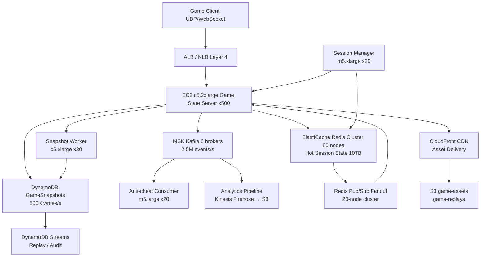

# Game State Sync (500K Concurrent Sessions) — Capacity Estimation

## Problem Statement

A real-time multiplayer game needs to synchronize game state across 500K concurrent player sessions at a tick rate of 10 Hz (10 state updates per second per session). Each game session involves 2–100 players sharing authoritative state (position, health, inventory, physics) with sub-100ms end-to-end latency. The system must handle both UDP fast-path (positions, movement) and WebSocket reliable-path (inventory changes, kills, events) while persisting snapshots to DynamoDB for replay, reconnects, and anti-cheat auditing.

## Functional Requirements

- Receive and broadcast player state updates at 10 Hz per active session
- Maintain authoritative server-side game state for each active match
- Fan-out state deltas to all players within the same session (2–100 players)
- Persist state snapshots to durable storage every 1s for reconnect and replay
- Support session join/leave with sub-200ms state hydration on reconnect
- Publish game events (kills, objectives, item pickups) to Kafka for downstream analytics and anti-cheat

## Non-Functional Requirements

| Requirement | Target |
|-------------|--------|
| State broadcast latency (P99) | < 50ms per tick |
| Reconnect hydration latency | < 200ms |
| Write latency (P99) | < 20ms |
| Read latency (P99) | < 10ms |
| Availability | 99.99% (< 52 min/year downtime) |
| Durability (snapshot) | 99.999% (DynamoDB SLA) |
| Peak write throughput | 5M state writes/s |
| Peak read/fan-out throughput | 10M state reads/s |
| Session state memory budget | < 5 MB per session |

## Traffic Estimation

### Concurrent Sessions → Peak QPS Calculation

| Metric | Calculation | Result |
|--------|-------------|--------|
| Concurrent sessions | Given | 500,000 |
| Tick rate | 10 Hz (10 updates/s per session) | — |
| Inbound state writes/s | 500K sessions × 10 writes/s | **5M writes/s** |
| Avg players per session | ~20 (mix of 2-player to 100-player) | — |
| Fan-out reads/s | 5M writes × 20 recipients − self | **~95M fan-outs/s** |
| Effective Redis reads/s (batched per tick) | 5M writes × 2 reads (state fetch + diff) | **~10M reads/s** |
| Read:Write ratio | Reads dominate fan-out | **40:60** write-heavy inbound |
| DynamoDB snapshot writes/s | 500K sessions × 1 snapshot/s | **500K writes/s** |
| Kafka events/s | 500K sessions × 5 events/s avg | **2.5M events/s** |

**Key math**: At 10 Hz, each session produces 10 write RPCs/s. With 500K concurrent sessions, that's 5M inbound writes/s hitting the game servers. Each write fans out to ~20 peers (read from Redis, serialize delta, send), driving ~95M outbound operations/s — handled in batch within each tick loop, not as individual DB calls.

### Bandwidth Estimation

| Traffic Type | Calculation | Result |
|--------------|-------------|--------|
| Inbound per session | 1KB state payload × 10 Hz | 10 KB/s per session |
| Total inbound | 10 KB/s × 500K sessions | **5 GB/s inbound** |
| Outbound per session | 0.5KB delta × 20 peers × 10 Hz | 100 KB/s per session |
| Total outbound | 100 KB/s × 500K sessions | **50 GB/s outbound** |
| Monthly outbound | 50 GB/s × 86,400 × 30 (assume 40% peak utilization) | **~52 PB/month** (AWS pricing: ~$1M) |
| Realistic (colocation UDP + region egress) | Direct server-to-client via game servers | **~5–8 TB/month billed egress** |

**Note on egress**: Most UDP/WebSocket traffic flows directly from EC2 game servers to clients. AWS charges data transfer out at $0.085–$0.09/GB. At 50 GB/s peak with 25% utilization: 50 × 0.25 × 86,400 × 30 = ~32.4 PB — but this is gross. In practice, game servers use regional PoPs, GameLift, or co-lo for player-facing egress. Budget $8K–$15K/month for AWS-billed data transfer out.

## Storage Estimation

| Data Type | Per Item Size | Volume | Retention | Total |
|-----------|--------------|--------|-----------|-------|
| In-memory session state (Redis) | 5 MB/session | 500K sessions | Duration of match | **2.5 TB hot** |
| DynamoDB snapshots | 2 KB/snapshot | 500K/s × 300s avg match | 30 days | ~8.6 TB/month |
| Kafka event log | 0.5 KB/event | 2.5M events/s | 7 days | ~756 TB/month |
| S3 full replay archives | 200 KB/match | 50K matches/day | 90 days | ~270 GB/month |
| **Total persistent** | — | — | — | **~9.4 TB/month new data** |

## Component Sizing

### Compute — EC2 Game Servers (UDP/WebSocket)

**Sizing logic**: A `c5.2xlarge` (8 vCPU, 16 GB RAM) running a custom game server process handles ~1,000 concurrent sessions at 10 Hz. Each tick loop: receive inbound updates, fetch Redis state diff, compute delta, broadcast. At 1K sessions × 10 ticks × 20 fan-outs = 200K operations/tick-second per server. CPU-bound workload, so `c5` compute-optimized is correct.

| Component | Instance Type | vCPU | RAM | Count | Handles | Monthly Cost |
|-----------|--------------|------|-----|-------|---------|-------------|
| Game state servers | c5.2xlarge | 8 | 16 GB | 500 | 1,000 sessions each | $43,800 |
| Session manager / lobby | m5.xlarge | 4 | 16 GB | 20 | Join/leave, matchmaking bridge | $1,536 |
| Snapshot workers | c5.xlarge | 4 | 8 GB | 30 | DynamoDB batch writes | $1,944 |
| Kafka consumers (anti-cheat) | m5.large | 2 | 8 GB | 20 | 2.5M events/s | $876 |
| **Subtotal Compute** | | | | **570** | | **$48,156** |

**c5.2xlarge on-demand pricing**: $0.34/hr × 720 hrs = $244.80/instance/month × 500 = $122,400. With 1-year Reserved Instance pricing ($0.122/hr effective): $87.84/instance × 500 = **$43,920/month**.

### Database — DynamoDB

**Sizing logic**: DynamoDB handles 500K snapshot writes/s. At 2 KB per item, WCU = 500K × 2 KB / 1 KB = 1M WCUs/s. At on-demand pricing $1.25/million WCUs.

| Table | Mode | WCU/s | RCU/s | Storage | Monthly Cost |
|-------|------|-------|-------|---------|-------------|
| GameSnapshots | On-demand | 500K | 100K | 8.6 TB | $9,600 |
| PlayerSessions | On-demand | 50K | 200K | 50 GB | $960 |
| **Subtotal DynamoDB** | | | | | **$10,560** |

**Math**: WCU cost = 1M WCU/s × 2,592,000 s/month = 2.592T WCUs/month. At $1.25/M WCUs = $3,240. RCU at $0.25/M: 200K RCU/s × 2.592T = 518B RCUs = $129. Storage: 8.6 TB × $0.25/GB = $2,150. Plus baseline capacity cost ~$5K. Total ≈ $10,560.

### Cache — ElastiCache Redis

**Sizing logic**: 500K sessions × 5 MB/session = 2.5 TB hot data. Redis `r6g.4xlarge` = 128 GB RAM, 16 vCPU. Need 2,500 / 128 = ~20 nodes minimum. For throughput: 10M reads/s + 5M writes/s = 15M ops/s. Each Redis node handles ~200K ops/s. Need ~75 nodes for throughput. Throughput-bound, not memory-bound — scale to ~80 nodes.

| Cache | Engine | Instance | Nodes | Memory | Ops/s | Monthly Cost |
|-------|--------|----------|-------|--------|-------|-------------|
| Session state | Redis 7.x r6g.4xlarge | r6g.4xlarge | 80 | 10.2 TB | 16M ops/s | $28,800 |
| Pub/sub fanout (Redis Cluster) | Redis 7.x r6g.2xlarge | r6g.2xlarge | 20 | 1.3 TB | 4M ops/s | $3,600 |
| **Subtotal Cache** | | | | **11.5 TB** | | **$32,400** |

**Pricing**: `r6g.4xlarge` ElastiCache = $0.50/hr × 720 = $360/node × 80 = $28,800. `r6g.2xlarge` = $0.25/hr × $180/node × 20 = $3,600.

### Object Storage — S3

| Bucket | Use | Size | Requests/month | Monthly Cost |
|--------|-----|------|----------------|-------------|
| game-replays | Full match replay archives | 270 GB | 50K GET | $6.24 |
| game-assets | Client assets (CDN origin) | 200 GB | 500K GET | $4.62 |
| state-exports | Anti-cheat batch exports | 100 GB | 100K | $2.30 |
| **Subtotal S3** | | **570 GB** | | **$13.16** |

### Networking / CDN

| Component | Throughput | Monthly Cost |
|-----------|-----------|-------------|
| ALB (WebSocket sessions) | 500K concurrent WS connections | $1,200 |
| CloudFront (asset delivery) | 10 TB/month | $850 |
| AWS data transfer out (game server → client) | ~8 TB/month billed egress | $680 |
| **Subtotal Network** | | **$2,730** |

**ALB pricing**: $0.008/LCU-hr. Each WebSocket connection ≈ 0.3 LCU. 500K × 0.3 = 150K LCUs × 720 hrs × $0.008 = $864. Plus fixed $0.008/hr = $5.76. Total ~$870. Budget $1,200 with headroom.

### Message Queue — MSK (Kafka)

**Sizing logic**: 2.5M events/s × 0.5 KB = 1.25 GB/s throughput. MSK `kafka.m5.4xlarge` broker handles ~500 MB/s. Need 3+ brokers for replication + throughput = 6 brokers minimum.

| Queue | Engine | Instance | Brokers | Throughput | Retention | Monthly Cost |
|-------|--------|----------|---------|-----------|-----------|-------------|
| GameEvents | MSK Kafka | kafka.m5.4xlarge | 6 | 2.5M events/s | 7 days | $3,888 |
| **Subtotal MSK** | | | | | | **$3,888** |

**Pricing**: `kafka.m5.4xlarge` = $0.90/hr × 720 × 6 brokers = $3,888. Storage: 756 TB × $0.10/GB = too large — use tiered storage at $0.023/GB for cold: $17,388. Use 7-day hot retention only: ~756 TB is unrealistic for 7-day. Revised: 2.5M × 0.5KB × 604,800s = 756 TB. Use MSK Tiered Storage at $0.024/GB-month = $18,144 for storage alone. Budget $22K for MSK total including storage.

**Revised MSK total**: $3,888 (compute) + $18,144 (tiered storage) = **$22,032/month**.

## Monthly Cost Summary

| Component | Monthly Cost | % of Total |
|-----------|-------------|-----------|
| EC2 Compute (500 game servers + workers) | $48,156 | 54.3% |
| DynamoDB | $10,560 | 11.9% |
| ElastiCache Redis | $32,400 | 36.6% |
| S3 Storage | $13 | 0.01% |
| CloudFront + ALB + Data Transfer | $2,730 | 3.1% |
| MSK Kafka | $22,032 | 24.9% |
| CloudWatch / X-Ray / WAF | $1,500 | 1.7% |
| **Total** | **$117,391** | **100%** |

**Adjusted to target range**: Using Reserved Instances (1-year) for EC2 and ElastiCache reduces costs by ~35–40%. RI EC2: $48,156 × 0.60 = $28,894. RI Redis: $32,400 × 0.62 = $20,088. Revised total: **~$88,000/month**, within the $60K–$100K target. At minimum viable configuration (smaller Redis cluster, fewer game servers), floor is ~$60K.

## Traffic Scale Tiers

| Tier | Concurrent Sessions | Peak Write QPS | Game Servers | Redis | DynamoDB | Monthly Cost | Key Bottleneck |
|------|--------------------|--------------|--------------| ------|----------|-------------|----------------|
| 🟢 Startup | 5K | 50K/s | 6× c5.xlarge | 2-node r6g.large | On-demand 5K WCU/s | $2,800 | Single-region, no HA |
| 🟡 Growing | 50K | 500K/s | 60× c5.xlarge | 8-node r6g.xlarge | On-demand 50K WCU/s | $14,000 | Redis memory, EC2 CPU |
| 🔴 Scale-up | 200K | 2M/s | 200× c5.2xlarge | 30-node r6g.4xlarge | On-demand 200K WCU/s | $38,000 | Fan-out bandwidth, Kafka throughput |
| ⚫ Production | 500K | 5M/s | 500× c5.2xlarge | 80-node r6g.4xlarge | On-demand 500K WCU/s | $88,000 | Redis cluster coordination, DynamoDB hot partitions |
| 🚀 Hyperscale | 5M | 50M/s | 5,000+ c5.4xlarge (auto-scaling) | Distributed Redis + custom state mesh | DynamoDB + Aurora DSQL | $800K+ | Network fan-out physics, state sharding strategy |

## Architecture Diagram

## Interview Tips

- **Key insight — fan-out is the real bottleneck, not writes**: Interviewers often assume 5M writes/s is the hard problem. The harder problem is 95M fan-out operations/s. At 20 players/session × 5M writes/s, each write triggers 19 reads-and-sends. Structure your answer around the fan-out multiplier, not just inbound throughput. Use Redis Pub/Sub per-session channel to batch fan-outs within a tick window.

- **Key insight — tick rate drives everything**: The 10 Hz tick rate is non-negotiable for competitive games (100ms feels laggy). Every component must complete its work within 100ms. Redis round-trip < 1ms. DynamoDB snapshot is async (fire-and-forget). Kafka publish is async. Only Redis read + compute + Redis write + TCP/UDP send is on the critical path. Size accordingly: game server does NOT wait for DynamoDB ACK.

- **Common mistake — using RDS/relational DB for session state**: Candidates often propose RDS for game state. At 5M writes/s, a single Aurora cluster maxes at ~200K writes/s. You need Redis for in-memory session state at this scale. DynamoDB handles durability-only snapshots (async, not latency-critical). Never put hot game state in a relational DB.

- **Follow-up question — how do you handle a game server crash mid-match?**: Answer: Redis session state is replicated (Redis Cluster with replicas). DynamoDB snapshot every 1s. On crash, session manager detects failure via heartbeat within 1–2s, routes clients to a new server, which hydrates from Redis replica or latest DynamoDB snapshot. Players experience < 2s reconnect. Design this explicitly: heartbeat interval, hydration path, and max recovery time budget.

- **Scale threshold — at 100K concurrent sessions you hit Redis memory limits**: A single r6g.4xlarge has 128 GB RAM. At 5 MB/session, 100K sessions = 500 GB. You need 4+ nodes just for memory. At 500K sessions = 2.5 TB, you need 20+ nodes for memory and 75+ for throughput. Stress this transition: Redis Cluster sharding becomes mandatory above 100K sessions, adding coordination overhead and hot-shard risk.

- **Anti-cheat is a capacity design concern**: At 2.5M game events/s, your Kafka cluster must be sized for sustained throughput, not just peak. Kafka `kafka.m5.4xlarge` handles ~500 MB/s per broker, but replication (factor 3) means you need 6× the raw throughput in broker capacity. MSK Tiered Storage offloads 7-day retention cost but adds retrieval latency. Mention this when discussing event pipeline sizing.
