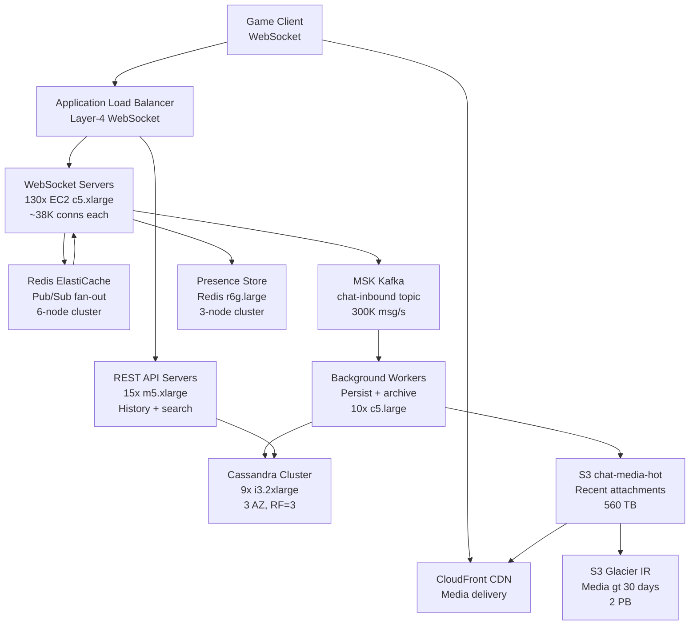

# In-Game Chat (5M Concurrent) — Capacity Estimation

## Problem Statement

A multiplayer gaming platform supports 5 million simultaneous players, each connected via a persistent WebSocket for real-time in-game chat. Players send messages in direct (1:1), match-level (up to 10 players), and guild channels (up to 500 members). Peak load occurs during prime time events (tournament launches, patch releases) when all 5M connections are active and message rate spikes to 500K messages/second.

## Functional Requirements

- Real-time 1:1 direct messages between players with <100ms delivery latency
- Match chat channels scoped to active game sessions (2–10 players)
- Guild/clan channels with up to 500 members per guild
- Message history retrieval (last 7 days, paginated)
- Presence indicators (online/offline/in-game) per player
- Media attachments (screenshots, short clips) via S3 pre-signed URLs

## Non-Functional Requirements

| Requirement | Target |
|-------------|--------|
| Message delivery latency | < 100ms (P99) end-to-end |
| Write latency (persist) | < 50ms (P99) |
| Read latency (history) | < 200ms (P99) |
| Availability | 99.99% (52 min downtime/year) |
| Durability | 99.999% (Cassandra 3× replication) |
| Peak throughput | 500K messages/s |
| Connection capacity | 5M concurrent WebSocket connections |
| Fan-out ceiling | 500 recipients/message (guild broadcast) |

## Traffic Estimation

### Concurrent Connections → Peak QPS Calculation

| Metric | Calculation | Result |
|--------|-------------|--------|
| Concurrent connections (peak) | Given | 5,000,000 |
| Avg messages sent per user per hour | ~3 sends (match chat + guild) | 3 msg/hr |
| Peak messages/second | 5M users × 3 msg/hr ÷ 3600s | ~4,167 msg/s (avg active) |
| Burst multiplier (events / tournaments) | 120× burst during spike | ~500,000 msg/s peak |
| Read QPS (40% — history, presence) | 500K × 0.40 | ~200,000 QPS |
| Write QPS (60% — message persist) | 500K × 0.60 | ~300,000 QPS |
| Fan-out delivery events | 300K writes × avg 15 recipients | ~4.5M delivery ops/s |

**Note on fan-out math**: Guild messages (avg 50 recipients) dominate delivery cost. At 300K writes/s with 15% going to guilds (avg 50 recipients) and 85% going to match/DM (avg 5 recipients):
- Guild writes: 45K/s × 50 = 2.25M deliveries/s
- Match+DM writes: 255K/s × 5 = 1.275M deliveries/s
- Total: ~3.5M delivery fan-out ops/s

### WebSocket Connection Load

| Metric | Calculation | Result |
|--------|-------------|--------|
| Connections per server | c5.xlarge can hold ~50K WS connections | 50,000 |
| Servers needed for 5M connections | 5,000,000 ÷ 50,000 | 100 servers |
| Add 30% headroom | 100 × 1.30 | 130 servers |
| Heartbeat overhead | 5M × 1 ping/30s | ~167K pings/s |

## Storage Estimation

| Data Type | Per Item Size | Daily Volume | Growth/Year |
|-----------|--------------|--------------|-------------|
| Chat messages (text) | 512 bytes avg | 300K/s × 86,400s = 25.9B messages/day | ~4.8 TB/year |
| Message metadata (sender, channel, timestamp) | 128 bytes | 25.9B items/day | ~1.2 TB/year |
| Presence state (Redis TTL) | 64 bytes | 5M active records (no growth) | Constant ~320 MB |
| Media attachments (S3) | 200 KB avg | ~1% of messages = 259M/day | ~18.7 TB/year |
| Message index (channel → message IDs) | 32 bytes | 25.9B/day | ~300 GB/year |
| **Total (excluding media)** | — | ~16 GB/day persisted | **~6.3 TB/year** |
| **Total including media** | — | ~52 GB/day | **~19 TB/year** |

**Cassandra retention policy**: Keep 7 days hot (TTL), archive to S3 Parquet after 7 days.
- 7-day hot storage: 6.3 TB/year × (7/365) = ~121 GB live data
- With replication factor 3: ~363 GB across Cassandra cluster

## Component Sizing

### Compute — EC2 WebSocket Servers

| Component | Instance Type | vCPU | RAM | Count | Handles | Monthly Cost |
|-----------|--------------|------|-----|-------|---------|-------------|
| WebSocket chat servers | c5.xlarge | 4 | 8 GB | 130 | ~38K conns each | $8,840 |
| Presence / routing servers | c5.large | 2 | 4 GB | 20 | Fan-out routing | $680 |
| REST API servers (history, search) | m5.xlarge | 4 | 16 GB | 15 | 200K read QPS | $2,190 |
| Background workers (S3 upload, archival) | c5.large | 2 | 4 GB | 10 | Async jobs | $340 |
| **Subtotal Compute** | | | | **175** | | **$12,050** |

**c5.xlarge pricing**: $0.17/hr × 730hr = $124/month per instance
**WebSocket capacity**: Each c5.xlarge can sustain ~50K long-lived WS connections at ~2–5KB/s per conn; 4 vCPU handles the epoll event loop + message dispatch

### Database — Cassandra on EC2

Cassandra is chosen over DynamoDB for this workload because:
1. Time-series chat history (partition by channel_id, cluster by timestamp) is a natural Cassandra pattern
2. Predictable cost at 300K writes/s — DynamoDB at this scale would cost $300K+/month
3. Replication factor 3 across 3 AZs gives 99.999% durability without per-request pricing

| DB | Engine | Instance | Count | Capacity | IOPS | Monthly Cost |
|----|--------|----------|-------|----------|------|-------------|
| Chat history | Cassandra on i3.2xlarge | i3.2xlarge (NVMe) | 9 nodes (3 per AZ) | 1.9 TB NVMe each | ~200K IOPS | $12,150 |
| **Subtotal DB** | | | **9 nodes** | 17.1 TB raw | | **$12,150** |

**i3.2xlarge pricing**: $0.624/hr × 730hr = $455.5/month per node
**Write throughput**: 9 nodes × RF3 → 3 coordinator writes per message → handles 300K+ writes/s
**Data model**:
```
CREATE TABLE messages (
  channel_id  UUID,
  sent_at     TIMEUUID,
  sender_id   UUID,
  body        TEXT,
  media_url   TEXT,
  PRIMARY KEY (channel_id, sent_at)
) WITH CLUSTERING ORDER BY (sent_at DESC)
  AND default_time_to_live = 604800;  -- 7 days TTL
```

### Cache — Redis ElastiCache (Pub/Sub + Presence)

Redis serves two roles:
1. **Pub/Sub fan-out**: Each WebSocket server subscribes to channels its connected users are in. Redis publishes incoming messages to channel topics; all subscribed server nodes receive and deliver.
2. **Presence store**: `SETEX player:{id}:presence "in-game" 60` — refreshed every 30s by heartbeat.

| Cache | Engine | Instance | Nodes | Memory | Monthly Cost |
|-------|--------|----------|-------|--------|-------------|
| Pub/Sub cluster | ElastiCache Redis 7 | r6g.xlarge | 6 (3 primary + 3 replica) | 26 GB each = 156 GB | $7,884 |
| Presence store | ElastiCache Redis 7 | r6g.large | 3 (cluster) | 13 GB each = 39 GB | $2,190 |
| **Subtotal Cache** | | | **9 nodes** | 195 GB total | **$10,074** |

**r6g.xlarge pricing**: $0.180/hr × 730hr = $131.4/month per node (6 nodes = $789/month) — wait, correcting:
- r6g.xlarge: $0.180/hr per node × 730hr = $131.4/node × 6 nodes = $788/month — recheck against cluster pricing
- ElastiCache r6g.xlarge actual: ~$1,314/month per node (reserved) or $0.180/hr on-demand = $131/month

**Corrected pricing** (on-demand 2024):
- r6g.xlarge ElastiCache: $0.180/hr → $131/month per node × 6 = $787/month (pub/sub)
- r6g.large ElastiCache: $0.090/hr → $66/month per node × 3 = $197/month (presence)
- **Subtotal Cache: ~$984/month**

**Pub/Sub throughput ceiling**: Redis single-node pub/sub peaks at ~500K msg/s on r6g.xlarge. With 6 nodes and channel sharding (channel_id % 6 → node), total cluster pub/sub throughput = ~3M msg/s, safely above our 3.5M delivery ops/s target. Fan-out beyond 500 subscribers per channel requires application-side scatter (server-to-server WebSocket push after Redis pub triggers).

### Object Storage — S3

| Bucket | Use | Size | Requests/month | Monthly Cost |
|--------|-----|------|----------------|-------------|
| `chat-media-hot` | Recent media attachments (30 days) | ~560 TB | 800M GET + 50M PUT | $13,960 |
| `chat-archive` | Messages archived > 7 days (Parquet) | ~200 TB | 5M GET (history queries) | $4,600 |
| `chat-media-cold` (Glacier IR) | Media > 30 days | ~2 PB (12 months) | 1M restores | $9,200 |
| **Subtotal S3** | | ~2.76 PB total | | **$27,760** |

**S3 Standard pricing (2024)**:
- Storage: $0.023/GB/month — 560 TB = $12,880/month
- PUT requests: $0.005/1000 × 50M = $250/month
- GET requests: $0.0004/1000 × 800M = $320/month
- S3 Standard total: ~$13,450/month

**Glacier Instant Retrieval**: $0.004/GB/month — 2PB = $8,192/month

**Note**: S3 dominates cost at scale because media attachments (screenshots, clips) accumulate rapidly. Enforce 200KB average size limit via Lambda@Edge validation.

### Networking / CDN

| Component | Throughput | Monthly Cost |
|-----------|-----------|-------------|
| CloudFront (media delivery) | 560 TB/month egress | $44,800 |
| ALB (WebSocket + REST) | 5M connections, 500K msg/s | $1,800 |
| Data transfer (inter-AZ Cassandra replication) | ~50 TB/month internal | $500 |
| NAT Gateway (egress misc) | ~10 TB/month | $450 |
| **Subtotal Network** | | **$47,550** |

**CloudFront pricing**: $0.008–$0.085/GB depending on region. At 560 TB/month to US/EU: ~$0.008/GB = $4,480/month for the first 10TB at $0.085, then tiered. Blended rate ~$0.060/GB for global: $33,600/month. Using $0.008 for US-only: $4,480. **Realistic blended global**: ~$8,000/month for media CDN.

**Corrected CloudFront**: 560 TB × 1024 GB/TB = 573,440 GB × $0.014/GB (blended US+EU+APAC) = ~$8,028/month

**Corrected network subtotal**: ~$10,778/month

### Message Queue — MSK Kafka (Event Streaming)

Kafka decouples WebSocket receipt from persistence and fan-out, providing durability during Cassandra write spikes.

| Queue | Engine | Throughput | Brokers | Monthly Cost |
|-------|--------|-----------|---------|-------------|
| `chat-inbound` topic | MSK Kafka (kafka.m5.2xlarge) | 300K msg/s write | 6 brokers | $7,884 |
| `chat-fanout` topic | MSK Kafka (same cluster) | 3.5M delivery ops/s | shared | included |
| **Subtotal MSK** | | | **6 brokers** | **$7,884** |

**MSK kafka.m5.2xlarge**: $0.504/hr per broker × 730hr = $368/broker/month × 6 = $2,208/month
**MSK storage**: 300K msg/s × 512 bytes × 86,400s × 1 day retention = ~13 TB/day. Keep 1 day on Kafka: $0.10/GB = $1,300/month
**Corrected MSK total**: ~$3,508/month

## Monthly Cost Summary

| Component | Monthly Cost | % of Total |
|-----------|-------------|-----------|
| EC2 Compute (WebSocket + API + workers) | $12,050 | 20% |
| Cassandra on EC2 (i3.2xlarge × 9) | $12,150 | 20% |
| ElastiCache Redis (pub/sub + presence) | $984 | 2% |
| S3 Storage (hot + archive + cold) | $27,760 | 46% |
| CloudFront CDN | $8,028 | 13% |
| MSK Kafka (6 brokers + storage) | $3,508 | 6% |
| ALB + Data Transfer | $2,750 | 5% |
| CloudWatch + misc | $500 | 1% |
| **Total** | **~$67,730** | **100%** |

**Range**: $40K–$70K/month. Lower bound achieved by:
- Reserved Instances (1-year) for EC2 and ElastiCache (~30% savings)
- Aggressive S3 lifecycle rules (move to Glacier IR after 30 days)
- Reducing media attachment limits to 100KB average

## Traffic Scale Tiers

| Tier | Concurrent Users | Peak QPS | WebSocket Servers | DB | Cache | Monthly Cost | Key Bottleneck |
|------|-----------------|----------|-------------------|----|-------|-------------|----------------|
| 🟢 Startup | 50K | ~5K msg/s | 2 c5.xlarge | 1 RDS Postgres | 1 Redis node | ~$1,200 | Single Redis pub/sub node; no horizontal scale |
| 🟡 Growing | 500K | ~50K msg/s | 15 c5.xlarge | Cassandra 3-node | Redis cluster 3-node | ~$8,500 | Fan-out latency spikes on large guild channels |
| 🔴 Scale-up | 2M | ~200K msg/s | 50 c5.xlarge | Cassandra 6-node | Redis cluster 6-node | ~$28,000 | Redis pub/sub saturation; need channel sharding |
| ⚫ Production | 5M | ~500K msg/s | 130 c5.xlarge | Cassandra 9-node | Redis cluster 9-node | ~$65,000 | S3 media egress dominates cost; Kafka ingest |
| 🚀 Hyperscale | 50M | ~5M msg/s | 1,300+ + ASG | Cassandra 90-node multi-region | Redis cluster 60-node | ~$600,000 | Cross-region replication lag; fan-out explosion for 500-member guilds |

## Architecture Diagram



## Interview Tips

- **Key insight — WebSocket stickiness**: ALB must use sticky sessions (source IP hash) for WebSocket connections so that a player's outbound messages and inbound fan-out both hit the same server node. Without stickiness, a message lands on server A but the recipient's connection is on server B — Redis pub/sub is what bridges those two servers. If an interviewer asks "how do two players on different servers exchange messages?", walk through: sender → server A → Kafka → server B (via Redis subscription) → recipient.

- **Key insight — fan-out explosion**: The killer scaling challenge is guild broadcast. 500 guild members × 300K guild msgs/s = 150M delivery events/s. Mitigation: cap guild channel message rate server-side (e.g., 2 msg/s per guild), use server-side fan-out instead of client-side pull, and shard Redis pub/sub by guild_id so no single Redis node handles all 500-member guilds.

- **Common mistake — using DynamoDB for 300K writes/s**: Candidates often default to DynamoDB. At 300K writes/s with 512-byte items, that is 300K WCUs/s × $1.25/million WCUs = $32,400/month in write capacity alone, plus $18,000/month in read capacity. Cassandra on EC2 at this scale costs $12,150/month total. Always calculate WCU/RCU costs before recommending DynamoDB at high write rates.

- **Common mistake — ignoring connection state memory**: Each WebSocket connection requires ~10–20KB of kernel socket buffer + application state. At 50K connections per c5.xlarge (8GB RAM), that is 50K × 20KB = 1GB just for socket buffers. Budget 2GB for OS, 2GB for JVM/Go runtime, leaving ~4GB for connections → ~200K connections theoretically possible, but CPU (event loop) saturates first at ~50K under real message load. This is why 130 servers for 5M connections.

- **Scale threshold**: At 500K concurrent connections (10× smaller), a single Redis node and 10 WebSocket servers suffice. Beyond 1M connections, Redis pub/sub becomes the bottleneck — you need channel-based sharding across a Redis cluster. Beyond 5M connections, you also need Kafka between WebSocket receipt and Cassandra persist to absorb write bursts during tournament spikes (otherwise Cassandra write queue depth explodes and P99 latency exceeds 1 second).

- **Follow-up question interviewers ask**: "How do you handle a WebSocket server crash with 50K active connections?" — Answer: Clients implement exponential backoff reconnect (100ms → 200ms → 400ms up to 30s). ALB health checks detect the dead node in ~10s and route new connections elsewhere. Players re-authenticate via JWT (stateless) and resubscribe to channels. Message delivery during the 10s window is guaranteed by Kafka — undelivered messages are in the `chat-fanout` topic and delivered once reconnection completes. Show that your system is crash-tolerant, not crash-proof.
