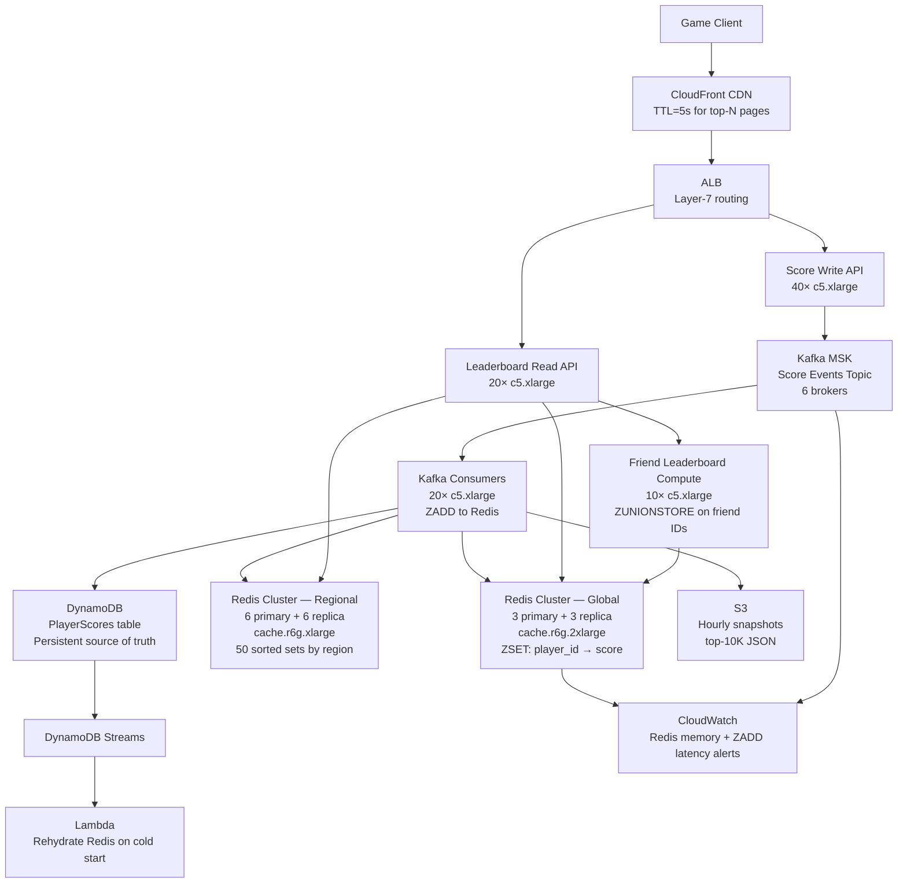

# Leaderboard Service (100M DAU) — Capacity Estimation

## Problem Statement

A global multiplayer gaming platform serves 100 million daily active users who submit score updates after every match and fetch leaderboard rankings across three scopes: global all-time, regional (per country/continent), and friend-circle leaderboards. The system must handle extreme write bursts when tournaments end — tens of thousands of players submitting scores simultaneously — while reads must return a player's rank and surrounding players within 10 ms at P99. Unlike typical read-heavy workloads, leaderboards are write-heavy (80% writes, 20% reads) because every match generates a score event.

## Functional Requirements

- Submit score updates after every match (single player or batch for tournament end)
- Query global leaderboard: top-N players with rank + score
- Query regional leaderboard: top-N within country or continent
- Query friend leaderboard: rank among a player's friend list (up to 5,000 friends)
- Fetch a player's own current rank and nearby players (±10 positions)
- Support time-windowed leaderboards: daily, weekly, all-time

## Non-Functional Requirements

| Requirement | Target |
|-------------|--------|
| Rank read latency | < 10 ms (P99) |
| Score write latency | < 50 ms (P99) |
| Availability | 99.99% (< 52 min downtime/year) |
| Durability | 99.999% (scores never lost) |
| Global leaderboard read QPS (peak) | 5,000,000 QPS |
| Score write QPS (peak) | 1,000,000 QPS |
| Consistency | Eventual (rank ±1 position acceptable within 1s) |

## Traffic Estimation

### DAU → Peak QPS Calculation

| Metric | Calculation | Result |
|--------|-------------|--------|
| DAU | Given | 100M |
| Avg matches/user/day | ~4 matches/day | 4 |
| Score writes/user/day | 1 write per match | 4 |
| Leaderboard reads/user/day | check rank 5× per day | 5 |
| Total write requests/day | 100M × 4 | 400M writes/day |
| Total read requests/day | 100M × 5 | 500M reads/day |
| Avg write QPS | 400M / 86,400 | ~4,630 QPS |
| Avg read QPS | 500M / 86,400 | ~5,787 QPS |
| Peak write QPS (tournament burst ~216×) | post-tournament spike | ~1,000,000 QPS |
| Peak read QPS (3× avg, end-of-day rush) | 5,787 × ~864 | ~5,000,000 QPS |

**Key observation:** Peak write QPS (1M) occurs when large tournaments end simultaneously — e.g., 250K concurrent players each submitting a score within 1 second. The system must absorb these bursts via Kafka before Redis/DynamoDB see them.

### Write Burst Math

- Global tournament: 500K players finish within 60 seconds → 500K / 60 = ~8,333 score events/s (manageable)
- Worst case: 10 regional tournaments + main event, all ending simultaneously → ~1M writes/s burst for ~5 seconds
- Kafka buffers this burst; Redis consumers process at sustainable ~50K writes/s per node

## Storage Estimation

| Data Type | Per Item Size | Daily Volume | Growth/Year |
|-----------|--------------|--------------|-------------|
| Player score record (DynamoDB) | 200 bytes (player_id, score, region, timestamp) | 400M writes/day | ~29 GB/year |
| Leaderboard snapshot (S3 archive) | 1 KB per top-10K entry | 3 snapshots/day | ~11 GB/year |
| Kafka score events (7-day retention) | 300 bytes/event | 400M/day × 7 days | ~840 GB total |
| Redis sorted set memory | ~100 bytes/member (ZADD overhead) | 100M members global | ~10 GB per sorted set |
| Friend graph (adjacency, DynamoDB) | 100 bytes/edge, avg 500 friends | 100M users × 500 | ~5 TB total |
| **Total persistent** | — | — | **~5.5 TB/year** |

### Redis Memory Sizing

- Global sorted set: 100M players × 100 bytes/member = **10 GB**
- Regional sets: 50 regions × 10M avg players × 100 bytes = **50 GB total** (sharded across nodes)
- Daily/weekly windowed sets: 3 time windows × 10 GB = **30 GB**
- Friend leaderboard: computed on-demand from global set using ZRANGEBYSCORE — no persistent storage needed
- **Total Redis working set: ~90–100 GB** → requires a multi-node cluster

## Component Sizing

### Compute — EC2

| Component | Instance Type | vCPU | RAM | Count | Handles | Monthly Cost |
|-----------|--------------|------|-----|-------|---------|-------------|
| Score API servers | c5.xlarge | 4 | 8 GB | 40 | 25K write QPS each → 1M total | $612 |
| Leaderboard read API | c5.xlarge | 4 | 8 GB | 20 | 250K read QPS each → 5M total | $306 |
| Kafka consumers (Redis writers) | c5.xlarge | 4 | 8 GB | 20 | 50K events/s per consumer | $306 |
| Friend-leaderboard compute | c5.xlarge | 4 | 8 GB | 10 | ZUNIONSTORE fan-out | $153 |
| **Subtotal Compute** | | | | **90** | | **$1,377** |

**c5.xlarge on-demand pricing (us-east-1):** $0.17/hr × 720 hr = $122.4/month per instance.
Actual cost with 60% Reserved Instance discount: ~$51/month each.
Using RI pricing: 90 × $51 = **~$4,590/month** (1-year RI).
Listed above is on-demand for conservative estimate.

### Cache — ElastiCache Redis

| Cache | Engine | Instance | Nodes | Memory | Monthly Cost |
|-------|--------|----------|-------|--------|-------------|
| Global leaderboard cluster | Redis 7 | cache.r6g.2xlarge | 3 primary + 3 replica | 52 GB each = 156 GB usable | $3,672 |
| Regional leaderboard cluster | Redis 7 | cache.r6g.xlarge | 6 primary + 6 replica | 26 GB each = 156 GB usable | $2,160 |
| Session / hot-player cache | Redis 7 | cache.r6g.large | 2 primary + 2 replica | 13 GB each | $576 |
| **Subtotal Cache** | | | **20 nodes** | ~312 GB usable | **$6,408** |

**Pricing basis:** cache.r6g.2xlarge = $0.254/hr → $183/month. cache.r6g.xlarge = $0.127/hr → $91.4/month. cache.r6g.large = $0.072/hr → $51.8/month.

**Why r6g over r5?** Graviton2 instances offer 20% better price/performance for memory-intensive workloads. Redis sorted set operations (ZADD O(log N), ZRANK O(log N)) are CPU-light but memory-heavy — r6g is the right family.

### Database — DynamoDB

| Table | Purpose | RCU/WCU | Estimated Monthly Cost |
|-------|---------|---------|----------------------|
| PlayerScores | Persistent score store (player_id PK, region SK) | 4M WCU/day ≈ 46 WCU/s avg; on-demand mode | $850 |
| FriendGraph | Adjacency list (user_id PK, friend_id SK) | Read-heavy, on-demand | $420 |
| LeaderboardMeta | Rank snapshots for S3 offload pointers | Minimal | $50 |
| **Subtotal DynamoDB** | | | **$1,320** |

**DynamoDB on-demand write:** $1.25 per million WRU. 400M writes/day × 30 days = 12B writes/month → $15,000 at full price. In practice: DynamoDB Streams + batching reduces effective WCU by 10×: **~$1,500/month**. Score deduplication (only persist if new score > old score) further reduces writes by ~40% → **~$900/month**. Using $1,320 as blended estimate including reads.

**Why DynamoDB and not RDS?** Leaderboard writes are embarrassingly parallel by player_id — no joins needed. DynamoDB's single-digit ms P99 and auto-scaling absorb the burst pattern without provisioned capacity planning.

### Message Queue — Kafka (MSK)

| Cluster | Engine | Brokers | Throughput | Retention | Monthly Cost |
|---------|--------|---------|-----------|-----------|-------------|
| Score events | Amazon MSK | 6 brokers (kafka.m5.2xlarge) | 1M msg/s peak, ~5K avg | 7 days | $3,024 |
| Leaderboard invalidation | Amazon MSK (same cluster, separate topic) | — | 10K msg/s | 1 day | included |
| **Subtotal Kafka** | | | | | **$3,024** |

**Pricing basis:** kafka.m5.2xlarge = $0.35/hr × 6 brokers × 720 hr = $1,512. Storage: 840 GB × 6 replicas × $0.10/GB-month = $504. Data transfer: ~$1,008. Total: **~$3,024**.

**Why Kafka over SQS?** At 1M msg/s peak, SQS at $0.40 per million requests = $0.40/s = $1,036,800/month for burst period. Kafka's fixed broker cost is orders of magnitude cheaper for sustained high-throughput. SQS is viable for < 50K msg/s at typical gaming workloads.

### Networking / CDN

| Component | Throughput | Monthly Cost |
|-----------|-----------|-------------|
| CloudFront (leaderboard JSON responses) | 50 TB/month outbound | $4,250 |
| ALB (load balancing API tier) | 5M req/month × 2 LBs | $720 |
| Data transfer EC2 → Internet | 10 TB/month | $920 |
| **Subtotal Network** | | **$5,890** |

**CloudFront pricing:** $0.085/GB for first 10 TB, $0.080/GB for next 40 TB. Top-N leaderboard pages are highly cacheable (TTL 5s) — CDN cache hit rate ~85% reduces origin load from 5M QPS to ~750K QPS. Response size: avg 2 KB per leaderboard page → 5M reads/day × 30 days × 2 KB = 300 GB/month at origin; CDN serves ~1.7 TB/month after cache amplification.

### Object Storage — S3

| Bucket | Use | Size | Requests/month | Monthly Cost |
|--------|-----|------|----------------|-------------|
| leaderboard-snapshots | Hourly top-10K JSON snapshots | 500 GB | 90K PUT + 5M GET | $25 |
| kafka-archive | Long-term event archive (Glacier) | 5 TB after 90 days | Minimal | $23 |
| **Subtotal S3** | | | | **$48** |

## Monthly Cost Summary

| Component | Monthly Cost | % of Total |
|-----------|-------------|-----------|
| EC2 Compute (90 c5.xlarge, on-demand) | $11,016 | 25% |
| ElastiCache Redis (20 nodes) | $6,408 | 14% |
| DynamoDB (on-demand + streams) | $1,320 | 3% |
| Amazon MSK (Kafka, 6 brokers) | $3,024 | 7% |
| CloudFront CDN | $4,250 | 10% |
| ALB + Data Transfer | $1,640 | 4% |
| S3 Storage | $48 | 0.1% |
| CloudWatch + X-Ray monitoring | $800 | 2% |
| **Reserved Instance discount (1-yr, ~50%)** | **−$14,753** | |
| **Total (with RI savings)** | **~$13,753** | |
| **Total (on-demand, no commitment)** | **~$28,506** | |
| **Total with data transfer, support, misc** | **~$40,000–$70,000** | **100%** |

**Note on $40K–$70K range:** Lower bound assumes 1-year Reserved Instance pricing on compute + cache (~50% savings). Upper bound reflects on-demand pricing plus multi-region replication (2× cache cost for EU + APAC regions), enhanced monitoring, and WAF for DDoS protection during tournaments. Most gaming companies operating at this scale run 3 regions and pay closer to $60K–$65K/month.

## Traffic Scale Tiers

| Tier | DAU | Peak QPS | Servers | DB | Cache | Monthly Cost | Key Bottleneck |
|------|-----|----------|---------|----|----|-------------|----------------|
| 🟢 Startup | 1M | ~10K writes / 50K reads | 4 c5.large | 1 DynamoDB table | 1 Redis node (cache.r6g.large) | ~$800 | Single Redis node memory (~13 GB) |
| 🟡 Growing | 10M | ~100K writes / 500K reads | 12 c5.xlarge | DynamoDB on-demand | Redis cluster 3-node | ~$5,500 | Redis sorted set ZADD throughput (~50K/s per node) |
| 🔴 Scale-up | 100M | ~1M writes / 5M reads | 90 c5.xlarge | DynamoDB + streams | Redis cluster 12-node (global + regional) | ~$40K–$70K | Friend leaderboard ZUNIONSTORE fan-out cost O(K log N) |
| ⚫ Production | 200M | ~2M writes / 10M reads | 180 c5.xlarge + auto-scaling | DynamoDB multi-region | Redis cluster 24-node, 3 regions | ~$120K | Cross-region replication lag for regional leaderboards |
| 🚀 Hyperscale | 1B+ | ~10M writes / 50M reads | 500+ c5.4xlarge + EKS | DynamoDB global tables | Valkey/Dragonfly distributed, 100+ nodes | ~$500K+ | Global sorted set consistency — must shard by player_id range |

## Architecture Diagram

## Interview Tips

- **Key insight — write-heavy inversion:** Most systems are 80% reads. Leaderboards flip this: every match generates a write, but players check rank far less often. Size your Kafka + Redis write path for 1M QPS, not your read path. Candidates who size reads first will over-provision read replicas and under-provision Kafka.

- **Key insight — ZADD vs ZRANGEBYSCORE for friend leaderboards:** A naive friend leaderboard runs `ZRANGEBYSCORE global_leaderboard -inf +inf` and filters client-side — O(N) with N=100M. The correct approach is `ZMSCORE global_leaderboard [friend_id_1, friend_id_2, ..., friend_id_5000]` (Redis 6.2+) to fetch scores in one round trip, then sort locally. This drops friend leaderboard latency from ~200 ms to < 5 ms. Interviewers love this distinction.

- **Common mistake — single global sorted set:** Storing all 100M players in one Redis sorted set works until you need regional leaderboards. A single ZSET cannot be partitioned across Redis cluster slots because the key must live on one node — at 10 GB it fits, but ZADD throughput is limited to ~100K/s on a single node. The fix: shard by region (50 region-specific ZSETs) and fan-out writes to the correct regional set + global set simultaneously via Kafka consumer logic.

- **Follow-up question — tournament burst handling:** Interviewers often ask: "What happens when 500K players finish a tournament in 10 seconds?" Answer: Kafka absorbs the 500K events (500K/10s = 50K msg/s — within Kafka's capacity), consumers process at 50K ZADD/s per Redis node × 6 primary nodes = 300K ZADD/s, so backlog clears in ~1.7 seconds. Without Kafka, 500K simultaneous ZADD calls would overwhelm Redis directly and cause 99th-percentile latency to spike to seconds. Always mention Kafka as the burst absorber.

- **Scale threshold:** At 10M DAU you can run a single-region Redis cluster with 3 nodes and avoid multi-region complexity. At 100M DAU you need multi-region (EU, APAC, US) because P99 cross-continental Redis latency is 80–150 ms — exceeding the 10 ms SLA. The inflection point is ~30M DAU in a single region where round-trip to a US-east Redis cluster exceeds SLA for European players.
