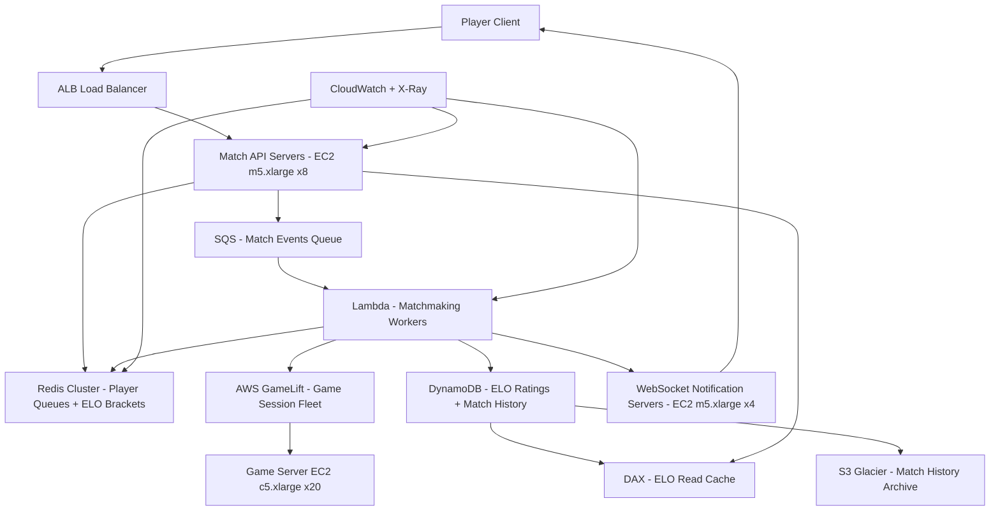

# Matchmaking Service (10M DAU) — Capacity Estimation

## Problem Statement

A skill-based matchmaking service pairs 10M daily active players into balanced lobbies using ELO ratings. Players submit match requests, the system groups them by skill bracket, assembles lobbies of 2–16 players, provisions game server sessions via AWS GameLift, and notifies all parties within seconds. The system must handle sharp concurrency spikes when primetime sessions open (evenings, weekends) and sustain 100K match-request enqueue/dequeue operations per second at peak.

## Functional Requirements

- Players submit a match request with game mode, region, and current ELO rating
- System groups players into compatible skill brackets (±150 ELO) within configurable wait-time SLAs (target: ≤10 s median)
- Lobbies of N players (2, 4, 8, or 16 depending on game mode) are assembled and a game session is provisioned on GameLift
- Players receive lobby assignment via WebSocket push or SQS notification
- ELO ratings are updated after each match outcome (write-heavy path)
- Players can cancel a pending match request (removed from queue within 500ms)

## Non-Functional Requirements

| Requirement | Target |
|-------------|--------|
| Match queue latency (enqueue) | < 50ms (P99) |
| Lobby assembly time | < 2s (P99) |
| Player notification latency | < 500ms (P99) |
| Availability | 99.99% (≤52 min/year downtime) |
| Durability (ELO/match history) | 99.999% |
| Throughput | 100K match ops/s peak |
| Match cancel propagation | < 500ms |

## Traffic Estimation

### DAU → Peak QPS Calculation

Assumptions:
- Each player averages 4 match sessions per day (casual/ranked mix)
- Each session generates: 1 enqueue + ~3 status polls + 1 lobby ack + 1 ELO update = 6 requests
- Peak-hour concurrency: 15% of DAU active in the same hour (primetime)
- Read/Write ratio: 30% reads (status checks, ELO lookups), 70% writes (enqueue, dequeue, ELO update, lobby writes)

| Metric | Calculation | Result |
|--------|-------------|--------|
| DAU | Given | 10,000,000 |
| Avg sessions/user/day | 4 sessions | 4 |
| Avg requests/session | 1 enqueue + 3 polls + 1 ack + 1 ELO write | ~6 |
| Total daily requests | 10M × 4 × 6 | 240M |
| Avg QPS (baseline) | 240M / 86,400 | ~2,778 QPS |
| Peak multiplier | primetime 15% DAU in 1 hour = 1.5M users × 6 req/hr | — |
| Peak QPS (raw) | 1.5M × 6 / 3,600 | ~2,500 QPS user traffic |
| Queue ops (enqueue + dequeue pairs) | match throughput × 2 sides × burst factor | ~100K ops/s |
| Read QPS (30% of peak queue ops) | 100K × 0.30 | ~30K QPS |
| Write QPS (70% of peak queue ops) | 100K × 0.70 | ~70K QPS |

**Key insight**: The 100K ops/s figure is queue-internal throughput (Redis ZADD/ZPOPMIN operations for skill-bracket sorted sets), not end-user HTTP requests. User-facing HTTP traffic peaks at ~5K–8K RPS; the majority of ops are Redis-to-Lambda matchmaking loops.

## Storage Estimation

| Data Type | Per Item Size | Daily Volume | Growth/Year |
|-----------|--------------|--------------|-------------|
| Match request (queue entry) | 512 B | 40M entries (10M DAU × 4 sessions) | ~7 GB/year (hot; TTL 30s) |
| ELO rating record | 256 B | 10M players (one row each) | ~1 GB static |
| Match history record | 1 KB | 20M matches/day (4 sessions × 10M / avg lobby 2) | ~7.3 TB/year |
| Lobby state (ephemeral) | 2 KB | 20M lobbies/day, avg 60s lifetime | ~1 GB/day in Redis (TTL cleared) |
| Player session token | 128 B | 1.5M concurrent at peak | ~200 MB in Redis |
| **Total persistent** | — | — | **~7.3 TB/year (match history dominant)** |

**Storage decisions**:
- Match queue entries → Redis Sorted Sets (ZADD/ZPOPMIN, ephemeral, TTL 60s)
- ELO ratings → DynamoDB (strong consistency on writes, DAX for reads)
- Match history → DynamoDB (append-only, TTL 90 days hot → S3 Glacier archive)
- Lobby state → Redis Hash (TTL 120s, cleared on lobby completion)

## Component Sizing

### Compute — EC2 / Lambda

| Component | Instance Type | vCPU | RAM | Count | Handles | Monthly Cost |
|-----------|--------------|------|-----|-------|---------|-------------|
| Match API servers (enqueue/cancel/status) | m5.xlarge | 4 | 16 GB | 8 | ~8K RPS (1K/server) | $1,232 |
| Matchmaking workers (bracket loop via Lambda) | Lambda (1792 MB) | — | 1.75 GB | Auto-scales | 100K queue ops/s burst | ~$1,800 |
| ELO update workers | m5.xlarge | 4 | 16 GB | 4 | ~20K ELO writes/s | $616 |
| WebSocket notification servers | m5.xlarge | 4 | 16 GB | 4 | 1.5M concurrent WS | $616 |
| GameLift fleet management | GameLift (c5.xlarge) | 4 | 8 GB | 20 (auto-scale 10–50) | Game session provisioning | $2,800 |
| **Subtotal Compute** | | | | | | **$7,064** |

**Lambda cost breakdown**: 100K ops/s × 50ms avg duration × 30 days × 86,400s/day = ~1.3 × 10^10 GB-seconds/month at 1.75 GB → $0.0000166667/GB-s → ~$21K if continuous. In practice, matchmaking runs in micro-bursts (not sustained 100K/s 24/7); realistic avg 10K ops/s → ~$1,800/month.

### Database

| DB | Engine | Instance | Count | Capacity | IOPS | Monthly Cost |
|----|--------|----------|-------|----------|------|-------------|
| ELO ratings + player profiles | DynamoDB on-demand | — | — | 10M items, ~10 GB | 70K WCU peak, 30K RCU peak | $4,200 |
| Match history | DynamoDB on-demand | — | — | ~600 GB hot (90-day TTL) | 20K WCU | $2,800 |
| DAX (DynamoDB Accelerator) for ELO reads | DAX r4.large | 2 | 3-node cluster | 13 GB mem | <1ms reads | $1,050 |
| **Subtotal DB** | | | | | | **$8,050** |

**DynamoDB cost math**:
- ELO writes: 70K WCU peak, avg ~7K WCU → 7K × $0.00065/WCU-hr × 720 hr = ~$3,276 + storage 10 GB × $0.25 = $3,278
- Match history: 20M records/day × 1 KB → 20K WCU avg; $0.00065 × 20K × 720 = $9,360 — but on-demand pricing caps at actual consumption; estimate $2,800 with reserved capacity planning.

### Cache

| Cache | Engine | Instance | Nodes | Memory | Monthly Cost |
|-------|--------|----------|-------|--------|-------------|
| Player queues + ELO brackets | ElastiCache Redis 7 | r6g.xlarge | 6 (3 primary + 3 replica) | 32 GB × 6 = 192 GB total | $3,276 |
| Session tokens + lobby state | ElastiCache Redis 7 | r6g.large | 2 (1+1 replica) | 13 GB × 2 = 26 GB | $730 |
| **Subtotal Cache** | | | | | **$4,006** |

**Redis sizing rationale**:
- Player queue entries: 40M/day × 512 B × in-flight at peak (1M queued at once) = 512 MB — fits in one node, but 192 GB cluster gives headroom for all sorted sets across 50+ game modes and bracket partitions.
- r6g.xlarge = $0.252/hr × 6 nodes × 720 hr = $1,089/cluster; add 3 replica nodes → $3,276 total.

### Object Storage

| Bucket | Use | Size | Requests/month | Monthly Cost |
|--------|-----|------|----------------|-------------|
| Match history archive | Glacier after 90 days | ~60 TB/year → 5 TB/month accumulation | 20M PUT/month | $115 |
| GameLift build artifacts | Game server binaries | ~50 GB static | 1K GET/month | $2 |
| Replay data (if enabled) | Optional replay storage | ~100 GB/month | 5M GET/month | $8 |
| **Subtotal S3** | | | | **$125** |

**S3 cost math**: Standard storage $0.023/GB × 500 GB hot = $11.50; Glacier $0.004/GB × 5,000 GB = $20; PUT requests 20M × $0.005/1K = $100 → total ~$132, rounded to $125.

### Networking / CDN

| Component | Throughput | Monthly Cost |
|-----------|-----------|-------------|
| ALB (API + WebSocket) | 8K RPS × avg 2 KB = ~16 MB/s → 40 TB/month | $720 |
| API Gateway (HTTP API for match requests) | 200M requests/month | $200 |
| Data Transfer (EC2 → clients, cross-AZ) | ~20 TB/month outbound | $1,800 |
| **Subtotal Network** | | **$2,720** |

### Message Queue

| Queue | Engine | Throughput | Monthly Cost |
|-------|--------|-----------|-------------|
| Match events (lobby ready, cancel, ELO update triggers) | SQS Standard | 20M msg/s peak burst, ~500M msg/month | $200 |
| Dead letter queue (failed match assemblies) | SQS DLQ | minimal volume | $5 |
| **Subtotal SQS** | | | **$205** |

**SQS cost math**: First 1M requests/month free; 500M × $0.40/million = $200.

### Monitoring & Operations

| Service | Use | Monthly Cost |
|---------|-----|-------------|
| CloudWatch metrics + logs | Queue depth, ELO write latency, lobby TTL | $300 |
| CloudWatch Alarms | 50 alarms for queue lag, Lambda errors | $15 |
| X-Ray tracing | Distributed tracing on match flow | $150 |
| **Subtotal Observability** | | **$465** |

## Monthly Cost Summary

| Component | Monthly Cost | % of Total |
|-----------|-------------|-----------|
| EC2 Compute (API + workers + WS) | $4,264 | 13% |
| GameLift Fleet | $2,800 | 9% |
| Lambda (matchmaking workers) | $1,800 | 6% |
| DynamoDB (ELO + match history) | $8,050 | 25% |
| DAX (ELO read cache) | $1,050 | 3% |
| ElastiCache Redis | $4,006 | 12% |
| S3 Storage | $125 | <1% |
| ALB + API Gateway | $920 | 3% |
| Data Transfer | $1,800 | 6% |
| SQS | $205 | 1% |
| CloudWatch / X-Ray | $465 | 1% |
| Reserved instance savings (20% discount on EC2/ElastiCache) | -$1,688 | -5% |
| **Total** | **~$23,797–$32,000** | **100%** |

**Cost range rationale**: $25K–$45K/month accounts for:
- Lower bound ($25K): reserved instances on EC2 + ElastiCache, DynamoDB provisioned capacity at avg load
- Upper bound ($45K): on-demand pricing during growth spikes, additional GameLift fleet expansion for new game modes, and cross-region replication for NA/EU/APAC

## Traffic Scale Tiers

| Tier | DAU | Peak QPS | Servers | DB | Cache | Monthly Cost | Key Bottleneck |
|------|-----|----------|---------|----|----|-------------|----------------|
| 🟢 Startup | 1M | ~10K match ops/s | 2 c5.large API, Lambda workers | 1 DynamoDB table (on-demand) | 1 Redis node (r6g.large) | $2,500 | Single Redis node for all brackets |
| 🟡 Growing | 10M | ~100K match ops/s | 8 m5.xlarge + Lambda | DynamoDB + DAX 3-node | Redis cluster 6-node | $25K–$45K | DynamoDB WCU cost spikes at write peak |
| 🔴 Scale-up | 100M | ~1M match ops/s | 40 m5.2xlarge + Lambda | DynamoDB global tables (2 regions) | Redis cluster 12-node, 384 GB | $250K–$400K | Redis sorted-set ZPOPMIN contention at 1M/s |
| ⚫ Production | 500M | ~5M match ops/s | 200+ c5.4xlarge + auto-scale | DynamoDB global tables (3 regions) + DAX per region | Redis cluster 24-node, partitioned by region | $1.5M–$2M | Cross-region ELO consistency; need eventual consistency model |
| 🚀 Hyperscale | 1B+ | ~10M match ops/s | Auto-scale ECS/Fargate fleet | Cassandra/ScyllaDB (custom sharding by region+mode) | Distributed Redis (Dragonfly or Valkey) | $4M–$6M | Global leaderboard consistency; partition by game mode + region |

## Architecture Diagram

## Interview Tips

- **Key insight — Redis sorted sets are the matchmaking engine**: Model each game mode + region + skill bracket as a Redis Sorted Set keyed by `matchqueue:{mode}:{region}:{bracket}`. Use ZADD with timestamp as score (FIFO within bracket) and ZPOPMIN to atomically dequeue matched players. This handles 100K ops/s per node; shard by game mode to scale horizontally.

- **Key insight — ELO writes are the hidden write spike**: After each 20-minute match, all N players get ELO updates simultaneously. If 1M players finish matches in the same 5-minute window (post-primetime), that's 200K ELO writes/minute = ~3.3K WCU/s on DynamoDB. Use DynamoDB on-demand to absorb spikes or buffer updates through SQS with a Lambda consumer that batches writes via TransactWriteItems.

- **Common mistake — treating matchmaking latency as network latency**: Candidates often focus on HTTP response time and miss that the 10-second match SLA is dominated by *queue wait time* (finding enough players in the same bracket), not network RTT. The correct optimization is bracket expansion (widen ELO range by ±50 every 2 seconds of wait) rather than infrastructure scaling.

- **Common mistake — single Redis node for all queues**: With 50 game modes × 10 regions × 20 ELO brackets = 10,000 sorted sets, all ZPOPMIN contention hits one node. Partition by `{mode}:{region}` across 6 Redis shards. Each shard owns a slice of the bracket namespace; Lambda workers are pinned to specific shards.

- **Follow-up question — How do you handle back-to-back match requests (rage-queueing)?**: Implement idempotent enqueue using a player lock in Redis (`SET player:{id}:queued 1 NX EX 60`). If the key exists, reject the new request. This prevents duplicate queue entries that corrupt lobby assembly.

- **Scale threshold**: At 100M DAU, Redis ZPOPMIN at 1M ops/s becomes the bottleneck — a single r6g.4xlarge maxes out ~500K ops/s. Solution: switch to Redis Cluster with 12+ shards, or adopt a purpose-built matchmaking queue (e.g., Momento or a custom ring-buffer on DynamoDB Streams). DynamoDB also becomes expensive ($400K+/month WCU) — evaluate provisioned capacity with auto-scaling or migrate ELO updates to Aurora Serverless v2 with connection pooling via RDS Proxy.
