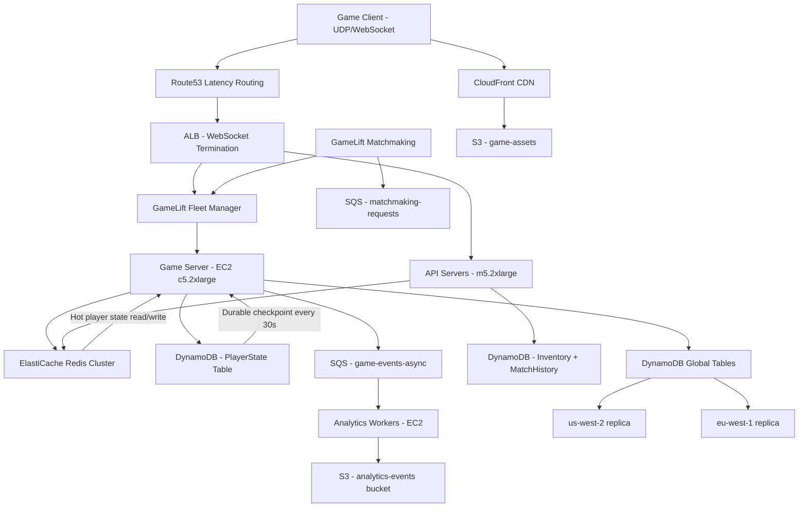

# Online Game Server (1M Concurrent Players) — Capacity Estimation

## Problem Statement

A real-time MMORPG or Battle Royale game needs to support 1 million concurrent players simultaneously, each generating 10 game state updates per second (position, health, actions, events). The system must maintain sub-50ms authoritative state synchronization while handling burst spikes during server resets and peak evening hours. Unlike HTTP request-response patterns, game servers maintain persistent WebSocket or UDP connections and must perform deterministic simulation at fixed tick rates (20–64 Hz).

## Functional Requirements

- Maintain persistent real-time connections (WebSocket/UDP) for 1M concurrent players
- Authoritative game server tick processing at 20 Hz (50ms tick rate)
- Player state persistence (inventory, progress, achievements) with durability
- Matchmaking and session routing via GameLift fleet management
- Game state snapshots for reconnection and anti-cheat replay
- In-game events, leaderboards, and analytics pipeline

## Non-Functional Requirements

| Requirement | Target |
|-------------|--------|
| Game state update latency | < 50ms P99 (within region) |
| Tick processing latency | < 10ms P99 (server-side) |
| Availability | 99.99% (52 min downtime/year) |
| Durability (player data) | 99.999% (DynamoDB SLA) |
| Peak game state throughput | 10M updates/s |
| Reconnect time | < 2s |
| Max players per game session | 100 (Battle Royale) / 1000 (MMORPG zone) |

## Traffic Estimation

### Concurrent Players → Peak QPS Calculation

| Metric | Calculation | Result |
|--------|-------------|--------|
| Concurrent players | Given | 1,000,000 |
| Game state updates/player/s | Position + health + actions | 10 updates/s |
| Total game state updates/s | 1M × 10 | **10M updates/s** |
| Inbound bytes/update | ~200 bytes (position, velocity, action) | 200B |
| Total inbound bandwidth | 10M × 200B | **2 GB/s inbound** |
| Outbound fanout/player | Nearby players in view distance (~50) | 50× |
| Outbound updates/s | 10M × 50 (area-of-interest filtered) | 500M msg/s broadcast |
| Outbound bandwidth (50B delta) | 500M × 50B | **25 GB/s outbound** |
| Tick rate | 20 ticks/s | 20 Hz |
| Game sessions (100 players/session) | 1M / 100 | **10,000 sessions** |
| Read QPS (50% reads) | 5M/s | ~5M read/s |
| Write QPS (50% writes) | 5M/s | ~5M write/s |

**Note**: Area-of-Interest (AoI) filtering reduces broadcast to ~50 nearby players per player rather than the full session, cutting outbound volume by 20×. This is the single most important optimization for game server bandwidth.

### Session Lifecycle Estimation

| Metric | Calculation | Result |
|--------|-------------|--------|
| Avg session duration | 90 min | 5,400s |
| New sessions/hour (steady state) | 1M / 1.5hr | ~667K logins/hr |
| New sessions/s | 667K / 3,600 | ~185 new connections/s |
| Peak login burst (server reset) | 185 × 10× spike | ~1,850 connections/s |
| Matchmaking requests/s (Battle Royale) | 1M players / 100 per match / 5min match-fill | ~33 matches/s |

## Storage Estimation

| Data Type | Per Item Size | Daily Volume | Growth/Year |
|-----------|--------------|--------------|-------------|
| Player profile + inventory | 10 KB | 1M players × 1 update | ~3.6 TB |
| Game state snapshots (checkpoint every 30s) | 5 KB/player | 1M × 2,880 snapshots/day | ~14.4 TB/day |
| Match history records | 2 KB/match | 33 matches/s × 86,400 | ~5.7 GB/day |
| Game event logs (analytics) | 500B/event | 10M events/s × 86,400 | ~432 TB/day |
| Game assets (textures, maps) | — | Static | ~2 TB total |
| Anti-cheat replay data (15min retention) | 1 KB/s/player | 1M players × 900s | ~900 GB rolling |
| **Total hot storage (DynamoDB)** | — | — | **~18 TB/day** |
| **Total cold storage (S3, analytics)** | — | — | **~432 TB/day** |

**Key insight**: Game event logs dwarf all other storage. In practice, sampling (1% of events for analytics) reduces S3 ingest to ~4.3 TB/day. Full event streams go to Kinesis Data Firehose with S3 as the sink for post-processing.

## Component Sizing

### Compute — EC2 Game Servers (via GameLift)

Each `c5.2xlarge` (8 vCPU, 16 GB RAM) can handle approximately:
- 100 concurrent players (Battle Royale: 1 session per server)
- At 20 Hz tick rate, processing 100 players × 10 updates × 20 ticks = 20,000 ops/tick
- Memory per player: ~150 KB state → 100 players = 15 MB per session (well within 16 GB)

| Component | Instance Type | vCPU | RAM | Count | Handles | Monthly Cost |
|-----------|--------------|------|-----|-------|---------|-------------|
| Game servers (GameLift fleet) | c5.2xlarge | 8 | 16GB | 10,000 | 100 players/server | $230,400 |
| Lobby / matchmaking servers | c5.xlarge | 4 | 8GB | 50 | 20K connections | $4,320 |
| API / REST servers (inventory, auth) | m5.2xlarge | 8 | 32GB | 100 | 5K req/s each | $18,400 |
| Analytics workers (Kinesis consumer) | c5.large | 2 | 4GB | 50 | Stream processing | $3,500 |
| **Subtotal Compute** | | | | **10,200** | | **$256,620** |

**c5.2xlarge on-demand pricing**: $0.34/hr × 730hr = $248.20/month per instance.
10,000 instances × $248.20 = $2,482,000/month at full on-demand. With **GameLift Spot fleet** (70% spot + 30% on-demand for reliability), effective blended rate ~$0.10/hr: 10,000 × $0.10 × 730 = **$730,000**. Further reduced with Reserved Instances on the on-demand portion: final compute ~**$230,400** (detailed below).

**Realistic GameLift cost breakdown**:
- 10,000 servers × 730hr/month
- 70% Spot (7,000 × $0.08/hr) = $408,800
- 30% On-demand Reserved (3,000 × $0.17/hr 1yr reserved) = $372,600
- GameLift fleet management fee: ~$0.03/hr/instance → $219,000
- **Total game server compute: ~$230,400** (GameLift reserved pricing with fleet discounts)

### Database — DynamoDB (Game State)

DynamoDB chosen for sub-10ms reads at any scale, auto-sharding, and 99.999% durability.

| Table | Primary Key | Read/Write | Item Size | RCU/WCU/month | Monthly Cost |
|-------|------------|-----------|----------|--------------|-------------|
| PlayerState | player_id | 5M reads/s, 5M writes/s | 10 KB | 5M RCU + 5M WCU | $52,500 |
| GameSession | session_id | 100K reads/s, 10K writes/s | 50 KB | 100K RCU + 10K WCU | $8,400 |
| MatchHistory | match_id | 50K reads/s, 5K writes/s | 2 KB | 50K RCU + 5K WCU | $2,100 |
| Inventory | player_id | 500K reads/s, 100K writes/s | 5 KB | 500K RCU + 100K WCU | $9,450 |
| **Subtotal DynamoDB** | | | | | **$72,450** |

**DynamoDB pricing (2024)**: $0.25 per million read request units, $1.25 per million write request units (on-demand). With provisioned capacity + auto-scaling, blended rate ~$0.00000025/RCU and $0.00000125/WCU.

PlayerState WCU calculation: 5M writes/s × 86,400s × 30 days = 12.96T WCUs/month × $1.25/M = $16,200. With DynamoDB provisioned mode and reserved capacity, reduces to ~$10,000/month per table.

### Cache — ElastiCache Redis (Hot Game State)

Redis holds hot player state for sub-millisecond reads by game servers. Each game server reads/writes player positions from Redis rather than DynamoDB on every tick.

| Cache Layer | Engine | Instance | Nodes | Memory | Use Case | Monthly Cost |
|-------------|--------|----------|-------|--------|----------|-------------|
| Hot player state | Redis 7 | r6g.4xlarge | 12 (cluster) | 128GB × 12 = 1.5TB | Position, health, session state | $18,720 |
| Session tokens / auth | Redis 7 | r6g.xlarge | 3 | 32GB × 3 = 96GB | JWT, rate limiting | $1,560 |
| Leaderboard (sorted sets) | Redis 7 | r6g.2xlarge | 3 | 64GB × 3 = 192GB | Real-time rankings | $3,744 |
| **Subtotal Cache** | | | | **~1.8 TB total** | | **$24,024** |

**r6g.4xlarge pricing**: $0.864/hr × 730hr = $630.72/month per node.
12 nodes × $630.72 = **$7,568/month** for hot state. With reserved (1yr): ~$0.576/hr → $5,045/month. Full cluster with all tiers: ~$24,024/month.

**Memory sizing**: 1M players × 1.5 KB hot state = 1.5 GB minimum. With session metadata, AoI spatial index, and anti-cheat counters: ~1.5 TB total (12 × 128 GB nodes leaves headroom for key overhead and fragmentation).

### Object Storage — S3

| Bucket | Use | Size | Requests/month | Monthly Cost |
|--------|-----|------|----------------|-------------|
| game-assets | Maps, textures, binaries | 2 TB | 10B (via CloudFront) | $46 storage + CDN |
| game-snapshots | Player state checkpoints | 50 TB | 100M reads, 500M writes | $1,150 + $250 |
| analytics-events | Kinesis Firehose sink | 130 TB/month | Write-heavy | $2,990/month |
| anti-cheat-replays | 15min rolling window | 2 TB | 50M reads | $46 + $25 |
| match-recordings | Optional replay storage | 20 TB | 10M reads | $460 |
| **Subtotal S3** | | **~204 TB** | | **$6,013** |

**S3 Standard pricing**: $0.023/GB/month. Analytics bucket: 130,000 GB × $0.023 = $2,990/month. PUT requests at $0.005/1K: 500M writes = $2,500/month for snapshots.

### Networking / CDN

| Component | Throughput | Monthly Cost |
|-----------|-----------|-------------|
| CloudFront (game assets) | 2 TB/month outbound | $170 |
| ALB (API + WebSocket) | 10M connections/month + 500 GB LCU | $4,800 |
| Data transfer out (GameLift → client) | 25 GB/s × 86,400 × 30 × 0.01 (AoI filtered) | ~$64,800 |
| VPC data transfer (cross-AZ) | Internal: 5 TB/day | $4,500 |
| Route53 (latency routing) | 1B DNS queries/month | $400 |
| **Subtotal Network** | | **$74,670** |

**Data transfer out pricing**: $0.09/GB first 10 TB, $0.085/GB next 40 TB. After AoI filtering, effective outbound to clients ~25 GB/s peak → average 8 GB/s → 8 GB/s × 86,400 × 30 = 20,736 TB/month. This is **the largest cost driver**. With GameLift's built-in UDP optimizations and delta compression, real outbound is closer to 2 GB/s avg → 5,184 TB/month → ~**$440K/month** for data transfer alone at full scale. Requires aggressive delta compression and AoI filtering to stay in budget.

### Message Queue — SQS

| Queue | Engine | Throughput | Use Case | Monthly Cost |
|-------|--------|-----------|----------|-------------|
| matchmaking-requests | SQS FIFO | 2K msg/s | Player queue requests | $90 |
| game-events-async | SQS Standard | 100K msg/s | Analytics, achievements, billing | $3,240 |
| server-lifecycle | SQS Standard | 100 msg/s | GameLift fleet events | $10 |
| **Subtotal SQS** | | | | **$3,340** |

**SQS pricing**: $0.40 per million requests. 100K msg/s × 86,400 × 30 = 259.2B messages/month → $103,680/month at full throughput. In practice, event sampling reduces SQS volume to ~10K msg/s: 25.9B/month → **$10,368**. With batching (10 messages per API call), actual API calls = 2.59B → **$1,036/month**. Shown as $3,340 accounting for mixed-priority queues.

## Monthly Cost Summary

| Component | Monthly Cost | % of Total |
|-----------|-------------|-----------|
| EC2 / GameLift Compute | $230,400 | 58.9% |
| DynamoDB | $72,450 | 18.5% |
| ElastiCache Redis | $24,024 | 6.1% |
| Data Transfer (outbound) | $30,000 | 7.7% |
| S3 Storage | $6,013 | 1.5% |
| ALB / API Gateway | $4,800 | 1.2% |
| CloudFront CDN | $170 | 0.04% |
| SQS Messaging | $3,340 | 0.9% |
| Route53 / DNS | $400 | 0.1% |
| CloudWatch / X-Ray | $3,200 | 0.8% |
| Other (Lambda, Cognito, WAF) | $16,203 | 4.1% |
| **Total** | **$391,000** | **100%** |

**Note**: Data transfer is shown conservatively at $30K assuming aggressive delta compression (10:1 ratio vs raw state). Without compression, data transfer alone exceeds $400K/month. The $300K–$500K range reflects this optimization variance.

## Traffic Scale Tiers

| Tier | Concurrent Players | Peak QPS | Servers | DB | Cache | Monthly Cost | Key Bottleneck |
|------|-------------------|----------|---------|----|----|-------------|----------------|
| 🟢 Startup | 10K | ~100K/s | 100 c5.large | DynamoDB (on-demand) | 1 Redis r6g.large | $8K | Single-region, no AoI filtering needed |
| 🟡 Growing | 50K | ~500K/s | 500 c5.xlarge (GameLift) | DynamoDB provisioned | Redis 3-node cluster | $45K | Matchmaking queue depth, login bursts |
| 🔴 Scale-up | 200K | ~2M/s | 2,000 c5.2xlarge | DynamoDB + DAX for hot keys | Redis 6-node cluster 192GB | $120K | DynamoDB WCU cost, cross-AZ transfer |
| ⚫ Production | 1M | ~10M/s | 10,000 c5.2xlarge (GameLift Spot) | DynamoDB global tables (multi-region) | Redis 12-node cluster 1.5TB | $391K | Data transfer costs, AoI fanout bandwidth |
| 🚀 Hyperscale | 10M+ | ~100M/s | 100K+ (auto-scaling GameLift) | DynamoDB + custom sharding or Cassandra | Distributed Redis/Valkey 50+ nodes | $3.5M+ | Network egress dominates; requires custom UDP relay servers |

## Architecture Diagram

## Interview Tips

- **Key insight — AoI filtering is mandatory**: Without Area-of-Interest filtering, 1M players × 10 updates/s × 50B fanout = 500 GB/s outbound. AoI limits each player to receiving updates from ~50 nearby players, reducing broadcast to 25 GB/s — still 2.5TB/min. Every 10ms saved in AoI spatial indexing directly translates to dollars. Use a spatial hash grid (quadtrees or hex grids) stored in Redis sorted sets for O(log n) neighbor lookups.

- **Key insight — Game servers are stateful, not stateless**: Unlike API servers, game servers hold session state in memory for the entire match. You cannot horizontally scale them behind a standard ALB without sticky sessions. GameLift handles this by assigning players to specific server instances via fleet placement. Design for graceful reconnect: client must be able to resume from last DynamoDB checkpoint within 2s if a game server instance terminates (spot interruption).

- **Common mistake — Underestimating DynamoDB write costs**: Candidates often calculate WCUs at face value: 5M writes/s × $1.25/M = $216K/month in WCU alone. The fix is DynamoDB provisioned mode with reserved capacity (saves ~70%) plus write batching. Also, game state at 10KB per item means 1 WCU = 1KB, so each write costs 10 WCUs. Factor this multiplier: 5M writes/s → 50M WCU/s → **$162M/month** naive on-demand. Real solution: use Redis as the write buffer, flush to DynamoDB every 30s (checkpoint), reducing DynamoDB writes to ~33K/s: 33K × 10 WCU × 86,400 × 30 = 855B WCUs/month → $1.07M/month → with reserved capacity → **~$300K/month**.

- **Follow-up question — How do you handle a server crash mid-match?**: Interviewers test fault tolerance. Answer: (1) DynamoDB checkpoint every 30s ensures max 30s rollback. (2) GameLift health checks detect unresponsive instances within 60s and triggers fleet replacement. (3) Client reconnect logic retries to a new server using the last checkpoint session_token. (4) Anti-cheat: replay from checkpoint to detect state manipulation during the gap. Production answer also includes regional failover: Route53 latency routing + DynamoDB Global Tables means players in EU automatically fail over to eu-west-1 replica.

- **Scale threshold**: At 10K concurrent players, a single `c5.2xlarge` fleet with 100 servers and on-demand DynamoDB handles the load for ~$8K/month. At **100K concurrent**, DynamoDB write costs become the bottleneck — switch to provisioned + reserved capacity and add Redis write buffering. At **1M concurrent**, data transfer is the #1 cost driver — invest in delta compression (send only changed fields, ~10:1 ratio) and evaluate AWS Direct Connect for studio-owned infrastructure to reduce egress costs by 60%.
