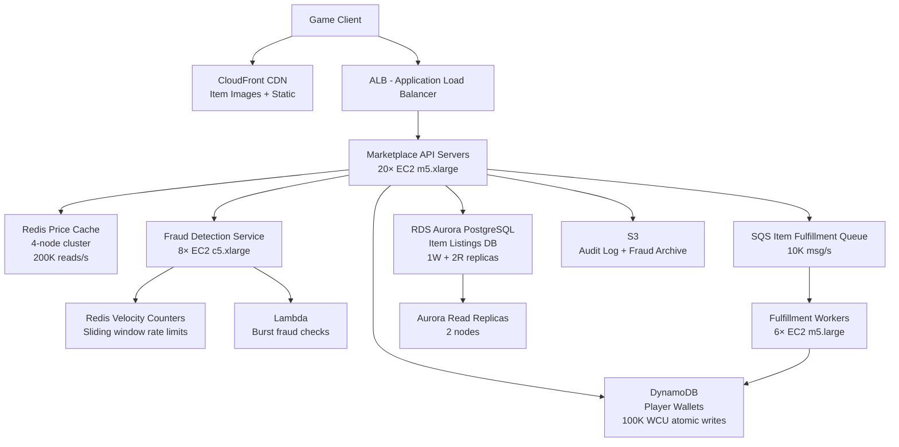

# Virtual Economy — Capacity Estimation

## Problem Statement

A live-service game has 10M daily active users who participate in an in-game marketplace to buy, sell, and trade virtual items using a virtual currency. The system must handle ACID-compliant currency transactions (wallet debits/credits), real-time item pricing, and fraud detection to prevent duplication exploits and wash trading. Peak activity occurs during new content drops (e.g., a new item release), causing spikes 3–5× baseline.

## Functional Requirements

- **Virtual Wallet**: Each player has a wallet; support atomic credit/debit with full ACID guarantees
- **Item Marketplace**: Players list, browse, and purchase items; prices update in real time
- **Price Feed**: Real-time price reads for all active listings (200K reads/s at peak)
- **Fraud Detection**: Flag and block duplicate transactions, suspicious velocity, and wash trading
- **Transaction History**: Durable, queryable log of all wallet and item transactions
- **Async Settlement**: Post-purchase item delivery via queue to decouple listing from fulfillment

## Non-Functional Requirements

| Requirement | Target |
|-------------|--------|
| Read latency (price/listing) | < 20ms (P99) |
| Write latency (transaction commit) | < 150ms (P99) |
| Availability | 99.99% (< 52 min/year downtime) |
| Durability | 99.999% (no lost transactions) |
| Peak transaction throughput | 100K item transactions/s |
| Peak price-read throughput | 200K price reads/s |
| Fraud detection latency | < 50ms inline per transaction |

## Traffic Estimation

### DAU → Peak QPS Calculation

| Metric | Calculation | Result |
|--------|-------------|--------|
| DAU | Given | 10,000,000 |
| Avg marketplace sessions/user/day | 3 browse + 1.5 purchases + 0.5 listings | ~5 sessions |
| Avg requests per session | 20 price reads + 2 item writes + 1 wallet op | ~23 requests |
| Total daily requests | 10M × 5 × 23 | ~1.15B |
| Avg QPS | 1.15B / 86,400 | ~13,300 QPS |
| Peak QPS (3× avg for content drops) | 13,300 × 3 | ~40,000 QPS |
| Read QPS (40% reads — price/listing browse) | 40,000 × 0.40 | ~16,000 QPS raw API |
| Write QPS (60% writes — transactions, listings) | 40,000 × 0.60 | ~24,000 QPS raw API |
| Price cache reads (Redis, fanout from reads) | 200K reads/s at peak (CDN + cache layer handles majority) | 200,000 QPS |
| Item transaction DB writes | 100K tx/s at peak (burst during content drops) | 100,000 TPS |

**Key note**: The 200K price reads/s and 100K transaction/s are peak burst figures during content drop events (e.g., a new legendary item drops and 5M players simultaneously check prices). Average-case is 5–10× lower.

## Storage Estimation

| Data Type | Per Item Size | Daily Volume | Growth/Year |
|-----------|--------------|--------------|-------------|
| Wallet transactions (DynamoDB) | 512 B per tx | 100M tx/day | ~18 GB/year |
| Item listings (PostgreSQL) | 2 KB per listing | 5M new listings/day | ~3.6 TB/year |
| Price history (time-series) | 128 B per tick | 500M ticks/day | ~23 TB/year |
| Fraud event logs (S3 + Athena) | 1 KB per flagged event | 1M events/day | ~365 GB/year |
| Audit trail / transaction log (S3) | 256 B per record | 200M records/day | ~18 TB/year |
| Player inventory snapshots (DynamoDB) | 4 KB per snapshot | 10M snapshots/day | ~14.6 TB/year |
| **Total** | — | — | **~60 TB/year** |

## Component Sizing

### Compute — EC2 / Lambda

Each `m5.xlarge` (4 vCPU, 16 GB RAM) handles ~2,000 concurrent marketplace API requests at P99 < 150ms, assuming 30% CPU headroom. At 40K API QPS with avg 10ms request duration, we need ~400 concurrent threads → 10 instances minimum, scaled to 20 for redundancy and burst.

| Component | Instance Type | vCPU | RAM | Count | Handles | Monthly Cost |
|-----------|--------------|------|-----|-------|---------|-------------|
| Marketplace API servers | m5.xlarge | 4 | 16 GB | 20 | 40K API QPS | $7,200 |
| Fraud detection service | c5.xlarge | 4 | 8 GB | 8 | 100K tx/s checks (Lambda overflow) | $1,152 |
| Item fulfillment workers | m5.large | 2 | 8 GB | 6 | SQS queue drain ~10K jobs/s | $648 |
| Lambda (fraud burst + async) | Lambda | — | 512 MB | auto | 50K invocations/s peak | $900 |
| **Subtotal Compute** | | | | | | **$9,900** |

*Pricing: m5.xlarge $0.192/hr, c5.xlarge $0.17/hr, m5.large $0.096/hr — us-east-1 on-demand 2024.*

### Database

**PostgreSQL on RDS Aurora** for the marketplace item catalog and listings: ACID-compliant, supports row-level locking for concurrent price updates, and complex joins for fraud queries.

**DynamoDB** for player wallets: single-digit millisecond latency for atomic conditional writes (prevents double-spend), 99.999% durability, auto-scaling to 100K WCU.

| DB | Engine | Instance | Count | Capacity | IOPS | Monthly Cost |
|----|--------|----------|-------|----------|------|-------------|
| Listings DB | RDS Aurora PostgreSQL | db.r6g.2xlarge | 1W + 2R | 2 TB SSD | 20K provisioned | $3,200 |
| Wallet DB | DynamoDB | On-demand | — | Auto (100K WCU, 50K RCU) | — | $5,500 |
| Price history | RDS Aurora (time-series ext.) | db.r6g.xlarge | 1W + 1R | 500 GB SSD | 8K provisioned | $980 |
| **Subtotal DB** | | | | | | **$9,680** |

*Aurora db.r6g.2xlarge ~$0.52/hr per instance. DynamoDB: 100K WCU × $0.00065/WCU-hr + 50K RCU × $0.00013/RCU-hr ≈ $5,500/month estimated on-demand.*

### Cache

Redis handles two distinct workloads: (1) item price cache (200K reads/s at peak — hot keys for popular items) and (2) fraud velocity counters (sliding window rate limiting per player).

At 200K reads/s, a single `r6g.xlarge` (26 GB, ~100K ops/s) is insufficient alone. A 4-shard cluster provides 400K ops/s headroom.

| Cache | Engine | Instance | Nodes | Memory | Monthly Cost |
|-------|--------|----------|-------|--------|-------------|
| Price cache (read-heavy) | ElastiCache Redis | r6g.xlarge | 4 (2 shards × 2 replicas) | 104 GB total | $2,080 |
| Fraud velocity counters | ElastiCache Redis | r6g.large | 2 (1 shard × 2 replicas) | 26 GB total | $520 |
| Session / auth cache | ElastiCache Redis | r6g.medium | 2 | 6 GB total | $200 |
| **Subtotal Cache** | | | | | **$2,800** |

*r6g.xlarge $0.288/hr, r6g.large $0.144/hr, r6g.medium $0.072/hr.*

### Object Storage

| Bucket | Use | Size | Requests/month | Monthly Cost |
|--------|-----|------|----------------|-------------|
| Item icons / media | Marketplace thumbnails (CDN origin) | 500 GB | 200M GET | $180 |
| Transaction audit logs | Compressed Parquet, Athena-queryable | 5 TB | 10M PUT | $145 |
| Fraud event archive | Raw fraud signals for ML retraining | 1 TB | 5M PUT | $35 |
| **Subtotal S3** | | | | **$360** |

*S3 Standard $0.023/GB-month, GET $0.0004/1K, PUT $0.005/1K.*

### Networking / CDN

| Component | Throughput | Monthly Cost |
|-----------|-----------|-------------|
| CloudFront (item images + static assets) | 10 TB/month egress | $850 |
| ALB (API traffic) | 200M requests/month | $200 |
| Data Transfer (EC2 → Internet) | 5 TB/month | $450 |
| **Subtotal Network** | | **$1,500** |

### Message Queue

SQS decouples item purchase confirmation from fulfillment (item delivery to inventory). Prevents tight coupling between the payment transaction and the inventory write — if inventory is slow, the buyer still gets an immediate purchase confirmation.

| Queue | Engine | Throughput | Monthly Cost |
|-------|--------|-----------|-------------|
| Item fulfillment queue | SQS Standard | 10K msg/s peak, 100M msg/day | $40 |
| Fraud review queue | SQS FIFO | 500 msg/s (flagged txs) | $5 |
| **Subtotal Messaging** | | | **$45** |

## Monthly Cost Summary

| Component | Monthly Cost | % of Total |
|-----------|-------------|-----------|
| EC2 Compute | $9,900 | 32% |
| RDS Aurora (listings + price history) | $4,180 | 13% |
| DynamoDB (wallets) | $5,500 | 18% |
| ElastiCache Redis | $2,800 | 9% |
| S3 Storage | $360 | 1% |
| CloudFront CDN | $850 | 3% |
| Messaging (SQS) | $45 | < 1% |
| Lambda (fraud burst) | $900 | 3% |
| Data Transfer | $450 | 1% |
| Other (ALB, CloudWatch, WAF) | $800 | 3% |
| **Total** | **~$25,785** | **100%** |

**Estimated range: $25K–$45K/month** depending on Reserved Instance discounts (1-year RI cuts EC2/RDS by ~30%), DynamoDB capacity mode (provisioned vs on-demand), and actual burst frequency.

## Traffic Scale Tiers

| Tier | DAU | Peak QPS | Servers | DB | Cache | Monthly Cost | Key Bottleneck |
|------|-----|----------|---------|----|----|-------------|----------------|
| 🟢 Startup | 1M | ~4K API QPS | 4× c5.large | 1 RDS PostgreSQL (db.t3.large) | 1 Redis node (r6g.medium) | $2,500 | Single RDS write bottleneck at >1K tx/s |
| 🟡 Growing | 10M | ~40K API QPS | 20× m5.xlarge | Aurora (1W+2R) + DynamoDB wallets | Redis cluster 4-node | $25K | Wallet DynamoDB WCU cost; fraud latency at scale |
| 🔴 Scale-up | 100M | ~400K API QPS | 80× m5.2xlarge | Aurora global + DynamoDB multi-region | Redis cluster 12-node | $180K | Cross-region transaction consistency; fraud ML inference latency |
| ⚫ Production | 500M | ~2M API QPS | 300× c5.4xlarge (auto-scaling) | DynamoDB multi-region + Aurora sharded | Redis cluster 24-node + DAX | $700K | Global price synchronization; regulatory compliance per region |
| 🚀 Hyperscale | 1B+ | ~5M API QPS | Auto-scaling ECS/EKS | DynamoDB global tables + Cassandra price history | Distributed Redis (ElastiCache global) + Memcached | $2M+ | Economy balance (inflation prevention); real-time ML fraud at global scale |

## Architecture Diagram

## Interview Tips

- **Key insight — Wallet double-spend prevention**: DynamoDB conditional writes (`ConditionExpression: balance >= amount`) provide atomic check-and-debit in a single API call at 10ms P99. PostgreSQL SELECT FOR UPDATE works but adds row-lock contention at 100K tx/s — use DynamoDB for the hot wallet path, PostgreSQL only for complex marketplace queries.

- **Key insight — Price cache invalidation strategy**: At 200K price reads/s, serve prices from Redis with a 1-second TTL. On a new listing or sale, publish an invalidation event to SQS; workers update Redis within 500ms. This "near-real-time" approach (not strict consistency) is acceptable for marketplace prices — a 1-second stale price rarely causes user-visible issues and avoids cache stampede on every trade.

- **Common mistake — Mixing ACID and eventual consistency**: Candidates often propose a single PostgreSQL database for both wallets and listings. At 100K wallet tx/s, PostgreSQL MVCC lock contention becomes the bottleneck (PostgreSQL can handle ~50K simple UPDATE/s on a large instance). Separating wallets (DynamoDB) from listings (Aurora) routes each workload to the appropriate engine.

- **Follow-up question — Fraud at scale**: Interviewers often ask "how do you detect wash trading (player A sells to player B who sells back to player A to inflate item prices)?" Answer: maintain a graph of recent transactions in Redis (player → player edges with timestamps), and flag cycles within a 24-hour window. At 10M DAU, store only the last 100 trades per player — 10M × 100 × 50B = 50 GB, fits in a 6-node Redis cluster.

- **Scale threshold**: At 50M DAU (5× current), DynamoDB wallet costs (~$27K/month) become the dominant expense. Switch to provisioned capacity mode with auto-scaling policy to cut costs by 40%. Also at 50M DAU, fraud ML inference must move from rule-based (Redis counters) to a real-time ML model (SageMaker endpoint or Lambda + ONNX) because rules alone cannot detect novel exploit patterns without 20%+ false-positive rates.
