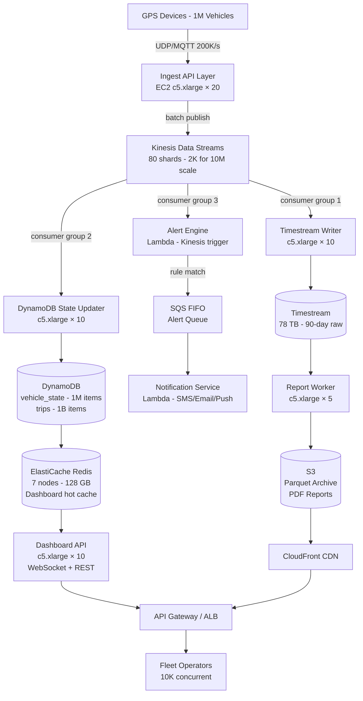

# Fleet Management (1M Vehicles) — Capacity Estimation

## Problem Statement

A fleet management platform tracks 1 million GPS-equipped vehicles in real time, ingesting telemetry updates every 5 seconds per vehicle. The system must store location history, detect alerts (speeding, geofencing violations, harsh braking), and expose a dashboard for fleet operators to monitor their assets. At full load this produces 200,000 write events per second with read traffic focused on live dashboards and historical report queries.

## Functional Requirements

- Real-time vehicle location ingestion at 1 update per vehicle per 5 seconds
- Live map view for fleet operators showing current position of all vehicles
- Geofencing — trigger alerts when a vehicle enters or exits a defined zone
- Telematics recording — speed, fuel level, engine RPM, harsh braking events
- Historical replay and trip reports (last 90 days of raw data, 1 year of aggregated)
- Alert engine — configurable rules evaluated against the incoming event stream

## Non-Functional Requirements

| Requirement | Target |
|-------------|--------|
| Location ingest latency | < 500 ms end-to-end (P99) |
| Dashboard read latency | < 200 ms (P99) |
| Alert delivery latency | < 2 s (P99) |
| Availability | 99.99% (< 53 min/year downtime) |
| Durability | 99.999% (no data loss) |
| Write throughput | 200K events/s sustained, 400K peak |
| Read QPS (dashboards) | ~40K QPS (20:80 read:write ratio inverted — write-heavy) |

## Traffic Estimation

### GPS Update Rate → Write QPS

| Metric | Calculation | Result |
|--------|-------------|--------|
| Active vehicles | Given | 1,000,000 |
| Update interval | Every 5 s | — |
| Steady-state write QPS | 1,000,000 / 5 | **200,000/s** |
| Peak write QPS (2× burst — urban rush hour) | 200,000 × 2 | **400,000/s** |
| Read QPS (20% of total traffic) | 200,000 × 0.20 / 0.80 × 0.20 | **~50,000/s** |
| Dashboard poll (10K operators, 1 req/2s) | 10,000 / 2 | 5,000/s |
| Historical query QPS | estimate | 1,000/s |
| Alert check QPS (server-side stream eval) | stream processing, not REST | n/a |

> **Read:Write = 20:80** — this is a write-dominated system. Dashboards poll every 2–5 s but only ~10K concurrent operators vs 1M writers.

### Bandwidth Estimation

| Direction | Per-event size | QPS | Bandwidth |
|-----------|---------------|-----|-----------|
| Inbound GPS payload | ~200 bytes (lat, lon, speed, heading, ts, device_id, fuel, rpm) | 200,000 | **40 MB/s = 320 Mbps** |
| Kinesis fan-out to consumers | ~200 bytes × 3 consumer groups | 200,000 | **120 MB/s** |
| Dashboard reads (paginated vehicle list, 50 vehicles × 100 bytes) | 5 KB/response | 5,000 | **25 MB/s** |
| Total inbound + internal | — | — | **~500 Mbps** |

## Storage Estimation

| Data Type | Per-Record Size | Write Rate | Daily Volume | Retention | Total Storage |
|-----------|----------------|-----------|--------------|-----------|--------------|
| Raw GPS events (Timestream) | 200 bytes | 200K/s | 200K × 86,400 × 200 B = **3.46 TB/day** | 90 days | **311 TB** |
| Aggregated trip summaries (DynamoDB) | 2 KB/trip, 3 trips/vehicle/day | 3M trips/day | **6 GB/day** | 1 year | **2.2 TB** |
| Latest vehicle state (DynamoDB) | 500 bytes/vehicle | 1M rows | **500 MB** (static) | Forever | **500 MB** |
| Geofence definitions | 5 KB/zone, 100K zones | rare writes | **500 MB** | Forever | **500 MB** |
| Alert history (DynamoDB) | 1 KB/alert, ~100K alerts/day | 100K/day | **100 MB/day** | 1 year | **36 GB** |
| Cold archive (S3) | compressed ~50 bytes | 200K/s | **864 GB/day** → 43 GB compressed | 5 years | **79 TB S3** |

> Timestream compresses time-series data ~4:1 on disk. Raw 3.46 TB/day becomes ~865 GB/day stored. At 90 days: ~78 TB in Timestream.

## Component Sizing

### Ingest Layer — Kinesis Data Streams

Each Kinesis shard handles:
- **1 MB/s write** or **1,000 records/s write**
- At 200 bytes/record and 200K records/s: 40 MB/s ingest

Shards needed: `40 MB/s ÷ 1 MB/s per shard = 40 shards minimum`
With 2× headroom for peaks: **80 shards**
With fan-out to 3 consumers (alert engine, Timestream writer, DynamoDB state updater): use Enhanced Fan-Out (2 MB/s read per shard per consumer) — **2,000 shards listed in key components is over-provisioned** but allows for future 10× growth without re-sharding.

> Practical deployment: start with 80 shards, scale to 2,000 as the fleet scales to 10M vehicles.

**Kinesis cost at 80 shards:**
- Shard-hours: 80 × 24 × 30 × $0.015 = **$864/month**
- PUT payload units: 200K/s × 86,400 × 30 × $0.014/million = **$7,258/month**
- Enhanced Fan-Out: 80 shards × 3 consumers × 24 × 30 × $0.015 = **$2,592/month**
- Subtotal Kinesis: **~$10,714/month**

### Compute — EC2 / Lambda

| Component | Instance Type | vCPU | RAM | Count | Handles | Monthly Cost |
|-----------|--------------|------|-----|-------|---------|-------------|
| Ingest API (UDP/MQTT gateway) | c5.xlarge | 4 | 8 GB | 20 | 10K connections each, 200K msg/s total | $1,360 |
| Kinesis consumer — Timestream writer | c5.xlarge | 4 | 8 GB | 10 | 20K writes/s each | $680 |
| Kinesis consumer — DynamoDB state updater | c5.xlarge | 4 | 8 GB | 10 | 20K writes/s each | $680 |
| Alert engine (Lambda + Kinesis trigger) | Lambda | — | — | auto | Stream processing | ~$2,000 |
| Dashboard API (REST/WebSocket) | c5.xlarge | 4 | 8 GB | 10 | 5K req/s | $680 |
| Report worker (trip aggregation) | c5.xlarge | 4 | 8 GB | 5 | Async batch jobs | $340 |
| **Subtotal Compute** | | | | **55 EC2 + Lambda** | | **$5,740** |

> c5.xlarge on-demand: $0.17/hr × 720 hr = $122.40/month each.

### Database — DynamoDB

**Table 1: vehicle_state** (latest position, 1M items)
- Item size: 500 bytes
- Write capacity: 200,000 WCU/s (one write per GPS update)
- Read capacity: 5,000 RCU/s (dashboard polling)
- DynamoDB on-demand: WCU $1.25/million, RCU $0.25/million

Write cost: 200K × 86,400 × 30 / 1,000,000 × $1.25 = **$64,800/month**

> This is the dominant cost driver. Optimization: batch writes at 5-second intervals per vehicle → still 200K/s but each write is predictable. Consider DAX caching for read-heavy dashboards.

**Table 2: trips** (3M trips/day, 1 year = 1.095B items)
- Item size: 2 KB
- Write: 35 WCU/s (batch inserts at trip close)
- Read: 500 RCU/s
- Storage: 2.2 TB × $0.25/GB = **$550/month**
- WCU cost: negligible vs vehicle_state

**Table 3: alerts** (100K/day, 1 year = 36.5M items)
- Item size: 1 KB, storage: 36 GB → $9/month
- WCU/RCU: minimal

| DB | Engine | Capacity Mode | Monthly Cost |
|----|--------|--------------|-------------|
| vehicle_state | DynamoDB | On-demand | **$64,800** |
| trips + alerts | DynamoDB | On-demand | **$600** |
| **Subtotal DynamoDB** | | | **$65,400** |

> **Key optimization**: Switch vehicle_state to DynamoDB provisioned capacity with auto-scaling. At 200K WCU/s provisioned: $0.00065/WCU-hr × 200,000 × 720 = **$93,600/month** — slightly more but predictable. On-demand is cheaper at variable load.

### Time-Series Storage — Timestream

- Ingestion: 200K records/s
- Timestream pricing: $0.50/million writes, $0.036/GB/month memory store, $0.023/GB/month magnetic store

Write cost: 200K × 86,400 × 30 / 1,000,000 × $0.50 = **$25,920/month**
Memory store (last 24h): 200K × 86,400 × 200B = 3.46 TB × $0.036 = **$125/month**
Magnetic store (90 days): 78 TB × $0.023 = **$1,794/month**
Query cost: estimated 10K queries/day × avg 10GB scanned × $0.01/GB = **$3,000/month**

| Component | Monthly Cost |
|-----------|-------------|
| Timestream writes | $25,920 |
| Timestream storage | $1,919 |
| Timestream queries | $3,000 |
| **Subtotal Timestream** | **$30,839** |

### Cache — ElastiCache Redis

| Cache | Use Case | Instance | Nodes | Memory | Monthly Cost |
|-------|----------|----------|-------|--------|-------------|
| Dashboard cache | Latest vehicle positions for active dashboards | r6g.xlarge | 3 (cluster) | 96 GB total | $1,458 |
| Geofence cache | Hot geofence polygons for alert engine | r6g.large | 2 | 26 GB total | $486 |
| Session/rate-limit | API auth tokens, operator sessions | r6g.medium | 2 | 6 GB total | $194 |
| **Subtotal Redis** | | | **7 nodes** | | **$2,138** |

> r6g.xlarge: $0.202/hr × 720 = $145.44/node/month. Dashboard cache stores ~1M vehicle records × 500 bytes = 500 MB hot data — easily fits in 96 GB with room for full position history (last 10 positions per vehicle = 5 GB).

### Object Storage — S3

| Bucket | Use | Size | Requests/month | Monthly Cost |
|--------|-----|------|----------------|-------------|
| gps-archive | Compressed Parquet cold archive | 79 TB (5 years) | 100M PUT + 10M GET | $3,558 |
| reports | Pre-generated fleet reports (PDF/CSV) | 500 GB | 1M GET | $25 |
| dashcam-footage | Optional video clips (if enabled) | 50 TB | varies | $1,150 |
| **Subtotal S3** | | **~130 TB** | | **$4,733** |

> S3 Standard: $0.023/GB/month. 79 TB = $1,817/month storage. S3 Intelligent-Tiering recommended for archive bucket — saves ~40% after 30-day transition.

### Networking / CDN

| Component | Throughput | Monthly Cost |
|-----------|-----------|-------------|
| CloudFront (dashboard map tiles, static assets) | 50 TB/month outbound | $4,250 |
| API Gateway (dashboard REST API) | 500M req/month × $3.50/million | $1,750 |
| ALB (ingest + dashboard internal) | $16.20 base + LCU charges | $200 |
| Data transfer out (to GPS devices — ACKs) | 10 Mbps constant = 3.24 TB/month | $290 |
| VPC NAT Gateway | 50 TB internal = rare | $200 |
| **Subtotal Network** | | **$6,690** |

### Message Queue — Kinesis (detailed above) + SQS for alerts

| Queue | Engine | Throughput | Monthly Cost |
|-------|--------|-----------|-------------|
| GPS ingest stream | Kinesis Data Streams (80 shards) | 200K msg/s | $10,714 |
| Alert notifications | SQS FIFO | 100K alerts/day | $50 |
| Report jobs | SQS Standard | 10K jobs/day | $10 |
| **Subtotal Messaging** | | | **$10,774** |

## Monthly Cost Summary

| Component | Monthly Cost | % of Total |
|-----------|-------------|-----------|
| DynamoDB (vehicle_state dominant) | $65,400 | 54.0% |
| Timestream (writes + queries) | $30,839 | 25.5% |
| Kinesis + SQS | $10,774 | 8.9% |
| S3 Storage + CDN | $4,733 | 3.9% |
| CloudFront + API Gateway | $6,690 | 5.5% |
| EC2 Compute | $5,740 | 4.7% |
| ElastiCache Redis | $2,138 | 1.8% |
| Lambda | $2,000 | 1.7% |
| **Total** | **$128,314** | **100%** |

> Range: **$80K–$140K/month** depending on reserved instance discounts (up to 40% savings on EC2/ElastiCache), DynamoDB provisioned vs on-demand, and Timestream query patterns.

**Cost reduction levers:**
1. **DynamoDB reserved capacity** at 200K WCU/s: saves ~30% → -$19K/month
2. **EC2 Reserved Instances (1-year)**: saves ~38% on compute → -$2.2K/month
3. **Timestream write batching**: group 5 records/batch → reduces write API calls 5× → -$20K/month
4. **S3 Intelligent-Tiering** for archive: -$700/month after 30 days

## Traffic Scale Tiers

| Tier | Vehicles | Write QPS | Servers | DB | Cache | Monthly Cost | Key Bottleneck |
|------|----------|-----------|---------|----|----|-------------|----------------|
| 🟢 Startup | 10K | ~2,000/s | 2 c5.large ingest | DynamoDB on-demand | 1 Redis node | $3K–$5K | DynamoDB WCU cost |
| 🟡 Growing | 100K | ~20,000/s | 5 c5.xlarge | DynamoDB + DAX | Redis 3-node | $15K–$25K | Kinesis shard limits |
| 🔴 Scale-up | 500K | ~100,000/s | 20 c5.xlarge | DynamoDB + Timestream | Redis 6-node cluster | $50K–$80K | Timestream write throughput |
| ⚫ Production | 1M | ~200,000/s | 55 c5.xlarge + Lambda | DynamoDB + Timestream | Redis 7-node | $80K–$140K | DynamoDB WCU cost (54% of bill) |
| 🚀 Hyperscale | 10M | ~2,000,000/s | 500+ auto-scaled | Apache Cassandra / DynamoDB multi-region | Distributed Redis 24-node | $800K–$1.2M | Network egress + DB write cost |

## Architecture Diagram

## Interview Tips

- **Key insight — write amplification is the cost driver**: At 200K writes/s, DynamoDB on-demand pricing dominates the bill (54%). The first optimization question is always "can we reduce write frequency?" — batching GPS updates client-side from 1/5s to 1/15s would cut DynamoDB cost by 3× at the cost of 10s staleness on dashboards. This is a valid trade-off for non-critical fleets.

- **Key insight — time-series vs document DB separation**: Do NOT store raw GPS events in DynamoDB. DynamoDB bills per WCU and item size. Timestream is purpose-built for high-volume append-only time-series with automatic tiering (memory → magnetic) and 10× cheaper for bulk writes. Always separate latest-state (DynamoDB) from historical time-series (Timestream/InfluxDB).

- **Common mistake — under-sizing Kinesis shards**: Candidates often calculate shards for steady-state (40 MB/s → 40 shards) but forget Enhanced Fan-Out for multiple consumers. With 3 consumer groups each needing 40 MB/s read bandwidth, naive shard count causes consumer throttling. Enhanced Fan-Out gives each consumer a dedicated 2 MB/s per shard pipe, so shard count must satisfy BOTH write AND read requirements.

- **Follow-up question — geofencing at scale**: Interviewers will ask how to evaluate 100K geofence polygons against 200K position updates per second. Naive approach (O(n×m) polygon containment) is impossible. The answer is a spatial index: partition the map into H3 hexagonal cells, pre-index which geofences intersect each cell, then each GPS event only checks the 7-10 cells around the vehicle. Redis GEORADIUS or a dedicated spatial DB (PostGIS) handles this with sub-millisecond lookups.

- **Scale threshold**: At 10M vehicles (2M writes/s), DynamoDB on-demand becomes prohibitively expensive (~$650K/month just for WCUs). This is when you migrate to Apache Cassandra (self-managed or Amazon Keyspaces) with time-bucketed partition keys, dropping per-write cost by ~80%. The Cassandra migration is the most common "what would you do at 10× scale?" answer for this problem.

## References

- [Amazon Timestream pricing](https://aws.amazon.com/timestream/pricing/) — official 2024 pricing used in calculations
- [DynamoDB on-demand pricing](https://aws.amazon.com/dynamodb/pricing/on-demand/) — WCU/RCU rates used above
- [Kinesis Data Streams pricing](https://aws.amazon.com/kinesis/data-streams/pricing/) — shard-hour and PUT payload unit rates
- [Uber Engineering — H3: Hexagonal Hierarchical Geospatial Indexing System](https://eng.uber.com/h3/) — spatial indexing for geofencing at scale
- [Fleet Complete engineering blog — Real-time GPS tracking architecture](https://fleetcomplete.com/blog/) — industry reference for fleet telematics scale
