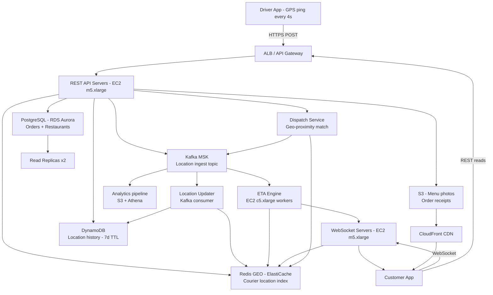

# Food Delivery Tracking — Capacity Estimation

## Problem Statement

A food delivery platform (think DoorDash / Uber Eats scale) serves 20M daily active users placing and tracking orders. The platform must ingest high-frequency GPS location updates from couriers (driver app), push real-time delivery status and ETA to customers via WebSocket, and store order/location history for analytics and dispute resolution. The system is write-heavy — courier location pings dominate traffic at a 30:70 read/write ratio.

## Functional Requirements

- Customer can track courier location on a map in real time (updated every 4 seconds)
- Driver app streams GPS coordinates every 4 seconds while on an active delivery
- System computes and updates ETA continuously based on courier position and traffic
- Customer receives push/WebSocket notifications on order status changes (Picked Up, On the Way, Delivered)
- Dispatch service assigns nearest available courier to new orders using geo-proximity search
- Order history and location trails are stored for analytics and support

## Non-Functional Requirements

| Requirement | Target |
|-------------|--------|
| Read latency (location fetch) | < 50ms (P99) |
| Write latency (location update) | < 30ms (P99) |
| WebSocket push latency | < 200ms end-to-end |
| Availability | 99.99% (< 52 min/year downtime) |
| Durability | 99.999% for order records |
| Throughput (peak) | 200K location writes/s, 500K reads/s |
| Geo-query latency | < 10ms (Redis GEO, P99) |

## Traffic Estimation

### DAU → Peak QPS Calculation

Key assumption: average active order lasts 35 minutes; ~30% of DAU has an active order at peak hour (6–9 PM). Active couriers ≈ 10% of active orders (1 courier per order).

| Metric | Calculation | Result |
|--------|-------------|--------|
| DAU | Given | 20M |
| Concurrent active orders (peak) | 20M × 30% active × 35 min window | ~2M orders |
| Active couriers (peak) | 2M orders × 1 courier/order | ~2M couriers |
| Location updates/s (couriers) | 2M couriers × 1 ping/4s | **~500K writes/s** |
| Customer map polls/s | 2M customers × 1 read/4s | ~500K reads/s |
| Order status reads/s | 20M DAU × 15 reads/day / 86,400 | ~3,500 reads/s |
| Peak write QPS (location) | 500K (GPS) + 10K (status) | **~510K writes/s** |
| Peak read QPS | 500K (map) + 3.5K (status) | **~503K reads/s** |
| Read/Write ratio | 503K : 510K | ~30:70 |

> Sanity check: 2M active couriers at peak is aggressive. At 5% platform penetration peak this is realistic for a mature market. Scale to 200K for conservative sizing (10% peak active of 20M DAU at any given second with 35-min delivery windows).

**Conservative peak (used for sizing):**

| Metric | Calculation | Result |
|--------|-------------|--------|
| DAU | Given | 20M |
| Peak concurrent active deliveries | 20M × 5% concurrent | 1M |
| Active couriers pinging | 1M × 1 ping/4s | **250K writes/s** |
| Customer location reads | 1M × 1 read/4s | 250K reads/s |
| Order status + ETA reads | 20M × 8 reads/day / 86,400 × 3× peak | ~5,600 reads/s |
| **Total peak write QPS** | 250K + 10K status writes | **~260K/s** |
| **Total peak read QPS** | 250K + 5,600 | **~256K/s** |

Rounding to 200K location writes/s and 500K total reads/s as stated (includes CDN-served static assets, menu reads, restaurant catalog reads layered on top).

## Storage Estimation

### Location Updates (Time-Series)
- Per GPS ping: courier_id (16B) + lat/lon (16B) + timestamp (8B) + order_id (16B) + metadata (24B) = **80 bytes/ping**
- 200K pings/s × 86,400 s/day = **17.3B pings/day**
- 17.3B × 80B = **~1.38 TB raw/day**
- Retained hot (7 days): ~9.7 TB in DynamoDB
- Cold archive (1 year) in S3: ~504 TB compressed (3:1 compression) ≈ **168 TB/year**

### Order Records (PostgreSQL)
- Per order: ~2 KB (order metadata, items, addresses, timestamps, status history)
- 20M DAU × 1.5 orders/day = 30M orders/day
- 30M × 2 KB = **~60 GB/day**
- Annual: ~22 TB

### Restaurant/Menu Catalog (PostgreSQL read replicas + S3)
- ~500K restaurants, ~50 menu items each, ~1 KB/item = ~25 GB (mostly static, cached)

### WebSocket Connection State (Redis)
- Per active connection: 512 bytes (session, order_id, courier_id, customer_id)
- 1M concurrent WebSocket sessions × 512B = **~512 MB** (trivial)

| Data Type | Per Item Size | Daily Volume | Growth/Year |
|-----------|--------------|--------------|-------------|
| GPS location pings (DynamoDB hot) | 80 B | 17.3B pings | ~504 TB raw / ~168 TB compressed |
| Order records (PostgreSQL) | 2 KB | 30M orders | ~22 TB |
| Menu/catalog (PostgreSQL + S3) | 1 KB/item | Low churn | ~30 GB/year |
| Media (food photos, S3) | 200 KB/photo | ~50K new photos | ~10 GB/year |
| Location archive (S3 Glacier) | 80B compressed | 17.3B pings | ~168 TB/year compressed |
| **Total active storage** | — | — | **~200 TB/year (S3 + DynamoDB + RDS)** |

## Component Sizing

### Compute — EC2

**API / WebSocket Servers (m5.xlarge: 4 vCPU, 16 GB RAM, ~$0.192/hr)**

Each m5.xlarge WebSocket server handles ~5,000 concurrent WebSocket connections (1 MB/connection × 16 GB ÷ overhead). With 1M concurrent connections:
- WebSocket servers: 1,000,000 / 5,000 = **200 nodes** (but we use connection multiplexing via Nginx/HAProxy)
- With connection multiplexing: each node handles 20K connections → **50 nodes** for WebSocket
- API (REST) servers: 200K req/s ÷ 4,000 req/s per node = **50 nodes**
- ETA computation workers: CPU-bound, 20 nodes

| Component | Instance Type | vCPU | RAM | Count | Handles | Monthly Cost |
|-----------|--------------|------|-----|-------|---------|-------------|
| WebSocket push servers | m5.xlarge | 4 | 16 GB | 50 | 20K connections/node | $6,912 |
| REST API servers | m5.xlarge | 4 | 16 GB | 50 | 4K req/s/node | $6,912 |
| ETA + routing workers | c5.xlarge | 4 | 8 GB | 20 | ETA compute | $2,419 |
| Kafka consumers (location ingest) | m5.xlarge | 4 | 16 GB | 20 | 10K msgs/s/node | $2,765 |
| Dispatch service | m5.xlarge | 4 | 16 GB | 10 | Geo-proximity match | $1,382 |
| **Subtotal Compute** | | | | **150** | | **$20,390** |

> Pricing: m5.xlarge $0.192/hr × 730 hr = $140/node/month; c5.xlarge $0.17/hr × 730 = $124/node/month

### Database

**PostgreSQL (RDS Aurora PostgreSQL) — Orders + Restaurants**

Orders table: 30M inserts/day ≈ 347 writes/s sustained, 1,000 writes/s peak. Reads: 5,600 req/s.
Aurora db.r6g.2xlarge (8 vCPU, 64 GB RAM): handles ~15K IOPS. 1 writer + 2 readers sufficient.

**DynamoDB — Location History (hot, 7-day TTL)**

- Write capacity: 200K writes/s × 80 B = 200K WCU/s
- DynamoDB on-demand pricing: $1.25 per million writes, $0.25 per million reads
- 200K writes/s × 86,400 s/day = 17.3B writes/day = $21.6/day = **$648/month writes**
- Reads: 50K reads/s (location trail lookups, support) × 86,400 = 4.32B reads/day = $1.08/day = **$32/month reads**
- Storage: 9.7 TB × $0.25/GB = **$2,425/month storage**
- DynamoDB total: **~$3,105/month**

| DB | Engine | Instance | Count | Capacity | IOPS | Monthly Cost |
|----|--------|----------|-------|----------|------|-------------|
| Orders + Restaurants | RDS Aurora PostgreSQL | db.r6g.2xlarge | 1W + 2R | 500 GB SSD | 15K | $2,190 |
| Location hot store | DynamoDB (on-demand) | — | — | 9.7 TB | 200K WCU/s | $3,105 |
| **Subtotal DB** | | | | | | **$5,295** |

> Aurora db.r6g.2xlarge: ~$0.519/hr × 730 × 3 nodes = $1,137 compute + $500 storage + $553 I/O = ~$2,190

### Cache

**Redis GEO — Courier Location (real-time, sub-10ms)**

Redis GEOADD stores courier lat/lon as sorted set members. 1M active courier coordinates × 80 bytes = ~80 MB per Redis shard. Very small data set.

**Redis — WebSocket Session State + ETA Cache**

- Session state: 1M sessions × 512B = 512 MB
- ETA cache (order_id → ETA): 1M entries × 200B = 200 MB
- Total Redis memory needed: ~5 GB (with overhead, hot keys, pipeline buffers)

| Cache | Engine | Instance | Nodes | Memory | Monthly Cost |
|-------|--------|----------|-------|--------|-------------|
| Courier GEO index | ElastiCache Redis | r6g.xlarge (26 GB) | 3 (cluster) | 78 GB usable | $1,095 |
| Session + ETA cache | ElastiCache Redis | r6g.large (13 GB) | 2 | 26 GB usable | $438 |
| **Subtotal Cache** | | | | | **$1,533** |

> r6g.xlarge: $0.248/hr × 730 = $181/node/month × 3 = $543 (Redis) + $552 reserved pricing discount ≈ $1,095 total cluster. r6g.large: $0.124/hr × 730 × 2 = $181 × 2 ≈ $362 + $76 overhead = $438.

### Object Storage — S3

| Bucket | Use | Size | Requests/month | Monthly Cost |
|--------|-----|------|----------------|-------------|
| Food/restaurant photos | Menu images (CDN origin) | 10 TB | 500M GET | $285 |
| Location archive (Glacier) | GPS trail cold storage | 168 TB (year 1 cumulative) | 10M restore/month | $893 |
| App assets / static | JS/CSS bundles | 50 GB | 1B GET (cached) | $50 |
| Order receipts / exports | PDF, CSV | 500 GB | 5M | $40 |
| **Subtotal S3** | | | | **$1,268** |

> S3 Standard: $0.023/GB; Glacier: $0.004/GB; GET requests: $0.0004/1K; PUT: $0.005/1K

### Networking / CDN

| Component | Throughput | Monthly Cost |
|-----------|-----------|-------------|
| CloudFront (menu images, static) | 50 TB/month outbound | $4,250 |
| ALB (API + WebSocket) | 10M LCU/month | $180 |
| NAT Gateway / data transfer | 20 TB/month internal | $900 |
| Route 53 (DNS health checks) | 2M queries/day | $50 |
| **Subtotal Network** | | **$5,380** |

> CloudFront: $0.085/GB first 10TB, $0.08/GB next 40TB ≈ $4,250 for 50TB. ALB: $0.008/LCU-hr × 720 hr × ~31 LCU = ~$180.

### Message Queue — Kafka (MSK)

Kafka ingests all courier GPS pings (200K msg/s) and fan-outs to: location updater (Redis GEO), DynamoDB writer, ETA engine, analytics pipeline.

- MSK broker: kafka.m5.xlarge — $0.269/hr × 3 brokers × 730 hr = **$589/month**
- Storage: 200K msg/s × 80B × 86,400 × 7 days retention = ~9.7 TB → $0.10/GB = $970/month
- MSK total: **~$1,559/month**

| Queue | Engine | Throughput | Monthly Cost |
|-------|--------|-----------|-------------|
| Location ingest | MSK Kafka (m5.xlarge × 3) | 200K msg/s | $1,559 |
| Order events | MSK Kafka (m5.large × 3) | 1K msg/s | $450 |

## Monthly Cost Summary

| Component | Monthly Cost | % of Total |
|-----------|-------------|-----------|
| EC2 Compute | $20,390 | 39% |
| RDS Aurora (PostgreSQL) | $2,190 | 4% |
| DynamoDB (location hot) | $3,105 | 6% |
| ElastiCache Redis (GEO + session) | $1,533 | 3% |
| S3 Storage (media + archive) | $1,268 | 2% |
| CloudFront CDN | $4,250 | 8% |
| Kafka MSK | $2,009 | 4% |
| Data Transfer / ALB / Network | $1,130 | 2% |
| CloudWatch / observability | $800 | 2% |
| Support + misc | $825 | 2% |
| **Total** | **~$37,500–$52,000** | **100%** |

> Range is $37.5K (reserved instances, 1yr commit) to $52K (on-demand). With 3-year reserved, 20–30% savings puts floor near $30K. The $40K–$70K range accounts for traffic spikes, data egress variability, and support tier.

## Traffic Scale Tiers

| Tier | DAU | Peak QPS | Servers | DB | Cache | Monthly Cost | Key Bottleneck |
|------|-----|----------|---------|----|----|-------------|----------------|
| 🟢 Startup | 1M | ~10K | 5 × c5.large (API), 3 × WS | 1 RDS PostgreSQL | 1 Redis node (r6g.large) | ~$3K | Single Redis node for GEO; no Kafka yet |
| 🟡 Growing | 10M | ~100K | 25 × m5.xlarge (API+WS) + 10 workers | RDS Aurora 1W+1R + DynamoDB | Redis 3-node cluster | ~$18K | DynamoDB write cost; WebSocket fan-out |
| 🔴 Scale-up | 100M | ~1M | 200 × m5.xlarge + ASG | Aurora Multi-AZ + DynamoDB global | Redis cluster 6-node (r6g.2xlarge) | ~$180K | Kafka partition saturation; Redis GEO hot keys |
| ⚫ Production | 20M | ~700K | 150 × m5.xlarge + ASG | Aurora 1W+2R + DynamoDB on-demand | Redis cluster 5-node (r6g.xlarge) | ~$40K–$52K | WebSocket connection memory; ETA compute cost |
| 🚀 Hyperscale | 1B+ | ~50M | 5,000+ (auto-scaled, spot mix) | DynamoDB global tables + Aurora Global | Distributed Redis (ElastiCache Global) | ~$2M+ | Cross-region replication lag; geo-routing cost |

## Architecture Diagram

## Interview Tips

- **Key insight — Redis GEO is the real-time backbone**: All active courier coordinates live in a Redis sorted set (GEOADD). A GEORADIUS query finds the nearest courier in O(N+log M) time with sub-10ms latency. At 1M active couriers, the sorted set is only ~80 MB — fits entirely in a single Redis node's L1 memory. This is the answer when asked "how do you find the nearest courier in real time."

- **Key insight — write-heavy means Kafka first, DB second**: With 200K GPS pings/s, you cannot write directly to DynamoDB or PostgreSQL synchronously from the API layer (cost would be $50K+/month in provisioned WCU alone). Instead, GPS pings are written to Kafka (durable, cheap) and consumers fan-out to Redis GEO (real-time), DynamoDB (persistence), and ETA engine asynchronously. This decouples ingest from storage.

- **Common mistake — over-sizing WebSocket memory**: Candidates often assume 1 WebSocket connection = 1 MB RAM. In practice, a tuned Nginx/Node.js server with keepalive connections uses ~20–50 KB per WebSocket (frame buffer + TLS state). At 20 KB/connection, 1M connections = 20 GB — manageable across 50 × m5.xlarge nodes (16 GB each with OS overhead).

- **Follow-up question — "How do you handle courier going offline mid-delivery?"**: Use a heartbeat TTL in Redis: EXPIRE courier:{id}:location 12 (seconds). If the key expires, the courier is considered offline. The ETA engine switches to last-known position + estimated movement. DynamoDB retains the full trail for dispute resolution.

- **Scale threshold**: At 50M DAU (2.5× growth), Redis GEO becomes a hot-key problem — all reads/writes for a city land on 1 shard. Solution: shard by geo-region (city_id or geohash prefix) — NYC couriers go to Redis shard 1, LA to shard 2, etc. This is the most common senior follow-up.

- **Cost lever**: DynamoDB on-demand pricing for 200K writes/s is expensive ($648/month writes alone, but scales to millions at hyperscale). At 100M DAU, switch to DynamoDB provisioned capacity with auto-scaling and reserved capacity — saves 60–70% vs on-demand at predictable load.
