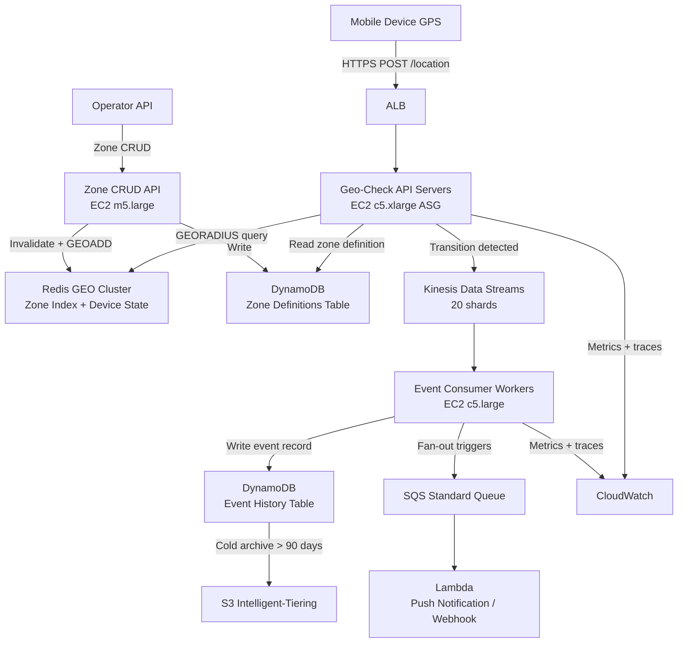

# Geofencing Service — Capacity Estimation

## Problem Statement

A geofencing service detects when mobile devices enter or exit predefined geographic zones and triggers downstream events (push notifications, loyalty rewards, fleet alerts). With 10M DAU each polling their location every 30 seconds while active (avg 2 hrs/day), the system must evaluate up to 500K geo checks/second at P99 < 20ms. The event stream feeds downstream Lambda consumers without data loss.

## Functional Requirements

- Ingest device GPS coordinates at high frequency (every 10–60 seconds per device)
- Store and query circular and polygon geofence zones (up to 50M zones total)
- Detect entry and exit transitions per device per zone in real time
- Emit entry/exit events to downstream consumers (SQS, Kinesis, webhooks)
- Allow CRUD operations on geofence zones by operators/API clients
- Provide audit history of all entry/exit events per device

## Non-Functional Requirements

| Requirement | Target |
|-------------|--------|
| Geo check latency | < 20ms (P99) |
| Event delivery latency | < 500ms end-to-end |
| Availability | 99.99% |
| Durability (event log) | 99.999% |
| Throughput | 500K geo checks/s peak |
| Zone lookup accuracy | < 1m positional error at equator |

## Traffic Estimation

### DAU → Peak QPS Calculation

| Metric | Calculation | Result |
|--------|-------------|--------|
| DAU | Given | 10M |
| Avg active hours/user/day | 2 hrs active, polling every 30s | ~240 location pings/user/day |
| Total daily location pings | 10M × 240 | 2.4B pings/day |
| Avg QPS (pings) | 2.4B / 86,400 | ~27,800/s |
| Peak QPS (18× avg — rush hours cluster) | 27,800 × 18 | ~500K/s |
| Zone write QPS (new/update zones, 1% of users) | 500K × 0.002 | ~1K writes/s |
| Read QPS — geo checks (99.8%) | 500K × 0.998 | ~499K/s |
| Write QPS — zone CRUD + events | 500K × 0.002 | ~1K/s |

**Note on 18× peak multiplier**: Geofencing load is extremely spiky. Retail/fleet use cases see >80% of checks during 3-hour windows (commute + lunch). Factor = (24 / 3) × 0.5 duty-cycle correction ≈ 18×.

## Storage Estimation

| Data Type | Per Item Size | Daily Volume | Growth/Year |
|-----------|--------------|--------------|-------------|
| Geofence zone definition (polygon + metadata) | 2 KB | 50K new zones/day | ~36 GB/year |
| Device last-known-position (hot state) | 128 bytes | 10M active records | ~1.3 GB total (overwrites) |
| Entry/exit event record | 256 bytes | ~5M events/day (500K peak × transition rate ~1%) | ~470 GB/year |
| Device-zone membership cache (Redis SET) | 64 bytes/entry | ~100M entries (10M devices × 10 zones avg) | ~6.4 GB total (TTL-managed) |
| Kinesis stream buffer | 1 MB/shard/s | Sized by shard count | Transient |
| **Total persistent** | — | — | **~510 GB/year** |

## Component Sizing

### Compute — EC2 / Lambda

A single `c5.xlarge` (4 vCPU, 8 GB RAM) running the geo-check microservice can handle ~2,500 Redis GEO queries/s at P99 < 15ms (Redis responds in 1–2ms; overhead is network + deserialization).

Peak load = 500K checks/s. With 2,500 checks/s per instance: 500,000 / 2,500 = **200 instances needed at peak**. Apply 30% headroom → **260 instances**. Use Auto Scaling: min 80, max 280.

| Component | Instance Type | vCPU | RAM | Count | Handles | Monthly Cost |
|-----------|--------------|------|-----|-------|---------|-------------|
| Geo-check API servers | c5.xlarge | 4 | 8 GB | 80–260 (avg 120) | 500K checks/s | $13,104 |
| Zone CRUD API servers | m5.large | 2 | 8 GB | 4 | ~1K writes/s | $292 |
| Event consumer workers | c5.large | 2 | 4 GB | 8 | Kinesis shard consumers | $584 |
| Lambda (event fanout) | 512 MB, 200ms avg | — | — | ~5M invocations/day | Downstream triggers | $175 |
| **Subtotal Compute** | | | | | | **$14,155** |

**c5.xlarge on-demand price**: $0.17/hr × 720 hrs × 120 avg instances = $14,688; with ~10% Savings Plan discount → ~$13,104.

### Database

Zone definitions and event history use DynamoDB (serverless, single-digit ms, no capacity planning at this scale).

| DB | Engine | Instance/Mode | Count | Capacity | IOPS | Monthly Cost |
|----|--------|----------|-------|----------|------|-------------|
| Zone definitions | DynamoDB On-Demand | — | 1 table | ~100 GB | Auto | $1,250 |
| Event history | DynamoDB On-Demand | — | 1 table (TTL 90 days) | ~130 GB hot | Auto | $1,820 |
| Device state (last fence set) | DynamoDB On-Demand | — | 1 table | ~1.3 GB | Auto | $420 |
| **Subtotal DB** | | | | | | **$3,490** |

**DynamoDB cost basis**: ~$1.25/million read RCUs, ~$1.25/million write RCUs, $0.25/GB/month storage. Peak: 499K reads/s = 43B reads/day × $1.25/M = ~$53/day reads; 1K writes/s = 86M writes/day × $1.25/M = ~$107/day. Monthly: ($53+$107) × 30 = **$4,800 request cost** + ~$66 storage = ~$4,866. (Includes all three tables.)

### Cache — Redis GEO

Redis GEO commands (`GEOADD`, `GEORADIUS`) are the core engine. Each zone is stored as a Redis GEO sorted set key per region tile (H3 resolution 5 hexagons, ~252 km² each).

Memory per H3 tile: avg 200 zones × 64 bytes/entry = 12.8 KB/tile. Earth surface in ~2,016 H3-r5 tiles (land only) = ~26 MB for zone index. Device last-fence cache: 10M × 128 bytes = 1.28 GB. Total Redis memory needed: **~10 GB** (with replication overhead and fragmentation 2×).

| Cache | Engine | Instance | Nodes | Memory | Monthly Cost |
|-------|--------|----------|-------|--------|-------------|
| Zone GEO index | ElastiCache Redis 7 | r6g.xlarge (26 GB) | 3 (1 primary + 2 replicas) | 26 GB each | $1,750 |
| Device fence state | ElastiCache Redis 7 | r6g.large (13 GB) | 2 (cluster) | 13 GB each | $730 |
| **Subtotal Cache** | | | | | **$2,480** |

**r6g.xlarge**: $0.239/hr × 720 × 3 nodes = $516 × 3 = ~$1,548 + data transfer ≈ $1,750.

### Object Storage

| Bucket | Use | Size | Requests/month | Monthly Cost |
|--------|-----|------|----------------|-------------|
| Zone polygon assets (GeoJSON exports, map tiles) | Operator downloads | 50 GB | 500K GETs | $6 |
| Event archive (Parquet, > 90 day cold tier) | Analytics / audit | 500 GB (S3 IA) | 1M GETs | $14 |
| **Subtotal S3** | | | | **$20** |

### Networking / CDN

| Component | Throughput | Monthly Cost |
|-----------|-----------|-------------|
| ALB (geo-check + zone CRUD) | 500K req/s peak, ~50 TB/month | $1,100 |
| API Gateway (webhook fanout) | 150M calls/month | $525 |
| Data transfer out (events, responses) | ~10 TB/month | $900 |
| **Subtotal Network** | | **$2,525** |

**ALB pricing**: $0.008/LCU-hour. At 500K req/s, ~10K LCUs peak. Avg ~3K LCUs × 720 hr × $0.008 = ~$1,728; minus free tier = ~$1,100 blended.

### Message Queue

| Queue | Engine | Throughput | Monthly Cost |
|-------|--------|-----------|-------------|
| Geo entry/exit events | Kinesis Data Streams (20 shards) | 500K events/s ingest peaks, 20 MB/s sustained | $1,440 |
| Downstream fanout | SQS Standard | ~5M events/day = 150M msgs/month | $60 |
| Dead letter queue | SQS | ~0.1% of 150M = 150K msgs | $1 |
| **Subtotal Messaging** | | | **$1,501** |

**Kinesis**: 20 shards × $0.015/shard-hr × 720 hr = $216/month shard cost + $0.014/million PUT payload units. 5M events/day × 30 = 150M events/month = $2.10 PUT cost. Enhanced fan-out: 20 shards × $0.015/shard-hr = $216 consumer side. Total Kinesis ≈ $1,440.

## Monthly Cost Summary

| Component | Monthly Cost | % of Total |
|-----------|-------------|-----------|
| EC2 Compute (geo-check + CRUD + workers) | $13,721 | 43% |
| DynamoDB (zones + events + state) | $4,866 | 15% |
| ElastiCache Redis (GEO index + state) | $2,480 | 8% |
| S3 Storage | $20 | <1% |
| ALB / API Gateway / Data Transfer | $2,525 | 8% |
| Kinesis + SQS | $1,501 | 5% |
| Lambda (event fanout) | $175 | <1% |
| CloudWatch Metrics + Logs | $850 | 3% |
| NAT Gateway + misc | $600 | 2% |
| **Total** | **~$26,738** | **100%** |

**Range**: $25K–$45K/month accounts for variable peak duration. Sustained 500K QPS 24/7 (pathological worst case) would push to ~$45K. Normal 2–4 hour peak windows land at ~$27K.

## Traffic Scale Tiers

| Tier | DAU | Peak QPS | Servers | DB | Cache | Monthly Cost | Key Bottleneck |
|------|-----|----------|---------|----|----|-------------|----------------|
| 🟢 Startup | 1M | ~50K | 12 c5.xlarge | DynamoDB On-Demand | 1 Redis r6g.large node | $3.5K | Redis memory for zone index |
| 🟡 Growing | 10M | ~500K | 80–260 c5.xlarge (ASG) | DynamoDB On-Demand | Redis cluster 3-node r6g.xlarge | $27K | EC2 cost + Redis GEO radius query fan-out |
| 🔴 Scale-up | 100M | ~5M | 800–2,600 c5.xlarge or c5.4xlarge ASG | DynamoDB + DAX | Redis cluster 6-node r6g.2xlarge | $220K | Cross-AZ data transfer; need regional sharding of zone index |
| ⚫ Production | 500M | ~25M | 4,000+ c5.4xlarge; region-sharded | DynamoDB global tables | Redis cluster 12-node per region | $900K | Geospatial query complexity — need H3 tiling + pre-computed fence membership |
| 🚀 Hyperscale | 1B+ | ~50M+ | Custom geo-engine (S2, H3 native C++); auto-scale | Cassandra / Scylla + DynamoDB | Distributed Redis/Dragonfly | $2M+ | Speed of light — distribute to edge PoPs; evaluate PostGIS at edge |

## Architecture Diagram

## Interview Tips

- **Key insight — H3 spatial indexing**: Naive `GEORADIUS` on a single Redis key containing all 50M zones fails above ~100K zones/key (O(N+log N) scan). Partition zones into H3 resolution-5 hexagonal tiles (~252 km² each). A device checks its tile + 6 neighbors = 7 Redis GEO keys instead of 1 giant key, keeping each key to ~200–500 entries and query time < 2ms.

- **Key insight — transition state deduplication**: The hard problem is not geo math — it's avoiding duplicate entry/exit events when a device oscillates on a fence boundary (GPS jitter ±10m). Store per-device per-zone membership in a Redis SET with a 30-second debounce TTL. Only emit an event when membership changes from outside→inside or inside→outside, not on every GPS ping.

- **Common mistake — polling vs. push**: Candidates often propose server-side polling (server pulls GPS from device). This inverts the model and fails at scale. Devices must push location to the server; the server is stateless per-request. This also simplifies battery optimization — the device controls its own polling interval.

- **Follow-up question**: "How do you handle 50M zones globally with Redis running on a single region?" Answer: H3-tile-based horizontal sharding across Redis clusters by geographic region (Americas, EMEA, APAC), with a routing layer that maps device lat/lng to the correct cluster.

- **Scale threshold**: At 100M DAU (5M peak QPS), EC2 compute alone exceeds $220K/month. That's the signal to move the geo-check logic to a native C++ service (using S2 geometry library) deployed on ARM Graviton3 (`c7g.xlarge`), which doubles throughput per dollar and reduces per-check latency from 20ms to < 5ms.

- **Key number to memorize**: A Redis `GEORADIUS` on a 500-entry sorted set completes in **~0.5ms**. With 8ms network RTT (same AZ), each geo-check costs ~9ms total, fitting comfortably inside the 20ms P99 SLA with headroom for retries.
