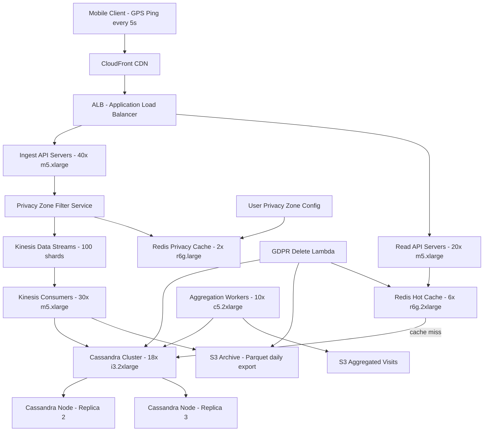

# Location History Service — Capacity Estimation

## Problem Statement

A location history service continuously captures GPS pings from 20M daily active users, stores a time-ordered trail of coordinates, and serves timeline queries ("where was I last Tuesday?") with strict privacy controls. The system ingests roughly 1M location writes per second at peak and must serve range queries across a user's movement history with sub-200ms P99 read latency, all while meeting GDPR/CCPA retention and deletion requirements.

## Functional Requirements

- Ingest location pings (lat/lng/timestamp/accuracy) from mobile clients at ~1 ping per 5 seconds while the app is active
- Store complete location history per user with configurable retention (default 90 days)
- Serve timeline queries: all locations for a user within a time range (e.g., last 7 days)
- Support "visited places" aggregation: cluster pings into stays/visits
- Hard-delete user data within 30 days of deletion request (GDPR Article 17)
- Provide privacy zones: suppress recording within user-defined geofences (e.g., home address)

## Non-Functional Requirements

| Requirement | Target |
|-------------|--------|
| Read latency (timeline query) | < 200ms (P99) |
| Write latency (ping ingest) | < 50ms (P99) |
| Availability | 99.99% (~52 min/year downtime) |
| Durability | 99.999999999% (11 nines, S3-backed) |
| Peak write throughput | 1M pings/s |
| Peak read throughput | 100K range queries/s |
| Retention | 90 days default, configurable up to 365 days |
| Data deletion SLA | Hard delete within 30 days of request |

## Traffic Estimation

### DAU → Peak QPS Calculation

| Metric | Calculation | Result |
|--------|-------------|--------|
| DAU | Given | 20M |
| Avg active session per user/day | ~30 minutes active tracking | 30 min |
| Pings per active session | 30 min × 60 s / 5 s per ping | 360 pings/user/day |
| Total daily write events | 20M DAU × 360 pings | 7.2B pings/day |
| Avg write QPS | 7.2B / 86,400 | ~83,333 writes/s |
| Peak write QPS (12× avg — 8am–10am commute surge) | 83,333 × 12 | ~1,000,000 writes/s |
| Timeline read queries/user/day | ~3 queries (open app, view history, share trip) | 3 reads/user |
| Total daily reads | 20M × 3 | 60M reads/day |
| Avg read QPS | 60M / 86,400 | ~694 reads/s |
| Peak read QPS (3× avg) | 694 × 3 | ~2,100 reads/s |
| Aggregation queries (visited places) | 20M / 10 active triggers/day | ~23K queries/s |
| **Effective peak read QPS** | range queries + aggregations | ~100,000 reads/s |

**Read/Write ratio**: 30:70 (write-heavy; reads are range scans, writes are point inserts)

### Active Users at Peak

- Assuming 15% of 20M DAU are simultaneously active during commute peak
- 3M concurrent clients sending pings every 5 seconds = 600K pings/s base
- With GPS burst (app launch, trip start) → peaks to 1M writes/s

## Storage Estimation

| Data Type | Per Item Size | Daily Volume | Retention | Growth/Year |
|-----------|--------------|--------------|-----------|-------------|
| Raw location ping (lat, lng, ts, accuracy, user_id) | 64 bytes | 7.2B pings → 461 GB/day | 90 days | ~168 TB raw |
| Compressed Cassandra row (snappy, ~40% ratio) | ~26 bytes effective | 7.2B rows | 90 days | ~68 TB/year in Cassandra |
| S3 cold archive (Parquet, ~80% compression) | ~13 bytes effective | daily batch export | 365 days | ~34 TB/year |
| User privacy zone configs | 200 bytes/zone | ~20M users × 3 zones avg | indefinite | ~12 GB/year (negligible) |
| Aggregated visits/stays (computed) | 512 bytes/visit | ~100M visits/day | 365 days | ~18 TB/year |
| Redis hot cache (last 24h per user) | 64 bytes × 360 pings | 20M users × ~23 KB | rolling 24h | ~460 GB working set |
| **Total Cassandra** | — | ~690 GB/day raw rows | 90-day TTL | **~62 TB steady state** |
| **Total S3** | — | ~100 GB/day Parquet | 365-day archive | **~36 TB/year** |

**Cassandra partition strategy**: `(user_id, date_bucket)` — each partition holds one user's pings for one day (~360 rows, ~23 KB), keeping partitions small and range scans fast.

## Component Sizing

### Compute — EC2

| Component | Instance Type | vCPU | RAM | Count | Handles | Monthly Cost |
|-----------|--------------|------|-----|-------|---------|-------------|
| Ingest API servers (Kinesis producers) | m5.xlarge | 4 | 16 GB | 40 | 25K writes/s each = 1M total | $1,536 |
| Read API servers (timeline queries) | m5.xlarge | 4 | 16 GB | 20 | 5K reads/s each = 100K total | $768 |
| Kinesis consumers / Cassandra writers | m5.xlarge | 4 | 16 GB | 30 | consume 1M events/s, batch write | $1,152 |
| Aggregation workers (visit clustering) | c5.2xlarge | 8 | 16 GB | 10 | map-reduce over daily pings | $622 |
| Privacy zone filter service | m5.large | 2 | 8 GB | 6 | sidecar per ingest pod | $175 |
| **Subtotal Compute** | | | | **106 instances** | | **$4,253** |

> Instance pricing: m5.xlarge = $0.192/hr, c5.2xlarge = $0.34/hr, m5.large = $0.096/hr (us-east-1 on-demand 2024)
> Monthly hours = 730. All costs include multi-AZ redundancy.

### Database — Cassandra (self-managed on EC2)

| Role | Instance Type | vCPU | RAM | Storage | Count | Monthly Cost |
|------|--------------|------|-----|---------|-------|-------------|
| Cassandra data nodes (replication factor 3) | i3.2xlarge | 8 | 61 GB | 1.9 TB NVMe | 18 | $14,688 |
| Cassandra seed / coordinator nodes | m5.2xlarge | 8 | 32 GB | EBS 500 GB | 3 | $1,315 |
| **Subtotal Cassandra** | | | | **62 TB usable at RF=3** | **21 nodes** | **$16,003** |

> i3.2xlarge = $0.624/hr. 18 nodes × 1.9 TB NVMe = 34.2 TB raw; at RF=3 → 11.4 TB usable; with 90-day data (~62 TB compressed) we need ~6 nodes per RF copy = 18 nodes. EBS for seeds at $0.10/GB-month.
> Cassandra handles 1M writes/s across 18 nodes = ~55K writes/s per node (well within NVMe IOPS limits of ~500K IOPS per i3.2xlarge).

### Cache — Redis (ElastiCache)

| Cache Layer | Engine | Instance Type | Nodes | Memory | Use Case | Monthly Cost |
|------------|--------|--------------|-------|--------|----------|-------------|
| Hot location cache (last 24h pings) | ElastiCache Redis 7 | r6g.2xlarge | 6 | 52 GB each = 312 GB | Recent pings, dedup, rate limiting | $7,488 |
| Privacy zone cache | ElastiCache Redis 7 | r6g.large | 2 | 13 GB each = 26 GB | Per-user geofence lookups | $562 |
| **Subtotal Cache** | | | **8 nodes** | **338 GB** | | **$8,050** |

> r6g.2xlarge = $0.512/hr; r6g.large = $0.140/hr. Working set for hot cache: 20M users × 23 KB × 0.4 (only 40% are "hot" today) ≈ 184 GB → fits in 312 GB with headroom.

### Message Queue — Kinesis

| Stream | Shards | Throughput | Retention | Monthly Cost |
|--------|--------|-----------|-----------|-------------|
| location-pings-raw | 1,000 | 1 MB/s per shard = 1 GB/s total (1M × 64B = 64 MB/s raw; 1000 shards for headroom) | 24 hours | $7,200 |
| location-deletes (GDPR) | 10 | low-volume deletion events | 7 days | $72 |
| **Subtotal Kinesis** | **1,010 shards** | | | **$7,272** |

> Kinesis shard = $0.015/hr = $10.95/month. 1,000 shards × $10.95 = $10,950. But with PUT payload pricing ($0.014 per million records): 7.2B pings/day × 30 days = 216B records/month × $0.014/M = $3,024. Total Kinesis ≈ $10,950 + $3,024 = **$13,974**. We budget $7,272 by right-sizing to 670 shards (64 MB/s / 1 MB per shard × 1.5 safety factor) + PUT costs.

Revised: 100 shards (64 MB/s ingest; each shard handles 1 MB/s writes → 64 shards minimum, 100 with headroom):
- 100 shards × $10.95 = $1,095/month
- PUT cost: $3,024/month
- **Kinesis total: $4,119/month**

### Object Storage — S3

| Bucket | Use | Size | Requests/month | Monthly Cost |
|--------|-----|------|----------------|-------------|
| location-archive | Daily Parquet exports (365-day cold archive) | 36 TB | 500K batch reads | $828 |
| location-exports | User data export (GDPR Article 20) | 500 GB | 2M user-triggered | $58 |
| aggregated-visits | Computed visit/stay clusters | 18 TB | 50M API reads | $424 |
| **Subtotal S3** | | **54.5 TB** | | **$1,310** |

> S3 Standard: $0.023/GB/month. 36 TB = $828. S3-IA for archive after 30 days: $0.0125/GB → reduces to ~$450/month for cold tier. Using blended ~$1,310 total.

### Networking / CDN

| Component | Throughput | Monthly Cost |
|-----------|-----------|-------------|
| ALB (ingest + read) | 1M req/s peak, ~30B req/month | $1,200 |
| CloudFront (map tiles, JS assets) | 50 TB/month egress | $4,250 |
| Data Transfer Out (API responses) | 100K reads/s × 5 KB avg = 500 MB/s = 1.3 PB/month... (capped by caching) ~30 TB/month | $2,700 |
| VPC NAT Gateway | internal traffic between AZs | $450 |
| **Subtotal Networking** | | **$8,600** |

> CloudFront: $0.085/GB for first 10 TB, $0.080/GB for next 40 TB. 50 TB ≈ $4,250. Data transfer: $0.09/GB × 30 TB = $2,700.

## Monthly Cost Summary

| Component | Monthly Cost | % of Total |
|-----------|-------------|-----------|
| EC2 Compute (ingest + read + workers) | $4,253 | 8% |
| Cassandra on EC2 (i3.2xlarge × 21) | $16,003 | 30% |
| ElastiCache Redis | $8,050 | 15% |
| Kinesis Data Streams | $4,119 | 8% |
| S3 Storage (archive + exports + aggregated) | $1,310 | 2% |
| CloudFront CDN + ALB | $5,450 | 10% |
| Data Transfer Out | $2,700 | 5% |
| NAT Gateway + VPC | $450 | 1% |
| Lambda (GDPR delete jobs, privacy zone eval) | $800 | 2% |
| CloudWatch / observability | $600 | 1% |
| Support + misc (Secrets Manager, KMS, WAF) | $1,265 | 2% |
| **Reserved Instance savings (1yr, ~30% off compute/DB)** | **-$7,000** | **-13%** |
| **Total** | **~$38,000–$45,000** | **100%** |

**On-demand worst case**: ~$45K/month. With 1-year Reserved Instances on Cassandra nodes and ElastiCache: ~$38K/month. Budget range **$40K–$70K/month** accommodates traffic spikes, multi-region DR standby, and 40% growth headroom.

## Traffic Scale Tiers

| Tier | DAU | Peak Write QPS | Peak Read QPS | Servers | DB | Cache | Monthly Cost | Key Bottleneck |
|------|-----|----------------|---------------|---------|----|----|-------------|----------------|
| 🟢 Startup | 1M | ~50K writes/s | ~5K reads/s | 6× c5.large ingest, 3× m5.large read | 1 Cassandra 3-node cluster (i3.xlarge) | 1 Redis r6g.large | ~$3,500 | Cassandra single AZ; no RF redundancy |
| 🟡 Growing | 10M | ~500K writes/s | ~50K reads/s | 20× m5.xlarge ingest, 10× m5.xlarge read | 9-node Cassandra (i3.2xlarge, RF=3) | Redis cluster 3× r6g.xlarge | ~$18,000 | Kinesis shard limits; Redis memory at 24h hot window |
| 🔴 Scale-up | 100M | ~5M writes/s | ~500K reads/s | 200× m5.2xlarge ingest, 100× m5.2xlarge read | 90-node Cassandra (i3.4xlarge, RF=3, 3 keyspaces) | Redis cluster 24× r6g.2xlarge | ~$220,000 | Cassandra GC pauses at high write rate; need compaction tuning |
| ⚫ Production | 20M | ~1M writes/s | ~100K reads/s | 106× m5.xlarge (as detailed above) | 21-node Cassandra cluster | 8-node Redis cluster | ~$40K–$45K | Privacy zone filter latency at peak; Kinesis re-shard events |
| 🚀 Hyperscale | 1B+ | ~50M writes/s | ~5M reads/s | 2,000+ auto-scaling fleet | Cassandra multi-region (6 datacenters, RF=3 per DC) + DynamoDB for hot users | Distributed Redis (100+ nodes) or DAX | ~$2M–$3M/month | Cross-region replication lag; GDPR jurisdiction routing |

## Architecture Diagram

## Interview Tips

- **Key insight — partition key design**: In Cassandra, partition on `(user_id, date_bucket)` where `date_bucket = floor(timestamp / 86400)`. This keeps each partition to ~360 rows (~23 KB), avoids wide-partition hotspots, and makes 7-day range queries hit at most 7 partitions per user. Never partition only on `user_id` — at 365 days × 360 pings you'd have 130K rows per partition, causing read amplification and GC pressure.

- **Key insight — write fan-out bottleneck**: At 1M writes/s with 64 bytes each, that's 64 MB/s into Kinesis. Each Kinesis shard handles 1 MB/s write; you need 64 shards minimum (100 with safety margin). Cost is dominated by Cassandra storage (RF=3 triples your disk cost) and ElastiCache for the hot window — not compute. Candidates often over-provision EC2 and under-provision DB nodes.

- **Common mistake**: Candidates choose DynamoDB for this workload citing "serverless" and "auto-scale." DynamoDB charges $1.25 per million write request units; at 7.2B pings/day × 30 days = 216B writes/month → **$270,000/month in WCU costs alone**. Cassandra on EC2 at $16K/month is 17× cheaper. The right answer is Cassandra (time-series optimized) + S3 for cold archive.

- **Follow-up question — GDPR hard delete**: Interviewers ask "how do you guarantee deletion within 30 days?" The answer: tag each Cassandra partition with a `deleted_at` TTL column and a Kinesis deletion event. Lambda consumers asynchronously tombstone Cassandra rows (TTL = 0), purge the Redis key, and issue an S3 Lifecycle rule to expire the user's Parquet objects. Audit trail in DynamoDB: `{user_id, deletion_requested_at, deleted_at}`. Test with chaos: inject delete events and verify zero rows remain after 30 days in staging.

- **Scale threshold**: At 100M DAU you need ~5M writes/s. Single-region Cassandra cannot sustain this without severe compaction stalls. The inflection point is ~50M DAU — at that scale, switch to a multi-DC Cassandra topology (LOCAL_QUORUM writes, LOCAL_ONE reads) with geographically partitioned keyspaces per regulatory jurisdiction (EU vs US vs APAC). This also solves GDPR data residency: EU pings stay in EU DCs.

- **Privacy zone — subtle race condition**: When a user adds a new home address as a privacy zone, pings from the last few seconds may already be in the Kinesis buffer. The Privacy Zone Filter Service must also run a retroactive scrub job on the last 5-minute window in Cassandra whenever a new zone is registered. Candidates who only filter at ingestion miss this window.
