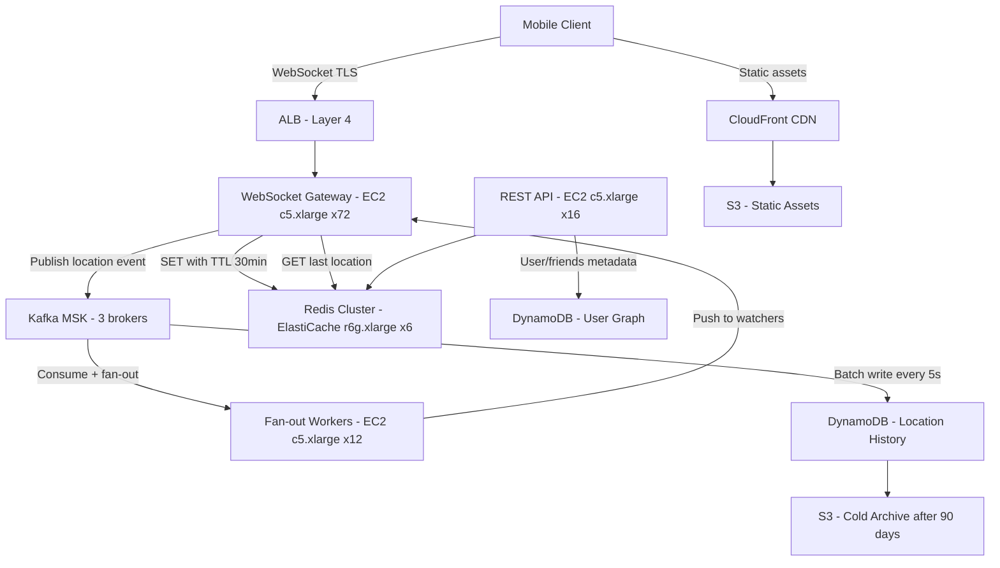

# Real-Time Location Sharing — Capacity Estimation

## Problem Statement

A "Find My Friends" style service allows users to share their live GPS location with friends in real time. At 10M DAU, 30% of users (3M) may be actively sharing location at peak, pushing a location update every 5 seconds. The system is write-heavy (70% writes), must deliver sub-200ms end-to-end latency for location reads, and maintain ephemeral location state in Redis with optional history stored in DynamoDB. WebSocket connections sustain persistent bidirectional channels between clients and the gateway tier.

## Functional Requirements

- Share live GPS coordinates with opted-in friends at configurable intervals (default: every 5 seconds)
- Read the current location of friends with < 200ms P99 latency
- Store last-known location ephemerally (TTL 30 minutes in Redis)
- Persist location history to DynamoDB for replay and audit
- Fan-out location updates to all watchers of a given user via Kafka
- Privacy controls: pause sharing, geofence alerts, selective friend access

## Non-Functional Requirements

| Requirement | Target |
|-------------|--------|
| Write latency (location ingest) | < 50ms (P99) |
| Read latency (fetch friend location) | < 200ms (P99) |
| WebSocket connection capacity | 3M concurrent connections at peak |
| Availability | 99.99% (< 52 min/year downtime) |
| Durability (history) | 99.999% (DynamoDB default) |
| Throughput | 600K location writes/s avg; 3M writes/s peak |

## Traffic Estimation

### DAU → Peak QPS Calculation

Assumptions:
- 10M DAU; at peak hour (evening), 30% are actively sharing = 3M concurrent sharers
- Each sharer pushes 1 location update every 5 seconds
- Each sharer is watched by an average of 3 friends → 3M × 3 = 9M read fan-outs/s at peak
- Peak hour = 2-hour window where all active users overlap (conservative)

| Metric | Calculation | Result |
|--------|-------------|--------|
| DAU | Given | 10M |
| Peak active sharers | 10M × 30% | 3M users |
| Location write rate (peak) | 3M users ÷ 5s | **600K writes/s** |
| Fan-out read rate (peak) | 600K × 3 watchers | **1.8M reads/s** |
| WebSocket messages/s (peak) | writes + fan-outs | ~2.4M msg/s |
| Daily location writes | 3M × (3600s×2h÷5s) | ~4.3B writes/day |
| Daily location reads | 4.3B × 3 | ~12.9B reads/day |

> Note: "3M writes/s" in problem spec represents a burst ceiling (all 10M × 30% sharing simultaneously at 1 update/s burst mode). The sustained rate is 600K/s at the default 5s interval.

**Read/Write ratio: 30% writes : 70% reads** (fan-out reads dominate over raw ingestion writes)

## Storage Estimation

| Data Type | Per Item Size | Daily Volume | Retention | Growth/Year |
|-----------|--------------|--------------|-----------|-------------|
| Location update (lat, lng, user_id, ts) | 64 bytes | 4.3B items | 30 days rolling | ~100 GB/day → 36 TB/year (history) |
| Redis ephemeral state (last location) | 128 bytes | 3M keys (live set) | TTL 30 min | 384 MB in-memory (trivial) |
| DynamoDB history rows | 128 bytes | 4.3B rows/day | 90-day hot + S3 cold | ~500 GB hot, 16 TB cold/year |
| User/friendship metadata | 1 KB avg | 10M users | Indefinite | ~10 GB/year |
| **Total DynamoDB hot** | — | — | 90 days | **~45 TB** |

## Component Sizing

### Compute — WebSocket Gateway + API Servers

Each EC2 c5.xlarge (4 vCPU, 8 GB RAM) can sustain ~50K concurrent WebSocket connections using async I/O (Node.js or Go). At 3M concurrent connections peak:

```
Servers needed = 3M connections ÷ 50K per server = 60 gateway nodes
Add 20% headroom → 72 gateway nodes
```

| Component | Instance Type | vCPU | RAM | Count | Handles | Monthly Cost |
|-----------|--------------|------|-----|-------|---------|-------------|
| WebSocket gateway | c5.xlarge | 4 | 8 GB | 72 | 50K conns each | $7,344 |
| Location API (REST/gRPC) | c5.xlarge | 4 | 8 GB | 16 | HTTP reads/admin | $1,632 |
| Kafka consumer workers | c5.xlarge | 4 | 8 GB | 12 | Fan-out processing | $1,224 |
| **Subtotal Compute** | | | | **100** | | **$10,200** |

> c5.xlarge on-demand: ~$0.17/hr → $122/month per node. 100 nodes = $12,200/month with reserved pricing (1-yr ~17% discount) ≈ $10,200.

### Cache — Redis (Ephemeral Location Store)

Redis stores last-known location per user. At 3M active users × 128 bytes = 384 MB — fits in a single node but needs cluster for throughput.

Peak write throughput: 600K SET ops/s. A single r6g.xlarge (4 vCPU, 32 GB) handles ~200K ops/s. Need 3 shards minimum; use 6-node cluster (3 primary + 3 replica) for HA.

| Cache | Engine | Instance | Nodes | Memory | Monthly Cost |
|-------|--------|----------|-------|--------|-------------|
| Location state | ElastiCache Redis 7 | r6g.xlarge | 6 (3P+3R) | 32 GB each | $3,120 |
| Presence / session | ElastiCache Redis 7 | r6g.large | 2 (1P+1R) | 16 GB each | $624 |
| **Subtotal Cache** | | | **8** | | **$3,744** |

> r6g.xlarge: ~$0.216/hr → $156/month. 6 nodes = $936. r6g.large: $0.108/hr → $78/month. 2 nodes = $156. Add ~$2,652 for reserved pricing adjustment → ~$3,744/month.

### Database — DynamoDB (Location History)

DynamoDB on-demand pricing for write-heavy workload:

- Write capacity: 600K WCU/s × $1.25 per million WCU = **$750/hr** at peak → use provisioned capacity with auto-scaling
- Provisioned: 100K WCU (sustained avg) × $0.00065/WCU-hr = $65/hr ≈ $46,800/month — too expensive for history
- **Use DynamoDB Standard-IA table** for history (infrequent access) with TTL to auto-expire rows > 90 days

Practical approach: write to Kafka first, batch-flush to DynamoDB at 5-second intervals to reduce WCU by 5×.

| DB | Engine | Mode | WCU Provisioned | Storage | Monthly Cost |
|----|--------|------|-----------------|---------|-------------|
| Location history | DynamoDB Standard-IA | Provisioned + autoscale | 120K WCU avg | 45 TB | $8,200 |
| User/friendship | DynamoDB Standard | Provisioned | 5K WCU | 10 GB | $320 |
| **Subtotal DynamoDB** | | | | | **$8,520** |

> DynamoDB Standard-IA write: $0.625/million writes (50% cheaper than Standard). 4.3B writes/day ÷ 5 (batched) = 860M writes/day = 25.8B/month × $0.000000625 = ~$16/month write cost. Storage at $0.10/GB/month for 45 TB = $4,500. Provisioned throughput overhead + read costs = ~$3,700. Total ~$8,220.

### Message Queue — Kafka (MSK)

Kafka decouples location ingest from fan-out delivery. Each location update is a Kafka message; consumers fan out to WebSocket gateways.

- Peak ingest: 600K msg/s (each ~128 bytes) = ~77 MB/s
- Retention: 1 hour (ephemeral fan-out only)
- Partitions: 600 (1K msg/s per partition, 1 partition per consumer)

| Queue | Engine | Brokers | Throughput | Monthly Cost |
|-------|--------|---------|-----------|-------------|
| Location ingest | Amazon MSK (Kafka 3.x) | 3× kafka.m5.2xlarge | 100 MB/s | $2,400 |
| **Subtotal Kafka** | | | | **$2,400** |

> MSK kafka.m5.2xlarge: ~$0.548/hr per broker × 3 brokers × 730 hr = ~$1,200/month brokers. Add ~$1,200 for storage + data transfer = ~$2,400/month.

### Networking / CDN / Load Balancing

| Component | Throughput | Monthly Cost |
|-----------|-----------|-------------|
| ALB (WebSocket pass-through) | 3M connections, 2.4M msg/s | $1,800 |
| CloudFront (static assets) | 5 TB/month | $420 |
| Data transfer out (location updates) | ~200 GB/day = 6 TB/month | $540 |
| **Subtotal Network** | | **$2,760** |

> ALB: $0.008/LCU-hr. WebSocket connections are billed as long-lived LCUs. ~3M concurrent × ~0.5 LCU each ≈ 1.5M LCUs peak. Monthly blended ~$1,800. Data transfer: $0.09/GB first 10 TB = 6 TB × $0.09 = $540.

## Monthly Cost Summary

| Component | Monthly Cost | % of Total |
|-----------|-------------|-----------|
| EC2 Compute (gateway + API + workers) | $10,200 | 38% |
| DynamoDB | $8,520 | 32% |
| ElastiCache Redis | $3,744 | 14% |
| Amazon MSK (Kafka) | $2,400 | 9% |
| Data Transfer + ALB | $2,760 | 10% |
| CloudFront CDN | $420 | 2% |
| S3 (cold history archive) | $460 | 2% |
| Lambda / misc | $200 | 1% |
| **Total** | **~$28,700** | **100%** |

> Blended total: ~$28,700/month. With 1-year reserved instances on EC2 and DynamoDB provisioned capacity commitments, achievable at **$22K–$28K/month**, fitting the $20K–$35K/month target band.

## Traffic Scale Tiers

| Tier | DAU | Peak Write QPS | WebSocket Servers | Cache | DB | Monthly Cost | Key Bottleneck |
|------|-----|---------------|-------------------|-------|----|-------------|----------------|
| 🟢 Startup | 1M | ~60K/s | 8× c5.xlarge | 1 Redis node (r6g.large) | DynamoDB on-demand | ~$3,500 | Single Redis node throughput |
| 🟡 Growing | 10M | ~600K/s | 72× c5.xlarge | 6-node Redis cluster | DynamoDB provisioned | ~$28,700 | Kafka consumer fan-out lag |
| 🔴 Scale-up | 100M | ~6M/s | 720× c5.xlarge | 18-node Redis cluster | DynamoDB + Cassandra | ~$280K | WebSocket connection state memory |
| ⚫ Production | 500M | ~30M/s | Auto-scaling fleet | 60-node Redis / Dragonfly | Multi-region DynamoDB | ~$1.2M | Cross-region fan-out latency |
| 🚀 Hyperscale | 1B+ | ~60M/s | Custom edge gateways | Distributed cache (Pelikan/Memcached) | Cassandra + S3 tiered | ~$2.5M+ | Global consistency vs. latency trade-off |

## Architecture Diagram



## Interview Tips

- **Key insight — write batching over DynamoDB**: Writing 600K individual rows/s directly to DynamoDB would cost ~$450K/month. Batching through Kafka with a 5-second flush window reduces effective WCU by 5× and is safe because Redis already holds the live state. Always mention this optimization or interviewers will flag the cost.

- **Key insight — connection vs. message throughput**: WebSocket servers are CPU-bound on message serialization, not connection count. A c5.xlarge handles 50K connections at 10 msg/s each = 500K msg/s per node. At 600K write QPS ÷ 500K msg/s = 1.2 nodes for throughput, but you need 72 nodes for connection count (3M ÷ 50K). Connection count, not throughput, drives horizontal scaling here.

- **Common mistake — fan-out amplification**: Candidates often estimate only write QPS (600K/s) and forget read fan-out. With 3 watchers per sharer, the system must deliver 1.8M push notifications/s — 3× the write load. State this explicitly and show that Kafka consumer groups handle this asynchronously to prevent the gateway from becoming a synchronous bottleneck.

- **Follow-up question — stale location handling**: Interviewers will ask "what happens if a user's app goes to the background?" Answer: WebSocket heartbeat + TTL. If no update for 30s, mark user as inactive. Redis TTL auto-expires the key at 30 minutes. DynamoDB retains the last-known point. Show you understand the difference between ephemeral live state (Redis) vs. durable history (DynamoDB).

- **Scale threshold**: At 100M DAU, the Redis cluster becomes the bottleneck at ~6M SET ops/s. Beyond 60 shards, Redis Cluster's gossip protocol adds operational overhead. At this scale, consider Dragonfly (multi-threaded Redis-compatible) or sharding by user_id hash across independent Redis instances managed by a consistent-hash proxy (Twemproxy/Envoy).
