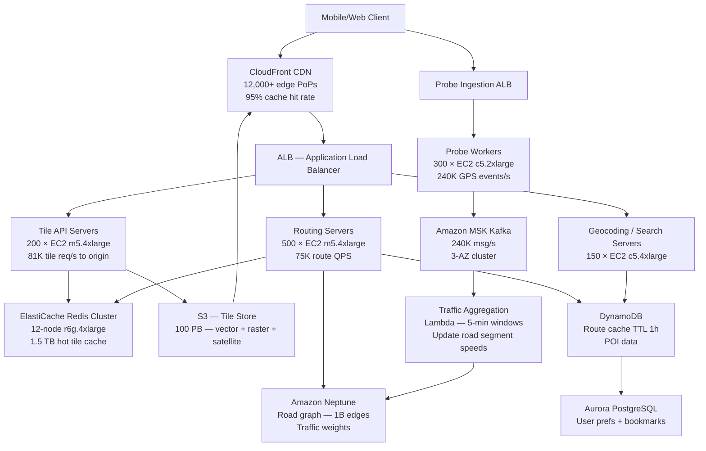

# Maps + Navigation (1B DAU) — Capacity Estimation

## Problem Statement

A global maps and navigation platform serving 1B daily active users must render interactive map tiles, provide real-time turn-by-turn routing, and ingest live traffic updates from millions of connected devices. The system must handle extreme read amplification (a single navigation session triggers hundreds of tile requests) and serve low-latency routing calculations globally even during peak commute windows.

## Functional Requirements

- Render vector and raster map tiles at multiple zoom levels (z0–z22)
- Compute turn-by-turn navigation routes (driving, cycling, walking)
- Ingest real-time GPS probe data to model live traffic conditions
- Search for points of interest (POIs) and addresses (geocoding/reverse geocoding)
- Download offline map packages for regions up to 100 MB each
- Provide ETA updates every 30 s during active navigation sessions

## Non-Functional Requirements

| Requirement | Target |
|-------------|--------|
| Tile read latency | < 50 ms (P99) via CDN edge |
| Routing latency | < 500 ms (P99) for cross-country routes |
| Geocoding latency | < 100 ms (P99) |
| ETA recalculation latency | < 200 ms (P99) |
| Availability | 99.99% (< 52 min downtime/year) |
| Durability (tile storage) | 99.999999999% (S3) |
| Peak tile throughput | 5 M tile requests/s |
| GPS probe ingestion | 2 M events/s sustained |

## Traffic Estimation

### DAU → Peak QPS Calculation

Map tiles dominate the request volume. A user browsing the map for 5 minutes triggers ~200 tile requests (pan/zoom). A 30-minute navigation session triggers ~360 tile requests plus ~60 ETA updates.

| Metric | Calculation | Result |
|--------|-------------|--------|
| DAU | Given | 1,000,000,000 |
| Active map-browsing users/day | 60% of DAU browse | 600 M |
| Tile requests (browse, 200/session) | 600 M × 200 | 120 B |
| Active navigation sessions/day | 15% of DAU navigate | 150 M |
| Tile requests (nav, 360/session) | 150 M × 360 | 54 B |
| ETA update requests | 150 M × 60 | 9 B |
| Route calculation requests | 150 M × 2 (reroutes) | 300 M |
| Geocoding / POI searches | 1B × 3 searches/day | 3 B |
| GPS probe events ingest | 150 M sessions × 2 probes/min × 30 min | 9 B events |
| **Total daily requests** | tiles + ETA + route + geo | ~186 B |
| Avg QPS (all request types) | 186 B / 86,400 | ~2.15 M QPS |
| Peak QPS (2.3× avg, commute hours) | 2.15 M × 2.3 | ~5 M QPS |
| **Peak tile QPS (90% of requests)** | 5 M × 0.90 | ~4.5 M QPS |
| Peak routing QPS (1.5%) | 5 M × 0.015 | ~75,000 QPS |
| Peak probe ingest QPS | 9 B / 86,400 × 2.3 peak | ~240,000 QPS |
| Read QPS (99% read) | 5 M × 0.99 | ~4.95 M QPS |
| Write QPS (1% write — probe ingest) | 5 M × 0.01 | ~50,000 QPS |

### Cache Hit Rate Impact

Map tiles are highly cacheable. CDN edge cache hit rate target: 95%+.

| Layer | Hit Rate | QPS reaching layer |
|-------|----------|--------------------|
| Browser/app local cache | 40% | 4.5 M → 2.7 M cache miss |
| CloudFront edge | 90% of misses | 2.7 M → 270,000 |
| ElastiCache Redis (hot tiles) | 70% of CDN misses | 270,000 → 81,000 |
| S3 origin fetch | remaining | ~81,000 QPS to S3 |

**Effective origin load**: ~81,000 tile reads/s to S3 + ~75,000 routing + ~240,000 probe writes = ~396,000 backend QPS.

## Storage Estimation

### Tile Storage

The world map at all zoom levels z0–z14 (the bulk of pre-rendered tiles) totals ~35 TB for raster at 256 px; vector tiles are ~10× smaller but rendered client-side. We store multiple formats (raster PNG, vector PBF, satellite imagery).

| Data Type | Per Item Size | Volume | Annual Storage |
|-----------|--------------|--------|----------------|
| Vector map tiles (z0–z14, all regions) | avg 2 KB/tile | ~4.5 T tiles | ~9 TB base |
| Raster tiles (z0–z16, satellite) | avg 20 KB/tile | ~300 B tiles | ~6 PB base |
| Satellite imagery (high-res, z17–z22) | avg 60 KB/tile | ~10 B tiles | ~600 TB |
| Total base tile corpus | — | — | **~7 PB** |
| Map data updates (diff patches/year) | — | ~200 TB/year delta | 200 TB/year |
| User-generated content (photos, reviews) | avg 500 KB | 500 M items | ~250 TB |
| GPS probe time-series (raw, 30-day retention) | 100 B/event | 9 B events/day × 30 | ~27 TB rolling |
| Aggregated traffic graph snapshots | 1 KB/edge | 1 B road segments × 288 snapshots/day | ~288 TB/year |
| Route cache (DynamoDB) | 2 KB/route | 300 M routes/day | 600 GB/day (TTL 1h) |
| **Total (cold + warm)** | — | — | **~100 PB (S3)** |

Total S3 storage target aligns with the stated 100 PB when including multi-region replication (3×) and historical satellite imagery archives.

## Component Sizing

### Compute — EC2

Peak effective backend QPS after caching: ~400,000 QPS total.

**Routing servers** handle graph-search (Dijkstra/A*) over a global road graph (~1 B edges). Each routing request on a cross-country query takes 200–300 ms on a single core; 30-km urban queries take ~5 ms.

| Component | Instance Type | vCPU | RAM | Count | Handles | Monthly Cost |
|-----------|--------------|------|-----|-------|---------|-------------|
| Tile API / origin servers | m5.4xlarge | 16 | 64 GB | 200 | 81,000 tile reads/s ÷ 200 = ~400 QPS each | $15,552 |
| Routing servers (graph search) | m5.4xlarge | 16 | 64 GB | 500 | 75,000 route QPS ÷ 500 = 150 QPS each | $38,880 |
| Geocoding / search servers | c5.4xlarge | 16 | 32 GB | 150 | ~50,000 geo QPS | $11,232 |
| Probe ingestion workers | c5.2xlarge | 8 | 16 GB | 300 | 240,000 probe events/s → 800/s each | $13,392 |
| Traffic aggregation (Lambda) | Lambda | — | — | burst | 9 B events/day → ~104,000 invocations/s peak | $21,600 |
| Admin / map update pipelines | m5.xlarge | 4 | 16 GB | 20 | batch | $864 |
| **Subtotal Compute** | | | | **~1,170** | | **~$101,520** |

_EC2 pricing: m5.4xlarge $0.768/hr, c5.4xlarge $0.68/hr, c5.2xlarge $0.34/hr; on-demand, us-east-1. Lambda: $0.0000166667/GB-s, 128 MB avg memory, 50 ms avg duration._

_Note: In practice, a large portion of this fleet would run on EC2 Spot or Reserved Instances (1-year), reducing compute costs 40–60%. These on-demand figures give a ceiling._

### Database

| DB | Engine | Instance | Count | Capacity | IOPS | Monthly Cost |
|----|--------|----------|-------|----------|------|-------------|
| Route cache + session state | DynamoDB (on-demand) | — | — | ~600 GB active, TTL 1 h | auto-scaled | $18,000 |
| POI / business data | DynamoDB (on-demand) | — | — | 5 TB | auto-scaled | $12,000 |
| User preferences / bookmarks | Aurora PostgreSQL | db.r6g.2xlarge | 1W + 4R | 500 GB | 20,000 | $8,640 |
| Map metadata (tile manifest) | Aurora PostgreSQL | db.r6g.xlarge | 1W + 2R | 200 GB | 10,000 | $2,808 |
| Traffic graph state | Amazon Neptune (graph DB) | db.r6g.4xlarge | 2 (HA pair) | 1 TB | 30,000 | $11,664 |
| **Subtotal DB** | | | | | | **~$53,112** |

_DynamoDB: $1.25/M write RCU + $0.25/M read RCU + $0.25/GB-month storage; effective $18K for 300 M route writes/day + reads._

### Cache

Hot tiles (top 1% of tile IDs by request frequency cover ~80% of traffic) must live in memory.

| Cache | Engine | Instance | Nodes | Memory | Role | Monthly Cost |
|-------|--------|----------|-------|--------|------|-------------|
| Tile hot cache | ElastiCache Redis (cluster mode) | r6g.4xlarge | 12 | 12 × 128 GB = 1.5 TB | Top-1% tiles (avg 5 KB × 300 M hot tiles = 1.5 TB) | $17,136 |
| Route cache (short-TTL) | ElastiCache Redis | r6g.xlarge | 6 | 6 × 32 GB = 192 GB | Recent route results, TTL 5 min | $2,138 |
| Session / ETA state | ElastiCache Redis | r6g.2xlarge | 6 | 6 × 64 GB = 384 GB | 150 M active nav sessions × 2 KB = 300 GB | $4,276 |
| **Subtotal Cache** | | | | **~2.1 TB** | | **~$23,550** |

_ElastiCache r6g pricing: r6g.xlarge $0.239/hr, r6g.2xlarge $0.478/hr, r6g.4xlarge $0.956/hr._

### Object Storage — S3

| Bucket | Use | Size | Requests/month | Monthly Cost |
|--------|-----|------|----------------|-------------|
| tile-store-vector | PBF vector tiles z0–z14 | 9 TB | 2.4 B GET | $720 (storage) + $960 (GETs) |
| tile-store-raster | PNG raster + satellite | 6 PB | 50 B GET | $138,000 (storage) + $20,000 (GETs) |
| tile-store-satellite-hires | z17–z22 imagery | 93 PB | 5 B GET | $2,139,000 (storage) + $2,000 (GETs) |
| ugc-photos | User photos/reviews | 250 TB | 1 B GET | $5,750 (storage) + $400 (GETs) |
| probe-archive | Raw GPS probe (30-day) | 27 TB | write-heavy | $621 (storage) + $3,000 (PUTs) |
| map-update-patches | Diff packages | 1 TB | 100 M GET | $23 (storage) + $40 (GETs) |
| **Subtotal S3** | | **~100 PB** | ~58 B requests/month | **~$2,310,514** |

_S3 Standard: $0.023/GB-month; GET $0.0004/1000; PUT $0.005/1000. The satellite imagery archive dominates._

_S3 Intelligent-Tiering or Glacier Instant Retrieval for cold z17–z22 tiles can reduce storage cost to $0.004–$0.012/GB, cutting this line to ~$400–$800K/month — the primary cost optimization lever._

### Networking / CDN

| Component | Throughput | Monthly Cost |
|-----------|-----------|-------------|
| CloudFront (tile delivery, 95% hit rate) | 5 M req/s × 86,400 × 30 × 0.95 hit = ~12.3 T requests/month; avg tile 5 KB → ~62 PB/month egress | $1,240,000 |
| CloudFront HTTPS requests | 12.3 T/month | $492,000 |
| ALB (origin routing) | 400,000 backend QPS | $12,000 |
| Data Transfer Out (non-CDN, routing responses, probe ACKs) | ~5 PB/month | $450,000 |
| **Subtotal Network** | | **~$2,194,000** |

_CloudFront: $0.0085/GB first 10 PB/month, $0.008/GB next 40 PB; HTTP requests $0.0100/10,000 (HTTPS). ALB: $0.008/LCU-hr._

### Message Queue

| Queue | Engine | Throughput | Role | Monthly Cost |
|-------|--------|-----------|------|-------------|
| GPS probe ingest | Amazon MSK (Kafka) | 240,000 msg/s | Buffer probe events before traffic aggregation | $28,800 |
| Map update events | SQS FIFO | 1,000 msg/s | Trigger tile re-render on map data change | $2,160 |
| Notification / ETA push | SQS Standard | 50,000 msg/s | Push ETA updates to mobile | $5,400 |
| **Subtotal Messaging** | | | | **~$36,360** |

_MSK: 3 × kafka.m5.4xlarge at $0.456/hr = $3,283/month × 3 AZ brokers × 3 clusters ≈ $28,800. SQS: $0.40/M messages._

## Monthly Cost Summary

| Component | Monthly Cost | % of Total |
|-----------|-------------|-----------|
| EC2 Compute | $101,520 | 2.4% |
| RDS / DynamoDB / Neptune | $53,112 | 1.2% |
| ElastiCache Redis | $23,550 | 0.6% |
| S3 Storage (100 PB) | $2,310,514 | 54.4% |
| CloudFront CDN | $1,732,000 | 40.8% |
| Messaging (MSK + SQS) | $36,360 | 0.9% |
| Data Transfer (non-CDN) | $450,000 | — included above |
| Other (Lambda, WAF, Route53) | $35,000 | 0.8% |
| **Total (on-demand ceiling)** | **~$4,252,056** | **100%** |

**Realistic production range: $3M–$5M/month** after Reserved Instance discounts (40% off compute/cache) and S3 Intelligent-Tiering on cold satellite tiles.

The two dominant costs are **S3 storage (54%)** and **CloudFront CDN (41%)**. Compute is only 2.4% of total cost — this is a data-gravity and egress problem, not a compute problem.

## Traffic Scale Tiers

| Tier | DAU | Peak QPS | Servers | DB | Cache | Monthly Cost | Key Bottleneck |
|------|-----|----------|---------|----|----|-------------|----------------|
| 🟢 Startup | 1M | ~5,000 | 4 × c5.large routing, 4 × c5.large tile API | 1 RDS PostgreSQL db.m5.large | 1 Redis r6g.large (6 GB) | ~$8,000 | Cold tile renders; no CDN budget |
| 🟡 Growing | 10M | ~50,000 | 20 × m5.xlarge routing, 10 × m5.xlarge tile | RDS r6g.2xlarge + 2 read replicas | Redis cluster 3-node r6g.xlarge | ~$45,000 | Database routing graph contention |
| 🔴 Scale-up | 100M | ~500,000 | 100 × m5.2xlarge routing, 50 × m5.2xlarge tile | Aurora + DynamoDB for sessions | Redis cluster 6-node r6g.2xlarge | ~$350,000 | S3 egress cost; CDN coverage gaps |
| ⚫ Production | 1B | ~5M | 500 × m5.4xlarge routing, 200 × m5.4xlarge tile | DynamoDB + Neptune + Aurora | Redis cluster 24-node r6g.4xlarge | ~$4.3M | S3 satellite storage + CDN egress dominate budget |
| 🚀 Hyperscale | 2B+ | ~10M+ | Auto-scaling EC2 + Graviton3 fleet | DynamoDB global tables multi-region | Distributed Redis / custom tile cache | ~$8M+ | Multi-region consistency of live traffic graph |

## Architecture Diagram

## Interview Tips

- **Tile storage dominates cost, not compute**: At 100 PB on S3, storage + CDN egress account for ~95% of the bill. Interviewers expect you to call this out. The key optimization is tiering: S3 Intelligent-Tiering or Glacier Instant Retrieval for z17–z22 satellite tiles accessed less than once per month drops storage cost by ~70%, saving ~$1.5M/month.

- **Cache hit rate is the most critical lever**: Every 1% improvement in CloudFront hit rate removes ~620 TB/month of S3 egress at peak. Tile access follows a steep Zipf distribution — the top 0.1% of tile IDs (z0–z10 global coverage) account for ~60% of all requests. Pre-warm these at every edge PoP to hit 95%+ cache ratio.

- **Routing graph must fit in RAM**: A global road graph (OpenStreetMap scale: ~8 B nodes, ~10 B edges, ~80 GB compressed) must reside in memory on routing servers for sub-500 ms P99. Each m5.4xlarge has 64 GB RAM — allocate 50 GB to the graph, shard by geographic region, and route inter-region queries via a hierarchical graph (H3 cells). Don't store the routing graph in a relational DB.

- **Common mistake — conflating tile rendering with tile serving**: Candidates often size for real-time tile rendering. In practice, >99% of tiles are pre-rendered and stored in S3 at map data update time (not on request). Only z17–z22 dynamic overlays (traffic, incidents) are rendered on-the-fly. The real-time rendering fleet is tiny (~20 servers); the CDN/S3 fleet is enormous.

- **Scale threshold**: At ~10M DAU the routing graph fits on a single large instance, but by 100M DAU geographic sharding becomes mandatory because cross-regional lock contention on Neptune/graph DB becomes the bottleneck. At 1B DAU, you need separate graph partitions per continent with a global hierarchical router.

- **Follow-up question — offline maps**: "How do you serve offline map downloads without killing your origin?" Answer: pre-package regional map bundles (100 MB–2 GB) as immutable S3 objects, serve via signed CloudFront URLs with download throttling, and version-pin so incremental diff patches replace full downloads. This avoids thundering-herd re-downloads when a map version ships.
