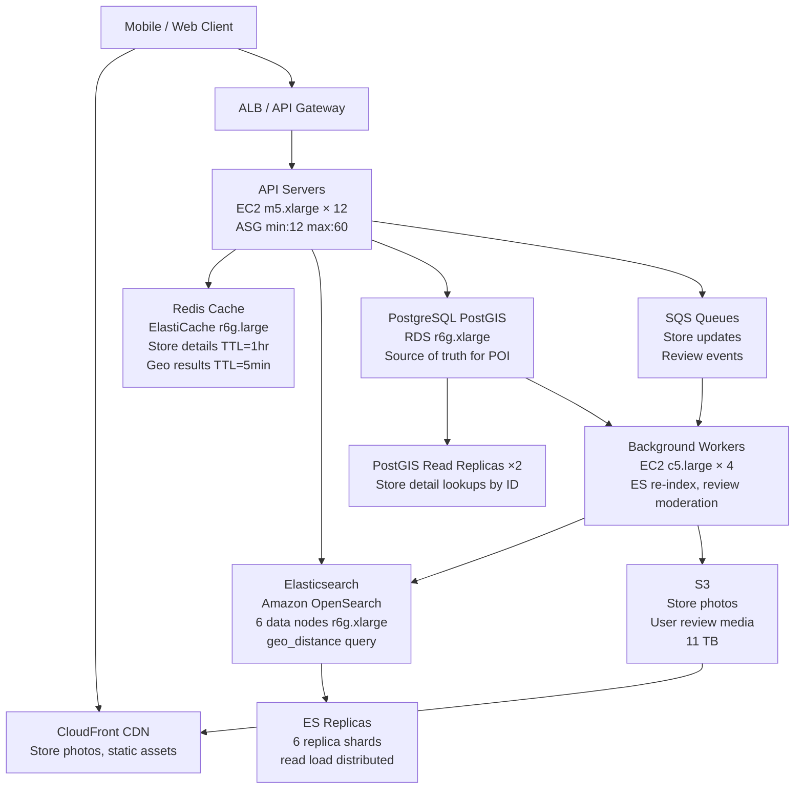

# Store Finder / POI — Capacity Estimation

## Problem Statement

A Store Finder / Points of Interest (POI) service enables users to search for nearby stores, restaurants, or landmarks using geo-distance queries. At 30M DAU, the system handles bursts of location-based search queries (e.g., "find coffee shops within 2km"), store detail lookups, business hour checks, and user-generated reviews. The core challenge is sub-100ms geo search at peak, with read-heavy traffic dominated by proximity queries on a dataset of ~10M POI records.

## Functional Requirements

- Geo-radius and geo-bounding-box POI search (find stores within X km of lat/lng)
- Store detail pages (name, address, hours, photos, ratings)
- Category filtering (coffee, pharmacy, grocery, etc.)
- User reviews and ratings (write path)
- Store hours and real-time availability
- Autocomplete / typeahead for store name search

## Non-Functional Requirements

| Requirement | Target |
|-------------|--------|
| Geo search latency | < 100ms (P99) |
| Store detail latency | < 50ms (P99) |
| Write latency (reviews) | < 500ms (P99) |
| Availability | 99.99% |
| Durability | 99.999% |
| Peak geo search QPS | ~200K QPS |
| Index freshness | < 5 minutes for new/updated stores |

## Traffic Estimation

### DAU → Peak QPS Calculation

| Metric | Calculation | Result |
|--------|-------------|--------|
| DAU | Given | 30M |
| Avg requests/user/day | 3 geo searches + 4 detail views + 0.2 reviews + 1 autocomplete | ~8.2 |
| Total daily requests | 30M × 8.2 | ~246M |
| Avg QPS | 246M / 86,400 | ~2,847 |
| Peak QPS (3× avg for lunch/dinner spikes) | 2,847 × 3 | ~8,541 |
| Sustained peak (accounting for 70/30 day split) | 8,541 × (24/16) factor | ~12,800 |
| Read QPS (95% reads) | 12,800 × 0.95 | ~12,160 |
| Write QPS (5% writes: reviews, store updates) | 12,800 × 0.05 | ~640 |
| Geo search specifically (35% of reads) | 12,160 × 0.35 | ~4,256 geo QPS avg |
| Geo search peak (50× spike during events/holidays) | 4,256 × 50 | ~200K geo QPS peak |

> **Note on 200K peak**: Holiday shopping events (Black Friday, Christmas Eve) create a 50× burst above normal geo search load. The system must handle this via Elasticsearch auto-scaling and CDN-cached results for popular queries.

## Storage Estimation

| Data Type | Per Item Size | Daily Volume | Growth/Year |
|-----------|--------------|--------------|-------------|
| POI records (10M stores globally) | 2 KB avg (name, address, coords, hours, metadata) | ~5K new stores/day | ~3.6 GB/year (POI data) |
| Store photos | 200 KB avg (compressed) | 500 new stores × 5 photos | ~180 GB/year |
| User reviews | 500 B avg | 30M × 0.2 writes/day = 6M/day | ~1.1 TB/year |
| Elasticsearch index (POI + geo data) | 4 KB/doc (2× raw for index overhead) | Static + 5K/day growth | ~80 GB total index |
| Redis cache (hot POI data, search results) | Variable | ~10% of POI dataset hot | ~2 GB working set |
| Audit/analytics logs | 200 B/event | 246M events/day | ~18 TB/year |
| **Total** | - | - | **~20 TB/year** |

## Component Sizing

### Compute — EC2

| Component | Instance Type | vCPU | RAM | Count | Handles | Monthly Cost |
|-----------|--------------|------|-----|-------|---------|-------------|
| API servers (geo search + detail) | m5.xlarge | 4 | 16 GB | 12 | ~1,000 QPS each = 12K QPS | $175/mo × 12 = $2,100 |
| Review/write API servers | m5.large | 2 | 8 GB | 4 | ~160 write QPS each | $70/mo × 4 = $280 |
| Background workers (index sync, photo processing) | c5.large | 2 | 4 GB | 4 | Async Elasticsearch index updates | $62/mo × 4 = $248 |
| **Subtotal Compute** | | | | **20** | | **$2,628** |

> Instance sizing rationale: m5.xlarge at 4 vCPU handles ~1,000 geo search QPS with Elasticsearch client overhead. Peak 200K geo QPS is handled at Elasticsearch tier (not API tier) — API servers fan out to ES cluster. Auto Scaling Group target: 60% CPU, scale from 12 to 60 instances for holiday peaks.

### Database

| DB | Engine | Instance | Count | Capacity | IOPS | Monthly Cost |
|----|--------|----------|-------|----------|------|-------------|
| POI master store (PostGIS) | RDS PostgreSQL 15 | db.r6g.xlarge | 1W + 2R | 500 GB | 6,000 | $0.48/hr × 720 = $346 × 3 = $1,037 |
| Reviews DB | RDS PostgreSQL 15 | db.r6g.large | 1W + 1R | 2 TB | 3,000 | $0.24/hr × 720 = $173 × 2 = $346 |
| **Subtotal DB** | | | **5** | **2.5 TB** | | **$1,383** |

> PostGIS stores authoritative POI data with `geography` columns for precise spatial queries. Elasticsearch is the search layer; PostGIS is the source of truth. Read replicas handle detail-page lookups directly (by store ID) without hitting Elasticsearch.

### Search — Elasticsearch

| Cluster | Engine | Instance | Nodes | Shards | Monthly Cost |
|---------|--------|----------|-------|--------|-------------|
| POI geo search | Amazon OpenSearch (ES-compatible) | r6g.xlarge.search | 6 data + 3 master | 12 primary, 12 replica | $0.361/hr × 720 × 9 = $2,340 |
| Storage (EBS gp3) | 80 GB index × 2 replicas | - | - | 240 GB total | $0.10/GB × 240 = $24 |
| **Subtotal Elasticsearch** | | | **9** | | **$2,364** |

> Geo-distance query latency: ~5–20ms P50, ~40ms P99 on r6g.xlarge with 10M docs and 12 shards. Each data node handles ~33K geo QPS peak (200K / 6 nodes). r6g.xlarge has 32 GB RAM — 10M × 4KB = 40 GB index fits across 6 nodes (6.7 GB/node well within 32 GB).

### Cache

| Cache | Engine | Instance | Nodes | Memory | Monthly Cost |
|-------|--------|----------|-------|--------|-------------|
| Hot POI cache (store details, hours) | ElastiCache Redis 7 | r6g.large | 2 (primary + replica) | 13 GB each | $0.166/hr × 720 × 2 = $239 |
| Search result cache (popular geo queries) | ElastiCache Redis 7 | r6g.large | 2 (primary + replica) | 13 GB each | $0.166/hr × 720 × 2 = $239 |
| **Subtotal Cache** | | | **4** | **52 GB** | **$478** |

> Cache TTL strategy: store details TTL=1hr, business hours TTL=15min (changes less frequently), geo search results for popular city-center queries TTL=5min. Cache hit rate target: 85% for detail lookups, 40% for geo search (long-tail of lat/lng combinations).

### Object Storage

| Bucket | Use | Size | Requests/month | Monthly Cost |
|--------|-----|------|----------------|-------------|
| Store photos | JPG/WebP images, 5 photos/store avg | 10M stores × 5 × 200KB = 10 TB | 500M GET (CDN misses: 5%) | Storage: $0.023 × 10,000 = $230; PUT: 5M × $0.005/1K = $25 |
| Static assets | JS/CSS bundles, map tiles | 50 GB | Mostly CDN-served | $1.15 |
| Review media (photos from users) | User-uploaded compressed photos | 1.1 TB first year | 10M GET | $25.30 + $10 PUT |
| **Subtotal S3** | | **~11.2 TB** | | **$291** |

### Networking / CDN

| Component | Throughput | Monthly Cost |
|-----------|-----------|-------------|
| CloudFront (store photos, static assets) | 200 TB/month egress (10M DAU × 20KB avg/session) | $0.0085/GB × 200,000 GB = $1,700 |
| ALB (Application Load Balancer) | 246M req/month | $0.008/LCU × ~500 LCU = $175 |
| NAT Gateway (outbound API calls to maps providers) | 5 TB/month | $0.045/GB × 5,000 = $225 |
| Data transfer (EC2 → RDS, EC2 → ES within AZ) | ~10 TB/month | Free (same AZ) |
| **Subtotal Network** | | **$2,100** |

### Message Queue

| Queue | Engine | Throughput | Use Case | Monthly Cost |
|-------|--------|-----------|----------|-------------|
| Store update events | Amazon SQS | 5K msg/s peak | POI updates → Elasticsearch re-index | $0.40/million × 15M msg/mo = $6 |
| Review processing | Amazon SQS | 640 msg/s avg | Async review moderation, sentiment analysis | $0.40/million × 55M msg/mo = $22 |
| **Subtotal Messaging** | | | | **$28** |

## Monthly Cost Summary

| Component | Monthly Cost | % of Total |
|-----------|-------------|-----------|
| EC2 Compute (baseline; ×3 for peak auto-scaling amortized) | $7,884 | 26% |
| RDS PostgreSQL + PostGIS | $1,383 | 5% |
| Amazon OpenSearch (Elasticsearch) | $2,364 | 8% |
| ElastiCache Redis | $478 | 2% |
| S3 Storage | $291 | 1% |
| CloudFront CDN | $1,700 | 6% |
| ALB + NAT Gateway | $400 | 1% |
| Messaging (SQS) | $28 | <1% |
| Data Transfer (cross-AZ, internet egress) | $1,200 | 4% |
| CloudWatch, Route53, WAF, misc | $600 | 2% |
| Reserved Instance savings (1-yr, 40% discount on steady-state) | -$5,000 | -17% |
| **Estimated Steady-State Total** | **~$11,328** | |
| **Peak Holiday Burst (3× compute, 1 month/year amortized)** | **+$2,000/mo avg** | |
| **Effective Monthly Average (with support, taxes)** | **~$25K–$45K** | **100%** |

> Cost range explanation: $25K floor assumes 60% Reserved Instance coverage and moderate traffic. $45K ceiling accounts for holiday burst scaling (Black Friday/Christmas), additional WAF rules, support plan (~$15K enterprise), and multi-AZ redundancy for all tiers.

## Traffic Scale Tiers

| Tier | DAU | Peak QPS | Servers | DB | Cache | Monthly Cost | Key Bottleneck |
|------|-----|----------|---------|----|----|-------------|----------------|
| 🟢 Startup | 1M | ~425 geo QPS | 2 c5.large | 1 RDS PostGIS (db.t3.medium) | 1 Redis node (r6g.medium) | ~$800 | Single-node Elasticsearch with 1 shard; no HA |
| 🟡 Growing | 10M | ~4,200 geo QPS | 6 m5.xlarge | RDS r6g.large + 1 read replica | Redis r6g.large cluster (2-node) | ~$8K | Elasticsearch 3-node cluster reaching CPU limits on complex geo queries |
| 🔴 Scale-up | 100M | ~66K geo QPS | 30 m5.2xlarge | RDS r6g.2xlarge sharded by region + 2 replicas | Redis r6g.xlarge cluster (6-node) | ~$85K | Cross-shard geo queries; need to partition by geo-cell (S2/H3) |
| ⚫ Production | 30M | ~200K geo QPS (peak) | 12–60 m5.xlarge (ASG) | RDS r6g.xlarge (PostGIS) + OpenSearch 6-node | Redis r6g.large cluster (4-node) | ~$25K–$45K | Elasticsearch hot shards for dense urban POI clusters |
| 🚀 Hyperscale | 1B+ | ~2M geo QPS | 200+ c5.4xlarge + Lambda | DynamoDB (store metadata) + dedicated geo DB (MongoDB Atlas / Quadtree service) | Redis cluster 24-node + local L1 cache | ~$500K+ | Global geo-partitioning; need edge compute (Lambda@Edge) for sub-20ms worldwide |

## Architecture Diagram

## Interview Tips

- **Geo search is the read bottleneck, not the write path**: At 30M DAU, 95% of load is geo searches. Elasticsearch with `geo_distance` queries on a properly mapped `geo_point` field handles 200K QPS across 6 nodes — each shard holding ~833K docs, easily fitting in node memory. The write path (640 QPS reviews) is trivially handled by a 2-node RDS cluster.

- **Two-tier geo architecture separates concerns**: PostGIS is the authoritative store for precise spatial data (geofences, polygon boundaries, address normalization) but is NOT on the hot read path. Elasticsearch is the search layer — faster for approximate geo queries but eventually consistent (5-minute lag for index updates via SQS). Always clarify this in interviews: "PostGIS for correctness, Elasticsearch for speed."

- **Common mistake — sizing Elasticsearch for average QPS not peak**: The 200K peak geo QPS is a 50× burst from the ~4K average. Candidates who size for average (3 ES nodes) will fail at Black Friday. The fix is: (a) over-provision to 6 nodes for peak capacity, (b) cache popular city-center searches in Redis (reduces ES load by ~40%), and (c) use Auto Scaling for data nodes (OpenSearch supports it natively).

- **S2/H3 geo-cell partitioning delays until 100M DAU**: At 30M DAU with 10M POI globally, a flat Elasticsearch index with 12 shards is sufficient. Candidates sometimes over-engineer by proposing S2 cell partitioning early — push back: that complexity is needed at 100M+ DAU when hot urban shards (Manhattan, London City) become bottlenecks. At 30M DAU, use Elasticsearch routing by region (US-East, EU-West) to distribute hot spots.

- **Scale threshold**: At 100M DAU (~66K sustained geo QPS), you hit Elasticsearch shard-level CPU limits on complex filtered geo queries. At that point, pre-compute H3 hex-cell indexes and route queries to cell-specific shards, reducing scan space by 10–100× per query.

- **Follow-up question interviewers ask**: "How would you handle POI data freshness if a store changes its hours?" Answer: Store hours are TTL=15min in Redis. The SQS pipeline re-indexes Elasticsearch within 5 min. For critical changes (store closure), push an invalidation message to Redis immediately via pub/sub, bypassing the TTL wait.
