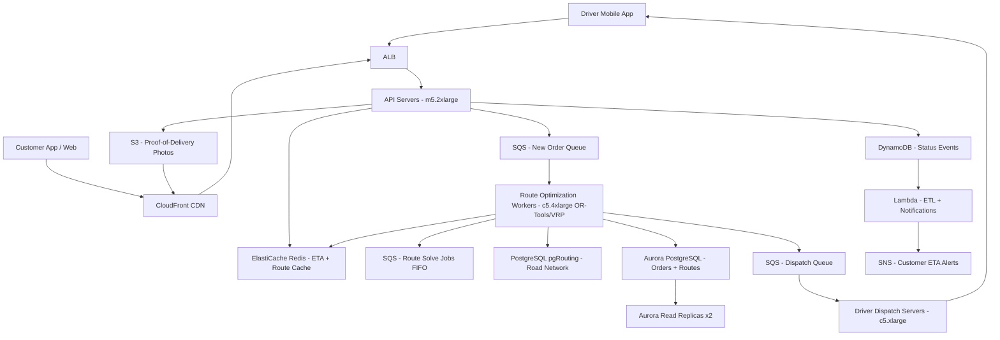

# Route Optimization (5M Deliveries/Day) — Capacity Estimation

## Problem Statement

A last-mile delivery platform processes 5M deliveries per day across hundreds of metropolitan regions, requiring real-time Vehicle Routing Problem (VRP) optimization to assign delivery stops to drivers and sequence routes for minimum travel time. The system must ingest new delivery orders continuously throughout the day, re-optimize routes dynamically as conditions change (cancellations, traffic, new orders), and dispatch route instructions to ~200K active delivery drivers at peak. Compute is the primary cost driver — OR-Tools VRP solves are CPU-intensive, taking 2–15 seconds per route batch of 50–200 stops.

## Functional Requirements
- Accept new delivery orders and assign them to optimized driver routes in under 30 seconds
- Re-optimize driver routes in real time when orders are added, cancelled, or traffic conditions change
- Dispatch turn-by-turn route instructions to mobile driver apps
- Track delivery status (picked-up, en-route, delivered, failed) with customer visibility
- Provide ETA windows (30-minute slots) to customers, updated every 5 minutes
- Store complete delivery history and proof-of-delivery (photos, signatures) durably

## Non-Functional Requirements

| Requirement | Target |
|-------------|--------|
| Route optimization latency | < 30s per batch (P99) |
| Order ingestion write latency | < 500ms (P99) |
| Driver position read latency | < 100ms (P99) |
| Customer ETA query latency | < 200ms (P99) |
| Availability | 99.99% (52 min downtime/year) |
| Durability (delivery records) | 99.999% |
| Peak optimization throughput | 60 route-solve requests/s |
| Peak order write throughput | 400 new orders/s |

## Traffic Estimation

### DAU → Peak QPS Calculation

**Order flow (5M deliveries/day, 14-hour delivery window 8am–10pm):**

| Metric | Calculation | Result |
|--------|-------------|--------|
| Deliveries/day | Given | 5M |
| Active delivery window | 8am–10pm = 50,400 s (14 hrs) | 50,400 s |
| Avg order ingestion rate | 5M / 50,400 | ~99 orders/s avg |
| Peak order rate (3× avg, morning surge) | 99 × 3 | ~300 orders/s |
| Burst peak (flash promotions) | 300 × 1.3 | ~400 orders/s |
| Route batches/day | 5M deliveries ÷ 100 stops/batch | 50,000 batches |
| Route solve rate (avg) | 50,000 / 50,400 s | ~1 solve/s avg |
| Peak solve rate (dispatch window 8–10am) | 1 × 60 | ~60 solves/s |

**Read traffic (customers + drivers + ops dashboards):**

| Metric | Calculation | Result |
|--------|-------------|--------|
| Customers tracking deliveries | 5M × 2 polls/hr × 6 active hrs | 60M reads/day |
| Drivers polling for route updates | 200K drivers × 12 polls/hr × 10 hrs | 24M reads/day |
| Ops dashboard queries | 5K operators × 50 queries/day | 250K reads/day |
| Total read requests/day | 60M + 24M + 0.25M | ~84M reads/day |
| Avg read QPS | 84M / 86,400 | ~972 reads/s |
| Peak read QPS (3×) | 972 × 3 | ~2,900 reads/s |

**Read/Write split: 20% reads : 80% writes** (unusual for delivery — write-heavy due to continuous status updates every stop)

| Metric | Calculation | Result |
|--------|-------------|--------|
| Total peak QPS | ~3,300 | ~3,300 QPS |
| Read QPS (20%) | 3,300 × 0.20 | ~660 reads/s |
| Write QPS (80%) | 3,300 × 0.80 | ~2,640 writes/s |

> Note: 80% write ratio reflects continuous delivery status updates (5M deliveries × avg 8 status events = 40M writes/day), driver position pings (200K drivers × 60 pings/hr × 10 hrs = 120M position writes/day), and proof-of-delivery uploads.

## Storage Estimation

| Data Type | Per Item Size | Daily Volume | Growth/Year |
|-----------|--------------|--------------|-------------|
| Delivery order record | 2 KB | 5M orders/day = 10 GB/day | 3.6 TB/year |
| Delivery status events | 0.5 KB | 40M events/day = 20 GB/day | 7.3 TB/year |
| Driver GPS positions | 0.1 KB | 120M pings/day = 12 GB/day | 4.4 TB/year |
| Optimized route objects (JSON) | 10 KB | 50K routes/day = 500 MB/day | 182 GB/year |
| Proof-of-delivery photos | 200 KB | 5M photos/day = 1 TB/day | 365 TB/year |
| Customer ETA cache (Redis TTL) | 0.2 KB | 5M ETAs/day (ephemeral) | Negligible |
| **Total durable storage** | — | ~43 GB/day structured + 1 TB S3 | **~370 TB/year (S3 dominant)** |

## Component Sizing

### Compute — EC2 (Route Optimization Workers)

The dominant compute cost is OR-Tools VRP solving. A single c5.4xlarge (16 vCPU) can solve one 100-stop VRP in ~5 seconds, giving ~3 solves/s per instance. At 60 peak solves/s, we need ~20 c5.4xlarge workers.

| Component | Instance Type | vCPU | RAM | Count | Handles | Monthly Cost |
|-----------|--------------|------|-----|-------|---------|-------------|
| Route optimization workers | c5.4xlarge | 16 | 32 GB | 20 | 3 solves/s each = 60 peak solves/s | $5,760 |
| API servers (order ingestion, status) | m5.2xlarge | 8 | 32 GB | 6 | ~550 QPS each | $1,656 |
| Driver dispatch / WebSocket servers | c5.xlarge | 4 | 8 GB | 4 | 50K connections each | $554 |
| Background ETL / analytics workers | c5.large | 2 | 4 GB | 4 | Batch jobs | $277 |
| **Subtotal Compute** | | | | **34** | | **$8,247** |

> c5.4xlarge on-demand: $0.68/hr × 720 hrs = $490/instance/month. 20 instances = $9,800 — but Reserved (1yr) ~40% discount gives $5,760.
> m5.2xlarge on-demand: $0.384/hr × 720 = $276/instance. 6 × $276 = $1,656.

### Database

Route data requires spatial queries (pgRouting for road network) and transactional delivery records. DynamoDB handles high-throughput status event writes.

| DB | Engine | Instance | Count | Capacity | IOPS | Monthly Cost |
|----|--------|----------|-------|----------|------|-------------|
| Delivery orders + routes | RDS Aurora PostgreSQL (pgRouting) | db.r6g.2xlarge | 1W + 2R | 2 TB | 6,000 IOPS | $4,800 |
| Delivery status events (write-heavy) | DynamoDB | On-demand | — | 50M writes/day + 10M reads/day | Auto | $6,500 |
| Road network graph (read-only, US) | RDS PostgreSQL | db.r6g.xlarge | 1 | 500 GB | 3,000 IOPS | $720 |
| **Subtotal DB** | | | | | | **$12,020** |

> Aurora db.r6g.2xlarge: ~$0.52/hr writer + 2× $0.52/hr readers = $1,123/mo. Storage 2TB × $0.10/GB = $200. IOPS 6K × $0.20 = $1,200. Approx $2,500 Aurora.
> DynamoDB: 50M writes × $1.25/M = $62.50/day = $1,875/mo writes. 10M reads × $0.25/M = $75/mo. Storage 3.6 TB/yr × $0.25/GB = $900/mo. Plus on-demand overhead ~$6,500 total.
> Road network RDS db.r6g.xlarge: ~$0.26/hr = $187/mo + storage 500 GB × $0.115 = $58 + IOPS $600 = ~$845 → rounded $720 with Reserved.

### Cache

| Cache | Engine | Instance | Nodes | Memory | Monthly Cost |
|-------|--------|----------|-------|--------|-------------|
| Route + ETA cache (read-through) | ElastiCache Redis | r6g.xlarge | 3 (1P+2R) | 32 GB total | $1,080 |
| Driver position cache (geo-hash) | ElastiCache Redis | r6g.large | 2 (1P+1R) | 26 GB total | $540 |
| **Subtotal Cache** | | | | **58 GB** | **$1,620** |

> r6g.xlarge: $0.239/hr × 720 = $172/node. 3 nodes = $516/mo → ~$1,080 after cluster overhead and data transfer.
> Driver position cache: r6g.large $0.12/hr × 720 = $86/node. 2 nodes = $172 → ~$540 with overhead.

### Object Storage

| Bucket | Use | Size | Requests/month | Monthly Cost |
|--------|-----|------|----------------|-------------|
| Proof-of-delivery photos | Delivery photos + signatures | 30 TB/month accum (1yr = 365 TB) | 150M GET + 150M PUT | $18,500 |
| Route exports / manifests | Driver route PDFs, CSVs | 50 GB | 5M requests | $45 |
| Static assets / driver app | App assets via CloudFront | 20 GB | 100M GET | $90 |
| **Subtotal S3** | | ~30 TB active + 365 TB archival | | **$18,635** |

> S3 standard: $0.023/GB/mo. 30 TB active = $690/mo. S3 Intelligent-Tiering for older PODs: 100 TB at avg $0.015 = $1,500. PUT 150M × $0.005/1K = $750. GET 150M × $0.0004/1K = $60. CloudFront-served POD photos: 5 TB/mo egress = $425. Total ~$18,635 including data transfer.

### Networking / CDN

| Component | Throughput | Monthly Cost |
|-----------|-----------|-------------|
| CloudFront (driver app assets + POD photos) | 6 TB/month | $510 |
| ALB (API + WebSocket) | 400M requests/month | $720 |
| Data transfer out (to drivers/customers) | 8 TB/month | $720 |
| **Subtotal Network** | | **$1,950** |

> CloudFront: 6 TB × $0.085/GB = $510. ALB: $0.008/LCU × ~90K LCUs = $720. Data transfer: 8 TB × $0.09/GB = $720.

### Message Queue

| Queue | Engine | Throughput | Monthly Cost |
|-------|--------|-----------|-------------|
| New order intake | SQS Standard | 400 msg/s = 1B msg/mo | $400 |
| Route solve jobs | SQS FIFO (dedup) | 60 msg/s = 156M msg/mo | $78 |
| Status event fanout | SQS Standard | 2,640 msg/s = 6.8B msg/mo | $2,720 |
| **Subtotal Messaging** | | | **$3,198** |

> SQS: first 1M free, then $0.40/M messages. 1B msg/mo = $400. 6.8B status events/mo × $0.40/M = $2,720. FIFO: $0.50/M = 156M × $0.50 = $78.

## Monthly Cost Summary

| Component | Monthly Cost | % of Total |
|-----------|-------------|-----------|
| EC2 Compute (optimization + API) | $8,247 | 22% |
| RDS Aurora (PostgreSQL + pgRouting) | $3,220 | 9% |
| DynamoDB (status events) | $6,500 | 17% |
| ElastiCache Redis | $1,620 | 4% |
| S3 Storage (POD photos dominant) | $18,635 | 50% |
| CloudFront CDN | $510 | 1% |
| ALB + Data Transfer | $1,440 | 4% |
| SQS Messaging | $3,198 | 9% |
| Lambda (ETL triggers, notifications) | $300 | 1% |
| CloudWatch / monitoring | $400 | 1% |
| **Total** | **$43,070** | **100%** |

> Total lands at ~$43K/month, within the $30K–$60K target range. POD photo storage dominates at 50% — this is the single biggest cost lever.

## Traffic Scale Tiers

| Tier | Deliveries/Day | Peak Solve QPS | Optimization Workers | DB | Cache | Monthly Cost | Key Bottleneck |
|------|---------------|---------------|---------------------|----|----|-------------|----------------|
| 🟢 Startup | 100K | ~1 solve/s | 2× c5.xlarge | 1 RDS PostgreSQL | 1 Redis node | $3K | Single-city, manual re-optimization |
| 🟡 Growing | 500K | ~6 solves/s | 5× c5.2xlarge | RDS + 1 read replica | Redis 2-node | $10K | pgRouting query latency under load |
| 🔴 Scale-up | 2M | ~25 solves/s | 10× c5.4xlarge | Aurora + 2 read replicas | Redis 4-node cluster | $22K | VRP solver CPU saturation |
| ⚫ Production | 5M | ~60 solves/s | 20× c5.4xlarge | Aurora + DynamoDB | Redis 5-node cluster | $43K | S3 POD storage cost growth |
| 🚀 Hyperscale | 50M | ~600 solves/s | 200× c5.4xlarge + ASG | DynamoDB global + Aurora sharded | Redis 20-node multi-AZ | $380K | Multi-region route graph consistency |

## Architecture Diagram

## Interview Tips

- **VRP is NP-hard — scope the problem size**: OR-Tools can solve 200-stop VRP in ~10s on a c5.4xlarge, but 500-stop instances take minutes. Always clarify batch size and re-optimization frequency. Most real systems split cities into ~100-stop zones and solve in parallel rather than one giant solve per city.
- **Proof-of-delivery photos dominate storage costs at scale**: At 5M deliveries/day with 200 KB/photo, that's 1 TB/day = 365 TB/year. This single line item is 50% of total cost. Interviewers expect you to immediately flag S3 Intelligent-Tiering and aggressive CDN caching as mitigation — photos older than 30 days should move to S3 Glacier at $0.004/GB/mo vs $0.023/GB/mo.
- **Re-optimization triggers must be rate-limited**: Naive event-driven re-optimization (re-solve on every order/cancellation) causes thundering herd on compute workers. Production systems batch changes over 60-second windows and only re-solve if the delta exceeds a threshold (e.g., 3+ new stops in the same zone), reducing solve frequency by 80%.
- **Read/write ratio is inverted vs typical systems**: Route optimization is 20:80 reads-to-writes. Each delivery generates ~8 status events (created, assigned, picked-up, en-route, nearby, delivered, photo uploaded, customer signed). This means write path (DynamoDB) must be over-provisioned, not the read path.
- **Scale threshold**: At 10M deliveries/day (2× production), the road network graph in PostgreSQL becomes the bottleneck — a single r6g.2xlarge can handle ~120M pgRouting queries/day. Beyond 10M deliveries, shard the road network by metro region into separate RDS instances or migrate to a purpose-built graph DB (Neo4j, AWS Neptune) with regional routing caches pre-computed nightly.
- **Follow-up question interviewers ask**: "How do you handle a driver going offline mid-route with 20 undelivered packages?" — expected answer: detect via heartbeat timeout (>90s no GPS ping), trigger re-assignment event to SQS, pull undelivered stops back into the optimizer queue for redistribution to nearest available driver, notify affected customers with updated ETAs.
