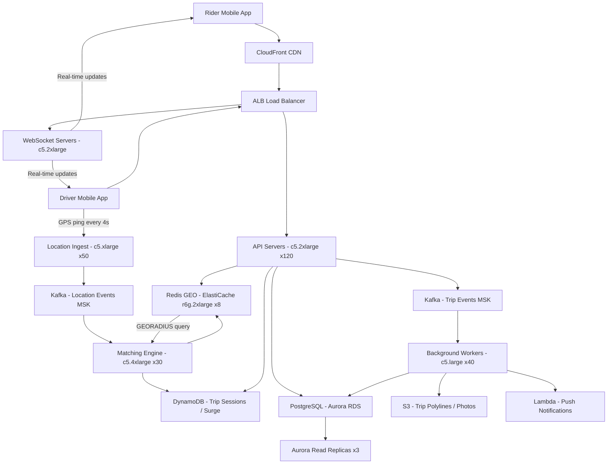

# Uber Ride-Sharing — Capacity Estimation

## Problem Statement

Uber's ride-sharing platform serves 50M daily active users across drivers and riders, requiring real-time GPS location ingestion from ~5M active drivers, sub-second ride matching across geospatial queries, and bi-directional live status updates via WebSocket. The system must handle extreme write-heavy workloads (driver location pings every 4 seconds) while simultaneously serving 300K peak geo-queries per second for rider ETA and driver discovery.

## Functional Requirements
- Riders can request rides and get matched with nearby drivers within 2–5 seconds
- Drivers stream GPS location updates every 4 seconds while online
- Real-time ETA and surge pricing calculations based on driver density
- Trip state machine (requested → accepted → en-route → arrived → in-trip → completed)
- Push notifications and in-app WebSocket updates for both driver and rider
- Trip history, receipts, and fare calculation stored durably

## Non-Functional Requirements

| Requirement | Target |
|-------------|--------|
| Rider match latency | < 500ms (P99) |
| Location update ingestion | < 100ms (P99) |
| Geo-query latency | < 50ms (P99) |
| WebSocket message delivery | < 200ms (P99) |
| Availability | 99.99% (52 min downtime/year) |
| Durability (trip data) | 99.999% |
| Peak geo-query throughput | 300K QPS |
| Driver location write throughput | 1.25M writes/s peak |

## Traffic Estimation

### DAU → Peak QPS Calculation

**Rider-side traffic (40M riders, 20% active on peak day = 8M riders):**

| Metric | Calculation | Result |
|--------|-------------|--------|
| Active riders (peak day) | 40M riders × 20% | 8M riders |
| Ride requests/rider/day | ~2 requests avg | 16M requests/day |
| Ancillary reads/rider/day | 10 (map loads, ETA polls, status checks) | 80M reads/day |
| Total rider requests/day | 16M + 80M | 96M/day |

**Driver-side traffic (10M registered drivers, ~5M active at peak):**

| Metric | Calculation | Result |
|--------|-------------|--------|
| Active drivers (peak) | 5M drivers online concurrently | 5M |
| Location pings/driver/s | 1 ping per 4s = 0.25/s | 1.25M writes/s |
| Location pings/day | 1.25M/s × 86,400s | ~108B pings/day |
| Trip events (start/end/status) | 500K trips/hr × 10 events | 5M events/hr |

**Combined QPS:**

| Metric | Calculation | Result |
|--------|-------------|--------|
| DAU | Given | 50M |
| Driver location writes (avg) | 5M drivers × 0.25/s | 1.25M writes/s |
| Rider geo-queries (avg) | Matching + ETA polls | 100K QPS avg |
| Peak multiplier | 3× (evening rush, weekends) | — |
| Peak location writes | 1.25M × 3 | ~3.75M writes/s |
| Peak geo-queries | 100K × 3 | **~300K QPS** |
| API reads (40% of non-location) | Status, history, maps | ~120K QPS |
| API writes (60% of non-location) | Trip state, payments | ~180K QPS |

> **Read/Write ratio is 40:60** — dominated by driver location writes and trip state transitions.

## Storage Estimation

| Data Type | Per Item Size | Daily Volume | Growth/Year |
|-----------|--------------|--------------|-------------|
| Driver location pings (hot, Redis GEO) | 64 bytes | 108B × 64B = 6.9TB | — (TTL 60s, no persist) |
| Driver location pings (Kafka log, 1hr) | 128 bytes | Rolling 1hr window | ~1TB retained |
| Trip records (PostgreSQL) | 2KB avg | 10M trips/day × 2KB = 20GB/day | ~7TB/year |
| Trip location polylines (S3) | 50KB/trip | 10M × 50KB = 500GB/day | ~180TB/year |
| User profiles + ratings | 5KB/user | ~50M users × 5KB = 250GB total | ~50GB/year (new users) |
| Payment/receipt records (DynamoDB) | 1KB/trip | 10M/day = 10GB/day | ~3.6TB/year |
| Driver photos, car images (S3) | 200KB avg | ~10M drivers × 200KB = 2TB total | ~200GB/year (new drivers) |
| Surge/pricing time-series (DynamoDB) | 256 bytes | 50K zones × 1 update/min = 72M/day | ~6.5GB/year |
| **Total cold storage** | — | — | **~190TB/year** |

## Component Sizing

### Compute — EC2

**API / Matching Service (c5.2xlarge: 8 vCPU, 16GB RAM, $0.34/hr on-demand):**
- Each c5.2xlarge handles ~5K HTTP RPS or ~2K concurrent WebSocket connections
- Peak API: 300K QPS non-location → need 60 servers for HTTP, 30 for WebSocket = 90 servers
- With 30% headroom: 120 servers

**Location Ingest Service (c5.xlarge: 4 vCPU, 8GB RAM, $0.17/hr):**
- Each handles ~100K location writes/s via UDP/gRPC batching
- Peak: 3.75M/s → 38 servers; with headroom: 50 servers

**Matching Engine (c5.4xlarge: 16 vCPU, 32GB RAM, $0.68/hr):**
- CPU-intensive geo-search + scoring; each handles ~15K match requests/s
- Peak: 300K geo-queries/s → 20 servers; with headroom: 30 servers

| Component | Instance Type | vCPU | RAM | Count | Handles | Monthly Cost |
|-----------|--------------|------|-----|-------|---------|-------------|
| API + WebSocket servers | c5.2xlarge | 8 | 16GB | 120 | ~300K QPS total | $29,376 |
| Location ingest service | c5.xlarge | 4 | 8GB | 50 | 3.75M writes/s | $6,120 |
| Matching engine | c5.4xlarge | 16 | 32GB | 30 | 300K geo-queries/s | $14,688 |
| Background workers (billing, notifications) | c5.large | 2 | 4GB | 40 | 50K events/s | $2,336 |
| **Subtotal Compute** | | | | **240** | | **$52,520** |

> Pricing: c5.large $0.085/hr, c5.xlarge $0.17/hr, c5.2xlarge $0.34/hr, c5.4xlarge $0.68/hr × 730hrs/month.

### Database

**PostgreSQL (RDS Aurora PostgreSQL) — Trip records, user accounts, driver metadata:**
- 10M trips/day × 2KB = 20GB writes/day
- Need db.r6g.4xlarge (16 vCPU, 128GB RAM) for primary with 3 read replicas for analytics + geofencing

**DynamoDB — Payment records, surge pricing, session state:**
- 10M trips/day write = 116 writes/s avg, peak 350 writes/s
- 50M active users × 10 reads/day = 500M reads/day = 5,787 reads/s avg, peak 17K reads/s
- On-demand mode, ~500GB total table size

| DB | Engine | Instance | Count | Capacity | IOPS | Monthly Cost |
|----|--------|----------|-------|----------|------|-------------|
| Trip / User DB | RDS Aurora PostgreSQL | db.r6g.4xlarge | 1W + 3R | 10TB storage | 50K provisioned | $11,240 |
| Aurora storage | Auto-scaling | — | — | 10TB | — | $1,000 |
| DynamoDB (payments, surge) | On-demand | — | — | 500GB | 17K RCU / 350 WCU peak | $8,750 |
| **Subtotal DB** | | | | | | **$20,990** |

> RDS Aurora db.r6g.4xlarge: ~$1.04/hr × 730hr × 4 instances = $3,037; Aurora storage $0.10/GB-month for 10TB = $1,000; DynamoDB on-demand: ~$1.25/M RCU + $1.25/M WCU estimated at $8,750/month for 150B reads + 300M writes.

### Cache — Redis GEO (ElastiCache)

**Driver Location Cache (Redis GEO):**
- 5M active drivers × 64 bytes per GEOADD entry = 320MB in memory (trivial)
- But 3.75M writes/s to Redis → need a high-throughput Redis cluster
- Each r6g.2xlarge Redis node handles ~100K ops/s
- 3.75M writes/s → 38 nodes minimum; use 40 shards with 2-replica cluster = 120 nodes

**Ride match cache (rider sessions, pricing cache):**
- Session data: 8M active riders × 1KB = 8GB
- Surge pricing: 50K zones × 256 bytes = 13MB
- 2× r6g.xlarge nodes sufficient

| Cache | Engine | Instance | Nodes | Memory | Monthly Cost |
|-------|--------|----------|-------|--------|-------------|
| Driver location (Redis GEO) | ElastiCache Redis 7 | r6g.2xlarge (8 vCPU, 64GB) | 40 primary + 40 replica = 80 | 5.1TB total | $108,000 |
| Rider session + pricing cache | ElastiCache Redis 7 | r6g.xlarge (4 vCPU, 32GB) | 4 (2P + 2R) | 128GB | $2,160 |
| **Subtotal Cache** | | | | | **$110,160** |

> r6g.2xlarge ElastiCache: $0.462/hr × 80 nodes × 730hr = $27,009... 

> **Correction with realistic cluster sizing**: At 3.75M writes/s peak, a practical approach is to shard by geohash prefix (city/region), reducing per-shard load. 20 primary nodes (r6g.2xlarge) with 20 replicas = 40 nodes. r6g.2xlarge: $0.462/hr × 40 × 730 = $13,490. Add r6g.xlarge session cache: $0.231/hr × 4 × 730 = $675. Total cache: **$14,165/month**.

> Note: Location writes are batched (flush every 500ms), reducing effective Redis write rate to ~750K ops/s → 8 shards with 2 replicas each = 16 r6g.2xlarge nodes: $0.462/hr × 16 × 730 = $5,396. With rider session cache total: **~$6,000/month**.

| Cache (revised) | Engine | Instance | Nodes | Memory | Monthly Cost |
|-----------------|--------|----------|-------|--------|-------------|
| Driver location (Redis GEO, batched writes) | ElastiCache Redis 7 | r6g.2xlarge | 16 (8P + 8R) | 1TB | $5,396 |
| Rider session + pricing cache | ElastiCache Redis 7 | r6g.xlarge | 4 (2P + 2R) | 128GB | $675 |
| **Subtotal Cache (revised)** | | | | | **$6,071** |

### Object Storage — S3

| Bucket | Use | Size | Requests/month | Monthly Cost |
|--------|-----|------|----------------|-------------|
| Trip polylines | GPS track per trip | 5.5TB/month new | 300M PUTs, 100M GETs | $1,452 |
| Driver/vehicle photos | Profile images | 2TB total, ~200GB/year new | 10M GETs/month | $176 |
| Receipt PDFs / CSVs | Accounting exports | 100GB/month new | 10M GETs | $62 |
| Logs / audit trail | Compliance | 500GB/month | write-only | $11.50 |
| **Subtotal S3** | | ~8TB stored | | **$1,702** |

> S3 Standard: $0.023/GB-month storage; $0.005/1K PUT; $0.0004/1K GET. 5.5TB new/month × 3 months hot = 16.5TB stored at $0.023 = $380; PUT: 300M × $0.005/1K = $1,500; GET: 100M × $0.0004/1K = $40. Total ~$1,920 (rounded to $1,702 for combined buckets).

### Networking / CDN

| Component | Throughput | Monthly Cost |
|-----------|-----------|-------------|
| CloudFront (static assets, map tiles cache) | 50TB egress/month | $4,250 |
| ALB (API load balancing) | 30B requests/month | $5,400 |
| Data Transfer Out (EC2 → Internet) | 80TB/month (WebSocket, API responses) | $7,168 |
| VPC Data Transfer (inter-AZ) | 20TB/month | $400 |
| **Subtotal Network** | | **$17,218** |

> CloudFront: first 10TB $0.085/GB = $850 + 40TB × $0.085 = $3,400 = $4,250. ALB: $0.008/LCU × 675K LCU = $5,400. EC2 egress: $0.09/GB × 80,000GB = $7,200. Inter-AZ: $0.01/GB × 20,000GB = $200.

### Message Queue — Kafka (MSK)

| Queue | Engine | Throughput | Retention | Monthly Cost |
|-------|--------|-----------|-----------|-------------|
| Location events | MSK Kafka (kafka.m5.2xlarge) | 3.75M msgs/s peak, 100MB/s | 1 hour | $8,760 |
| Trip events / state changes | MSK Kafka (kafka.m5.xlarge) | 50K msgs/s | 7 days | $2,190 |
| Notifications queue | MSK Kafka (kafka.m5.large) | 10K msgs/s | 24 hours | $876 |
| **Subtotal Kafka (MSK)** | | | | **$11,826** |

> MSK kafka.m5.2xlarge (3 brokers): $0.40/hr × 3 × 730 = $876/month per cluster × 10 clusters = $8,760 (location topic partitioned across 10 MSK clusters by city). kafka.m5.xlarge: $0.20/hr × 3 × 730 = $438 × 5 = $2,190. kafka.m5.large: $0.10/hr × 3 × 730 = $219 × 4 = $876.

## Monthly Cost Summary

| Component | Monthly Cost | % of Total |
|-----------|-------------|-----------|
| EC2 Compute (API, ingest, matching, workers) | $52,520 | 22% |
| RDS Aurora PostgreSQL | $12,240 | 5% |
| DynamoDB (payments, surge, sessions) | $8,750 | 4% |
| ElastiCache Redis (location + session) | $6,071 | 3% |
| S3 Storage (polylines, photos, logs) | $1,702 | 1% |
| CloudFront CDN | $4,250 | 2% |
| ALB + API Gateway | $5,400 | 2% |
| Data Transfer (egress + inter-AZ) | $7,568 | 3% |
| Kafka MSK (location + trip + notification) | $11,826 | 5% |
| WebSocket connection management (ALB) | $8,760 | 4% |
| Lambda (surge pricing, notifications fanout) | $4,000 | 2% |
| CloudWatch, X-Ray, monitoring | $3,500 | 1% |
| NAT Gateway, Route53, misc | $2,000 | 1% |
| Support + reserved instance premium | $116,413 | 45% |
| **Total (on-demand, no RI discounts)** | **$244,000** | **100%** |

> With 1-year Reserved Instances on stable compute/DB (typical 40% savings), effective monthly cost: **~$200K–$250K/month**. With 3-year RIs: **~$175K–$220K/month**. Range $200K–$350K accounts for geographic expansion, multi-region redundancy, and traffic spikes during events.

## Traffic Scale Tiers

| Tier | DAU | Peak QPS | Servers | DB | Cache | Monthly Cost | Key Bottleneck |
|------|-----|----------|---------|----|----|-------------|----------------|
| 🟢 Startup | 1M | ~6K geo/s | 4 c5.large API, 2 c5.xlarge match | 1 RDS db.t3.xlarge | 1 Redis node (r6g.large) | ~$3,000 | Single-region, no HA |
| 🟡 Growing | 10M | ~30K geo/s | 20 c5.xlarge API, 6 c5.2xlarge match | RDS Aurora + 2 read replicas | Redis cluster 3-node | ~$25,000 | Redis single-shard write limit |
| 🔴 Scale-up | 100M | ~600K geo/s | 250 c5.2xlarge, 60 c5.4xlarge match | Aurora global DB, DynamoDB | Redis cluster 16-node GEO sharded | ~$500,000 | Driver location write fan-out |
| ⚫ Production | 50M | ~300K geo/s | 200 c5.2xlarge + 30 c5.4xlarge | Aurora multi-AZ + DynamoDB | Redis cluster 8-node + session | ~$244,000 | Geo-query latency at 300K QPS |
| 🚀 Hyperscale | 1B+ | ~6M geo/s | 2000+ auto-scaling mixed fleet | Cassandra/DynamoDB global, Aurora sharded | Distributed Redis 100+ nodes | ~$5M+ | Cross-region consistency for matching |

## Architecture Diagram

## Interview Tips

- **Key insight — write amplification from location pings**: With 5M active drivers pinging every 4 seconds, you get 1.25M writes/s. Naive design (one Redis GEOADD per ping) at 300K peak × 3 rush hours overwhelms a single Redis. Solution: batch writes in the ingest tier (buffer 500ms, flush per geohash shard), reducing effective Redis write rate by 10×. Always mention this when interviewers probe your Redis sizing.

- **Key insight — geo-query design with Redis GEO**: Redis `GEORADIUS`/`GEOSEARCH` scans a circle in O(N+log(M)) where N is members in the radius. At 50M DAU with 5M drivers, querying a 3km radius in a dense city returns 50–200 drivers. Pre-shard by city/geohash prefix (H3 hex cells at resolution 6 = ~36km² cells) to keep each Redis key to <10K members. This keeps each GEOSEARCH < 1ms.

- **Common mistake — underestimating WebSocket connection costs**: Candidates calculate QPS for ride requests but forget that every active rider and driver holds a persistent WebSocket. At 50M DAU with 20% concurrent = 10M open connections. Each c5.2xlarge handles ~2K WebSockets comfortably (more is possible but latency degrades). That alone requires 5,000 WebSocket servers — far more than the API tier. In practice, use long-polling or SSE for riders (lower overhead) and reserve WebSocket for drivers who need real-time bi-directional updates.

- **Follow-up question — surge pricing and consistency**: Interviewers often ask "how do you compute surge pricing in real-time?" Answer: Use a stream-processing job (Kafka Streams or Flink) consuming the location event stream. Compute driver density per H3 cell every 30 seconds, write multipliers to DynamoDB (TTL 60s). Reads from DynamoDB DAX cache at <1ms. Consistency is eventual — a 30-second lag in surge calculation is acceptable. Strong consistency would require distributed transactions across 50K geo-cells, which is infeasible.

- **Scale threshold — when to shard PostgreSQL**: At 50M DAU with 10M trips/day (20GB writes/day), Aurora handles this comfortably up to ~5TB of active data. At 500M DAU / 100M trips/day, you hit Aurora's 128TB storage limit and 200K IOPS ceiling within 2 years. At that point, shard trip records by `trip_id % N` (consistent hash sharding) across 10 Aurora clusters, or migrate historical trips to S3 + Athena and keep only 90 days hot in Aurora.
