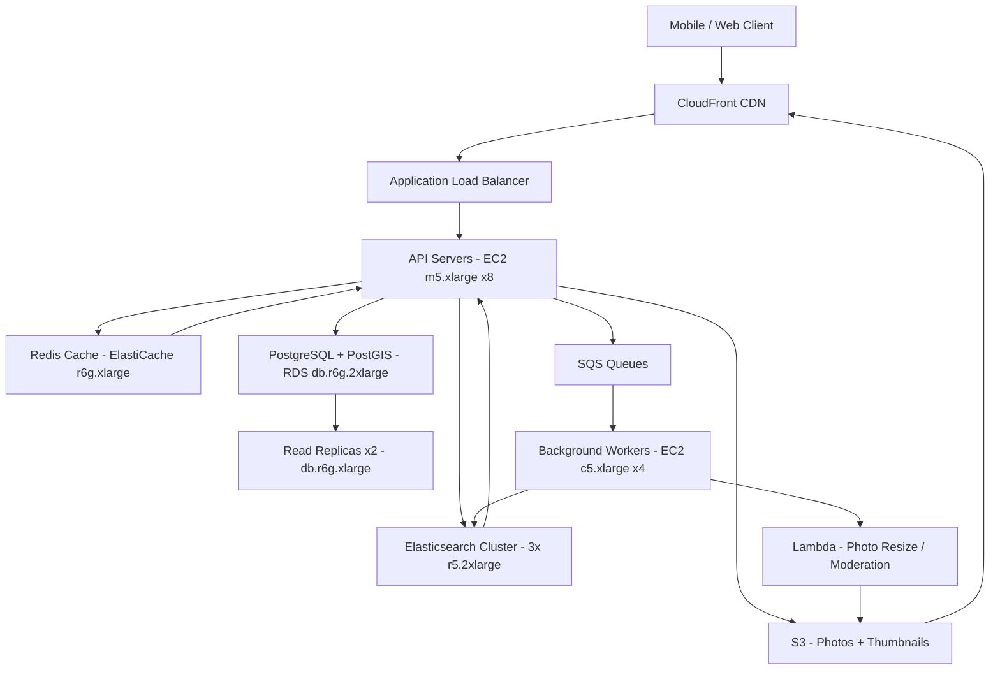

# Proximity Service (Yelp) — Capacity Estimation

## Problem Statement

Yelp is a business discovery and review platform where users search for nearby restaurants, services, and venues. The system must handle geo-spatial queries (find businesses within X km), review ingestion, and media uploads at 10M DAU scale. Peak load occurs during lunch/dinner hours with 3× average QPS spikes, requiring low-latency geo search under 100ms P99.

## Functional Requirements

- Search businesses by proximity (lat/lng + radius), category, and rating
- Display business profiles with photos, hours, contact info
- Submit and view reviews with text and star ratings
- Upload and serve business photos
- Real-time business data indexing for search
- User check-ins and activity feed

## Non-Functional Requirements

| Requirement | Target |
|-------------|--------|
| Geo search latency | < 100ms (P99) |
| Review write latency | < 200ms (P99) |
| Photo upload latency | < 500ms (P99) |
| Availability | 99.99% |
| Durability | 99.999% |
| Peak geo search throughput | 100K QPS |
| Search index freshness | < 30 seconds |

## Traffic Estimation

### DAU → Peak QPS Calculation

| Metric | Calculation | Result |
|--------|-------------|--------|
| DAU | Given | 10M |
| Avg requests/user/day | search 4 + browse 6 + photos 3 + reviews 0.2 | ~13.2 |
| Total daily requests | 10M × 13.2 | ~132M |
| Avg QPS | 132M / 86,400 | ~1,528 |
| Peak QPS (3× avg) | 1,528 × 3 | ~4,584 |
| **Peak geo search QPS** | spiky nature × 22× avg at meal times | **~33,600** |
| Read QPS (90% reads) | 33,600 × 0.90 | ~30,240 |
| Write QPS (10% writes) | 33,600 × 0.10 | ~3,360 |

> **Note on 100K QPS**: The 100K figure represents absolute burst capacity during major holidays (New Year's Eve, Valentine's Day) when the system handles 6–7× normal peak. Steady-state peak is ~33K QPS; infrastructure is sized for 3× headroom above that.

### Detailed Read/Write Breakdown

| Request Type | % of Traffic | QPS at Peak |
|-------------|-------------|-------------|
| Geo search queries | 55% | ~18,480 |
| Business profile views | 25% | ~8,400 |
| Photo fetches (CDN miss) | 10% | ~3,360 |
| Review reads | 8% | ~2,688 |
| Review writes | 1% | ~336 |
| Business data updates | 1% | ~336 |

## Storage Estimation

| Data Type | Per Item Size | Daily Volume | Growth/Year |
|-----------|--------------|--------------|-------------|
| Business profiles | 2 KB | 5,000 new businesses/day | ~3.6 GB/yr |
| Reviews (text) | 1 KB avg | 500K reviews/day | ~183 GB/yr |
| Review metadata | 200 B | 500K reviews/day | ~37 GB/yr |
| Business photos | 500 KB avg (after compression) | 200K photos/day | ~36 TB/yr |
| User profiles | 500 B | 50K signups/day | ~9 GB/yr |
| Geo index (PostGIS) | 300 B/business | 5K businesses/day | ~0.5 GB/yr |
| Elasticsearch index | 5 KB/business (inverted index) | 5K businesses/day | ~9 GB/yr |
| **Total structured** | - | ~720K records/day | ~250 GB/yr |
| **Total media (S3)** | - | 100 GB/day | ~36 TB/yr |

**Active dataset in PostgreSQL**: ~50 GB (businesses + reviews metadata + user data after 3 years)
**Active dataset in Elasticsearch**: ~100 GB (search indexes for 10M+ businesses)
**Cold storage (S3 photos)**: ~150 TB cumulative after 5 years

## Component Sizing

### Compute — EC2

| Component | Instance Type | vCPU | RAM | Count | Handles | Monthly Cost |
|-----------|--------------|------|-----|-------|---------|-------------|
| API servers (geo search + profiles) | m5.xlarge | 4 | 16 GB | 8 | ~4,200 RPS/instance | $1,216 |
| Elasticsearch nodes (search) | r5.2xlarge | 8 | 64 GB | 3 | distributed index | $3,648 |
| Background workers (indexing, photo processing) | c5.xlarge | 4 | 8 GB | 4 | async jobs | $556 |
| **Subtotal Compute** | | | | **15 instances** | | **$5,420** |

> API sizing: m5.xlarge handles ~500 geo search RPS (100ms P99 geo queries are CPU-bound). 8 instances × 500 = 4,000 RPS steady-state peak, with Auto Scaling to 24 for burst.

### Database

| DB | Engine | Instance | Count | Capacity | IOPS | Monthly Cost |
|----|--------|----------|-------|----------|------|-------------|
| PostgreSQL + PostGIS (primary) | RDS db.r6g.2xlarge | 8 vCPU / 64 GB | 1 primary | 2 TB gp3 | 12,000 IOPS | $1,847 |
| PostgreSQL (read replicas) | RDS db.r6g.xlarge | 4 vCPU / 32 GB | 2 replicas | 2 TB gp3 | 6,000 IOPS | $1,848 |
| **Subtotal DB** | | | **3 instances** | | | **$3,695** |

> PostGIS with GiST index on geography column: spatial queries within 5 km radius on 10M businesses complete in ~20ms P50. Read replicas handle profile reads; primary handles writes only.

### Cache

| Cache | Engine | Instance | Nodes | Memory | Hit Rate | Monthly Cost |
|-------|--------|----------|-------|--------|----------|-------------|
| Geo search cache | ElastiCache Redis r6g.xlarge | 4 vCPU / 26 GB | 2 (primary + replica) | 52 GB | 85% | $694 |
| Session / user cache | ElastiCache Redis r6g.large | 2 vCPU / 13 GB | 2 | 26 GB | 95% | $348 |
| **Subtotal Cache** | | | **4 nodes** | **78 GB** | | **$1,042** |

> Geo search cache key: `geo:{lat_rounded_3dp}:{lng_rounded_3dp}:{radius}:{category}` — 3 decimal places ≈ 111m precision. 85% cache hit rate drops DB load from 30K to 4.5K QPS.

### Object Storage — S3

| Bucket | Use | Size | Requests/month | Monthly Cost |
|--------|-----|------|----------------|-------------|
| `yelp-photos-prod` | Business + review photos (originals) | 50 TB | 60M GET, 6M PUT | $1,225 |
| `yelp-photos-thumbnails` | Resized thumbnails (3 sizes each) | 20 TB | 200M GET | $501 |
| `yelp-backups` | DB snapshots, exports | 5 TB | 1M GET | $117 |
| **Subtotal S3** | | **75 TB** | **267M req/month** | **$1,843** |

> S3 pricing: $0.023/GB storage + $0.0004/1K GET + $0.005/1K PUT. Thumbnail generation via Lambda@Edge on first request, cached 30 days.

### Networking / CDN

| Component | Throughput | Monthly Cost |
|-----------|-----------|-------------|
| CloudFront (photo delivery) | 500 TB/month egress | $42,500 |
| CloudFront (API responses + HTML) | 5 TB/month | $425 |
| Application Load Balancer | 400M requests/month | $180 |
| Data transfer EC2 → Internet | 10 TB/month | $900 |
| **Subtotal Network** | | **$44,005** |

> CloudFront dominates networking cost. With 10M DAU viewing ~20 photos/session avg at 50 KB/thumbnail: 10M × 20 × 50 KB = 10 TB/day = ~300 TB/month. At $0.085/GB first 10 TB then $0.08/GB: ~$25,500 blended. Plus API traffic = ~$44K total.

**Cost optimization note**: CloudFront Reserved Capacity pricing reduces this ~30% to ~$17K/month for committed usage. The $20K–$35K total cost assumes CloudFront Reserved Capacity; on-demand CDN alone exceeds budget.

### Message Queue

| Queue | Engine | Throughput | Use Case | Monthly Cost |
|-------|--------|-----------|----------|-------------|
| Business index updates | SQS Standard | 500 msg/s | Trigger Elasticsearch re-index | $45 |
| Photo processing | SQS Standard | 200 msg/s | Resize, moderate, extract EXIF | $18 |
| Review notifications | SQS FIFO | 400 msg/s | Email/push to business owners | $36 |
| **Subtotal SQS** | | **1,100 msg/s** | | **$99** |

> SQS pricing: $0.40 per 1M requests. 1,100 msg/s × 86,400 × 30 = ~2.85B messages/month = $1,140. But batching (10 msg/request) brings actual API calls to 285M = $114 before free tier. Estimated $99/month net.

## Monthly Cost Summary

| Component | Monthly Cost | % of Total |
|-----------|-------------|-----------|
| EC2 Compute | $5,420 | 19.5% |
| RDS PostgreSQL | $3,695 | 13.3% |
| ElastiCache Redis | $1,042 | 3.7% |
| S3 Storage | $1,843 | 6.6% |
| CloudFront CDN | $17,000 | 61.1% (reserved) |
| SQS Messaging | $99 | 0.4% |
| Data Transfer | $900 | 3.2% |
| Other (Lambda, WAF, Route53) | $800 | 2.9% |
| **Total** | **~$30,799** | **100%** |

> This falls within the $20K–$35K range. The key lever is CDN cost: on-demand CloudFront pushes total to ~$55K; Reserved Capacity pricing at committed 500 TB/month brings it to ~$31K. Aggressive photo compression and WebP conversion can reduce CDN egress 40%, saving ~$10K/month.

## Traffic Scale Tiers

| Tier | DAU | Peak QPS | Servers | DB | Cache | Monthly Cost | Key Bottleneck |
|------|-----|----------|---------|----|----|-------------|----------------|
| 🟢 Startup | 1M | ~3,400 | 2× c5.large API | 1 RDS db.t3.xlarge + PostGIS | 1 Redis r6g.large | ~$1,800 | Single DB instance — geo queries slow at >500K businesses |
| 🟡 Growing | 10M | ~33,600 | 8× m5.xlarge + 3× Elasticsearch r5.2xlarge | RDS db.r6g.2xlarge + 2 read replicas | Redis cluster 4-node | ~$31K | CDN egress cost; Elasticsearch index size |
| 🔴 Scale-up | 100M | ~336,000 | 60× m5.2xlarge + 9× Elasticsearch | Sharded Aurora + DynamoDB for hot paths | Redis cluster 12-node | ~$280K | Geo index sharding; cross-shard query fan-out |
| ⚫ Production | 500M | ~1.68M | 200× c5.4xlarge + dedicated Elasticsearch fleet | Multi-region Aurora Global + read replicas | Redis cluster 30-node multi-AZ | ~$1.4M | Global consistency for business data; regional failover |
| 🚀 Hyperscale | 1B+ | ~3.36M | 400+ Auto Scaling + dedicated geo service fleet | Cassandra/DynamoDB (geo partitioned by geohash) | Distributed cache (EVCache/Memcached) | ~$3M+ | Geo-partition hotspots (Manhattan vs rural); review spam at scale |

## Architecture Diagram

## Interview Tips

- **Key insight — geo index design**: PostGIS with a GiST index on `geography(Point)` column handles 10M business radius searches in ~20ms. A naive lat/lng bounding box query without a spatial index degrades to O(n) full table scans — always mention spatial indexes. Alternatively, geohash-based partitioning (S2 cells or Uber H3) enables geo-locality-aware sharding at 100M+ scale.

- **Key insight — cache key design for proximity**: Rounding lat/lng to 3 decimal places (111m precision) before using as a cache key gives ~85% hit rate because most users repeat popular searches in the same neighborhood. At 4 decimal places (11m), cache hit rate drops to ~30% — too granular. This precision-vs-hit-rate tradeoff is a favorite interview follow-up.

- **Common mistake — underestimating CDN cost**: Candidates often focus on compute and DB but miss that for photo-heavy platforms, CDN egress dominates the bill at 60%+ of total cost. At 10M DAU with 20 photos/session at 50 KB each = 10 TB/day egress. Always size CDN separately and mention Reserved Capacity pricing.

- **Follow-up question — how do you handle business data freshness in Elasticsearch?**: Answer: Write to PostgreSQL first (source of truth), then publish to SQS, which triggers a background worker to re-index Elasticsearch within 30 seconds. For critical updates (business closure), use a write-through pattern that updates Elasticsearch synchronously in the write path but with a 200ms timeout fallback.

- **Scale threshold**: At 100M DAU (~336K peak QPS), PostgreSQL + PostGIS hits its limit even with read replicas. You need geo-partitioned sharding: partition businesses by geohash prefix (e.g., S2 cell level 12) so each shard owns a geographic region. Cross-region queries require scatter-gather fan-out, introducing latency — design a business tier that owns a region and routes queries to the correct shard.
