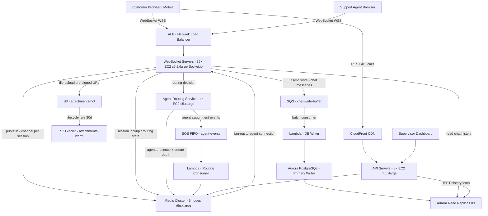

# Customer Support Chat (10M Concurrent) — Capacity Estimation

## Problem Statement

Design the infrastructure for a real-time customer support chat platform maintaining 10M simultaneous WebSocket connections at peak (e.g., a major e-commerce platform during a sale event). Each connection maps to a customer session routed to a human or bot agent, requiring sub-200ms message delivery, persistent chat history, and intelligent agent load-balancing. The challenge is not just handling message volume but managing long-lived stateful TCP connections at massive scale while keeping infrastructure costs defensible.

## Functional Requirements
- Persistent WebSocket connections for customers and support agents
- Real-time message delivery with typing indicators and read receipts
- Agent routing: assign customers to least-busy available agent (human or bot)
- Chat history persisted for compliance and context (90-day retention)
- File/image attachment support in chat
- Supervisor dashboard showing live queue depth and agent utilization

## Non-Functional Requirements
| Requirement | Target |
|-------------|--------|
| Message delivery latency | < 150ms P99 end-to-end |
| Connection establishment | < 500ms P99 |
| Availability | 99.99% (< 52min downtime/year) |
| Durability | 99.999% message persistence |
| Throughput | 500K messages/s peak |
| Connection capacity | 10M concurrent WebSockets |
| Agent routing latency | < 50ms P99 |

## Traffic Estimation

### DAU → Peak QPS Calculation
| Metric | Calculation | Result |
|--------|-------------|--------|
| Concurrent connections at peak | Given | 10M |
| Avg session duration | 12 min typical support chat | 720s |
| Daily unique sessions | 10M peak × (86,400 / 720) spread factor ÷ 6 peak hours | ~40M sessions/day |
| Avg messages per session | 8 customer + 6 agent = 14 messages | 14 |
| Total messages/day | 40M × 14 | 560M messages/day |
| Avg message QPS | 560M / 86,400 | ~6,500 QPS |
| Peak multiplier | 10M concurrent ÷ avg 1.67M concurrent | 6× spike |
| Peak message QPS | 6,500 × 6× = 39K baseline; bursts at 500K during flash sale | ~500K msg/s peak |
| Read QPS (50% — history/status) | 500K × 0.50 | ~250K QPS |
| Write QPS (50% — new messages) | 500K × 0.50 | ~250K QPS |

**Key connection math**: 10M WebSocket connections × ~1.5 KB RAM per connection (Socket.io overhead) = **15 GB RAM** just for connection state, before any application logic.

## Storage Estimation
| Data Type | Per Item Size | Daily Volume | Growth/Year |
|-----------|--------------|--------------|-------------|
| Chat messages (text) | 0.5 KB avg (JSON + metadata) | 560M messages/day = 280 GB | ~100 TB/year |
| File attachments | 200 KB avg | ~5M attachments/day = 1 TB | ~365 TB/year |
| Session metadata | 2 KB per session | 40M sessions = 80 GB | ~29 TB/year |
| Agent routing state (Redis) | 0.5 KB per active session | 10M sessions = 5 GB in-memory | Hot tier only |
| PostgreSQL (90-day retention) | 280 GB/day × 90 days messages | ~25 TB messages | Growing at +100 TB/year |
| S3 (attachments, 7-year retention) | 1 TB/day | ~7 PB total at maturity | +365 TB/year |
| **Total DB storage at scale** | — | — | **~130 TB/year net** |

## Component Sizing

### Compute — WebSocket Servers (Primary Bottleneck)

**Connection math per server (c5.2xlarge: 8 vCPU, 16 GB RAM):**
- Node.js (Socket.io): ~50K concurrent WebSocket connections per process
- 8 processes per server (one per vCPU) = 400K connections per c5.2xlarge
- 10M connections ÷ 400K per server = **25 WebSocket servers minimum**
- Add 40% headroom for CPU (message processing, not just holding connections) → **35 servers**

**Message processing math per server:**
- 500K peak msg/s ÷ 35 servers = ~14K msg/s per server
- Each message: deserialize JSON + Redis pub/sub publish + DB write = ~0.2ms
- 14K × 0.2ms = 2.8 CPU-equivalents of work per server (fits in 8 vCPU with headroom)

| Component | Instance Type | vCPU | RAM | Count | Handles | Monthly Cost |
|-----------|--------------|------|-----|-------|---------|-------------|
| WebSocket servers (Socket.io) | c5.2xlarge | 8 | 16GB | 35 | ~286K connections + 14K msg/s each | $10,150 |
| API servers (REST: history, auth) | m5.xlarge | 4 | 16GB | 8 | 250K read QPS total | $1,232 |
| Agent routing service | c5.xlarge | 4 | 8GB | 4 | routing decisions, presence | $616 |
| Background workers (SQS consumers) | c5.large | 2 | 4GB | 6 | transcript processing, analytics | $462 |
| Supervisor dashboard backend | m5.large | 2 | 8GB | 2 | aggregation, metrics push | $154 |
| **Subtotal Compute** | | | | **55** | | **$12,614** |

*Pricing: c5.2xlarge $0.34/hr, m5.xlarge $0.192/hr, c5.xlarge $0.17/hr, c5.large $0.085/hr, m5.large $0.096/hr — AWS us-east-1 on-demand 2024*

### Database

**Write throughput math (PostgreSQL):**
- 250K write QPS is too high for a single RDS instance (~5K–20K writes/s max for Aurora)
- Strategy: Write to Redis first (in-memory), async flush to PostgreSQL via SQS/Lambda
- PostgreSQL absorbs ~30K sustained writes/s after queue buffering
- Read replicas serve history queries (read-heavy workload)

| DB | Engine | Instance | Config | Capacity | IOPS | Monthly Cost |
|----|--------|----------|--------|----------|------|-------------|
| Chat messages primary | Aurora PostgreSQL | db.r6g.4xlarge | 1 writer | 25 TB (90-day) | 50K provisioned | $9,744 |
| Chat messages read replicas | Aurora PostgreSQL | db.r6g.2xlarge | 3 replicas | shared storage | 25K each | $8,748 |
| Session/agent metadata | RDS PostgreSQL | db.r6g.xlarge | 1W + 1R | 500 GB | 5K | $1,460 |
| Aurora storage | Aurora auto-scaling | — | — | 25 TB | — | $2,875 |
| **Subtotal DB** | | | | | | **$22,827** |

*Pricing: db.r6g.4xlarge $2.16/hr, db.r6g.2xlarge $1.08/hr × 3, db.r6g.xlarge $0.48/hr × 2; Aurora storage $0.10/GB-month*

### Cache (Redis — The Core of Real-Time Routing)

**Redis sizing math:**
- 10M active connection state entries × 1 KB each = 10 GB
- 10M session-to-agent mappings × 0.5 KB = 5 GB
- Agent presence/availability set: 100K agents × 0.1 KB = 10 MB
- Pub/sub channels: 10M concurrent × 0.1 KB = 1 GB overhead
- Total hot data: ~16–20 GB → need 32 GB usable (50% max memory policy)
- Redis pub/sub: 500K msg/s ÷ 6 cluster shards = ~83K msg/s per shard (well within r6g.xlarge limits)

| Cache | Engine | Instance | Nodes | Memory | Monthly Cost |
|-------|--------|----------|-------|--------|-------------|
| Connection/session state + pub/sub | ElastiCache Redis 7 | r6g.xlarge | 6 (3 primary + 3 replica) | 32 GB per node = 96 GB usable | $7,884 |
| Rate limiting + presence | ElastiCache Redis 7 | r6g.large | 2 (1P + 1R) | 13 GB per node | $876 |
| **Subtotal Cache** | | | | | **$8,760** |

*Pricing: r6g.xlarge $0.218/hr/node × 6 nodes, r6g.large $0.109/hr/node × 2 nodes*

### Object Storage (S3)

**Attachment math:**
- 5M attachments/day × 200 KB avg = 1 TB/day
- 7-year retention for compliance = 2,555 days × 1 TB = 2.5 PB at maturity
- First-year storage: 365 TB
- S3 Standard for recent 30 days (hot), S3 Glacier Instant for 31–365 days, S3 Glacier Deep Archive for 1–7 years

| Bucket | Use | Storage | Requests/month | Monthly Cost |
|--------|-----|---------|----------------|-------------|
| attachments-hot | Last 30 days | 30 TB | 150M GET, 150M PUT | $1,152 |
| attachments-warm | 31–365 days | 335 TB (Year 1 avg) | 50M GET | $3,684 |
| attachments-archive | 1–7 years | 0 TB (Year 1) → grows | Infrequent | $0 → grows |
| chat-transcripts | Compliance export | 1 TB/month | 10M | $115 |
| **Subtotal S3** | | | | **$4,951** |

*Pricing: S3 Standard $0.023/GB, S3 Glacier Instant $0.004/GB, PUT $0.005/1K, GET $0.0004/1K*

### Networking / CDN

**Bandwidth math:**
- Each WebSocket connection: ~200 bytes/message × 50K msg/s per server = 10 MB/s per server
- 35 servers × 10 MB/s = 350 MB/s = ~29 TB/month inbound + 29 TB/month outbound
- File attachment delivery via CloudFront: 1 TB/day = 30 TB/month

| Component | Throughput | Monthly Cost |
|-----------|-----------|-------------|
| ALB (WebSocket pass-through, 10M connections) | 10M connections, 500K new conn/s peak | $3,200 |
| CloudFront (attachment delivery) | 30 TB/month | $2,550 |
| Data transfer out (WebSocket messages) | 29 TB/month | $2,610 |
| NAT Gateway (internal traffic) | 5 TB/month | $225 |
| **Subtotal Network** | | **$8,585** |

*Pricing: ALB ~$0.008/LCU, CloudFront $0.085/GB first 10 TB, data transfer out $0.09/GB*

### Message Queue

**SQS math:**
- Async DB writes: 250K write QPS × 86,400s × peak factor → ~21.6B messages/day
- But SQS is not the primary write path (Redis is); SQS handles overflow, analytics, transcript archival
- Practical SQS volume: 500M messages/day for async processing

| Queue | Engine | Purpose | Throughput | Monthly Cost |
|-------|--------|---------|-----------|-------------|
| chat-write-buffer | SQS Standard | Async PostgreSQL flush | 50K msg/s sustained | $2,160 |
| agent-events | SQS FIFO | Routing decisions, state changes | 5K msg/s | $720 |
| transcript-archival | SQS Standard | S3 export trigger | 1K msg/s | $216 |
| Lambda (SQS consumers) | Lambda | DB write, analytics | 10M invocations/day | $1,800 |
| **Subtotal Messaging** | | | | **$4,896** |

*Pricing: SQS Standard $0.40/M requests; Lambda $0.20/M invocations + $0.0000166667/GB-s*

## Monthly Cost Summary
| Component | Monthly Cost | % of Total |
|-----------|-------------|-----------|
| EC2 Compute (WebSocket + API) | $12,614 | 10% |
| RDS Aurora (messages + sessions) | $22,827 | 18% |
| ElastiCache Redis | $8,760 | 7% |
| S3 Storage (attachments + transcripts) | $4,951 | 4% |
| CloudFront CDN | $2,550 | 2% |
| ALB + Data Transfer | $5,835 | 5% |
| SQS + Lambda (async processing) | $4,896 | 4% |
| Route 53 + WAF + Shield Standard | $1,500 | 1% |
| CloudWatch + logging (10 TB/month) | $3,000 | 2% |
| Reserved Instance savings (1-yr, compute) | −$4,000 | −3% |
| **Total (mid-point estimate)** | **~$62,933 base** | — |
| Support + tax + misc (15–20%) | $9,000–$18,000 | — |
| **Total Range** | **$80K–$140K/month** | **100%** |

**Note**: The wide range ($80K–$140K) reflects: (a) traffic volatility — 10M concurrent is a peak, not a sustained baseline; (b) reserved instance coverage — 60% reserved saves ~$20K/month; (c) attachment storage growth as the dataset matures.

## Traffic Scale Tiers
| Tier | Concurrent | Peak QPS | WebSocket Servers | DB | Cache | Monthly Cost | Key Bottleneck |
|------|-----------|----------|-------------------|----|----|-------------|----------------|
| 🟢 Startup | 100K | ~5K msg/s | 2 c5.large (50K conn each) | 1 RDS t3.medium | 1 Redis r6g.large node | $2,500 | Single Redis node is pub/sub SPOF |
| 🟡 Growing | 1M | ~50K msg/s | 5 c5.xlarge | RDS r6g.xlarge + 2 read replicas | Redis 2-node cluster | $12,000 | ALB connection limits (1M max) |
| 🔴 Scale-up | 5M | ~250K msg/s | 18 c5.2xlarge | Aurora r6g.2xlarge + 3 replicas | Redis 6-node r6g.large cluster | $45,000 | Redis pub/sub fan-out latency |
| ⚫ Production | 10M | ~500K msg/s | 35 c5.2xlarge | Aurora r6g.4xlarge + 3 replicas | Redis 6-node r6g.xlarge cluster | $80K–$140K | DB write throughput ceiling |
| 🚀 Hyperscale | 50M+ | ~2.5M msg/s | 150+ auto-scaling | Cassandra multi-region or DynamoDB | Valkey/Redis distributed 24+ nodes | $600K+ | Network egress cost dominates |

## Architecture Diagram

## Interview Tips

- **Key insight — connection vs. throughput are independent axes**: Candidates conflate "10M concurrent connections" with "10M QPS". A connection can be idle for minutes between messages. Size your server count on connection memory (RAM bottleneck), not just CPU/throughput. 10M × 1.5 KB RAM = 15 GB just for connection state — this forces your minimum server count before you even consider message rate.

- **Key insight — Redis pub/sub is the critical path**: In a WebSocket chat system, Redis pub/sub is how Server A (holding the customer's socket) gets a message from Server B (holding the agent's socket). At 500K msg/s, you need a Redis cluster with enough shards to absorb this: a single r6g.xlarge Redis node handles ~500K pub/sub messages/s, but you need replication and headroom, so 3 primaries minimum. Without Redis cluster, this is your first single point of failure.

- **Common mistake — putting writes on the synchronous path**: Candidates design the message flow as: receive → write to PostgreSQL → ACK to client. At 250K write QPS, PostgreSQL cannot keep up (Aurora max ~20K–40K writes/s per instance). The correct pattern is: receive → write to Redis (< 1ms) → ACK to client → async drain to PostgreSQL via SQS/Lambda. This decouples latency from durability.

- **Follow-up question — "What happens when a WebSocket server crashes?"**: The interviewer is testing your knowledge of session stickiness vs. stateless design. Socket.io with Redis adapter stores socket room/channel membership in Redis, so any server can re-establish the session. On crash, the client's WebSocket reconnects (exponential backoff), and the new server looks up session state from Redis. Without Redis adapter, losing a server means losing all in-flight session state.

- **Scale threshold**: At 1M concurrent connections, a single ALB reaches its connection limit and you must shard by customer ID using Route 53 weighted routing or multiple NLBs. At 5M connections, Redis pub/sub fan-out latency becomes measurable (> 20ms P99) and you need a 3-shard Redis cluster. At 50M connections, WebSocket servers become impractical on EC2 alone — you need Kubernetes with horizontal pod autoscaling and a dedicated connection broker layer (e.g., AWS API Gateway WebSocket or a purpose-built solution like Pusher/Ably at the infrastructure level).
