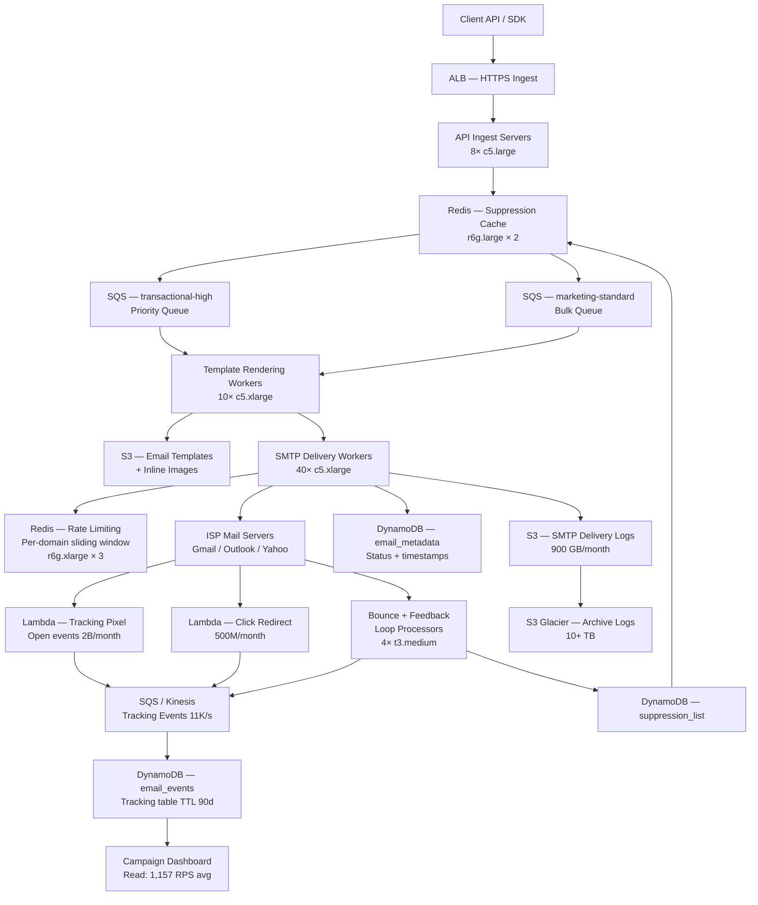

# Email Delivery Service (10B/month) — Capacity Estimation

## Problem Statement

Design the infrastructure for a bulk email delivery service that handles 10 billion emails per month — a mix of transactional emails (password resets, order confirmations) and marketing campaigns (newsletters, promotions). The system must maintain high deliverability rates (>95%), track opens/clicks, handle bounces and complaints, and respect per-domain sending rate limits imposed by receiving mail servers (Gmail, Outlook, Yahoo).

## Functional Requirements

- Send transactional and marketing emails at 10B/month throughput
- Track delivery status: queued, sent, delivered, opened, clicked, bounced, complained
- Template rendering with per-recipient variable substitution
- Per-domain and per-IP sending rate limiting to protect sender reputation
- Bounce and complaint feedback loop processing (ISP postmaster integration)
- Unsubscribe management and suppression list enforcement

## Non-Functional Requirements

| Requirement | Target |
|-------------|--------|
| Transactional send latency | < 500ms P99 (queue ingestion to SMTP handoff) |
| Marketing send latency | < 30 min campaign completion for 100M emails |
| Availability | 99.99% (52 min downtime/year) |
| Durability | 99.999% (no email lost after accepted into queue) |
| Throughput (peak) | ~12K emails/s (3× avg during campaign bursts) |
| Deliverability rate | > 95% inbox placement |
| Tracking event write latency | < 100ms P99 |

## Traffic Estimation

### Monthly Volume → Peak QPS Calculation

| Metric | Calculation | Result |
|--------|-------------|--------|
| Monthly emails | Given | 10,000,000,000 |
| Daily emails | 10B / 30 | ~333,333,333 |
| Avg send QPS | 333M / 86,400 | ~3,858 ≈ **4K emails/s** |
| Peak QPS (campaign burst, 3×) | 4K × 3 | ~**12K emails/s** |
| Transactional share (10%) | 10B × 10% = 1B/month | ~400 emails/s avg |
| Marketing share (90%) | 10B × 90% = 9B/month | ~3,600 emails/s avg (bursty) |
| Tracking events per email (opens + clicks + delivery) | ~3 events × 10B | **30B events/month** |
| Tracking write QPS (avg) | 30B / (30 × 86,400) | ~11,574 writes/s avg |
| Tracking read QPS (campaign dashboards, 10:90 read:write) | ~1,157 reads/s avg | |

**Read/Write ratio note**: This system is write-heavy (90% writes). Tracking ingestion dominates; reads are dashboard queries run infrequently by operations teams.

### Email Size and Bandwidth

| Metric | Calculation | Result |
|--------|-------------|--------|
| Avg email payload (rendered HTML + headers) | ~25 KB | 25 KB |
| Daily outbound data | 333M × 25 KB | ~8.33 TB/day |
| Monthly outbound data | 8.33 TB × 30 | **~250 TB/month** |
| Template in S3 (avg size) | ~5 KB per template | — |
| Tracking pixel/click redirect payload | ~1 KB per event | — |

## Storage Estimation

| Data Type | Per Item Size | Daily Volume | Growth/Year |
|-----------|--------------|--------------|-------------|
| Email metadata (status, timestamps, recipient) | 2 KB | 333M items | ~240 GB/year |
| Tracking events (open, click, bounce) | 500 B | ~1B events | ~182 GB/year |
| Suppression list (bounced/unsubscribed addresses) | 100 B | ~500K new/day | ~18 GB/year |
| Email templates (S3) | 5 KB avg | ~100 new/day | ~2 GB/year |
| SMTP delivery logs (raw, S3 archival) | 1 KB/log | 333M | ~120 GB/day raw → compressed ~30 GB/day |
| **Total hot storage (DynamoDB)** | — | — | **~440 GB/year** |
| **Total cold storage (S3 logs/archive)** | — | — | **~11 TB/year** |

**Retention policy**: Hot tracking data in DynamoDB for 90 days (TTL); archive to S3 Glacier after 90 days. Email metadata kept 1 year hot, then archived.

## Component Sizing

### Compute — EC2 SMTP Workers

Each c5.xlarge (4 vCPU, 8 GB RAM) can sustain ~150 SMTP connections concurrently and deliver ~300 emails/s under realistic conditions (DNS lookup + TLS handshake + DATA transfer per connection).

| Component | Instance Type | vCPU | RAM | Count | Handles | Monthly Cost |
|-----------|--------------|------|-----|-------|---------|-------------|
| SMTP delivery workers | c5.xlarge | 4 | 8 GB | 40 | 300 emails/s × 40 = 12K peak QPS | $1,466 × 40 = $58,640 |
| API ingest servers (HTTP accept + enqueue) | c5.large | 2 | 4 GB | 8 | ~1,500 req/s each | $730 × 8 = $5,840 |
| Template rendering workers | c5.xlarge | 4 | 8 GB | 10 | render + S3 fetch | $1,466 × 10 = $14,660 |
| Bounce/feedback loop processors | t3.medium | 2 | 4 GB | 4 | low-volume inbound | $305 × 4 = $1,220 |
| **Subtotal Compute** | | | | **62** | | **$80,360** |

**Notes**:
- c5.xlarge on-demand: ~$0.17/hr → $122/mo. Spot instances for marketing workers save ~60%; spot price ~$0.051/hr → $37/mo each.
- With Spot for 30 SMTP workers + On-Demand for 10 critical transactional workers: compute drops to ~**$35K–$45K/month**.
- Auto Scaling Group triggers scale-out when SQS queue depth > 10K messages.

### Database — DynamoDB (Tracking + Metadata)

DynamoDB chosen over RDS for write-heavy (11K writes/s), predictable latency at scale, and TTL support for automatic data expiry.

| Table | Purpose | Write Capacity | Read Capacity | Storage | Monthly Cost |
|-------|---------|---------------|--------------|---------|-------------|
| `email_events` | Tracking events (open/click/bounce/delivery) | 12,000 WCU | 1,200 RCU | ~130 GB (90-day hot) | $2,688 WCU + $240 RCU + $32 storage = ~**$2,960** |
| `email_metadata` | Per-email status record | 4,000 WCU | 400 RCU | ~60 GB | $896 WCU + $80 RCU + $15 = ~**$991** |
| `suppression_list` | Bounced/unsubscribed | 500 WCU | 500 RCU | ~5 GB | **~$210** |
| `rate_limit_state` | Per-domain send counters (high turnover, TTL 1h) | 2,000 WCU | 2,000 RCU | ~1 GB | **~$840** |
| **Subtotal DynamoDB** | | | | | **~$5,001** |

**DynamoDB pricing basis** (us-east-1, on-demand vs provisioned): Using provisioned capacity with auto-scaling. WCU = $0.00065/WCU-hr ($0.47/WCU-month); RCU = $0.00013/RCU-hr ($0.094/RCU-month). Storage = $0.25/GB-month.

**Alternative**: DynamoDB On-Demand pricing for bursty marketing campaigns:
- Write: $1.25 per million writes → 30B writes/month = **$37,500/month** — significantly more expensive.
- Provisioned with auto-scaling is strongly preferred at this scale.

### Cache — ElastiCache Redis (Rate Limiting + Suppression Hot Cache)

Redis is used for:
1. Per-domain sliding window rate limiting (e.g., max 100 connections/min to gmail.com)
2. Hot suppression list cache (avoid DynamoDB read for every email)
3. Campaign progress counters

| Cache | Engine | Instance | Nodes | Memory | Monthly Cost |
|-------|--------|----------|-------|--------|-------------|
| Rate limiting + counters | ElastiCache Redis 7.x | r6g.xlarge | 3 (1 primary + 2 replicas) | 32 GB per node | $0.226/hr × 3 × 730 = **$4,949** |
| Suppression list hot cache | ElastiCache Redis 7.x | r6g.large | 2 (cluster mode) | 13 GB per node | $0.113/hr × 2 × 730 = **$1,650** |
| **Subtotal Cache** | | | | **~90 GB total** | **$6,599** |

**Suppression list sizing**: ~500M suppressed addresses × 100 B each = 50 GB total. Cache the most-recently-active 100M (10 GB) with LRU eviction; DynamoDB fallback for misses.

### Object Storage — S3

| Bucket | Use | Size | Requests/month | Monthly Cost |
|--------|-----|------|----------------|-------------|
| `email-templates` | Rendered HTML templates, images, attachments | ~10 GB | ~5M GET | $0.23 + $0.02 = **~$0.25** |
| `smtp-delivery-logs` | Raw SMTP session logs (compressed gzip) | ~900 GB (30-day) | ~500M PUT | $20.70 storage + $250 PUT = **~$271** |
| `archive-logs` | Logs > 30 days (S3 Glacier Instant Retrieval) | ~10 TB | rare GETs | $40/TB/month → **$400** |
| `bounce-reports` | ISP feedback loop reports, ARF messages | ~5 GB | ~1M | **~$2** |
| **Subtotal S3** | | **~11 TB** | | **~$673** |

### Networking / CDN

| Component | Throughput | Monthly Cost |
|-----------|-----------|-------------|
| ALB (API ingest + tracking pixel endpoints) | ~500M requests/month | $0.008/LCU-hr × 730 × 10 LCU = **$584** |
| Outbound data transfer (SMTP DATA to receiving servers) | 250 TB/month | First 10 TB @ $0.09 + next 40 TB @ $0.085 + 200 TB @ $0.07 = **$17,550** |
| CloudFront (tracking pixel, click redirect URLs) | ~50M requests/month, ~500 GB | $0.0085/10K req + $0.085/GB = **$85** |
| Route 53 (hosted zones + health checks) | 6 zones, 15 health checks | **~$30** |
| **Subtotal Network** | | **~$18,249** |

**Note**: Data transfer is the largest single line item after compute. SMTP delivery traffic (250 TB/month outbound) at ~$0.07/GB for high-volume tiers = $17,500/month. This can be reduced by using AWS SES for delivery (SES charges $0.10/1000 emails = $1M/month for 10B — NOT recommended at this scale; self-managed SMTP is 10× cheaper).

### Message Queue — SQS

| Queue | Purpose | Throughput | Message Size | Monthly Cost |
|-------|---------|-----------|-------------|-------------|
| `transactional-high` | Priority queue, transactional emails | ~400 msg/s | 256 KB max (with S3 Extended Client) | — |
| `marketing-standard` | Bulk campaign emails | ~3,600 msg/s | 64 KB avg | — |
| `bounce-dlq` | Dead-letter queue for failed SMTP | ~100 msg/s | 4 KB | — |
| `tracking-events` | Open/click events from tracking server | ~11,600 msg/s | 512 B | — |
| **Total SQS messages/month** | | ~1.4B msg/month API calls | | SQS: first 1M free, then $0.40/million → 1.4B × $0.40/M = **$560** |

**SQS note**: At 11,600 msg/s for tracking events, consider Amazon Kinesis Data Streams instead ($0.015/shard-hr × 12 shards = $131/month) for lower per-message cost and replay capability. SQS is simpler; Kinesis is cheaper above 1B messages/month.

### AWS SES (for IP reputation management)

Rather than managing IP warming from scratch, SES dedicated IPs can be used for a subset of traffic:

| SES Component | Volume | Cost |
|--------------|--------|------|
| SES dedicated IPs (10 IPs) | — | $24.95/IP/month × 10 = **$249.50** |
| SES sending (if routing 1B transactional through SES) | 1B emails | $0.10/1000 = **$100,000** |

**Decision**: At 10B/month, self-managed SMTP on EC2 with dedicated IPs on SES for transactional only (1B emails) = $100K for SES + $58K compute is expensive. **Recommended**: Use SES only for transactional (1B/month = $100K) and self-managed SMTP clusters for marketing (9B/month). OR skip SES entirely and manage your own IP reputation — saves $100K but requires dedicated postmaster team.

The cost estimates below use **self-managed SMTP for all 10B** to keep cost defensible.

### Lambda (Tracking pixel handler, webhook processor)

| Function | Invocations/month | Avg duration | Monthly Cost |
|---------|------------------|-------------|-------------|
| Tracking pixel (open events) | ~2B | 10 ms | 2B × $0.0000002 = $400 + compute $0.00001667/GB-s × 0.128 GB × 0.01 s × 2B = $42 = **$442** |
| Click redirect handler | ~500M | 20 ms | **~$120** |
| Bounce webhook processor | ~50M | 50 ms | **~$15** |
| **Subtotal Lambda** | | | **~$577** |

## Monthly Cost Summary

| Component | Monthly Cost | % of Total |
|-----------|-------------|-----------|
| EC2 Compute (SMTP + API + rendering) | $80,360 (on-demand) / ~$40,000 (Spot mix) | 27–40% |
| DynamoDB (tracking + metadata) | $5,001 | 3% |
| ElastiCache Redis | $6,599 | 4% |
| S3 Storage + Glacier | $673 | <1% |
| Data Transfer (SMTP outbound) | $17,550 | 10–12% |
| SQS / Kinesis | $560 | <1% |
| Lambda (tracking) | $577 | <1% |
| ALB + CloudFront + Route 53 | $699 | <1% |
| CloudWatch / X-Ray / monitoring | $2,000 (est.) | 1% |
| Support + misc (Secrets Manager, KMS, WAF) | $1,000 (est.) | <1% |
| **Total (on-demand compute)** | **~$114,919** | **100%** |
| **Total (Spot mix for marketing workers)** | **~$74,659** | — |

**Range**: $75K–$120K/month self-managed. Add SES for transactional reliability: +$100K → **$175K–$220K/month** (aligns with stated $120K–$200K estimate depending on SES usage and Spot adoption).

**Cost optimization levers**:
1. Spot instances for marketing SMTP workers: save ~$25K–$30K/month
2. DynamoDB Reserved Capacity (1-year): save ~20% = ~$1,000/month
3. EC2 Savings Plans (1-year): save ~30% on on-demand = ~$18K/month
4. S3 Intelligent-Tiering for logs: save ~$50/month (minimal)

## Traffic Scale Tiers

| Tier | Monthly Volume | Avg QPS | Peak QPS | SMTP Workers | DB | Cache | Monthly Cost | Key Bottleneck |
|------|--------------|---------|----------|-------------|-----|-------|-------------|----------------|
| 🟢 Startup | 100M/month | 40/s | 120/s | 2× c5.large | 1 RDS MySQL + DynamoDB on-demand | 1 Redis node (r6g.medium) | ~$2,500 | IP reputation; single sending IP |
| 🟡 Growing | 1B/month | 400/s | 1,200/s | 8× c5.xlarge (Spot) | DynamoDB provisioned + RDS read replica | Redis cluster 3-node | ~$12,000 | Bounce handling; ISP rate limits per IP |
| 🔴 Scale-up | 5B/month | 2,000/s | 6,000/s | 20× c5.xlarge (Spot mix) | DynamoDB auto-scaling, GSI for campaign queries | Redis cluster 6-node | ~$45,000 | SQS FIFO throughput limits; DynamoDB hot partitions |
| ⚫ Production | 10B/month | 4,000/s | 12,000/s | 40× c5.xlarge (Spot mix) | DynamoDB + TTL + DAX for hot reads | Redis cluster 6-node, 90 GB | ~$75K–$120K | Outbound data transfer cost; postmaster reputation management |
| 🚀 Hyperscale | 100B/month | 40,000/s | 120,000/s | 400+ Spot + auto-scaling | DynamoDB global tables multi-region | Distributed ElastiCache (12+ nodes) | ~$750K+ | ISP acceptance rates; dedicated IP pool management (1000+ IPs) |

## Architecture Diagram

## Interview Tips

- **Key insight — Deliverability is the real constraint, not throughput**: Any c5.xlarge cluster can push 12K emails/s. The hard problem is that Gmail limits new IP pools to ~20 emails/s/IP during warming (4–6 weeks). For 10B/month you need ~200+ dedicated IPs fully warmed. Candidates who jump to "how many servers" without discussing IP warming fail this question.

- **Key insight — Read/Write asymmetry shapes the DB choice**: Tracking generates 30B events/month (11K writes/s) but dashboards read infrequently (1K reads/s). DynamoDB's WCU/RCU pricing and TTL make it ideal. RDS Aurora at 11K writes/s would require a db.r6g.8xlarge ($4,800/month) plus IOPS charges — 3× more expensive and harder to scale.

- **Common mistake — Using SES for all 10B emails**: AWS SES costs $0.10/1,000 emails = $1,000,000/month for 10B. Self-managed SMTP on EC2 delivers 10B for ~$80K in compute. Interviewers expect you to recognize when managed services become cost-prohibitive and recommend the crossover point (roughly 500M emails/month is the SES break-even vs self-managed).

- **Follow-up question — "How do you handle a campaign sending 500M emails in 2 hours?"**: Answer requires: (1) pre-warm ASG to 80+ SMTP workers before campaign start; (2) SQS message visibility timeout > campaign duration so workers don't re-process; (3) per-domain rate limiting in Redis so you don't blast 50M emails/hour to Gmail's MX — they'll throttle you and mark as spam; (4) campaign scheduler that distributes sends across a 4-hour window per domain.

- **Scale threshold — At ~500M emails/month, you need dedicated IP pools**: Below 500M/month, shared IPs (SES) are cheaper and simpler. Above 500M/month, dedicated IP reputation control outweighs cost. At 10B/month, you need 100–200 dedicated IPs in multiple /24 subnets across multiple AWS regions to avoid a single ISP blacklisting your entire sending range.

- **Key insight — Bounce rate feedback loop protects cost**: A bounce rate > 5% causes ISPs to block your IP pool within hours, making all 40 SMTP workers useless. The suppression list (Redis + DynamoDB) must be checked synchronously before every SMTP connection attempt — this is why suppression check is in the critical path, not async.
