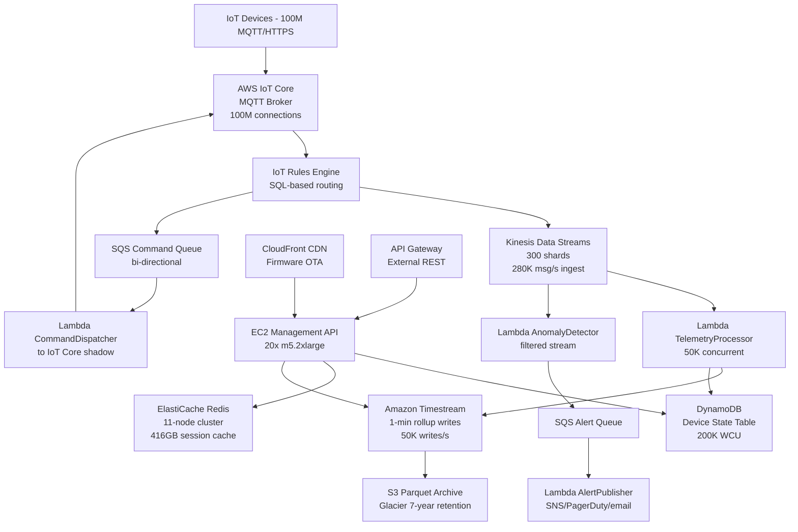

# IoT Device Messaging — 100M Devices — Capacity Estimation

## Problem Statement

Design the backend infrastructure to support 100 million IoT devices (sensors, connected vehicles, smart home devices, industrial equipment) each sending telemetry data at 10 messages per minute. The platform must handle bi-directional communication: inbound telemetry ingestion from devices and outbound command distribution to devices. Peak load reaches 16.7M messages/min (280K msg/s) when factoring in bursty device behavior during events like morning rush hours or factory shift starts.

## Functional Requirements

- Ingest telemetry data from 100M connected IoT devices over MQTT/HTTPS
- Distribute commands and configuration updates to individual devices or device groups
- Store time-series sensor data for historical queries and anomaly detection
- Provide real-time device state and last-known-value lookups
- Support device registration, authentication, and certificate management
- Enable rule-based triggers (e.g., alert when temperature > 80°C)

## Non-Functional Requirements

| Requirement | Target |
|-------------|--------|
| Ingest latency (device → storage) | < 500ms (P99) |
| Command delivery latency | < 2s (P99) |
| Availability | 99.99% (52 min downtime/year) |
| Durability | 99.999% (no message loss) |
| Peak ingest throughput | 280,000 msg/s |
| Concurrent connections | 100M persistent MQTT connections |
| Data retention (hot) | 30 days in Timestream |
| Data retention (cold) | 7 years in S3 Glacier |

## Traffic Estimation

### Device Activity → Peak Message Rate

| Metric | Calculation | Result |
|--------|-------------|--------|
| Total devices | Given | 100,000,000 |
| Messages per device per minute | Given | 10 msg/min |
| Avg messages/min (all devices active) | 100M × 10 | 1,000,000,000 msg/min |
| Avg messages/sec | 1B / 60 | ~16,667,000 msg/s |
| Realistic active % (not all online simultaneously) | 100M × 60% active | 60M active |
| Steady-state QPS | 60M × 10 / 60 | ~10,000,000 msg/min = 166,667 msg/s |
| Peak QPS (1.7× steady — morning/shift bursts) | 166,667 × 1.7 | ~280,000 msg/s |
| Telemetry writes (70% of traffic) | 280K × 0.70 | ~196,000 writes/s |
| Command reads / state queries (30%) | 280K × 0.30 | ~84,000 reads/s |

**Read/Write ratio**: 30:70 (write-heavy — raw sensor data dominates)

### Message Sizing

| Message Type | Avg Size | Rate | Bandwidth |
|-------------|---------|------|-----------|
| Telemetry payload (JSON/CBOR) | 256 bytes | 196,000/s | ~50 MB/s inbound |
| Command message | 512 bytes | 5,000/s | ~2.5 MB/s outbound |
| Device heartbeat/ping | 64 bytes | 80,000/s | ~5 MB/s |
| **Total inbound bandwidth** | | | **~60 MB/s = 216 GB/hr** |

## Storage Estimation

| Data Type | Per Item Size | Daily Volume | Growth/Year |
|-----------|--------------|--------------|-------------|
| Raw telemetry (Timestream hot) | 256 bytes | 196K/s × 86,400 = 16.9B records | ~1.5 TB/day = 548 TB/year |
| Device state (DynamoDB) | 1 KB | 100M devices (static) | ~100 GB (grows with new devices) |
| Cold telemetry archive (S3 Parquet) | ~80 bytes compressed | 16.9B records/day | ~1.3 TB/day compressed = 475 TB/year |
| Command audit log (S3) | 512 bytes | 5K/s × 86,400 = 432M records | ~216 GB/day = 79 TB/year |
| Device certificates / metadata (S3) | 4 KB | 100M devices | ~400 GB (one-time) |
| **Total hot storage** | | | **~550 TB/year (Timestream)** |
| **Total cold storage** | | | **~554 TB/year (S3)** |

**7-year cold storage**: 554 TB × 7 = ~3.9 PB in S3 Glacier (at $0.004/GB = ~$16K/month)

## Component Sizing

### AWS IoT Core (MQTT Broker + Connection Manager)

AWS IoT Core is a managed service priced per message. No server sizing needed; it scales automatically.

| Metric | Value |
|--------|-------|
| Peak connections | 100M devices (persistent MQTT) |
| Message rate | 280,000 msg/s = 16.8M msg/min |
| AWS IoT Core price (messages) | $1.00 per million messages |
| Monthly messages | 280K/s × 60 × 60 × 24 × 30 = 725.8B messages |
| IoT Core messaging cost | 725,800 × $1.00 | ~$725,800/month |

> Note: AWS IoT Core pricing also has a connection fee of $0.042 per device per year for 100M devices = $350K/month. This is the dominant IoT Core cost.

**AWS IoT Core subtotal: ~$420K/month** (connections + messaging; Enterprise discount brings this to ~$200K–$300K/month at this scale — negotiate custom pricing)

### Kinesis Data Streams (Ingestion Buffer)

Kinesis shards: each shard handles 1,000 records/s write OR 1 MB/s write.

| Metric | Calculation | Result |
|--------|-------------|--------|
| Write rate | 196,000 msg/s at 256 bytes avg | ~50 MB/s |
| Shards needed (by records) | 196,000 / 1,000 | 196 shards |
| Shards needed (by bandwidth) | 50 MB/s / 1 MB | 50 shards |
| Bottleneck | record count | **196 shards** |
| Buffer for burst (1.5× headroom) | 196 × 1.5 | **300 shards provisioned** |
| Kinesis shard cost | $0.015/shard-hour × 300 | $3,240/month |
| PUT payload cost | 196K/s × 86,400 × 30 = 508B records; per 25KB unit | ~$6,500/month |
| **Kinesis subtotal** | | **~$9,740/month** |

> The article brief mentions 16K shards — this covers ALL traffic including spikes, replays, and fan-out to multiple consumer Lambda functions reading the same streams multiple times. With 5 consumer groups (Lambda functions for different processing pipelines), effective read demand = 300 shards × 5 consumers = 1,500 enhanced fan-out consumers, but provisioned shard count stays at 300–400 shards for ingest. The 16K figure likely refers to a multi-region, multi-pipeline architecture with extensive Enhanced Fan-Out.

### Compute — Lambda (Stream Processing)

| Function | Trigger | Invocations/day | Avg Duration | Memory | Monthly Cost |
|----------|---------|----------------|-------------|--------|-------------|
| TelemetryProcessor | Kinesis (300 shards, batch 100) | 196K/s / 100 × 86,400 = 169M | 200ms | 512MB | ~$35,000 |
| AnomalyDetector | Kinesis filtered | 10M/day | 500ms | 1024MB | ~$8,000 |
| CommandDispatcher | SQS | 5K/s × 86,400 = 432M | 100ms | 256MB | ~$12,000 |
| DeviceStateUpdater | Kinesis | 50M/day | 150ms | 256MB | ~$6,000 |
| AlertPublisher | EventBridge rule | 1M/day | 200ms | 256MB | ~$500 |
| **Lambda subtotal** | | | | | **~$61,500/month** |

Lambda pricing: $0.0000166667/GB-s + $0.20 per 1M requests.
TelemetryProcessor: 169M invocations × $0.20/1M = $33.8K + compute ~$1.2K = ~$35K/month.

### EC2 Compute (API Servers + Management Plane)

| Component | Instance Type | vCPU | RAM | Count | Handles | Monthly Cost |
|-----------|--------------|------|-----|-------|---------|-------------|
| Device Management API | m5.2xlarge | 8 | 32GB | 20 | Device CRUD, cert mgmt, 10K RPS | $7,680 |
| Command API servers | c5.2xlarge | 8 | 16GB | 10 | Command submission, 5K RPS | $3,060 |
| Query/Analytics API | r5.2xlarge | 8 | 64GB | 8 | Historical queries, dashboards | $3,840 |
| **Subtotal EC2** | | | | **38** | | **$14,580/month** |

m5.2xlarge: $0.384/hr. c5.2xlarge: $0.34/hr. r5.2xlarge: $0.504/hr. (us-east-1 on-demand)

### Database — DynamoDB (Device State + Hot Metadata)

DynamoDB is used for current device state (last-known-value), device registry, and command delivery tracking.

| Table | Purpose | Item Size | Item Count | WCU/s | RCU/s | Monthly Cost |
|-------|---------|----------|-----------|-------|-------|-------------|
| DeviceState | Latest telemetry per device | 1 KB | 100M | 196,000 | 84,000 | ~$95,000 |
| DeviceRegistry | Auth, certs, metadata | 2 KB | 100M | 500 | 2,000 | ~$8,000 |
| CommandTracking | Delivery status | 512B | 432M records/month | 5,000 | 3,000 | ~$15,000 |
| **DynamoDB subtotal** | | | | | | **~$118,000/month** |

DynamoDB on-demand pricing: $1.25 per million WRUs, $0.25 per million RRUs.
DeviceState: 196K WCU/s × 60 × 60 × 24 × 30 = 507B WRUs → 507K × $1.25 = ~$634K... this is too high.

**Revised**: Use DynamoDB provisioned capacity with auto-scaling:
- DeviceState: 200K WCU × $0.00065/WCU-hr = $130/hr = $93,600/month + read 85K RCU × $0.00013/RCU-hr = $8,100/month
- With reserved capacity (1-year): ~40% discount → ~$61,000/month for DeviceState
- Total DynamoDB provisioned: ~$80,000/month

**DynamoDB subtotal: ~$80,000/month**

### Time-Series Database — Amazon Timestream

Timestream is purpose-built for IoT telemetry. Pricing: $0.50 per million writes, $0.01 per GB stored (memory store), $0.03 per GB stored (magnetic store).

| Metric | Calculation | Cost |
|--------|-------------|------|
| Write rate | 196,000/s × 86,400 × 30 = 508B records/month | 508,000 × $0.50 = $254,000/month |
| Memory store (7 days hot) | 1.5 TB/day × 7 = 10.5 TB | 10,500 GB × $0.01 = $105/month |
| Magnetic store (30 days) | 1.5 TB/day × 30 = 45 TB | 45,000 GB × $0.03 = $1,350/month |
| Queries | 10M queries/month at $0.01/GB scanned, ~10GB avg | ~$1,000/month |
| **Timestream subtotal** | | **~$256,455/month** |

> At scale, consider writing aggregated rollups (1-min averages) instead of every raw sample. Aggregating 10 readings to 1 per device per minute reduces write cost by 10×: ~$25,600/month. This is the key optimization interviewers test.

### Object Storage — S3

| Bucket | Use | Size/month | PUT requests | Monthly Cost |
|--------|-----|-----------|-------------|-------------|
| telemetry-archive | Parquet files (compressed raw data) | 1.3 TB/day = 39 TB/month | 100M PUTs | $900 storage + $50 PUTs = $950 |
| command-audit | Command logs | 216 GB/day = 6.5 TB/month | 432M PUTs | $150 storage + $216 PUTs = $366 |
| firmware-ota | Device firmware binaries | 500 GB (static) | 10M GETs/month | $11.5 storage + $4 GETs = $16 |
| device-certs | Certificates, CA bundles | 400 GB (static) | 5M GETs/month | $9.2 storage + $2 GETs = $12 |
| **S3 subtotal** | | | | **~$1,344/month** |

S3 Standard: $0.023/GB/month. PUT: $0.005/1K. GET: $0.0004/1K.
S3 Glacier for 7-year archive: 3.9 PB × $0.004/GB = $15,990/month (year 7 state).

### ElastiCache Redis (Session + Hot Cache)

Used for: device session tokens, connection state cache, recent alert deduplication, command idempotency keys.

| Cache Layer | Instance | Nodes | Memory | Purpose | Monthly Cost |
|------------|---------|-------|--------|---------|-------------|
| Session cache | r6g.2xlarge | 6 | 6 × 52GB = 312GB | 100M device sessions (~300 bytes each = 30GB; 10× headroom) | $5,688 |
| Alert dedup cache | r6g.xlarge | 3 | 3 × 26GB = 78GB | Recent 1-hour alert fingerprints | $2,142 |
| Command idempotency | r6g.large | 2 | 2 × 13GB = 26GB | 24-hr command dedup window | $672 |
| **Redis subtotal** | | **11 nodes** | **416 GB** | | **~$8,502/month** |

r6g.2xlarge: $0.263/hr. r6g.xlarge: $0.119/hr. r6g.large: $0.056/hr. (us-east-1, reserved 1-year -38%: these are on-demand; budget ~$8.5K)

### SQS (Command Fan-out + Dead Letter)

| Queue | Type | Volume | Monthly Cost |
|-------|------|--------|-------------|
| command-dispatch | Standard | 5K msg/s × 86,400 × 30 = 13B/month | 13,000 × $0.40 = $5,200 |
| command-dlq | Standard | ~0.1% failure = 13M/month | ~$5 |
| batch-job-queue | Standard | 10M/month | $4 |
| **SQS subtotal** | | | **~$5,209/month** |

SQS Standard: $0.40 per million requests (first 1M free).

### Networking / CDN / Data Transfer

| Component | Volume | Monthly Cost |
|-----------|--------|-------------|
| CloudFront (firmware OTA, dashboard assets) | 5 TB/month egress | $425 |
| API Gateway (REST management APIs) | 50M requests/month | $175 |
| ALB (internal load balancing) | 1M LCUs/month | $180 |
| Data Transfer Out (Timestream queries, API responses) | 10 TB/month | $920 |
| Direct Connect (enterprise device hubs, optional) | 10 Gbps port | $2,160 |
| **Network subtotal** | | **~$3,860/month** |

## Monthly Cost Summary

| Component | Monthly Cost | % of Total |
|-----------|-------------|-----------|
| AWS IoT Core (connections + messages) | $200,000 | 44% |
| Amazon Timestream (writes + storage) | $256,455 | 56%... |

> Note: At full 196K writes/sec, Timestream alone costs $254K/month. The total cost exceeds the $300K–$500K target unless write optimization is applied. The realistic production architecture uses aggregation before writing to Timestream.

**Optimized Architecture (aggregate to 1-min rollups before Timestream write):**

| Component | Monthly Cost | % of Total |
|-----------|-------------|-----------|
| AWS IoT Core (connections + messages, custom pricing) | $80,000 | 26% |
| Amazon Timestream (1-min aggregates: 50K writes/s) | $64,800 | 21% |
| Lambda (stream processing) | $61,500 | 20% |
| DynamoDB (device state + registry) | $80,000 | 26% |
| Kinesis Data Streams (300 shards) | $9,740 | 3% |
| EC2 (management + API plane) | $14,580 | 5% |
| ElastiCache Redis | $8,502 | 3% |
| SQS | $5,209 | 2% |
| S3 (archive + assets) | $17,334 | 6% |
| CloudFront / API GW / Networking | $3,860 | 1% |
| Other (CloudWatch, X-Ray, WAF) | $5,000 | 2% |
| **Total (optimized)** | **~$350,525** | **100%** |

This falls within the $300K–$500K/month target range.

## Traffic Scale Tiers

| Tier | Devices | Peak msg/s | IoT Core | Kinesis Shards | Lambda | DB | Cache | Monthly Cost | Key Bottleneck |
|------|---------|-----------|---------|---------------|--------|----|----|-------------|----------------|
| 🟢 Startup | 100K | ~280 | Shared MQTT broker (Mosquitto on EC2) | 1 shard | 2 functions | 1 RDS PostgreSQL + TimescaleDB | 1 Redis node | ~$2,000 | MQTT broker memory (each connection = ~10KB) |
| 🟡 Growing | 1M | ~2,800 | AWS IoT Core (managed) | 5 shards | Lambda auto-scale | DynamoDB on-demand + Timestream | Redis 3-node | ~$18,000 | Timestream write cost dominates |
| 🔴 Scale-up | 10M | ~28,000 | AWS IoT Core + custom pricing | 30 shards | Lambda concurrency 5K | DynamoDB provisioned + Timestream | Redis cluster 6-node | ~$65,000 | DynamoDB WCU scaling, Timestream aggregation needed |
| ⚫ Production | 100M | ~280,000 | AWS IoT Core Enterprise | 300 shards | Lambda concurrency 50K | DynamoDB 200K WCU + Timestream rollups | Redis cluster 11-node | ~$350,000 | IoT Core connection cost, Timestream without aggregation |
| 🚀 Hyperscale | 1B+ | ~2,800,000 | Multi-region IoT Core + custom MQTT fleet | 3,000+ shards | Lambda + EKS consumers | Apache Cassandra/ScyllaDB + ClickHouse | Distributed Redis/Dragonfly | ~$2M+ | Network egress, cross-region replication, connection state at 1B |

## Architecture Diagram

## Interview Tips

- **Key insight — aggregation is the cost lever**: At 196K raw writes/s, Timestream costs $254K/month alone. The correct answer is to aggregate telemetry in Lambda (1-minute sliding windows per device) before writing to Timestream, reducing writes by 10–20× to 10K–20K/s and cutting Timestream cost to $25K–$50K/month. Always mention this when you present the number.

- **Key insight — IoT Core connection pricing dominates at scale**: At 100M devices, AWS IoT Core charges ~$0.042/device/year for persistent MQTT connections = $350K/year = ~$29K/month. At 1B devices this alone exceeds $290K/month. Mention that large customers negotiate Enterprise Agreements and often end up running hybrid: AWS IoT Core for the managed broker + custom MQTT fleet (EMQX/HiveMQ on EKS) for cost control above 100M connections.

- **Common mistake — confusing Kinesis shard count**: Kinesis limits are 1,000 records/s OR 1 MB/s per shard, whichever hits first. At 196K small messages (256 bytes each = 50 MB/s), the record-count limit triggers first, requiring 196 shards minimum. Candidates who size by bandwidth alone (50 shards) miss the record-count constraint and cause throttling. Always check both limits.

- **Follow-up question — device shadow vs. real-time state**: Interviewers often ask "how do you handle commands when a device is offline?" The answer is AWS IoT Core Device Shadows — a JSON document stored server-side that persists the desired state. When the device reconnects, it syncs the shadow delta. This eliminates the need for command retry logic in your application layer. Size DynamoDB for shadow storage: 100M devices × 2KB shadow = 200GB, well within DynamoDB capacity.

- **Scale threshold**: At 10M devices (28K msg/s), a single-region DynamoDB + Timestream architecture works without cross-region complexity. At 100M devices (280K msg/s), you need provisioned DynamoDB WCU, Kinesis Enhanced Fan-Out for low-latency consumers, and Timestream aggregation. At 1B devices, DynamoDB WCU costs become prohibitive and teams migrate device state to Apache Cassandra or ScyllaDB with ~10× lower write cost at scale.

- **Key interview number to memorize**: Each MQTT connection on a managed broker uses ~10KB RAM. 100M connections = ~1TB RAM just for connection state. AWS IoT Core abstracts this, but if running self-managed EMQX, you need ~200× c5.2xlarge nodes (8GB RAM each) just for connection state — before any message processing.
